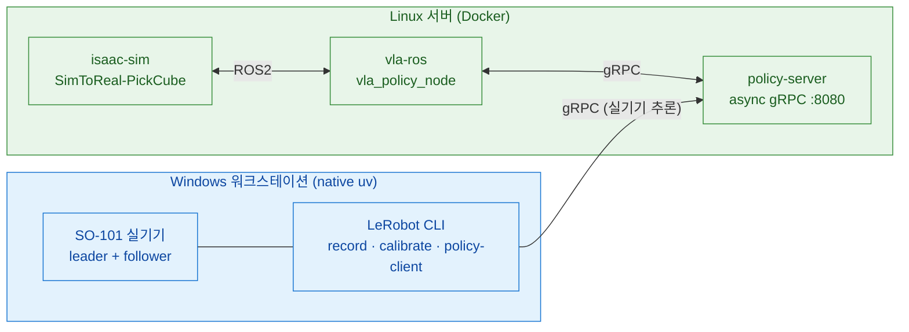

# SO-ARM101 Sim-to-Real

SO-ARM101 6축 로봇 팔용 **Sim-to-Real 파이프라인**. Isaac Sim 5.1 시뮬레이션에서 VLA 정책(ACT · SmolVLA · GR00T-N1.5)을 학습·검증하고, 실기기 SO-101 에 배포한다.

작업은 **2대의 머신**으로 나뉜다.

- **Windows 워크스테이션** — 실기기 SO-101 직결. **native uv**(WSL·Docker 없음)로 teleop·record·calibrate·setup-motors·policy-client.
- **Linux 서버** — 시뮬·학습·추론 서버. **전부 Docker**로 Isaac Sim 폐루프, VLA 학습, policy-server.

스택: **Isaac Sim 5.1 · Isaac Lab 2.3.2 · LeRobot 0.5.1(policy-server)/0.4.4(실기기 CLI) · ROS 2 Jazzy**.

## 목차 <!-- omit in toc -->

- [아키텍처 — 2-머신](#아키텍처--2-머신)
- [실행 경로](#실행-경로)
- [LeRobot v0.6.0 소스 분석 (참고 구현)](#lerobot-v060-소스-분석-참고-구현)
- [현재 PickCube 환경·에셋·cuRobo 평가](#현재-pickcube-환경에셋curobo-평가)
- [환경 요구사항](#환경-요구사항)
- [사전 설치 확인](#사전-설치-확인)
- [공통 준비](#공통-준비)
- [경로별 가이드](#경로별-가이드)
- [저장소 레이아웃](#저장소-레이아웃)
- [관련 문서](#관련-문서)
- [Reference](#reference)

---

## 아키텍처 — 2-머신

| | Windows 워크스테이션 | Linux 서버 |
|---|---|---|
| **역할** | 실기기 SO-101 제어 | 시뮬·학습·추론 서버 |
| **실행** | native uv + `pyproject.toml` (WSL·Docker 없음) | Docker (전부) |
| **작업** | teleop · record · replay · calibrate · setup-motors · find-port · policy-client | Isaac Sim 폐루프 · VLA 학습 · policy-server · sim policy-client(vla-ros) |
| **LeRobot** | 0.4.4 (pyproject `teleop`+`async`) | 0.5.1 (policy-server 독립 핀) |
| **로봇 I/O** | COM 포트 직결 (usbipd/WSL 불필요) | 로봇 직결 없음 (sim/추론만) |
| **GPU** | RTX A4000 16GB (실기기 CLI 는 GPU 불요) | RTX PRO 5000 Blackwell 48GB |



---

## 실행 경로

| 경로 | 머신 | 진입점 | 용도 |
|---|---|---|---|
| **실기기 LeRobot** | Windows (native uv) | `uv run lerobot-<mode>` | teleop · record · calibrate · setup-motors · find-port |
| **실기기 VLA 추론** | Windows (native uv) | `uv run python -m lerobot.async_inference.robot_client` | policy-client → Linux policy-server gRPC |
| **sim VLA 폐루프** | Linux (Docker) | `docker compose up policy-server isaac-sim vla-ros` | `SimToReal-SO101-PickCube-Eval-v0` closed-loop 평가 (디바운스 성공; 데이터생성은 `-DR-v0`) |
| **sim SM 데이터 생성** | Linux (Docker) | isaac-sim `datagen` 모드 (`record_state_machine.py`) | State Machine 데모 → LeRobot v3 (GPU 런타임 검증 진행 중) |
| **VLA 학습** | Linux (Docker) | policy-server `train` | SmolVLA · ACT · GR00T-N1.5 (모두 네이티브) |
| **sim 수동 teleop** (보조) | Linux (host uv) | `uv run scripts/.../teleop_se3_agent.py` | Isaac Lab 로컬 teleop · USD 씬 author |

> **추론 백엔드는 1개**: `policy-server`(gRPC). 실기기 policy-client(Windows)와 sim vla-ros(Linux)가 같은 서버에 접속한다.

---

## LeRobot v0.6.0 소스 분석 (참고 구현)

`ref_repos/lerobot` v0.6.0(commit [`30da8e6`](https://github.com/huggingface/lerobot/tree/30da8e687a6dfc617fcd94afc367ac7071c376ce))
소스를 읽고 정리한 **다음 버전 설계 검토용 참고 자료**다 — train 파이프라인·policy별 분기·
async inference gRPC 계약·지원 범위. 현재 실행 스택(0.4.4 / 0.5.1)은 그대로다.

> 전문 = [`docs/LEROBOT_V060_ANALYSIS.md`](docs/LEROBOT_V060_ANALYSIS.md) ·
> **이 저장소가 실제로 쓰는** gRPC 계약 = [`docs/spec/07_INTERFACES.md §8`](docs/spec/07_INTERFACES.md)

---

## 현재 PickCube 환경·에셋·cuRobo 평가

현재 정량평가 기준 환경은 `SimToReal-SO101-PickCube-DR-v0`이다. 한 환경에 SO-101 follower,
40 mm `Cube1` 한 개, 그릇 한 개, 책상과 top/wrist/front 카메라가 있으며, 큐브를 집어 그릇에
놓는 과정을 Isaac Sim 물리로 판정한다.

<table>
  <tr>
    <td width="50%"></td>
    <td width="50%"></td>
  </tr>
  <tr>
    <td align="center"><sub>현재 Isaac Sim 장면: Cube1 한 개·그릇·SO-101, 매트 없음</sub></td>
    <td align="center"><sub>실물 에셋 원형: 40/50 mm 펠트 큐브와 플라스틱 그릇</sub></td>
  </tr>
</table>

### 등록 환경

Gym 환경 6종 — base substrate 1개 + PickCube 5변형(DR-off 기본 · full/base DR · Eval 디바운스).

| Gym ID | 한 줄 |
|---|---|
| `SimToReal-SO101-Teleop-v0` | 로봇·책상·조명 base substrate (태스크 없음) |
| `SimToReal-SO101-PickCube-v0` | **기본** — 고정 실측 배치, 결정적 |
| `SimToReal-SO101-PickCube-DR-v0` | full DR — datagen·cuRobo sweep |
| `SimToReal-SO101-PickCube-DRBase-v0` | 좁은 사각형 DR |
| `SimToReal-SO101-PickCube-Eval-v0` | 디바운스 성공 — 재현성 최고 평가 |
| `SimToReal-SO101-PickCube-DR-Eval-v0` | DR + 디바운스 |

> 관측·액션·씬·DR 의 **계약 수준 수치 전체**(obs shape, actuator gain, 스폰 영역 상수, 상수 대장)
> = [`docs/spec/03_ENV_SPEC.md`](docs/spec/03_ENV_SPEC.md)

### 에셋 형상과 치수

| 에셋 | 요약 |
|---|---|
| **SO-101 follower** | 팔 5축 + gripper 1축. Isaac mesh collider + cuRobo **54-sphere / 9-link** 근사 |
| **큐브** | Cube1/2 = 40 mm·35 g, Cube3/4 = 50 mm·55 g 펠트 rounded box. **현재 task 는 Cube1 한 개만 활성**. 충돌 = `convexHull` |
| **그릇** | 상단 Ø150 · 바닥 Ø65 · 높이 70 mm, 250 g. 오목 내부 보존 watertight mesh + `convexDecomposition` |
| **책상** | 1,600 × 800 × 25 mm, 상판 높이 **705 mm** |
| **카메라** | top · wrist · front RGB 3-view (640×480). 렌더 시 `--enable_cameras` 필요 |

> 전체 치수·물리 상수·충돌 근사 규약 = [`docs/spec/03_ENV_SPEC.md §9`](docs/spec/03_ENV_SPEC.md) ·
> 왜 큐브가 SDF 가 아니라 convexHull 인가 = [`docs/spec/09_TACIT_KNOWLEDGE.md §2`](docs/spec/09_TACIT_KNOWLEDGE.md)

cuRobo 는 삼각 mesh 를 직접 충돌검사하지 않고 54개 sphere 로 근사한다.

<table>
  <tr>
    <td width="33%"></td>
    <td width="33%"></td>
    <td width="33%"></td>
  </tr>
  <tr>
    <td align="center"><sub>visual mesh</sub></td>
    <td align="center"><sub>54-sphere collision model</sub></td>
    <td align="center"><sub>mesh/sphere overlay</sub></td>
  </tr>
</table>

### DR 큐브 스폰 영역

full DR 은 env-local 좌우대칭 **종형(bell)** 영역에서 큐브를 스폰하고, 로봇암 제외 박스 ·
그릇 이격 · **shoulder-pan 축 기준** 최소 도달거리로 잘라낸다. 그릇은 반경 0.44 m 원호에서
−4°~+8° 로 움직이며, 조명·카메라 focal·로봇 색·큐브 마찰/질량 randomization 이 추가된다.

기하의 **단일 소스**는 `src/sim_to_real/tasks/pick_cube/spawn_area.py` 다 — env cfg · sweep ·
plot 세 곳이 이 모듈을 공유한다.

> 상수 전체 = [`docs/spec/03_ENV_SPEC.md §11`](docs/spec/03_ENV_SPEC.md) ·
> 왜 마운트 원점이 아니라 pan 축 기준인가 =
> [`docs/spec/09_TACIT_KNOWLEDGE.md §3.1`](docs/spec/09_TACIT_KNOWLEDGE.md)


### cuRobo state machine 정량평가 — 54-sphere 최종

`assets/robots/so101.yml`의 **현재 54-sphere 모델**만 사용해 처음부터 재실행한 결과다.
모든 실행은 `num_envs=64`, 실패 셀 재시도 없음, planning 성공과 Isaac 물리 place 성공을
각각 집계했다. 이전 collision-sphere 모델의 중간 결과와 targeted failure replay는 아래 최종 집계에서 제외했다.

| yaw 조건 | seed | 셀 × trial | planning | place | 성공률 | 경과시간 |
|---|---:|---:|---:|---:|---:|---:|
| zero | 0 | 183 × 1 | 183/183 | **183/183** | **100.00%** | 17m 56s |
| random | 0 | 145 × 3 | 435/435 | **435/435** | **100.00%** | 49m 30s |
| random | 1 | 145 × 3 | 435/435 | **435/435** | **100.00%** | 49m 57s |
| random | 2 | 145 × 3 | 435/435 | **435/435** | **100.00%** | 51m 16s |
| **random 합계** | 0–2 | 145 × 9 | 1305/1305 | **1305/1305** | **100.00%** | 2h 30m 43s |


<table>
  <tr>
    <td width="50%"></td>
    <td width="50%"></td>
  </tr>
  <tr>
    <td align="center"><sub>yaw-zero: 183/183, 경계 108/108</sub></td>
    <td align="center"><sub>yaw-random seed 0: 435/435 (145셀 × 3회)</sub></td>
  </tr>
</table>

64-env 실행의 실측 peak VRAM은 **34,110 MiB / 48,935 MiB**였고 OOM이나 48/32-env fallback은 없었다.
grasp manifold, chord-center 보정, 5-frame contact hold와 재현 명령은
[`scripts/cuRobo/README.md`](scripts/cuRobo/README.md)에 정리돼 있다.

---

## 환경 요구사항

### 소프트웨어

| 항목 | Windows (실기기) | Linux (시뮬·학습) |
|---|---|---|
| OS | Windows 11 Pro | Ubuntu 24.04 LTS |
| uv | 최신 (Astral) | 최신 (host uv 보조 경로용) |
| Docker | **불필요** | Docker + NVIDIA Container Toolkit |
| NVIDIA Driver | (Isaac Sim 로컬 실행 시) 580+ | 580+ (CUDA 12.8 컨테이너) |
| WSL2 / usbipd | **불필요 (제거됨)** | 해당 없음 |
| Python | 3.11 (uv 가 관리) | 3.11 (컨테이너) |

### 하드웨어

| 장치 | 수량 | 비고 |
|---|---|---|
| SO-101 Leader / Follower Arm | 각 1 | Feetech STS3215 서보 × 6 |
| USB-Serial 어댑터 | 2 | CH343 칩 (Windows COM 포트) |
| 카메라 | 1~3 | top · wrist · front. `ENABLED_CAMERAS` 로 부분집합 선택 |
| NVIDIA GPU (RT 코어 + 16GB+) | 1 (Linux 서버) | 시뮬·학습·추론. **H100/A100 은 RT 코어 부재로 Isaac Sim 미지원**. RTX A4000/A5000/A6000·L40(S)·RTX 6000 Ada·RTX PRO 5000/6000 Blackwell·GeForce RTX 40/50 등 |

### 핵심 의존성

| 패키지 | 버전 | 위치 |
|---|---|---|
| Python | 3.11 (호스트) / 3.12 (policy 이미지) | |
| torch | 2.7.0+cu128 | 공용 |
| lerobot | 0.4.4 | 실기기 native uv (`teleop`+`async`) |
| lerobot[smolvla,async] | 0.5.1 | `policy-server` 이미지 |
| isaacsim / isaaclab | 5.1.0 / 2.3.2 | `isaac` 그룹 |

> ⚠ **ABI 호환성 핀이라 임의 `uv lock --upgrade` 금지.** 핀 8종·이유·"어기면" 전체 =
> [`docs/spec/06_RUNTIME_SPEC.md §7`](docs/spec/06_RUNTIME_SPEC.md) ·
> 증상별 대응 = [`docs/TROUBLESHOOTING.md`](docs/TROUBLESHOOTING.md)

---

## 사전 설치 확인

```bash
# Windows (Git Bash) — 실기기
uv --version

# Linux 서버 — 시뮬·학습
docker --version
nvidia-smi          # Driver 580+ / CUDA 12.8+
```

미설치 항목은 공식 가이드 참고: [uv](https://docs.astral.sh/uv/getting-started/installation/) · [Docker + NVIDIA Container Toolkit](https://docs.nvidia.com/datacenter/cloud-native/container-toolkit/latest/install-guide.html).

---

## 공통 준비

### Hub / W&B 인증

```bash
uv run hf auth login        # 또는 export HF_TOKEN=hf_xxx
uv run wandb login          # 선택
```

### `.env` 작성

두 머신이 각자 `.env` 를 둔다. `.env.example` 를 복사해 채운다.

```bash
cp .env.example .env
```

먼저 채워야 하는 것은 세 가지다.

| 변수 | 내용 |
|---|---|
| `HF_TOKEN` · `HF_USER` | Hub 인증 (§0) |
| **`POLICY_PROFILE`** | 활성 모델 1줄 선택 — `smolvla` \| `groot_n15` \| `act` (§1) |
| `TELEOP_PORT` · `ROBOT_PORT` | 실기기 직렬 포트 (§2, Windows=COM) |

- **Linux (Docker)**: compose 가 `--env-file .env` + `env/${POLICY_PROFILE}.env` 로 컨테이너에 주입.
- **Windows (native uv)**: 자동 로드 안 됨 → 셸에서 직접 로드: `set -a; source .env; set +a`.

> 9섹션 **69변수 전체**(이름·기본값·소비 서비스)와 모델 프로필 차이표 =
> [`docs/spec/06_RUNTIME_SPEC.md §5, §6`](docs/spec/06_RUNTIME_SPEC.md)

---

## 경로별 가이드

### Windows native uv — 실기기

WSL·Docker·usbipd 없이 Git Bash 에서 직접 실행한다.

```bash
# 1) 실기기 의존성 설치
uv sync --group teleop --group async

# 2) .env 로드 (Git Bash)
set -a; source .env; set +a

# 3) 포트 감지 · 모터 셋업 · 캘리브레이션
uv run lerobot-find-port
uv run lerobot-setup-motors --robot.type=so101_follower --robot.port=$ROBOT_PORT
uv run lerobot-calibrate    --robot.type=so101_follower --robot.port=$ROBOT_PORT --robot.id=$ROBOT_ID

# 4) 데이터 수집 (record)
uv run lerobot-record \
  --robot.type=so101_follower --robot.port=$ROBOT_PORT --robot.id=$ROBOT_ID \
  --teleop.type=so101_leader  --teleop.port=$TELEOP_PORT --teleop.id=$TELEOP_ID \
  --dataset.repo_id=$HF_DATASET_REPO_ID --dataset.single_task="$SINGLE_TASK" \
  --dataset.num_episodes=$NUM_EPISODES --dataset.fps=$RECORD_FPS

# 5) 실기기 VLA 추론 (policy-client → Linux policy-server)
uv run python -m lerobot.async_inference.robot_client \
  --server_address=$POLICY_SERVER_ADDRESS \
  --policy_type=$POLICY_TYPE --task="$TASK" \
  --actions_per_chunk=$ACTIONS_PER_CHUNK --chunk_size_threshold=$CHUNK_SIZE_THRESHOLD \
  --robot.type=so101_follower --robot.port=$ROBOT_PORT --robot.id=$ROBOT_ID
```

> 정확한 인자 전체는 `uv run lerobot-record --help` 등으로 확인. `--robot.type` 이 거부되면(huggingface/lerobot#3078) robot config 선(先)import 또는 lerobot 0.4.5+ 사용.

### Linux Docker — sim VLA 폐루프

```bash
# 3-서비스 폐루프 (SmolVLA · ACT · GR00T-N1.5 — 모두 policy-server 네이티브)
docker compose --env-file .env -f docker/docker-compose.yaml up policy-server isaac-sim vla-ros
```

`scripts/inference/demo_vla.sh start <act|smolvla|groot>` 가 정책 서버·bridge·vla-ros 를 자동 배선한다(livestream :49100). `--eval` 모드로 closed-loop 평가. 세부는 `AGENTS.md` §시뮬레이션 환경.

### Linux Docker — VLA 학습

```bash
# SmolVLA / ACT / GR00T-N1.5 — 모두 lerobot 네이티브 policy-server train
# (모델 선택 = .env 의 POLICY_PROFILE: smolvla | act | groot_n15)
docker compose -f docker/docker-compose.yaml run --rm policy-server train
```

데이터셋·출력은 `.env` §5(`HF_DATASET_REPO_ID`/`OUTPUT_DIR`)에서 라우팅. RL(강화학습)은 제거됨 — VLA 지도학습만.

### Linux Docker — policy-server

```bash
docker compose -f docker/docker-compose.yaml up -d policy-server      # 표준 async gRPC (ACT/SmolVLA/GR00T-N1.5)
```

실기기(Windows)·sim(vla-ros) 양쪽 클라이언트의 공용 추론 백엔드.

### Linux host uv — sim 수동 teleop (보조)

Isaac Lab 로컬 작업(수동 teleop, USD 씬 author)용. Docker 가 아닌 host uv `isaac` 그룹.

```bash
uv sync --group isaac
# v0 = DR-off 고정배치(결정적). teleop 데이터 다양성 필요하면 --task SimToReal-SO101-PickCube-DR-v0
uv run scripts/environments/teleoperation/teleop_se3_agent.py --task SimToReal-SO101-PickCube-v0
```

---

## 저장소 레이아웃

| 경로 | 내용 |
|---|---|
| `docs/` | 문서 허브. **`SPEC.md` + `spec/` = 시스템 명세서 정본** (`pics/` 이미지, `videos/` 동영상) |
| `datasets/` | LeRobot v3 데이터셋 |
| `outputs/` | 모델 체크포인트·학습 산출물 |
| `logs/` | 런타임 로그 (`.gitignore`) |
| `scratch/` | **임시물 전용** (smoke test·debug dump — `.gitignore`, 커밋 안 함) |
| `scripts/` | 진입 스크립트 (`<범주>/` 단위) |
| `src/` | `sim_to_real` · `so101_contract` 패키지 |
| `docker/` · `env/` | Docker 빌드·entrypoint · 모델 프로필 |
| `ros2_ws/` | sim VLA 노드(`so101_vla_policy`) — Docker vla-ros 가 빌드 |

> **Linux 서버**: `datasets`·`outputs` 는 용량 큰 HDD 로 symlink (예: `/DISK1/so101-sim2real/{datasets,lerobot_outputs}`).

---

## 관련 문서

| 문서 | 내용 |
|---|---|
| [**`docs/SPEC.md`**](docs/SPEC.md) | **시스템 명세서 정본** (as-built) — env·I/O 계약·데이터 스키마·런타임·인터페이스·파이프라인·암묵지 9종 |
| [`AGENTS.md`](AGENTS.md) | 이 저장소에서 작업하는 규칙 (배치 규약·운영 규칙) |
| [`docs/TROUBLESHOOTING.md`](docs/TROUBLESHOOTING.md) | ABI 불일치 · GPU/드라이버 호환 · 의존성 핀 충돌 · USD/씬 물리 |
| [`docs/PINK_IK_PICKPLACE.md`](docs/PINK_IK_PICKPLACE.md) | pink IK pick-place SM 설계·회고 (⚠ §5·§8 스테일 — `docs/spec/08_PIPELINES.md` §6 참조) |
| [`docs/SIM_REAL_REPLAY_CALIBRATION.md`](docs/SIM_REAL_REPLAY_CALIBRATION.md) | 실기기 → sim replay calibration 진단 서사 |
| [`scripts/cuRobo/README.md`](scripts/cuRobo/README.md) | cuRobo 2-proc pick-place SM 실행법 |

---

## Reference

- [Isaac Sim 5.1 + Isaac Lab 2.3 + LeIsaac on Windows](https://hackmd.io/@asierarranz/rkg1tvT93gx)
- [Teleoperation | LeIsaac Document](https://lightwheelai.github.io/leisaac/docs/getting_started/teleoperation)
- [Policy Training & Inference | LeIsaac Document](https://lightwheelai.github.io/leisaac/docs/getting_started/policy_support)
- [Post-Training Isaac GR00T N1.5 for LeRobot SO-101 Arm](https://huggingface.co/blog/nvidia/gr00t-n1-5-so101-tuning)
- [Train an SO-101 Robot From Sim-to-Real With NVIDIA Isaac](https://docs.nvidia.com/learning/physical-ai/sim-to-real-so-101/latest/index.html)
- [isaac-sim/Sim-to-Real-SO-101-Workshop](https://github.com/isaac-sim/Sim-to-Real-SO-101-Workshop)
- [LeRobot Installation](https://huggingface.co/docs/lerobot/main/installation)
- [uv Installation](https://docs.astral.sh/uv/getting-started/installation/)
