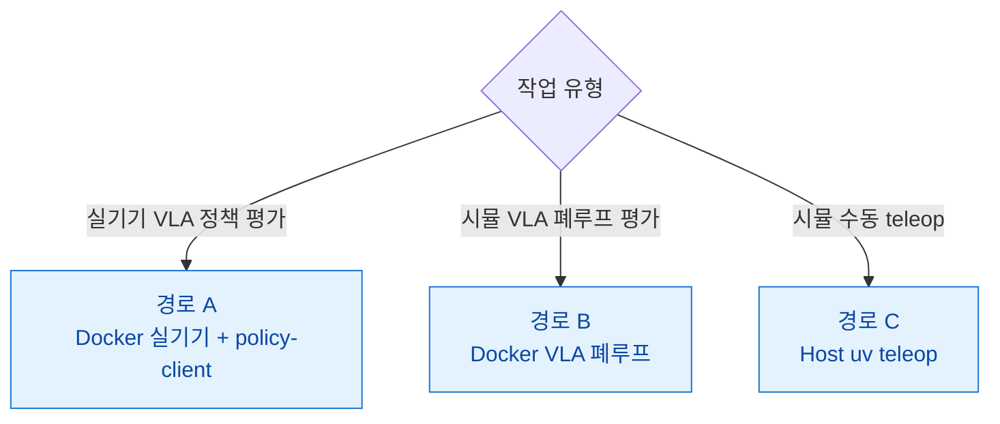

# SO-ARM101 VLA Control System

SO-ARM101 6축 로봇 팔용 **LeRobot 파이프라인 + Isaac Lab Sim-to-Real 시뮬레이션** 통합 저장소.

실기기 텔레오퍼레이션·데이터 수집·정책 학습·추론과 Isaac Sim 시뮬을 세 가지 실행 경로로 제공한다. 호스트 uv 경로(실기기 teleop·Isaac 시뮬)는 `pyproject.toml` 의존성 그룹(`teleop` / `isaac` / `dev`)으로 묶고, `policy-server` Docker 이미지는 LeRobot 0.5.1 을 `pyproject.toml` 과 **독립적으로** 핀한다(Dockerfile.policy 가 `uv pip install` 로 직접 명세 — Isaac override 와 numpy 충돌 회피). `pyproject.toml` 의 `policy` / `async` 그룹은 호스트 참조용. 실기기는 SmolVLA(기본) / GR00T 등 LeRobot 호환 정책을 모두 학습·추론할 수 있다.

## 목차 <!-- omit in toc -->

- [실행 경로](#실행-경로)
- [환경 요구사항](#환경-요구사항)
- [사전 설치 확인](#사전-설치-확인)
- [공통 준비](#공통-준비)
- [경로별 가이드](#경로별-가이드)
- [관련 문서](#관련-문서)
- [Reference](#reference)

---

## 실행 경로 — VLA-only 아키텍처

| 경로 | 진입점 | 용도 | 가이드 |
|---|---|---|---|
| **A. Docker 컨테이너** (실기기) | `docker compose ... run lerobot <mode>` | 실기기 텔레옵, 데이터 수집, policy-client (async VLA 추론) | [PATH_B_DOCKER](docs/PATH_B_DOCKER.md) |
| **B. Docker + VLA 폐루프** (시뮬) | `docker compose up` (policy-server + isaac-sim + vla-ros) | Isaac Sim 5.1 위 `SimToReal-SO101-PickCube-v0` VLA closed-loop 추론 | [Path B 내 VLA 섹션](docs/PATH_B_DOCKER.md) |
| **C. Host uv teleop** (시뮬 수동) | `uv run scripts/environments/teleoperation/teleop_se3_agent.py` | Isaac Lab 시뮬 로컬 teleop, 수동 데이터 수집 (VLA 학습용 데이터셋 미생성) | `AGENTS.md` 참조 |

### 어떤 경로를 선택할까?



| 상황 | 권장 경로 |
|---|---|
| SO-101 실기기에서 VLA 정책(ACT·SmolVLA·GR00T) 구동 | **A** |
| 시뮬레이션에서 VLA closed-loop 폐루프 평가 | **B** |
| 시뮬레이션에서 수동 teleop 테스트 | **C** |
| 원격(서버↔로컬) 텔레옵 수집 | [REMOTE_TELEOP_RECORD](docs/REMOTE_TELEOP_RECORD.md) |

---

## 환경 요구사항

### 소프트웨어

| 항목 | 버전 | 비고 |
|------|------|------|
| Windows | 11 Pro | 본 가이드는 Windows 11 기준 |
| NVIDIA Driver | 580 이상 | CUDA 12.8 컨테이너 / Isaac Sim 5.1 호환 |
| CUDA Toolkit | 12.8 이상 | torch 2.7.0+cu128 매칭 |
| uv | 최신 | Astral 공식 installer |
| Docker Desktop | 최신 | (경로 B) WSL2 backend + GPU 가속 활성 |
| usbipd-win | 5.0 이상 | (경로 B) USB → WSL2 포워딩 |
| Isaac Sim | 5.1.0 | (경로 C) `isaac` 그룹이 자동 설치 |
| Hugging Face 계정 | - | 데이터셋·모델 업로드/다운로드 |
| W&B 계정 | - | 학습 로깅 (선택) |

### 하드웨어

| 장치 | 수량 | 비고 |
|------|------|------|
| NVIDIA GPU (RT 코어 + 16 GB+) | 1 | 시뮬·학습·추론 공통. RTX A4000 / A5000 / A6000 / L40(S) / RTX 6000 Ada / RTX PRO 5000·6000 Blackwell / GeForce RTX 40·50 시리즈 등. **H100 / A100 은 RT 코어 부재로 Isaac Sim 미지원** |
| SO-101 Leader Arm | 1 | Feetech STS3215 서보 × 6 |
| SO-101 Follower Arm | 1 | Feetech STS3215 서보 × 6 |
| USB-Serial 어댑터 | 2 | CH343 칩 (COM 포트) |
| 카메라 | 1~3 | front (전면), wrist (손목), top (탑뷰). `ENABLED_CAMERAS` 로 부분집합 선택 가능 |

### 핵심 의존성

버전은 `pyproject.toml` 에 고정. ABI 호환성 핀이라 임의 `uv lock --upgrade` 금지.

| 패키지 | 버전 | 그룹 |
|---|---|---|
| Python | 3.11 | (필수) |
| torch | 2.7.0+cu128 | (공용) |
| lerobot | 0.4.4 | 실기기 `lerobot` 이미지 (`[feetech]`) |
| lerobot[smolvla,async] | 0.5.1 | `policy-server` 이미지 |
| grpcio | 1.73.1 | `async` |
| isaacsim | 5.1.0 `[all,extscache]` | `isaac` |
| isaaclab | 2.3.2 | `isaac` (`[all,isaacsim]`) |
| ikpy | ≥3.4 | `isaac` (5-DOF IK 백엔드) |
| usd-core | ≥26.5 | (공용) |

ABI 핀: `numpy==1.26.0` / `pyarrow<19` / `datasets<4.7` / `h5py<3.16` / `packaging<26` / `setuptools<82`. 자세한 이유는 [`docs/TROUBLESHOOTING.md`](docs/TROUBLESHOOTING.md) 와 `AGENTS.md` 참고.

---

## 사전 설치 확인

본 가이드는 **NVIDIA Driver · CUDA Toolkit · uv · Docker Desktop · usbipd-win 이 이미 설치되어 있다**고 가정한다. Git Bash 또는 PowerShell 에서 다음으로 빠르게 확인한다.

```bash
nvidia-smi              # Driver 580+ / CUDA 12.8+
uv --version            # 최신
docker --version        # (경로 B)
usbipd --version        # (경로 B)
```

설치되지 않은 항목이 있으면 각 공식 가이드 참고:

- NVIDIA Driver / CUDA: [developer.nvidia.com](https://developer.nvidia.com/cuda-downloads)
- uv: [docs.astral.sh/uv](https://docs.astral.sh/uv/getting-started/installation/)
- Docker Desktop: [docs.docker.com/desktop/windows](https://docs.docker.com/desktop/install/windows-install/) (WSL2 backend + Settings → Resources → GPU 활성)
- usbipd-win: `winget install usbipd` (관리자 PowerShell)

---

## 공통 준비

세 경로 모두에서 공통으로 거치는 단계.

### Hub / W&B 인증

```bash
uv run hf auth login         # 또는 토큰 직접 입력
uv run wandb login           # 선택
```

또는 세션 환경변수로 주입:

```bash
export HF_TOKEN="hf_xxx"
export WANDB_API_KEY="xxx"
```

### `.env` 작성 (경로 B 필수, 경로 A·C 는 참고용)

```bash
cp .env.example .env
```

| 이름 | 설명 |
|-----|------|
| HF_TOKEN | Hugging Face 토큰 ([설정](https://huggingface.co/settings/tokens)) |
| HF_USER | HF 계정 이름 |
| WANDB_API_KEY | W&B API 키 ([설정](https://wandb.ai/settings)) |
| TELEOP_PORT / ROBOT_PORT | 리더/팔로워 직렬 포트 (Docker 는 `/dev/ttyACM*`, uv 는 `COMx`) |
| `*_CAM_PORT` | 카메라 포트 (Docker 는 `/dev/video*`, uv 는 OpenCV index) |
| `CAM_*` | 해상도/FPS/fourcc |
| SINGLE_TASK / HF_DATASET_REPO_ID / NUM_EPISODES 등 | 데이터 수집·학습 파라미터 |

`.env` 는 Docker compose 가 `--env-file` 로 컨테이너에 주입한다. uv 경로는 자동 로드되지 않으므로 [경로 A §복사해서 바꿔 쓰는 Bash 변수](docs/PATH_A_NATIVE.md#복사해서-바꿔-쓰는-bash-변수) 블록을 권장.

---

## 경로별 가이드

**VLA-only 아키텍처**: 실기기 LeRobot + Docker 기반 VLA 추론 (ACT / SmolVLA / GR00T-N1.7).

- **[경로 A — Docker 실기기 + VLA 추론](docs/PATH_B_DOCKER.md)** — usbipd → WSL2 → Docker. LeRobot CLI teleop/record/replay + policy-client (gRPC async VLA 추론). policy-server, gr00t 서비스로 ACT·SmolVLA·GR00T-N1.7 지원.
- **[경로 B — Docker VLA 폐루프 (시뮬)](docs/PATH_B_DOCKER.md)** — 동일 컨테이너에서 `docker compose up`. isaac-sim (official 5.1.0 + ROS2 bridge) + policy-server + vla-ros 세 서비스. `SimToReal-SO101-PickCube-v0` closed-loop 평가.
- **[경로 C — Host uv Teleop (시뮬 수동)](AGENTS.md)** — Host uv 환경에서 `teleop_se3_agent.py` 로컬 teleop. 데이터셋 생성 미지원 (수동 시뮬 점검용).

---

## 관련 문서

| 문서 | 내용 |
|---|---|
| [`docs/TROUBLESHOOTING.md`](docs/TROUBLESHOOTING.md) | ABI 불일치 · GPU/드라이버 호환 · 의존성 핀 충돌 · USD/씬 물리 등 에러 사례 |
| [`docs/REMOTE_TELEOP_RECORD.md`](docs/REMOTE_TELEOP_RECORD.md) | 원격(서버 ↔ 로컬 PC) 텔레옵 데이터 수집 파이프라인 |
| [`docs/OpenUSD_Guide.md`](docs/OpenUSD_Guide.md) | USD 포맷 / 씬 author 참고 |

---

## Reference

- [Isaac Sim 5.1 + Isaac Lab 2.3 + LeIsaac on Windows](https://hackmd.io/@asierarranz/rkg1tvT93gx)
- [Installation | LeIsaac Document](https://lightwheelai.github.io/leisaac/docs/getting_started/teleoperation)
- [Teleoperation | LeIsaac Document](https://lightwheelai.github.io/leisaac/docs/getting_started/teleoperation)
- [Policy Training & Inference | LeIsaac Document](https://lightwheelai.github.io/leisaac/docs/getting_started/policy_support)
- [Post-Training Isaac GR00T N1.5 for LeRobot SO-101 Arm](https://huggingface.co/blog/nvidia/gr00t-n1-5-so101-tuning)
- [Train an SO-101 Robot From Sim-to-Real With NVIDIA Isaac](https://docs.nvidia.com/learning/physical-ai/sim-to-real-so-101/latest/index.html)
- [isaac-sim/Sim-to-Real-SO-101-Workshop](https://github.com/isaac-sim/Sim-to-Real-SO-101-Workshop)
- [LeRobot Installation](https://huggingface.co/docs/lerobot/main/installation)
- [LeRobot Cameras](https://huggingface.co/docs/lerobot/main/en/cameras)
- [uv Installation](https://docs.astral.sh/uv/getting-started/installation/)
- [uv Python management](https://docs.astral.sh/uv/guides/install-python/)
