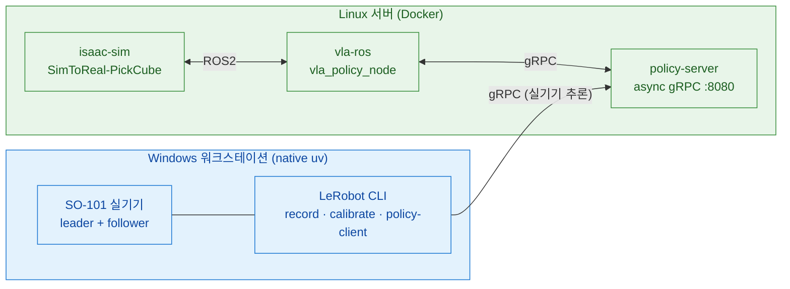
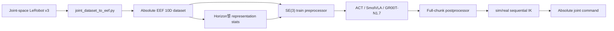

# SO-ARM101 Sim-to-Real

SO-ARM101 6축 로봇 팔용 **Sim-to-Real 파이프라인**. Isaac Sim 5.1 시뮬레이션에서 VLA 정책(ACT · SmolVLA · GR00T-N1.7)을 학습·검증하고, 실기기 SO-101 에 배포한다.

작업은 **2대의 머신**으로 나뉜다.

- **Windows 워크스테이션** — 실기기 SO-101 직결. **native uv**(WSL·Docker 없음)로 teleop·record·calibrate·setup-motors·policy-client.
- **Linux 서버** — 시뮬·학습·추론 서버. **전부 Docker**로 Isaac Sim 폐루프, VLA 학습, policy-server.

스택: **Isaac Sim 5.1 · Isaac Lab 2.3.2 · LeRobot 0.6.0(policy-server / 실기기 전용 uv project) · ROS 2 Jazzy**.

## 목차 <!-- omit in toc -->

- [아키텍처 — 2-머신](#아키텍처--2-머신)
- [실행 경로](#실행-경로)
- [Action representation 파이프라인 (schema v2)](#action-representation-파이프라인-schema-v2)
- [LeRobot v0.6.0 소스 분석 (참고 구현)](#lerobot-v060-소스-분석-참고-구현)
- [현재 PickCube 환경·에셋·cuRobo 평가](#현재-pickcube-환경에셋curobo-평가)
- [환경 요구사항](#환경-요구사항)
- [사전 설치 확인](#사전-설치-확인)
- [공통 준비](#공통-준비)
- [경로별 가이드](#경로별-가이드)
- [저장소 레이아웃](#저장소-레이아웃)
- [관련 문서](#관련-문서)
- [Reference](#reference)

---

## 아키텍처 — 2-머신

| | Windows 워크스테이션 | Linux 서버 |
|---|---|---|
| **역할** | 실기기 SO-101 제어 | 시뮬·학습·추론 서버 |
| **실행** | native uv + `scripts/real/pyproject.toml` (WSL·Docker 없음) | Docker (전부) |
| **작업** | teleop · record · replay · calibrate · setup-motors · find-port · policy-client | Isaac Sim 폐루프 · VLA 학습 · policy-server · sim policy-client(vla-ros) |
| **LeRobot** | 0.6.0 (`scripts/real` 전용 uv project) | 0.6.0 (policy-server 이미지 독립 핀 + EEF patch) |
| **로봇 I/O** | COM 포트 직결 (usbipd/WSL 불필요) | 로봇 직결 없음 (sim/추론만) |
| **GPU** | RTX A4000 16GB (실기기 CLI 는 GPU 불요) | RTX PRO 5000 Blackwell 48GB |



---

## 실행 경로

| 경로 | 머신 | 진입점 | 용도 |
|---|---|---|---|
| **실기기 LeRobot** | Windows (native uv) | `scripts/real/lerobot.sh <mode>` | teleop · record · calibrate · setup-motors · find-port |
| **실기기 VLA 추론** | Windows (native uv) | `scripts/real/lerobot.sh policy-client` | joint fallback 또는 EEF FK/IK client → Linux gRPC |
| **sim VLA 폐루프** | Linux (Docker) | `docker compose --env-file .env -f docker/docker-compose.yaml up policy-server isaac-sim vla-ros` | `SimToReal-SO101-PickCube-Eval-v0` closed-loop 평가 (디바운스 성공; 데이터생성은 `-DR-v0`) |
| **sim SM 데이터 생성** | Linux (Docker) | isaac-sim `datagen` 모드 (`record_state_machine.py`) | State Machine 데모 → LeRobot v3 (GPU 런타임 검증 진행 중) |
| **VLA 학습** | Linux (Docker) | policy-server `train` | ACT · SmolVLA · GR00T-N1.7 + 공통 action representation processor |
| **sim 수동 teleop** (보조) | Linux (host uv) | `uv run scripts/.../teleop_se3_agent.py` | Isaac Lab 로컬 teleop · USD 씬 author |

> **추론 백엔드는 1개**: `policy-server`(gRPC). 실기기 policy-client(Windows)와 sim vla-ros(Linux)가 같은 서버에 접속한다.

---

## Action representation 파이프라인 (schema v2)

LeRobot v3 dataset에는 **그 space의 absolute state/action만** 보존한다. EEF dataset의 canonical
layout은 10D다.

```text
[tcp_grasp xyz(3), Rot6D first two rows(6), absolute gripper feature(1)]
```

relative는 저장 포맷이 아니라 **runtime 변환**이다. 학습 preprocessor가 각 action horizon을 현재
observation 기준 `T_rel = inv(T_state) @ T_action`으로 바꾸고, 추론 postprocessor가 full chunk를
한 번에 `T_action = T_state @ T_rel`로 복원한다. 이후 sim/real client가 같은 URDF·robot YAML로
sequential bounded IK를 수행한다. Rot6D/EEF 벡터의 elementwise 평균은 금지하며 overlap은 IK 이후
`latest_only`로 처리한다.



> 계약·스키마·수치 정본 = [`docs/EEF_RELATIVE_ACTION_PIPELINE_SPEC.md`](docs/EEF_RELATIVE_ACTION_PIPELINE_SPEC.md)

<details>
<summary><strong>학습·추론 좌표계 설정 (action representation 4 mode × EEF pose format 3종)</strong></summary>

#### 1. 좌표계(mode) 4종

| mode | dataset 저장 | 학습 processor | client 경계 |
|---|---|---|---|
| `joint_absolute` | joint-space **absolute** state/action | 변환 없음(canonical 정규화만) | IK **없음**. canonical joint command 직행 |
| `joint_relative` | joint-space **absolute** state/action | chunk 전체를 현재 state 기준 topology-aware Δq로 변환 | IK **없음**. postprocessor가 absolute joint 복원 후 직행 |
| `eef_absolute` | EEF-space **absolute** state/action | 변환 없음(canonical 정규화만) | full chunk → **sequential bounded IK** |
| `eef_relative` | EEF-space **absolute** state/action | chunk 전체를 `T_rel = inv(T_state) @ T_action`로 변환 | full chunk를 `T_state @ T_rel`로 복원 후 **sequential bounded IK** |

- **dataset은 어떤 mode에서도 그 space의 absolute 값만 저장한다.** relative는 학습
  preprocessor가 만들고 추론 postprocessor가 되돌리는 **runtime 변환**이다.
- relative 변환의 기준 state는 chunk 전체가 **동일한 current observation** 하나다
  (프레임 간 temporal delta가 아니다).

#### 2. EEF pose format 3종 (mode가 `eef_*`일 때만)

| 값 | 구성 | 차원 |
|---|---|---|
| `xyz_rot6d_rows` (**project profile 기본값**) | `xyz(3)` + 회전행렬 **첫 두 row**(6) + gripper(1) | 10D |
| `xyz_quaternion_wxyz` | `xyz(3)` + quaternion **wxyz 순서**(4) + gripper(1) | 8D |
| `xyz_rpy` | `xyz(3)` + roll/pitch/yaw(3) + gripper(1) | 7D |

`xyz_rot6d_rows`는 **`env/<profile>.env` 세 profile이 그렇게 설정돼 있다는 뜻**이며 코드의
암묵 기본값이 아니다. `eef_*` mode에서는 pose format을 **항상 명시**해야 한다.

`joint_absolute`/`joint_relative`에서는 pose format을 **반드시 비운다**(빈 문자열).
값을 넣으면 config 단계에서 거부된다.

#### 3. 현재 profile 기본값

`env/act.env` · `env/smolvla.env` · `env/groot_n17.env` 세 profile 모두 동일:

```text
ACTION_REPRESENTATION_MODE=eef_relative
ACTION_REPRESENTATION_POSE_FORMAT=xyz_rot6d_rows
ACTION_REPRESENTATION_STATS_FILE=meta/action_representation_stats.json
```

overlap aggregation은 `latest_only`(EEF/Rot6D 벡터 평균 금지).

#### 4. 학습 시 설정

`env/<profile>.env`의 세 변수를 바꾸면 그 profile의 기본 좌표계가 바뀐다. 학습만
따로 덮어쓰려면 `TRAIN_ACTION_REPRESENTATION_MODE` / `TRAIN_ACTION_REPRESENTATION_POSE_FORMAT`
을 쓴다 — **`TRAIN_*`가 `ACTION_*`보다 우선**한다.

```bash
# profile 기본값(eef_relative + xyz_rot6d_rows)으로 학습
POLICY_PROFILE=act docker compose --env-file .env -f docker/docker-compose.yaml run --rm \
  policy-server train

# 일회성 override — quaternion EEF-relative로 학습 (-e 로 container env 주입)
POLICY_PROFILE=act docker compose --env-file .env -f docker/docker-compose.yaml run --rm \
  -e TRAIN_ACTION_REPRESENTATION_MODE=eef_relative \
  -e TRAIN_ACTION_REPRESENTATION_POSE_FORMAT=xyz_quaternion_wxyz \
  -e ACTION_REPRESENTATION_STATS_FILE=meta/action_representation_stats.json \
  policy-server train

# 일회성 override — joint fallback으로 학습 (pose format은 빈 문자열)
# ACTION_REPRESENTATION_POSE_FORMAT 도 함께 비워야 한다. policy-entrypoint.sh 의
# `${TRAIN_...:-${ACTION_...}}` colon-dash fallback 때문에, 이걸 안 비우면 profile 의
# xyz_rot6d_rows 가 joint mode 로 새어 들어와 config 단계에서 거부된다.
POLICY_PROFILE=act docker compose --env-file .env -f docker/docker-compose.yaml run --rm \
  -e TRAIN_ACTION_REPRESENTATION_MODE=joint_absolute \
  -e TRAIN_ACTION_REPRESENTATION_POSE_FORMAT= \
  -e ACTION_REPRESENTATION_POSE_FORMAT= \
  -e ACTION_REPRESENTATION_STATS_FILE=meta/action_representation_stats.json \
  policy-server train
```

`ACTION_REPRESENTATION_STATS_FILE`이 가리키는 artifact에 해당 mode/format/horizon의
stats profile이 **미리 생성돼 있어야** 한다(아래 §데이터 준비와 학습 2단계).

#### 5. 추론 시 설정

추론 좌표계의 **유일한 source of truth는 checkpoint 안의 `action_representation.json`
manifest**다. 환경변수는 override가 아니라 **optional assertion**이다.

| `ACTION_REPRESENTATION_MODE` / `POSE_FORMAT` | 동작 |
|---|---|
| 비움 | manifest 값을 그대로 수용 |
| manifest와 동일 | 검증 통과 |
| manifest와 불일치 | **motor/sim command를 내기 전에 기동 실패**(fail-fast) |

checkpoint 선택은 `POLICY_REPO_ID`(local dir 또는 HF repo id)로 한다.

```bash
# ① policy-server — checkpoint manifest가 좌표계를 결정. 환경변수는 assertion용
POLICY_PROFILE=act docker compose --env-file .env -f docker/docker-compose.yaml up policy-server

# 좌표계를 명시적으로 확인하고 싶을 때만 assertion을 건다
POLICY_PROFILE=act docker compose --env-file .env -f docker/docker-compose.yaml run --rm \
  -e ACTION_REPRESENTATION_MODE=eef_relative \
  -e ACTION_REPRESENTATION_POSE_FORMAT=xyz_rot6d_rows \
  policy-server policy-server

# ② sim 폐루프 — vla-ros client. 좌표계는 서버 checkpoint manifest에서 유도된다
docker compose --env-file .env -f docker/docker-compose.yaml up policy-server isaac-sim vla-ros

# ③ Windows 실기기 — manifest로 client 종류(EEF FK/IK vs joint 경계)를 자동 분기
scripts/real/lerobot.sh policy-client
```

- 실기기 client는 preflight로 `assert_checkpoint_representation.py --emit client_kind`를
  실행해 manifest에서 client를 고르고, chunk overlap은 `--aggregate_fn_name=latest_only`로
  고정한다. **EEF/Rot6D에 `weighted_average`를 쓰지 않는다** — 회전 표현을 elementwise
  평균하면 유효한 SE(3)가 아니게 된다. overlap 병합은 IK 이후 joint queue에서만 한다.
- EEF mode에서 실기기 motor command는 `EEF_IK_REAL_VALIDATED=true`일 때만 나간다
  (자세한 gate 범위는 §검증과 rollout).

> **주의 — absolute dataset을 relative로 덮어쓰지 말 것.**
> LeRobot v3 dataset에는 언제나 해당 space의 **absolute** state/action만 저장한다.
> relative 값을 미리 계산해 dataset에 덮어써 저장하면 stats fingerprint·manifest·
> postprocessor 복원 기준이 전부 어긋나 이중 변환이 발생한다. 변환은 학습
> preprocessor와 추론 postprocessor에서만 일어난다.

</details>

### 데이터 준비와 학습

```bash
# 1) 원본은 보존하고 absolute joint → absolute EEF Rot6D 파생셋 생성
python scripts/convert/joint_dataset_to_eef.py \
  --input-dir datasets/joint_v3 --output-dir datasets/eef_v3 \
  --source-domain sim --rotation-representation rot6d

# 2) policy horizon별 stats profile을 같은 artifact(meta/action_representation_stats.json)에 추가
#    --all 은 그 dataset이 지원하는 representation(absolute/relative)을 모두 만든다.
python scripts/data/generate_action_representation_stats.py --dataset-root datasets/eef_v3 --horizon 100 --all
python scripts/data/generate_action_representation_stats.py --dataset-root datasets/eef_v3 --horizon 50 --all
python scripts/data/generate_action_representation_stats.py --dataset-root datasets/eef_v3 --horizon 40 --all

# 3) .env의 DATASET_ROOT/HF_DATASET_REPO_ID를 EEF dataset으로 지정하고 profile 선택
POLICY_PROFILE=act       docker compose --env-file .env -f docker/docker-compose.yaml run --rm policy-server train
POLICY_PROFILE=smolvla   docker compose --env-file .env -f docker/docker-compose.yaml run --rm policy-server train
POLICY_PROFILE=groot_n17 docker compose --env-file .env -f docker/docker-compose.yaml run --rm policy-server train
```

`POLICY_PUSH_TO_HUB=false`가 프로젝트 기본값이다. LeRobot v0.6 policy config의 upstream
기본값은 `true`이므로, checkpoint를 실제 Hub에 올릴 때만 `.env`에서 명시적으로
`POLICY_PUSH_TO_HUB=true`로 바꾼다.

학습 checkpoint에는 model/config/processor stats와 함께 `action_representation.json`
(**schema v2**)이 **mode와 무관하게 항상** 저장된다(periodic·final·Hub root). manifest는
mode/pose_format/dim, dataset fingerprint·revision, resolved group indices, stats profile hash,
policy horizon/family, LeRobot/project commit, URDF/YAML hash, selective-reuse report를 기록한다.
추론 server와 platform client는 이를 다시 검증하며 누락·변조·kinematics 불일치 시 시작을 거부한다.
v1 manifest checkpoint는 자동 승격되지 않는다(migration 필요).

### Legacy checkpoint migration

원본은 그대로 두고 새 디렉터리에 v2 checkpoint를 만든다.

```bash
# manifest 없는 legacy checkpoint → joint_absolute (정확한 flag 필수)
python scripts/convert/migrate_action_representation_checkpoint.py \
  --source outputs/train/old/checkpoints/last/pretrained_model \
  --output outputs/train/old/checkpoints/last/pretrained_model_v2 \
  --dataset-root datasets/joint_v3 --horizon 50 \
  --allow-legacy-joint-absolute-checkpoint

# v1 EEF-relative(xyz_rot6d_rows) checkpoint
python scripts/convert/migrate_action_representation_checkpoint.py \
  --source outputs/train/eef/checkpoints/last/pretrained_model \
  --output outputs/train/eef/checkpoints/last/pretrained_model_v2 \
  --dataset-root datasets/eef_v3 --horizon 50

# checkpoint 계약 확인/assertion (local dir 또는 HF repo id)
python scripts/inference/assert_checkpoint_representation.py \
  --checkpoint outputs/train/eef/checkpoints/last/pretrained_model_v2 --json
```

### 계약 검증

```bash
# 계약·processor·FK/IK sweep (CPU)
python scripts/contract/validate_eef_relative_contract.py
python scripts/contract/validate_eef_platform_adapter.py
python scripts/contract/validate_eef_ik_workspace.py

# 24 조합(3 policy × 8 representation) · 실제 CLI checkpoint · migration/routing/CLI assertion
python scripts/contract/validate_action_representation_policies.py --fixture-root scratch/fx --policies act,smolvla,groot
python scripts/contract/validate_action_representation_checkpoint_cli.py --fixture scratch/fx/joint --mode joint_relative
python scripts/contract/validate_action_migration.py --fixture-root scratch/fx
python scripts/contract/validate_action_routing.py
python scripts/contract/validate_representation_cli_assertions.py
```

**24-combination offline matrix**(24 조합 × 13 필수 check)와 **contract-level rollout dry-run**은
Docker `policy-server:0.6.0` 안에서 실행한다 — 그 이미지의 patch가 authoritative다.
provenance(`SO101_PROJECT_GIT_{COMMIT,BRANCH,DIRTY}`)는 host에서 주입해야 worktree 실제 상태가
기록된다. 주입이 없으면 container 안에서 검출을 시도하고, 검출도 못 하면 `dirty: null`(unknown)로
남긴다 — clean으로 단정하지 않는다.

```bash
# 두 runner가 공유하는 실행 옵션
DOCKER_ARGS=(--rm --ipc=host -v "$PWD":/workspace -w /workspace
  -v lerobot_hf_cache:/workspace/.cache/huggingface
  -e HF_HOME=/workspace/.cache/huggingface -e HF_HUB_OFFLINE=1
  -e SO101_PROJECT_GIT_COMMIT=$(git rev-parse HEAD)
  -e SO101_PROJECT_GIT_BRANCH=$(git rev-parse --abbrev-ref HEAD)
  -e SO101_PROJECT_GIT_DIRTY=$([ -n "$(git status --porcelain)" ] && echo true || echo false)
  -e SO101_DOCKER_IMAGE_ID=$(docker inspect --format '{{.Id}}' policy-server:0.6.0)
  --entrypoint python policy-server:0.6.0)

# 24 조합 × 13 필수 check — 실제 policy·SyncInferenceEngine·PolicyServer 사용 (GPU 필요)
docker run --gpus all "${DOCKER_ARGS[@]}" \
  scripts/contract/validate_action_representation_matrix.py \
    --fixture-root scratch/p17-baseline \
    --output scratch/p17-matrix/phase17_24combo.json

# 24 조합 contract-level rollout dry-run — 실제 router/platform adapter/ActionChunkQueue (CPU)
docker run "${DOCKER_ARGS[@]}" \
  scripts/contract/validate_action_representation_rollout_dry_run.py \
    --phase17-artifact scratch/p17-matrix/phase17_24combo.json \
    --output scratch/p18-dry-run/phase18_24combo_dry_run.json

jq -c '.totals' scratch/p17-matrix/phase17_24combo.json
jq -c '.status, .phase18_complete, .totals, .acceptance' scratch/p18-dry-run/phase18_24combo_dry_run.json
```

- 두 runner 모두 **24 조합 전부**가 아니면 실패한다(`--policies` / `--representations`는 개발용
  필터). dry-run runner는 24개 expected combination ID의 **정확한 set**(중복·누락·초과 0)까지
  확인하고, `--policies`에 중복 policy를 주면 argparse 단계에서 거부한다.
- dry-run runner는 **non-promoting**이다. `--sim-eval-report`/`--real-rollout-report`로 외부
  evaluator report를 주면 실제로 load해 `mode`·`status=PASS`·`failures==[]`·`final.event=="final"`
  을 검증하고 path/SHA256을 evidence로 남기지만(`REPORT_VERIFIED`), **`phase18_complete`는 그래도
  false**다. Phase 18 승격은 사람이 spec 상태표/checkbox를 갱신하는 별도 closure 절차다.
- artifact의 `aborts`/`invalid_chunks`/`queue_starvation_ticks`/`empty_chunks`/`stale_chunks` 0은
  장시간 rollout 측정치가 아니라 **정상 경로에서 구조적으로 0**인 값이다. 이 runner가 증명하는
  것은 주입 guard와 evaluator self-test로 확인한 **fail-closed 동작**뿐이고, 실제 rate/threshold
  acceptance는 외부 evaluator report가 담당한다.
- `phase17_artifact`는 **historical 입력**의 형식/SHA256 검증이며 현재 실행 환경과의 동일성
  비교가 아니다. 이번 실행의 provenance는 top-level `provenance_scope`/`git`/`docker_image_id`/
  `lerobot`에 따로 기록된다.

> 현재 검증 상태(as-built): 24-combination offline matrix **24/24 조합 × 13 check = 312/312 PASS**,
> contract-level rollout dry-run **24/24 조합 × 6 stage PASS**. 대표 조합 sim closed-loop은
> `NOT_RUN`(학습된 EEF checkpoint 없음), real guarded rollout은 `BLOCKED_EXTERNAL`(실기기 승인·
> e-stop gate 없음)이다. 단계 정의와 acceptance criteria =
> [`docs/EEF_RELATIVE_ACTION_PIPELINE_SPEC.md`](docs/EEF_RELATIVE_ACTION_PIPELINE_SPEC.md)

### 검증과 rollout

```bash
# 학습된 checkpoint의 recorded target 대비 full-chunk open-loop 비교
docker compose --env-file .env -f docker/docker-compose.yaml run --rm policy-server python \
  /workspace/scripts/inference/evaluate_eef_open_loop.py \
  --checkpoint /workspace/outputs/train/<run>/checkpoints/last/pretrained_model \
  --dataset-root /workspace/datasets/eef_v3 \
  --output /workspace/logs/eef_open_loop.json

# sim closed-loop 1-episode. metrics와 eval JSON을 함께 생성
scripts/inference/demo_vla.sh start act --eval 1 --headless
python scripts/contract/evaluate_eef_rollout_metrics.py \
  --mode sim --metrics logs/eef_sim_rollout.jsonl \
  --eval outputs/vla_eval_act.json

# DR batch는 task/episode 수와 허용 성공률을 명시
scripts/inference/demo_vla.sh start smolvla --eval 20 --headless \
  --task SimToReal-SO101-PickCube-DR-Eval-v0
python scripts/contract/evaluate_eef_rollout_metrics.py \
  --mode sim --metrics logs/eef_sim_rollout.jsonl \
  --eval outputs/vla_eval_smolvla.json --min-success-rate 0.8

# Windows: false=motor-off IK target log, true=실기기 command 승인
EEF_IK_REAL_VALIDATED=false scripts/real/lerobot.sh policy-client
python scripts/contract/evaluate_eef_rollout_metrics.py \
  --mode real-dry-run --metrics logs/eef_real_rollout.jsonl

EEF_IK_REAL_VALIDATED=true  scripts/real/lerobot.sh policy-client
python scripts/contract/evaluate_eef_rollout_metrics.py \
  --mode real --metrics logs/eef_real_rollout.jsonl
```

**안전 gate 범위**: `EEF_IK_REAL_VALIDATED`는 **EEF IK로 산출한 real joint command**에만 걸린다.
joint-space fallback(`joint_absolute`/`joint_relative`)은 IK를 거치지 않으므로 이 EEF-specific
gate의 대상이 **아니며**, 그래서 fallback으로 즉시 선택 가능하다. 대신 joint 경로의 실기기 구동은
이 gate가 아니라 **일반 하드웨어 안전 절차**(작업자 입회·e-stop·감속·workspace 확인)로 별도
통제해야 한다.

---

## LeRobot v0.6.0 소스 분석 (참고 구현)

`ref_repos/lerobot` v0.6.0(commit [`30da8e6`](https://github.com/huggingface/lerobot/tree/30da8e687a6dfc617fcd94afc367ac7071c376ce))
소스를 읽고 정리한 자료다 — train 파이프라인·policy별 분기·async inference gRPC 계약·지원 범위.
현재 실행 스택이 이 버전이며, `docker/lerobot_v060_eef_relative_patch.py`가 그 위에 공통 SE(3)
processor·train/checkpoint manifest·full-chunk sync/async hook을 멱등 적용한다(예상 upstream
source 가 다르면 빌드를 중단하는 트립와이어).

> 전문 = [`docs/LEROBOT_V060_ANALYSIS.md`](docs/LEROBOT_V060_ANALYSIS.md) ·
> **이 저장소가 실제로 쓰는** gRPC 계약 = [`docs/spec/07_INTERFACES.md §8`](docs/spec/07_INTERFACES.md)

---

## 현재 PickCube 환경·에셋·cuRobo 평가

현재 정량평가 기준 환경은 `SimToReal-SO101-PickCube-DR-v0`이다. 한 환경에 SO-101 follower,
40 mm `Cube1` 한 개, 그릇 한 개, 책상과 top/wrist/front 카메라가 있으며, 큐브를 집어 그릇에
놓는 과정을 Isaac Sim 물리로 판정한다.

<table>
  <tr>
    <td width="50%"></td>
    <td width="50%"></td>
  </tr>
  <tr>
    <td align="center"><sub>현재 Isaac Sim 장면: Cube1 한 개·그릇·SO-101, 매트 없음</sub></td>
    <td align="center"><sub>실물 에셋 원형: 40/50 mm 펠트 큐브와 플라스틱 그릇</sub></td>
  </tr>
</table>

### 등록 환경

Gym 환경 6종 — base substrate 1개 + PickCube 5변형(DR-off 기본 · full/base DR · Eval 디바운스).

| Gym ID | 한 줄 |
|---|---|
| `SimToReal-SO101-Teleop-v0` | 로봇·책상·조명 base substrate (태스크 없음) |
| `SimToReal-SO101-PickCube-v0` | **기본** — 고정 실측 배치, 결정적 |
| `SimToReal-SO101-PickCube-DR-v0` | full DR — datagen·cuRobo sweep |
| `SimToReal-SO101-PickCube-DRBase-v0` | 좁은 사각형 DR |
| `SimToReal-SO101-PickCube-Eval-v0` | 디바운스 성공 — 재현성 최고 평가 |
| `SimToReal-SO101-PickCube-DR-Eval-v0` | DR + 디바운스 |

> 관측·액션·씬·DR 의 **계약 수준 수치 전체**(obs shape, actuator gain, 스폰 영역 상수, 상수 대장)
> = [`docs/spec/03_ENV_SPEC.md`](docs/spec/03_ENV_SPEC.md)

### 에셋 형상과 치수

| 에셋 | 요약 |
|---|---|
| **SO-101 follower** | 팔 5축 + gripper 1축. Isaac mesh collider + cuRobo **54-sphere / 9-link** 근사 |
| **큐브** | Cube1/2 = 40 mm·35 g, Cube3/4 = 50 mm·55 g 펠트 rounded box. **현재 task 는 Cube1 한 개만 활성**. 충돌 = `convexHull` |
| **그릇** | 상단 Ø150 · 바닥 Ø65 · 높이 70 mm, 250 g. 오목 내부 보존 watertight mesh + `convexDecomposition` |
| **책상** | 1,600 × 800 × 25 mm, 상판 높이 **705 mm** |
| **카메라** | top · wrist · front RGB 3-view (640×480). 렌더 시 `--enable_cameras` 필요 |

> 전체 치수·물리 상수·충돌 근사 규약 = [`docs/spec/03_ENV_SPEC.md §9`](docs/spec/03_ENV_SPEC.md) ·
> 왜 큐브가 SDF 가 아니라 convexHull 인가 = [`docs/spec/09_TACIT_KNOWLEDGE.md §2`](docs/spec/09_TACIT_KNOWLEDGE.md)

cuRobo 는 삼각 mesh 를 직접 충돌검사하지 않고 54개 sphere 로 근사한다.

<table>
  <tr>
    <td width="33%"></td>
    <td width="33%"></td>
    <td width="33%"></td>
  </tr>
  <tr>
    <td align="center"><sub>visual mesh</sub></td>
    <td align="center"><sub>54-sphere collision model</sub></td>
    <td align="center"><sub>mesh/sphere overlay</sub></td>
  </tr>
</table>

### DR 큐브 스폰 영역

full DR 은 env-local 좌우대칭 **종형(bell)** 영역에서 큐브를 스폰하고, 로봇암 제외 박스 ·
그릇 이격 · **shoulder-pan 축 기준** 최소 도달거리로 잘라낸다. 그릇은 반경 0.44 m 원호에서
−4°~+8° 로 움직이며, 조명·카메라 focal·로봇 색·큐브 마찰/질량 randomization 이 추가된다.

기하의 **단일 소스**는 `src/sim_to_real/tasks/pick_cube/spawn_area.py` 다 — env cfg · sweep ·
plot 세 곳이 이 모듈을 공유한다.

> 상수 전체 = [`docs/spec/03_ENV_SPEC.md §11`](docs/spec/03_ENV_SPEC.md) ·
> 왜 마운트 원점이 아니라 pan 축 기준인가 =
> [`docs/spec/09_TACIT_KNOWLEDGE.md §3.1`](docs/spec/09_TACIT_KNOWLEDGE.md)


### cuRobo state machine 정량평가 — 54-sphere 최종

`assets/robots/so101.yml`의 **현재 54-sphere 모델**만 사용해 처음부터 재실행한 결과다.
모든 실행은 `num_envs=64`, 실패 셀 재시도 없음, planning 성공과 Isaac 물리 place 성공을
각각 집계했다. 이전 collision-sphere 모델의 중간 결과와 targeted failure replay는 아래 최종 집계에서 제외했다.

| yaw 조건 | seed | 셀 × trial | planning | place | 성공률 | 경과시간 |
|---|---:|---:|---:|---:|---:|---:|
| zero | 0 | 183 × 1 | 183/183 | **183/183** | **100.00%** | 17m 56s |
| random | 0 | 145 × 3 | 435/435 | **435/435** | **100.00%** | 49m 30s |
| random | 1 | 145 × 3 | 435/435 | **435/435** | **100.00%** | 49m 57s |
| random | 2 | 145 × 3 | 435/435 | **435/435** | **100.00%** | 51m 16s |
| **random 합계** | 0–2 | 145 × 9 | 1305/1305 | **1305/1305** | **100.00%** | 2h 30m 43s |


<table>
  <tr>
    <td width="50%"></td>
    <td width="50%"></td>
  </tr>
  <tr>
    <td align="center"><sub>yaw-zero: 183/183, 경계 108/108</sub></td>
    <td align="center"><sub>yaw-random seed 0: 435/435 (145셀 × 3회)</sub></td>
  </tr>
</table>

64-env 실행의 실측 peak VRAM은 **34,110 MiB / 48,935 MiB**였고 OOM이나 48/32-env fallback은 없었다.
grasp manifold, chord-center 보정, 5-frame contact hold와 재현 명령은
[`scripts/cuRobo/README.md`](scripts/cuRobo/README.md)에 정리돼 있다.

---

## 환경 요구사항

### 소프트웨어

| 항목 | Windows (실기기) | Linux (시뮬·학습) |
|---|---|---|
| OS | Windows 11 Pro | Ubuntu 24.04 LTS |
| uv | 최신 (Astral) | 최신 (host uv 보조 경로용) |
| Docker | **불필요** | Docker + NVIDIA Container Toolkit |
| NVIDIA Driver | (Isaac Sim 로컬 실행 시) 580+ | 580+ (CUDA 12.8 컨테이너) |
| WSL2 / usbipd | **불필요 (제거됨)** | 해당 없음 |
| Python | 3.12 (`scripts/real` uv project) | 3.11 호스트 / 3.12 policy 컨테이너 |

### 하드웨어

| 장치 | 수량 | 비고 |
|---|---|---|
| SO-101 Leader / Follower Arm | 각 1 | Feetech STS3215 서보 × 6 |
| USB-Serial 어댑터 | 2 | CH343 칩 (Windows COM 포트) |
| 카메라 | 1~3 | top · wrist · front. `ENABLED_CAMERAS` 로 부분집합 선택 |
| NVIDIA GPU (RT 코어 + 16GB+) | 1 (Linux 서버) | 시뮬·학습·추론. **H100/A100 은 RT 코어 부재로 Isaac Sim 미지원**. RTX A4000/A5000/A6000·L40(S)·RTX 6000 Ada·RTX PRO 5000/6000 Blackwell·GeForce RTX 40/50 등 |

### 핵심 의존성

| 패키지 | 버전 | 위치 |
|---|---|---|
| Python | 3.11 (호스트) / 3.12 (policy 이미지·실기기) | |
| torch | 2.7.0+cu128 | 호스트 Isaac 환경 |
| lerobot[async,core_scripts,feetech] | 0.6.0 | 실기기 native uv (`scripts/real`) |
| lerobot[smolvla,async,groot] | 0.6.0 + EEF patch | `policy-server` 이미지 |
| isaacsim / isaaclab | 5.1.0 / 2.3.2 | `isaac` 그룹 |

> ⚠ **ABI 호환성 핀이라 임의 `uv lock --upgrade` 금지.** 핀 8종·이유·"어기면" 전체 =
> [`docs/spec/06_RUNTIME_SPEC.md §7`](docs/spec/06_RUNTIME_SPEC.md) ·
> 증상별 대응 = [`docs/TROUBLESHOOTING.md`](docs/TROUBLESHOOTING.md)

> 루트 `pyproject.toml`/`uv.lock` 은 Isaac Sim 5.1 호환(Python 3.11 · NumPy 1.26) **호스트 sim
> 환경**이다. Windows 실기기에서 이 환경을 재사용하지 않는다.

---

## 사전 설치 확인

```bash
# Windows (Git Bash) — 실기기
uv --version

# Linux 서버 — 시뮬·학습
docker --version
nvidia-smi          # Driver 580+ / CUDA 12.8+
```

미설치 항목은 공식 가이드 참고: [uv](https://docs.astral.sh/uv/getting-started/installation/) · [Docker + NVIDIA Container Toolkit](https://docs.nvidia.com/datacenter/cloud-native/container-toolkit/latest/install-guide.html).

---

## 공통 준비

### Hub / W&B 인증

```bash
uv run hf auth login        # 또는 export HF_TOKEN=hf_xxx
uv run wandb login          # 선택
```

### `.env` 작성

두 머신이 각자 `.env` 를 둔다. `.env.example` 를 복사해 채운다.

```bash
cp .env.example .env
```

먼저 채워야 하는 것은 세 가지다.

| 변수 | 내용 |
|---|---|
| `HF_TOKEN` · `HF_USER` | Hub 인증 (§0) |
| **`POLICY_PROFILE`** | 활성 모델 1줄 선택 — `act` \| `smolvla` \| `groot_n17` (§1) |
| `TELEOP_PORT` · `ROBOT_PORT` | 실기기 직렬 포트 (§2, Windows=COM) |

- **Linux (Docker)**: compose 가 `--env-file .env` + `env/${POLICY_PROFILE}.env` 로 컨테이너에 주입.
- **Windows (native uv)**: `scripts/real/lerobot.sh` 가 루트 `.env` 와 모델 profile 을 자동 로드한다.

> 9섹션 **69변수 전체**(이름·기본값·소비 서비스)와 모델 프로필 차이표 =
> [`docs/spec/06_RUNTIME_SPEC.md §5, §6`](docs/spec/06_RUNTIME_SPEC.md)

---

## 경로별 가이드

### Windows native uv — 실기기

WSL·Docker·usbipd 없이 Git Bash 에서 직접 실행한다. 루트 Isaac 환경이 아니라 **`scripts/real`
전용 uv project**(Python 3.12 · LeRobot 0.6.0)를 쓴다.

```bash
# 1) 실기기 의존성 설치 (최초 1회)
uv sync --project scripts/real

# 2) 포트 감지 · 모터 셋업 · 캘리브레이션 (.env 는 래퍼가 자동 로드)
scripts/real/lerobot.sh find-port
scripts/real/lerobot.sh setup-motors
scripts/real/lerobot.sh calibrate

# 3) teleop · 데이터 수집 · 재생
scripts/real/lerobot.sh teleop
scripts/real/lerobot.sh record
scripts/real/lerobot.sh replay

# 4) 실기기 VLA 추론 (policy-client → Linux policy-server)
#    checkpoint manifest 가 client 종류(EEF FK/IK vs joint 경계)를 결정한다
scripts/real/lerobot.sh policy-client
```

> 변수 → CLI 인자 매핑은 [`docs/spec/08_PIPELINES.md §2`](docs/spec/08_PIPELINES.md).
> policy-client 4 mode 는 모두 `scripts/inference/eef_robot_client.py` 를 거친다(stock client 아님).

### Linux Docker — sim VLA 폐루프

```bash
# 3-서비스 폐루프 (ACT · SmolVLA · GR00T-N1.7 — 모두 policy-server 네이티브)
docker compose --env-file .env -f docker/docker-compose.yaml up policy-server isaac-sim vla-ros
```

`scripts/inference/demo_vla.sh start <act|smolvla|groot>` 가 정책 서버·bridge·vla-ros 를 자동 배선한다(livestream :49100). `--eval` 모드로 closed-loop 평가. 세부는 `AGENTS.md` §시뮬레이션 환경.

### Linux Docker — VLA 학습

```bash
# ACT / SmolVLA / GR00T-N1.7 — 모두 lerobot 네이티브 policy-server train
# (모델 선택 = .env 의 POLICY_PROFILE: act | smolvla | groot_n17)
docker compose --env-file .env -f docker/docker-compose.yaml run --rm policy-server train
```

데이터셋·출력은 `.env` §5(`HF_DATASET_REPO_ID`/`OUTPUT_DIR`)에서 라우팅. RL(강화학습)은 제거됨 — VLA 지도학습만.

### Linux Docker — policy-server

```bash
docker compose --env-file .env -f docker/docker-compose.yaml up -d policy-server   # 표준 async gRPC
```

실기기(Windows)·sim(vla-ros) 양쪽 클라이언트의 공용 추론 백엔드. `CHECKPOINT_PATH` 가 있으면
기동 전에 `scripts/inference/assert_checkpoint_representation.py` 로 checkpoint 계약을 검증한다.

### Linux host uv — sim 수동 teleop (보조)

Isaac Lab 로컬 작업(수동 teleop, USD 씬 author)용. Docker 가 아닌 host uv `isaac` 그룹.

```bash
uv sync --group isaac
# v0 = DR-off 고정배치(결정적). teleop 데이터 다양성 필요하면 --task SimToReal-SO101-PickCube-DR-v0
uv run scripts/environments/teleoperation/teleop_se3_agent.py --task SimToReal-SO101-PickCube-v0
```

---

## 저장소 레이아웃

| 경로 | 내용 |
|---|---|
| `docs/` | 문서 허브. **`SPEC.md` + `spec/` = 시스템 명세서 정본** (`pics/` 이미지, `videos/` 동영상) |
| `datasets/` | LeRobot v3 데이터셋 |
| `outputs/` | 모델 체크포인트·학습 산출물 |
| `logs/` | 런타임 로그 (`.gitignore`) |
| `scratch/` | **임시물 전용** (smoke test·debug dump — `.gitignore`, 커밋 안 함) |
| `scripts/` | 진입 스크립트 (`<범주>/` 단위) |
| `src/` | `sim_to_real` · `so101_contract` 패키지 |
| `docker/` · `env/` | Docker 빌드·entrypoint · 모델 프로필 |
| `ros2_ws/` | sim VLA 노드(`so101_vla_policy`) — Docker vla-ros 가 빌드 |

> **Linux 서버**: `datasets`·`outputs` 는 용량 큰 HDD 로 symlink (예: `/DISK1/so101-sim2real/{datasets,lerobot_outputs}`).

---

## 관련 문서

| 문서 | 내용 |
|---|---|
| [**`docs/SPEC.md`**](docs/SPEC.md) | **시스템 명세서 정본** (as-built) — env·I/O 계약·데이터 스키마·런타임·인터페이스·파이프라인·암묵지 9종 |
| [`docs/EEF_RELATIVE_ACTION_PIPELINE_SPEC.md`](docs/EEF_RELATIVE_ACTION_PIPELINE_SPEC.md) | **action representation schema v2 계약 정본** — 4 mode × 3 pose format, universal manifest, migration, routing, Phase 정의 |
| [`AGENTS.md`](AGENTS.md) | 이 저장소에서 작업하는 규칙 (배치 규약·운영 규칙) |
| [`docs/TROUBLESHOOTING.md`](docs/TROUBLESHOOTING.md) | ABI 불일치 · GPU/드라이버 호환 · 의존성 핀 충돌 · USD/씬 물리 |
| [`docs/PINK_IK_PICKPLACE.md`](docs/PINK_IK_PICKPLACE.md) | pink IK pick-place SM 설계·회고 (⚠ §5·§8 스테일 — `docs/spec/08_PIPELINES.md` §6 참조) |
| [`docs/SIM_REAL_REPLAY_CALIBRATION.md`](docs/SIM_REAL_REPLAY_CALIBRATION.md) | 실기기 → sim replay calibration 진단 서사 |
| [`scripts/cuRobo/README.md`](scripts/cuRobo/README.md) | cuRobo 2-proc pick-place SM 실행법 |

---

## Reference

- [Isaac Sim 5.1 + Isaac Lab 2.3 + LeIsaac on Windows](https://hackmd.io/@asierarranz/rkg1tvT93gx)
- [Teleoperation | LeIsaac Document](https://lightwheelai.github.io/leisaac/docs/getting_started/teleoperation)
- [Policy Training & Inference | LeIsaac Document](https://lightwheelai.github.io/leisaac/docs/getting_started/policy_support)
- [Post-Training Isaac GR00T N1.5 for LeRobot SO-101 Arm](https://huggingface.co/blog/nvidia/gr00t-n1-5-so101-tuning)
- [Train an SO-101 Robot From Sim-to-Real With NVIDIA Isaac](https://docs.nvidia.com/learning/physical-ai/sim-to-real-so-101/latest/index.html)
- [isaac-sim/Sim-to-Real-SO-101-Workshop](https://github.com/isaac-sim/Sim-to-Real-SO-101-Workshop)
- [LeRobot Installation](https://huggingface.co/docs/lerobot/main/installation)
- [uv Installation](https://docs.astral.sh/uv/getting-started/installation/)
