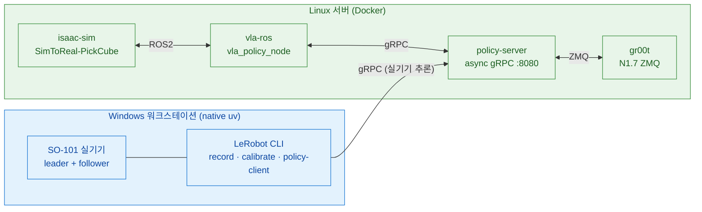

# SO-ARM101 Sim-to-Real

SO-ARM101 6축 로봇 팔용 **Sim-to-Real 파이프라인**. Isaac Sim 5.1 시뮬레이션에서 VLA 정책(ACT · SmolVLA · GR00T-N1.7)을 학습·검증하고, 실기기 SO-101 에 배포한다.

작업은 **2대의 머신**으로 나뉜다.

- **Windows 워크스테이션** — 실기기 SO-101 직결. **native uv**(WSL·Docker 없음)로 teleop·record·calibrate·setup-motors·policy-client.
- **Linux 서버** — 시뮬·학습·추론 서버. **전부 Docker**로 Isaac Sim 폐루프, VLA 학습, policy-server.

스택: **Isaac Sim 5.1 · Isaac Lab 2.3.2 · LeRobot 0.5.1(policy-server)/0.4.4(실기기 CLI) · ROS 2 Jazzy**.

## 목차 <!-- omit in toc -->

- [아키텍처 — 2-머신](#아키텍처--2-머신)
- [실행 경로](#실행-경로)
- [환경 요구사항](#환경-요구사항)
- [사전 설치 확인](#사전-설치-확인)
- [공통 준비](#공통-준비)
- [경로별 가이드](#경로별-가이드)
- [저장소 레이아웃](#저장소-레이아웃)
- [관련 문서](#관련-문서)
- [Reference](#reference)

---

## 아키텍처 — 2-머신

| | Windows 워크스테이션 | Linux 서버 |
|---|---|---|
| **역할** | 실기기 SO-101 제어 | 시뮬·학습·추론 서버 |
| **실행** | native uv + `pyproject.toml` (WSL·Docker 없음) | Docker (전부) |
| **작업** | teleop · record · replay · calibrate · setup-motors · find-port · policy-client | Isaac Sim 폐루프 · VLA 학습 · policy-server · sim policy-client(vla-ros) |
| **LeRobot** | 0.4.4 (pyproject `teleop`+`async`) | 0.5.1 (policy-server 독립 핀) |
| **로봇 I/O** | COM 포트 직결 (usbipd/WSL 불필요) | 로봇 직결 없음 (sim/추론만) |
| **GPU** | RTX A4000 16GB (실기기 CLI 는 GPU 불요) | RTX PRO 5000 Blackwell 48GB |



---

## 실행 경로

| 경로 | 머신 | 진입점 | 용도 |
|---|---|---|---|
| **실기기 LeRobot** | Windows (native uv) | `uv run lerobot-<mode>` | teleop · record · calibrate · setup-motors · find-port |
| **실기기 VLA 추론** | Windows (native uv) | `uv run python -m lerobot.async_inference.robot_client` | policy-client → Linux policy-server gRPC |
| **sim VLA 폐루프** | Linux (Docker) | `docker compose up policy-server isaac-sim vla-ros` | `SimToReal-SO101-PickCube-v0` closed-loop 평가 |
| **sim SM 데이터 생성** | Linux (Docker) | isaac-sim `datagen` 모드 (`record_state_machine.py`) | State Machine 데모 → LeRobot v3 (GPU 런타임 검증 진행 중) |
| **VLA 학습** | Linux (Docker) | policy-server `train` · gr00t `finetune` | SmolVLA/ACT · GR00T-N1.7 |
| **sim 수동 teleop** (보조) | Linux (host uv) | `uv run scripts/.../teleop_se3_agent.py` | Isaac Lab 로컬 teleop · USD 씬 author |

> **추론 백엔드는 1개**: `policy-server`(gRPC). 실기기 policy-client(Windows)와 sim vla-ros(Linux)가 같은 서버에 접속한다.

---

## 환경 요구사항

### 소프트웨어

| 항목 | Windows (실기기) | Linux (시뮬·학습) |
|---|---|---|
| OS | Windows 11 Pro | Ubuntu 24.04 LTS |
| uv | 최신 (Astral) | 최신 (host uv 보조 경로용) |
| Docker | **불필요** | Docker + NVIDIA Container Toolkit |
| NVIDIA Driver | (Isaac Sim 로컬 실행 시) 580+ | 580+ (CUDA 12.8 컨테이너) |
| WSL2 / usbipd | **불필요 (제거됨)** | 해당 없음 |
| Python | 3.11 (uv 가 관리) | 3.11 (컨테이너) |

### 하드웨어

| 장치 | 수량 | 비고 |
|---|---|---|
| SO-101 Leader / Follower Arm | 각 1 | Feetech STS3215 서보 × 6 |
| USB-Serial 어댑터 | 2 | CH343 칩 (Windows COM 포트) |
| 카메라 | 1~3 | top · wrist · front. `ENABLED_CAMERAS` 로 부분집합 선택 |
| NVIDIA GPU (RT 코어 + 16GB+) | 1 (Linux 서버) | 시뮬·학습·추론. **H100/A100 은 RT 코어 부재로 Isaac Sim 미지원**. RTX A4000/A5000/A6000·L40(S)·RTX 6000 Ada·RTX PRO 5000/6000 Blackwell·GeForce RTX 40/50 등 |

### 핵심 의존성

버전은 `pyproject.toml` 에 고정. **ABI 호환성 핀이라 임의 `uv lock --upgrade` 금지.**

| 패키지 | 버전 | 위치 |
|---|---|---|
| Python | 3.11 | (필수) |
| torch | 2.7.0+cu128 | (공용) |
| lerobot | 0.4.4 | 실기기 native uv (`teleop`+`async`) |
| lerobot[smolvla,async] | 0.5.1 | `policy-server` 이미지 (Dockerfile.policy 독립 핀) |
| isaacsim | 5.1.0 `[all,extscache]` | `isaac` 그룹 |
| isaaclab | 2.3.2 `[all,isaacsim]` | `isaac` (직접 의존, 외부 래퍼 제거) |
| ikpy | ≥3.4,<3.5 | `isaac` (PickCube SM IK 백엔드) |

ABI 핀: `numpy==1.26.0` / `pyarrow<19` / `datasets<4.7` / `h5py<3.16` / `torch==2.7.0+cu128` / `torchcodec<0.6` / `packaging<26` / `setuptools<82`. 이유는 [`docs/TROUBLESHOOTING.md`](docs/TROUBLESHOOTING.md) 와 `AGENTS.md` 참고.

---

## 사전 설치 확인

```bash
# Windows (Git Bash) — 실기기
uv --version

# Linux 서버 — 시뮬·학습
docker --version
nvidia-smi          # Driver 580+ / CUDA 12.8+
```

미설치 항목은 공식 가이드 참고: [uv](https://docs.astral.sh/uv/getting-started/installation/) · [Docker + NVIDIA Container Toolkit](https://docs.nvidia.com/datacenter/cloud-native/container-toolkit/latest/install-guide.html).

---

## 공통 준비

### Hub / W&B 인증

```bash
uv run hf auth login        # 또는 export HF_TOKEN=hf_xxx
uv run wandb login          # 선택
```

### `.env` 작성

두 머신이 각자 `.env` 를 둔다. `.env.example` 를 복사해 채운다.

```bash
cp .env.example .env
```

| 블록 | 변수 (발췌) |
|---|---|
| §0 시크릿 | `HF_TOKEN` `HF_USER` `WANDB_API_KEY` |
| §1 모델 프로필 | `POLICY_PROFILE`(smolvla/groot_n15/act) — 활성 모델 1줄 선택 |
| §2 하드웨어 | `TELEOP_PORT` `ROBOT_PORT` `ROBOT_ID` `TELEOP_ID` (Windows=COM, Docker=`/dev/ttyACM*`) |
| §3 카메라 | `ENABLED_CAMERAS` `*_CAM_PORT` `CAM_WIDTH/HEIGHT/FPS` |
| §4 데이터 | `SINGLE_TASK` `HF_DATASET_REPO_ID` `NUM_EPISODES` `RECORD_FPS` |
| §5 학습 | `BATCH_SIZE` `TRAIN_STEPS` `OUTPUT_DIR` (Linux 서버) |
| §6 추론 서버 | `POLICY_SERVER_HOST/PORT` `INFERENCE_LATENCY` `OBS_QUEUE_TIMEOUT` (Linux 서버) |
| §7 추론 클라이언트 | `POLICY_SERVER_ADDRESS` `TASK` `ACTIONS_PER_CHUNK` (실기기) |

- **Linux (Docker)**: compose 가 `--env-file .env` + `env/${POLICY_PROFILE}.env` 로 컨테이너에 주입.
- **Windows (native uv)**: 자동 로드 안 됨 → 셸에서 직접 로드: `set -a; source .env; set +a`.

---

## 경로별 가이드

### Windows native uv — 실기기

WSL·Docker·usbipd 없이 Git Bash 에서 직접 실행한다.

```bash
# 1) 실기기 의존성 설치
uv sync --group teleop --group async

# 2) .env 로드 (Git Bash)
set -a; source .env; set +a

# 3) 포트 감지 · 모터 셋업 · 캘리브레이션
uv run lerobot-find-port
uv run lerobot-setup-motors --robot.type=so101_follower --robot.port=$ROBOT_PORT
uv run lerobot-calibrate    --robot.type=so101_follower --robot.port=$ROBOT_PORT --robot.id=$ROBOT_ID

# 4) 데이터 수집 (record)
uv run lerobot-record \
  --robot.type=so101_follower --robot.port=$ROBOT_PORT --robot.id=$ROBOT_ID \
  --teleop.type=so101_leader  --teleop.port=$TELEOP_PORT --teleop.id=$TELEOP_ID \
  --dataset.repo_id=$HF_DATASET_REPO_ID --dataset.single_task="$SINGLE_TASK" \
  --dataset.num_episodes=$NUM_EPISODES --dataset.fps=$RECORD_FPS

# 5) 실기기 VLA 추론 (policy-client → Linux policy-server)
uv run python -m lerobot.async_inference.robot_client \
  --server_address=$POLICY_SERVER_ADDRESS \
  --policy_type=$POLICY_TYPE --task="$TASK" \
  --actions_per_chunk=$ACTIONS_PER_CHUNK --chunk_size_threshold=$CHUNK_SIZE_THRESHOLD \
  --robot.type=so101_follower --robot.port=$ROBOT_PORT --robot.id=$ROBOT_ID
```

> 정확한 인자 전체는 `uv run lerobot-record --help` 등으로 확인. `--robot.type` 이 거부되면(huggingface/lerobot#3078) robot config 선(先)import 또는 lerobot 0.4.5+ 사용.

### Linux Docker — sim VLA 폐루프

```bash
# 3-서비스 폐루프 (SmolVLA/ACT)
docker compose --env-file .env -f docker/docker-compose.yaml up policy-server isaac-sim vla-ros
# GR00T-N1.7 은 gr00t 서비스 추가
```

`scripts/inference/demo_vla.sh start <act|smolvla|groot>` 가 정책 서버·bridge·vla-ros 를 자동 배선한다(livestream :49100). `--eval` 모드로 closed-loop 평가. 세부는 `AGENTS.md` §시뮬레이션 환경.

### Linux Docker — VLA 학습

```bash
# SmolVLA / ACT / GR00T-N1.5 — 모두 lerobot 네이티브 policy-server train
# (모델 선택 = .env 의 POLICY_PROFILE: smolvla | act | groot_n15)
docker compose -f docker/docker-compose.yaml run --rm policy-server train
```

데이터셋·출력은 `.env` §5(`HF_DATASET_REPO_ID`/`OUTPUT_DIR`)에서 라우팅. RL(강화학습)은 제거됨 — VLA 지도학습만.

### Linux Docker — policy-server

```bash
docker compose -f docker/docker-compose.yaml up -d policy-server      # 표준 async gRPC (ACT/SmolVLA/GR00T-N1.5)
```

실기기(Windows)·sim(vla-ros) 양쪽 클라이언트의 공용 추론 백엔드.

### Linux host uv — sim 수동 teleop (보조)

Isaac Lab 로컬 작업(수동 teleop, USD 씬 author)용. Docker 가 아닌 host uv `isaac` 그룹.

```bash
uv sync --group isaac
uv run scripts/environments/teleoperation/teleop_se3_agent.py --task SimToReal-SO101-PickCube-v0
```

---

## 저장소 레이아웃

| 경로 | 내용 |
|---|---|
| `docs/` | 문서 허브 (`pics/` 이미지, `videos/` 동영상) |
| `datasets/` | LeRobot v3 데이터셋 |
| `outputs/` | 모델 체크포인트·학습 산출물 |
| `logs/` | 런타임 로그 (`.gitignore`) |
| `scratch/` | **임시물 전용** (smoke test·debug dump — `.gitignore`, 커밋 안 함) |
| `scripts/` | 진입 스크립트 (`<범주>/` 단위) |
| `src/` | `sim_to_real` · `so101_contract` 패키지 |
| `docker/` · `env/` | Docker 빌드·entrypoint · 모델 프로필 |
| `ros2_ws/` | sim VLA 노드(`so101_vla_policy`) — Docker vla-ros 가 빌드 |

> **Linux 서버**: `datasets`·`outputs` 는 용량 큰 HDD 로 symlink (예: `/DISK1/so101-sim2real/{datasets,lerobot_outputs}`).

---

## 관련 문서

| 문서 | 내용 |
|---|---|
| [`AGENTS.md`](AGENTS.md) | 내부 구조·규칙·자주 쓰는 명령 (개발자용) |
| [`docs/TROUBLESHOOTING.md`](docs/TROUBLESHOOTING.md) | ABI 불일치 · GPU/드라이버 호환 · 의존성 핀 충돌 · USD/씬 물리 |

---

## Reference

- [Isaac Sim 5.1 + Isaac Lab 2.3 + LeIsaac on Windows](https://hackmd.io/@asierarranz/rkg1tvT93gx)
- [Teleoperation | LeIsaac Document](https://lightwheelai.github.io/leisaac/docs/getting_started/teleoperation)
- [Policy Training & Inference | LeIsaac Document](https://lightwheelai.github.io/leisaac/docs/getting_started/policy_support)
- [Post-Training Isaac GR00T N1.5 for LeRobot SO-101 Arm](https://huggingface.co/blog/nvidia/gr00t-n1-5-so101-tuning)
- [Train an SO-101 Robot From Sim-to-Real With NVIDIA Isaac](https://docs.nvidia.com/learning/physical-ai/sim-to-real-so-101/latest/index.html)
- [isaac-sim/Sim-to-Real-SO-101-Workshop](https://github.com/isaac-sim/Sim-to-Real-SO-101-Workshop)
- [LeRobot Installation](https://huggingface.co/docs/lerobot/main/installation)
- [uv Installation](https://docs.astral.sh/uv/getting-started/installation/)
