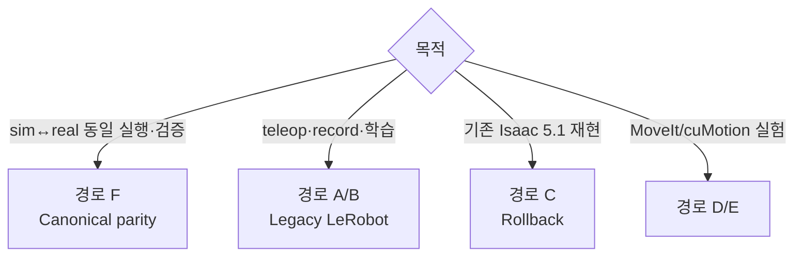

# SO-ARM101 VLA Control System

SO-ARM101 6축 로봇 팔의 실기기 LeRobot 파이프라인과 Isaac Lab Sim-to-Real 환경을 함께 관리한다.

현재 기본 실행 경로는 학습을 수행하지 않는
[`so101-canonical-v1`](docs/PATH_F_CANONICAL_PARITY.md) parity runtime이다.
Windows 실기기 client와 Isaac Sim client가 같은 ROS 2 Jazzy protocol, scheduler, limiter,
trace 형식을 사용하고 konan147의 VLA server에 `rmw_zenoh_cpp`로 연결된다.

```text
                    ROS 2 Jazzy VLA Server
                 deterministic chunk inference
                              │
                 ROS 2 Jazzy + rmw_zenoh_cpp
                  ┌───────────┴───────────┐
          Isaac Sim Client          Real SO-101 Client
          same executor             same executor
          Sim adapter               Real adapter
```

기존 Isaac Sim 5.1 / Isaac Lab 2.3.2와 LeRobot 학습·수집 경로는 rollback 및 별도 작업용으로
유지한다. Canonical parity 경로에서는 WSL2와 usbipd를 사용하지 않는다.

## 실행 경로

| 경로 | 상태 | 용도 | 가이드 |
|---|---|---|---|
| **F. Canonical parity** | **기본** | Isaac Sim 6와 실기기 SO-101의 동일 action 실행, ROS Jazzy VLA server | [PATH_F_CANONICAL_PARITY](docs/PATH_F_CANONICAL_PARITY.md) |
| A. Windows native + uv | Legacy | LeRobot teleop·record·replay·학습 | [PATH_A_NATIVE](docs/PATH_A_NATIVE.md) |
| B. Docker | Legacy | 기존 LeRobot container와 async gRPC policy server | [PATH_B_DOCKER](docs/PATH_B_DOCKER.md) |
| C. Host uv | Rollback | Isaac Sim 5.1 환경, 기존 task·dataset 생성 | [PATH_C_ISAAC_SIM](docs/PATH_C_ISAAC_SIM.md) |
| D/E | 별도 실험 | MoveIt2·cuMotion 기반 제어 | `docs/PATH_D_*`, `docs/PATH_E_*` |

### 선택 기준



## Canonical 고정 stack

| 항목 | 버전 |
|---|---|
| Isaac Sim | `6.0.0.1` |
| Isaac Lab | `v3.0.0-beta2`, commit `28a37cecdd433c22d9eabd6a5954add9f13a8951` |
| ROS 2 / RMW | Jazzy / `rmw_zenoh_cpp` |
| Pixi | `0.70.2` |
| Python | `3.12` |
| PyTorch | `2.10.0+cu128` |
| Physics | PhysX |

고정 설치 위치:

- Windows runtime: `D:\SO101\isaac6_ros`
- Windows Git repo: 임의 위치 가능. repo `.pixi` Junction이 위 runtime을 가리킨다.
- konan147 repo/runtime: `/DISK1/so101-sim2real/runtime/isaac6_ros`

`pixi.toml`과 `pixi.lock`은 두 머신이 동일 파일을 사용한다. 현재 lock SHA256은
`9736a03f7b8b2b1d94d40285d0dc3508886cb38d2f04d9c885099ae50a31fcc5`다.

## 빠른 시작

### Windows

Git Bash에서:

```bash
powershell.exe -NoProfile -ExecutionPolicy Bypass \
  -File scripts/parity/bootstrap_windows.ps1
```

설치 확인:

```bash
powershell.exe -NoProfile -ExecutionPolicy Bypass \
  -File scripts/parity/bootstrap_windows.ps1 -CheckOnly -Smoke
python scripts/parity/launch.py validate
python scripts/parity/launch.py real-dry-run
```

### konan147

```bash
ssh konan147
cd /DISK1/so101-sim2real/runtime/isaac6_ros
bash scripts/parity/bootstrap_server.sh
bash scripts/parity/bootstrap_server.sh --check-only --smoke
```

Zenoh router와 deterministic replay server:

```bash
docker compose --env-file .env -f docker/docker-compose.yaml build vla-ros-server
docker compose --env-file .env -f docker/docker-compose.yaml up -d \
  zenoh-router vla-ros-server
```

Windows에서 server transport와 sim client를 검증한다. 두 명령은 single-client lease 때문에
동시에 실행하지 않는다.

```bash
python scripts/parity/launch.py mock-probe --samples 100
python scripts/parity/launch.py sim --steps 32
```

전체 설치·운영·안전 절차는
[`docs/PATH_F_CANONICAL_PARITY.md`](docs/PATH_F_CANONICAL_PARITY.md)를 따른다.

## 실기기 안전

현재 calibration bundle은 실측 전이므로 motion이 차단되어 있다.

```text
calibration.validated=false
motor_profile.readback_validated=false
```

실기기 torque는 다음 조건이 모두 충족될 때만 허용한다.

1. paired arm pose와 caliper gripper calibration 검증
2. torque-off EEPROM readback 검증
3. 사용자가 비상 전원 차단 준비를 확인
4. `--enable-motion`과 `--confirm-emergency-cutoff-ready` 명시

`SOFollower.configure()`를 자동 호출해 EEPROM을 덮어쓰지 않는다.

## 공통 준비

Legacy 학습·dataset 작업에서 Hub/W&B가 필요하면 Git Bash에서 인증한다.

```bash
uv run hf auth login
uv run wandb login
cp .env.example .env
```

Canonical replay validation에는 HF/W&B token이 필요 없다. `.env`의 secret은 Git에 commit하지 않는다.

## Legacy 환경

Legacy uv/Docker 경로는 별도 dependency graph를 사용한다.

| 구성 | 버전 |
|---|---|
| Isaac rollback | Isaac Sim 5.1 / Isaac Lab 2.3.2 / torch 2.7 |
| LeRobot teleop image | LeRobot 0.4.4 / Python 3.11 |
| 기존 policy server | LeRobot 0.5.1 / Python 3.12 |

Legacy ABI pin은 `pyproject.toml`, `uv.lock`, `AGENTS.md`에 기록되어 있다.
`uv lock --upgrade`로 임의 갱신하지 않는다.

## 주요 문서

| 문서 | 내용 |
|---|---|
| [`PATH_F_CANONICAL_PARITY.md`](docs/PATH_F_CANONICAL_PARITY.md) | Canonical runtime 설치·사용·검증·안전·rollback |
| [`SO101_CANONICAL_PARITY_MIGRATION_REPORT.md`](docs/SO101_CANONICAL_PARITY_MIGRATION_REPORT.md) | Isaac 6 / Lab 3 / ROS Jazzy migration 결과 |
| [`SO101_CANONICAL_PARITY_REPORT.md`](docs/SO101_CANONICAL_PARITY_REPORT.md) | 현재 parity gate와 실측 대기 항목 |
| [`SIM_REAL_INFERENCE_PARITY.md`](docs/SIM_REAL_INFERENCE_PARITY.md) | 기존 model frame과 canonical 변환 감사 |
| [`TROUBLESHOOTING.md`](docs/TROUBLESHOOTING.md) | 설치·ABI·ROS·Isaac·실기기 오류 해결 |
| [`PATH_A_NATIVE.md`](docs/PATH_A_NATIVE.md) | Legacy Windows LeRobot |
| [`PATH_B_DOCKER.md`](docs/PATH_B_DOCKER.md) | Legacy Docker/WSL2 |
| [`PATH_C_ISAAC_SIM.md`](docs/PATH_C_ISAAC_SIM.md) | Isaac 5.1 rollback |

## 공식 참고 자료

- [Isaac Sim 6.0 ROS 설치](https://docs.isaacsim.omniverse.nvidia.com/6.0.0/installation/install_ros.html)
- [Windows/Linux Jazzy Pixi 설치](https://docs.isaacsim.omniverse.nvidia.com/6.0.0/installation/install_ros_other_platforms.html)
- [Isaac Sim 6.0 요구사항](https://docs.isaacsim.omniverse.nvidia.com/6.0.0/installation/requirements.html)
- [Isaac Sim 6.0 Release Notes](https://docs.isaacsim.omniverse.nvidia.com/6.0.0/overview/release_notes.html)
- [Isaac Lab v3.0.0-beta2](https://github.com/isaac-sim/IsaacLab/releases/tag/v3.0.0-beta2)
- [Isaac Lab 3.0 Migration Guide](https://isaac-sim.github.io/IsaacLab/release/3.0.0-beta2/source/migration/migrating_to_isaaclab_3-0.html)
- [ROS 2 Jazzy Zenoh](https://docs.ros.org/en/jazzy/Installation/RMW-Implementations/Non-DDS-Implementations/Working-with-Zenoh.html)
