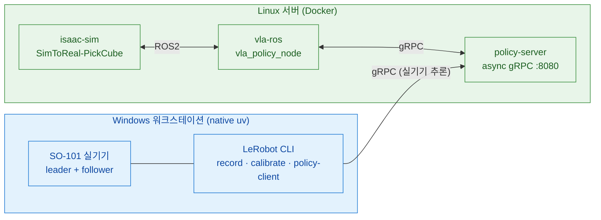
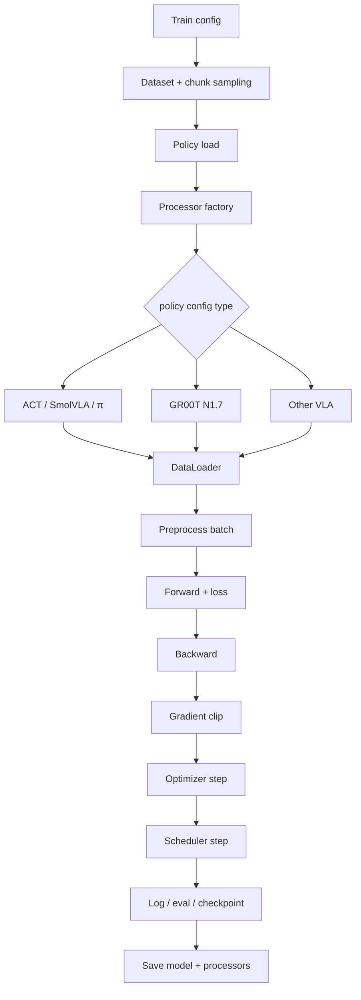
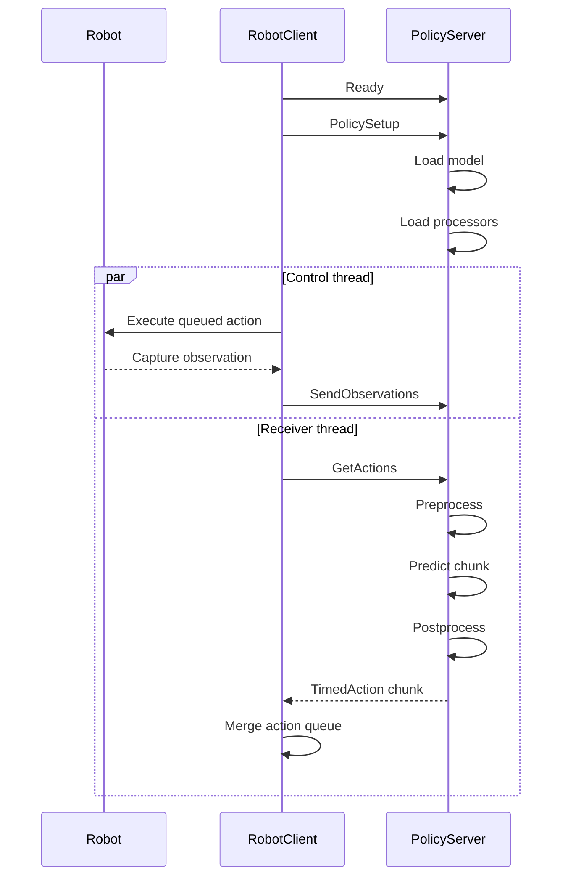

# SO-ARM101 Sim-to-Real

SO-ARM101 6축 로봇 팔용 **Sim-to-Real 파이프라인**. Isaac Sim 5.1 시뮬레이션에서 VLA 정책(ACT · SmolVLA · GR00T-N1.5)을 학습·검증하고, 실기기 SO-101 에 배포한다.

작업은 **2대의 머신**으로 나뉜다.

- **Windows 워크스테이션** — 실기기 SO-101 직결. **native uv**(WSL·Docker 없음)로 teleop·record·calibrate·setup-motors·policy-client.
- **Linux 서버** — 시뮬·학습·추론 서버. **전부 Docker**로 Isaac Sim 폐루프, VLA 학습, policy-server.

스택: **Isaac Sim 5.1 · Isaac Lab 2.3.2 · LeRobot 0.5.1(policy-server)/0.4.4(실기기 CLI) · ROS 2 Jazzy**.

## 목차 <!-- omit in toc -->

- [아키텍처 — 2-머신](#아키텍처--2-머신)
- [실행 경로](#실행-경로)
- [LeRobot v0.6.0 소스 분석 (참고 구현)](#lerobot-v060-소스-분석-참고-구현)
- [현재 PickCube 환경·에셋·cuRobo 평가](#현재-pickcube-환경에셋curobo-평가)
- [환경 요구사항](#환경-요구사항)
- [사전 설치 확인](#사전-설치-확인)
- [공통 준비](#공통-준비)
- [경로별 가이드](#경로별-가이드)
- [저장소 레이아웃](#저장소-레이아웃)
- [관련 문서](#관련-문서)
- [Reference](#reference)

---

## 아키텍처 — 2-머신

| | Windows 워크스테이션 | Linux 서버 |
|---|---|---|
| **역할** | 실기기 SO-101 제어 | 시뮬·학습·추론 서버 |
| **실행** | native uv + `pyproject.toml` (WSL·Docker 없음) | Docker (전부) |
| **작업** | teleop · record · replay · calibrate · setup-motors · find-port · policy-client | Isaac Sim 폐루프 · VLA 학습 · policy-server · sim policy-client(vla-ros) |
| **LeRobot** | 0.4.4 (pyproject `teleop`+`async`) | 0.5.1 (policy-server 독립 핀) |
| **로봇 I/O** | COM 포트 직결 (usbipd/WSL 불필요) | 로봇 직결 없음 (sim/추론만) |
| **GPU** | RTX A4000 16GB (실기기 CLI 는 GPU 불요) | RTX PRO 5000 Blackwell 48GB |



---

## 실행 경로

| 경로 | 머신 | 진입점 | 용도 |
|---|---|---|---|
| **실기기 LeRobot** | Windows (native uv) | `uv run lerobot-<mode>` | teleop · record · calibrate · setup-motors · find-port |
| **실기기 VLA 추론** | Windows (native uv) | `uv run python -m lerobot.async_inference.robot_client` | policy-client → Linux policy-server gRPC |
| **sim VLA 폐루프** | Linux (Docker) | `docker compose up policy-server isaac-sim vla-ros` | `SimToReal-SO101-PickCube-Eval-v0` closed-loop 평가 (디바운스 성공; 데이터생성은 `-DR-v0`) |
| **sim SM 데이터 생성** | Linux (Docker) | isaac-sim `datagen` 모드 (`record_state_machine.py`) | State Machine 데모 → LeRobot v3 (GPU 런타임 검증 진행 중) |
| **VLA 학습** | Linux (Docker) | policy-server `train` | SmolVLA · ACT · GR00T-N1.5 (모두 네이티브) |
| **sim 수동 teleop** (보조) | Linux (host uv) | `uv run scripts/.../teleop_se3_agent.py` | Isaac Lab 로컬 teleop · USD 씬 author |

> **추론 백엔드는 1개**: `policy-server`(gRPC). 실기기 policy-client(Windows)와 sim vla-ros(Linux)가 같은 서버에 접속한다.

---

## LeRobot v0.6.0 소스 분석 (참고 구현)

분석 기준은 `ref_repos/lerobot`의 **v0.6.0**, commit
[`30da8e6`](https://github.com/huggingface/lerobot/tree/30da8e687a6dfc617fcd94afc367ac7071c376ce)이다.
이 clone은 다음 버전 설계를 검토하기 위한 참고용이며, 현재 실행 스택은 위 표의
Windows LeRobot 0.4.4 / Linux policy-server LeRobot 0.5.1을 그대로 사용한다.

<details>
<summary><strong>lerobot-train 처리 파이프라인과 VLA별 분기</strong></summary>

`lerobot-train`은 모든 policy가 공유하는 **학습 orchestration**이고, 실제 입력 변환·모델·loss·optimizer는
policy별로 분기된다. 따라서 “모든 policy가 같은 train processor를 쓴다”가 아니라,
**공통 runner가 policy별 `PolicyProcessorPipeline`을 호출한다**가 정확하다.



공통 흐름의 실제 분기점은 다음과 같다.

| 단계 | 공통 처리 | policy별로 달라지는 부분 |
|---|---|---|
| dataset | LeRobot dataset 로드, episode-aware sampling | `action_delta_indices`·`observation_delta_indices`가 chunk/history 길이를 결정 |
| policy 생성 | dataset metadata에서 feature schema 추론 | `get_policy_class()`가 모델 class를 선택하고 pretrained/fresh-init 경로 분기 |
| batch 전처리 | 매 step `preprocessor(batch)` 호출 | rename·normalization·tokenization·padding·frame 변환·relative action 순서가 서로 다름 |
| 학습 update | `forward → backward → clip → optimizer.step → scheduler.step` | 각 policy의 `forward()`가 architecture와 loss를, config가 optimizer/scheduler preset을 정의 |
| 후처리 | offline train loss 계산에는 사용하지 않음 | `postprocessor`는 env eval/추론에서 action decode·unnormalize·absolute 복원에 사용 |
| 저장/재개 | checkpoint와 train state 저장 | processor 두 개도 JSON으로 함께 저장하며, pretrained 재개 시 저장된 pipeline을 복원 |

VLA별 processor 차이는 아래와 같다. 모든 행 앞에는 feature rename과 필요 시 batch dimension 추가,
끝에는 device 이동이 공통으로 붙는다.

| `--policy.type` | 학습 preprocessor의 핵심 순서 | 추론 postprocessor | 내장 relative-action flag |
|---|---|---|---|
| `pi0` | task newline/PaliGemma tokenize → **absolute→relative(선택)** → normalize | unnormalize → **relative→absolute(선택)** | `use_relative_actions` |
| `pi0_fast` | **absolute→relative(선택)** → normalize → state/language 준비 → text tokenizer + action tokenizer | unnormalize → **relative→absolute(선택)** | `use_relative_actions` |
| `pi05` | **absolute→relative(선택)** → normalize → state token 준비 → PaliGemma tokenize | unnormalize → **relative→absolute(선택)** | `use_relative_actions` |
| `groot` | LeRobot 입력을 video/state/action/language/embodiment로 pack → N1.7 VLM encode. checkpoint modality config와 horizon별 stats를 사용 | N1.7 action decode·unnormalize. native `xyz+rot6d` EEF-relative는 SE(3)로 absolute pose 복원 | `use_relative_actions`; native N1.7 경로 우선, generic fallback 존재 |
| `smolvla` | task newline → VLM tokenizer → normalize | unnormalize | 없음 |
| `xvla` | text tokenize → image float/ImageNet normalize → domain ID 추가 → dataset normalize | unnormalize | 없음 |
| `eo1` | normalize → conversation template → Qwen processor | unnormalize | 없음 |
| `molmoact2` | joint sign/offset frame 변환 → gripper-mask normalize/clamp → image/state/language/setup/control token pack | action clamp → masked unnormalize → joint frame 역변환 | 없음 |
| `wall_x` | Qwen 계열 task formatting → normalize | unnormalize | 없음 |
| `evo1` | state/action 차원 padding → normalize | unnormalize → action 차원 복원·선택적 gripper 이진화 | 없음 |

> **Relative action 주의**: v0.6.0의 공용 `RelativeActionsProcessorStep`은 같은 index의
> `observation.state`를 action chunk 전체에서 단순히 빼고, 후처리에서 다시 더한다
> (`relative = action - state`). 즉 joint/EEF라는 좌표 의미를 해석하거나 SE(3) pose composition을
> 수행하지 않는다. EEF의 `rpy`, quaternion, Rot6D에 이 step을 그대로 쓰면 회전의 진짜 상대 pose가
> 아니라 **표현 벡터의 성분별 차이**가 된다. 단, GR00T N1.7 전용 decoder에는 checkpoint가
> `type=eef`, `format=xyz+rot6d`로 선언한 native relative action을
> `T_abs = T_state @ T_rel`로 복원하는 별도 `relative_eef_to_absolute()` 경로가 있다.
> 반대 방향의 범용 absolute EEF→relative 변환을 ACT·SmolVLA까지 제공하는 것은 아니므로,
> SO101의 공통 EEF-relative 입력은 `T_rel = inv(T_state) @ T_action`을 계산하는 별도 processor가
> 필요하다.

이 프로젝트의 세 학습 대상만 보면 ACT와 SmolVLA에는 v0.6.0 내장 relative flag가 없고,
GR00T N1.7에만 전용 지원이 있다. 세 모델에 동일한 EEF-relative 계약을 적용하려면 dataset을
미리 relative로 덮어쓰기보다 공통 custom pre/post processor를 policy pipeline에 삽입하고,
그 processor 설정과 relative-action 통계를 checkpoint에 함께 저장하는 설계가 적합하다.

소스 근거:
[`lerobot_train.py`](https://github.com/huggingface/lerobot/blob/v0.6.0/src/lerobot/scripts/lerobot_train.py) ·
[`datasets/factory.py`](https://github.com/huggingface/lerobot/blob/v0.6.0/src/lerobot/datasets/factory.py) ·
[`policies/factory.py`](https://github.com/huggingface/lerobot/blob/v0.6.0/src/lerobot/policies/factory.py) ·
[`relative_action_processor.py`](https://github.com/huggingface/lerobot/blob/v0.6.0/src/lerobot/processor/relative_action_processor.py)

</details>

<details>
<summary><strong>LeRobot v0.6.0이 지원하는 VLA 목록</strong></summary>

upstream README가 **VLA Models**로 분류하고 `lerobot-train --policy.type=...` 및 policy factory에서
선택 가능한 모델은 다음 10개다.

| 모델 | `--policy.type` | policy class | 전용 processor factory |
|---|---|---|---|
| π0 (Pi0) | `pi0` | `PI0Policy` | `make_pi0_pre_post_processors` |
| π0-FAST (Pi0Fast) | `pi0_fast` | `PI0FastPolicy` | `make_pi0_fast_pre_post_processors` |
| π0.5 (Pi05) | `pi05` | `PI05Policy` | `make_pi05_pre_post_processors` |
| GR00T N1.7 | `groot` | `GrootPolicy` | `make_groot_pre_post_processors` |
| SmolVLA | `smolvla` | `SmolVLAPolicy` | `make_smolvla_pre_post_processors` |
| XVLA | `xvla` | `XVLAPolicy` | `make_xvla_pre_post_processors` |
| EO-1 | `eo1` | `EO1Policy` | `make_eo1_pre_post_processors` |
| MolmoAct2 | `molmoact2` | `MolmoAct2Policy` | `make_molmoact2_pre_post_processors` |
| WALL-OSS | `wall_x` | `WallXPolicy` | `make_wall_x_pre_post_processors` |
| EVO1 | `evo1` | `Evo1Policy` | `make_evo1_pre_post_processors` |

- **ACT는 지원되지만 VLA가 아니다.** upstream에서는 `act`를 Imitation Learning으로 분류한다.
- **GR00T는 N1.7만 지원한다.** v0.6.0은 N1.5 config/checkpoint를 명시적으로 거부하며, N1.5가
  필요하면 LeRobot 0.5.1을 사용하라는 오류를 낸다.
- VLA-JEPA·LingBot-VA·FastWAM은 이름에 VLA가 포함되거나 VLA backbone을 사용하지만 upstream
  README 분류상 **World Models**라서 위 VLA 10개 목록에서는 제외했다.
- registry에는 Diffusion, VQ-BeT, MultiTask DiT, TDMPC, Gaussian Actor 같은 비-VLA policy와
  third-party `lerobot_policy_*` plugin 확장 경로도 별도로 존재한다.

소스 근거:
[`README — SoTA Models`](https://github.com/huggingface/lerobot/tree/v0.6.0#sota-models) ·
[`policies/__init__.py`](https://github.com/huggingface/lerobot/blob/v0.6.0/src/lerobot/policies/__init__.py) ·
[`policies/factory.py`](https://github.com/huggingface/lerobot/blob/v0.6.0/src/lerobot/policies/factory.py)

</details>

<details>
<summary><strong>async policy-server ↔ robot-client 추론 파이프라인</strong></summary>

v0.6.0의 async inference는 Python `asyncio`나 비동기 gRPC stub이 아니다.
**동기 gRPC RPC, client의 control/receiver 두 thread, server의 observation queue**를 조합해
action 실행과 다음 chunk 추론을 겹친 구조다. server는 기동 직후 모델이 없는 빈 container이고,
client handshake가 policy와 checkpoint를 선택한다.



### gRPC 계약

| RPC | 방향·형태 | payload와 역할 |
|---|---|---|
| `Ready` | unary → unary | 새 client가 server의 observation queue와 predicted timestep set을 초기화 |
| `SendPolicyInstructions` | unary → unary | pickle `RemotePolicyConfig`: policy type, checkpoint 경로, robot feature schema, device, `actions_per_chunk` 전달. server가 model과 checkpoint의 pre/post processor를 로드 |
| `SendObservations` | client-streaming → unary | pickle `TimedObservation`을 2 MiB 조각으로 전송. 연속 관측 stream 하나가 아니라 **관측 한 건마다 호출하는 blocking RPC** |
| `GetActions` | unary → unary polling | server가 observation을 기다려 추론한 뒤 pickle `list[TimedAction]` 반환. timeout이면 빈 response |

### 실행 순서

1. `RobotClient.__init__()`이 로봇을 연결하고 hardware observation schema를 LeRobot feature schema로 만든다.
2. `Ready → SendPolicyInstructions` handshake 후 server는 `get_policy_class(...).from_pretrained(...)`로
   model을 로드하고, 같은 checkpoint에서 `make_pre_post_processors(...)`를 복원한다.
3. client main thread는 `fps` 주기로 action queue에서 한 action을 꺼내 `robot.send_action()`을 호출한다.
   queue 비율이 `queue_size / action_chunk_size <= chunk_size_threshold`가 되면 새 관측을 보낸다.
4. server의 observation queue는 `maxsize=1`이다. 새 관측이 오는데 queue가 차 있으면 이전 것을
   버리므로, 밀릴 때 backlog를 처리하지 않고 **가장 최신 관측**으로 교체한다.
5. receiver thread의 `GetActions`가 관측 하나를 가져와
   `raw robot obs → LeRobot obs → preprocessor → policy.predict_action_chunk()`를 실행한다.
   결과는 `actions_per_chunk`까지만 자르고 postprocessor를 적용한 뒤 CPU `TimedAction`으로 만든다.
6. client는 이미 실행한 timestep 이하의 stale action을 버리고, 기존 queue와 새 chunk가 겹치는
   timestep은 `aggregate_fn`으로 결합한다. 기본 `weighted_average`는
   `0.3 × old + 0.7 × new`이다.
7. 현재 chunk가 완전히 소진되기 전에 다음 추론이 진행되므로 정상 튜닝 상태에서는 robot이
   inference를 기다리는 idle frame을 줄일 수 있다. queue가 실제로 비면 fallback action은 없으며,
   새 chunk가 올 때까지 추가 command를 보내지 않는다.

### 핵심 파라미터

| 파라미터 | v0.6.0 source 기본값 | 의미 |
|---|---:|---|
| client/server `fps` | 30 / 30 | client control 주기와 server가 `TimedAction`에 부여하는 timestep 간격. 양쪽을 동일하게 유지 |
| `actions_per_chunk` | 필수 | policy 출력 중 네트워크로 돌려줄 길이. policy의 `chunk_size` 이하여야 함 |
| `chunk_size_threshold` | 0.5 | queue가 최대 수신 chunk의 이 비율 이하일 때 새 관측 송신. 높을수록 빠른 재계획·많은 overlap/RPC |
| `aggregate_fn_name` | `weighted_average` | overlap action 결합. `latest_only`, `average`, `conservative`도 지원 |
| `obs_queue_timeout` | 2 s | `GetActions`가 server observation을 기다리는 최대 시간 |
| `inference_latency` | 1/30 s | server `GetActions` 호출의 최소 목표 간격. 실제 추론이 더 느리면 추가 sleep 없음 |

> upstream async 문서 표에는 `chunk_size_threshold` 기본값이 0.7로 적힌 곳이 있지만,
> v0.6.0의 `RobotClientConfig` 실제 기본값과 예제 명령은 **0.5**다.

### 지원 범위와 주의점

- async server의 source allowlist는
  `act`, `smolvla`, `diffusion`, `tdmpc`, `vqbet`, `pi0`, `pi05`, `groot`의 **8개**다.
  위의 전체 VLA 10개와 같지 않으며 `pi0_fast`, XVLA, EO-1, MolmoAct2, WALL-OSS, EVO1은 빠져 있다.
  이 프로젝트 대상 ACT·SmolVLA·GR00T N1.7은 모두 allowlist에 포함된다.
- camera key는 checkpoint의 `policy.config.image_features`와 맞아야 한다. `RemotePolicyConfig`에는
  `rename_map`이 있지만 stock `RobotClientConfig` CLI에는 이를 노출하는 field가 없어, key가 다르면
  client 쪽 schema를 맞추거나 별도 client wrapper가 필요하다.
- 관측 중복 필터는 image를 비교하지 않고 `observation.state`의 L2 distance만 본다
  (`atol=1`). joint가 아닌 EEF state로 바꾸면 단위와 차원이 달라지므로 threshold도 함께 재설계해야 한다.
- stock server는 action chunk를 postprocessor에 한 번에 넣지 않고 `(B, action_dim)`으로 한 step씩
  호출한다. 반면 GR00T N1.7의 native relative decoder는 horizon별 stats와 기준 pose 때문에
  `(B, T, action_dim)` 전체를 요구하고 single-step decode를 명시적으로 거부한다. 따라서
  **v0.6.0 stock async 경로 그대로는 native GR00T EEF-relative chunk와 호환되지 않는다.**
  GR00T 및 공통 EEF-relative processor를 적용할 때는 server가 chunk 전체를 한 번에 postprocess하도록
  수정하고, 해당 processor를 학습 checkpoint에 저장해야 한다.
- transport는 `grpc.insecure_channel`이고 policy config·observation·action에 Python pickle을 사용한다.
  인증·TLS·payload 검증이 없으므로 인터넷에 직접 노출하면 안 된다. client/server를 같은 신뢰
  boundary에 두고 방화벽, VPN 또는 SSH tunnel을 사용한다.
- server instance에는 session ID가 없고 `Ready`가 전역 queue를 초기화한다. 여러 client가 동시에
  접속하면 서로 model/session 상태를 덮어쓸 수 있어 사실상 **server 하나당 active client 하나** 구조다.

이 프로젝트에서는 실기기가 stock `RobotClient` 계열을 사용하고, sim은
`vla_policy_node`가 같은 gRPC/pickle 계약을 구현하되 ROS observation과 자체 `deque`·inference
thread를 사용한다. `policy-server-affine`은 server의 관측 enqueue 전과 action chunk 생성 후에
joint-frame affine 변환을 추가하며, policy의 checkpoint processor 바깥에서 동작한다.

소스 근거:
[`robot_client.py`](https://github.com/huggingface/lerobot/blob/v0.6.0/src/lerobot/async_inference/robot_client.py) ·
[`policy_server.py`](https://github.com/huggingface/lerobot/blob/v0.6.0/src/lerobot/async_inference/policy_server.py) ·
[`configs.py`](https://github.com/huggingface/lerobot/blob/v0.6.0/src/lerobot/async_inference/configs.py) ·
[`services.proto`](https://github.com/huggingface/lerobot/blob/v0.6.0/src/lerobot/transport/services.proto) ·
[`async.mdx`](https://github.com/huggingface/lerobot/blob/v0.6.0/docs/source/async.mdx)

</details>

---

## 현재 PickCube 환경·에셋·cuRobo 평가

현재 정량평가 기준 환경은 `SimToReal-SO101-PickCube-DR-v0`이다. 한 환경에 SO-101 follower,
40 mm `Cube1` 한 개, 그릇 한 개, 책상과 top/wrist/front 카메라가 있으며, 큐브를 집어 그릇에
놓는 과정을 Isaac Sim 물리로 판정한다.

<table>
  <tr>
    <td width="50%"></td>
    <td width="50%"></td>
  </tr>
  <tr>
    <td align="center"><sub>현재 Isaac Sim 장면: Cube1 한 개·그릇·SO-101, 매트 없음</sub></td>
    <td align="center"><sub>실물 에셋 원형: 40/50 mm 펠트 큐브와 플라스틱 그릇</sub></td>
  </tr>
</table>

### 등록 환경

| Gym ID | 큐브/그릇 배치 | 성공 종료 | 주 용도 |
|---|---|---|---|
| `SimToReal-SO101-Teleop-v0` | 태스크 오브젝트 없음 | 없음 | 로봇·책상·조명 base substrate |
| `SimToReal-SO101-PickCube-v0` | 고정 실측 배치 | 순간 판정 | 결정적 teleop·datagen |
| `SimToReal-SO101-PickCube-DR-v0` | **full DR** 종형 큐브 영역 + 그릇 arc | 순간 판정 | 데이터 다양화·cuRobo sweep |
| `SimToReal-SO101-PickCube-DRBase-v0` | nominal 근처 좁은 사각형 | 순간 판정 | 제한 영역 DR |
| `SimToReal-SO101-PickCube-Eval-v0` | 고정 실측 배치 | 15-step 디바운스 | 재현성 closed-loop 평가 |
| `SimToReal-SO101-PickCube-DR-Eval-v0` | full DR | 15-step 디바운스 | DR closed-loop 평가 |

### 에셋 형상과 치수

| 에셋 | 현재 형상·치수 | 물리/충돌 표현 |
|---|---|---|
| **SO-101 follower** | `shoulder_pan/lift`·`elbow_flex`·`wrist_flex/roll` 5축 + gripper 1축. URDF 주요 관절 원점 간 거리 약 **116 / 135 / 64 mm**, gripper-frame offset 약 **98 mm** | Isaac용 mesh collider와 cuRobo용 **54-sphere / 9-link** 근사 |
| **Cube1/2** | 한 변 **40 mm**, 35 g, corner radius 8.8 mm인 펠트 rounded box. 현재 task는 **Cube1 한 개**만 활성 | visual과 같은 rounded mesh의 `convexHull` |
| **Cube3/4** | 한 변 **50 mm**, 55 g, corner radius 11 mm. 에셋/단일 사양에는 유지되지만 현재 scene에는 미배치 | `convexHull` |
| **그릇** | 회전체 곡면 bowl, 상단 **Ø150 mm**, 바닥 **Ø65 mm**, 높이 **70 mm**, 벽 4 mm, 외부 base 5 mm + cavity floor 3 mm, 250 g | 오목한 내부를 보존한 watertight mesh + `convexDecomposition` |
| **책상** | **1,600 × 800 × 25 mm**, 상판 높이 705 mm. 현재 scene은 desk mat 없음 | 상판 static box collider |
| **카메라** | top · wrist · front RGB 3-view | static camera cfg, 렌더 시 `--enable_cameras` 필요 |

cuRobo는 삼각 mesh를 직접 충돌검사하지 않고 아래 54개 sphere로 근사한다. 링크별 개수는
base 9 · shoulder 6 · upper arm 8 · lower arm 10 · wrist 5 · gripper 6 · moving jaw 7 · camera mount 3이다.

<table>
  <tr>
    <td width="33%"></td>
    <td width="33%"></td>
    <td width="33%"></td>
  </tr>
  <tr>
    <td align="center"><sub>visual mesh</sub></td>
    <td align="center"><sub>54-sphere collision model</sub></td>
    <td align="center"><sub>mesh/sphere overlay</sub></td>
  </tr>
</table>

### DR 큐브 스폰 영역

full DR은 env-local `x ∈ [-0.24, 0.24] m`, `y ∈ [0.06, 0.26] m`의 좌우대칭 종형 영역이다.
종의 x 반너비는 `(y, half-width) = (0.06,0.24), (0.14,0.24), (0.18,0.20),
(0.22,0.16), (0.26,0.08)` m를 선형 보간한다. 이 외곽에서 다음 영역을 제외한다.

| 제외/제약 | 값 |
|---|---|
| 로봇암 제외 박스 | `x=[-0.09, 0.04]`, `y=[-0.045, 0.155]` m |
| 그릇 이격 | 중심 `(-0.22, 0.265)` m에서 **140 mm** 이상 |
| base 최소 도달거리 | shoulder-pan 축 `(-0.021, 0.023)` m에서 **123 mm** 이상 |
| 큐브 간 최소거리 | **60 mm** |
| DRBase 사각형 | `x=[-0.14, 0.06]`, `y=[0.205, 0.305]` m; 나머지 제약은 동일 |

큐브는 full orientation으로 랜덤화하고, 그릇은 반경 0.44 m 원호에서 -4°~+8°로 움직인다.
DR 환경은 여기에 조명·카메라 focal·로봇 색과 큐브 마찰/질량 randomization을 더한다.


### cuRobo state machine 정량평가 — 54-sphere 최종

`assets/robots/so101.yml`의 **현재 54-sphere 모델**만 사용해 처음부터 재실행한 결과다.
모든 실행은 `num_envs=64`, 실패 셀 재시도 없음, planning 성공과 Isaac 물리 place 성공을
각각 집계했다. 이전 collision-sphere 모델의 중간 결과와 targeted failure replay는 아래 최종 집계에서 제외했다.

| yaw 조건 | seed | 셀 × trial | planning | place | 성공률 | 경과시간 |
|---|---:|---:|---:|---:|---:|---:|
| zero | 0 | 183 × 1 | 183/183 | **183/183** | **100.00%** | 17m 56s |
| random | 0 | 145 × 3 | 435/435 | **435/435** | **100.00%** | 49m 30s |
| random | 1 | 145 × 3 | 435/435 | **435/435** | **100.00%** | 49m 57s |
| random | 2 | 145 × 3 | 435/435 | **435/435** | **100.00%** | 51m 16s |
| **random 합계** | 0–2 | 145 × 9 | 1305/1305 | **1305/1305** | **100.00%** | 2h 30m 43s |


<table>
  <tr>
    <td width="50%"></td>
    <td width="50%"></td>
  </tr>
  <tr>
    <td align="center"><sub>yaw-zero: 183/183, 경계 108/108</sub></td>
    <td align="center"><sub>yaw-random seed 0: 435/435 (145셀 × 3회)</sub></td>
  </tr>
</table>

64-env 실행의 실측 peak VRAM은 **34,110 MiB / 48,935 MiB**였고 OOM이나 48/32-env fallback은 없었다.
grasp manifold, chord-center 보정, 5-frame contact hold와 재현 명령은
[`scripts/cuRobo/README.md`](scripts/cuRobo/README.md)에 정리돼 있다.

---

## 환경 요구사항

### 소프트웨어

| 항목 | Windows (실기기) | Linux (시뮬·학습) |
|---|---|---|
| OS | Windows 11 Pro | Ubuntu 24.04 LTS |
| uv | 최신 (Astral) | 최신 (host uv 보조 경로용) |
| Docker | **불필요** | Docker + NVIDIA Container Toolkit |
| NVIDIA Driver | (Isaac Sim 로컬 실행 시) 580+ | 580+ (CUDA 12.8 컨테이너) |
| WSL2 / usbipd | **불필요 (제거됨)** | 해당 없음 |
| Python | 3.11 (uv 가 관리) | 3.11 (컨테이너) |

### 하드웨어

| 장치 | 수량 | 비고 |
|---|---|---|
| SO-101 Leader / Follower Arm | 각 1 | Feetech STS3215 서보 × 6 |
| USB-Serial 어댑터 | 2 | CH343 칩 (Windows COM 포트) |
| 카메라 | 1~3 | top · wrist · front. `ENABLED_CAMERAS` 로 부분집합 선택 |
| NVIDIA GPU (RT 코어 + 16GB+) | 1 (Linux 서버) | 시뮬·학습·추론. **H100/A100 은 RT 코어 부재로 Isaac Sim 미지원**. RTX A4000/A5000/A6000·L40(S)·RTX 6000 Ada·RTX PRO 5000/6000 Blackwell·GeForce RTX 40/50 등 |

### 핵심 의존성

버전은 `pyproject.toml` 에 고정. **ABI 호환성 핀이라 임의 `uv lock --upgrade` 금지.**

| 패키지 | 버전 | 위치 |
|---|---|---|
| Python | 3.11 | (필수) |
| torch | 2.7.0+cu128 | (공용) |
| lerobot | 0.4.4 | 실기기 native uv (`teleop`+`async`) |
| lerobot[smolvla,async] | 0.5.1 | `policy-server` 이미지 (Dockerfile.policy 독립 핀) |
| isaacsim | 5.1.0 `[all,extscache]` | `isaac` 그룹 |
| isaaclab | 2.3.2 `[all,isaacsim]` | `isaac` (직접 의존, 외부 래퍼 제거) |

ABI 핀: `numpy==1.26.0` / `pyarrow<19` / `datasets<4.7` / `h5py<3.16` / `torch==2.7.0+cu128` / `torchcodec<0.6` / `packaging<26` / `setuptools<82`. 이유는 [`docs/TROUBLESHOOTING.md`](docs/TROUBLESHOOTING.md) 와 `AGENTS.md` 참고.

---

## 사전 설치 확인

```bash
# Windows (Git Bash) — 실기기
uv --version

# Linux 서버 — 시뮬·학습
docker --version
nvidia-smi          # Driver 580+ / CUDA 12.8+
```

미설치 항목은 공식 가이드 참고: [uv](https://docs.astral.sh/uv/getting-started/installation/) · [Docker + NVIDIA Container Toolkit](https://docs.nvidia.com/datacenter/cloud-native/container-toolkit/latest/install-guide.html).

---

## 공통 준비

### Hub / W&B 인증

```bash
uv run hf auth login        # 또는 export HF_TOKEN=hf_xxx
uv run wandb login          # 선택
```

### `.env` 작성

두 머신이 각자 `.env` 를 둔다. `.env.example` 를 복사해 채운다.

```bash
cp .env.example .env
```

| 블록 | 변수 (발췌) |
|---|---|
| §0 시크릿 | `HF_TOKEN` `HF_USER` `WANDB_API_KEY` |
| §1 모델 프로필 | `POLICY_PROFILE`(smolvla/groot_n15/act) — 활성 모델 1줄 선택 |
| §2 하드웨어 | `TELEOP_PORT` `ROBOT_PORT` `ROBOT_ID` `TELEOP_ID` (Windows=COM, Docker=`/dev/ttyACM*`) |
| §3 카메라 | `ENABLED_CAMERAS` `*_CAM_PORT` `CAM_WIDTH/HEIGHT/FPS` |
| §4 데이터 | `SINGLE_TASK` `HF_DATASET_REPO_ID` `NUM_EPISODES` `RECORD_FPS` |
| §5 학습 | `BATCH_SIZE` `TRAIN_STEPS` `OUTPUT_DIR` (Linux 서버) |
| §6 추론 서버 | `POLICY_SERVER_HOST/PORT` `INFERENCE_LATENCY` `OBS_QUEUE_TIMEOUT` (Linux 서버) |
| §7 추론 클라이언트 | `POLICY_SERVER_ADDRESS` `TASK` `ACTIONS_PER_CHUNK` (실기기) |

- **Linux (Docker)**: compose 가 `--env-file .env` + `env/${POLICY_PROFILE}.env` 로 컨테이너에 주입.
- **Windows (native uv)**: 자동 로드 안 됨 → 셸에서 직접 로드: `set -a; source .env; set +a`.

---

## 경로별 가이드

### Windows native uv — 실기기

WSL·Docker·usbipd 없이 Git Bash 에서 직접 실행한다.

```bash
# 1) 실기기 의존성 설치
uv sync --group teleop --group async

# 2) .env 로드 (Git Bash)
set -a; source .env; set +a

# 3) 포트 감지 · 모터 셋업 · 캘리브레이션
uv run lerobot-find-port
uv run lerobot-setup-motors --robot.type=so101_follower --robot.port=$ROBOT_PORT
uv run lerobot-calibrate    --robot.type=so101_follower --robot.port=$ROBOT_PORT --robot.id=$ROBOT_ID

# 4) 데이터 수집 (record)
uv run lerobot-record \
  --robot.type=so101_follower --robot.port=$ROBOT_PORT --robot.id=$ROBOT_ID \
  --teleop.type=so101_leader  --teleop.port=$TELEOP_PORT --teleop.id=$TELEOP_ID \
  --dataset.repo_id=$HF_DATASET_REPO_ID --dataset.single_task="$SINGLE_TASK" \
  --dataset.num_episodes=$NUM_EPISODES --dataset.fps=$RECORD_FPS

# 5) 실기기 VLA 추론 (policy-client → Linux policy-server)
uv run python -m lerobot.async_inference.robot_client \
  --server_address=$POLICY_SERVER_ADDRESS \
  --policy_type=$POLICY_TYPE --task="$TASK" \
  --actions_per_chunk=$ACTIONS_PER_CHUNK --chunk_size_threshold=$CHUNK_SIZE_THRESHOLD \
  --robot.type=so101_follower --robot.port=$ROBOT_PORT --robot.id=$ROBOT_ID
```

> 정확한 인자 전체는 `uv run lerobot-record --help` 등으로 확인. `--robot.type` 이 거부되면(huggingface/lerobot#3078) robot config 선(先)import 또는 lerobot 0.4.5+ 사용.

### Linux Docker — sim VLA 폐루프

```bash
# 3-서비스 폐루프 (SmolVLA · ACT · GR00T-N1.5 — 모두 policy-server 네이티브)
docker compose --env-file .env -f docker/docker-compose.yaml up policy-server isaac-sim vla-ros
```

`scripts/inference/demo_vla.sh start <act|smolvla|groot>` 가 정책 서버·bridge·vla-ros 를 자동 배선한다(livestream :49100). `--eval` 모드로 closed-loop 평가. 세부는 `AGENTS.md` §시뮬레이션 환경.

### Linux Docker — VLA 학습

```bash
# SmolVLA / ACT / GR00T-N1.5 — 모두 lerobot 네이티브 policy-server train
# (모델 선택 = .env 의 POLICY_PROFILE: smolvla | act | groot_n15)
docker compose -f docker/docker-compose.yaml run --rm policy-server train
```

데이터셋·출력은 `.env` §5(`HF_DATASET_REPO_ID`/`OUTPUT_DIR`)에서 라우팅. RL(강화학습)은 제거됨 — VLA 지도학습만.

### Linux Docker — policy-server

```bash
docker compose -f docker/docker-compose.yaml up -d policy-server      # 표준 async gRPC (ACT/SmolVLA/GR00T-N1.5)
```

실기기(Windows)·sim(vla-ros) 양쪽 클라이언트의 공용 추론 백엔드.

### Linux host uv — sim 수동 teleop (보조)

Isaac Lab 로컬 작업(수동 teleop, USD 씬 author)용. Docker 가 아닌 host uv `isaac` 그룹.

```bash
uv sync --group isaac
# v0 = DR-off 고정배치(결정적). teleop 데이터 다양성 필요하면 --task SimToReal-SO101-PickCube-DR-v0
uv run scripts/environments/teleoperation/teleop_se3_agent.py --task SimToReal-SO101-PickCube-v0
```

---

## 저장소 레이아웃

| 경로 | 내용 |
|---|---|
| `docs/` | 문서 허브 (`pics/` 이미지, `videos/` 동영상) |
| `datasets/` | LeRobot v3 데이터셋 |
| `outputs/` | 모델 체크포인트·학습 산출물 |
| `logs/` | 런타임 로그 (`.gitignore`) |
| `scratch/` | **임시물 전용** (smoke test·debug dump — `.gitignore`, 커밋 안 함) |
| `scripts/` | 진입 스크립트 (`<범주>/` 단위) |
| `src/` | `sim_to_real` · `so101_contract` 패키지 |
| `docker/` · `env/` | Docker 빌드·entrypoint · 모델 프로필 |
| `ros2_ws/` | sim VLA 노드(`so101_vla_policy`) — Docker vla-ros 가 빌드 |

> **Linux 서버**: `datasets`·`outputs` 는 용량 큰 HDD 로 symlink (예: `/DISK1/so101-sim2real/{datasets,lerobot_outputs}`).

---

## 관련 문서

| 문서 | 내용 |
|---|---|
| [`AGENTS.md`](AGENTS.md) | 내부 구조·규칙·자주 쓰는 명령 (개발자용) |
| [`docs/TROUBLESHOOTING.md`](docs/TROUBLESHOOTING.md) | ABI 불일치 · GPU/드라이버 호환 · 의존성 핀 충돌 · USD/씬 물리 |

---

## Reference

- [Isaac Sim 5.1 + Isaac Lab 2.3 + LeIsaac on Windows](https://hackmd.io/@asierarranz/rkg1tvT93gx)
- [Teleoperation | LeIsaac Document](https://lightwheelai.github.io/leisaac/docs/getting_started/teleoperation)
- [Policy Training & Inference | LeIsaac Document](https://lightwheelai.github.io/leisaac/docs/getting_started/policy_support)
- [Post-Training Isaac GR00T N1.5 for LeRobot SO-101 Arm](https://huggingface.co/blog/nvidia/gr00t-n1-5-so101-tuning)
- [Train an SO-101 Robot From Sim-to-Real With NVIDIA Isaac](https://docs.nvidia.com/learning/physical-ai/sim-to-real-so-101/latest/index.html)
- [isaac-sim/Sim-to-Real-SO-101-Workshop](https://github.com/isaac-sim/Sim-to-Real-SO-101-Workshop)
- [LeRobot Installation](https://huggingface.co/docs/lerobot/main/installation)
- [uv Installation](https://docs.astral.sh/uv/getting-started/installation/)
