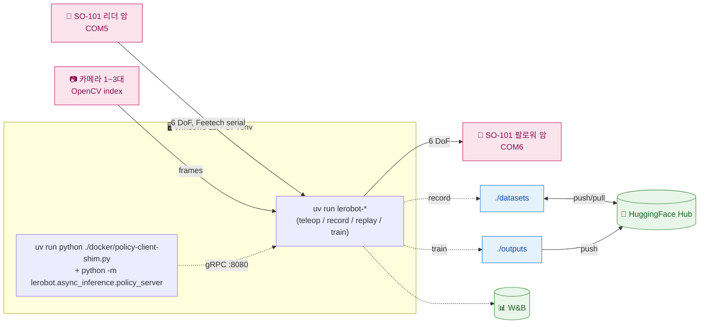
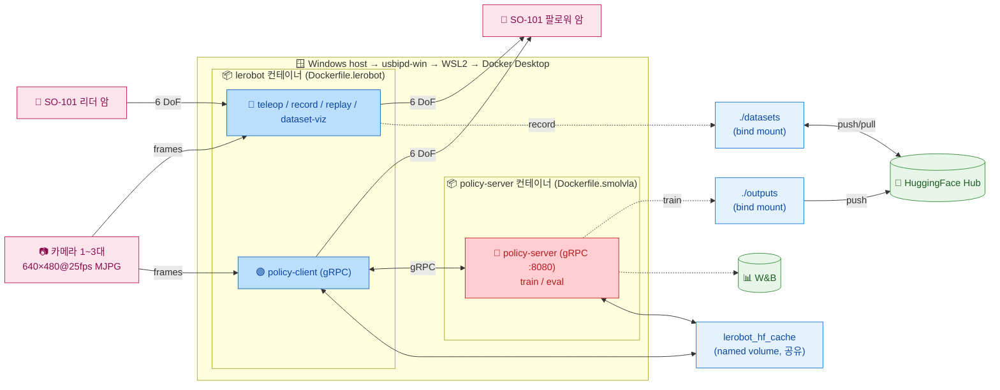
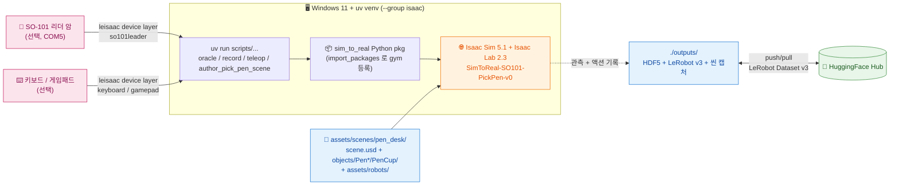

# SO-ARM101 VLA Control System

SO-ARM101 6축 로봇 팔용 **LeRobot 파이프라인 + Isaac Lab Sim-to-Real 시뮬레이션** 통합 저장소. 세 가지 실행 경로를 지원한다.

| 경로 | 진입점 | 용도 |
|---|---|---|
| **A. Windows native + uv** (실기기) | `uv run lerobot-*` CLI | 로컬 venv 에서 SO-101 직접 제어, 빠른 반복·디버깅 |
| **B. Docker 컨테이너** (실기기) | `docker compose ... run lerobot <mode>` | 격리 환경, Linux 학습 서버 배포, async inference policy server |
| **C. Host uv** (Isaac Lab 시뮬) | `uv run scripts/...` | Isaac Sim 5.1 위 `SimToReal-SO101-PickPen-v0` 시뮬 teleop·오라클 정책·데이터 수집 |

세 경로 모두 동일한 `pyproject.toml` 의존성 그룹을 공유한다 (`teleop` / `smolvla` / `async` / `isaac`). 실기기는 SmolVLA (기본) / GR00T 등 LeRobot 호환 정책을 모두 학습·추론 가능.

## 목차 <!-- omit in toc -->

- [환경 요구사항](#환경-요구사항)
- [사전 설치 확인](#사전-설치-확인)
- [공통 준비](#공통-준비)
- [경로 A — Windows native + uv (실기기)](#경로-a--windows-native--uv-실기기)
- [경로 B — Docker 컨테이너 (실기기)](#경로-b--docker-컨테이너-실기기)
- [경로 C — Host uv (Isaac Lab 시뮬)](#경로-c--host-uv-isaac-lab-시뮬)
- [Reference](#reference)

---

## 환경 요구사항

### 소프트웨어

| 항목 | 버전 | 비고 |
|------|------|------|
| Windows | 11 Pro | 본 가이드는 Windows 11 기준 |
| NVIDIA Driver | 580 이상 | CUDA 12.8 컨테이너 / Isaac Sim 5.1 호환 |
| CUDA Toolkit | 12.8 이상 | torch 2.7.0+cu128 매칭 |
| uv | 최신 | Astral 공식 installer |
| Docker Desktop | 최신 | (경로 B) WSL2 backend + GPU 가속 활성 |
| usbipd-win | 5.0 이상 | (경로 B) USB → WSL2 포워딩 |
| Isaac Sim | 5.1.0 | (경로 C) `isaac` 그룹이 자동 설치 |
| Hugging Face 계정 | - | 데이터셋·모델 업로드/다운로드 |
| W&B 계정 | - | 학습 로깅 (선택) |

### 하드웨어

| 장치 | 수량 | 비고 |
|------|------|------|
| NVIDIA GPU (RT 코어 + 16 GB+) | 1 | 시뮬·학습·추론 공통. RTX A4000 / A5000 / A6000 / L40(S) / RTX 6000 Ada / RTX PRO 5000·6000 Blackwell / GeForce RTX 40·50 시리즈 등. **H100 / A100 은 RT 코어 부재로 Isaac Sim 미지원** |
| SO-101 Leader Arm | 1 | Feetech STS3215 서보 × 6 |
| SO-101 Follower Arm | 1 | Feetech STS3215 서보 × 6 |
| USB-Serial 어댑터 | 2 | CH343 칩 (COM 포트) |
| 카메라 | 1~3 | front (전면), wrist (손목), top (탑뷰). `ENABLED_CAMERAS` 로 부분집합 선택 가능 |

### 핵심 의존성

버전은 `pyproject.toml` 에 고정. ABI 호환성 핀이라 임의 `uv lock --upgrade` 금지.

| 패키지 | 버전 | 그룹 |
|---|---|---|
| Python | 3.11 | (필수) |
| torch | 2.7.0+cu128 | (공용) |
| lerobot | 0.4.4 | (공용 `[feetech]`) |
| lerobot[smolvla] | ≥0.4.2 | `smolvla` |
| grpcio | 1.73.1 | `async` |
| isaacsim | 5.1.0 `[all,extscache]` | `isaac` |
| isaaclab | 2.3.0 | `isaac` (leisaac extras) |
| leisaac | 0.4.0 | `isaac` (git tag v0.4.0) |
| usd-core | ≥26.5 | (공용) |

ABI 핀: `numpy==1.26.0` / `pyarrow<19` / `datasets<4.7` / `h5py<3.16` / `packaging<26` / `setuptools<82`. 자세한 이유는 [`docs/TROUBLESHOOTING.md`](docs/TROUBLESHOOTING.md) 와 `AGENTS.md` 참고.

---

## 사전 설치 확인

본 가이드는 **NVIDIA Driver · CUDA Toolkit · uv · Docker Desktop · usbipd-win 이 이미 설치되어 있다**고 가정한다. Git Bash 또는 PowerShell 에서 다음으로 빠르게 확인한다.

```bash
nvidia-smi              # Driver 580+ / CUDA 12.8+
uv --version            # 최신
docker --version        # (경로 B)
usbipd --version        # (경로 B)
```

설치되지 않은 항목이 있으면 각 공식 가이드 참고:

- NVIDIA Driver / CUDA: [developer.nvidia.com](https://developer.nvidia.com/cuda-downloads)
- uv: [docs.astral.sh/uv](https://docs.astral.sh/uv/getting-started/installation/)
- Docker Desktop: [docs.docker.com/desktop/windows](https://docs.docker.com/desktop/install/windows-install/) (WSL2 backend + Settings → Resources → GPU 활성)
- usbipd-win: `winget install usbipd` (관리자 PowerShell)

---

## 공통 준비

세 경로 모두에서 공통으로 거치는 단계.

### Hub / W&B 인증

```bash
uv run hf auth login         # 또는 토큰 직접 입력
uv run wandb login           # 선택
```

또는 세션 환경변수로 주입:

```bash
export HF_TOKEN="hf_xxx"
export WANDB_API_KEY="xxx"
```

### `.env` 작성 (경로 B 필수, 경로 A·C 는 참고용)

```bash
cp .env.example .env
```

| 이름 | 설명 |
|-----|------|
| HF_TOKEN | Hugging Face 토큰 ([설정](https://huggingface.co/settings/tokens)) |
| HF_USER | HF 계정 이름 |
| WANDB_API_KEY | W&B API 키 ([설정](https://wandb.ai/settings)) |
| TELEOP_PORT / ROBOT_PORT | 리더/팔로워 직렬 포트 (Docker 는 `/dev/ttyACM*`, uv 는 `COMx`) |
| `*_CAM_PORT` | 카메라 포트 (Docker 는 `/dev/video*`, uv 는 OpenCV index) |
| `CAM_*` | 해상도/FPS/fourcc |
| SINGLE_TASK / HF_DATASET_REPO_ID / NUM_EPISODES 등 | 데이터 수집·학습 파라미터 |

`.env` 는 Docker compose 가 `--env-file` 로 컨테이너에 주입한다. uv 경로는 자동 로드되지 않으므로 [경로 A §2.2](#22-복사해서-바꿔-쓰는-bash-변수) 의 Bash 변수 블록을 권장.

---

## 경로 A — Windows native + uv (실기기)

### A.1 아키텍처



핵심: WSL2 / Docker / usbipd 거치지 않고 호스트 Windows 의 uv venv 에서 직접 `lerobot-*` CLI 호출. 직렬 포트는 `COMx`, 카메라는 OpenCV index. 빠른 반복·디버깅에 유리.

> Isaac Sim / LeIsaac 시뮬 의존성은 별도 (`isaac` 그룹). 경로 A 에는 포함하지 않는다 — 경로 C 참고.

### A.2 한 번만 준비

#### uv 와 GPU 확인

```bash
uv --version
nvidia-smi
```

#### Python 3.11 환경 동기화

실기기 + async client/server + SmolVLA 학습을 한 Windows venv 에 모두 설치:

```bash
uv python install 3.11
uv sync --python 3.11 --group teleop --group async --group smolvla --no-install-project
uv run lerobot-info
uv run python -c "import torch; print(torch.__version__, torch.cuda.is_available())"
```

학습을 안한다면 `smolvla` 그룹을 빼도 된다.

```bash
uv sync --python 3.11 --group teleop --group async --no-install-project
```

ABI 핀 보존을 위해 `uv lock --upgrade` 는 사용 금지.

### A.3 장치 확인과 세션 변수

#### COM 포트와 카메라 찾기

```bash
uv run lerobot-find-port             # 인터랙티브: USB 분리 후 Enter
uv run lerobot-find-cameras opencv
```

`lerobot-find-cameras` 가 보여준 OpenCV index 는 재부팅·USB 재연결 뒤 바뀔 수 있다.

#### 복사해서 바꿔 쓰는 Bash 변수

새 Git Bash 세션마다 먼저 실행하고 포트·카메라 index·HF 사용자명만 장비에 맞게 바꾼다.

```bash
mkdir -p ./datasets ./logs ./outputs

TELEOP_PORT="COM5"
ROBOT_PORT="COM6"
TELEOP_ID="so101_teleop"
ROBOT_ID="so101_robot"

WRIST_CAMERA=0
FRONT_CAMERA=1
CAMERA_WIDTH=640
CAMERA_HEIGHT=480
CAMERA_FPS=25
CAMERA_WARMUP_S=5
CAMERA_FOURCC="MJPG"

TASK="pick the pen"
DATASET_NAME="so101_pick_pen"
HF_USER="your_hf_user"
DATASET_REPO="${HF_USER}/${DATASET_NAME}"
DATASET_ROOT="./datasets/${DATASET_NAME}"
POLICY_PATH="lerobot/smolvla_base"
POLICY_REPO="${HF_USER}/smolvla_pick_pen"
OUTPUT_DIR="./outputs/train/smolvla_pick_pen"

CAMERAS="{wrist: {type: opencv, index_or_path: ${WRIST_CAMERA}, width: ${CAMERA_WIDTH}, height: ${CAMERA_HEIGHT}, fps: ${CAMERA_FPS}, warmup_s: ${CAMERA_WARMUP_S}, fourcc: ${CAMERA_FOURCC}}, front: {type: opencv, index_or_path: ${FRONT_CAMERA}, width: ${CAMERA_WIDTH}, height: ${CAMERA_HEIGHT}, fps: ${CAMERA_FPS}, warmup_s: ${CAMERA_WARMUP_S}, fourcc: ${CAMERA_FOURCC}}}"
```

탑뷰 카메라까지 쓰면 같은 dict 에 `top: {...}` 항목을 추가한다.

HF 캐시를 사용자 프로필 대신 저장소 아래에 모으려면:

```bash
export HF_HOME="$(pwd -W)/.cache/huggingface"
```

### A.4 Docker mode 대응표

| Docker mode (경로 B) | Windows native (경로 A) |
|---|---|
| `lerobot find-port` | `uv run lerobot-find-port` |
| `lerobot find-cameras` | `uv run lerobot-find-cameras opencv` |
| `lerobot setup-motors` | `uv run lerobot-setup-motors ...` |
| `lerobot calibrate` | `uv run lerobot-calibrate ...` |
| `lerobot teleop` | `uv run lerobot-teleoperate ...` |
| `lerobot record` | `uv run lerobot-record ...` |
| `lerobot replay` | `uv run lerobot-replay ...` |
| `lerobot dataset-viz` | `uv run lerobot-dataset-viz ...` |
| `lerobot edit-dataset` | `uv run lerobot-edit-dataset ...` |
| `lerobot info` | `uv run lerobot-info` |
| `policy-server prepare-model` | `uv run hf download <repo_id>` |
| `policy-server train` | `uv run lerobot-train ...` |
| `policy-server eval` | `uv run lerobot-eval ...` |
| `policy-server policy-server` | `uv run python -m lerobot.async_inference.policy_server ...` |
| `lerobot policy-client` | `uv run python ./docker/policy-client-shim.py ...` |

### A.5 모터 설정과 보정

각 arm 에 대해 필요한 시점에 한 번씩 실행.

```bash
# Follower
uv run lerobot-setup-motors \
    --robot.type=so101_follower \
    --robot.port="${ROBOT_PORT}"

# Leader
uv run lerobot-setup-motors \
    --teleop.type=so101_leader \
    --teleop.port="${ROBOT_PORT}"
```

캘리브레이션. `id` 는 이후 teleop / record / replay 에서 동일하게 유지.

```bash
# Follower
uv run lerobot-calibrate \
    --robot.type=so101_follower \
    --robot.port="${ROBOT_PORT}" \
    --robot.id="${ROBOT_ID}"

# Leader
uv run lerobot-calibrate \
    --teleop.type=so101_leader \
    --teleop.port="${TELEOP_PORT}" \
    --teleop.id="${TELEOP_ID}"
```

### A.6 Teleoperation 과 데이터셋

#### Teleoperation

```bash
uv run lerobot-teleoperate \
    --robot.type=so101_follower \
    --robot.port="${ROBOT_PORT}" \
    --robot.id="${ROBOT_ID}" \
    --robot.cameras="${CAMERAS}" \
    --teleop.type=so101_leader \
    --teleop.port="${TELEOP_PORT}" \
    --teleop.id="${TELEOP_ID}"
```

로컬 Rerun 뷰어를 띄우려면 `--display_data=true`. Docker 전용 `--display_ip=host.docker.internal` 은 native 에서 넣지 않는다.

#### Record

```bash
uv run lerobot-record \
    --robot.type=so101_follower \
    --robot.port="${ROBOT_PORT}" \
    --robot.id="${ROBOT_ID}" \
    --robot.cameras="${CAMERAS}" \
    --teleop.type=so101_leader \
    --teleop.port="${TELEOP_PORT}" \
    --teleop.id="${TELEOP_ID}" \
    --dataset.repo_id="${DATASET_REPO}" \
    --dataset.single_task="${TASK}" \
    --dataset.root="${DATASET_ROOT}" \
    --dataset.fps=30 \
    --dataset.episode_time_s=60 \
    --dataset.reset_time_s=10 \
    --dataset.num_episodes=10 \
    --dataset.push_to_hub=false \
    --play_sounds=false
```

녹화 조작:

| 키 | 기능 |
|---|---|
| → | 현재 에피소드 조기 종료 |
| ← | 현재 에피소드 취소 후 다시 녹화 |
| ESC | 세션 종료 + 인코딩·업로드 |

이어서 수집할 때는 `--resume=true` 추가.

#### Replay

```bash
uv run lerobot-replay \
    --robot.type=so101_follower \
    --robot.port="${ROBOT_PORT}" \
    --robot.id="${ROBOT_ID}" \
    --dataset.repo_id="${DATASET_REPO}" \
    --dataset.episode=0 \
    --dataset.root="${DATASET_ROOT}" \
    --dataset.fps=30 \
    --play_sounds=false
```

#### Dataset viz · 편집

```bash
uv run lerobot-dataset-viz \
    --repo-id="${DATASET_REPO}" \
    --episode-index=0 \
    --root="${DATASET_ROOT}" \
    --mode=local
```

```bash
uv run lerobot-edit-dataset \
    --repo_id="${DATASET_REPO}" \
    --root="${DATASET_ROOT}" \
    --operation.type=delete_episodes \
    --operation.episode_indices=[0]
```

### A.7 SmolVLA 모델 준비와 학습

#### 모델 미리 받기

```bash
uv run hf download lerobot/smolvla_base
```

#### Fine-tune

SO-101 카메라 키 (`wrist` / `front` / `top`) 가 들어간 데이터셋으로 fine-tune 해야 체크포인트의 `input_features` 가 일치한다. Windows A4000 은 작은 batch 부터:

```bash
export ACCELERATE_MIXED_PRECISION="bf16"

uv run lerobot-train \
    --dataset.repo_id="${DATASET_REPO}" \
    --dataset.root="${DATASET_ROOT}" \
    --policy.type=${TRAIN_POLICY_TYPE} \
    --policy.path="${POLICY_PATH}" \
    --policy.repo_id="${POLICY_REPO}" \
    --policy.push_to_hub=true \
    --policy.device=cuda \
    --output_dir="${OUTPUT_DIR}" \
    --steps=20000 \
    --batch_size=8 \
    --job_name=smolvla_pick_pen \
    --num_workers=4 \
    --wandb.enable=true
```

W&B 미사용 시 `--wandb.enable=false`, Hub push 미사용 시 `--policy.push_to_hub=false`. Linux 학습 서버 (RTX PRO 5000 Blackwell 48 GB) 에서 멀티 GPU 가 필요하면 경로 B 의 docker 학습 또는 별도 Linux native 환경에서 `accelerate launch` 구성.

#### Eval

```bash
uv run lerobot-eval \
    --policy.path="${POLICY_REPO}" \
    --env.type=pusht \
    --eval.n_episodes=20 \
    --eval.batch_size=10
```

### A.8 Async policy server / client

#### 로컬 policy server

서버를 loopback 에 bind:

```bash
uv run python -m lerobot.async_inference.policy_server \
    --host=127.0.0.1 \
    --port=8080 \
    --fps=30 \
    --inference_latency=0.033 \
    --obs_queue_timeout=2
```

모델 종류와 체크포인트는 서버가 아니라 client 가 넘긴다.

#### SO-101 policy client (shim 경유)

LeRobot 0.4.4 의 async `robot_client` 는 built-in SO follower config 등록 회귀가 있어 본 저장소의 shim 을 먼저 거친다.

```bash
uv run python ./docker/policy-client-shim.py \
    --server_address=127.0.0.1:8080 \
    --policy_type=${POLICY_CLIENT_TYPE} \
    --pretrained_name_or_path="${POLICY_REPO}" \
    --policy_device=cuda \
    --client_device=cpu \
    --task="${TASK}" \
    --actions_per_chunk=50 \
    --chunk_size_threshold=0.5 \
    --aggregate_fn_name=weighted_average \
    --fps=30 \
    --robot.type=so101_follower \
    --robot.port="${ROBOT_PORT}" \
    --robot.id="${ROBOT_ID}" \
    --robot.cameras="${CAMERAS}"
```

원격 정책 서버는 `--server_address=<server-ip>:8080` 으로 변경. async server 는 pickle deserialization RCE 위험 (CVE-2026-25874) 이 있으니 SSH 터널·방화벽·mTLS 래퍼 등으로 신뢰 범위를 제한할 것.

### A.9 빠른 점검 순서

처음 세팅한 PC 에서 실패 지점을 줄이는 권장 순서:

1. `uv run lerobot-info` + Torch CUDA 확인
2. `uv run lerobot-find-port`
3. `uv run lerobot-find-cameras opencv`
4. follower / leader `setup-motors`
5. follower / leader `calibrate`
6. `lerobot-teleoperate`
7. 1 episode `lerobot-record`
8. `lerobot-dataset-viz`
9. 필요 시 `lerobot-train` / policy server / policy client

---

## 경로 B — Docker 컨테이너 (실기기)

### B.1 아키텍처



핵심:

- **서비스별 진입점 분리**: `lerobot-entrypoint.sh` 는 `lerobot` 서비스(로봇 직결 워크플로) 의 모드 디스패처, `policy-entrypoint.sh` 는 `policy-server` 서비스(추론 서버) 의 모드 디스패처. 각 스크립트의 첫 인자가 모드를 결정한다.
- **이미지 분리**: SmolVLA / GR00T 추론과 학습 관련 의존성은 정책 서버 이미지에 격리한다.
- **HF 캐시 공유**: 명명 볼륨 `lerobot_hf_cache` 가 두 컨테이너의 `/root/.cache/huggingface` 에 마운트되어 한 번 받은 모델을 양쪽이 모두 사용.

### B.2 Docker 이미지 빌드

| 이미지 | Dockerfile | 의존성 그룹 | 사용 서비스 |
|---|---|---|---|
| `lerobot-so101:0.4.4` | `docker/Dockerfile.lerobot` | `teleop` (lerobot[feetech] + evdev) | `lerobot` (teleop / record / replay / train / ...) |
| `policy-server:0.4.4` | `docker/Dockerfile.smolvla` | `smolvla` + `async` (lerobot[smolvla] + grpcio) | `policy-server` (async inference) |

```bash
# teleop / record / replay 용 이미지
docker compose -f docker/docker-compose.yaml build lerobot

# Async inference policy server 용 이미지
docker compose -f docker/docker-compose.yaml build policy-server
```

### B.3 (WSL) USB 포트 연결

SO-101 Leader Arm / Follower Arm / 카메라를 PC 에 연결한 뒤, 관리자 PowerShell 에서 usbipd 로 포트 바인딩.

```powershell
# 포트 목록 조회
usbipd list
# 최초 1회만 실행
usbipd bind --busid <leader-port>
usbipd bind --busid <follower-port>
usbipd bind --busid <wrist-cam-port>
usbipd bind --busid <front-cam-port>
# usb 재연결할 때마다 / WSL 리부트할 때마다 실행
usbipd attach --wsl --busid <leader-port>
usbipd attach --wsl --busid <follower-port>
usbipd attach --wsl --busid <wrist-cam-port>
usbipd attach --wsl --busid <front-cam-port>
# Windows로 포트를 되돌릴 경우
usbipd detach --busid <port>
```

WSL 안에서 디바이스 권한 설정:

```bash
# Leader Arm, Follower Arm USB
sudo chmod 666 /dev/ttyACM0 /dev/ttyACM1
# Wrist Cam, Front Cam
sudo chmod 666 /dev/video0 /dev/video2
sudo usermod -aG dialout $USER
```

### B.4 Entrypoint 모드 일람

각 서비스는 별도 진입점을 사용한다.

#### `lerobot` 서비스 — 로봇 직결 워크플로 (`lerobot-entrypoint.sh`)

```bash
docker compose --env-file .env -f docker/docker-compose.yaml run --rm lerobot <mode> [args...]
```

| 모드 | 설명 | 필요 하드웨어 | 핵심 env var |
|---|---|---|---|
| `teleop` | 리더→팔로워 실시간 원격 조작 | Leader + Follower + 카메라 | `TELEOP_PORT`, `ROBOT_PORT`, `*_CAM_PORT`, `CAM_*` |
| `record` | 텔레옵 기반 데이터셋 수집 | Leader + Follower + 카메라 | `HF_DATASET_REPO_ID`, `SINGLE_TASK`, `NUM_EPISODES`, `EPISODE_TIME_S`, `RESET_TIME_S`, `RECORD_FPS`, `PUSH_TO_HUB` |
| `replay` | 녹화 에피소드를 팔로워에 재실행 | Follower only | `HF_DATASET_REPO_ID`, `EPISODE_INDEX` |
| `calibrate` | 리더 또는 팔로워 영점 보정 | 한쪽만 | `CALIBRATE_TARGET` (`robot` \| `teleop`) |
| `setup-motors` | Feetech 모터 ID/Baud 초기 설정 | 한쪽만 | `CALIBRATE_TARGET` |
| `find-cameras` | 시스템 카메라 자동 검출 | - | 위치 인자: `opencv` \| `realsense` |
| `find-port` | 직렬 포트 자동 감지 (인터랙티브) | - | - |
| `dataset-viz` | Rerun 기반 데이터셋 시각화 | - | `HF_DATASET_REPO_ID`, `EPISODE_INDEX`, `VIZ_MODE`, `VIZ_WS_PORT` |
| `policy-client` | 정책 서버에 gRPC 로 붙어 follower arm 구동 | Follower + 카메라 | `POLICY_SERVER_ADDRESS`, `POLICY_TYPE`, `POLICY_PATH`, `POLICY_DEVICE`, `TASK`, `ACTIONS_PER_CHUNK`, `CHUNK_SIZE_THRESHOLD`, `POLICY_CLIENT_FPS` |
| `edit-dataset` | 데이터셋 편집 (인자 완전 위임) | - | CLI 인자로 직접 전달 |
| `info` | LeRobot / Python / 시스템 정보 | - | - |
| `bash` \| `shell` | 컨테이너 인터랙티브 쉘 | - | - |
| `python <args>` | 컨테이너 내 Python 실행 | - | - |

#### `policy-server` 서비스 — Async inference 서버 (`policy-entrypoint.sh`)

```bash
docker compose --env-file .env -f docker/docker-compose.yaml run --rm policy-server <mode> [args...]
# 또는 (CMD 기본값 = policy-server 로 즉시 서버 기동):
docker compose --env-file .env -f docker/docker-compose.yaml up -d policy-server
```

| 모드 | 설명 | 필요 하드웨어 | 핵심 env var |
|---|---|---|---|
| `prepare-model` | 호스트 HF 캐시에 모델 가중치 다운로드 | - | `MODEL_REPO_ID`, `MODEL_REVISION`, `PREPARE_MODEL_EXTRA_ARGS` |
| `policy-server` | SmolVLA 등 Async inference gRPC 서버 (기본 CMD) | GPU 권장 | `POLICY_SERVER_HOST`, `POLICY_SERVER_PORT`, `POLICY_FPS`, `INFERENCE_LATENCY`, `OBS_QUEUE_TIMEOUT` |
| `train` | Policy 학습 (SmolVLA 등 — 인자 완전 위임) | GPU 권장 | CLI 인자로 직접 전달 |
| `eval` | Policy 평가/롤아웃 (인자 완전 위임) | GPU 권장 | CLI 인자로 직접 전달 |
| `info` | LeRobot / Python / 시스템 정보 | - | - |
| `bash` \| `shell` | 컨테이너 인터랙티브 쉘 | - | - |
| `python <args>` | 컨테이너 내 Python 실행 | - | - |

### B.5 SO-101 Motor Setup / Calibration

`.env` 의 다음 값을 채우고 실행:

| 이름 | 설명 |
|---|-----|
| CALIBRATE_TARGET | `robot`: 팔로워 모터/보정, `teleop`: 리더 모터/보정 |
| TELEOP_PORT / TELEOP_ID | 리더 암 포트 + ID |
| ROBOT_PORT / ROBOT_ID | 팔로워 암 포트 + ID |

```bash
# CALIBRATE_TARGET=robot / teleop 각각 1회
docker compose --env-file .env -f docker/docker-compose.yaml run --rm lerobot setup-motors
docker compose --env-file .env -f docker/docker-compose.yaml run --rm lerobot calibrate
```

### B.6 Teleoperation

`--display_data=true` 사용 시 호스트에서 사전 실행: `pip install rerun-sdk==0.26.2; rerun`.

| 이름 | 설명 |
|-----|------|
| ENABLED_CAMERAS | 활성 카메라 부분집합. 기본 `wrist,front`. 3개 운영 시 `wrist,front,top` |
| FRONT_CAM_PORT / WRIST_CAM_PORT / TOP_CAM_PORT | 카메라 포트 (`/dev/video*`) |
| CAM_WIDTH / CAM_HEIGHT / CAM_FPS / CAM_FOURCC | 카메라 해상도·FPS·fourcc |
| DISPLAY_DATA | 데이터 시각화 여부 |
| DISPLAY_IP / DISPLAY_PORT | Docker 송출 시 `host.docker.internal:9876` |
| TELEOP_EXTRA_ARGS | 기타 인자 |

```bash
docker compose --env-file .env -f docker/docker-compose.yaml run --rm lerobot teleop
```

### B.7 데이터셋 녹화 / 재실행 / 시각화

#### 녹화 (`record`)

| 이름 | 설명 |
|-----|------|
| SINGLE_TASK | 에피소드 작업 설명 (snake_case) |
| HF_DATASET_REPO_ID | HF Hub 데이터셋 ID, 기본 `${HF_USER}/${SINGLE_TASK}` |
| NUM_EPISODES / EPISODE_TIME_S / RESET_TIME_S | 수집 파라미터 |
| RECORD_FPS | 데이터셋 저장 FPS |
| PUSH_TO_HUB | HF 업로드 여부 |
| DATASET_ROOT | 컨테이너 내 저장 경로 (`/workspace/datasets` 마운트) |
| RECORD_EXTRA_ARGS | 기타 인자 |

키보드 조작 (→ 조기 종료 / ← 재녹화 / ESC 세션 종료 + 인코딩·업로드).

```bash
docker compose --env-file .env -f docker/docker-compose.yaml run --rm lerobot record
```

#### 재실행 (`replay`)

팔로워 직렬 포트만 있으면 동작.

```bash
docker compose --env-file .env -f docker/docker-compose.yaml run --rm lerobot replay
```

#### 시각화 (`dataset-viz`)

`VIZ_MODE=local` 컨테이너 내부 뷰어 / `VIZ_MODE=distant` WebSocket 서버 (호스트에서 `rerun ws://localhost:${VIZ_WS_PORT}` 접속).

```bash
docker compose --env-file .env -f docker/docker-compose.yaml run --rm lerobot dataset-viz
```

#### 진단 유틸리티

```bash
docker compose --env-file .env -f docker/docker-compose.yaml run --rm lerobot find-port
docker compose --env-file .env -f docker/docker-compose.yaml run --rm lerobot find-cameras opencv
docker compose --env-file .env -f docker/docker-compose.yaml run --rm lerobot find-joint-limits
docker compose --env-file .env -f docker/docker-compose.yaml run --rm lerobot info
docker compose --env-file .env -f docker/docker-compose.yaml run --rm lerobot bash
```

### B.8 Policy 학습

`.env` 의 학습 파라미터:

| 이름 | 설명 |
|-----|------|
| HF_DATASET_REPO_ID / DATASET_ROOT | 학습 데이터셋 위치 |
| POLICY_TYPE / POLICY_PATH / POLICY_REPO_ID | 정책 종류·베이스 체크포인트·결과 push 경로 |
| JOB_NAME / BATCH_SIZE / TRAIN_STEPS / OUTPUT_DIR / DEVICE | 일반 학습 인자 |
| WANDB_ENABLE | W&B 연동 |
| TRAIN_EXTRA_ARGS | 추가 `lerobot-train` 인자 |
| **학습 속도 최적화** | |
| NUM_WORKERS | 데이터로더 워커 수 (기본 8) |
| COMPILE_MODEL / COMPILE_MODE | `torch.compile` 활성화 (10K+ steps 에서 ~20–30% 향상, 첫 스텝 컴파일 비용) |
| NUM_PROCESSES | 사용 GPU 수. 2+ 지정 시 `accelerate launch --num_processes` DDP 자동 전환 |
| MIXED_PRECISION | 혼합 정밀도 (기본 `bf16`, Ampere+ 권장. 구형 GPU `fp16`) |

**호출 컨테이너는 `policy-server`** — Dockerfile.smolvla 에만 transformers / accelerate / num2words 가 설치됨 (lerobot 이미지에서 SmolVLA 학습 불가).

```bash
docker compose --env-file .env -f docker/docker-compose.yaml run --rm policy-server train
```

추가 인자는 env var 빌드 값 뒤에 붙어 last-wins 로 덮어쓴다:

```bash
docker compose --env-file .env -f docker/docker-compose.yaml run --rm policy-server train --resume=true
docker compose --env-file .env -f docker/docker-compose.yaml run --rm policy-server train --steps=5000
```

### B.9 Policy 평가 및 추론

**실기기 추론** — `record` 모드에 `--policy.path=` 를 전달하면 학습된 정책으로 팔로워를 구동하면서 에피소드 기록:

```bash
docker compose --env-file .env -f docker/docker-compose.yaml run --rm lerobot record \
    --robot.type=so101_follower \
    --robot.port=${ROBOT_PORT} \
    --robot.cameras="{
        wrist: {type: opencv, index_or_path: ${WRIST_CAM_PORT}, width: ${CAM_WIDTH}, height: ${CAM_HEIGHT}, fps: ${CAM_FPS}, warmup_s: ${CAM_WARMUP_S}, fourcc: ${CAM_FOURCC}},
        front: {type: opencv, index_or_path: ${FRONT_CAM_PORT}, width: ${CAM_WIDTH}, height: ${CAM_HEIGHT}, fps: ${CAM_FPS}, warmup_s: ${CAM_WARMUP_S}, fourcc: ${CAM_FOURCC}},
        }" \
    --robot.id=${ROBOT_ID} \
    --teleop.type=so101_leader \
    --teleop.port=${TELEOP_PORT} \
    --teleop.id=${TELEOP_ID} \
    --dataset.single_task=${SINGLE_TASK} \
    --dataset.repo_id=${HF_USER}/${SINGLE_TASK} \
    --dataset.num_episodes=${NUM_EPISODES} \
    --dataset.episode_time_s=${EPISODE_TIME_S} \
    --dataset.reset_time_s=${RESET_TIME_S} \
    --dataset.push_to_hub=${PUSH_TO_HUB} \
    --dataset.fps=${RECORD_FPS} \
    --dataset.root=${DATASET_ROOT} \
    ${RECORD_EXTRA_ARGS} \
    --policy.path=${POLICY_PATH}
```

**시뮬 평가** — `eval` 모드는 `lerobot-eval` 에 인자 완전 위임:

```bash
docker compose --env-file .env -f docker/docker-compose.yaml run --rm policy-server eval \
    --policy.path=${POLICY_PATH} \
    --env.type=pusht \
    --eval.n_episodes=20 \
    --eval.batch_size=10
```

### B.10 모델 가중치 준비

HF 캐시는 명명 볼륨 `lerobot_hf_cache` 가 두 컨테이너의 `/root/.cache/huggingface` 에 마운트된다. 두 서비스가 동일 볼륨을 공유하므로 한 번 받은 모델을 양쪽이 모두 사용.

```bash
# .env 의 MODEL_REPO_ID 로 다운로드 (기본 lerobot/smolvla_base)
docker compose --env-file .env -f docker/docker-compose.yaml run --rm policy-server prepare-model

# 위치 인자로 다른 모델 받기
docker compose --env-file .env -f docker/docker-compose.yaml run --rm policy-server prepare-model nvidia/GR00T-N1.5-3B
```

다른 머신으로 캐시를 옮기려면 (명명 볼륨 특성상 rsync 불가, tarball 경유):

```bash
# 출발지: 명명 볼륨 tarball 추출
docker run --rm -v lerobot_hf_cache:/cache -v "$(pwd)":/out alpine \
    tar czf /out/hf_cache.tar.gz -C /cache .
rsync -av --progress hf_cache.tar.gz user@target-server:/tmp/

# 도착지: 빈 볼륨에 import
docker volume create lerobot_hf_cache
docker run --rm -v lerobot_hf_cache:/cache -v /tmp:/in alpine \
    tar xzf /in/hf_cache.tar.gz -C /cache
```

### B.11 Fine-tune 워크플로 (pick_pen)

`lerobot/smolvla_base` 는 `camera1/2/3` 키로 학습된 베이스라 SO-101 (`wrist`/`front`) 클라이언트와 키 불일치 (`KeyError: 'observation.images.wrist'`) 가 발생한다. 정공법은 SO-101 데이터셋으로 SmolVLA 를 fine-tune 해 새 체크포인트의 `input_features` 가 자연스럽게 `wrist/front` 가 되도록 하는 것.

**1) 데이터셋 수집** (Windows 워크스테이션 `lerobot` 컨테이너):

```bash
# .env: SINGLE_TASK="pick the pen", HF_DATASET_REPO_ID=${HF_USER}/so101_pick_pen,
#       NUM_EPISODES=50, EPISODE_TIME_S=30, PUSH_TO_HUB=true
docker compose --env-file .env -f docker/docker-compose.yaml run --rm lerobot record
```

- 카메라 키 `wrist`, `front`, `top` 으로 저장 (변경 불필요)
- `PUSH_TO_HUB=true` 면 학습 머신에서 HF Hub pull 가능
- 50+ 에피소드, 다양한 grasp pose / pen 위치로 시연

**2) 데이터셋 검증** (선택):

```bash
docker compose --env-file .env -f docker/docker-compose.yaml run --rm lerobot dataset-viz
```

**3) 학습 머신 선택**:

- **Linux 학습 서버** (RTX PRO 5000 Blackwell 48 GB, 권장 — 빠른 회전): 정책 서버 이미지만 빌드. 데이터셋은 HF Hub pull 또는 `rsync -av datasets/ user@<server>:/path/datasets/`
- **Windows A4000 (16 GB)** (느림, batch_size 4–8): 데이터셋 로컬

**4) Fine-tune 실행** (`policy-server` 컨테이너):

```bash
docker compose --env-file .env -f docker/docker-compose.yaml run --rm policy-server train \
    --policy.path=lerobot/smolvla_base \
    --policy.repo_id=${HF_USER}/smolvla_pick_pen \
    --policy.push_to_hub=true \
    --dataset.repo_id=${HF_DATASET_REPO_ID} \
    --dataset.root=${DATASET_ROOT} \
    --output_dir=${OUTPUT_DIR} \
    --steps=20000 \
    --batch_size=64 \
    --job_name=smolvla_pick_pen \
    --wandb.enable=true
```

**5) 체크포인트 배포** (Windows 워크스테이션):

```bash
# .env 의 POLICY_PATH=${HF_USER}/smolvla_pick_pen
docker compose --env-file .env -f docker/docker-compose.yaml run --rm policy-server prepare-model ${HF_USER}/smolvla_pick_pen
```

**6) 정책 서버 재기동 + 실기기 추론**:

```bash
docker compose --env-file .env -f docker/docker-compose.yaml up -d policy-server
docker compose --env-file .env -f docker/docker-compose.yaml run --rm lerobot policy-client
```

fine-tuned 체크포인트의 `input_features` 가 `wrist/front/top` 이므로 카메라 키 매핑 자동 일치.

### B.12 Async Inference Policy Server (SmolVLA)

`lerobot.async_inference.policy_server` 를 gRPC :8080 으로 띄워 SmolVLA 정책을 원격 추론. 동일 호스트의 `record` / `robot_client` 가 관측을 보내면 서버가 액션 청크를 비동기로 반환. 서버는 policy-agnostic 이므로 모델 종류/체크포인트/디바이스는 **클라이언트** 가 `--policy_type=smolvla --pretrained_name_or_path=...` 로 주입.

> 본 레포 기준 권장 체크포인트: **`lerobot/smolvla_base`** (공식 베이스, ~450M params, ~2 GB VRAM). `pick_pen` task 의 SO-101 fine-tune 공개 체크포인트는 없으므로 fine-tune 전에는 베이스 모델로 파이프라인 검증만 가능.

| 이름 | 설명 |
|---|---|
| POLICY_SERVER_HOST | bind 주소 (기본 `0.0.0.0`) |
| POLICY_SERVER_PORT | gRPC 포트 (기본 `8080`) |
| POLICY_FPS | 컨트롤 루프 FPS (기본 `30`) |
| INFERENCE_LATENCY | 목표 추론 latency 초 (기본 `0.033`) |
| OBS_QUEUE_TIMEOUT | 관측 큐 timeout 초 (기본 `2`) |
| POLICY_SERVER_EXTRA_ARGS | 추가 인자 |

서버 기동:

```bash
docker compose --env-file .env -f docker/docker-compose.yaml up -d policy-server
docker compose logs -f policy-server   # gRPC bind 로그
```

클라이언트는 `lerobot` 서비스의 `policy-client` 모드. `.env` 의 `POLICY_*` / `TASK` / `ROBOT_*` / `*_CAM_*` 변수가 robot_client CLI 인자로 자동 매핑된다.

```bash
docker compose --env-file .env -f docker/docker-compose.yaml run --rm lerobot policy-client
```

원격 학습 서버의 정책 서버에 붙으려면:

```bash
POLICY_SERVER_ADDRESS=10.0.0.5:8080 \
    docker compose --env-file .env -f docker/docker-compose.yaml run --rm lerobot policy-client
```

**주의사항**

- **액션 품질**: `lerobot/smolvla_base` 는 SO-101 에 미학습 → 액션 품질 무작위에 가까움. 일차 목적은 **파이프라인 검증** (gRPC 송수신, 카메라/state 매핑, action chunk 적용).
- **초기 로딩**: 첫 호출 시 VLM 백본 (`HuggingFaceTB/SmolVLM2-500M-Video-Instruct`) 자동 다운로드로 30–60 초 추가 대기. `prepare-model HuggingFaceTB/SmolVLM2-500M-Video-Instruct` 로 미리 받아두면 즉시 로드.
- **보안**: pickle deserialization RCE 위험 (CVE-2026-25874). 본 구성은 같은 호스트 loopback 한정. 외부 노출 시 SSH 터널 / mTLS 래퍼 / 방화벽 추가.
- **카메라 키 매핑**: 체크포인트 `input_features` 키와 클라이언트가 보내는 카메라 키가 정확히 일치해야 함. base 모델 직결 시 `KeyError: 'observation.images.wrist'` — fine-tune 정공법으로 해결 (§B.11).

---

## 경로 C — Host uv (Isaac Lab 시뮬)

### C.1 아키텍처



핵심:

- 호스트 uv 환경에서 직접 실행. Docker 미연결 — RT 코어 GPU 가 있는 Windows 워크스테이션 또는 Linux 서버 필요.
- **H100 / A100 미지원**: RT 코어 부재로 카메라 raytracing pipeline 생성 실패 (자세히는 [`docs/TROUBLESHOOTING.md`](docs/TROUBLESHOOTING.md) §"카메라 sensor 가 raytracing pipeline 생성 실패").
- `import sim_to_real` 한 번에 monkey patch + Gym 환경 등록이 모두 일어남.

### C.2 한 번만 준비

```bash
uv sync --python 3.11 --group isaac --no-install-project
uv run python -c "import isaacsim; print('isaacsim', isaacsim.__version__)"
uv run python -c "import sim_to_real, gymnasium; print(gymnasium.spec('SimToReal-SO101-PickPen-v0'))"
```

`isaac` 그룹은 ~20 GB 다운로드 (Isaac Sim 5.1 extscache 포함). 처음 한 번만.

### C.3 디렉토리 구조 (시뮬 관련)

```
SO101-LeRobot-VLA/
├── assets/
│   ├── robots/                          # SO-101 follower USD + 편집용 URDF
│   ├── sample_calibrations/             # 샘플 .json 캘리브레이션
│   └── scenes/pen_desk/                 # 펜 Pick-and-Place 씬
│       ├── scene.usd / scene.usda       # 책상/매트/조명 + objects 참조 + 좌표
│       └── objects/
│           ├── PenWhite/PenWhite.usd
│           ├── PenGray/PenGray.usd
│           ├── PenBlack/PenBlack.usd
│           ├── PenBlue/PenBlue.usd
│           └── PenCup/PenCup.usd
├── scripts/                             # Isaac Lab 진입점 스크립트
│   └── environments/teleoperation/      # teleop_se3_agent / replay / so101_joint_state_server
└── src/sim_to_real/                     # 로컬 Python 패키지 (leisaac 미러 구조)
    ├── assets/scenes/pen_desk.py        # PEN_DESK_CFG (UsdFileCfg 래퍼)
    ├── tasks/                           # SimToReal-SO101-PickPen-v0 등록
    │   └── pick_pen/{pick_pen_env_cfg.py, mdp/{observations,terminations}.py}
    └── utils/                           # constant + domain_randomization (ellipse / arc)
```

| Gym ID | 정의 위치 | 진입점 |
|----|----------|--------|
| `SimToReal-SO101-PickPen-v0` | `sim_to_real.tasks.pick_pen.pick_pen_env_cfg:PickPenEnvCfg` | `isaaclab.envs.ManagerBasedRLEnv` |

### C.4 펜 씬 (Pen Scene)

**씬 파일:** `assets/scenes/pen_desk/scene.usd` (객체별 USD 는 `objects/` 하위 분리)

테이블탑 베이스 + 펜 4개 (rigid body) + 동적 펜 컵.

#### 구성 요소

- 밝은 책상 + 어두운 데스크 매트 — `scene.usd` 직접 author
- 와이어 메시 펜 컵 — `objects/PenCup/PenCup.usd` payload 참조 (동적 rigid body)
- 펜 4개 (`PenWhite`, `PenGray`, `PenBlack`, `PenBlue`) — 각각 `objects/<Name>/<Name>.usd` payload 참조

#### 구현 세부

- **객체 분리:** 펜 4개·펜컵을 self-contained USD 로 분리, `scene.usd` 에서 `prepend payload = @./objects/<Name>/<Name>.usd@` 참조. 각 객체 USD 는 자체 `Looks` Scope + 머티리얼을 포함해 다른 씬에서도 재사용 가능.
- **좌표 정합:** `scripts/author_pick_pen_scene.py` 의 `SCENE_OFFSET` 상수로 top-level translate 일괄 시프트. SO-101 follower `init_state.pos=(2.2, -0.61, 0.89)` 를 기준으로 책상 정면 모서리에 robot mount 가 클램프된 위치에 정렬.
- **펜 컵 동역학:** `PhysicsRigidBodyAPI` + `PhysicsMassAPI` (`mass=0.12 kg`, `linearDamping=0.6`, `angularDamping=4.0`, CCD on). 사용자가 밀면 움직이는 실제 펜통.
- **펜 콜라이더:** invisible Cube proxy 미사용. 각 visual primitive (Barrel Capsule / Grip · BackPlug Cylinder / Clip Cube) 에 `PhysicsCollisionAPI` + `PhysxCollisionAPI` 직접 부여 (`contactOffset=0.0015`, `restOffset=0`, torsional patch). `PenGripPhysics` 머티리얼 (`staticFriction=1.8`, `dynamicFriction=1.5`) binding. TipSleeve / Nib (Cone) 은 PhysX 의 analytic cone collision 부재로 시각 전용.
- **펜 / 펜통 영역 분리:** 펜은 그린 타원 (scene-local y ∈ [0.22, 0.26]), 펜통은 주황 호 (scene-local y ∈ [0.34, 0.40]). y 마진 ≥ 0.08 m 라 펜이 펜컵 안에 spawn 되는 케이스 원천 차단.
- **펜 초기 배치 + 랜덤화:** 펜 4개 default 는 그린 타원 4분면 분산 (yaw 차이 ≥ 35°). 매 reset 마다 `randomize_object_in_ellipse(x_radius=0.05, y_radius=0.02, yaw_range_deg=(-10,10))` jitter.
- **펜통 호 sampling:** default scene-local `(0, 0.40)` — robot scene-local y=-0.04 에서 0.44 m 정면. 매 reset 마다 `randomize_object_on_arc(radius=0.44, angle_range_deg=(-30,30))`. 양 끝 `(±0.22, 0.34)` 가 매트 안 + SO-101 reach 가장자리.
- **PenCup reset:** `parse_usd_and_create_subassets(..., specific_name_list=[*PEN_NAMES, PEN_CUP_NAME])` 로 env subasset 등록 → 매 `B`/`R` 리셋마다 author 한 초기 pose 새로 sampling.
- **데스크/매트 contact tuning:** `DeskTop`, `DeskMat` 에도 `PhysxCollisionAPI` 명시 (`contactOffset=0.0015`) — PhysX 디폴트 2 cm contact margin 으로 인한 관통·튀어오름 방지.

#### 씬 재생성

```powershell
uv run scripts\author_pick_pen_scene.py
```

`.usda` 텍스트 → `pxr.Sdf.Layer.Export(args={"format":"usdc"})` 로 동일 prim layout 의 `.usd` (usdc) 생성. USD 포맷 참고: [`docs/OpenUSD_Guide.md`](docs/OpenUSD_Guide.md).

좌표 변경 시 같이 갱신:

- `src/sim_to_real/tasks/pick_pen/pick_pen_env_cfg.py::PEN_CUP_CENTER_XY` — `mdp.pen_in_cup` 의 컵 기준점 (world frame)
- 오라클 state machine 의 동일 상수 (`src/sim_to_real/datagen/state_machine/pick_pen.py`, 존재 시)

### C.5 텔레오퍼레이션 및 레코드

`scripts/environments/teleoperation/teleop_se3_agent.py` 는 `gym.make("SimToReal-SO101-PickPen-v0")` + leisaac 디바이스 레이어.

#### 디바이스 종류

| `--teleop_device` | 클래스 | 동작 방식 |
|---|---|---|
| `keyboard` | `SO101Keyboard` | 키보드 → 8D delta (SE3 + shoulder-pan + gripper), differential IK |
| `gamepad` | `SO101Gamepad` | Xbox 게임패드 → 동일한 8D delta |
| `so101leader` | `SO101Leader` | USB 시리얼로 실제 SO-101 리더 암 연결. Feetech 모터 6개 위치 → follower joint 직접 매핑 |
| `so101leader` (remote) | `SO101LeaderRemote` | ZMQ SUB 으로 원격 SO-101 리더 상태 수신. `--remote_endpoint` 필요 |
| `bi-so101leader` | `BiSO101Leader` | 좌/우 두 대의 SO-101 리더 (양팔 태스크용) |
| `lekiwi-*` | `LeKiwi*` | 키보드 / 게임패드 / 리더 암으로 LeKiwi 모바일 매니퓰레이터 제어 |

##### 액션 구조 차이

| 디바이스 | 제어 방식 | 액션 차원 |
|---|---|---|
| `keyboard` / `gamepad` | Differential IK — gripper 프레임 기준 delta pose | 8D: `[dx, dy, dz, droll, dpitch, dyaw, Δshoulder_pan, Δgripper]` |
| `so101leader` / `so101leader`(remote) | 직접 관절 위치 제어 — 모터 값 → 관절 한계 범위 변환 | 6D: 관절 위치 (rad) |

#### 실행

```bash
# 키보드
uv run scripts/environments/teleoperation/teleop_se3_agent.py \
    --task SimToReal-SO101-PickPen-v0 --teleop_device keyboard

# SO-101 leader (Windows COM)
uv run scripts/environments/teleoperation/teleop_se3_agent.py \
    --task SimToReal-SO101-PickPen-v0 --teleop_device so101leader --port COM5

# SO-101 leader (원격 ZMQ)
uv run scripts/environments/teleoperation/teleop_se3_agent.py \
    --task SimToReal-SO101-PickPen-v0 --teleop_device so101leader \
    --remote_endpoint tcp://192.168.1.10:5556

# 양팔
uv run scripts/environments/teleoperation/teleop_se3_agent.py \
    --task SimToReal-SO101-BiArm-v0 --teleop_device bi-so101leader \
    --left_arm_port COM5 --right_arm_port COM6
```

#### 주요 인자

| 인자 | 기본값 | 설명 |
|---|---|---|
| `--task` | (필수) | Gym 환경 ID |
| `--teleop_device` | `keyboard` | 디바이스 종류 |
| `--port` | `/dev/ttyACM0` | `so101leader` 시리얼 포트 |
| `--remote_endpoint` | `None` | ZMQ 원격 (e.g. `tcp://host:5556`) |
| `--left_arm_port` / `--right_arm_port` | `/dev/ttyACM0` / `/dev/ttyACM1` | bi-arm 포트 |
| `--sensitivity` | `1.0` | keyboard/gamepad 민감도 |
| `--recalibrate` | `False` | 강제 캘리브레이션 |
| `--quality` | `False` | FXAA + quality 렌더링 |
| `--step_hz` | `60` | 환경 step 비율 |

#### 키 바인딩 (`SO101Keyboard`)

**세션 제어** (모든 디바이스 공통):

| 키 | 동작 |
|---|---|
| `B` | 제어 시작 |
| `R` | 현재 시도를 실패로 리셋 |
| `N` | 현재 시도를 성공으로 표시 후 리셋 |

**암 제어** (keyboard 전용):

| 키 | 동작 | 키 | 동작 |
|---|---|---|---|
| `W` / `S` | 앞 / 뒤 | `A` / `D` | 왼 / 오른 |
| `Q` / `E` | 위 / 아래 | `J` / `L` | 롤 좌 / 우 |
| `I` / `K` | 피치 위 / 아래 | `U` / `O` | 그리퍼 열기 / 닫기 |

모든 이동·회전은 **gripper 프레임 기준 delta**, 내부에서 robot base 프레임으로 변환.

#### Rerun 뷰어 시각화

```powershell
uv run lerobot-dataset-viz `
    --repo-id local/so101-pen-pick `
    --root outputs\lerobot\so101_pick_pen_v3 `
    --episode-index 0 `
    --mode local
```

---

## Reference

- [Isaac Sim 5.1 + Isaac Lab 2.3 + LeIsaac on Windows](https://hackmd.io/@asierarranz/rkg1tvT93gx)
- [Installation | LeIsaac Document](https://lightwheelai.github.io/leisaac/docs/getting_started/teleoperation)
- [Teleoperation | LeIsaac Document](https://lightwheelai.github.io/leisaac/docs/getting_started/teleoperation)
- [Policy Training & Inference | LeIsaac Document](https://lightwheelai.github.io/leisaac/docs/getting_started/policy_support)
- [Post-Training Isaac GR00T N1.5 for LeRobot SO-101 Arm](https://huggingface.co/blog/nvidia/gr00t-n1-5-so101-tuning)
- [Train an SO-101 Robot From Sim-to-Real With NVIDIA Isaac](https://docs.nvidia.com/learning/physical-ai/sim-to-real-so-101/latest/index.html)
- [isaac-sim/Sim-to-Real-SO-101-Workshop](https://github.com/isaac-sim/Sim-to-Real-SO-101-Workshop)
- [LeRobot Installation](https://huggingface.co/docs/lerobot/main/installation)
- [LeRobot Cameras](https://huggingface.co/docs/lerobot/main/en/cameras)
- [uv Installation](https://docs.astral.sh/uv/getting-started/installation/)
- [uv Python management](https://docs.astral.sh/uv/guides/install-python/)
