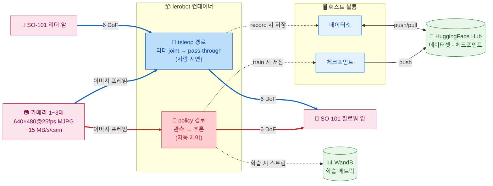

# SO-ARM101 VLA Control System

SO-ARM101 6축 로봇 팔용 **Docker 기반 LeRobot 파이프라인**. `docker/docker-compose.yaml` 의 두 서비스가 각자의 진입점을 사용한다:

- **`lerobot`** (`docker/Dockerfile.lerobot` + `docker/lerobot-entrypoint.sh`): 텔레오퍼레이션·데이터 수집·정책 학습·시각화
- **`lerobot-policy-server`** (`docker/Dockerfile.smolvla` + `docker/server-entrypoint.sh`): SmolVLA / GR00T 등 async inference gRPC 서버

호스트에는 Docker / GPU 드라이버 / (Windows의 경우) usbipd-win 만 갖추면 되고, Python·CUDA·LeRobot·서보 SDK 등 일체는 컨테이너 안에 격리되어 있다.

> 시뮬레이션 경로(LeIsaac + Isaac Sim)는 현재 `docker-compose.yaml` 에서 임시 비활성화되어 있다. 관련 Dockerfile (`docker/Dockerfile.leisaac`) 은 보존만 되어 있으며 본 README 는 실기기 경로만 다룬다.
>
> Windows 호스트에서 WSL2 / Docker 없이 Git Bash + `uv` 로 실기기 워크플로를 실행할 때는 [Windows Native + uv LeRobot 실행 가이드 (Git Bash)](docs/windows-native-uv-lerobot-guide.md)를 참고한다.

## 목차 <!-- omit in toc -->

- [아키텍처](#아키텍처)
- [환경 요구사항](#환경-요구사항)
- [설치 및 사용 방법](#설치-및-사용-방법)
- [Reference](#reference)


## 아키텍처



### 핵심 포인트

- **서비스별 진입점 분리**: `lerobot-entrypoint.sh` 는 `lerobot` 서비스(로봇 직결 워크플로) 의 모드 디스패처, `server-entrypoint.sh` 는 `lerobot-policy-server` 서비스(추론 서버) 의 모드 디스패처. 각 스크립트의 첫 인자가 모드를 결정한다.
- **이미지 분리**: SmolVLA / GR00T 추론 의존성은 정책 서버 이미지에만 격리되어 teleop 워크플로 안정성을 보호한다.

## 환경 요구사항

### 소프트웨어

| 항목 | 버전 | 비고 |
|------|------|------|
| Ubuntu | 24.04 | (Windows) WSL2 커널 6.6+ 권장 |
| Docker | 최신 | (Windows) WSL2 backend 활성화 필수 |
| usbipd-win | 5.0 이상 | (Windows) USB 장치 WSL2 포워딩 |
| NVIDIA Driver | 580 이상 | CUDA 컨테이너 실행용 |
| NVIDIA Container Toolkit | 12.8 이상 | Docker GPU 지원 |
| Hugging Face 계정 | - | 데이터셋·모델 업로드·다운로드용 |
| W&B 계정 | - | 모델 학습 기록용 |

### 하드웨어

| 장치 | 수량 | 비고 |
|------|------|------|
| NVIDIA GPU | 1개 이상 | CUDA 가속 학습/추론용. VRAM 16 GB 이상 권장(RTX 4080 / 5080 / RTX A4000 등) |
| SO-101 Leader Arm | 1 | Feetech STS3215 서보 |
| SO-101 Follower Arm | 1 | Feetech STS3215 서보 |
| USB-Serial 어댑터 | 2 | CH343 칩 (COM 포트) |
| 카메라 | 1~3 | belly cam (전면), wrist cam (손목), top cam (탑뷰). `ENABLED_CAMERAS` 로 부분집합 선택 |

### 핵심 의존성

버전은 `pyproject.toml` 에 고정. 컨테이너 빌드 시 `uv sync --only-group teleop` 으로 설치된다.

| 패키지 | 버전 | 비고 |
|--------|------|------|
| Python | 3.11 | - |
| torch  | 2.7.0 | cu128 |
| lerobot | 0.4.4 | - |
| isaacsim | 5.1.0 | *(비활성)* `[all,extscache]` extras 포함 |
| isaaclab | 2.3.0 | *(비활성)* `leisaac[isaaclab]` 로 간접 설치 |
| leisaac | 0.4.0 | *(비활성)* `pyproject.toml` 의 `[tool.uv.sources]` 가 git tag `v0.4.0` 에서 설치 |

## 설치 및 사용 방법

### Docker 이미지 빌드

두 개의 이미지로 책임을 분리한다.

| 이미지 | Dockerfile | 의존성 그룹 | 사용 서비스 |
|---|---|---|---|
| `lerobot-so101:0.4.4` | `docker/Dockerfile.lerobot` | `teleop` (lerobot[feetech] + evdev) | `lerobot` (teleop / record / replay / train / ...) |
| `lerobot-policy-server:0.4.4` | `docker/Dockerfile.smolvla` | `smolvla` + `async` (lerobot[smolvla] + grpcio) | `lerobot-policy-server` (async inference) |

두 Dockerfile 모두 Stage 1–4 (base → uv → python 3.11 → torch cu128) 가 동일해 BuildKit 캐시를 공유한다. SmolVLA / GR00T 등 추론 의존성을 정책 서버 이미지에만 격리해 teleop 환경 안정성을 보장한다. 진입점도 각자(`lerobot-entrypoint.sh` / `server-entrypoint.sh`)로 분리되어 모드 책임이 명확하다.

```bash
# teleop / record / replay / train 용 이미지
docker compose -f docker/docker-compose.yaml build lerobot

# Async inference policy server 용 이미지
docker compose -f docker/docker-compose.yaml build lerobot-policy-server
```

### (WSL)USB 포트 연결

SO-101 Leader Arm, Follower Arm, 카메라들을 컴퓨터에 연결

이후 관리자 권한으로 powershell 열어서 usbipd 설치 후 포트 바인딩 진행

```powershell
# usbipd 설치
winget install usdipd
# 포트 목록 조회
usbipd list
# 최초 1회만 실행
usbipd bind --busid <leader-port>
usbipd bind --busid <follower-port>
usbipd bind --busid <wrist-cam-port>
usbipd bind --busid <belly-cam-port>
# usb 재연결할 때마다 / WSL 리부트할 때마다 실행
usbipd attach --wsl --busid <leader-port>
usbipd attach --wsl --busid <follower-port>
usbipd attach --wsl --busid <wrist-cam-port>
usbipd attach --wsl --busid <belly-cam-port>
# Windows로 포트를 되돌릴 경우:
usbipd detach --busid <port>
```

이후 wsl에서 포트 권한 설정 진행

```bash
# Leader Arm, Follower Arm USB
sudo chmod 666 /dev/ttyACM0 /dev/ttyACM1
# Wrist Cam, Belly Cam
sudo chmod 666 /dev/video0 /dev/video2
sudo usermod -aG dialout $USER
```

### .env 파일 작성

`.env.example` 파일을 `.env` 파일로 복사한 후 다음 값을 입력. `docker compose` 가 `--env-file .env` 로 컨테이너에 주입한다.

| 이름 | 설명 |
|-----|------|
| HF_TOKEN | Hugging Face 토큰(발급: [Hugging Face settings](https://huggingface.co/settings/tokens)) |
| HF_USER | Hugging Face 계정 이름 |
| WANDB_API_KEY | Weight & Bias API 키(발급: [wandb 설정](https://wandb.ai/settings)) |

```bash
cp .env.example .env
```

### Entrypoint 모드 일람

각 서비스는 별도 진입점을 사용한다.

#### `lerobot` 서비스 — 로봇 직결 워크플로 (`lerobot-entrypoint.sh`)

```bash
docker compose --env-file .env -f docker/docker-compose.yaml run --rm lerobot <mode> [args...]
```

| 모드 | 설명 | 필요 하드웨어 | 핵심 env var |
|---|---|---|---|
| `teleop` | 리더→팔로워 실시간 원격 조작 | Leader + Follower + 카메라 | `TELEOP_PORT`, `ROBOT_PORT`, `*_CAM_PORT`, `CAM_*` |
| `record` | 텔레옵 기반 데이터셋 수집 | Leader + Follower + 카메라 | `HF_DATASET_REPO_ID`, `SINGLE_TASK`, `NUM_EPISODES`, `EPISODE_TIME_S`, `RESET_TIME_S`, `RECORD_FPS`, `PUSH_TO_HUB` |
| `replay` | 녹화 에피소드를 팔로워에 재실행 | Follower only | `HF_DATASET_REPO_ID`, `EPISODE_INDEX` |
| `calibrate` | 리더 또는 팔로워 영점 보정 | 한쪽만 | `CALIBRATE_TARGET` (`robot` \| `teleop`) |
| `setup-motors` | Feetech 모터 ID/Baud 초기 설정 | 한쪽만 | `CALIBRATE_TARGET` |
| `find-joint-limits` | 관절 가동 범위 탐색 | Leader + Follower | `TELEOP_TIME_S` |
| `find-cameras` | 시스템 카메라 자동 검출 | - | 위치 인자: `opencv` \| `realsense` |
| `find-port` | 직렬 포트 자동 감지 (인터랙티브) | - | - |
| `dataset-viz` | Rerun 기반 데이터셋 시각화 | - | `HF_DATASET_REPO_ID`, `EPISODE_INDEX`, `VIZ_MODE`, `VIZ_WS_PORT` |
| `policy-client` | 정책 서버에 gRPC 로 붙어 follower arm 구동 | Follower + 카메라 | `POLICY_SERVER_ADDRESS`, `POLICY_TYPE`, `POLICY_PATH`, `POLICY_DEVICE`, `TASK`, `ACTIONS_PER_CHUNK`, `CHUNK_SIZE_THRESHOLD`, `POLICY_CLIENT_FPS` |
| `edit-dataset` | 데이터셋 편집 (인자 완전 위임) | - | CLI 인자로 직접 전달 |
| `info` | LeRobot / Python / 시스템 정보 | - | - |
| `bash` \| `shell` | 컨테이너 인터랙티브 쉘 | - | - |
| `python <args>` | 컨테이너 내 Python 실행 | - | - |

#### `lerobot-policy-server` 서비스 — Async inference 서버 (`server-entrypoint.sh`)

```bash
docker compose --env-file .env -f docker/docker-compose.yaml run --rm lerobot-policy-server <mode> [args...]
# 또는 (CMD 기본값 = policy-server 로 즉시 서버 기동):
docker compose --env-file .env -f docker/docker-compose.yaml up -d lerobot-policy-server
```

| 모드 | 설명 | 필요 하드웨어 | 핵심 env var |
|---|---|---|---|
| `prepare-model` | 호스트 HF 캐시에 모델 가중치 다운로드 | - | `MODEL_REPO_ID`, `MODEL_REVISION`, `PREPARE_MODEL_EXTRA_ARGS` |
| `policy-server` | SmolVLA 등 Async inference gRPC 서버 (기본 CMD) | GPU 권장 | `POLICY_SERVER_HOST`, `POLICY_SERVER_PORT`, `POLICY_FPS`, `INFERENCE_LATENCY`, `OBS_QUEUE_TIMEOUT` |
| `train` | Policy 학습 (SmolVLA 등 — 인자 완전 위임) | GPU 권장 | CLI 인자로 직접 전달 |
| `eval` | Policy 평가/롤아웃 (인자 완전 위임) | GPU 권장 | CLI 인자로 직접 전달 |
| `info` | LeRobot / Python / 시스템 정보 | - | - |
| `bash` \| `shell` | 컨테이너 인터랙티브 쉘 | - | - |
| `python <args>` | 컨테이너 내 Python 실행 | - | - |

### SO-101 Motor Setup

`.env` 파일에서 다음 인자들을 입력하고 docker 명령어 실행

| 이름 | 설명 |
|---|-----|
| CALIBRATE_TARGET | `robot`: 팔로워 암 모터 설정, `teleop`: 리더 암 모터 설정 |
| TELEOP_PORT | 리더 암 포트(예: `/dev/ttyACM0`) |
| ROBOT_PORT | 팔로워 암 포트(예: `/dev/ttyACM1`) |

```bash
# CALIBRATE_TARGET을 robot / teleop으로 설정하고 각각 1회 실행
docker compose --env-file .env -f docker/docker-compose.yaml run \
    --rm lerobot setup-motors
```

### SO-101 Calibration

`.env` 파일에서 다음 인자들을 입력하고 docker 명령어 실행

| 이름 | 설명 |
|---|-----|
| CALIBRATE_TARGET | `robot`: 팔로워 암 보정, `teleop`: 리더 암 보정 |
| TELEOP_PORT | 리더 암 포트(예: `/dev/ttyACM0`) |
| TELEOP_ID | 리더 암 아이디(예: `so101_teleop`) |
| ROBOT_PORT | 팔로워 암 포트(예: `/dev/ttyACM1`) |
| ROBOT_ID | 팔로워 암 아이디(예: `so101_robot`) |

```bash
# CALIBRATE_TARGET을 robot / teleop으로 설정하고 각각 1회 실행
docker compose --env-file .env -f docker/docker-compose.yaml run \
    --rm lerobot calibrate
```

### SO-101 Teleoperation

`.env` 파일에서 다음 인자들을 입력하고 docker 명령어 실행

`--display_data=true`로 할 경우, 호스트 환경에서 `pip install rerun-sdk==0.26.2; rerun`을 먼저 실행

| 이름 | 설명 |
|-----|------|
| ENABLED_CAMERAS | 활성 카메라 부분집합(콤마 구분). 기본 `wrist,belly`. 3개 운영 시 `wrist,belly,top` |
| BELLY_CAM_PORT | 전면부 카메라 포트(예: `/dev/video0`) |
| WRIST_CAM_PORT | 그리퍼 카메라 포트(예: `/dev/video2`) |
| TOP_CAM_PORT | 탑뷰 카메라 포트(예: `/dev/video4`). `ENABLED_CAMERAS` 에 `top` 포함 시 사용 |
| CAM_WIDTH | 카메라 가로 픽셀 |
| CAM_HEIGHT | 카메라 세로 픽셀 |
| CAM_FPS | 카메라 FPS |
| CAM_FOURCC | 카메라 fourcc 코드(예: `MJPG`) |
| DISPLAY_DATA | 데이터 시각화 여부(예: `false`) |
| DISPLAY_IP | 데이터를 송출할 IP, docker에서 실행할 경우 `host.docker.internal` |
| DISPLAY_PORT | 데이터 송출 포트, 기본값 `9876` |
| TELEOP_EXTRA_ARGS | 기타 인자 |

```bash
docker compose --env-file .env -f docker/docker-compose.yaml run \
    --rm lerobot teleop
```

### 데이터셋 녹화

`.env` 파일에서 다음 인자들을 입력하고 docker 명령어 실행

`--display_data=true`로 할 경우, 호스트 환경에서 `pip install rerun-sdk==0.26.2; rerun`을 먼저 실행

| 이름 | 설명 |
|-----|------|
| SINGLE_TASK | 에피소드 작업 설명, snake case로 작성 |
| HF_DATASET_REPO_ID | HF Hub 데이터셋 ID, 기본값은 `${HF_USER}/${SINGLE_TASK}` |
| NUM_EPISODES | 수집할 에피소드 수 |
| EPISODE_TIME_S | 에피소드당 녹화 시간(초) |
| RESET_TIME_S | 에피소드당 환경 초기화 대기 시간(초) |
| RECORD_FPS | 데이터셋 저장 FPS, teleop FPS와 별도 |
| PUSH_TO_HUB | Hugging Face 데이터 업로드 여부 |
| DATASET_ROOT | 데이터셋 컨테이너 내 저장 경로 (호스트의 `./datasets` 가 `/workspace/datasets` 로 마운트됨) |
| RECORD_EXTRA_ARGS | 기타 인자 |

녹화 중 다음과 같이 키보드로 조작할 수 있음

| 키 | 기능 |
|----|-----|
| → | 에피소드 조기 종료 |
| ← | 현재 에피소드를 취소하고 다시 녹화 |
| ESC | 즉시 세션을 종료하고 비디오 인코딩 + 데이터셋 업로드 |

```bash
docker compose --env-file .env -f docker/docker-compose.yaml run \
    --rm lerobot record
```

### 데이터셋 재실행 (replay)

녹화된 에피소드를 팔로워 암에서 다시 실행. 팔로워 직렬 포트만 있으면 동작.

| 이름 | 설명 |
|---|---|
| HF_DATASET_REPO_ID | 재생할 데이터셋 HF Hub ID |
| EPISODE_INDEX | 재생할 에피소드 인덱스 (0-based, 기본 0) |
| RECORD_FPS | 재생 fps |
| REPLAY_EXTRA_ARGS | 기타 인자 |

```bash
docker compose --env-file .env -f docker/docker-compose.yaml run \
    --rm lerobot replay
```

### 데이터셋 시각화 (dataset-viz)

Rerun 기반 시각화. `VIZ_MODE=local` 은 컨테이너 내부 뷰어를 띄우고, `VIZ_MODE=distant` 는 WebSocket 서버 모드로 동작해 호스트에서 `rerun ws://localhost:${VIZ_WS_PORT}` 로 접속할 수 있다.

| 이름 | 설명 |
|---|---|
| HF_DATASET_REPO_ID | 시각화할 데이터셋 HF Hub ID |
| EPISODE_INDEX | 시각화할 에피소드 인덱스 |
| VIZ_MODE | `local` \| `distant` |
| VIZ_WS_PORT | distant 모드 WebSocket 포트 (기본 9087) |

```bash
docker compose --env-file .env -f docker/docker-compose.yaml run \
    --rm lerobot dataset-viz
```

### 진단 유틸리티

USB·카메라 연결 상태 점검용 보조 모드들. 인자가 거의 없거나 인터랙티브하게 동작한다.

```bash
# 연결된 직렬 포트 자동 감지 (인터랙티브: USB 분리 후 Enter)
docker compose --env-file .env -f docker/docker-compose.yaml run --rm lerobot find-port

# 카메라 자동 검출 및 캡처 확인 (위치 인자로 타입 지정 가능)
docker compose --env-file .env -f docker/docker-compose.yaml run --rm lerobot find-cameras
docker compose --env-file .env -f docker/docker-compose.yaml run --rm lerobot find-cameras opencv

# 관절 가동 범위 탐색 (Leader + Follower 모두 필요, TELEOP_TIME_S 만큼 동작)
docker compose --env-file .env -f docker/docker-compose.yaml run --rm lerobot find-joint-limits

# LeRobot / 시스템 정보 출력
docker compose --env-file .env -f docker/docker-compose.yaml run --rm lerobot info

# 컨테이너 인터랙티브 쉘
docker compose --env-file .env -f docker/docker-compose.yaml run --rm lerobot bash
```

### Policy 학습

`.env` 파일에서 다음 인자들을 입력하고 docker 명령어 실행

| 이름 | 설명 |
|-----|------|
| HF_DATASET_REPO_ID | 학습 데이터셋 HF Hub ID, 기본값은 `${HF_USER}/${SINGLE_TASK}` |
| DATASET_ROOT | 데이터셋 로컬 저장 루트 |
| POLICY_TYPE | Policy 종류(목록은 [여기](https://github.com/huggingface/lerobot/tree/v0.5.1/src/lerobot/policies)에서 확인) |
| POLICY_PATH | 파인튜닝 시 베이스 체크포인트 경로/Hub ID (예: `lerobot/smolvla_base`) |
| POLICY_REPO_ID | 결과 체크포인트를 push할 HF Hub ID |
| JOB_NAME | 실험 이름(WandB에 표시) |
| BATCH_SIZE | 배치 크기(기본값은 8) |
| TRAIN_STEPS | 총 학습 스텝 수(기본값은 100,000) |
| OUTPUT_DIR | 체크포인트, 로그 출력 디렉터리(기본값은 `/workspace/outputs/train/${JOB_NAME}`) |
| DEVICE | 가속기 종류(기본값은 `cuda`) |
| WANDB_ENABLE | wandb 연동 여부(기본값은 `false`) |
| TRAIN_EXTRA_ARGS | 추가 `lerobot-train` 인자 |
| **학습 속도 최적화** | |
| NUM_WORKERS | 데이터로더 병렬 워커 수 (기본 `8`). 224코어 H100 서버에서 기본값으로 충분하며 더 높일 수도 있음 |
| COMPILE_MODEL | `torch.compile` 활성화 (`true`/`false`, 기본 `false`). 10K+ steps 장기 학습에서 ~20–30% 속도 향상. 첫 스텝에 수 분 컴파일 비용 발생 |
| COMPILE_MODE | 컴파일 모드 (기본 `reduce-overhead`). `max-autotune` 은 커널 자동 탐색으로 최대 속도, 컴파일 시간 더 김 |
| NUM_PROCESSES | 사용 GPU 수 (기본 `1`). `2` 이상 지정 시 `accelerate launch --num_processes` DDP 멀티-GPU 학습으로 자동 전환 (H100 × 2 에서는 `2` 권장) |
| MIXED_PRECISION | 혼합 정밀도 모드 (기본 `bf16`). H100/A100 등 Ampere+ 에서 `bf16` 권장. 구형 GPU 는 `fp16`, 비활성화는 `no` |

**호출 컨테이너는 `lerobot-policy-server`** (Dockerfile.smolvla 에만 transformers / accelerate / num2words 가 설치됨 — lerobot 이미지에서는 SmolVLA 학습 불가). `server-entrypoint.sh` 가 컨테이너 내부 env var에서 CLI 인자를 조립하므로 `.env` 만 채우면 된다.

```bash
docker compose --env-file .env -f docker/docker-compose.yaml run \
    --rm lerobot-policy-server train
```

추가 인자를 넘기면 env var 빌드 값 뒤에 붙어 last-wins 로 덮어쓴다. `--resume=true` 처럼 env var에 없는 플래그나 특정 값을 일시 재정의할 때 사용:

```bash
# 학습 재개
docker compose --env-file .env -f docker/docker-compose.yaml run \
    --rm lerobot-policy-server train --resume=true

# steps만 재정의
docker compose --env-file .env -f docker/docker-compose.yaml run \
    --rm lerobot-policy-server train --steps=5000
```

### Policy 평가 및 추론

`.env` 파일에서 다음 인자들을 입력하고 docker 명령어 실행

| 이름 | 설명 |
|-----|------|
| POLICY_PATH | 사전학습 체크포인트 경로/Hub ID |

**실기기 추론** — `record` 모드에 `--policy.path=` 를 전달하면 학습된 정책으로 팔로워 암을 구동하면서 동시에 에피소드를 기록한다.

```bash
docker compose --env-file .env -f docker/docker-compose.yaml run \
    --rm lerobot record \
        --robot.type=so101_follower \
        --robot.port=${ROBOT_PORT} \
        --robot.cameras="{
            wrist: {type: opencv, index_or_path: ${WRIST_CAM_PORT}, width: ${CAM_WIDTH}, height: ${CAM_HEIGHT}, fps: ${CAM_FPS}, warmup_s: ${CAM_WARMUP_S}, fourcc: ${CAM_FOURCC}},
            belly: {type: opencv, index_or_path: ${BELLY_CAM_PORT}, width: ${CAM_WIDTH}, height: ${CAM_HEIGHT}, fps: ${CAM_FPS}, warmup_s: ${CAM_WARMUP_S}, fourcc: ${CAM_FOURCC}},
            }" \
        --robot.id=${ROBOT_ID} \
        --teleop.type=so101_leader \
        --teleop.port=${TELEOP_PORT} \
        --teleop.id=${TELEOP_ID} \
        --dataset.single_task=${SINGLE_TASK} \
        --dataset.repo_id=${HF_USER}/${SINGLE_TASK} \
        --dataset.num_episodes=${NUM_EPISODES} \
        --dataset.episode_time_s=${EPISODE_TIME_S} \
        --dataset.reset_time_s=${RESET_TIME_S} \
        --dataset.push_to_hub=${PUSH_TO_HUB} \
        --dataset.fps=${RECORD_FPS} \
        --dataset.root=${DATASET_ROOT} \
        ${RECORD_EXTRA_ARGS} \
        --policy.path=${POLICY_PATH}
```

**시뮬레이션 평가** — `eval` 모드는 `lerobot-eval` 에 인자를 그대로 위임한다 (`lerobot-policy-server` 컨테이너에서 호출).

```bash
docker compose --env-file .env -f docker/docker-compose.yaml run \
    --rm lerobot-policy-server eval \
        --policy.path=${POLICY_PATH} \
        --env.type=pusht \
        --eval.n_episodes=20 \
        --eval.batch_size=10
```

### 모델 가중치 준비

HuggingFace 캐시는 docker 명명 볼륨 `lerobot_hf_cache` 가 두 컨테이너의 `/root/.cache/huggingface` 에 마운트된다. 컨테이너 재생성 후에도 캐시가 유지되며, 두 서비스가 동일 볼륨을 공유하므로 한 번 받은 모델을 양쪽이 모두 사용한다.

| 이름 | 설명 |
|---|---|
| MODEL_REPO_ID | 다운로드할 HF Hub 리포지토리 (기본 `lerobot/smolvla_base`) |
| MODEL_REVISION | 브랜치/커밋/태그 (기본 `main`) |
| PREPARE_MODEL_EXTRA_ARGS | `hf download` 추가 인자 |

`prepare-model` 모드로 사전 다운로드한다 (호스트에 Python 환경 불필요):

```bash
# .env 의 MODEL_REPO_ID 로 다운로드 (기본 lerobot/smolvla_base)
docker compose --env-file .env -f docker/docker-compose.yaml run --rm \
    lerobot-policy-server prepare-model

# 위치 인자로 다른 모델 받기
docker compose --env-file .env -f docker/docker-compose.yaml run --rm \
    lerobot-policy-server prepare-model nvidia/GR00T-N1.5-3B
```

> 다른 머신(H100 서버 등) 으로 캐시를 옮기려면 명명 볼륨 특성상 직접 rsync 가 불가하므로, 임시 컨테이너로 export 후 전송한다:
> ```bash
> # 워크스테이션: 명명 볼륨을 tarball 로 추출
> docker run --rm -v lerobot_hf_cache:/cache -v "$(pwd)":/out alpine \
>     tar czf /out/hf_cache.tar.gz -C /cache .
> rsync -av --progress hf_cache.tar.gz user@h100-server:/tmp/
> # H100 서버: 빈 볼륨에 import
> docker volume create lerobot_hf_cache
> docker run --rm -v lerobot_hf_cache:/cache -v /tmp:/in alpine \
>     tar xzf /in/hf_cache.tar.gz -C /cache
> ```
> 호스트에서 직접 가중치 파일을 다루고 싶다면 명명 볼륨 대신 bind mount 로 전환 (compose 의 `volumes:` 섹션 수정).

### Fine-tune 워크플로 (pick_pen)

`lerobot/smolvla_base` 는 `camera1/2/3` 키로 학습된 베이스라 SO-101 (wrist/belly) 클라이언트와 키 불일치 (`KeyError: 'observation.images.wrist'`) 가 발생한다. 정공법은 SO-101 데이터셋으로 SmolVLA 를 fine-tune 해 새 체크포인트의 `input_features` 가 자연스럽게 `wrist/belly` 가 되도록 하는 것이다.

**1) 데이터셋 수집** — Windows 워크스테이션의 `lerobot` 컨테이너에서:

```bash
# .env: SINGLE_TASK="pick the pen", HF_DATASET_REPO_ID=${HF_USER}/so101_pick_pen,
#       NUM_EPISODES=50, EPISODE_TIME_S=30, PUSH_TO_HUB=true
docker compose --env-file .env -f docker/docker-compose.yaml run --rm lerobot record
```

- 카메라 키는 `wrist`, `belly`, `top` 으로 저장됨 (변경 불필요)
- `PUSH_TO_HUB=true` 면 학습 머신에서 HF Hub 으로 바로 받을 수 있음
- 50+ 에피소드 권장, 다양한 grasp pose / pen 위치로 시연

**2) 데이터셋 검증** (선택):

```bash
docker compose --env-file .env -f docker/docker-compose.yaml run --rm lerobot dataset-viz
```

**3) 학습 머신 선택**:

- **H100 Linux 서버** (권장, ~2–4시간): 정책 서버 이미지만 빌드. 데이터셋은 HF Hub pull 또는 `rsync -av datasets/ user@h100:/path/datasets/`
- **Windows A4000** (~12–24시간): 데이터셋 로컬, batch_size 작게 (4–8)

**4) Fine-tune 실행** — `lerobot-policy-server` 컨테이너에서:

```bash
docker compose --env-file .env -f docker/docker-compose.yaml run --rm \
    lerobot-policy-server train \
        --policy.path=lerobot/smolvla_base \
        --policy.repo_id=${HF_USER}/smolvla_pick_pen \
        --policy.push_to_hub=true \
        --dataset.repo_id=${HF_DATASET_REPO_ID} \
        --dataset.root=${DATASET_ROOT} \
        --output_dir=${OUTPUT_DIR} \
        --steps=20000 \
        --batch_size=64 \
        --job_name=smolvla_pick_pen \
        --wandb.enable=true
```

- `--policy.path=lerobot/smolvla_base`: 베이스 weight 에서 시작
- `--dataset.repo_id`: 학습 시 데이터셋 features 가 새 체크포인트의 `input_features` 로 박힘 → `observation.images.wrist`, `observation.images.belly`
- `--policy.push_to_hub=true`: 결과 체크포인트 HF Hub 자동 푸시 → 워크스테이션에서 `prepare-model` 로 즉시 재사용

**5) 체크포인트 배포** — Windows 워크스테이션에서:

```bash
# .env 에서 POLICY_PATH=${HF_USER}/smolvla_pick_pen 으로 변경
docker compose --env-file .env -f docker/docker-compose.yaml run --rm \
    lerobot-policy-server prepare-model ${HF_USER}/smolvla_pick_pen
```

**6) 정책 서버 재기동 + 실기기 추론**:

```bash
docker compose --env-file .env -f docker/docker-compose.yaml up -d lerobot-policy-server
docker compose --env-file .env -f docker/docker-compose.yaml run --rm lerobot policy-client
```

fine-tuned 체크포인트의 `input_features` 가 `wrist/belly/top` 이므로 카메라 키 매핑이 자동으로 일치. SO-101 follower 가 학습된 정책으로 의미 있는 액션을 수행한다.

### Async Inference Policy Server (SmolVLA)

`lerobot.async_inference.policy_server` 를 gRPC :8080 으로 띄워 SmolVLA 정책을 원격 추론한다. 동일 호스트의 `record` / `robot_client` 가 관측을 보내면 서버가 액션 청크를 비동기로 반환한다. 서버는 policy-agnostic 이므로 모델 종류/체크포인트/디바이스는 **클라이언트** 가 `--policy_type=smolvla --pretrained_name_or_path=...` 로 주입한다.

> 이 서비스는 `docker/Dockerfile.smolvla` 이미지(`lerobot-policy-server:0.4.4`) 와 `docker/server-entrypoint.sh` 진입점을 사용한다. teleop 이미지·진입점과 분리되어 GR00T 의 flash-attn 등 후속 모델을 추가할 때 teleop 안정성에 영향을 주지 않는다.

> 본 레포 기준 권장 체크포인트: **`lerobot/smolvla_base`** (공식 베이스, ~450M params, ~2 GB VRAM). `pick_pen` task 의 SO-101 fine-tune 공개 체크포인트는 발견되지 않아, fine-tune 전까지 베이스 모델로 파이프라인을 검증한다. fine-tune 완료 후에는 클라이언트의 `--pretrained_name_or_path` 만 교체하면 즉시 배포 가능.

| 이름 | 설명 |
|---|---|
| POLICY_SERVER_HOST | 서버 bind 주소 (기본 `0.0.0.0`) |
| POLICY_SERVER_PORT | gRPC 포트 (기본 `8080`) |
| POLICY_FPS | 컨트롤 루프 FPS (기본 `30`) |
| INFERENCE_LATENCY | 목표 추론 latency 초 (기본 `0.033`) |
| OBS_QUEUE_TIMEOUT | 관측 큐 timeout 초 (기본 `2`) |
| POLICY_SERVER_EXTRA_ARGS | 추가 인자 |

**서버 기동:**

```bash
docker compose --env-file .env -f docker/docker-compose.yaml \
    up -d lerobot-policy-server
docker compose logs -f lerobot-policy-server   # gRPC bind 로그 확인
```

클라이언트는 `lerobot` 서비스의 `policy-client` 모드로 띄운다. `.env` 의 `POLICY_*` / `TASK` / `ROBOT_*` / `*_CAM_*` 변수가 robot_client CLI 인자로 자동 매핑된다.

```bash
docker compose --env-file .env -f docker/docker-compose.yaml run --rm lerobot policy-client
```

원격 H100 서버에 띄운 정책 서버에 붙으려면 `POLICY_SERVER_ADDRESS` 만 바꾼다:

```bash
POLICY_SERVER_ADDRESS=10.0.0.5:8080 \
    docker compose --env-file .env -f docker/docker-compose.yaml run --rm lerobot policy-client
```

수동 실행이 필요하다면 `bash` 모드로 들어가 직접 호출도 가능:

```bash
docker compose --env-file .env -f docker/docker-compose.yaml run --rm lerobot \
    python -m lerobot.async_inference.robot_client \
        --server_address=127.0.0.1:${POLICY_SERVER_PORT} \
        --policy_type=smolvla \
        --pretrained_name_or_path=lerobot/smolvla_base \
        --policy_device=cuda \
        --robot.type=so101_follower \
        --robot.port=${ROBOT_PORT} \
        --robot.id=${ROBOT_ID} \
        --robot.cameras="{
            wrist: {type: opencv, index_or_path: ${WRIST_CAM_PORT}, width: ${CAM_WIDTH}, height: ${CAM_HEIGHT}, fps: ${CAM_FPS}, warmup_s: ${CAM_WARMUP_S}, fourcc: ${CAM_FOURCC}},
            belly: {type: opencv, index_or_path: ${BELLY_CAM_PORT}, width: ${CAM_WIDTH}, height: ${CAM_HEIGHT}, fps: ${CAM_FPS}, warmup_s: ${CAM_WARMUP_S}, fourcc: ${CAM_FOURCC}},
            }" \
        --task='pick the pen' \
        --actions_per_chunk=50 \
        --chunk_size_threshold=0.5
```

**주의사항**

- **액션 품질**: `lerobot/smolvla_base` 는 SO-101 에 미학습 상태라 액션 품질은 무작위에 가깝다. 본 구성의 일차 목적은 **파이프라인 검증**(gRPC 송수신, 카메라/state 매핑, action chunk 적용)이며, 실 사용은 후속 fine-tune 이후로 한다.
- **초기 로딩**: 첫 호출 시 VLM 백본(`HuggingFaceTB/SmolVLM2-500M-Video-Instruct`) 자동 다운로드로 30–60 초 추가 대기. `prepare-model HuggingFaceTB/SmolVLM2-500M-Video-Instruct` 로 미리 받아두면 즉시 로드. HF 캐시는 명명 볼륨 `lerobot_hf_cache` 에 적재되어 두 서비스가 공유.
- **보안**: async server 의 pickle deserialization 으로 인한 RCE 위험(CVE-2026-25874). 본 구성은 같은 호스트 loopback 으로 한정. 외부 노출이 필요해지면 SSH 터널 또는 mTLS 래퍼를 추가할 것.
- **카메라 키 매핑**: 체크포인트의 `input_features` 키와 클라이언트가 보내는 카메라 키가 정확히 일치해야 한다. `lerobot/smolvla_base` 는 `camera1/2/3` 으로 학습됐기 때문에 SO-101 (wrist/belly) 클라이언트로 직결하면 `KeyError: 'observation.images.wrist'` 가 발생한다. 본 레포는 §"Fine-tune 워크플로 (pick_pen)" 의 단계로 SO-101 데이터셋 학습 → 새 체크포인트의 키가 `wrist/belly/top` 가 되도록 하는 정공법을 권장한다.

## Reference

- [Isaac Sim 5.1 + Isaac Lab 2.3 + LeIsaac on Windows](https://hackmd.io/@asierarranz/rkg1tvT93gx)
- [Installation | LeIsaac Document](https://lightwheelai.github.io/leisaac/docs/getting_started/teleoperation)
- [Teleoperation | LeIsaac Document](https://lightwheelai.github.io/leisaac/docs/getting_started/teleoperation)
- [Policy Training & Inference | LeIsaac Document](https://lightwheelai.github.io/leisaac/docs/getting_started/policy_support)
- [Post-Training Isaac GR00T N1.5 for LeRobot SO-101 Arm](https://huggingface.co/blog/nvidia/gr00t-n1-5-so101-tuning)
- [Train an SO-101 Robot From Sim-to-Real With NVIDIA Isaac — Train an SO-101 Robot From Sim-to-Real With NVIDIA Isaac](https://docs.nvidia.com/learning/physical-ai/sim-to-real-so-101/latest/index.html)
- [isaac-sim/Sim-to-Real-SO-101-Workshop: This code supports learning content to demonstrate an end-to-end Physical AI workflow with the SO-101 robot, Isaac Lab, and Isaac GR00T.](https://github.com/isaac-sim/Sim-to-Real-SO-101-Workshop)
