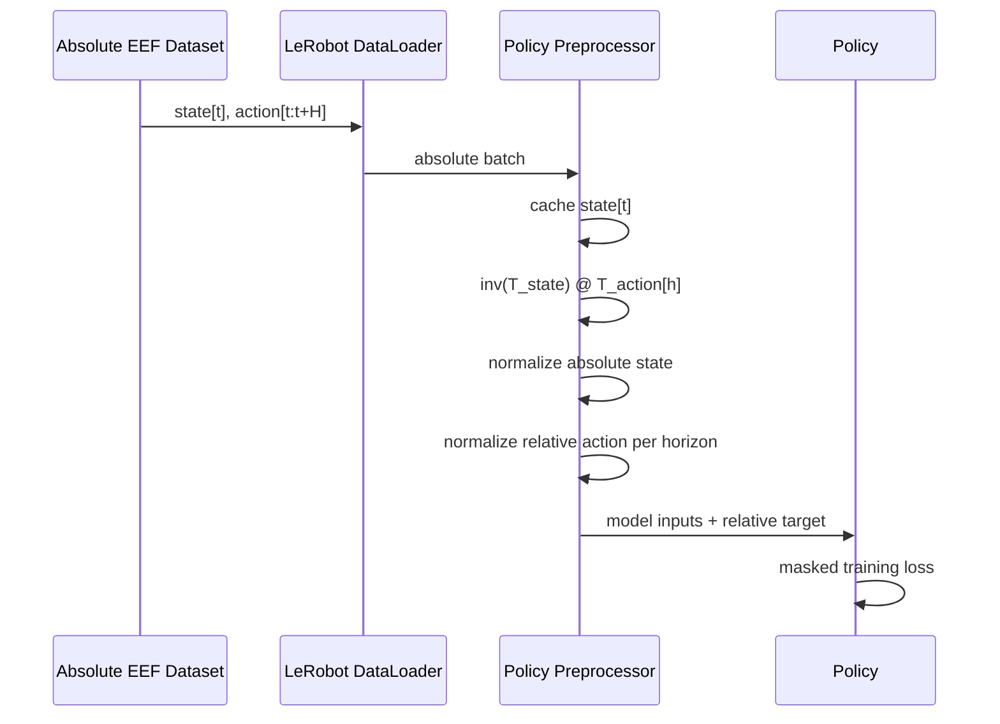
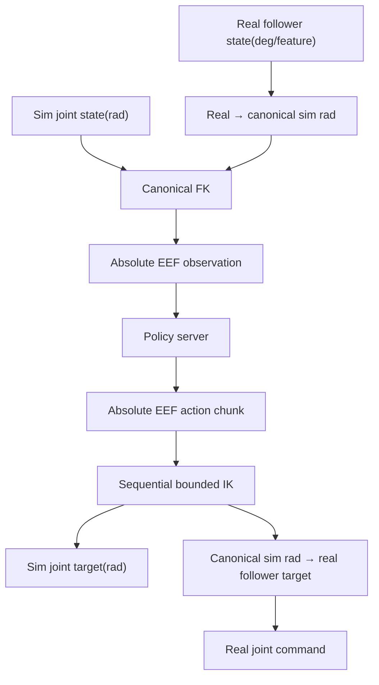
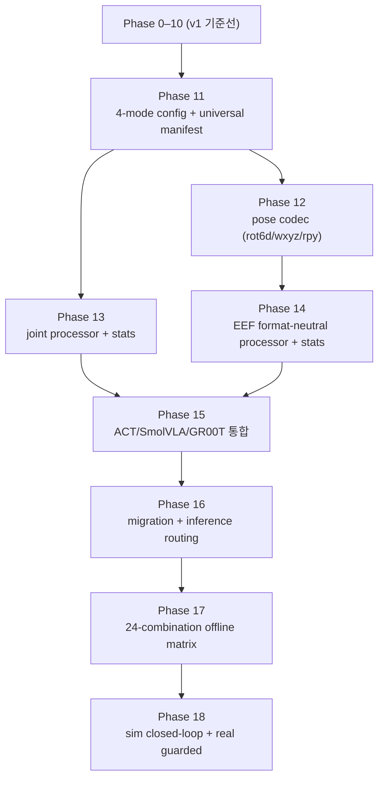

# ACT·SmolVLA·GR00T-N1.7 공통 action representation 파이프라인 명세

| 항목 | 값 |
|---|---|
| 문서 상태 | 구현 기준선(Baseline), **v2** |
| 작성일 | 2026-07-27 (v1) / 2026-07-27 (v2 확장) |
| 대상 로봇 | SO-101 follower, arm 5 DoF + gripper 1 DoF |
| 대상 policy | ACT · SmolVLA · GR00T-N1.7 |
| dataset | LeRobot Dataset v3, **absolute** state/action (joint 또는 EEF) |
| action mode | `joint_absolute` · `joint_relative` · `eef_absolute` · `eef_relative` |
| EEF pose format | `xyz_rot6d_rows` · `xyz_quaternion_wxyz` · `xyz_rpy` |
| 지원 조합 | 8 representation × 3 policy = **24 조합** |
| 기준 frame | `base_link → tcp_grasp` (EEF mode) |
| LeRobot 기준 | v0.6.0, commit `30da8e687a6dfc617fcd94afc367ac7071c376ce` |
| Isaac-GR00T 기준 | N1.7 release, commit `23ace64f17aa5015259b8609d371eb61a357c776` |

이 문서에서 **MUST**, **SHOULD**, **MAY**는 각각 필수, 권장, 선택 요구사항을 뜻한다.

### 문서 구조

- **§1–§21 (v1)**: `eef_relative` + `xyz_rot6d_rows` 단일 조합의 구현 기준선이다.
  v2에서도 그대로 유효하며, v2는 이를 덮어쓰지 않고 일반화한다.
- **§22–§28 (v2)**: 4-mode enum, 3 pose format, universal manifest, 24-combination
  matrix, Phase 11–18을 정의한다. v1 문장과 충돌하는 지점은 각 v1 절에 v2 포인터를 달았다.

### 구현 상태

2026-07-27 별도 worktree `codex/eef-relative-pipeline` 기준:

| Phase | 범위 | 상태 | 검증 근거 |
|---|---|---|---|
| 0–3 | v1 | 구현·offline 검증 완료 | v0.6.0 tripwire patch, SE(3)/metadata/stats self-check |
| 4–6 | v1 | 구현·1-batch 검증 완료 | 실제 ACT·SmolVLA·GR00T-N1.7 forward/backward |
| 7 | v1 | 구현·회귀 검증 완료 | sync/async full-chunk postprocess와 external queue |
| 8 | v1 | 구현·offline sweep 완료 | 32 chunk×8 horizon, 256 pose, IK failure 0 |
| 9 | v1 | 실행 대기 | 학습된 EEF checkpoint와 recorded EEF dataset 필요 |
| 10 | v1 | 실행 대기 | 연결된 real SO-101, 작업자/e-stop, 명시적 hardware gate 필요 |
| 11 | v2 | **core 구현·offline 검증 완료** | `validate_action_representation_v2.py` 11 checks |
| 12 | v2 | **구현·offline 검증 완료** | `validate_pose_codec.py` 10 checks |
| 13 | v2 | **구현·offline 검증 완료** | `validate_joint_representation.py` 8 checks + stats/processor validator |
| 14 | v2 | **구현·offline 검증 완료** | `validate_action_dataset_contract.py` 6 + `validate_action_representation_stats.py` 6 + `validate_action_representation_processor.py` 7 checks |
| 15 | v2 | **구현·검증 완료** | patcher idempotency + 24/24 policy 조합 + 실제 CLI checkpoint |
| 16 | v2 | **구현·검증 완료(hardware/Hub 업로드 제외)** | migration 4 checks + routing 6 checks + CLI assertion 5 checks |
| 17 | v2 | **구현·검증 완료** | 24/24 조합 × 13 필수 check = 312/312 PASS (`validate_action_representation_matrix.py`, GPU Docker 실행) |
| 18 | v2 | **진행 중** — contract dry-run 완료, 실제 sim/real 미실행 | 24/24 조합 × 6 stage contract dry-run PASS(`validate_action_representation_rollout_dry_run.py`). sim closed-loop=NOT_RUN, real guarded=BLOCKED_EXTERNAL |

Phase 15에서 LeRobot patch/factory가 schema v2로 전면 전환됐다. 신규 학습 경로는 4-mode
CLI(`--policy.action_representation.mode` + `.pose_format`)를 쓰고, 대상 policy
(ACT·SmolVLA·GR00T-N1.7)는 mode와 무관하게 dataset 계약·stats profile·v2 processor·
manifest를 **MUST** 갖춘다. migration CLI와 client routing은 Phase 16 범위다.

**v1 checkpoint 영향**: v1 manifest(`schema_version` 문자열)를 가진 checkpoint는 이제
load 시 fail-fast한다. 자동 승격은 금지이며 Phase 16 migration 또는 명시적 legacy opt-in이
필요하다. v1 module(`eef_action_contract`·`lerobot_eef_processor`·`eef_relative_stats`·
`eef_checkpoint_manifest`)은 migration이 읽을 수 있도록 코드베이스에 남아 있다.

Phase 8 workspace sweep의 현재 관측값은 position residual 최대 `0.000385641 m`,
orientation residual 최대 `0.00981131 rad`, 원 joint 재구성 최대 `0.0209274 rad`,
평균/최대 IK iteration `0.996/1`이다. production 기본 joint 허용치는 이 sweep에 따라
`0.03 rad`로 고정하되, 실제 기기 gate는 Phase 10 검증 전까지 닫힌 상태를 유지한다.

---

## 1. 최종 결정

이 프로젝트의 EEF-relative action은 다음 한 문장으로 정의한다.

> LeRobot v3에는 state/action을 모두 canonical absolute EEF pose로 저장하고, 학습
> preprocessor가 현재 absolute EEF state를 기준으로 action chunk 전체를 SE(3) relative
> target으로 바꾸며, 추론 postprocessor가 같은 기준 state로 chunk 전체를 absolute EEF
> target으로 복원한 뒤, real/sim platform adapter가 IK를 통해 joint command로 변환한다.

따라서 dataset 자체를 relative action으로 덮어쓰지 않는다. 다음 두 계약을 분리한다.

1. **영속 데이터 계약**: absolute EEF state/action
2. **모델 target 계약**: current-state-relative EEF action + absolute gripper

```mermaid
flowchart LR
    J["Joint-space LeRobot v3"] --> C["absolute joint → absolute EEF 변환"]
    C --> D["Absolute EEF LeRobot v3"]
    D --> P["SE(3) preprocessor<br/>absolute → relative"]
    P --> N["Policy별 normalize"]
    N --> M["ACT / SmolVLA / GR00T-N1.7"]
    M --> U["Policy별 unnormalize"]
    U --> Q["SE(3) postprocessor<br/>relative → absolute"]
    Q --> I["Platform adapter<br/>EEF chunk → IK → joint chunk"]
    I --> R["Real SO-101 또는 Isaac Sim"]
```



### 1.1 이 설계를 선택하는 이유

- absolute dataset은 replay, 시각화, FK 검증, 다른 action representation 재생성에 재사용할 수 있다.
- ACT·SmolVLA·GR00T가 **같은 물리적 relative target**을 학습한다.
- 단순 `action - state`가 아닌 rigid transform composition을 사용하므로 회전이 올바르다.
- real/sim 차이는 policy processor가 아니라 입출력 platform adapter에서만 처리한다.
- checkpoint에 processor 설정과 relative stats를 저장해 추론 시 원 dataset이 필요 없다.

---

## 2. 현재 기준과 선행 조건

### 2.1 확인된 upstream 동작

| 구성 | 확인 결과 |
|---|---|
| LeRobot train | 공통 train loop가 policy별 `PolicyProcessorPipeline`을 호출한다. 모든 policy가 같은 processor를 쓰는 구조는 아니다. |
| LeRobot generic relative step | masked dimension에 대해 `relative = action - state`, `absolute = relative + state`를 수행한다. EEF pose 의미를 해석하지 않는다. |
| ACT v0.6.0 | relative action flag와 SE(3) 변환이 없다. |
| SmolVLA v0.6.0 | usable relative action 기능이 없다. |
| GR00T N1.7 v0.6.0 | checkpoint metadata 기반 EEF relative decode는 있으나, LeRobot custom dataset 학습 경로의 EEF relative encode는 완전하지 않다. |
| Isaac-GR00T N1.7 | dataset은 absolute로 유지한다. 학습 시 `T_rel = inv(T_state) @ T_action`, 추론 시 `T_abs = T_state @ T_rel`을 사용한다. |
| LeRobot async server v0.6.0 | action chunk를 step별로 postprocess한다. horizon stats와 하나의 기준 pose를 쓰는 EEF-relative에는 부적합하다. |
| LeRobot sync eval v0.6.0 | `select_action()`의 내부 queue 때문에 relative chunk 기준 state가 tick마다 바뀔 수 있어 부적합하다. |

#### 2.1.1 기존 policy의 state/action representation

여기서 **policy가 사용하는 좌표계**와 **SO-101 dataset이 제공한 좌표계**를 구분해야 한다.
ACT와 SmolVLA 모델은 joint/EEF 또는 absolute/relative의 물리적 의미를 자체적으로 해석하지
않고, processor가 전달한 고정 길이 vector를 학습하고 같은 의미의 vector를 출력한다.
따라서 이 두 policy의 기존 좌표계는 model architecture가 정한 값이 아니라 dataset과
robot/environment action 계약이 정한 값이다.

이 프로젝트에서 v1 EEF-relative 파이프라인을 추가하기 전의 SO-101 기준선은 세 policy 모두
다음과 같다.

```text
observation.state = 현재 absolute joint state
training action    = 미래 absolute joint target chunk
inference output   = absolute joint target chunk
```

relative/absolute는 **action target의 기준**을 뜻한다. observation state는 relative target의
기준점이므로 relative-action mode에서도 current absolute state로 유지한다.

| Policy/runtime | 기존 학습 입력과 target | 기존 추론 출력 | upstream의 좌표 의미 |
|---|---|---|---|
| ACT, LeRobot v0.6.0 | dataset의 absolute `observation.state`와 `action`을 `MEAN_STD` normalize한 vector. SO-101 기준선에서는 둘 다 joint-space absolute다. | unnormalize한 dataset action과 같은 의미의 vector. SO-101에서는 absolute joint target이다. | joint/EEF 의미를 해석하지 않으며 relative/SE(3) processor가 없다. |
| SmolVLA, LeRobot v0.6.0 | dataset의 absolute state/action vector를 `MEAN_STD` normalize한다. SO-101 기준선에서는 joint-space absolute다. | unnormalize한 absolute joint target vector다. | 좌표 의미를 해석하지 않는다. ALOHA용 `use_delta_joint_actions_aloha`는 기본 false이고 v0.6.0에서는 `NotImplementedError`다. |
| GR00T-N1.7, LeRobot v0.6.0 wrapper | 기본 `use_relative_actions=false`에서는 dataset/modality의 absolute state/action을 pack·normalize한다. SO-101 기준선에서는 joint-space absolute다. | checkpoint modality와 같은 representation으로 decode하며, SO-101 기준선에서는 absolute joint target이다. | 고정 좌표계가 아니라 modality metadata의 `type={eef,non_eef}`, `rep={absolute,relative}`, `format`에 의해 정해진다. 기본값은 `absolute + non_eef + default`다. |
| GR00T-N1.7, Isaac-GR00T reference | source dataset의 state/action은 absolute다. `use_relative_action=true`이고 group metadata가 relative이면 학습 직전에 target을 변환한다. EEF `xyz+Rot6D`는 \(T_s^{-1}T_a\), non-EEF joint는 `q_action-q_state`, gripper group은 설정에 따라 absolute로 둔다. | relative group을 unnormalize한 뒤 EEF는 \(T_sT_{rel}\), joint는 `q_state+Δq`로 복원하여 absolute action을 반환한다. | embodiment별 modality config가 결정한다. N1.7 fine-tune launcher는 relative 처리를 켜지만 모든 embodiment가 동일한 EEF 좌표계를 쓰는 것은 아니다. |

따라서 “ACT/SmolVLA는 원래 absolute joint 모델”이라는 표현은 SO-101 기존 dataset/runtime에
대해서는 맞지만, architecture가 absolute joint에 고정됐다는 뜻은 아니다. 반대로
GR00T-N1.7은 pretrained checkpoint와 embodiment metadata에 action 의미가 포함되므로,
checkpoint의 modality config를 확인하지 않고 좌표계를 추정해서는 안 된다.

주요 참고 소스:

- `ref_repos/lerobot/src/lerobot/processor/relative_action_processor.py`
- `ref_repos/lerobot/src/lerobot/policies/{act,smolvla,groot}/processor_*.py`
- `ref_repos/lerobot/src/lerobot/async_inference/policy_server.py`
- `ref_repos/lerobot/src/lerobot/rollout/inference/{sync,rtc}.py`
- `ref_repos/Isaac-GR00T/gr00t/data/state_action/state_action_processor.py`
- `ref_repos/Isaac-GR00T/gr00t/data/state_action/{pose,action_chunking}.py`
- `ref_repos/Isaac-GR00T/gr00t/data/stats.py`

### 2.2 프로젝트 런타임 선행 조건

Linux `policy-server`와 Windows 실기기 client는 LeRobot **v0.6.0 + GR00T-N1.7**을 기준으로
분리돼 있다.

1. policy-server image는 PyPI `lerobot[smolvla,async,groot]==0.6.0`을 Python 3.12에 설치한다.
2. `docker/lerobot_v060_eef_relative_patch.py`가 v0.6.0 source signature를 먼저 검증한 뒤
   processor factory, train/checkpoint manifest, async server, sync rollout을 멱등 수정한다.
3. patch는 pristine v0.6.0 worktree에 두 번 적용해 같은 결과가 나와야 하며, 예상 source가
   다르면 부분 적용하지 않고 build를 중단한다.
4. image label과 checkpoint manifest에 upstream commit
   `30da8e687a6dfc617fcd94afc367ac7071c376ce`, project commit, project source-tree hash를 기록한다.
5. Windows는 `scripts/real/pyproject.toml`의 LeRobot 0.6.0/Python 3.12 전용 lock을 사용하며,
   Isaac host의 Python 3.11/NumPy 1.26 환경을 재사용하지 않는다.

reference clone은 수정하지 않는 read-only 기준선이다. 장기 유지보수에서 upstream patch가
여러 버전으로 분기될 때는 같은 변경을 pinned fork commit으로 승격한다.

---

## 3. 범위

### 3.1 v1 포함 범위

- LeRobot v3 absolute joint dataset을 absolute EEF dataset으로 변환
- `observation.state`와 `action` 모두 10D absolute EEF 계약 사용
- ACT·SmolVLA·GR00T-N1.7의 공통 EEF-relative target 생성
- policy별 normalization을 유지하면서 horizon-aware relative action stats 사용
- processor와 stats의 checkpoint 저장/복원
- full-chunk sync/async inference
- sim/real observation FK 및 action IK adapter
- 실기기 배포 전 safety gate와 sim closed-loop 검증

### 3.2 v1 제외 범위

- relative dataset을 별도 영속 포맷으로 생성
- RPY 또는 quaternion relative-action 학습
- multi-arm/mobile-base generalized schema
- EEF pose와 redundant joint action을 동시에 예측하는 hybrid action
- EEF pose를 성분별 평균하는 temporal ensemble/async overlap aggregation
- RTC overlap의 SE(3) re-anchoring
- 서로 다른 `base_frame` 또는 `eef_frame` dataset의 자동 frame calibration

제외 항목은 데이터 손실 없이 후속 버전에서 추가할 수 있어야 한다.

---

## 4. 불변 계약

구현 전체에서 다음 조건을 MUST 만족한다.

1. **dataset은 absolute다.**
   - `observation.state`: 현재 측정 joint를 FK한 absolute EEF pose
   - `action`: 기록된 absolute joint target을 FK한 absolute EEF target
2. **기준 pose는 chunk마다 하나다.**
   - observation history가 있으면 마지막 state를 사용한다.
   - chunk의 모든 action timestep은 동일한 기준 state를 사용한다.
3. **회전은 SE(3)로 계산한다.**
   - Rot6D 벡터를 빼거나 더하지 않는다.
4. **gripper는 absolute다.**
   - relative transform 대상은 EEF pose 9D뿐이다.
5. **postprocess는 full chunk에 한 번만 적용한다.**
   - `[B,H,D]`를 `[B,D]`로 잘라 반복 호출하지 않는다.
6. **policy 출력은 absolute EEF다.**
   - IK, joint limit, real/sim calibration은 policy processor 밖의 platform adapter 책임이다.
7. **real/sim은 같은 kinematic frame을 쓴다.**
   - `base_link → tcp_grasp`, xyz meter, rotation matrix row convention을 공유한다.
8. **inference checkpoint는 self-contained다.**
   - action representation config와 normalization stats가 checkpoint에 포함된다.
9. **계약 불일치는 fail-fast다.**
   - 잘못된 차원, 이름, frame, rotation format, stats horizon을 추정으로 보정하지 않는다.

---

## 5. Dataset 계약

### 5.1 v1 canonical layout

`scripts/convert/joint_dataset_to_eef.py`의 기본 출력만 v1 학습 입력으로 허용한다.

| index | 이름 | 단위/의미 |
|---:|---|---|
| 0:3 | `tcp_grasp.{x,y,z}` | `base_link` 기준 meter |
| 3:9 | `tcp_grasp.rot6d.r{0,1}c{0,1,2}` | rotation matrix의 첫 두 **row** |
| 9 | `gripper.pos` | canonical policy feature `[0,100]`, absolute |

필수 shape:

```text
observation.state: float32 [10]
action:            float32 [10]
```

필수 `meta/modality.json` group:

```json
{
  "state": {
    "eef_9d": {"start": 0, "end": 9},
    "gripper_position": {"start": 9, "end": 10}
  },
  "action": {
    "eef_9d": {"start": 0, "end": 9},
    "gripper_position": {"start": 9, "end": 10}
  }
}
```

필수 `meta/info.json.so101_eef_conversion`:

```json
{
  "base_frame": "base_link",
  "eef_frame": "tcp_grasp",
  "rotation_representation": "rot6d",
  "rotation_format": "xyz+rot6d_rows",
  "gripper_format": "canonical_policy_feature_[0,100]",
  "keep_joints": false,
  "urdf_sha256": "...",
  "robot_yaml_sha256": "..."
}
```

### 5.2 RPY와 quaternion의 처리 범위

converter의 `--rotation-representation rpy|wxyz`는 다음 용도로 계속 지원한다.

- FK와 frame 정합 검증
- dataset 분석/시각화
- 외부 모델 형식 변환

그러나 v1 EEF-relative 학습은 `rot6d`만 MUST 허용한다.

- RPY에는 angle wrap과 gimbal singularity가 있다.
- quaternion은 `q`와 `-q`가 같은 회전을 나타내므로 학습 통계 연속성 처리가 추가로 필요하다.
- GR00T-N1.7 native EEF 계약과 직접 맞는 형식은 `xyz + Rot6D`다.

RPY/wxyz dataset으로 EEF-relative mode를 켜면 trainer가 명시적인 오류를 내야 한다.

> **v2 변경**: Phase 12부터 `xyz_quaternion_wxyz`와 `xyz_rpy`도 **학습 가능한 pose
> format**이다. 위 제약은 v1 조합에만 적용된다. v2 계약은 §23을 따르며, 각 format의
> 부호/wrap/singularity 요구사항이 충족되지 않으면 여전히 fail-fast한다.

### 5.3 `--keep-joints`

v1 policy action에는 `--keep-joints` 출력을 사용하지 않는다. joint를 보조 observation으로
추가하려면 향후 `observation.joints`라는 별도 feature로 정의하고, action에 redundant joint
target을 붙이지 않는다.

---

## 6. SE(3) 수학 계약

### 6.1 표기

- \(T^E_B\): `base_link`에서 본 `tcp_grasp` pose
- \(T_s\): 현재 observation state의 absolute pose
- \(T_{a,h}\): action chunk의 h번째 absolute target
- \(T_{rel,h}\): 현재 state 기준 h번째 relative target

학습 target:

\[
T_{rel,h} = T_s^{-1} T_{a,h}
\]

추론 복원:

\[
T_{abs,h} = T_s T_{rel,h}
\]

즉,

\[
p_{abs,h} = p_s + R_s p_{rel,h}, \qquad
R_{abs,h} = R_s R_{rel,h}
\]

단순한 `p_abs = p_s + p_rel`도 state가 회전한 경우에는 틀리므로 translation까지 homogeneous
transform composition으로 처리해야 한다.

### 6.2 Rot6D row convention

9D pose는 다음 순서다.

```text
[x, y, z, r00, r01, r02, r10, r11, r12]
```

decode 시 두 row를 Gram-Schmidt orthonormalization하고 세 번째 row를 cross product로 만든다.

```python
row0 = normalize(v0)
row1 = normalize(v1 - dot(v1, row0) * row0)
row2 = cross(row0, row1)
R = stack([row0, row1, row2], axis=-2)
```

많은 Rot6D 구현이 matrix의 첫 두 column을 사용하므로, 외부 구현을 가져올 때 row/column
convention을 반드시 확인한다. 이 프로젝트는 `src/so101_contract/eef_kinematics.py` 및
Isaac-GR00T N1.7과 맞춘 **row convention**을 사용한다.

### 6.3 Tensor shape

공통 함수는 다음 shape를 지원해야 한다.

```text
state_pose:    [B, 9] 또는 [B, T_obs, 9]
action_pose:   [B, H, 9]
relative_pose: [B, H, 9]
```

- state가 `[B,T_obs,9]`이면 `state[:, -1]`을 사용한다.
- action이 inference 단일 chunk라도 batch dimension을 유지한다.
- 모든 batch/chunk element에 같은 state reference를 broadcast한다.
- dtype/device를 보존한다.
- 입력 NaN/Inf, 0-norm/parallel Rot6D row는 오류다.

### 6.4 Passthrough group

최종 model target은 다음과 같다.

```text
target[..., 0:9] = encode(inv(T_state) @ T_action)
target[..., 9]   = absolute_action_gripper
```

postprocess는 반대로 pose 9D만 composition하고 gripper는 그대로 반환한다.

---

## 7. 구성 스키마

세 policy가 공통 base config에서 다음 nested config를 사용한다.

```yaml
policy:
  action_representation:
    mode: eef_relative
    reference: current_observation
    pose_format: xyz_rot6d_rows
    state_pose_group: eef_9d
    action_pose_group: eef_9d
    passthrough_action_groups:
      - gripper_position
    base_frame: base_link
    eef_frame: tcp_grasp
    stats_file: meta/relative_action_stats.json
    strict: true
```

기본값은 `mode: absolute`이며 기존 policy 동작을 바꾸지 않는다.

> **v2 변경**: 모호한 `mode: absolute`는 schema v2 config에서 **금지**된다. v2는
> `joint_absolute`/`joint_relative`/`eef_absolute`/`eef_relative` 4-mode enum과 별도
> `pose_format`을 쓴다(§22). 위 v1 스키마는 이미 배포된 v1 checkpoint 호환을 위해서만
> 남으며, 신규 config는 `so101_contract.action_representation.ActionRepresentationSpec`을
> 사용한다.

### 7.1 CLI 예

```bash
--policy.action_representation.mode=eef_relative \
--policy.action_representation.pose_format=xyz_rot6d_rows \
--policy.action_representation.state_pose_group=eef_9d \
--policy.action_representation.action_pose_group=eef_9d
```

### 7.2 dataset metadata에서 index resolve

학습 시 factory가 `meta/modality.json`을 읽어 group index를 resolve한다. resolve된 processor
config에는 group 이름뿐 아니라 다음 값을 모두 저장한다.

- state/action pose indices
- passthrough indices
- 전체 action dimension
- feature names
- base/eef frame
- rotation convention
- URDF/robot YAML hash
- transform version
- dataset contract fingerprint

추론은 dataset metadata를 다시 읽지 않고 checkpoint의 resolved config를 사용한다.

### 7.3 config 충돌

다음 경우 MUST 실패한다.

- `mode=eef_relative`인데 dataset이 10D Rot6D canonical layout이 아님
- state/action pose group 크기가 9가 아님
- state와 action frame/hash가 다름
- passthrough group과 pose group index가 겹침
- 전체 action dimension에 미분류 index가 남음
- GR00T legacy `use_relative_actions=true`와 common `mode=eef_relative`를 동시에 설정
- native-relative GR00T checkpoint processor를 common-relative로 명시적 migration 없이 재개

---

## 8. Relative action statistics

### 8.1 원칙

처리 순서는 반드시 다음과 같다.

```text
absolute action
  → SE(3) relative action 생성
  → relative action stats로 normalize
  → model
  → relative action stats로 unnormalize
  → SE(3) absolute action 복원
```

state는 absolute 상태로 유지하고 기존 absolute state stats로 normalize한다.

### 8.2 horizon-aware stats

action stats는 `[H,D]`를 MUST 보존한다. 이는 Isaac-GR00T의 horizon별 relative stats와
같은 의미이며, 모든 policy에서 같은 target distribution을 사용하게 한다.

```text
mean, std, min, max, q01, q99: [H, 10]
count: valid anchor window 수
```

각 horizon의 0:9는 relative pose, 9는 그 horizon의 absolute gripper action 통계다.

### 8.3 sampling 계약

stats generator는 실제 training sampler의 `action_delta_indices`와
`observation_delta_indices`를 입력으로 받는다.

- reference state delta는 observation history의 마지막 index다.
- v1은 `reference_state_delta == action_delta_indices[0] == 0`을 요구한다.
- episode boundary를 넘는 window는 통계에서 제외한다.
- chunk의 모든 horizon이 유효한 anchor만 사용한다.
- training의 padded action은 loss mask 대상이며 stats에는 포함하지 않는다.
- debug용 subset stats는 `production=false`로 기록하고 trainer가 기본적으로 거부한다.

### 8.4 파일 형식

dataset에는 `meta/relative_action_stats.json`을 추가한다. policy마다 horizon이 다를 수 있으므로
한 파일에 여러 profile을 저장한다.

```json
{
  "schema_version": 1,
  "generator_version": "so101_eef_relative_stats_v1",
  "dataset_contract": {
    "source_columns_sha256": "...",
    "info_sha256": "...",
    "modality_sha256": "...",
    "total_episodes": 100,
    "total_frames": 50000
  },
  "profiles": {
    "sha256:<profile-id>": {
      "production": true,
      "transform": {
        "mode": "eef_relative",
        "pose_format": "xyz_rot6d_rows",
        "base_frame": "base_link",
        "eef_frame": "tcp_grasp",
        "pose_indices": [0, 1, 2, 3, 4, 5, 6, 7, 8],
        "passthrough_indices": [9]
      },
      "sampling": {
        "observation_delta_indices": [0],
        "action_delta_indices": [0, 1, 2],
        "reference_observation_index": -1,
        "horizon": 3
      },
      "stats": {
        "action": {
          "mean": [[0.0]],
          "std": [[1.0]],
          "min": [[-1.0]],
          "max": [[1.0]],
          "q01": [[-1.0]],
          "q99": [[1.0]],
          "count": 1000
        }
      }
    }
  }
}
```

예시의 stats 숫자는 schema만 나타내며 실제 row는 `[H,10]`이어야 한다.

### 8.5 cache key와 무효화

profile ID는 다음 canonical JSON의 SHA-256으로 만든다.

- source state/action column checksum과 episode 경계
- `meta/info.json`, `meta/modality.json` hash
- transform/generator version
- resolved group indices와 feature names
- frame/rotation/kinematics hash
- observation/action delta indices

하나라도 달라지면 기존 stats를 재사용하지 않는다. 파일 update는 atomic write로 수행한다.

### 8.6 policy별 stats 적용

| Policy | 적용 방식 |
|---|---|
| ACT | 기존 `NormalizerProcessorStep`의 ACTION stats만 `[H,D]` relative stats로 교체 |
| SmolVLA | 기존 normalizer의 ACTION stats만 교체 |
| GR00T-N1.7 | pack/decode용 modality stats에서 action group을 horizon-aware relative stats로 교체하고 state는 absolute stats 유지 |

GR00T에서는 native relative 변환 flag를 끄고 common SE(3) step이 변환을 담당한다. GR00T pack은
이미 relative가 된 수치를 normalize/pad하고, decoder는 unnormalize/unpack만 수행한다.

---

## 9. 공통 processor 설계

### 9.1 새 processor step

LeRobot fork에 다음 두 step을 추가한다.

```text
SE3RelativeActionsProcessorStep
SE3AbsoluteActionsProcessorStep
```

registry 이름:

```text
se3_relative_actions_processor
se3_absolute_actions_processor
```

#### `SE3RelativeActionsProcessorStep`

- observation의 raw absolute state를 매 호출 cache한다.
- training batch에 action이 있으면 pose group을 absolute→relative로 변환한다.
- inference observation에는 action이 없어도 state cache를 갱신한다.
- action/state tensor를 in-place 수정하지 않는다.
- `reset()`에서 cached state를 지운다.

#### `SE3AbsoluteActionsProcessorStep`

- paired preprocessor의 cached state를 사용한다.
- full action chunk의 pose group을 relative→absolute로 복원한다.
- passthrough group은 변경하지 않는다.
- cache가 없거나 action이 2D single-step이면 strict mode에서 실패한다.

### 9.2 serialization과 pair 재연결

두 processor는 config와 stats를 checkpoint processor JSON/safetensors에 저장한다.
pre/post pipeline은 독립적으로 deserialize되므로 policy factory가 다음 연결을 다시 만든다.

```text
post.SE3AbsoluteActionsProcessorStep.relative_step
    → pre.SE3RelativeActionsProcessorStep
```

기존 `_wire_relative_action_processor_pair()`와 같은 패턴을 사용하되 generic vector-relative
step과 SE(3) step을 type별로 정확히 연결한다. state cache 자체는 checkpoint에 저장하지 않는다.

### 9.3 공통 Torch 함수

다음 순수 함수를 processor와 tests에서 공유한다.

```python
absolute_eef_to_relative(
    state: Tensor,       # [B,9] or [B,T_obs,9]
    actions: Tensor,     # [B,H,9]
) -> Tensor             # [B,H,9]

relative_eef_to_absolute(
    state: Tensor,
    relative_actions: Tensor,
) -> Tensor
```

함수는 CPU/CUDA, float32/float64에서 동작해야 한다. normalization 대상 생성 함수이므로
autograd는 요구하지 않지만 불필요하게 graph를 끊지 않는다.

---

## 10. Policy별 processor 배치

### 10.1 ACT

```text
Train/inference pre:
Rename → AddBatch → Device
→ SE3 absolute-to-relative/cache
→ Normalize(absolute state + relative action)

Inference post:
Unnormalize(relative action)
→ SE3 relative-to-absolute
→ Device(cpu)
```

ACT의 `select_action()` 내부 action queue는 사용하지 않는다. v1에서
`temporal_ensemble_coeff`가 켜져 있으면 fail-fast한다. temporal ensemble은 absolute EEF
복원 뒤 SE(3)-aware 방식으로 별도 구현하기 전까지 지원하지 않는다.

### 10.2 SmolVLA

```text
Train/inference pre:
Rename → AddBatch → Task newline → Tokenizer → Device
→ SE3 absolute-to-relative/cache
→ Normalize(absolute state + relative action)

Inference post:
Unnormalize(relative action)
→ SE3 relative-to-absolute
→ Device(cpu)
```

tokenizer는 action을 수정하지 않으므로 기존 위치를 유지한다. 핵심 불변식은 SE(3) 변환이
action normalization보다 먼저 실행된다는 것이다.

### 10.3 GR00T-N1.7

```text
Train/inference pre:
Rename → AddBatch
→ SE3 absolute-to-relative/cache
→ Groot N1.7 pack + relative-action stats normalize + pad
→ VLM encode → Device

Inference post:
Groot decode + unnormalize + unpack(relative action)
→ SE3 relative-to-absolute
→ Device(cpu)
```

GR00T에 대해서는 다음을 MUST 지킨다.

- `GrootConfig.use_relative_actions`의 generic/native 변환과 common step을 중복 적용하지 않는다.
- common mode에서는 GR00T processor asset의 `use_relative_action`을 false로 저장한다.
- modality group은 `eef_9d`와 `gripper_position`의 의미를 보존한다.
- action stats는 absolute dataset stats가 아니라 이 명세의 horizon-aware stats를 사용한다.
- `GrootPolicy.select_action()` 대신 `predict_action_chunk()`를 호출한다.

이 구조는 Isaac-GR00T와 같은 물리 수학과 stats 의미를 사용하면서, ACT·SmolVLA와 동일한
공통 step을 사용한다.

---

## 11. 학습 파이프라인



### 11.1 factory 동작

train processor factory는 다음 순서로 동작한다.

1. dataset metadata와 policy delta indices를 읽는다.
2. action representation config를 검증하고 group indices를 resolve한다.
3. 일치하는 relative stats profile을 선택한다.
4. 없으면 명시적 opt-in에서만 stats를 생성하거나, 기본적으로 생성 명령을 안내하며 실패한다.
5. state/image stats는 dataset absolute stats를 유지한다.
6. action stats만 relative profile로 교체한 policy별 processor를 만든다.
7. config fingerprint를 pre/post processor 양쪽에 저장한다.

장시간 학습 시작 시 암묵적으로 전체 dataset stats를 계산해 startup이 멈춘 것처럼 보이는 것을
피하기 위해, production 기본값은 **사전 생성 필수**로 한다.

### 11.2 pretrained와 resume

| 경우 | 동작 |
|---|---|
| raw/base pretrained model에서 새 fine-tune | model weight는 로드하되 dataset contract로 processor와 action stats를 재구축 |
| common EEF-relative checkpoint resume | 저장된 config/processor fingerprint가 현재 dataset profile과 일치해야 함 |
| absolute-action checkpoint fine-tune | 명시적 `mode=eef_relative` 전환 허용, processor 재구축 사실을 로그/manifest에 기록 |
| native-relative GR00T checkpoint | migration tool 없이 common mode resume 금지 |

LeRobot train의 pretrained stats override 로직도 ACTION에는 relative stats를 주입하도록 수정한다.
absolute dataset stats로 되돌아가면 학습/추론 scale이 깨지므로 checksum 검사를 둔다.

---

## 12. 추론 파이프라인

### 12.1 full-chunk 규칙

모든 target policy의 공통 추론 API는 다음이어야 한다.

```python
processed_obs = preprocessor(raw_absolute_eef_observation)
normalized_relative_chunk = policy.predict_action_chunk(processed_obs)
absolute_eef_chunk = postprocessor(normalized_relative_chunk)
execution_chunk = absolute_eef_chunk[:, :actions_per_chunk]
```

순서상 **postprocess 후 slice**한다. `[H,D]` stats와 full reference pose가 필요한 단계보다 먼저
slice하지 않는다.

### 12.2 sync eval

stock `lerobot_eval.py`의 per-tick `select_action()` 경로를 사용하지 않는다. EEF-relative 전용
chunk runner는 외부 queue를 가진다.

1. queue refill 시점에만 observation을 preprocess한다.
2. `predict_action_chunk()`로 full chunk를 얻는다.
3. full chunk를 한 번 postprocess한다.
4. absolute EEF chunk를 platform adapter로 joint chunk로 변환한다.
5. joint target queue에서 tick마다 하나씩 실행한다.

### 12.3 async policy-server

server의 필수 변경:

```text
기존:
predict chunk → slice → action step별 postprocessor 호출

변경:
predict full chunk → postprocessor(full [B,H,D]) → slice
→ TimedAction 목록 생성
```

server는 absolute EEF action을 반환한다. real/sim client가 이를 joint chunk로 변환한 다음
기존 action queue에 병합한다.

### 12.4 overlap aggregation

Rot6D vector를 elementwise 평균하지 않는다.

- v1 sim ROS client: 새 chunk를 IK로 joint target으로 바꾼 뒤 timestamp 기준 `latest_only`
- v1 Windows client: EEF chunk를 joint target으로 바꾼 뒤에만 기존 joint-space aggregation 허용
- EEF domain에서 합쳐야 한다면 translation 평균 + SO(3) geodesic/quaternion 평균을 별도 구현

### 12.5 RTC

LeRobot RTC는 full chunk postprocess 자체는 가능하지만, leftover action의 re-anchor와 overlap
처리가 EEF SE(3) 의미를 보장해야 한다. v1은 `mode=eef_relative`와 RTC 동시 사용을 금지한다.

---

## 13. Real/Sim platform adapter

policy processor의 출력은 absolute EEF target이다. 실제 robot/env action이 absolute joint
target이므로 client 쪽에 다음 공통 adapter를 둔다.



### 13.1 observation adapter

| Platform | 입력 | canonical 변환 |
|---|---|---|
| Sim | 6 joint radian | arm 5축을 FK, gripper를 `[0,100]`으로 encode |
| Real | follower arm degree + gripper feature | `real_follower_to_sim_radians()` 후 같은 FK |

출력은 dataset과 같은 10D `observation.state`다. camera는 변환하지 않는다.

### 13.2 action adapter

입력:

```text
absolute EEF action chunk [H,10]
current measured canonical joint state [6]
```

출력:

```text
absolute joint target chunk [H,6]
```

pose 9D는 sequential IK로 arm 5축 target을 구한다. h번째 해를 h+1의 seed로 사용하고,
gripper 1D는 IK 대상에서 제외해 canonical gripper target을 그대로 변환한다.

### 13.3 SO-101 5 DoF IK 요구사항

SO-101 arm은 5 DoF이므로 임의의 6D EEF pose를 정확히 만족할 수 없다. IK는 다음을 MUST 제공한다.

- position/orientation weighted residual
- damped least-squares 또는 bounded least-squares update
- URDF joint limit
- current/previous solution seed
- 최대 iteration과 convergence tolerance
- position/orientation residual report
- NaN/divergence 검출
- chunk 내 연속성 검사와 joint step 제한

초기 구현은 project-local NumPy solver로 real/sim에서 동일하게 실행하고,
Pink IK 및 cuRobo 결과와 offline sweep으로 교차 검증한다. solver tolerance/weight의 production
기본값은 sweep 결과로 고정하며, 검증 전 임의 값을 실기기에 사용하지 않는다.

### 13.4 IK 실패 정책

IK 실패를 joint clamp만으로 숨기지 않는다.

1. 해당 chunk를 실행 queue에 넣지 않는다.
2. 마지막 안전 target을 유지한다.
3. 즉시 새 observation으로 replan을 요청한다.
4. 연속 실패 횟수와 residual을 기록한다.
5. 설정된 연속 실패 한계를 넘으면 episode를 중단한다.

### 13.5 기존 affine server와의 관계

`policy-server-affine`은 joint-space policy의 real↔sim 변환용이다. EEF-relative mode에서는
real/sim calibration이 client platform adapter에서 적용되므로 server-side joint affine을
중복 적용하지 않는다. EEF mode는 standard/full-chunk policy server를 사용한다.

---

## 14. Checkpoint와 Hugging Face Hub 계약

### 14.1 self-contained artifact

학습 checkpoint/Hugging Face model repo에는 최소 다음 파일이 포함되어야 한다.

```text
config.json
model*.safetensors
policy_preprocessor.json
policy_postprocessor.json
<processor stats>.safetensors
action_representation.json
```

`action_representation.json`에는 다음을 기록한다.

- schema/transform version
- mode, frame, pose format, groups/resolved indices
- dataset source repo ID와 revision 또는 local fingerprint
- relative stats profile ID/hash
- LeRobot fork commit
- project commit
- URDF/robot YAML hash
- target policies/runtime compatibility

Hub에 push된 checkpoint는 dataset을 다시 다운로드하지 않아도 inference processor가 복원되어야 한다.
다만 custom processor code가 포함된 pinned LeRobot fork와 `so101_contract` runtime은 설치되어 있어야 한다.

### 14.2 Hub revision

dataset과 pretrained model은 가능하면 mutable branch 이름 대신 revision/commit SHA로 pin한다.
checkpoint model card에는 다음 tag/정보를 추가한다.

```text
lerobot
so101
eef-relative
se3
act | smolvla | groot-n1.7
```

token은 `.env`의 `HF_TOKEN`으로 주입하고 CLI 인자나 로그에 직접 출력하지 않는다.

---

## 15. 권장 코드 배치

### 15.1 이 project

| 경로 | 역할 |
|---|---|
| `src/so101_contract/eef_relative_action.py` | NumPy/Torch SE(3) encode/decode와 absolute↔relative 순수 함수 |
| `src/so101_contract/eef_policy_io.py` | real/sim observation FK 및 action adapter 공통 계약 |
| `src/so101_contract/eef_ik.py` | cross-platform bounded sequential IK |
| `scripts/data/generate_relative_action_stats.py` | horizon-aware stats profile 생성 |
| `scripts/contract/validate_eef_relative_contract.py` | dataset/checkpoint/frame/stats 검증 및 self-check |
| `scripts/contract/evaluate_eef_rollout_metrics.py` | sim/real runtime JSONL과 sim eval JSON을 acceptance threshold로 판정 |
| `scripts/inference/eef_robot_client.py` | Windows real client의 EEF observation/joint action adapter |
| `ros2_ws/.../so101_vla_policy/units.py` | sim EEF feature schema와 adapter 연결 |
| `ros2_ws/.../so101_vla_policy/vla_policy_node.py` | EEF obs 송신, returned EEF chunk의 IK/queue 처리 |
| `env/{act,smolvla,groot_n17}.env` | 공통 mode와 policy별 horizon/profile |
| `docker/Dockerfile.policy` | pinned LeRobot v0.6.0 fork 설치 |

`generate_relative_action_stats.py`는 기존 데이터를 수정하지 않고 metadata/stat artifact만 추가하므로
project script charter상 `scripts/data/`에 둔다.

### 15.2 LeRobot v0.6.0 patch surface

| upstream 경로 | 변경 |
|---|---|
| `src/lerobot/configs/policies.py` 또는 전용 config module | 공통 `ActionRepresentationConfig` |
| `src/lerobot/processor/se3_relative_action_processor.py` | registered pre/post steps |
| `src/lerobot/policies/factory.py` | dataset metadata 전달, processor pair 재연결 |
| `src/lerobot/policies/act/processor_act.py` | common step 삽입 |
| `src/lerobot/policies/smolvla/processor_smolvla.py` | common step 삽입 |
| `src/lerobot/policies/groot/processor_groot.py` | common step + relative stats + native transform 비활성 |
| `src/lerobot/scripts/lerobot_train.py` | action stats override 및 manifest 저장 |
| `src/lerobot/async_inference/policy_server.py` | full-chunk postprocess |
| `src/lerobot/rollout/inference/sync.py` | external absolute chunk queue |
| policy/processor/inference tests | round-trip·serialization·full-chunk regression |

---

## 16. 구현 순서

각 phase는 앞 phase의 acceptance criteria가 통과해야 시작한다.

### Phase 0 — 버전 기준선과 재현 가능한 patch

작업:

1. LeRobot v0.6.0 `30da8e6` source signature 기준선 고정
2. Docker policy image에 upstream/project SHA와 source-tree hash 기록
3. GR00T-N1.7 dependency/profile 추가
4. N1.5 profile은 제거하고 호환 patch 파일은 실행되지 않는 legacy 자료로 격리
5. Windows/ROS async shim 호환성 확인

완료 조건:

- ACT·SmolVLA·GR00T-N1.7 absolute joint smoke inference가 기존 동작과 동일
- image build가 version/commit을 출력
- reference clone은 수정되지 않음

### Phase 1 — 공통 SE(3) core

작업:

1. Torch/NumPy Rot6D row encode/decode
2. batched absolute↔relative 함수
3. frame/layout validator
4. Isaac-GR00T golden parity fixture

완료 조건:

- random/gimbal/180° 회전 round-trip
- `relative_to_absolute(state, absolute_to_relative(state, action))` 오차 허용치 통과
- 모든 chunk timestep이 같은 state reference를 쓰는 test 통과
- CPU float32/float64 및 CUDA float32 parity

### Phase 2 — config, metadata resolve, fingerprint

작업:

1. 공통 nested config 추가
2. `info.json`/`modality.json` group resolver
3. resolved contract/fingerprint 생성
4. 잘못된 RPY/wxyz/keep-joints/frame/hash fail-fast

완료 조건:

- canonical 10D dataset만 승인
- index/name 순서를 바꾼 fixture는 거부
- config JSON save/load round-trip

### Phase 3 — relative stats

작업:

1. episode-aware full-window iterator
2. horizon별 streaming stats
3. multi-profile JSON atomic update/cache
4. stats validator

완료 조건:

- Isaac-GR00T relative stats와 같은 fixture에서 수치 parity
- 서로 다른 ACT/Smol/GR00T horizon profile 공존
- dataset/action delta 변경 시 cache miss
- `[H,10]` shape와 passthrough gripper 통계 검증

### Phase 4 — processor와 ACT

작업:

1. SE(3) pre/post registered step
2. serialization과 pair relink
3. ACT factory/normalizer stats 연결
4. full-chunk local runner

완료 조건:

- ACT 1-batch train forward/backward
- processor checkpoint save/reload 후 같은 action
- full chunk output이 absolute EEF
- temporal ensemble 설정 거부

### Phase 5 — SmolVLA

작업:

1. SmolVLA processor 순서에 common step 삽입
2. relative stats 적용
3. tokenize/image pipeline 회귀 확인

완료 조건:

- SmolVLA 1-batch train forward/backward
- ACT와 동일 raw state/action에 동일 physical relative target
- checkpoint reload parity

### Phase 6 — GR00T-N1.7

작업:

1. common step을 pack 전/decode 후 배치
2. group별 relative action stats로 pack/decode 구성
3. native/generic relative 중복 경로 차단
4. base pretrained/new embodiment와 resume 분기

완료 조건:

- GR00T-N1.7 1-batch train forward/backward
- Isaac-GR00T와 relative encode/decode 및 horizon stats parity
- ACT·SmolVLA와 동일 physical target contract
- `select_action()`을 사용하지 않는 regression test

### Phase 7 — full-chunk inference infrastructure

작업:

1. async server full-chunk postprocess
2. sync external chunk queue
3. slice/postprocess 순서 수정
4. RTC/unsupported aggregation fail-fast

완료 조건:

- postprocessor 호출 횟수는 chunk당 정확히 1회
- cached state는 chunk를 만든 observation과 동일
- queue에서 다음 tick을 꺼내도 re-anchor가 일어나지 않음
- H별 stats가 single-step으로 잘못 broadcast되지 않음

### Phase 8 — real/sim platform adapter와 IK

작업:

1. sim/real observation→canonical EEF
2. bounded sequential IK
3. EEF chunk→joint chunk
4. slew/joint limit/failure/replan
5. ROS client와 Windows client 연결

완료 조건:

- sim/real matching joint pose가 같은 EEF observation 생성
- dataset action EEF를 IK한 결과가 원 joint action을 허용 오차 내 복원
- chunk joint trajectory가 limit/step 제한 준수
- 실패 chunk가 command queue에 들어가지 않음

### Phase 9 — sim closed-loop 검증

순서:

1. recorded action round-trip replay
2. open-loop policy prediction overlay
3. single-episode `PickCube-Eval`
4. DR evaluation batch
5. ACT → SmolVLA → GR00T-N1.7 순 비교

완료 조건:

- NaN/IK failure/queue starvation 지표 수집
- joint-space baseline 대비 frame/units 회귀 없음
- 세 policy의 server/client contract 동일
- `evaluate_eef_rollout_metrics.py --mode sim`이 clean final event, IK/invalid/abort 0,
  queue starvation/empty/stale 비율, pose residual, task success rate를 함께 판정

### Phase 10 — real guarded rollout

순서:

1. motor-off observation FK 비교
2. low-speed dry-run target log
3. cube 없는 workspace에서 motion test
4. e-stop 준비 후 단일 pick
5. 반복 trial과 sim-to-real residual 기록

완료 조건:

- real joint/EEF command limit 통과
- IK failure 시 hold/replan/abort 동작 확인
- 실측 EEF와 target residual 기록
- joint-space fallback profile 즉시 선택 가능
- motor-off 단계는 `--mode real-dry-run`에서 `commands_sent=0`을, motion 단계는
  `--mode real`에서 command/residual sample과 residual threshold를 검증

### Phase 11 — 4-mode config schema와 universal manifest

v2 확장의 시작점이다. Phase 0–10을 덮어쓰지 않는다.

작업:

1. `joint_absolute`/`joint_relative`/`eef_absolute`/`eef_relative` enum과 space/reference 분해
2. joint mode에서 `pose_format` 금지(`null`/`not_applicable`), EEF mode에서 3 format 강제
3. 모호한 legacy `absolute`/`relative` 거부와 v1 config 승격 경로
4. state/action 의미(§22.2)와 dataset absolute-storage 원칙(§22.3)의 코드 계약화
5. `schema_version=2` universal `action_representation.json` core schema/validation/hash API
6. CLI assertion(override 아님)과 legacy opt-in 기록

완료 조건:

- 8개 spec 전부 dict/JSON round-trip과 고유 fingerprint
- joint dimension을 하드코딩하지 않고 dataset feature metadata에서 resolve
- manifest content hash tamper 거부, 절별 정합 위반 거부
- manifest 없는 checkpoint는 추정하지 않고 fail-fast하며,
  `--allow-legacy-joint-absolute-checkpoint`에서만 허용하고 그 사실을 기록
- 24-combination 전부에서 manifest 생성/검증 통과
- 기존 v1 EEF-relative 호출부와 validator 무회귀

산출물: `src/so101_contract/action_representation.py`,
`src/so101_contract/action_manifest.py`,
`scripts/contract/validate_action_representation_v2.py`

### Phase 12 — Rot6D/quaternion/RPY 공통 pose codec

작업:

1. format-neutral NumPy/Torch pose codec (`decode_pose`/`encode_pose`)
2. quaternion unit normalization, deterministic sign canonicalization, sequence 연속성 helper
3. RPY fixed-axis XYZ convention과 명시적 wrap
4. 모든 relative 변환을 rotation matrix/SE(3) 경유로 강제
5. format 간 변환과 geodesic residual metric

완료 조건:

- 세 format 모두 encode/decode round-trip이 float64 `1e-9`, float32 `3e-5` 이내
- cross-format 변환이 SE(3)를 보존
- `q`/`-q` 및 non-unit quaternion이 같은 canonical 값으로 수렴하고, `w≈0`에서도 결정적
- chunk 시간축 부호 점프 제거 후에도 회전이 불변
- gimbal singularity(`|pitch|=π/2`)와 `yaw=3π` wrap에서 matrix round-trip 유지
- 모든 format에서 absolute↔relative round-trip과 gripper passthrough 불변
- torch/numpy parity 및 dtype/device 보존

산출물: `src/so101_contract/pose_codec.py`,
`scripts/contract/validate_pose_codec.py`

### Phase 13 — joint absolute/relative processor와 stats

작업:

1. topology-aware joint difference/add step(§23.4)과 registered pre/post processor
2. joint mode용 horizon-aware stats profile 생성기
3. gripper passthrough 유지, joint dimension dataset resolve
4. joint mode에서 EEF frame/IK 경로 미사용 보장

완료 조건:

- revolute wrap과 continuous joint에서 단순 subtraction과 결과가 갈리는 fixture 통과
- `joint_absolute`/`joint_relative` stats profile 공존과 cache invalidation
- absolute↔relative joint round-trip과 passthrough 검증
- joint mode checkpoint가 IK를 호출하지 않음

joint metadata contract(§23.4.1):

| joint type | period | limits | difference |
|---|---|---|---|
| `continuous` | **필수**(미지정 시 `2π`) | 선언 불가 | 최단 경로 wrap |
| `revolute` | 선택 | 선택 | period가 있으면 wrap, 없으면 선형 |
| `prismatic` | 금지 | 선택 | 선형 |

`topology_aware_add(q_state, Δq)`는 계약대로 **canonical absolute target**을 반환한다.
periodic joint의 raw 합은 canonical 범위(limit 중점 ± period/2)를 `k·period`만큼 벗어날 수
있으므로 `add`가 그 자리에서 wrap하며, 기본 호출만으로 원 dataset action이 복원된다.
wrap 이전 raw 합은 `canonicalize=False`로만 얻는 내부/디버그 값이다.

산출물: `src/so101_contract/{array_backend,joint_topology,action_transform,action_representation_stats}.py`,
`scripts/contract/{validate_joint_representation,validate_action_representation_stats}.py`

### Phase 14 — EEF absolute/relative format-neutral processor와 stats

작업:

1. v1 Rot6D 전용 SE(3) step을 pose codec 기반 format-neutral step으로 일반화
2. `eef_absolute`에서 relative 변환을 건너뛰되 pose format 계약은 동일 적용
3. format별 stats profile(§24.2)과 quaternion 부호/RPY wrap 사전 정규화
4. v1 processor와의 호환 경로 정리

완료 조건:

- 6개 EEF 조합에서 processor round-trip과 checkpoint 직렬화 parity
- stats 계산 **전에** 부호/wrap 정규화가 적용됨
- `encode`와 `decode`가 같은 canonical form을 보장(복원된 absolute chunk도 quaternion
  부호/시간축 연속성, RPY wrap, Rot6D 직교 row를 만족하며 물리 SE(3)와 gripper
  passthrough는 불변)
- v1 `eef_relative + rot6d` checkpoint가 동일 수치 결과 유지
- pose format과 dataset metadata 불일치 시 fail-fast

산출물: `src/so101_contract/{action_dataset_contract,action_representation_processor}.py`,
`scripts/contract/{validate_action_dataset_contract,validate_action_representation_processor}.py`

### Phase 15 — ACT·SmolVLA·GR00T-N1.7 통합

작업:

1. LeRobot config/factory를 v2 spec으로 전환하고 v1 shim 제거 경로 확정
2. ACT: representation 전환 시 dimension 종속 layer 명시적 재초기화와 migration report
3. SmolVLA: `max_state_dim=32`/`max_action_dim=32` padding 유지, mode별 mask/slice
4. GR00T-N1.7: `132` padding/mask 유지, native/generic relative 중복 차단, modality↔manifest 교차 검증
5. 모든 mode에서 manifest를 항상 생성(local periodic·final·Hub root)

완료 조건:

- 24 조합 각각 1-batch forward/backward
- checkpoint save/reload parity와 manifest 동반 저장
- 재초기화된 layer가 migration report에 기록됨
- GR00T modality config와 manifest 불일치 시 학습 거부

산출물: `src/so101_contract/lerobot_v2_integration.py`,
`docker/lerobot_v060_eef_relative_patch.py`(universal patcher),
`scripts/contract/{create_action_representation_fixture,validate_action_representation_policies,validate_action_representation_checkpoint_cli}.py`,
`scripts/data/generate_action_representation_stats.py`

patch 지점(11개 파일, 36 hunk):

| upstream 파일 | 내용 |
|---|---|
| `configs/action_representation.py` | 4-mode + 3 pose format CLI dataclass(신규 파일) |
| `policies/{act,smolvla,groot}/configuration_*.py` | nested `action_representation` 필드 |
| `policies/factory.py` | v2 step 등록 import, feature schema 교체, context resolve, checkpoint wiring helper |
| `policies/pretrained.py` | selective-reuse/reinit weight load |
| `scripts/lerobot_train.py` | `dataset_meta` 전달, periodic/final/Hub manifest |
| `async_inference/policy_server.py` | v2 full-chunk postprocess + raw image schema |
| `rollout/inference/sync.py`, `scripts/lerobot_eval.py` | external full-chunk FIFO |
| `processor/normalize_processor.py` | mean/std epsilon 대칭 inverse |

**엄격성 정책**: 대상 policy(ACT·SmolVLA·GR00T)는 모든 mode에서 v2 계약을 요구한다.
계약 metadata가 없는 dataset은 fail-fast하며 `joint_absolute`도 예외가 아니다. 대상이
아닌 policy(pi0 등)는 `joint_absolute` 기본값에서만 stock LeRobot 경로를 유지한다.

### Phase 16 — checkpoint migration과 inference routing

작업:

1. legacy(manifest 없는) checkpoint migration CLI와 `--allow-legacy-joint-absolute-checkpoint`
2. mode별 추론 routing(§22.4) 구현
3. CLI assertion 배선(server·sim client·real client)
4. Hub push 경로에 manifest 포함

완료 조건:

- flag만 바꿔 다른 representation으로 재사용 불가(시작 거부)
- migration 산출물이 새 manifest에 legacy 사실을 기록
- 4개 mode routing이 각각 joint command까지 도달
- local checkpoint와 Hub revision load 결과 parity

산출물: `src/so101_contract/{action_checkpoint_contract,action_routing,action_migration}.py`,
`scripts/convert/migrate_action_representation_checkpoint.py`,
`scripts/inference/assert_checkpoint_representation.py`,
`scripts/contract/{validate_action_migration,validate_action_routing,validate_representation_cli_assertions}.py`

**migration 계약**: 원본 checkpoint는 byte 불변이고 출력은 별도 디렉터리다(임시 디렉터리 →
atomic publish). 지원하는 legacy 형태는 두 가지뿐이며 각각 명시적 dispatch다.

| source 상태 | 조건 | 결과 |
|---|---|---|
| `manifest_absent` | **정확한** `--allow-legacy-joint-absolute-checkpoint` | `joint_absolute` + legacy 절 기록 |
| `v1_eef_relative` | dataset/stats 명시 제공 | `eef_relative + xyz_rot6d_rows` |
| 그 외 | — | `NotImplementedError` |

차원·config 이름·feature 이름으로 representation을 **추정하지 않는다**. migration 결과는
sidecar label이 아니라 **로드 가능한 v2 processor pair + manifest**이며,
`validate_checkpoint_manifest`가 신규 checkpoint와 같은 엄격한 규칙으로 통과시킨다.
manifest `legacy`/`migration` 절에 opt-in 여부, flag 이름, 원본 tree SHA-256, migration
version, source schema 상태가 기록된다.

**routing 계약**: router 입력은 **이미 postprocess된 absolute chunk**다. relative decode를
두 번 하지 않는다. joint route는 IK 호출 0회, EEF route는 platform adapter IK 정확히 1회이며,
gripper absolute passthrough·horizon/순서·shape가 보존되고 route 거부는 command publish
이전에 일어난다.

**dtype 경계**: routing 입력은 `float32`/`float64`만 받는다(그 외 dtype은 거부). platform
명령 경계는 robot/sim codec 계약에 따라 항상 `float32`이며, 결과가 `input_dtype`과
`platform_dtype`을 모두 기록해 변환을 숨기지 않는다. "모든 dtype 보존"이라고 주장하지 않는다.

**startup 계약**(`so101_contract.inference_startup`): server hook·sim client·real client가
같은 순수 함수로 (1) 계약 resolve → (2) 선택적 assertion → (3) EEF면 manifest `kinematics`
절 ↔ 실제 URDF/robot YAML hash 검증 → (4) manifest feature names/dim으로 schema 구성 →
(5) router 구성 순서를 따른다. v1 deployment validator는 이 경로에서 호출되지 않는다
(migration 전용). 추론 representation 인자는 **선택적**이며, 비어 있으면 manifest에서
mode/pose_format/client dispatch를 유도한다. 학습 기본값은 `TRAIN_ACTION_REPRESENTATION_*`로
분리했다. `scripts/real/lerobot.sh`의 client dispatch는 manifest가 결정하며 두 joint mode도
preflight를 통과해야 robot 객체가 만들어진다. joint startup은 URDF/YAML을 요구하지 않고 IK
adapter를 만들지 않는다.

**canonical joint 단위 계약**(§22.6): v2 joint feature는
`arm[0:5] canonical radian + gripper[5] absolute policy feature [0,100]`이고, platform
canonical state는 6D sim radian이다. real 경계는 `real_follower_to_sim_radians` /
`sim_radians_to_real_follower` **정확히 1회**, sim 경계는 canonical radian 그대로(추가 codec
없음)다. legacy `to_lerobot_units`/`from_lerobot_units`(arm degree feature)는 schema v2 joint
state/action에 쓰지 않는다. 단일 소스 = `src/so101_contract/joint_feature_codec.py`.
manifest `transform`에는 arm 단위(`joint_topology`)뿐 아니라 **명시적 joint feature 계약**
(`joint_feature_contract`: `version`·`arm_unit`·`gripper_semantics`·`arm_dof`·`gripper_index`·
`gripper_range`·`joint_names`)이 함께 실린다. 이는 transform fingerprint와 manifest hash에
포함되며, 누락·degree·잘못된 의미/버전/index/group은 **명령 이전에** 실패한다(기본값 합성 금지).
startup은 이 payload를 manifest feature group·`gripper_representation`과 교차 검증한다.
진입점 startup 로그는 mode-aware다: EEF는 검증된 kinematics version, joint는 `not_required`
(joint manifest의 `kinematics=None`을 절대 index하지 않는다). EEF residual은 pose format 중립
(`inference_startup.eef_pose_residual`)으로 rot6d/wxyz/rpy 모두 동작한다.

**server hook 범위**: entrypoint assertion은 `CHECKPOINT_PATH`로 정적 지정한 모델만 본다.
async client가 동적으로 넘기는 모델의 실제 강제 지점은 patch된 policy factory의
`validate_checkpoint_manifest()`이며, manifest 없는 checkpoint를 거부한다.

### Phase 17 — 24-combination offline validation matrix

작업:

1. 조합별 config serialization, manifest, dataset metadata, stats, 1-batch, reload, full-chunk,
   sync/async, processor ordering, platform adapter routing, FK/IK round-trip 실행
2. 잘못된 CLI/checkpoint 조합 fail-fast 회귀
3. 결과를 조합 ID(`<policy>__<mode>[_<format>]`) 기준 JSON으로 집계

완료 조건:

- 24/24 조합 PASS 또는 미지원 사유가 명시된 skip
- 모든 mode/format의 contract-level dry-run 실행(대표 조합만으로 종료하지 않음)
- verifier가 독립 실행해 같은 결과 재현

구현: `scripts/contract/validate_action_representation_matrix.py`(단일 진입점). 조합마다
13개 named check를 **새로 실행**하며 대표 조합 결과를 복제하지 않는다. 실행은 현재
`policy-server:0.6.0` 이미지 안에서 하고(그 image의 patch가 authoritative), 결과 artifact는
`scratch/p17-matrix/phase17_24combo.json`이다. 명령은 README §계약 검증 참고.

- weight 폭증 회피: ACT는 dimension 종속이라 조합별 실제 `save_pretrained`/`from_pretrained`,
  SmolVLA/GR00T는 weight를 family당 1회 저장하고 조합 디렉터리에 **hardlink dedup**한다.
  config/processor/manifest/stats는 조합마다 따로 쓰고 다시 읽는다.
- migration은 실제 지원 legacy만 positive다. manifest-less는 `joint_absolute` + 정확한
  opt-in, v1은 `eef_relative + xyz_rot6d_rows`. 나머지 6개 representation은 **거부되는 것**이
  expected guard 증거로 기록된다(silent skip 금지).
- `*__eef_relative_rot6d` 3개는 v1 구현과의 numeric parity(`max|Δ| ≤ 3e-5`)를
  `processor_ordering` check evidence에 담는다.

### Phase 18 — sim closed-loop과 real guarded acceptance

작업:

1. 대표 조합 sim closed-loop 평가(Phase 9 절차 재사용)
2. 나머지 조합은 최소 contract-level dry-run
3. real guarded rollout은 Phase 10 gate를 그대로 사용

완료 조건:

- Phase 9/10 완료 조건을 대표 조합에서 충족
- 모든 mode/format의 dry-run 지표 수집(IK failure, queue starvation, residual)
- joint-space fallback profile 즉시 선택 가능

현재 상태(2026-07-27): **작업 2의 contract-level dry-run만 실행됨.**

| 항목 | 상태 | 근거 |
|---|---|---|
| 전 조합 contract dry-run | **완료** | `scripts/contract/validate_action_representation_rollout_dry_run.py`, 24/24 조합 × 6 stage PASS, artifact `scratch/p18-dry-run/phase18_24combo_dry_run.json` |
| 대표 조합 sim closed-loop(작업 1) | **NOT_RUN** | 학습된 EEF checkpoint와 sim 평가가 이 worktree에 없다(Phase 9 선행 미충족) |
| real guarded rollout(작업 3) | **BLOCKED_EXTERNAL** | 실기기 승인·작업자·e-stop gate 없음. `EEF_IK_REAL_VALIDATED` 닫힘(Phase 10 gate) |

dry-run runner가 조합마다 **새로 실행**하는 것: checkpoint 계약 resolve → 실제 router 생성 →
mode별 absolute full chunk → sim boundary(EEF bounded sequential IK 정확히 1회 / joint IK 0회,
`sim_publish_command` 2차 변환 없음, step-limit 준수) → real boundary(`real_dry_run`에서 motor
command publish 0을 sink counter로 증명, EEF는 hardware gate가 닫히면 `real` 자체 거부, joint은
IK 없이 통과해 `joint_absolute` fallback이 즉시 선택 가능함을 증명) → 실제 `ActionChunkQueue`
latest_only/overlap/stale/empty/refill → malformed/NaN/rank/도달불가 chunk의 queue·publish 이전
거부 → 실제 `evaluate_eef_rollout_metrics.py --mode real-dry-run` gate.

- 의도적으로 주입한 guard는 조합당 **6건**(stale merge 1 + empty pop 1 + invalid chunk 4 =
  NaN·차원·rank·도달불가/limit), 전체 **144건**이며 `injected_guard_events`와 stage evidence의
  `expected_guard`에만 집계한다. `ik_failures`·`invalid_chunks`·`aborts`·`queue_starvation_ticks`
  에는 넣지 않는다. 0-failure acceptance를 속이지 않기 위해서다.
- completion은 24개 **expected combination ID의 정확한 set**(중복·누락·초과 0)을 요구하며
  결과의 `combination_coverage`에 남는다. `--policies` 중복은 argparse 단계에서 거부한다.
- artifact의 `status`는 `DRY_RUN_PASS`이며 `phase18_complete`는 **항상 false**다. 외부 sim/real
  evaluator report를 `--sim-eval-report`/`--real-rollout-report`로 주면 runner가 그 JSON을 실제로
  load해 `mode`·`status=PASS`·`failures==[]`·`final.event=="final"`을 검증하고 path/SHA256을
  evidence로 남긴다(`REPORT_VERIFIED`). 파일이 없거나 검증에 실패하면 `REPORT_INVALID` +
  전체 `status=FAIL` + exit 1이다.
- **non-promoting 설계**: 두 report가 모두 `REPORT_VERIFIED`여도 이 runner는 `phase18_complete`를
  true로 바꾸지 않는다. runner는 evidence 수집·검증까지만 하고, Phase 18 승격은 사람이 이 문서의
  상태표와 §26.2 checkbox를 갱신하는 **별도 closure 절차**다. 자동 승격을 넣지 말 것.
- **지표 의미**: `aborts`·`invalid_chunks`·`queue_starvation_ticks`·`empty_chunks`·`stale_chunks`가
  0인 것은 장시간 rollout 측정 결과가 아니라 정상 경로에서 **구조적으로** 0이기 때문이다(짧은
  결정적 chunk 1개, 실패 주입 없음). 이 runner가 증명하는 것은 주입 guard와 evaluator self-test로
  확인한 **fail-closed 동작**뿐이며, 실제 rate/threshold acceptance는 외부 evaluator report가
  담당한다. artifact의 `metrics_semantics` 필드에 같은 문장이 들어 있다.
- **provenance 범위**: `phase17_artifact`의 provenance 검증은 **historical 입력 artifact**의
  형식과 SHA256을 확인하는 것이며, 현재 Phase 18 실행 환경과의 동일성 비교가 아니다. 이번 실행의
  provenance는 top-level `provenance_scope`/`git`/`docker_image_id`/`lerobot`에 따로 기록된다.
- **안전 gate 범위**: `EEF_IK_REAL_VALIDATED`는 **EEF IK로 산출한 real joint command**에만
  적용된다. joint-space fallback은 IK를 거치지 않아 이 EEF-specific gate의 대상이 아니며(그래서
  즉시 선택 가능하다), joint 경로의 실기기 구동은 일반 하드웨어 안전 절차(작업자 입회·e-stop·
  감속·workspace 확인)로 별도 통제해야 한다.
- runner는 Phase 17 artifact를 입력으로 재검증하고 SHA256을 기록한다. ID uniqueness만 보면
  임의의 24개 ID도 통과하므로, **§25.1 expected ID set과의 완전 일치**(중복·누락·초과 0),
  entry status=pass, `checks` key set이 `CHECK_NAMES`와 정확히 일치, `totals`의
  expected/ran/passed/failed 값 일치(24 조합 × 13 = 312 check), provenance 형식
  (commit 40-hex · branch nonempty · dirty bool · `provenance_source` object의 commit/branch/
  dirty가 nonempty 문자열 · `docker_image_id`가 `sha256:`+64hex · lerobot version `0.6.0` ·
  lerobot commit 40-hex)까지 모두 요구하며 하나라도 어긋나면 fail-closed한다.

---

## 17. 검증 matrix

| 영역 | 필수 test |
|---|---|
| 수학 | identity, pure translation, pure rotation, combined transform, 180°, near-singular Rot6D |
| shape | `[B,H,D]`, observation history, batch 1/다중 batch, 잘못된 2D post action 거부 |
| chunk 기준 | 모든 h가 같은 current state를 사용, temporal delta로 잘못 계산하지 않음 |
| passthrough | gripper가 encode/decode 전후 bitwise 또는 tolerance 내 동일 |
| parity | Isaac-GR00T N1.7 fixture와 relative/absolute 수치 비교 |
| stats | `[H,D]`, episode boundary 제외, delta signature/cache invalidation |
| serialization | processor JSON+safetensors save/load, pair 재연결, fingerprint 유지 |
| policy | ACT/SmolVLA/GR00T 각 1-batch train 및 predict chunk |
| async | full chunk postprocess 1회, postprocess 후 slice, timestamp 유지 |
| queue | EEF vector 평균 금지, IK 후 joint queue merge |
| sim/real | calibration→FK 일치, IK→platform target round-trip |
| safety | joint limit, slew, IK failure hold/replan/abort |
| Hub | local checkpoint와 Hub revision load 결과 parity |

권장 수치 허용치:

| 비교 | 초기 허용치 |
|---|---:|
| float64 SE(3) round-trip matrix max error | `1e-9` |
| float32 SE(3) round-trip matrix max error | `3e-5` |
| quaternion/Rot6D rotation validation | `3e-5` |
| CPU/GPU float32 target difference | `1e-5` |

IK pose/joint 허용치는 Phase 8 offline sweep 결과로 별도 확정한다.

---

## 18. 오류 처리와 관측성

### 18.1 startup 로그

train/inference 시작 시 한 번 다음을 출력한다.

```text
action_representation=eef_relative
pose_format=xyz_rot6d_rows
frame=base_link->tcp_grasp
state/action groups=eef_9d
passthrough=gripper_position
action_horizon=H
relative_stats_profile=<sha256>
lerobot_commit=<sha>
kinematics_hash=<sha>
```

### 18.2 runtime metric

- relative translation norm의 mean/max
- relative rotation geodesic angle의 mean/max
- normalized action saturation 비율
- invalid Rot6D/NaN count
- IK iteration/residual/failure count
- joint limit/slew clamp count
- async inference latency, queue depth, stale chunk count
- replan/abort count

### 18.3 금지되는 silent fallback

- relative stats가 없을 때 absolute stats 사용
- RPY/quaternion을 Rot6D로 추정
- missing group을 첫 9 dimension으로 추정
- invalid rotation을 identity로 교체
- IK 실패 target을 단순 joint clamp 후 실행
- full chunk decoder 실패 시 step별 postprocess로 폴백

---

## 19. Backward compatibility와 rollout

`mode=absolute`는 기존 joint-space/absolute action policy를 그대로 유지한다. 새 기능은 opt-in이다.

profile 권장(v1):

```text
act_joint_abs          # 기존 fallback
smolvla_joint_abs      # 기존 fallback
groot_n17_joint_abs    # 필요 시 별도 생성할 N1.7 absolute fallback

act_eef_relative       # 신규
smolvla_eef_relative   # 신규
groot_n17_eef_relative # 신규
```

EEF mode와 joint mode의 dataset, checkpoint, client adapter를 이름과 manifest로 명확히 구분한다.
action dimension만 보고 mode를 추정하지 않는다.

> **v2 변경**: v2에서 profile 이름은 조합 ID(§25.1) `<policy>__<mode>[_<format>]`를 따른다.
> 예: `act__joint_absolute`, `smolvla__eef_relative_wxyz`, `groot__eef_absolute_rpy`.
> v2에서는 `mode=absolute`가 없으므로 fallback도 `joint_absolute`로 명시한다.

---

## 20. 완료 정의(Definition of Done) — v1

v1 goal(단일 `eef_relative + xyz_rot6d_rows` 조합)은 다음 조건을 모두 만족할 때 완료다.
v2 DoD는 §26에 있다.

- [x] LeRobot v0.6.0/N1.7 pinned runtime으로 전환됨
- [x] absolute EEF 10D dataset contract validator가 synthetic fixture에서 통과함
- [x] 공통 SE(3) transform이 Isaac-GR00T와 수치 parity를 보임
- [x] ACT·SmolVLA·GR00T가 같은 relative target contract로 1-batch forward/backward를 통과함
- [ ] 세 policy checkpoint가 processor/stats를 self-contained하게 저장·복원함
- [x] sync/async 모두 full-chunk postprocess를 사용함
- [x] real/sim platform adapter가 같은 FK/IK/frame 계약을 사용함
- [x] EEF/Rot6D elementwise aggregation이 존재하지 않음
- [ ] sim closed-loop 평가와 real guarded rollout safety gate가 통과함
- [x] joint-space absolute fallback 경로가 유지됨
- [ ] README/운영 명령/model card가 실제 구현과 동기화됨

---

## 21. 구현 중 변경 통제

다음 항목을 바꾸려면 이 문서의 version을 올리고 dataset/checkpoint fingerprint를 갱신한다.

- base/eef frame
- Rot6D row/column convention
- EEF feature 순서와 group index
- gripper absolute/relative 의미
- action chunk reference 정의
- relative stats sampling/delta indices
- URDF 또는 `tcp_grasp` fixed transform
- real follower calibration
- IK solver contract

구현 편의를 위해 이 계약을 암묵적으로 바꾸지 않는다.

---

# Part II — v2 확장: 4 mode × pose format × 3 policy

v1(§1–§21)은 `eef_relative + xyz_rot6d_rows` 한 조합의 구현 기준선이다. Part II는 이를
덮어쓰지 않고 일반화한다. v1 문서의 수학·frame·full-chunk·IK·safety 계약은 그대로 유효하며,
v2는 **어떤 action representation을 학습·배포할 수 있는지의 축**을 넓힌다.

## 22. v2 action representation 계약

### 22.1 4-mode enum

기존의 모호한 `mode=absolute`를 다음 4개 enum으로 교체한다.

```bash
--policy.action_representation.mode=joint_absolute
--policy.action_representation.mode=joint_relative
--policy.action_representation.mode=eef_absolute
--policy.action_representation.mode=eef_relative
```

mode는 `space ∈ {joint, eef}`와 `reference ∈ {absolute, relative}`의 곱이며, 코드에서도
이 분해가 파생 property로 제공된다.

EEF mode에서는 pose format을 별도로 지정한다.

```bash
--policy.action_representation.pose_format=xyz_rot6d_rows
--policy.action_representation.pose_format=xyz_quaternion_wxyz
--policy.action_representation.pose_format=xyz_rpy
```

MUST 규칙:

1. joint mode에서 `pose_format`은 `null` 또는 `not_applicable`이어야 한다. EEF 기본값을
   암묵적으로 남기지 않는다.
2. joint mode는 `base_frame`/`eef_frame`을 갖지 않는다.
3. EEF mode는 `pose_format`을 반드시 명시한다. 생략 시 fail-fast한다.
4. 모호한 `absolute`/`relative` 문자열은 v2 config에서 거부하고, 오류 메시지가 명시적
   대안(`joint_absolute`/`eef_absolute` 등)을 안내한다.
5. gripper는 모든 mode에서 absolute passthrough다.
6. joint dimension은 6D/7D로 하드코딩하지 않고 dataset feature metadata에서 resolve한다.

추론 CLI의 representation 인자는 checkpoint를 바꾸는 **override가 아니라 assertion**이다.
CLI와 checkpoint manifest가 다르면 시작을 거부한다.

### 22.2 state/action 의미

`relative`는 observation state 자체가 아니라 **action target의 표현 방식**을 뜻한다.

```text
joint_absolute:
  state  = current absolute joint
  target = future absolute joint

joint_relative:
  state  = current absolute joint
  target = future joint relative to current joint

eef_absolute:
  state  = current absolute EEF
  target = future absolute EEF

eef_relative:
  state  = current absolute EEF
  target = future EEF relative to current EEF
```

네 mode 모두 `observation.state`는 current absolute 값이다. state와 action은 같은 absolute
layout(차원·group 구성)을 공유한다.

### 22.3 dataset 원칙

Dataset은 **모든 mode에서 absolute를 저장한다.**

```text
joint modes → absolute joint dataset
EEF modes   → absolute EEF dataset
```

relative dataset을 별도 영속 포맷으로 만들지 않는다. relative target은 training
processor가 생성하고 inference postprocessor가 absolute로 복원한다. 이 원칙은 문서 문장이
아니라 코드 계약이며, dataset metadata가 relative 저장을 주장하면 거부한다.

EEF converter는 Rot6D/wxyz/RPY 각각의 명확한 metadata와 feature names를 기록해야 한다.

### 22.5 dataset metadata 계약 (Phase 14 구현)

계약 resolve는 다음 우선순위를 따르며, 어느 경로로도 확정되지 않으면 **추정하지 않고
실패**한다.

1. `meta/info.json`의 `so101_action_representation` 블록 — schema v2 dataset이 group과
   joint topology를 직접 선언한다. **joint dataset은 이 경로를 MUST 사용한다**(현재
   joint-space recorder 출력에는 `meta/modality.json`이 없다).
2. `meta/modality.json` group + `meta/info.json`의 `so101_eef_conversion` —
   `scripts/convert/joint_dataset_to_eef.py`가 이미 출력하는 EEF metadata. 세 pose format
   모두 이 경로로 resolve된다.
3. 호출자가 명시적으로 주입한 `joint_metadata` — Phase 15 이전 joint dataset 보강용
   임시 경로이며, 값을 dataset에 기록하지 않는다.

```json
"so101_action_representation": {
  "version": "so101_dataset_action_contract_v2",
  "space": "joint",
  "storage_reference": "absolute",
  "groups": {
    "arm_joints": {"start": 0, "end": 5},
    "gripper_position": {"start": 5, "end": 6}
  },
  "joints": [
    {"name": "shoulder_pan.rad", "type": "revolute", "period": 6.283185307179586,
     "lower": -3.141592653589793, "upper": 3.141592653589793}
  ]
}
```

EEF feature names는 format별로 다음과 정확히 일치해야 한다(converter 출력과 동일).

| pose format | rotation feature names |
|---|---|
| `xyz_rot6d_rows` | `tcp_grasp.rot6d.r{0,1}c{0,1,2}` |
| `xyz_quaternion_wxyz` | `tcp_grasp.quaternion.{w,x,y,z}` |
| `xyz_rpy` | `tcp_grasp.rpy.{roll,pitch,yaw}` |

modality group 이름은 `eef_<pose_dim>d`(`eef_9d`·`eef_7d`·`eef_6d`)와
`gripper_position`이며, group이 feature vector 전체를 분할해야 한다. state와 action은
모든 mode에서 같은 absolute layout(같은 dim/names)을 공유한다.

### 22.4 추론 routing

```text
joint_absolute
  policy output → joint command

joint_relative
  policy output → absolute joint 복원 → joint command

eef_absolute
  policy output → IK → joint command

eef_relative
  policy output → absolute EEF 복원 → IK → joint command
```

하나의 checkpoint를 flag만 바꿔 다른 mode로 사용할 수 없다. 각 checkpoint는 하나의
representation에 고정된다. joint mode는 IK 경로를 통과하지 않는다.

---

## 23. Pose format과 수학 계약

### 23.1 format 표

| format | pose dim | gripper 포함 state/action dim | 추가 요구사항 |
|---|---:|---:|---|
| `xyz_rot6d_rows` | 9 | 10 | rotation matrix 첫 두 **row**, Gram-Schmidt 복원 |
| `xyz_quaternion_wxyz` | 7 | 8 | unit normalization, scalar-first `wxyz`, deterministic sign canonicalization과 sequence 연속성 |
| `xyz_rpy` | 6 | 7 | radian, fixed-axis XYZ `Rz(yaw)·Ry(pitch)·Rx(roll)`, 명시적 wrap `[-π, π)` |

`xyz` 3D는 모든 format 공통이며 `base_link` 기준 meter다.

### 23.2 회전 convention 고정

- Rot6D: `rotation_matrix_first_two_rows` (column이 아니라 **row**)
- quaternion: `unit_quaternion_scalar_first_canonical_sign` — `w > 0` 우선, `w ≈ 0`이면
  첫 유의미 성분이 양수
- RPY: `fixed_axis_xyz_rpy_radians_wrapped` — URDF와 동일한 fixed-axis 순서

convention은 manifest `rotation_convention`에 기록하며, 값이 다르면 checkpoint를 거부한다.

### 23.3 EEF 변환

모든 pose format은 **먼저 rotation matrix/SE(3)로 decode한 뒤** 변환하고, 선택된 format으로
다시 encode한다. Rot6D·quaternion·RPY vector를 직접 빼거나 더하지 않는다.

\[
T_{rel,h} = T_s^{-1} T_{a,h}, \qquad T_{abs,h} = T_s T_{rel,h}
\]

`eef_absolute` mode에서는 위 변환을 적용하지 않지만 format 계약(정규화·wrap·부호)은 동일하게
적용한다.

### 23.4 Joint 변환

```text
Δq[h]         = topology_aware_difference(q_action[h], q_state)
q_absolute[h] = topology_aware_add(q_state, Δq[h])
```

revolute joint wrap과 continuous-joint topology를 처리하고 단순 subtraction으로 고정하지
않는다. gripper는 변환하지 않는다.

### 23.5 필수 수치 test

| 항목 | 필수 fixture |
|---|---|
| gimbal singularity | `pitch = ±π/2` 및 그 근방에서 matrix round-trip 유지, roll 축퇴 처리 |
| angle wrap | `yaw = 3π` 같은 unwrapped 입력이 같은 회전으로 wrap됨 |
| quaternion 부호 | `q`/`-q`/non-unit 입력이 같은 canonical 값, `w≈0`에서도 결정적 |
| sequence 연속성 | chunk 시간축 부호 점프 제거 후에도 회전 불변 |
| float32/64 | round-trip 오차 float64 `1e-9`, float32 `3e-5` 이내 |
| backend parity | NumPy/Torch 동일 결과, dtype/device 보존 |

---

## 24. Universal `action_representation.json` (schema v2)

### 24.1 항상 생성

신규 checkpoint는 **mode와 상관없이** `action_representation.json`을 포함해야 한다.
EEF-relative에서만 생성하고 `joint_absolute`에서 생략하던 v1 동작을 제거한다.
local periodic checkpoint, final checkpoint, Hugging Face Hub model root 모두 동일하다.

필수 최상위 필드:

```json
{
  "schema_version": 2,
  "mode": "eef_relative",
  "space": "eef",
  "reference": "relative",
  "pose_format": "xyz_rot6d_rows",
  "state_dim": 10,
  "action_dim": 10,
  "gripper_representation": "absolute",
  "base_frame": "base_link",
  "eef_frame": "tcp_grasp"
}
```

추가 기록 항목:

- `features.{state,action}`: feature names, groups, resolved indices (group이 전체 vector를
  분할하는지 검증)
- `dataset`: repo ID/revision 또는 local fingerprint, dataset space, storage reference
- `stats`: profile ID/hash, profile kind, horizon
- `rotation_convention`, `action_horizon`
- `policy`: family, `chunk_size`, `execution_horizon`, `prediction_api`,
  `full_chunk_postprocess_required`
- `kinematics`: version, URDF/robot YAML hash (EEF mode 필수, joint mode는 `null`)
- `runtime`: LeRobot version/commit, project commit, `so101_contract` source hash,
  processor source hash, compatible client 목록
- `legacy`: legacy opt-in 여부와 사용된 flag
- `manifest_sha256`: 나머지 전체 content의 canonical JSON hash

manifest 없는 checkpoint는 **자동 추정하지 않는다.** 별도 migration 도구 또는 명시적
`--allow-legacy-joint-absolute-checkpoint` opt-in을 요구하고, 허용 사실을 새 manifest
`legacy` 절에 기록한다.

v1 manifest(`schema_version`이 `so101_eef_checkpoint_manifest_v1` 문자열)는 schema version
dispatch로 구분하며, 기존 v1 EEF-relative 경로는 그대로 동작한다.

### 24.2 stats profile 분리

mode/pose-format/action-horizon별로 별도 stats profile을 사용한다.

```text
joint_absolute
joint_relative
eef_absolute_rot6d
eef_absolute_wxyz
eef_absolute_rpy
eef_relative_rot6d
eef_relative_wxyz
eef_relative_rpy
```

- relative stats는 absolute→relative 변환 **이후** 계산한다.
- quaternion sign canonicalization과 RPY wrap은 stats 계산 **전에** 적용한다.
- checkpoint는 dataset 없이도 추론할 수 있도록 사용한 stats를 processor와 함께 저장한다.

---

## 25. 24-combination matrix

### 25.1 조합 ID

조합 ID는 `<policy>__<mode>[_<format-suffix>]`다. format suffix는 `rot6d`/`wxyz`/`rpy`이며
joint mode에는 붙지 않는다.

| # | policy | mode | pose format | 조합 ID |
|---:|---|---|---|---|
| 1 | ACT | `joint_absolute` | — | `act__joint_absolute` |
| 2 | ACT | `joint_relative` | — | `act__joint_relative` |
| 3 | ACT | `eef_absolute` | `xyz_rot6d_rows` | `act__eef_absolute_rot6d` |
| 4 | ACT | `eef_absolute` | `xyz_quaternion_wxyz` | `act__eef_absolute_wxyz` |
| 5 | ACT | `eef_absolute` | `xyz_rpy` | `act__eef_absolute_rpy` |
| 6 | ACT | `eef_relative` | `xyz_rot6d_rows` | `act__eef_relative_rot6d` |
| 7 | ACT | `eef_relative` | `xyz_quaternion_wxyz` | `act__eef_relative_wxyz` |
| 8 | ACT | `eef_relative` | `xyz_rpy` | `act__eef_relative_rpy` |
| 9–16 | SmolVLA | 위 8개 동일 | 동일 | `smolvla__*` |
| 17–24 | GR00T-N1.7 | 위 8개 동일 | 동일 | `groot__*` |

조합 #6(`*__eef_relative_rot6d`)은 v1 기준선과 같은 조합이며 수치 결과가 회귀 없이
유지되어야 한다.

### 25.2 조합별 필수 검증

24개 조합 각각에 대해 최소한 다음을 검증한다.

1. config serialization round-trip
2. manifest 생성·hash·load·tamper rejection
3. dataset metadata validation
4. stats 생성과 checkpoint 저장
5. 1-batch forward/backward
6. checkpoint save/reload parity
7. full-chunk inference
8. sync/async inference
9. processor ordering
10. platform adapter routing
11. FK/IK round-trip (EEF mode) 또는 joint command 경로(joint mode)
12. legacy checkpoint migration
13. 잘못된 CLI/checkpoint 조합 fail-fast

sim/real rollout은 대표 조합만 통과시키는 것으로 끝내지 않고, **모든 mode/format의
contract-level dry-run**을 실행한다.

### 25.3 policy별 주의사항

| Policy | 주의사항 |
|---|---|
| ACT | state/action projection과 action head가 실제 dimension에 종속된다. representation 전환 시 incompatible layer를 명시적으로 재초기화하고 backbone/transformer weight만 선택적으로 재사용하며, 재초기화한 layer를 migration report에 기록한다. |
| SmolVLA | `max_state_dim=32`, `max_action_dim=32` padding 구조를 유지하고 실제 dimension mask·stats·output slice를 mode별로 설정한다. |
| GR00T-N1.7 | `max_state_dim=132`, `max_action_dim=132` padding/mask를 유지한다. 공통 processor 사용 시 native/generic relative 처리를 중복 적용하지 않고, modality config와 공통 manifest를 교차 검증한다. |

---

## 26. v2 Phase 의존성과 완료 정의

### 26.1 의존 그래프



각 phase는 앞 phase의 완료 조건이 통과해야 시작한다. Phase 13과 14는 서로 독립이며 병렬
진행할 수 있다.

### 26.2 v2 완료 정의(Definition of Done)

- [x] 4-mode enum과 pose format 규칙이 코드 계약으로 강제됨 (Phase 11)
- [x] 모호한 `absolute` mode가 신규 config에서 금지됨 (Phase 11)
- [x] `schema_version=2` universal manifest의 schema/validation/hash API 구현 (Phase 11)
- [x] format-neutral pose codec이 세 format에서 SE(3) round-trip을 통과함 (Phase 12)
- [x] quaternion 부호/연속성, RPY wrap/gimbal, float32/64 parity 검증 (Phase 12)
- [x] joint topology contract와 topology-aware difference/add (Phase 13)
- [x] joint absolute/relative processor와 stats profile (Phase 13)
- [x] EEF absolute/relative format-neutral processor와 dataset 계약 (Phase 14)
- [x] 8개 stats profile 공존·cache invalidation·checkpoint 복원 (Phase 13–14)
- [x] v1 `eef_relative + rot6d` processor와 수치 parity 유지 (Phase 14)
- [x] 세 policy가 24 조합에서 1-batch forward/backward와 reload parity 통과 (Phase 15)
- [x] 모든 신규 checkpoint가 mode와 무관하게 manifest를 생성 (Phase 15)
- [x] pristine LeRobot v0.6.0에 patch 재적용 idempotency 확인 (Phase 15)
- [x] legacy checkpoint migration과 mode별 추론 routing (Phase 16)
- [x] representation CLI 인자가 server/sim/real 모두에서 assertion으로 동작 (Phase 16)
- [x] local 디렉터리 vs offline Hub snapshot 계약 parity (Phase 16, 업로드 미실행)
- [x] 24-combination offline matrix 전부 PASS 또는 명시적 skip (Phase 17) — 312/312 PASS, skip 0. 6개 미지원 legacy representation은 migration이 명시적으로 거부하는 expected guard로 기록
- [ ] 대표 조합 sim closed-loop + 전 조합 contract-level dry-run (Phase 18) — 전 조합
      contract dry-run은 24/24 PASS, **대표 조합 sim closed-loop은 미실행**이므로 미완료
- [ ] README/운영 명령/model card가 v2 구현과 동기화됨

---

## 27. v2 코드 배치

| 경로 | 역할 | 상태 |
|---|---|---|
| `src/so101_contract/action_representation.py` | 4-mode enum, pose format 규칙, state/action 의미, dataset 원칙, 24-combination 생성기 | Phase 11 완료 |
| `src/so101_contract/action_manifest.py` | schema v2 universal manifest의 schema/validation/hash/CLI assertion/legacy opt-in | Phase 11 완료 |
| `src/so101_contract/pose_codec.py` | format-neutral NumPy/Torch pose codec과 SE(3) absolute↔relative | Phase 12 완료 |
| `src/so101_contract/array_backend.py` | NumPy/Torch 공통 배열 shim과 chunk reference 해석(pose/joint 경로 단일 소스) | Phase 13 완료 |
| `src/so101_contract/joint_topology.py` | joint metadata contract와 topology-aware difference/add/canonicalize | Phase 13 완료 |
| `src/so101_contract/action_transform.py` | 4-mode encode/decode 단일 소스(stats·processor 공용) | Phase 13–14 완료 |
| `src/so101_contract/action_dataset_contract.py` | schema v2 dataset 계약(3 pose format + joint topology) resolve | Phase 14 완료 |
| `src/so101_contract/action_representation_stats.py` | 8 representation 공통 horizon-aware stats와 checkpoint 복원 | Phase 13–14 완료 |
| `src/so101_contract/action_representation_processor.py` | registered LeRobot encode/decode step 쌍과 v1 compatibility adapter | Phase 13–14 완료 |
| `scripts/contract/validate_action_representation_v2.py` | Phase 11 offline 검증 | Phase 11 완료 |
| `scripts/contract/validate_pose_codec.py` | Phase 12 offline 검증 | Phase 12 완료 |
| `scripts/contract/validate_joint_representation.py` | Phase 13 joint topology/변환 검증 | Phase 13 완료 |
| `scripts/contract/validate_action_dataset_contract.py` | Phase 14 dataset 계약 검증 | Phase 14 완료 |
| `scripts/contract/validate_action_representation_stats.py` | Phase 13–14 stats 검증 | Phase 13–14 완료 |
| `scripts/contract/validate_action_representation_processor.py` | Phase 13–14 processor 검증(LeRobot 필요) | Phase 13–14 완료 |
| `src/so101_contract/eef_action_contract.py` | v1 config **legacy shim** + `to_spec()` 승격 | Phase 15에서 제거 예정 |
| `src/so101_contract/eef_relative_action.py` | v1 Rot6D 전용 SE(3) 경로. pose codec이 rot6d encode/decode를 재사용한다 | Phase 15에서 호출부 정리 |
| `src/so101_contract/lerobot_eef_processor.py` | v1 전용 SE(3) step. 학습 runtime이 아직 사용 | Phase 15에서 v2 step으로 교체 |
| `src/so101_contract/lerobot_v2_integration.py` | factory context·feature schema·selective reuse·manifest 생성/검증 | Phase 15 완료 |
| `docker/lerobot_v060_eef_relative_patch.py` | v2 universal patcher(11 파일) | Phase 15 완료 |
| `scripts/contract/create_action_representation_fixture.py` | joint/EEF 3-format fixture + v2 metadata + 전 profile stats | Phase 15 완료 |
| `scripts/contract/validate_action_representation_policies.py` | 24-combination 실제 policy 검증 | Phase 15 완료 |
| `scripts/contract/validate_action_representation_checkpoint_cli.py` | 실제 CLI checkpoint manifest/reload 검증 | Phase 15 완료 |
| `scripts/data/generate_action_representation_stats.py` | universal stats CLI(parquet loader) | Phase 15 완료 |
| `src/so101_contract/action_checkpoint_contract.py` | local/Hub revision 공통 checkpoint 계약 loader + CLI assertion | Phase 16 완료 |
| `src/so101_contract/action_routing.py` | 4-mode routing(joint IK=0 / EEF IK=1), sim·real platform 경계 | Phase 16 완료 |
| `src/so101_contract/action_migration.py` | legacy → v2 migration core(원본 불변, atomic) | Phase 16 완료 |
| `scripts/convert/migrate_action_representation_checkpoint.py` | migration CLI | Phase 16 완료 |
| `scripts/inference/assert_checkpoint_representation.py` | server/client 공통 startup assertion | Phase 16 완료 |
| `scripts/contract/validate_action_migration.py` | migration·Hub snapshot parity 검증 | Phase 16 완료 |
| `scripts/contract/validate_action_routing.py` | 4-mode routing·IK 호출수·passthrough 검증 | Phase 16 완료 |
| `scripts/contract/validate_representation_cli_assertions.py` | server/sim/real assertion 배선 검증 | Phase 16 완료 |

`pose_codec`의 format-neutral `absolute_actions_to_relative`/`relative_actions_to_absolute`는
v1 Rot6D 전용 함수와 이름이 같아 package 최상위에 re-export하지 않는다. `so101_contract.pose_codec`
모듈 경로로 접근한다.

---

## 28. v2 변경 통제

§21의 항목에 다음을 추가한다. 변경 시 문서 version을 올리고 dataset/checkpoint fingerprint를
갱신한다.

- 4-mode enum 값과 space/reference 분해 규칙
- pose format 목록과 각 format의 차원
- quaternion 부호 규칙, RPY axis 순서와 wrap 범위
- joint topology-aware difference 정의
- manifest `schema_version`, 필수 절, content hash 계산 방식
- 조합 ID 규칙
- legacy opt-in flag 이름
