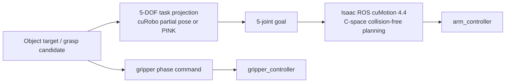
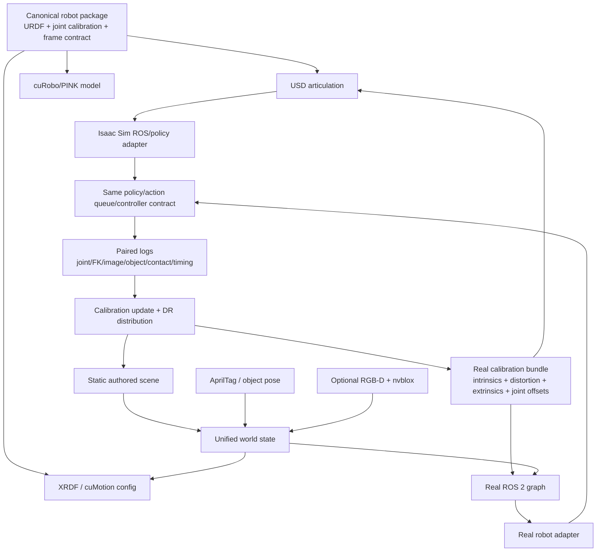

# Isaac Sim 6.0 / Isaac Lab 3.0 마이그레이션 종합 검토

> 조사 기준일: 2026-06-15
>
> 현재 프로젝트: Isaac Sim 5.1.0 + Isaac Lab 2.3.2 + Python 3.11 + PyTorch 2.7 + NumPy 1.26
>
> 검토 대상: Isaac Sim 6.0.x + Isaac Lab 3.0 beta 계열

## 1. Executive Summary

### 최종 판단

**장기적으로 이전해야 하는 방향은 맞지만, 지금 현재 스택을 즉시 교체하는 것은 권장하지 않는다. 기존 5.1/2.3.2 환경을 기준선으로 보존하고, Linux 별도 Python 3.12 환경에서 Isaac Sim 6.0.0.1 + Isaac Lab 3.0 beta2 고정 commit + PhysX 조합을 병행 검증하는 것이 가장 합리적이다.**

근거는 다음과 같다.

1. [Isaac Sim 5.1 문서](https://docs.isaacsim.omniverse.nvidia.com/5.1.0/robot_setup_tutorials/optimizing_asset.html)는 5.1.0이 더 이상 지원되지 않으며 bug fix와 신규 기능이 새 릴리스에만 제공된다고 명시한다.
2. [Isaac Sim 6.0.0](https://github.com/isaac-sim/IsaacSim/releases/tag/v6.0.0)은 2026-06-04 GA로 공개되었고, 공식 패키지 인덱스에는 `6.0.0.1` patch wheel도 존재한다.
3. [Isaac Lab 3.0의 최신 tag](https://github.com/isaac-sim/IsaacLab/releases/tag/v3.0.0-beta)는 아직 `v3.0.0-beta`다. 릴리스 본문도 breaking change, 오류, 성능 회귀 가능성을 경고한다.
4. Isaac Lab 공식 패키지 인덱스의 최신 wheel은 `2.3.2.post1`이며 3.0 wheel은 없다. beta2는 release branch source 설치 대상이다.
5. Isaac Sim 6은 camera/SDG, multi-tick rendering, ROS 2 Jazzy, H.264, cuMotion/PINK 등 이 프로젝트에 유용한 개선이 많다.
6. 반면 NVIDIA 공식 벤치마크에서도 일반 scene FPS와 physics steps는 6.0이 5.1보다 낮은 결과가 있다. 모든 workload가 자동으로 빨라지는 업그레이드는 아니다.
7. 이 저장소에는 `.data.*` 접근 217건, 구형 write API 호출 38건, WXYZ 관련 텍스트 69건, AppLauncher 사용 파일 37개가 있다. 버전 핀 두 줄만 바꾸는 작업이 아니다.
8. SO-101의 5-DOF 문제는 업그레이드만 기다릴 필요가 없다. 현재 체크아웃된 cuRobo `v0.8.0-35`에는 축별 task weight를 주는 `ToolPoseCriteria`가 있고, 로컬 SO-101 probe에서 full-pose IK 실패 케이스가 position-only IK로 `0.6 mm` 이하 위치 오차에 수렴했다.
9. Isaac Sim 6 내장 cuMotion은 공식 `plan_to_translation_target()`을 제공하고 PINK는 orientation cost를 0으로 둘 수 있어, underactuated arm을 명시적으로 다루는 도구가 확실히 좋아졌다.
10. 반면 Isaac ROS cuMotion 4.4의 MoveIt pose-goal 경로는 여전히 position과 orientation을 함께 요구하고, direct action의 `hold_partial_pose`도 현재 구현상 지원하지 않는다. 실기기 ROS 경로에서는 5-joint goal을 먼저 만든 뒤 C-space planning을 수행하는 구조가 여전히 가장 안전하다.
11. digital twin 관점에서 가장 큰 즉시 개선점은 simulator 버전보다 camera calibration이다. 현재 ROS camera 설정 다수는 `camera_info_url`이 비어 있어 real camera intrinsics/distortion이 twin 계약에 아직 들어오지 않았다.

### 한눈에 보는 판단

| 질문 | 답 |
|---|---|
| 5.1/2.3.2에 계속 머물러도 되는가 | 단기 운영은 가능하지만 장기 전략으로는 부적절 |
| Isaac Sim 6 자체는 도입할 가치가 있는가 | 높음 |
| Isaac Lab 3을 지금 기본 스택으로 바꿔도 되는가 | 아직 이르다 |
| 지금 아무것도 하지 않고 Lab 3 GA를 기다려야 하는가 | 비권장. migration debt가 커짐 |
| 지금 해야 할 일 | 별도 환경의 PhysX pilot, API 전환, 동작/성능 A/B |
| Newton으로 바로 바꿔야 하는가 | 아니오. 첫 목표는 PhysX parity |
| SO-101 5-DOF가 새 버전에서 나아지는가 | 예. 다만 cuRobo v0.8에서는 이미 일부 해결 가능하고, Sim 6 내장 도구가 이를 더 명시적으로 지원 |
| Isaac ROS cuMotion 4.4가 pose-goal 문제를 자동 해결하는가 | 아니오. joint-goal/C-space 경로를 유지해야 함 |
| digital twin에서 최우선 보강은 무엇인가 | planner 5-DOF 모델 분리, kinematics 단일화, camera intrinsic/extrinsic/timestamp calibration |

## 2. 조사 범위와 소스 신뢰도

다음 자료를 교차 검토했다.

| 소스 | 용도 | 신뢰도 해석 |
|---|---|---|
| NVIDIA Isaac Sim 6 release notes / known issues / migration guides | 공식 기능, 제거/폐기 API, 알려진 제약 | 가장 높은 우선순위 |
| Isaac Lab 3 migration guide / release body / beta2 branch | 공식 Breaking Changes와 dependency | 가장 높은 우선순위 |
| NVIDIA 공식 benchmark | 버전별 성능 방향 | 동일 workload라도 구현과 측정 조건 차이를 감안 |
| IsaacLab/IsaacSim GitHub issue와 discussion | 실제 설치/회귀/사용성 사례 | 재현 환경과 issue 상태를 함께 판단 |
| NVIDIA Developer Forum | maintainer 답변과 현장 사례 | 공식 문서보다 낮지만 운영 위험 파악에 유용 |
| 이 저장소 정적 검색 | 실제 수정 범위 | runtime 검증 전의 영향도 추정 |

커뮤니티 issue는 존재 자체가 모든 환경의 재현을 뜻하지 않는다. 본 문서에서는 `open`, `closed/fixed`, `RC-only`, `현재 프로젝트 직접 적용`을 구분한다.

## 3. 릴리스와 유지보수 상태

| 구성 요소 | 현재 | 새 대상 | 2026-06-15 상태 | 해석 |
|---|---:|---:|---|---|
| Isaac Sim | 5.1.0 | 6.0.0/6.0.0.1 | 6.0 GA, 5.1 지원 종료 | 이전 필요 |
| Isaac Lab | 2.3.2 | 3.0 | `v3.0.0-beta`, beta2 branch 개발 중 | 병행 검증 |
| Isaac Lab wheel | 2.3.2.post1 | 3.0 | 3.0 wheel 없음 | source/branch pin 필요 |
| Python | 3.11 | 3.12 | Lab 3 beta2 `>=3.12,<3.13` | 새 환경 필요 |
| PyTorch | 2.7+cu128 | 2.10+cu128 | Lab 3 beta2 root dependency | 전체 재해결 |
| NumPy | 1.26.0 | 2.x | beta release는 2.3.1, beta2 pyproject는 `>=2` | branch 변화 주의 |

[Isaac Lab 2.3.2 release notes](https://isaac-sim.github.io/IsaacLab/main/source/refs/release_notes.html)는 2.3.2가 기존 `main` 계열의 마지막 릴리스이며 개발 초점을 `develop`/3.0으로 옮긴다고 설명한다. 이것은 Isaac Sim 5.1의 명시적 지원 종료와 같은 표현은 아니지만, 신규 구조와 기능이 3.0으로 이동했다는 뜻이다.

## 4. 주요 Advantage

### 4.1 지원되는 기반으로 복귀

가장 확실한 장점이다.

- 5.1 고유 bug가 더 이상 수정되지 않는다.
- 새 GPU, driver, Python 3.12, ROS 2 Jazzy 대응은 6.0 계열에서 진행된다.
- 6.0 migration guide와 experimental replacement API를 기준으로 코드를 정리하면 향후 6.1 이후의 제거 위험을 줄일 수 있다.

현재 Linux 서버의 driver `580.95.05`는 [Isaac Sim 6 요구사항](https://docs.isaacsim.omniverse.nvidia.com/6.0.0/installation/requirements.html)에 기재된 Linux 권장 driver와 정확히 일치한다. Windows driver `596.36`도 문서의 Windows 최소 권장 `581.42`보다 높다. RTX A4000 16 GB와 RTX PRO 5000 Blackwell 48 GB 모두 RT Core와 VRAM 조건을 충족한다.

### 4.2 3-camera 데이터 수집과 SDG 성능 잠재력

[Isaac Sim 6 release notes](https://docs.isaacsim.omniverse.nvidia.com/6.0.0/overview/release_notes.html)의 multi-tick rendering은 camera와 RTX sensor를 physics time 기준의 서로 다른 rate/offset으로 scheduling한다.

현재 프로젝트에는 top/wrist/front 3개 camera가 있으며 다음 효과를 기대할 수 있다.

- physics rate와 camera 30 Hz를 더 명시적으로 분리
- sensor timestamp와 capture cadence 정합 개선
- 필요 없는 render tick 감소
- 3-camera LeRobot recording 처리량 개선 가능성
- camera별 tick offset을 이용한 GPU peak 분산 가능성

Isaac Sim 6의 새 camera API는 authoring과 runtime을 분리하고, `TiledCameraSensor`가 명시적 camera path 목록과 annotator 기반 출력을 사용한다. Isaac Lab의 `TiledCameraCfg` 경로를 유지하더라도 하부 구현과 성능 특성은 다시 검증해야 한다.

### 4.3 ROS 2와 원격 운영 개선

Isaac Sim 6은 다음을 제공한다.

- ROS 2 Jazzy와 Python 3.12 지원
- GPU 가속 H.264 compressed RGB
- ROS 2 bridge extension 모듈화
- multi-threaded executor 관련 개선
- Docker Compose 기반 Isaac Sim + WebRTC viewer
- 한 머신의 다중 Isaac Sim instance 지원 개선

PATH E의 `cube_desk` ROS bridge와 원격 3-camera 관찰에는 직접적인 장점이 있다. 특히 raw RGB보다 H.264를 쓰면 네트워크 대역폭을 줄일 수 있다.

### 4.4 cuMotion과 PINK

Isaac Sim 6에는 다음 모션 생성 경로가 추가되었다.

- `isaacsim.robot_motion.experimental.motion_generation`
- `isaacsim.robot_motion.cumotion`
- `isaacsim.robot_motion.pink`

PINK의 task-based differential IK는 position과 orientation task의 가중치를 분리한다. 공식 문서도 `frame_task.set_orientation_cost(0.0)`으로 orientation을 무시하는 예를 제공하므로 SO-101의 `position 우선, orientation best-effort` 규약에 직접 대응한다.

통합 cuMotion의 graph planner는 full pose 외에 공식 translation-only target인 `plan_to_translation_target()`을 제공한다. 또한 `CumotionWorldInterface`와 `WorldBinding`이 USD scene의 collider와 transform을 planner world에 동기화한다. 현재 별도 Warp 1.14 sidecar와 수동 cuboid 전송으로 운영하는 cuRobo 경로를 장기적으로 단순화할 후보가 될 수 있다.

다만 position-only만으로는 grasp jaw 방향이 임의로 돌아갈 수 있다. transit/hover는 translation-only로 풀고, grasp는 위치 3축과 필요한 orientation 1-2축 또는 posture seed를 함께 주는 underactuated task로 설계해야 한다. 현재 성공한 sidecar를 즉시 제거할 근거도 없으며, 동일 grasp target과 collision scene에서 별도 비교해야 한다.

### 4.5 Isaac Lab 3의 장기 아키텍처

[Isaac Lab 3 beta release](https://github.com/isaac-sim/IsaacLab/releases/tag/v3.0.0-beta)는 다음 구조를 도입한다.

- factory 기반 multi-backend physics
- `isaaclab_physx`와 `isaaclab_newton`
- pluggable renderer: Isaac RTX, OVRTX, Newton Warp
- pluggable visualizer: Kit, Newton, Rerun, Viser
- kit-less Newton 실행
- Warp/ProxyArray 기반 data path
- backend preset
- lazy import와 resolvable string
- 통합 RL CLI

장기적으로 physics, renderer, visualizer 결합을 줄이고 headless 학습과 debugging 경로를 선택할 수 있다는 점은 큰 구조적 장점이다.

### 4.6 Warp-native hot path의 성능 잠재력

Lab 3은 asset/sensor state를 `ProxyArray`로 노출하고 Warp kernel을 통한 fused processing을 지향한다. Python loop, per-step allocation, Torch/Warp 왕복을 줄이면 다음 경로에서 효과가 날 수 있다.

- 2048-env observation/reward 계산
- 대량 reset/randomization
- ray casting
- batched transform
- CUDA graph capture가 가능한 고정 shape workflow

단, 기존 코드를 `.torch`로 감싸기만 하면 호환성은 얻어도 Warp-native 성능 이득은 제한적이다.

## 5. 주요 Disadvantage와 위험

### 5.1 Isaac Lab 3은 아직 beta

beta release 본문은 다음을 직접 경고한다.

- active development 중 추가 breaking change 가능
- 일부 use case의 error
- performance regression 가능
- 당시 Ubuntu 우선 지원
- Newton 기능 격차

현재 `release/3.0.0-beta2` branch는 보호 branch지만 tag/GA가 아니다. 임의의 `develop` head보다 낫지만, commit SHA를 고정하지 않으면 같은 날짜에도 API와 extension dependency 조합이 달라질 수 있다.

### 5.2 성능이 전반적으로 빨라지는 것은 아님

아래 표는 [Isaac Sim 5.1 benchmark](https://docs.isaacsim.omniverse.nvidia.com/5.1.0/reference_material/benchmarks.html)와 [Isaac Sim 6.0 benchmark](https://docs.isaacsim.omniverse.nvidia.com/6.0.0/reference_material/benchmarks.html)의 RTX 5080 결과다. 두 문서는 Intel i9-14900K, DDR5 32 GB 기준이며 600 frame 평균을 제시한다.

| KPI | 5.1 Windows | 6.0 Windows | 변화 | 5.1 Ubuntu | 6.0 Ubuntu | 변화 |
|---|---:|---:|---:|---:|---:|---:|
| Full Warehouse FPS | 259.07 | 155.52 | -40.0% | 241.55 | 161.55 | -33.1% |
| Physics steps/s | 42.11 | 32.95 | -21.8% | 44.76 | 31.43 | -29.8% |
| ROS render/publish | 16.25 | 13.54 | -16.7% | 17.24 | 18.34 | +6.4% |
| SDG simple | 6.29 | 24.54 | +290.1% | 8.52 | 40.83 | +379.2% |
| SDG complex | 4.93 | 8.86 | +79.7% | 6.76 | 13.77 | +103.7% |

주의할 점:

- 버전 사이에 scene, renderer, extension 구성과 benchmark implementation이 바뀌었을 수 있다.
- 따라서 strict scientific A/B는 아니다.
- 그래도 “camera/SDG는 큰 개선 가능성, physics/general scene은 회귀 가능성”이라는 방향은 명확하다.
- Lab 3 release 자체도 일부 성능 회귀 가능성을 명시한다.

이 프로젝트에 대입하면 다음과 같다.

| 프로젝트 workload | 예상 |
|---|---|
| top/wrist/front 3-camera recording | 개선 가능성 높음 |
| camera 포함 VLA rollout | 개선 가능성 높음 |
| 2048-env physics-only step | 개선 보장 없음 |
| 접촉 민감 4-cube grasp | 결과와 속도 모두 회귀 가능 |
| 매 step `.cpu().numpy()` 사용 | 새 data path 이득을 상쇄 |
| Warp kernel로 유지되는 observation/reward | 재작성 후 개선 가능 |

### 5.3 semantic migration 위험

가장 위험한 변경은 quaternion `WXYZ -> XYZW`다.

- syntax error가 아니라 자세가 틀리는 silent failure가 될 수 있다.
- identity quaternion도 `(1,0,0,0) -> (0,0,0,1)`로 바뀐다.
- camera extrinsic, end-effector target, object spawn, IK/FK, ROS pose가 모두 영향을 받는다.
- USD 자체의 `Gf.Quat*` 표현과 Isaac Lab API 경계를 혼동하면 double conversion이 생길 수 있다.

이 프로젝트의 grasp 성공률은 mm 단위 EE 위치와 gripper orientation에 민감하므로 최우선 검증 항목이다.

### 5.4 dependency와 ABI를 다시 풀어야 함

현재 global override는 Sim 5.1 ABI를 위해 다음을 강제한다.

- `numpy==1.26.0`
- `pyarrow>=17,<19`
- `datasets>=4.0,<4.7`
- `torchcodec>=0.5,<0.6`
- PyTorch 2.7 + CUDA 12.8

Lab 3 beta2는 Python 3.12, PyTorch 2.10, NumPy 2.x를 요구한다. 기존 `isaac` group만 수정하면 global override와 충돌한다.

[LeRobot 0.4.4 PyPI metadata](https://pypi.org/project/lerobot/0.4.4/)는 PyTorch `<2.11`, torchvision `<0.26`, datasets 4.x를 허용하므로 표면상 Lab 3과 공존 가능하다. 그러나 video decode, HDF5, PyArrow, TorchCodec을 포함한 실제 dataset workflow는 별도 검증이 필요하다.

[LeRobot 0.5.1](https://pypi.org/project/lerobot/0.5.1/)은 NumPy `>=2,<2.3`을 요구한다. Lab 3 beta release 본문의 NumPy 2.3.1과는 상한 충돌이 있으므로 policy-server Docker 격리를 유지해야 한다. beta2 branch가 `numpy>=2`로 완화되어 있어도 lock 결과를 그대로 신뢰하지 말고 명시 pin을 정해야 한다.

### 5.5 기존 물리 tuning의 parity를 잃을 수 있음

현재 cube mass, friction, contact offset, depenetration velocity, solver iteration은 PhysX 5.1 결과에 맞춰 조정되어 있다.

다음은 버전 전환 후 재검증해야 한다.

- grasp closure와 fixed/moving jaw contact
- cube slip과 lift
- bowl collision과 release
- reset 직후 penetration
- contact sensor/report API
- articulation drive response
- fixed spawn 4/4와 DR 16/16

같은 USD와 같은 숫자가 같은 trajectory를 보장하지 않는다.

### 5.6 Newton은 아직 production 대체재가 아님

Newton은 장점이 있지만 초기 migration의 목표가 되어서는 안 된다.

- beta release에서 active development로 명시
- PhysX-only 기능이 남아 있음
- solver/contact/friction semantics가 달라짐
- USD/Kit visual sync 관련 회귀가 이미 보고된 바 있음
- 기존 PhysX tuning의 sim-to-real 근거를 다시 만들어야 함

첫 migration target은 **Sim 6 + Lab 3 + PhysX**다. Newton은 parity 이후 별도 실험으로 분리한다.

## 6. 공식 Breaking Changes 전체 정리

### 6.1 Isaac Lab 3

아래 표는 [공식 Isaac Lab 3 migration guide](https://isaac-sim.github.io/IsaacLab/develop/source/migration/migrating_to_isaaclab_3-0.html)를 기준으로 정리했다.

| 범주 | 2.x | 3.0 | 프로젝트 영향 |
|---|---|---|---|
| Visualizer CLI | `--headless` | `--viz`/`--visualizer`, `--headless` deprecated | AppLauncher 파일 37개 audit |
| RL CLI | library별 train/play script | 통합 `isaaclab.sh train/play --rl_library` | 향후 RL script 정리 시 영향 |
| Physics architecture | PhysX 결합 | backend factory, PhysX/Newton 분리 | config 구조 변화 |
| Backend package | `isaaclab` 중심 | `isaaclab_physx`, `isaaclab_newton` | PhysX 전용 type/import |
| Surface gripper | `isaaclab.assets` | `isaaclab_physx.assets` | 현재 직접 사용은 낮음 |
| Schema cfg | `RigidBodyPropertiesCfg` 등 | common base + `Physx*Cfg` | env cfg 전반 |
| Drive field | `max_velocity`, `max_effort` | `max_joint_velocity`, `max_force` | actuator/spawn cfg 점검 |
| View class | `XformPrimView` | `FrameView` | 직접 사용 시 수정 |
| Deformable | 구 soft body API | volume/surface deformable 분리 | 현재 낮음 |
| IMU | 기존 `Imu`가 pose/vel/acc 제공 | 기존 역할은 `PVA`, 새 IMU는 gyro/accel만 | 센서 추가 시 주의 |
| Sensor pose | `pose_w`, `pos_w`, `quat_w` | deprecated, `FrameTransformer` 권장 | camera/frame 도구 점검 |
| Joint wrench | `ArticulationData.body_incoming_joint_wrench_b` | `JointWrenchSensor` | 현재 직접 사용 낮음 |
| Multi-backend cfg | 단일 `PhysxCfg` | `PresetCfg` + Hydra preset | PhysX only pilot이면 후순위 |
| RigidObjectCollection | `object_*` | `body_*` | collection 사용부 audit |
| Quaternion | WXYZ | XYZW | 매우 높음 |
| `convert_quat` | 지원 | 제거 | 호출 제거 |
| Math utilities | WXYZ 입출력 | XYZW 입출력 | MDP/SM 수정 |
| Asset/sensor data | `torch.Tensor` | `ProxyArray` | 217건 |
| Torch access | 직접 Tensor | `.torch` | explicit migration 필요 |
| Warp access | 별도 변환 | `.warp`, CUDA array interface | hot path 후보 |
| RayCaster | Torch/USD path | native Warp path | 현재 낮음 |
| Ray alignment | `attach_yaw_only` | `ray_alignment` | ray sensor 추가 시 |
| Write API | `write_*_to_sim(data, env_ids)` | `_index`/`_mask` | 38건 |
| Custom buffer | `TimestampedBuffer` | `TimestampedBufferWarp` | custom sensor 구현 시 |
| URDF importer | 2.x C++ command path | Python `urdf-usd-converter` 3.0 | robot asset 재생성 시 높음 |
| MJCF importer | 구 importer | Python converter, nested bodies | 현재 낮음 |
| XR teleop | `OpenXRDevice` | Isaac Teleop extension | 현재 keyboard/leader 중심 |
| Isaac direct imports | `isaacsim.core.*` 등 | experimental/Isaac Lab API | 직접 import 파일 4개 |
| PhysX tensor path | `omni.physics.tensors.impl.api` | `omni.physics.tensors.api` | custom code audit |

#### Schema cfg의 compatibility 함정

구 이름은 일부 alias로 남아 warning만 발생하지만 다음 문제가 있다.

- alias는 4.0에서 제거 예정
- old/new field를 동시에 넣으면 새 field가 이기고 old 값이 조용히 버려질 수 있음
- backend portability를 원하면 common base cfg만 사용해야 함
- PhysX 특화 tuning을 유지하려면 `Physx*PropertiesCfg`를 명시해야 함

현재 cube grasp는 PhysX 전용 parameter가 중요하므로 migration 초기에는 억지로 backend-neutral cfg로 일반화하지 않는 편이 안전하다.

#### Quaternion

공식 변경:

- 모든 Isaac Lab quaternion은 XYZW
- hard-coded value 수정 필요
- `convert_quat` 제거
- `quat_mul`, `quat_apply`, `matrix_from_quat`, `quat_from_matrix` 등 math utility 전부 XYZW
- source finder와 runtime access detector 제공

권장 규칙:

1. 프로젝트 내부 canonical quaternion을 XYZW로 통일한다.
2. USD `Gf.Quat*`, ROS message, cuRobo 등 외부 경계에서만 명시 변환한다.
3. 함수명이나 type alias에 convention을 기록한다.
4. identity/non-identity round-trip test를 둔다.
5. 자동 fixer 결과는 수동 검토한다.

#### ProxyArray

공식 beta2 migration guide의 현재 형태:

```python
# 2.x
joint_pos = robot.data.joint_pos

# 3.0
joint_pos = robot.data.joint_pos.torch
joint_pos_warp = robot.data.joint_pos.warp
```

임시 `__torch_function__` bridge와 `wp.to_torch(proxy_array)` compatibility shim이 있지만 future removal 대상이다. production migration은 `.torch` 또는 `.warp`를 명시해야 한다.

주의:

- `.clone()`, slicing, NumPy 변환, Torch 외 라이브러리 전달에는 `.torch` 필요
- `ProxyArray.torch`는 zero-copy cached tensor이지만 이후 `.cpu().numpy()`는 여전히 GPU->CPU copy
- Warp kernel에는 직접 전달 가능한 경우가 있음
- quaternion `ProxyArray.torch` access detector로 WXYZ 가정을 찾을 수 있음

#### Write API

구 method는 제거되었다.

```python
# 2.x
robot.write_root_pose_to_sim(pose, env_ids)

# 3.0 sparse
robot.write_root_pose_to_sim_index(root_pose=pose, env_ids=env_ids)

# 3.0 full + mask
robot.write_root_pose_to_sim_mask(root_pose=all_pose, env_mask=mask)
```

reset과 DR은 sparse env 선택이 많으므로 `_index`가 자연스럽다. full batch를 계속 유지하는 2048-env kernel은 `_mask`가 유리할 수 있다.

#### URDF importer

주요 변경:

- `urdf-usd-converter` 기반 Python pipeline
- importer extension version pin 제거
- `convert_mimic_joints_to_normal_joints`, `replace_cylinders_with_capsules`, `root_link_name` deprecated
- natural frequency gain mode deprecated
- `make_instanceable` 무시, 기본 instanceable
- output path/name 결정 방식 변경
- `merge_fixed_joints`는 XML pre-processing으로 유지

SO-101 runtime은 현재 USD를 사용하므로 즉시 block되지는 않는다. 하지만 URDF에서 USD/XRDF/cuRobo asset을 다시 만들 때 body hierarchy, drive, collision, frame name을 다시 검증해야 한다.

#### MJCF importer

주요 변경:

- `mujoco-usd-converter` 기반 Python importer
- nested rigid body hierarchy
- `fix_base`, `link_density`, `import_inertia_tensor`, `import_sites` 제거
- mesh merge와 collision generation option 추가

현재 프로젝트의 직접 영향은 낮지만 향후 외부 robot/scene 도입 시 기존 converter script를 그대로 쓸 수 없다.

### 6.2 Isaac Sim 6

[Isaac Sim 6 release notes](https://docs.isaacsim.omniverse.nvidia.com/6.0.0/overview/release_notes.html)의 주요 breaking/deprecation:

| Deprecated/Removed | 대체 |
|---|---|
| `omni.isaac.*` compatibility shim | `isaacsim.*`로 완전 이전 |
| `isaacsim.core.api`, `.prims`, `.utils` | `isaacsim.core.experimental.*`, 가능하면 Isaac Lab utility |
| prim path를 직접 받는 일부 ROS 2 publish node | dedicated source node 연결 |
| 기존 Lula/motion generation extension | experimental motion generation, cuMotion, PINK |
| `isaacsim.sensors.camera` | `isaacsim.sensors.experimental.rtx` |
| `isaacsim.sensors.rtx` authoring/runtime | `isaacsim.sensors.experimental.rtx` |
| `isaacsim.sensors.physics/physx` | `isaacsim.sensors.experimental.physics` |
| Camera prim + JSON RTX sensor config | OmniSensor prim/API |
| 일부 asset browser/selector/example extension | 제거 또는 SimReady browser 등으로 이동 |

#### Camera migration

[Camera migration guide](https://docs.isaacsim.omniverse.nvidia.com/6.0.0/migration_guides/isaac_sim_6_0/sensors_camera_to_experimental_rtx.html)의 핵심:

- authoring `RtxCamera`
- runtime `CameraSensor`, `TiledCameraSensor`, `SingleViewDepthCameraSensor`
- `frequency`/`dt`는 `tick_rate`로 이동
- command 기반 creation 제거
- frame dictionary 대신 annotator별 `get_data`
- `CameraView` regex 대신 explicit path list

Isaac Lab sensor wrapper가 이 차이를 흡수하는 범위와 프로젝트가 direct API를 쓰는 범위를 분리해서 봐야 한다.

#### ROS 2 OmniGraph migration

[ROS 2 OmniGraph migration guide](https://docs.isaacsim.omniverse.nvidia.com/6.0.0/migration_guides/isaac_sim_6_0/ros2_omnigraph_migration.html)는 두 publisher의 direct prim input이 deprecated라고 명시한다.

- TF publish: `Isaac Compute Transform Tree` source node 사용
- Joint state publish: `Isaac Read Joint State` source node 사용

현재 ROS graph builder는 기존 node input을 직접 설정하므로 graph topology를 다시 작성해야 한다.

#### Motion generation

현재 `follow_target_so101.py`가 쓰는 다음 extension은 deprecated다.

- `isaacsim.robot_motion.lula`
- `isaacsim.robot_motion.lula_test_widget`
- `isaacsim.robot_motion.motion_generation`

기존 기능이 6.0에서 즉시 제거된 것은 아니지만 새 구현을 이 경로 위에 더 쌓지 않는 편이 좋다.

## 7. 현재 저장소에서 수정해야 할 부분

정적 검색 기준 수치는 조사 시점의 dirty worktree를 포함한다.

### 7.1 P0: 의존성 환경 분리

대상:

- `pyproject.toml`
- `uv.lock`

필요 작업:

1. 현재 5.1 lock을 보존한다.
2. Python 3.12 전용 별도 project/lock을 만든다.
3. Sim은 `6.0.0.1`을 pin한다.
4. Lab은 beta2 branch commit SHA를 pin한다.
5. PyTorch 2.10+cu128, NumPy 2.x, PyArrow, datasets, TorchCodec을 함께 resolve한다.
6. LeRobot dataset conversion smoke를 별도 실행한다.

현재 하나의 `[tool.uv].override-dependencies`가 모든 group에 적용되므로 같은 lock 안에 5.1과 6.0을 병존시키는 방식은 비권장이다.

### 7.2 P0: quaternion 전환

우선 검토 파일:

- `src/sim_to_real/tasks/pick_cube/pick_cube_env_cfg.py`
- `src/sim_to_real/tasks/pick_pen/pick_pen_env_cfg.py`
- `src/sim_to_real/tasks/pick_cube/pick_cube_env.py`
- `src/sim_to_real/tasks/common/mdp/_geometry.py`
- `src/sim_to_real/tasks/common/mdp/observations.py`
- `src/sim_to_real/tasks/common/mdp/rewards.py`
- `src/sim_to_real/utils/domain_randomization.py`
- `scripts/environments/pick_cube_state_machine.py`
- `scripts/environments/teleoperation/teleop_se3_agent.py`
- `scripts/environments/follow_target_so101.py`
- `scripts/sim/run_cube_desk_ros_bridge.py`
- `scripts/sim/pick_cube_curobo_batch.py`
- `scripts/planning/curobo_planner_server.py`

구체적 수정:

- `rot=(w,x,y,z)` 상수 재배열
- quaternion math utility input/output 수정
- ROS `geometry_msgs/Quaternion`과 내부 XYZW 경계 확인
- cuRobo pose convention 확인
- USD author script의 `Gf.Quat*`는 USD convention을 유지하고 adapter에서 변환
- camera tuner 출력의 `# wxyz` 표기와 cfg 복사 workflow 변경
- 저장된 demo/state snapshot quaternion versioning

### 7.3 P0: `ProxyArray`

정적 검색에서 `.data.*` 접근은 217건이다. 집중 파일:

| 파일 | 접근 수 |
|---|---:|
| `src/sim_to_real/tasks/common/mdp/observations.py` | 25 |
| `src/sim_to_real/tasks/common/mdp/rewards.py` | 20 |
| `src/sim_to_real/tasks/pick_cube/pick_cube_env.py` | 19 |
| `scripts/sim/pick_cube_curobo_batch.py` | 12 |
| `scripts/environments/teleoperation/teleop_se3_agent.py` | 11 |
| `scripts/environments/scene_physics_smoke.py` | 11 |
| `scripts/environments/pick_cube_state_machine.py` | 11 |
| `src/sim_to_real/tasks/pick_cube/mdp/observations.py` | 10 |

전략:

- 먼저 `.torch`를 명시해 behavioral parity를 얻는다.
- observation/reward/reset hot path는 이후 `.warp` 또는 fused kernel 후보로 분리한다.
- state machine/camera UI처럼 CPU가 필요한 경로는 copy 위치와 빈도를 명시한다.
- `.detach().cpu().numpy()`를 매 step 호출하는 경로를 별도 profiling한다.

### 7.4 P0: write API

38개 구형 호출이 검색된다.

핵심 대상:

- `src/sim_to_real/utils/domain_randomization.py`
- `src/sim_to_real/utils/gripper_effort.py`
- `src/sim_to_real/tasks/pick_cube/pick_cube_env.py`
- `scripts/environments/pick_cube_state_machine.py`
- `scripts/environments/reward_smoke.py`
- `scripts/reinforcement_learning/grasp_feasibility.py`
- `scripts/sim/pick_cube_curobo_batch.py`

reset/DR의 selected env는 `_index`, full batch state overwrite는 `_mask` 또는 all-index로 구분한다. positional argument 사용은 keyword argument로 바꿔 shape 의미를 분명히 하는 편이 안전하다.

### 7.5 P1: direct Isaac Sim API

직접 import 파일 4개:

- `scripts/environments/follow_target_so101.py`
- `scripts/environments/teleoperation/teleop_se3_agent.py`
- `scripts/ros2/cube_desk_ros2_sim.py`
- `scripts/sim/run_cube_desk_ros_bridge.py`

수정 방향:

- stage/prim/query는 `isaaclab.sim.utils.*` 우선
- extension enable은 `isaacsim.core.experimental.utils.app.enable_extension`
- viewport camera는 `ViewportManager` 또는 Kit camera state
- `World`, `SingleArticulation`, `SingleRigidPrim`은 experimental Core API 또는 Lab abstraction으로 재작성

### 7.6 P1: ROS bridge graph

대상:

- `scripts/ros2/cube_desk_ros2_sim.py`
- `scripts/sim/run_cube_desk_ros_bridge.py`

필요 작업:

- TF publish 앞에 compute transform tree source node
- JointState publish 앞에 read joint state source node
- deprecated direct prim input 제거
- bridge extension 모듈 이름 검증
- Jazzy system ROS 사용 시 `use_internal_libs` 기본값 변화 확인
- H.264 compressed RGB 도입 여부 결정

[Isaac Sim 6 known issues](https://docs.isaacsim.omniverse.nvidia.com/6.0.0/overview/known_issues.html)는 `World`/`SimulationContext`와 OmniGraph를 함께 사용할 때 graph를 먼저 만들라고 명시한다. 현재 bridge 초기화 순서는 이 제약에 맞게 재구성해야 한다.

### 7.7 P1: camera

대상:

- `src/sim_to_real/tasks/pick_cube/pick_cube_env_cfg.py`
- `src/sim_to_real/tasks/pick_pen/pick_pen_env_cfg.py`
- `scripts/environments/teleoperation/teleop_se3_agent.py`
- `scripts/environments/camera_shape_smoke.py`
- `scripts/perf/tiled_camera_throughput_bench.py`
- `scripts/sim/run_cube_desk_ros_bridge.py`

검증 항목:

- output shape/dtype/channel order
- `rgb`가 RGB인지 RGBA인지
- resolution 인자 순서 `(W,H)`와 tensor `(H,W,C)`
- 3-camera tick rate
- first valid frame까지 warmup
- multi-env lighting consistency
- GPU memory와 dropped frame
- intrinsic/extrinsic parity
- ROS/LeRobot timestamp 정합

### 7.8 P1: Lula/RMPFlow

대상:

- `scripts/environments/follow_target_so101.py`
- `docs/LULA_GUI_TUNING.md`

선택지:

1. deprecated path를 임시 유지해 parity만 확보
2. experimental motion generation으로 이전
3. PINK position-priority task로 교체 실험
4. 통합 cuMotion과 현재 cuRobo sidecar 비교

첫 migration에서 controller까지 동시에 바꾸면 원인 분리가 어려워진다. 초기에는 기존 behavior를 유지하고 별도 branch에서 PINK/cuMotion을 평가한다.

### 7.9 P1: cuRobo sidecar와 Warp

현재 sidecar는 Isaac Sim 5.1 bundled Warp 1.8.2와 cuRobo Warp 1.14 충돌을 피하기 위한 구조다.

Lab 3은 Warp API와 `ProxyArray` data path를 크게 바꾸므로 현재 충돌 조건이 달라질 가능성이 있지만, cuRobo와 동일 Warp runtime을 쓴다고 가정하면 안 된다.

검증:

- in-process cuRobo import 가능 여부
- `wp.context` legacy namespace 문제
- CUDA graph와 memory ownership
- ZeroMQ sidecar 유지 시 serialization overhead
- integrated cuMotion의 collision/IK 기능 parity

검증 없이 sidecar를 제거하지 않는다.

### 7.10 P2: test와 benchmark

기존 자산:

- `scripts/perf/isaac_env_step_throughput.py`
- `scripts/perf/tiled_camera_throughput_bench.py`
- `scripts/environments/scene_physics_smoke.py`
- `scripts/environments/camera_shape_smoke.py`
- `scripts/environments/reward_smoke.py`
- `scripts/environments/drive_response_smoke.py`

추가할 것:

- quaternion convention unit test
- same-seed spawn pose dump 비교
- body/joint name과 order snapshot
- fixed spawn 4/4와 DR seed 0 16/16
- 1/256/2048 env throughput
- camera off/1/3개 matrix
- LeRobot end-to-end recording FPS
- ROS topic/schema/frame/timestamp 비교

## 8. 커뮤니티에서 보고된 이슈와 토론

### 8.1 직접 관련성이 높은 이슈

| 이슈 | 상태 | 내용 | 프로젝트 판단 |
|---|---|---|---|
| [IsaacLab #6021](https://github.com/isaac-sim/IsaacLab/issues/6021) | open, 댓글상 해결 | beta2와 Sim build 불일치로 `primdata` extension resolve 실패. `6.0.0.1` 재설치 후 해결 보고 | exact version pin 필수 |
| [IsaacLab #5435](https://github.com/isaac-sim/IsaacLab/issues/5435) | closed | Lab develop가 공개 Sim wheel에 없는 extension을 요구 | `develop` head 금지 근거 |
| [IsaacLab #5057](https://github.com/isaac-sim/IsaacLab/issues/5057) | closed | `ProxyArray`/Warp 전환 중 upstream 내부 wrapper 누락 61건 | beta API가 빠르게 바뀐 증거 |
| [IsaacLab #5186](https://github.com/isaac-sim/IsaacLab/issues/5186) | closed discussion | quaternion 변경 부담에 대한 토론. maintainer는 PhysX/Newton/Warp 정합과 CUDA graph를 이유로 설명 | 변경은 의도적이며 되돌아갈 가능성 낮음 |
| [IsaacLab #5302](https://github.com/isaac-sim/IsaacLab/issues/5302) | open | legacy `_setup_scene` cloning에서 PhysX articulation actuation이 작동하지 않음 | Direct env/custom scene path 검증 필요 |
| [IsaacLab #5918](https://github.com/isaac-sim/IsaacLab/issues/5918) | open | URDF nested child link에 gravity/contact property가 적용되지 않음 | runtime USD는 우회, URDF 재생성은 차단 위험 |
| [IsaacLab #5364](https://github.com/isaac-sim/IsaacLab/issues/5364) | open | Lab play path WebRTC video track 없음. `visualizer=["kit"]` workaround 보고 | livestream regression test 필요 |
| [IsaacLab #5590](https://github.com/isaac-sim/IsaacLab/issues/5590) | closed/fixed | beta의 `add_usd_reference()` 상대 texture path 회귀 | relative USD asset smoke 필요 |

### 8.2 camera와 rendering 관련

| 이슈 | 상태 | 해석 |
|---|---|---|
| [IsaacLab #4837](https://github.com/isaac-sim/IsaacLab/issues/4837) | open, Sim 5.1 | multi-env TiledCamera에서 env_1+ lighting 불일치. 5.1 잔류 위험의 사례 |
| [IsaacLab #4951](https://github.com/isaac-sim/IsaacLab/issues/4951) | open, Sim 5.1 | Blackwell TiledCamera hang 보고. driver/build 조합 민감성 |
| [IsaacLab #5144](https://github.com/isaac-sim/IsaacLab/issues/5144) | open | GUI와 standalone의 FPS 차이. 구성 동일성 없는 숫자 비교의 위험 |
| [IsaacSim #620](https://github.com/isaac-sim/IsaacSim/issues/620) | open, regression | 6.0 WebRTC에서 clipboard `Copy Prim Path` 실패. 운영상 낮은 우선순위 |

### 8.3 installer/importer 관련

| 이슈 | 상태 | 해석 |
|---|---|---|
| [IsaacLab discussion #5373](https://github.com/isaac-sim/IsaacLab/discussions/5373) | discussion | branch/Python/Sim 버전 혼합으로 설치 혼선. 2.3은 Python 3.11, 3.0은 3.12 분리가 핵심 |
| [IsaacLab #4781](https://github.com/isaac-sim/IsaacLab/issues/4781) | open | MJCF converter API mismatch | 현재 직접 영향 낮음 |
| [IsaacSim #668](https://github.com/isaac-sim/IsaacSim/issues/668) | open, RC 보고 | RC.22 USD->URDF export의 empty robot name. GA maintainer는 미재현 | RC 결과를 GA와 혼동하지 말 것 |

### 8.4 Newton 관련 토론

[NVIDIA forum의 Newton integration 토론](https://forums.developer.nvidia.com/t/about-whether-the-new-physics-engine-newton-is-usable-on-isaac-sim/361597)에서 NVIDIA 담당자는 Newton 통합이 단계적으로 제공되며 초기에는 experimentation 대상이라고 설명했다.

또한 beta 기간에는 Newton simulation state는 움직이지만 Kit visual이 갱신되지 않는 [IsaacLab #5500](https://github.com/isaac-sim/IsaacLab/issues/5500)이 있었고 이후 새 Sim version에서 수정되었다. 이는 beta 조합에서 physics, renderer, visualizer를 각각 검증해야 함을 보여준다.

### 8.5 커뮤니티 자료에서 얻는 운영 원칙

1. `develop` 최신을 따라가지 말고 검증한 SHA를 pin한다.
2. Sim wheel patch version과 Lab branch 날짜를 함께 기록한다.
3. RC/EA issue를 GA issue로 일반화하지 않는다.
4. closed issue의 workaround를 영구 patch로 바로 복사하지 않는다.
5. camera, WebRTC, relative asset, Direct env는 설치 smoke와 별도 runtime smoke가 필요하다.
6. driver는 “더 최신이면 무조건 좋다”가 아니다. 공식 validated production branch를 우선한다.

## 9. SO-101 5-DOF와 로봇 제어 생태계

### 9.1 결론부터: 무엇이 실제로 나아지는가

“새 stack으로 가면 5축 문제가 해결되는가?”에 대한 답은 도구별로 다르다.

| 경로 | 5-DOF 대응 | 현재 프로젝트 적합성 | 판단 |
|---|---|---|---|
| 현재 cuRobo `v0.8.0-35` | 축별 pose weight, position-only 가능 | 이미 설치/검증됨 | **지금 바로 활용** |
| Isaac Sim 6 내장 cuMotion graph planner | 공식 translation-only target | sim planner 단순화 가능 | **pilot 가치 높음** |
| Isaac Sim 6 PINK | position/orientation/posture task weight 분리 | position-priority IK, teleop에 적합 | **pilot 가치 높음** |
| Isaac Sim 6 cuMotion trajectory optimizer | C-space, task-space, goalset, collision world | global planner 후보 | **sidecar와 A/B** |
| Isaac ROS cuMotion 4.4 MoveIt pose goal | position+orientation 모두 요구 | 기존 5-DOF pose-goal 벽 유지 | **자동 해결 아님** |
| Isaac ROS cuMotion 4.4 joint goal | C-space target 공식 지원 | 현재 PATH E workaround와 정합 | **유지/강화** |
| nvblox + robot segmenter | depth 기반 ESDF obstacle world | 현재 RGB UVC만으로 사용 불가 | **depth sensor 이후** |
| FoundationPose | unseen object 6D pose/tracking | mesh+RGB-D+detector 필요 | **조건부** |
| AprilTag | camera/world/robot frame 기준점 | 현재 UVC RGB로 가능 | **즉시 가치 높음** |

핵심은 다음과 같다.

1. **5-DOF 문제는 cuRobo 0.8에서 이미 부분적으로 해결 가능하다.**
2. **Isaac Sim 6은 translation-only와 weighted IK를 공식 first-class API로 제공한다.**
3. **Isaac ROS MoveIt plugin은 아직 full-pose semantics가 남아 있어 joint-goal 구조가 필요하다.**
4. **제어와 인식의 toolchain은 좋아지지만, robot model을 5 active arm joints + separate gripper로 정확히 정의하지 않으면 같은 문제가 반복된다.**

### 9.2 현재 cuRobo 0.8에서 이미 가능한 partial-pose

현재 저장소의 `ref_repos/curobo`는 공식 `NVlabs/curobo`의 다음 상태다.

| 항목 | 값 |
|---|---|
| base release | `v0.8.0` |
| local describe | `v0.8.0-35-gec2bfa9` |
| commit | `ec2bfa9f9ea2673abe00cf911ef39353ddb79c29` |
| package | `0.8.0.post1.dev35` |
| release 성격 | cuRoboV2 연구 반영, Apache 2.0, 대부분의 구 API를 깨는 major refactor |

이 버전의 [`ToolPoseCriteria`](https://github.com/NVlabs/curobo/blob/ec2bfa9f9ea2673abe00cf911ef39353ddb79c29/curobo/_src/cost/tool_pose_criteria.py)는 `[x, y, z, roll, pitch, yaw]`별 terminal/non-terminal weight를 제공한다.

주요 API:

- `ToolPoseCriteria.track_position()`
- `ToolPoseCriteria.track_orientation()`
- `ToolPoseCriteria.track_position_and_orientation()`
- `MotionPlanner.update_tool_pose_criteria()`
- `InverseKinematics.update_tool_pose_criteria()`

따라서 과거 cuRobo API를 기준으로 작성된 “orientation cost를 끌 수 없고 full 6-DOF pose만 가능하다”는 프로젝트 문구는 현재 checkout에 대해서는 더 이상 정확하지 않다.

#### SO-101 로컬 GPU probe

다음 조건으로 현재 `assets/robots/so101_curobo.yml`을 직접 검증했다.

1. SO-101의 한 reachable joint configuration을 cuRobo FK로 계산한다.
2. 그 위치는 유지하되 실제 FK와 무관한 identity quaternion을 goal로 붙인다.
3. 동일 goal에 대해 full-pose와 position-only IK를 비교한다.

| 모드 | 결과 | 위치 오차 |
|---|---|---:|
| full pose | 실패 | best seed도 100 mm 이상 |
| `ToolPoseCriteria.track_position()` | 성공 | 반복 probe에서 약 `0.42-0.58 mm` |

즉, 기존 D9 구조의 “해석적 IK로 feasible orientation을 만든 다음 cuRobo IK에 넣어야만 한다”는 제약은 **최소한 position-only target에는 제거 가능**하다.

이 probe는 scene obstacle과 self-collision을 끈 free-space kinematics 검사다. production collision-aware IK, batch shape, CUDA graph 재사용까지 검증한 결과는 아니므로 기존 D9 path를 바로 삭제할 근거로 사용해서는 안 된다.

최소 적용 형태:

```python
from curobo.types import ToolPoseCriteria

ik = InverseKinematics(
    InverseKinematicsCfg.create(
        robot=YML,
        num_seeds=64,
        position_tolerance=0.001,
        seed_orientation_weight=0.0,
    )
)
ik.update_tool_pose_criteria(
    {tool: ToolPoseCriteria.track_position()}
)
```

다만 이것을 모든 grasp에 그대로 적용하면 안 된다.

- position-only 해는 wrist roll과 다른 null-space joint를 임의로 선택할 수 있다.
- 로컬 probe에서도 위치는 맞았지만 wrist roll이 reference와 크게 달라졌다.
- side grasp는 jaw closing direction, tool pitch, table clearance가 중요하다.
- 따라서 **transit/hover/reach는 position-only**, **grasp/slide/lift는 위치 3축 + 필요한 orientation 축 또는 posture seed**가 적합하다.

예를 들어 다음과 같이 orientation 한 축만 자유롭게 두는 실험이 가능하다.

```python
criteria = ToolPoseCriteria.track_position_and_orientation(
    xyz=[1.0, 1.0, 1.0],
    rpy=[0.1, 0.1, 0.0],
    non_terminal_scale=0.1,
)
```

위의 `rpy` 예시는 확정 설정이 아니다. SO-101 tool frame에서 어떤 회전축을 풀어야 jaw direction과 5-DOF reachability가 동시에 보존되는지 fixed/DR target sweep로 결정해야 한다.

#### 반드시 같이 수정할 model 문제

현재 `so101_curobo.yml`은 planning c-space에 다음 6개를 모두 넣는다.

```text
shoulder_pan, shoulder_lift, elbow_flex, wrist_flex, wrist_roll, gripper
```

그러나 의미는 다르다.

| 계약 | 차원 | 의미 |
|---|---:|---|
| policy/action contract | 6 | arm 5 + gripper command |
| arm motion-planning c-space | 5 | arm 5 |
| gripper controller | 1 | open/close, grasp phase에서 별도 실행 |

로컬 probe에서 gripper 값을 바꿔도 `gripper_frame_link` FK 위치는 변하지 않았다. solver 입장에서는 gripper가 task에 기여하지 않는 null-space joint이므로 임의 값이 나올 수 있다.

권장 수정:

1. planner용 XRDF/cuRobo config는 arm 5개만 active로 둔다.
2. gripper는 fixed/default joint 또는 별도 controller로 둔다.
3. policy용 6-dim action contract는 그대로 유지한다.
4. trajectory를 실행할 때 arm trajectory와 gripper phase command를 합친다.

이 분리는 Isaac Sim 6의 [Robot Description Editor tutorial](https://docs.isaacsim.omniverse.nvidia.com/6.0.0/robot_setup_tutorials/tutorial_generate_robot_config.html)에서도 arm joints를 active, gripper joints를 fixed로 두는 공식 패턴과 같다.

#### 현재 코드에 대한 권장 실험 순서

대상:

- `scripts/planning/curobo_planner_server.py`
- `scripts/sim/pick_cube_curobo_demo.py`
- `scripts/sim/pick_cube_curobo_batch.py`
- `assets/robots/so101_curobo.yml`
- `assets/robots/so101.xrdf`

순서:

1. 기존 D9 path를 보존한 채 `ik_position_only` 별도 command를 추가한다.
2. fixed reachable target 20개에서 cuRobo FK position error와 jaw orientation을 기록한다.
3. `track_position()`과 orientation 한 축 free인 criteria를 비교한다.
4. gripper-fixed 5-joint planner config를 별도로 생성한다.
5. fixed spawn 4/4, DR 16/16, batch 256에서 success/plan time/VRAM을 비교한다.
6. 통과하면 해석적 IK를 hard orientation generator가 아니라 optional seed/posture prior로 축소한다.

이 변경은 Isaac Sim 6 migration과 독립적으로 먼저 수행할 수 있다.

### 9.3 Isaac Sim 6 내장 cuMotion과 PINK

#### GraphBasedMotionPlanner

[Isaac Sim 6 graph planner tutorial](https://docs.isaacsim.omniverse.nvidia.com/6.0.0/cumotion/tutorial_graph_planner.html)은 다음 target을 구분한다.

- `plan_to_cspace_target()`
- `plan_to_pose_target()`
- `plan_to_translation_target()`

`plan_to_translation_target()`은 “orientation은 중요하지 않고 position만 중요할 때”를 위한 공식 API다. SO-101에 적용하면 다음 구조가 가능하다.

```text
cube/pregrasp position
        |
translation-only graph planning
        |
reachable 5-joint path
        |
grasp phase에서만 jaw 방향/posture constraint 추가
```

현재처럼 analytical orientation을 만들어 full-pose IK gate를 통과시키는 우회보다 task intent가 명확하다.

#### PINK

[PINK IK controller tutorial](https://docs.isaacsim.omniverse.nvidia.com/6.0.0/pink/tutorial_ik_controller.html)은 Pinocchio model과 QP를 사용하고 다음 cost를 분리한다.

- position
- orientation
- posture regularization

또한 runtime에 `frame_task.set_orientation_cost(0.0)`으로 orientation을 무시할 수 있다.

SO-101에서 유용한 역할:

| 역할 | 적합성 |
|---|---|
| teleop target tracking | 높음 |
| reachable position에 대한 정확 5-joint goal 생성 | 높음 |
| posture 유지와 joint limit 회피 | 높음 |
| cluttered scene global collision-free planning | 단독으로는 부족 |
| contact-rich grasp trajectory | 보조 controller |

현재 해석적 FK/IK는 cuRobo FK와 workspace에서 평균 약 `6.9 mm`, 최대 약 `15.4 mm` 발산한 기록이 있다. PINK/Pinocchio를 canonical URDF에 맞춰 사용하면 approximate analytical model 의존을 줄일 수 있다.

#### CumotionWorldInterface

[cuMotion World Interface](https://docs.isaacsim.omniverse.nvidia.com/6.0.0/cumotion/tutorial_world_interface.html)는 `SceneQuery`, `WorldBinding`, `ObstacleStrategy`를 사용해 USD collider와 transform을 cuMotion world에 동기화한다.

현재 sidecar는 큐브/그릇을 JSON cuboid로 직렬화해 `set_world`/`world_batch`로 전달한다. 통합 world interface가 parity를 달성하면 다음이 줄어든다.

- scene object 수동 serialization
- world/base transform 이중 관리
- obstacle enable/disable slot 관리
- Isaac bundled Warp와 external cuRobo Warp 충돌을 피하기 위한 IPC

그러나 내장 cuMotion은 Sim 6의 `Robot Motion (Experimental)` 계열이다. 첫 migration에서 sidecar를 제거하지 말고 다음을 비교해야 한다.

| 비교 항목 | 현재 sidecar | Sim 6 cuMotion |
|---|---|---|
| fixed 4-cube success | 4/4 기준선 | 동일 gate |
| DR seed 0 | 16/16 기준선 | 동일 gate |
| batch | 256/2048 | 지원 범위와 VRAM |
| collision model | 54 spheres + cuboid | XRDF + USD world binding |
| 5-DOF target | partial-pose cuRobo | translation-only/PINK |
| integration | ZMQ 2-process | in-process |
| rollback | 검증됨 | experimental |

### 9.4 Isaac ROS cuMotion 4.4

[Isaac ROS cuMotion 4.4](https://github.com/NVIDIA-ISAAC-ROS/isaac_ros_cumotion/releases/tag/v4.4-0)는 2026-05-01 공개되었다. 2026-04-30 update는 planner backend를 cuMotion으로 바꾸고 core manipulation component를 C++ architecture로 재작성했다.

공식 x86_64 test matrix는 Ubuntu 24.04, Ampere 이상 8 GB VRAM, CUDA 13.0+, driver 580+다. 현재 Linux 서버의 RTX PRO 5000 Blackwell 48 GB와 driver `580.95.05`는 조건에 맞는다. WSL2는 공식 test matrix에 명시되지 않으므로 PATH E의 production cuMotion은 Linux 서버 또는 native Ubuntu에 두고 Isaac Sim/Windows와 ROS 2 network로 연결하는 편이 안전하다.

장점:

- Python action server 중심의 이전 구조보다 deployment와 type safety가 개선될 가능성
- MoveIt 2 plugin
- C-space target
- task-space target/goalset
- IK action
- grasp planning action
- static MoveIt planning scene
- nvblox ESDF
- object attachment
- robot depth segmentation

하지만 SO-101의 5-DOF pose-goal 문제는 자동 해결되지 않는다. 아래 판단은 v4.4 tag의 [`cumotion_planner.cpp`](https://github.com/NVIDIA-ISAAC-ROS/isaac_ros_cumotion/blob/v4.4-0/isaac_ros_cumotion/src/cumotion_planner.cpp)와 [`MotionPlan.action`](https://github.com/NVIDIA-ISAAC-ROS/isaac_ros_cumotion/blob/v4.4-0/isaac_ros_cumotion_interfaces/action/MotionPlan.action)을 확인한 결과다.

v4.4 source 기준:

1. MoveIt goal parser는 `position_constraints`와 `orientation_constraints`가 모두 있어야 task-space goal로 처리한다.
2. direct `MotionPlan.action`에는 `hold_partial_pose`가 있지만 planner 구현은 `Partial pose hold is not available`로 실패한다.
3. task-space goalset은 translation target과 terminal orientation target을 함께 만든다.
4. 반면 C-space target은 공식 `PlanToCSpaceTarget()` 경로가 있다.

따라서 PATH E의 권장 구조는 다음이다.



현재의 “FK sampling + `set_from_ik` + joint goal” workaround는 방향이 맞다. 개선점은 random FK sampling을 cuRobo partial-pose 또는 PINK로 교체해 정확하고 deterministic한 5-joint goal을 만드는 것이다.

#### planning group과 joint order 주의

[Isaac ROS cuMotion issue #10](https://github.com/NVIDIA-ISAAC-ROS/isaac_ros_cumotion/issues/10)은 multi planning group에서 다른 arm joint까지 요구하는 문제가 2026-02에도 open 상태다.

v4.4 MoveIt action code도 start state와 joint constraints의 position array를 name 기반으로 robust하게 filter/reorder하는 구조가 명확하지 않다. 따라서 다음이 안전하다.

1. cuMotion XRDF active c-space를 arm 5 joint로만 정의한다.
2. MoveIt planning group도 동일한 5 joint와 동일 order로 맞춘다.
3. gripper는 planning group에서 빼고 별도 controller로 둔다.
4. start/goal trajectory에 joint name/order assertion을 둔다.
5. 기존 custom filter patch는 v4.4에서 재현 후 유지 여부를 결정한다.

v4.2의 Python server에는 MoveIt이 빈 trajectory를 먼저 받아 실패하는 [issue #51](https://github.com/NVIDIA-ISAAC-ROS/isaac_ros_cumotion/issues/51)과 [PR #52](https://github.com/NVIDIA-ISAAC-ROS/isaac_ros_cumotion/pull/52)가 있었다. v4.4는 C++ rewrite라 같은 code path는 아니므로 옛 patch를 그대로 이식하지 말고 end-to-end action timing을 다시 측정해야 한다.

### 9.5 현재 프로젝트에 도움이 되는 주변 도구

| 도구 | 지금 가치 | 전제 | 프로젝트 적용 |
|---|---:|---|---|
| cuRobo `ToolPoseCriteria` | 매우 높음 | 현재 환경 그대로 | D9 feasible-orientation 의존 축소 |
| PINK | 높음 | Sim 6 pilot | 5-DOF position-priority IK, teleop |
| Sim 6 translation-only graph planner | 높음 | Sim 6 pilot | pregrasp/transit global path |
| Robot Description Editor/XRDF | 높음 | Sim 6 GUI | arm 5 active + gripper fixed, sphere 검증 |
| USD to URDF Exporter | 중간 | canonical 방향 결정 | USD/URDF drift 탐지용 round-trip |
| Grasp Editor/Isaac Grasp File | 중간 | grasp candidate asset화 | cube side-grasp 후보를 데이터로 관리 |
| Isaac ROS object attachment | 높음 | ROS cuMotion 4.4 | grasp 후 cube를 collision world에서 robot에 attach |
| Isaac ROS AprilTag | 높음 | printed target, RGB camera | top/front/wrist extrinsic과 world frame 검증 |
| Isaac ROS nvblox | 조건부 높음 | depth camera/3D LiDAR | 실환경 obstacle ESDF |
| cuMotion robot segmenter | 조건부 높음 | depth + calibrated robot/camera | arm 자체를 depth obstacle에서 제거 |
| FoundationPose | 조건부 | RGB-D, object `.obj`, detector/mask | untagged cube/bowl pose와 tracking |
| NITROS/H.264 | 중간 | ROS graph 통합 | 3-camera copy/대역폭 감소 |
| Visual SLAM | 낮음 | moving RGB-D/stereo rig | fixed-base arm에는 우선순위 낮음 |
| Cortex/cuOpt | 낮음 | factory orchestration | 현재 pick-place/VLA 핵심 문제와 거리 있음 |
| Newton | 낮음 | 장기 연구 | 첫 digital twin parity에는 사용하지 않음 |

#### FoundationPose의 현실적 제약

[FoundationPose 4.4 quickstart](https://nvidia-isaac-ros.github.io/repositories_and_packages/isaac_ros_pose_estimation/isaac_ros_foundationpose/index.html)은 다음을 요구한다.

- object mesh `.obj`
- centered mesh origin
- RGB와 rectified depth
- object detection 또는 mask
- 약 7 GB peak GPU memory의 FP32 pipeline

현재 top/wrist/front는 RGB UVC camera이므로 즉시 drop-in할 수 없다. cube처럼 대칭성이 큰 물체는 pose yaw ambiguity도 별도로 다뤄야 한다.

우선순위:

1. AprilTag/checkerboard로 camera와 world calibration을 고정한다.
2. object pose는 현재 색/geometry 기반 또는 tag 기반으로 closed-loop를 먼저 만든다.
3. depth camera를 추가할 때 FoundationPose와 nvblox를 함께 평가한다.

### 9.6 cuRobo/Isaac ROS 공개 이슈에서 얻는 주의점

| 이슈 | 상태 | 의미 |
|---|---|---|
| [cuRobo #493](https://github.com/NVlabs/curobo/issues/493) | closed | 구 API에서도 maintainer가 partial-pose cost를 공식 해법으로 안내 |
| [cuRobo #663](https://github.com/NVlabs/curobo/issues/663) | open | v0.8 `plan_grasp` 후속 단계가 두 번 호출되어야 성공한다는 보고. 새 high-level grasp API는 아직 주의 |
| [cuRobo #641](https://github.com/NVlabs/curobo/issues/641) | closed | graph planner collision check bug 수정 이력. exact commit pin 필요 |
| [cuRobo #662](https://github.com/NVlabs/curobo/issues/662) | closed | voxelgrid IK CUDA misaligned access 수정 이력. nvblox/voxel 도입 시 regression test 필요 |
| [Isaac ROS cuMotion #10](https://github.com/NVIDIA-ISAAC-ROS/isaac_ros_cumotion/issues/10) | open | multi planning group와 joint list handling 제약 |
| [Isaac ROS cuMotion #53](https://github.com/NVIDIA-ISAAC-ROS/isaac_ros_cumotion/issues/53) | open, pre-4.4 계열 | custom manipulator XRDF/c-space shape와 MoveIt trajectory 연계가 쉽게 깨짐 |

운영 원칙:

- cuRobo는 `v0.8.0` tag만이 아니라 현재 검증 commit을 pin한다.
- Sim 6 cuMotion, standalone cuRobo, Isaac ROS cuMotion은 이름은 비슷하지만 API와 release cadence가 다르므로 lock을 따로 관리한다.
- custom robot에서는 “예제가 켜진다”보다 joint name/order, active/fixed joint, tool frame, collision sphere, world frame을 contract test로 고정한다.

## 10. Sim-to-Real Digital Twin 관점

### 10.1 digital twin의 범위

이 프로젝트에서 digital twin은 “실물처럼 보이는 USD”가 아니다. 최소한 다음 여섯 계층이 같이 맞아야 한다.

| 계층 | 맞춰야 하는 것 |
|---|---|
| geometry | link/mesh/scale, gripper와 camera mount, collision geometry |
| kinematics | joint axis/order/zero/limit, base/tool frame, FK/IK |
| dynamics/contact | mass/inertia, drive gain, velocity, friction, compliance, contact offset |
| sensors | intrinsic, distortion, extrinsic, exposure/FPS, timestamp, noise |
| world state | object pose, obstacle geometry, attachment state, TF |
| software/timing | ROS topic/QoS/clock, action queue, latency, policy feature contract |

한 계층이라도 빠지면 다음과 같은 failure가 생긴다.

- 영상은 비슷하지만 grasp 위치가 어긋남
- FK는 맞지만 servo response와 contact가 다름
- object pose는 맞지만 camera timestamp가 늦어 action이 틀림
- policy action 값은 같지만 gripper aperture가 다름
- planner world와 렌더/USD world가 다름

### 10.2 현재 프로젝트의 강점과 gap

#### 이미 잘 갖춘 부분

- SO-101 URDF/USD/XRDF/cuRobo model 존재
- camera holder가 robot asset에 포함됨
- cuRobo 54 collision sphere/9 link model
- 3-camera LeRobot I/O contract
- sim/real 공통 6-dim policy feature codec
- PhysX grasp/contact tuning
- fixed/DR state-machine baseline
- ROS 2 joint state/command/clock/object pose bridge
- domain randomization과 synthetic episode recorder

#### 우선 보완해야 할 gap

| gap | 저장소 근거 | 영향 |
|---|---|---|
| real camera calibration이 contract에 미완성 | `ros2_ws/.../so101_cameras.yaml`, `so101_v4l2_cam.yaml`의 `camera_info_url: ""` | RGB pixel과 sim ray 불일치 |
| camera extrinsic의 정량 paired validation 부족 | sim camera smoke는 있으나 real 3-camera 공통 bundle 부재 | object/world pose 오차 |
| kinematics source가 복수 | analytical `SO101Kinematics`, URDF, cuRobo FK, USD articulation | 최대 15 mm model drift 기록 |
| planner c-space와 policy action 혼합 | cuRobo config에 gripper 포함 | null-space gripper, joint order 오류 |
| real dynamic world perception 미연결 | sim은 exact cube poses publish, real은 동일 interface 없음 | planner가 real obstacle/object를 모름 |
| depth world 없음 | RGB UVC 3개 | nvblox/FoundationPose direct 사용 불가 |
| timing parity gate 미완료 | timestamp/queue contract는 있으나 paired hardware gate 남음 | sim action과 real action trace 차이 |
| physics parameter system identification 부족 | sim tuning 중심 | servo sag, backlash, grip force gap |

가장 높은 ROI는 camera calibration과 kinematics 단일화다. 새 renderer나 새 physics backend보다 먼저 해야 한다.

### 10.3 권장 target architecture



#### single source of truth

권장 원본:

1. URDF/xacro: joint tree, axes, names, limits, fixed sensor mount
2. calibration bundle: motor zero/range, gripper aperture, camera intrinsic/extrinsic
3. USD: visual/physics material, high-fidelity collider, scene composition
4. XRDF/cuRobo config: planner-specific active joints와 collision spheres

모든 형식을 하나로 합치기는 어렵다. 대신 generated artifact에 source hash와 validation report를 붙이고 CI/smoke가 drift를 잡아야 한다.

### 10.4 Isaac Sim 6이 digital twin에 주는 실질적 이점

#### Robot asset pipeline

[Robot Setup tutorial series](https://docs.isaacsim.omniverse.nvidia.com/6.0.0/robot_setup_tutorials/index.html)는 digital twin 구축을 위한 다음 도구를 묶어 제공한다.

- URDF importer
- USD to URDF exporter
- Robot Inspector/Poser
- Joint Inspector
- Physics Inspector
- Gain Tuner
- self-collision detector
- Robot Description Editor/XRDF
- asset validation

SO-101에서는 다음에 직접 쓸 수 있다.

- arm 5 active + gripper fixed planner model 생성
- URDF/USD joint axis와 limit cross-check
- gripper/camera holder가 collision sphere에 포함되는지 시각 검증
- drive gain과 real servo step response 비교
- self-collision ignore pair 재검증

#### Sensor twin

[Isaac Sim 6 camera sensor docs](https://docs.isaacsim.omniverse.nvidia.com/6.0.0/sensors/isaacsim_sensors_camera.html)는 calibrated camera parameter로 sensor rig을 구성하고 RealSense D455 digital twin 예를 제공한다.

[Depth sensor calibration guide](https://docs.isaacsim.omniverse.nvidia.com/6.0.0/sensors/isaacsim_sensors_camera_depth.html)는 real image와 rendered image를 비교하며 intrinsic/extrinsic과 depth sensor schema를 반복 조정하는 절차를 설명한다.

현재 프로젝트 적용:

1. OpenCV/ROS camera calibration으로 top/wrist/front `K`, `D`를 만든다.
2. AprilTag/checkerboard로 `base_link -> camera_*_optical_frame`을 구한다.
3. 같은 값으로 Isaac Camera prim을 author한다.
4. 동일 calibration target을 sim/real에서 촬영한다.
5. reprojection, 3D target position, FOV, crop를 비교한다.
6. 결과를 versioned calibration bundle로 고정한다.

[Isaac for Manipulation camera calibration](https://nvidia-isaac-ros.github.io/getting_started/sensors/isaac_for_manipulation_camera_calibration.html)은 RGB/IR stream, TF extrinsic, camera intrinsic을 함께 기록하고 calibration error를 시각화한다. 공식 문서도 두 extrinsic transform이 누적되면 약 cm 단위 worst-case 오차가 생길 수 있음을 보여준다. 30-40 mm cube grasp에서는 무시할 수 없는 크기다.

#### Sensor timing과 data generation

Sim 6 multi-tick rendering은 3-camera를 physics loop와 분리해 30 Hz로 명시 scheduling할 수 있다. 이는 다음 twin 항목을 더 정확히 만든다.

- capture timestamp
- camera별 phase offset
- dropped frame
- policy observation age
- action-to-image latency

Replicator/SDG 개선은 단순 이미지 양산보다 다음에 쓰는 것이 적절하다.

- real calibration 오차 범위 기반 camera pose randomization
- 실제 조명/white balance/exposure 분포 기반 randomization
- cube/bowl pose와 occlusion ground truth
- segmentation/depth/edge를 함께 저장해 perception validation
- 동일 robot trajectory에 여러 visual domain을 입혀 VLA robustness 평가

### 10.5 Isaac ROS perception과 world model

#### AprilTag: 가장 먼저

[Isaac ROS AprilTag](https://nvidia-isaac-ros.github.io/repositories_and_packages/isaac_ros_apriltag/index.html)은 tag ID, corner, center, pose를 제공한다.

현재 프로젝트에서의 용도:

- table/world frame 기준점
- top/front fixed camera extrinsic
- wrist camera hand-eye validation
- sim/real 동일 target reprojection
- base movement/holder flex 감지

object 자체에 tag를 붙이는 것은 최종 grasp dataset의 visual domain을 바꿀 수 있으므로 calibration phase에만 사용하거나 작업대 외곽 target board를 사용한다.

#### nvblox + robot segmenter: depth sensor 도입 후

[Isaac ROS nvblox](https://nvidia-isaac-ros.github.io/repositories_and_packages/isaac_ros_nvblox/index.html)은 depth/pose로 GPU 3D reconstruction을 만들고, cuMotion은 이를 ESDF collision world로 사용할 수 있다.

가치:

- authored USD에 없는 real obstacle 반영
- 사람 손, 이동 물체, 케이블 등 dynamic obstacle
- sim과 real이 동일 ESDF interface 사용

필요 조건:

- calibrated depth camera 또는 3D LiDAR
- accurate camera pose/TF
- robot segmenter로 arm 자체 depth 제거
- table/object가 noise로 팽창하지 않도록 voxel/inflation tuning

현재 RGB camera만으로는 적용할 수 없다. depth camera 구매가 결정되기 전에는 architecture slot과 ROS interface만 설계한다.

#### FoundationPose: untagged object pose가 필요할 때

FoundationPose는 cube/bowl CAD mesh를 사용해 unseen object pose를 추정하고 추적할 수 있다. 그러나 current task에는 다음 trade-off가 있다.

- cube는 대칭성이 커 yaw가 여러 해를 가질 수 있음
- felt texture와 흰 seam은 orientation cue로 도움될 수 있음
- bowl은 rotational symmetry라 yaw 자체가 의미 없을 수 있음
- RGB-D와 detector/mask가 필요
- GPU 자원을 policy inference/Sim과 경쟁함

따라서 처음부터 FoundationPose를 핵심 dependency로 두기보다, AprilTag/known geometry 기반 baseline과 비교해 grasp success가 실제로 개선되는지 확인한다.

### 10.6 digital twin 구축 단계

#### DT0: 현재 stack에서 즉시

1. planner 5-joint config와 policy 6-dim contract를 분리한다.
2. cuRobo partial-pose IK probe를 production planner의 별도 path로 넣는다.
3. URDF/Pinocchio/cuRobo/USD paired FK 20-100 pose test를 만든다.
4. top/wrist/front intrinsic calibration을 만들고 빈 `camera_info_url`을 제거한다.
5. AprilTag/checkerboard 기반 extrinsic bundle을 만든다.
6. same action snapshot의 sim/real joint/FK/gripper trace를 비교한다.

#### DT1: Isaac Sim 6 pilot

1. 기존 USD를 PhysX로 그대로 연다.
2. URDF/XRDF를 Sim 6 editor로 재생성하지 말고 먼저 기존 asset과 비교한다.
3. PINK position-priority IK를 SO-101 URDF에 붙인다.
4. cuMotion translation-only planner를 fixed target에 붙인다.
5. `CumotionWorldInterface`와 현재 sidecar world의 obstacle parity를 비교한다.
6. 3-camera multi-tick 30 Hz와 current TiledCamera를 A/B한다.

#### DT2: perception twin

1. sim/real에서 동일 AprilTag board dataset을 기록한다.
2. object pose message schema를 sim exact pose와 real perception에서 공통 사용한다.
3. 필요하면 depth camera를 추가한다.
4. nvblox + robot segmenter로 ESDF를 만든다.
5. FoundationPose는 cube/bowl mesh와 대칭성 처리 후 선택적으로 추가한다.

#### DT3: shadow-mode closed loop

실기기에서 controller 명령을 바로 실행하기 전에 digital twin에 동시에 넣어 다음을 비교한다.

- predicted joint limit/collision
- planned vs actual joint trajectory
- object pose residual
- camera observation age
- grasp contact와 slip

shadow-mode에서 안정된 뒤 real execution gate에 연결한다.

#### DT4: 기본 stack 전환

다음이 모두 통과할 때 sidecar 제거 또는 Sim 6 기본화를 고려한다.

- partial-pose grasp success가 기존 D9 이상
- planner world와 USD world obstacle parity
- camera calibration/reprojection gate
- same-snapshot sim/real action trace
- fixed/DR grasp parity
- 3-camera recording throughput
- rollback 가능한 5.1 lock과 asset 보존

### 10.7 digital twin acceptance gate

수치는 실제 hardware baseline을 먼저 측정해 확정해야 한다. 초기 gate 후보는 다음과 같다.

| 축 | 측정 |
|---|---|
| model FK | URDF/Pinocchio/cuRobo/USD 동일 joint에서 TCP 차이 |
| real kinematics | commanded joint와 measured tip/AprilTag pose residual |
| gripper | command 0/50/100에서 aperture와 force proxy |
| camera intrinsic | reprojection RMS, FOV/crop |
| camera extrinsic | base/world target의 multi-view 3D residual |
| timing | camera-camera skew, image age, action latency, ROS clock |
| world | sim exact object pose와 real perception pose schema/uncertainty |
| planner | collision-free, joint order, terminal error, planning time |
| dynamics | step response, overshoot, settling, sag/backlash |
| task | fixed 4/4, DR 16/16, large-batch success, real grasp success |

가장 중요한 원칙은 domain randomization 범위를 임의로 넓히지 않는 것이다. real calibration과 paired log에서 관측한 오차 분포를 DR distribution으로 넣어야 digital twin이 정책 학습에 기여한다.

### 10.8 제어와 digital twin을 합친 최종 권고

우선순위는 다음과 같다.

1. **현재 cuRobo에서 partial-pose를 실제 planner에 검증한다.**
2. **arm 5-joint planning model과 6-dim policy action을 분리한다.**
3. **camera intrinsic/extrinsic calibration bundle을 만든다.**
4. **Sim 6 pilot에서 PINK와 translation-only cuMotion을 A/B한다.**
5. **Isaac ROS 4.4는 joint-goal/C-space planner로 사용한다.**
6. **depth camera를 도입할 때 nvblox, robot segmenter, FoundationPose를 묶어 평가한다.**
7. **physics backend는 우선 PhysX를 유지한다.**

따라서 “버전이 올라가면 5축 호환성이 저절로 좋아진다”는 표현은 절반만 맞다. 정확한 표현은 다음이다.

> 새 toolchain은 underactuated robot을 표현할 수 있는 API를 훨씬 잘 제공한다. 하지만 SO-101을 5 active arm joints + separate gripper로 모델링하고, grasp에 필요한 orientation 축만 남기는 작업은 프로젝트에서 직접 해야 한다.

## 11. Isaac Sim 6 Known Issues 중 프로젝트 관련 항목

[공식 Known Issues](https://docs.isaacsim.omniverse.nvidia.com/6.0.0/overview/known_issues.html)에서 직접 관련된 항목:

| Known issue | 프로젝트 영향 | 대응 |
|---|---|---|
| Windows `fbgemm.dll` load failure | Windows GUI/ML extension | VS 2022 runtime/build tools 요구 확인 |
| Windows black screen | Windows GUI | `--vulkan` fallback 검증 |
| `World`/`SimulationContext` + OmniGraph 생성 순서 | ROS bridge | graph를 World보다 먼저 생성 |
| material randomization load 지연 | DR/SDG | 필요 시 `rt_subframes>=2` |
| 큰 scene 변경 시 extra subframe | 3-camera SDG | image consistency와 throughput trade-off |
| compound OmniGraph node crash 가능 | custom graph | compound node 회피 |
| STOP/START 후 World 상태 오류 | 반복 GUI test | `world.reset()` 경로 검증 |

## 12. 권장 마이그레이션 전략

### Phase 0: 기준선 보존

- 현재 `pyproject.toml`, `uv.lock`, 성공 commit/tag 보존
- Linux/Windows에서 현재 benchmark 기록
- fixed 4/4, DR 16/16 seed와 로그 보존
- camera shape/dtype/FPS와 GPU memory 기록

### Phase 1: 격리된 설치 pilot

권장 조합:

- OS: Ubuntu 24.04
- Python: 3.12
- Isaac Sim: `6.0.0.1`
- Isaac Lab: `release/3.0.0-beta2`의 검증 SHA
- Physics: PhysX
- Renderer: Isaac RTX
- Torch: Lab branch 요구 버전

설치 게이트:

- compatibility checker
- `create_empty.py`
- 단일 articulation spawn
- single camera
- TiledCamera 3개
- `ManagerBasedRLEnv` reset/step
- Direct env reset/step
- ROS bridge extension load

### Phase 2: mechanical API migration

순서:

1. quaternion
2. `ProxyArray`
3. write `_index`/`_mask`
4. direct Isaac import
5. schema cfg
6. ROS graph
7. camera scheduling
8. deprecated Lula path

한 번에 physics controller까지 바꾸지 않는다.

### Phase 3: behavioral parity

| Gate | 합격 기준 |
|---|---|
| USD | prim, body, joint, material, collision schema 동일 |
| Kinematics | paired pose 10-20개 FK 오차 허용치 이내 |
| Quaternion | source finder/runtime detector warning 정리 |
| Fixed grasp | 4/4 |
| DR grasp | seed 0 full 4 env 16/16 |
| Camera | top/wrist/front extrinsic, shape, dtype, FPS 동일 |
| ROS | topic, frame, timestamp, joint order 동일 |
| LeRobot | 3-camera episode record/decode/convert 성공 |

### Phase 4: 성능 A/B

같은 machine, seed, env count, camera resolution로 측정한다.

| 축 | 값 |
|---|---|
| env | 1 / 256 / 2048 |
| camera | off / 1 / 3 |
| mode | GUI / headless / WebRTC |
| metric | sim steps/s, rendered FPS, GPU memory, CPU, reset latency |
| end-to-end | LeRobot record FPS, dropped frame, ROS latency |

판정:

- physics-only 핵심 경로에서 5-10% 이상 회귀하면 원인 분석
- camera workflow 이득이 전체 throughput에서 회귀를 상쇄하는지 별도 계산
- success rate가 낮아지면 속도와 무관하게 불합격

### Phase 5: 기본 스택 전환

다음 조건을 모두 만족한 뒤 전환한다.

- Lab 3 GA 또는 안정된 beta2 SHA
- 설치/behavior/performance gate 통과
- Linux와 Windows 핵심 workflow 통과
- rollback 가능한 old lock/tag 보존
- 문서와 troubleshooting 갱신

## 13. 의사결정 매트릭스

| 선택 | 유지보수 | 기능 | 안정성 | 전환 비용 | 권장 |
|---|---:|---:|---:|---:|---|
| 5.1/2.3.2 계속 유지 | 낮음 | 낮음 | 현재는 높음 | 낮음 | 단기만 |
| 지금 즉시 전면 교체 | 높음 | 높음 | 낮음 | 매우 높음 | 비권장 |
| 병렬 pilot 후 gate 전환 | 높음 | 높음 | 관리 가능 | 중간 | 가장 권장 |
| Lab 3 GA까지 조사도 중단 | 중간 | 낮음 | 단기 높음 | 나중에 매우 높음 | 비권장 |

## 14. 최종 권고

사용자가 파악한 대로 새 버전에는 분명 장점이 많고, 5.1에 장기 잔류할 이유는 약하다. 다만 두 문장은 구분해야 한다.

- **맞는 주장**: 6.0/3.0이 앞으로의 개발 중심이며 camera, ROS, sensor scheduling, motion generation, backend 구조가 크게 개선된다.
- **과장된 주장**: 올리기만 하면 현재 workload가 모두 더 빠르고 안정적이다.

이 프로젝트에서는 camera/SDG와 유지보수 측면의 upside가 크지만, 접촉 민감 grasp와 2048-env physics 경로의 risk도 크다. 따라서 **지금 migration을 시작하되, 기본 환경 교체는 검증 뒤에 한다**가 최종 권고다.

제어와 digital twin 측면에서는 다음을 migration 선행 작업으로 본다.

- cuRobo partial-pose와 5-joint planner model은 현재 stack에서 먼저 검증
- real 3-camera intrinsic/extrinsic/timestamp calibration을 versioned contract로 추가
- Isaac Sim 6 pilot에서 PINK, translation-only cuMotion, world binding을 별도 A/B
- Isaac ROS cuMotion 4.4는 full-pose가 아니라 C-space integration을 우선
- depth sensor가 생기기 전에는 nvblox/FoundationPose를 필수 dependency로 만들지 않음

## 15. 참고 자료

### NVIDIA Isaac Sim 공식

- [Isaac Sim 6.0 Release Notes](https://docs.isaacsim.omniverse.nvidia.com/6.0.0/overview/release_notes.html)
- [Isaac Sim 6.0 GitHub Release](https://github.com/isaac-sim/IsaacSim/releases/tag/v6.0.0)
- [Isaac Sim 5.1 Unsupported Banner](https://docs.isaacsim.omniverse.nvidia.com/5.1.0/robot_setup_tutorials/optimizing_asset.html)
- [Isaac Sim 6 Requirements](https://docs.isaacsim.omniverse.nvidia.com/6.0.0/installation/requirements.html)
- [Isaac Sim 6 Known Issues](https://docs.isaacsim.omniverse.nvidia.com/6.0.0/overview/known_issues.html)
- [Isaac Sim 6 Migration Guide Index](https://docs.isaacsim.omniverse.nvidia.com/6.0.0/migration_guides/isaac_sim_6_0/index.html)
- [Camera Migration](https://docs.isaacsim.omniverse.nvidia.com/6.0.0/migration_guides/isaac_sim_6_0/sensors_camera_to_experimental_rtx.html)
- [RTX Sensor Migration](https://docs.isaacsim.omniverse.nvidia.com/6.0.0/migration_guides/isaac_sim_6_0/sensors_rtx_to_experimental_rtx.html)
- [ROS 2 OmniGraph Migration](https://docs.isaacsim.omniverse.nvidia.com/6.0.0/migration_guides/isaac_sim_6_0/ros2_omnigraph_migration.html)
- [Graph-Based Motion Planner: Translation-Only Target](https://docs.isaacsim.omniverse.nvidia.com/6.0.0/cumotion/tutorial_graph_planner.html)
- [cuMotion World Interface](https://docs.isaacsim.omniverse.nvidia.com/6.0.0/cumotion/tutorial_world_interface.html)
- [cuMotion Trajectory Optimizer](https://docs.isaacsim.omniverse.nvidia.com/6.0.0/cumotion/tutorial_trajectory_optimizer.html)
- [PINK IK Controller](https://docs.isaacsim.omniverse.nvidia.com/6.0.0/pink/tutorial_ik_controller.html)
- [PINK Multi-Task](https://docs.isaacsim.omniverse.nvidia.com/6.0.0/pink/tutorial_multi_task.html)
- [Robot Configuration and XRDF Generation](https://docs.isaacsim.omniverse.nvidia.com/6.0.0/robot_setup_tutorials/tutorial_generate_robot_config.html)
- [Robot Setup Tutorials](https://docs.isaacsim.omniverse.nvidia.com/6.0.0/robot_setup_tutorials/index.html)
- [Camera Sensors](https://docs.isaacsim.omniverse.nvidia.com/6.0.0/sensors/isaacsim_sensors_camera.html)
- [Depth Sensor Calibration](https://docs.isaacsim.omniverse.nvidia.com/6.0.0/sensors/isaacsim_sensors_camera_depth.html)
- [RTX Camera Calibration](https://docs.isaacsim.omniverse.nvidia.com/6.0.0/action_and_event_data_generation/ext_sensors_rtx_placement/camera_calibration.html)
- [Isaac Sim 5.1 Benchmarks](https://docs.isaacsim.omniverse.nvidia.com/5.1.0/reference_material/benchmarks.html)
- [Isaac Sim 6.0 Benchmarks](https://docs.isaacsim.omniverse.nvidia.com/6.0.0/reference_material/benchmarks.html)
- [Isaac Sim NVIDIA Package Index](https://pypi.nvidia.com/isaacsim/)

### Isaac Lab 공식

- [Isaac Lab 3.0 Beta Release](https://github.com/isaac-sim/IsaacLab/releases/tag/v3.0.0-beta)
- [Isaac Lab Releases](https://github.com/isaac-sim/IsaacLab/releases)
- [Isaac Lab Release Notes](https://isaac-sim.github.io/IsaacLab/main/source/refs/release_notes.html)
- [Isaac Lab 3 Migration Guide](https://isaac-sim.github.io/IsaacLab/develop/source/migration/migrating_to_isaaclab_3-0.html)
- [Isaac Lab 3 Installation](https://isaac-sim.github.io/IsaacLab/develop/source/setup/installation/index.html)
- [Isaac Lab NVIDIA Package Index](https://pypi.nvidia.com/isaaclab/)

### 관련 GitHub 이슈와 토론

- [cuRobo v0.8.0 Release](https://github.com/NVlabs/curobo/releases/tag/v0.8.0)
- [cuRobo ToolPoseCriteria at Tested Commit](https://github.com/NVlabs/curobo/blob/ec2bfa9f9ea2673abe00cf911ef39353ddb79c29/curobo/_src/cost/tool_pose_criteria.py)
- [cuRobo #493: Partial Pose Guidance](https://github.com/NVlabs/curobo/issues/493)
- [cuRobo #663: plan_grasp Repeated Call](https://github.com/NVlabs/curobo/issues/663)
- [cuRobo #641: Graph Planner Collision Check](https://github.com/NVlabs/curobo/issues/641)
- [cuRobo #662: Voxelgrid IK CUDA Error](https://github.com/NVlabs/curobo/issues/662)
- [Isaac ROS cuMotion 4.4 Release](https://github.com/NVIDIA-ISAAC-ROS/isaac_ros_cumotion/releases/tag/v4.4-0)
- [Isaac ROS cuMotion Documentation](https://nvidia-isaac-ros.github.io/repositories_and_packages/isaac_ros_cumotion/index.html)
- [Isaac ROS cuMotion #10: Multi Planning Group](https://github.com/NVIDIA-ISAAC-ROS/isaac_ros_cumotion/issues/10)
- [Isaac ROS cuMotion #51: MoveIt Early Return](https://github.com/NVIDIA-ISAAC-ROS/isaac_ros_cumotion/issues/51)
- [Isaac ROS cuMotion PR #52](https://github.com/NVIDIA-ISAAC-ROS/isaac_ros_cumotion/pull/52)
- [Isaac ROS cuMotion #53: Custom Manipulator](https://github.com/NVIDIA-ISAAC-ROS/isaac_ros_cumotion/issues/53)
- [IsaacLab #6021: beta2 installation dependency](https://github.com/isaac-sim/IsaacLab/issues/6021)
- [IsaacLab #5435: develop/Sim extension mismatch](https://github.com/isaac-sim/IsaacLab/issues/5435)
- [IsaacLab #5057: ProxyArray wrapper migration](https://github.com/isaac-sim/IsaacLab/issues/5057)
- [IsaacLab #5186: quaternion ordering discussion](https://github.com/isaac-sim/IsaacLab/issues/5186)
- [IsaacLab #5302: PhysX Direct env actuation](https://github.com/isaac-sim/IsaacLab/issues/5302)
- [IsaacLab #5918: URDF child-link properties](https://github.com/isaac-sim/IsaacLab/issues/5918)
- [IsaacLab #5364: WebRTC blank viewport](https://github.com/isaac-sim/IsaacLab/issues/5364)
- [IsaacLab #5590: relative texture regression](https://github.com/isaac-sim/IsaacLab/issues/5590)
- [IsaacLab #4837: TiledCamera multi-env lighting](https://github.com/isaac-sim/IsaacLab/issues/4837)
- [IsaacLab #4951: TiledCamera Blackwell hang](https://github.com/isaac-sim/IsaacLab/issues/4951)
- [IsaacLab discussion #5373: installation version mixing](https://github.com/isaac-sim/IsaacLab/discussions/5373)
- [IsaacSim #620: WebRTC clipboard regression](https://github.com/isaac-sim/IsaacSim/issues/620)
- [IsaacSim #668: RC USD to URDF export report](https://github.com/isaac-sim/IsaacSim/issues/668)
- [NVIDIA Forum: Newton integration status](https://forums.developer.nvidia.com/t/about-whether-the-new-physics-engine-newton-is-usable-on-isaac-sim/361597)

### Isaac ROS perception과 calibration

- [Isaac ROS AprilTag](https://nvidia-isaac-ros.github.io/repositories_and_packages/isaac_ros_apriltag/index.html)
- [Isaac ROS Nvblox](https://nvidia-isaac-ros.github.io/repositories_and_packages/isaac_ros_nvblox/index.html)
- [Isaac ROS FoundationPose](https://nvidia-isaac-ros.github.io/repositories_and_packages/isaac_ros_pose_estimation/isaac_ros_foundationpose/index.html)
- [Isaac for Manipulation Camera Calibration](https://nvidia-isaac-ros.github.io/getting_started/sensors/isaac_for_manipulation_camera_calibration.html)

### LeRobot dependency metadata

- [LeRobot 0.4.4](https://pypi.org/project/lerobot/0.4.4/)
- [LeRobot 0.5.1](https://pypi.org/project/lerobot/0.5.1/)
