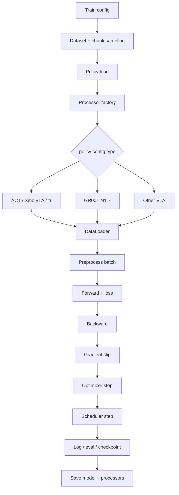
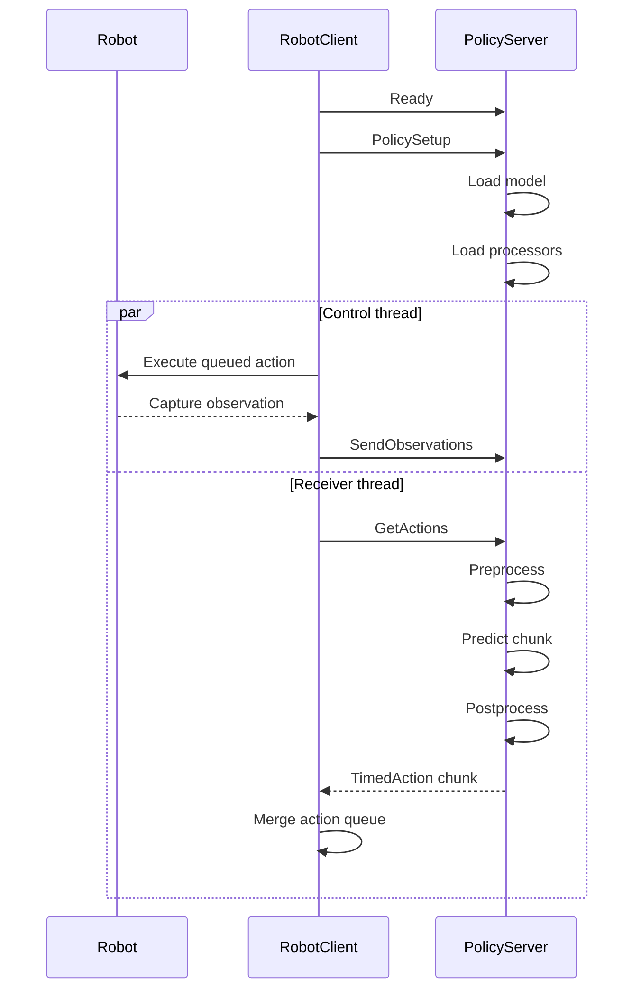

# LeRobot v0.6.0 소스 분석 (참고 구현)

> 이 문서는 **upstream 참고 자료**다. 현재 실행 스택은 Windows LeRobot 0.4.4 /
> Linux policy-server LeRobot 0.5.1 이며, 이 저장소의 as-built 명세는
> [`SPEC.md`](SPEC.md) 에 있다.

---

분석 기준은 `ref_repos/lerobot`의 **v0.6.0**, commit
[`30da8e6`](https://github.com/huggingface/lerobot/tree/30da8e687a6dfc617fcd94afc367ac7071c376ce)이다.
이 clone은 다음 버전 설계를 검토하기 위한 참고용이며, 현재 실행 스택은
Windows LeRobot 0.4.4 / Linux policy-server LeRobot 0.5.1을 그대로 사용한다
(`../README.md` §실행 경로).

<strong>lerobot-train 처리 파이프라인과 VLA별 분기</strong>

`lerobot-train`은 모든 policy가 공유하는 **학습 orchestration**이고, 실제 입력 변환·모델·loss·optimizer는
policy별로 분기된다. 따라서 “모든 policy가 같은 train processor를 쓴다”가 아니라,
**공통 runner가 policy별 `PolicyProcessorPipeline`을 호출한다**가 정확하다.

공통 흐름의 실제 분기점은 다음과 같다.

| 단계 | 공통 처리 | policy별로 달라지는 부분 |
|---|---|---|
| dataset | LeRobot dataset 로드, episode-aware sampling | `action_delta_indices`·`observation_delta_indices`가 chunk/history 길이를 결정 |
| policy 생성 | dataset metadata에서 feature schema 추론 | `get_policy_class()`가 모델 class를 선택하고 pretrained/fresh-init 경로 분기 |
| batch 전처리 | 매 step `preprocessor(batch)` 호출 | rename·normalization·tokenization·padding·frame 변환·relative action 순서가 서로 다름 |
| 학습 update | `forward → backward → clip → optimizer.step → scheduler.step` | 각 policy의 `forward()`가 architecture와 loss를, config가 optimizer/scheduler preset을 정의 |
| 후처리 | offline train loss 계산에는 사용하지 않음 | `postprocessor`는 env eval/추론에서 action decode·unnormalize·absolute 복원에 사용 |
| 저장/재개 | checkpoint와 train state 저장 | processor 두 개도 JSON으로 함께 저장하며, pretrained 재개 시 저장된 pipeline을 복원 |

VLA별 processor 차이는 아래와 같다. 모든 행 앞에는 feature rename과 필요 시 batch dimension 추가,
끝에는 device 이동이 공통으로 붙는다.

| `--policy.type` | 학습 preprocessor의 핵심 순서 | 추론 postprocessor | 내장 relative-action flag |
|---|---|---|---|
| `pi0` | task newline/PaliGemma tokenize → **absolute→relative(선택)** → normalize | unnormalize → **relative→absolute(선택)** | `use_relative_actions` |
| `pi0_fast` | **absolute→relative(선택)** → normalize → state/language 준비 → text tokenizer + action tokenizer | unnormalize → **relative→absolute(선택)** | `use_relative_actions` |
| `pi05` | **absolute→relative(선택)** → normalize → state token 준비 → PaliGemma tokenize | unnormalize → **relative→absolute(선택)** | `use_relative_actions` |
| `groot` | LeRobot 입력을 video/state/action/language/embodiment로 pack → N1.7 VLM encode. checkpoint modality config와 horizon별 stats를 사용 | N1.7 action decode·unnormalize. native `xyz+rot6d` EEF-relative는 SE(3)로 absolute pose 복원 | `use_relative_actions`; native N1.7 경로 우선, generic fallback 존재 |
| `smolvla` | task newline → VLM tokenizer → normalize | unnormalize | 없음 |
| `xvla` | text tokenize → image float/ImageNet normalize → domain ID 추가 → dataset normalize | unnormalize | 없음 |
| `eo1` | normalize → conversation template → Qwen processor | unnormalize | 없음 |
| `molmoact2` | joint sign/offset frame 변환 → gripper-mask normalize/clamp → image/state/language/setup/control token pack | action clamp → masked unnormalize → joint frame 역변환 | 없음 |
| `wall_x` | Qwen 계열 task formatting → normalize | unnormalize | 없음 |
| `evo1` | state/action 차원 padding → normalize | unnormalize → action 차원 복원·선택적 gripper 이진화 | 없음 |

> **Relative action 주의**: v0.6.0의 공용 `RelativeActionsProcessorStep`은 같은 index의
> `observation.state`를 action chunk 전체에서 단순히 빼고, 후처리에서 다시 더한다
> (`relative = action - state`). 즉 joint/EEF라는 좌표 의미를 해석하거나 SE(3) pose composition을
> 수행하지 않는다. EEF의 `rpy`, quaternion, Rot6D에 이 step을 그대로 쓰면 회전의 진짜 상대 pose가
> 아니라 **표현 벡터의 성분별 차이**가 된다. 단, GR00T N1.7 전용 decoder에는 checkpoint가
> `type=eef`, `format=xyz+rot6d`로 선언한 native relative action을
> `T_abs = T_state @ T_rel`로 복원하는 별도 `relative_eef_to_absolute()` 경로가 있다.
> 반대 방향의 범용 absolute EEF→relative 변환을 ACT·SmolVLA까지 제공하는 것은 아니므로,
> SO101의 공통 EEF-relative 입력은 `T_rel = inv(T_state) @ T_action`을 계산하는 별도 processor가
> 필요하다.

이 프로젝트의 세 학습 대상만 보면 ACT와 SmolVLA에는 v0.6.0 내장 relative flag가 없고,
GR00T N1.7에만 전용 지원이 있다. 세 모델에 동일한 EEF-relative 계약을 적용하려면 dataset을
미리 relative로 덮어쓰기보다 공통 custom pre/post processor를 policy pipeline에 삽입하고,
그 processor 설정과 relative-action 통계를 checkpoint에 함께 저장하는 설계가 적합하다.

소스 근거:
[`lerobot_train.py`](https://github.com/huggingface/lerobot/blob/v0.6.0/src/lerobot/scripts/lerobot_train.py) ·
[`datasets/factory.py`](https://github.com/huggingface/lerobot/blob/v0.6.0/src/lerobot/datasets/factory.py) ·
[`policies/factory.py`](https://github.com/huggingface/lerobot/blob/v0.6.0/src/lerobot/policies/factory.py) ·
[`relative_action_processor.py`](https://github.com/huggingface/lerobot/blob/v0.6.0/src/lerobot/processor/relative_action_processor.py)

<strong>LeRobot v0.6.0이 지원하는 VLA 목록</strong>

upstream README가 **VLA Models**로 분류하고 `lerobot-train --policy.type=...` 및 policy factory에서
선택 가능한 모델은 다음 10개다.

| 모델 | `--policy.type` | policy class | 전용 processor factory |
|---|---|---|---|
| π0 (Pi0) | `pi0` | `PI0Policy` | `make_pi0_pre_post_processors` |
| π0-FAST (Pi0Fast) | `pi0_fast` | `PI0FastPolicy` | `make_pi0_fast_pre_post_processors` |
| π0.5 (Pi05) | `pi05` | `PI05Policy` | `make_pi05_pre_post_processors` |
| GR00T N1.7 | `groot` | `GrootPolicy` | `make_groot_pre_post_processors` |
| SmolVLA | `smolvla` | `SmolVLAPolicy` | `make_smolvla_pre_post_processors` |
| XVLA | `xvla` | `XVLAPolicy` | `make_xvla_pre_post_processors` |
| EO-1 | `eo1` | `EO1Policy` | `make_eo1_pre_post_processors` |
| MolmoAct2 | `molmoact2` | `MolmoAct2Policy` | `make_molmoact2_pre_post_processors` |
| WALL-OSS | `wall_x` | `WallXPolicy` | `make_wall_x_pre_post_processors` |
| EVO1 | `evo1` | `Evo1Policy` | `make_evo1_pre_post_processors` |

- **ACT는 지원되지만 VLA가 아니다.** upstream에서는 `act`를 Imitation Learning으로 분류한다.
- **GR00T는 N1.7만 지원한다.** v0.6.0은 N1.5 config/checkpoint를 명시적으로 거부하며, N1.5가
  필요하면 LeRobot 0.5.1을 사용하라는 오류를 낸다.
- VLA-JEPA·LingBot-VA·FastWAM은 이름에 VLA가 포함되거나 VLA backbone을 사용하지만 upstream
  README 분류상 **World Models**라서 위 VLA 10개 목록에서는 제외했다.
- registry에는 Diffusion, VQ-BeT, MultiTask DiT, TDMPC, Gaussian Actor 같은 비-VLA policy와
  third-party `lerobot_policy_*` plugin 확장 경로도 별도로 존재한다.

소스 근거:
[`README — SoTA Models`](https://github.com/huggingface/lerobot/tree/v0.6.0#sota-models) ·
[`policies/__init__.py`](https://github.com/huggingface/lerobot/blob/v0.6.0/src/lerobot/policies/__init__.py) ·
[`policies/factory.py`](https://github.com/huggingface/lerobot/blob/v0.6.0/src/lerobot/policies/factory.py)

<strong>async policy-server ↔ robot-client 추론 파이프라인</strong>

v0.6.0의 async inference는 Python `asyncio`나 비동기 gRPC stub이 아니다.
**동기 gRPC RPC, client의 control/receiver 두 thread, server의 observation queue**를 조합해
action 실행과 다음 chunk 추론을 겹친 구조다. server는 기동 직후 모델이 없는 빈 container이고,
client handshake가 policy와 checkpoint를 선택한다.

### gRPC 계약

| RPC | 방향·형태 | payload와 역할 |
|---|---|---|
| `Ready` | unary → unary | 새 client가 server의 observation queue와 predicted timestep set을 초기화 |
| `SendPolicyInstructions` | unary → unary | pickle `RemotePolicyConfig`: policy type, checkpoint 경로, robot feature schema, device, `actions_per_chunk` 전달. server가 model과 checkpoint의 pre/post processor를 로드 |
| `SendObservations` | client-streaming → unary | pickle `TimedObservation`을 2 MiB 조각으로 전송. 연속 관측 stream 하나가 아니라 **관측 한 건마다 호출하는 blocking RPC** |
| `GetActions` | unary → unary polling | server가 observation을 기다려 추론한 뒤 pickle `list[TimedAction]` 반환. timeout이면 빈 response |

### 실행 순서

1. `RobotClient.__init__()`이 로봇을 연결하고 hardware observation schema를 LeRobot feature schema로 만든다.
2. `Ready → SendPolicyInstructions` handshake 후 server는 `get_policy_class(...).from_pretrained(...)`로
   model을 로드하고, 같은 checkpoint에서 `make_pre_post_processors(...)`를 복원한다.
3. client main thread는 `fps` 주기로 action queue에서 한 action을 꺼내 `robot.send_action()`을 호출한다.
   queue 비율이 `queue_size / action_chunk_size <= chunk_size_threshold`가 되면 새 관측을 보낸다.
4. server의 observation queue는 `maxsize=1`이다. 새 관측이 오는데 queue가 차 있으면 이전 것을
   버리므로, 밀릴 때 backlog를 처리하지 않고 **가장 최신 관측**으로 교체한다.
5. receiver thread의 `GetActions`가 관측 하나를 가져와
   `raw robot obs → LeRobot obs → preprocessor → policy.predict_action_chunk()`를 실행한다.
   결과는 `actions_per_chunk`까지만 자르고 postprocessor를 적용한 뒤 CPU `TimedAction`으로 만든다.
6. client는 이미 실행한 timestep 이하의 stale action을 버리고, 기존 queue와 새 chunk가 겹치는
   timestep은 `aggregate_fn`으로 결합한다. 기본 `weighted_average`는
   `0.3 × old + 0.7 × new`이다.
7. 현재 chunk가 완전히 소진되기 전에 다음 추론이 진행되므로 정상 튜닝 상태에서는 robot이
   inference를 기다리는 idle frame을 줄일 수 있다. queue가 실제로 비면 fallback action은 없으며,
   새 chunk가 올 때까지 추가 command를 보내지 않는다.

### 핵심 파라미터

| 파라미터 | v0.6.0 source 기본값 | 의미 |
|---|---:|---|
| client/server `fps` | 30 / 30 | client control 주기와 server가 `TimedAction`에 부여하는 timestep 간격. 양쪽을 동일하게 유지 |
| `actions_per_chunk` | 필수 | policy 출력 중 네트워크로 돌려줄 길이. policy의 `chunk_size` 이하여야 함 |
| `chunk_size_threshold` | 0.5 | queue가 최대 수신 chunk의 이 비율 이하일 때 새 관측 송신. 높을수록 빠른 재계획·많은 overlap/RPC |
| `aggregate_fn_name` | `weighted_average` | overlap action 결합. `latest_only`, `average`, `conservative`도 지원 |
| `obs_queue_timeout` | 2 s | `GetActions`가 server observation을 기다리는 최대 시간 |
| `inference_latency` | 1/30 s | server `GetActions` 호출의 최소 목표 간격. 실제 추론이 더 느리면 추가 sleep 없음 |

> upstream async 문서 표에는 `chunk_size_threshold` 기본값이 0.7로 적힌 곳이 있지만,
> v0.6.0의 `RobotClientConfig` 실제 기본값과 예제 명령은 **0.5**다.

### 지원 범위와 주의점

- async server의 source allowlist는
  `act`, `smolvla`, `diffusion`, `tdmpc`, `vqbet`, `pi0`, `pi05`, `groot`의 **8개**다.
  위의 전체 VLA 10개와 같지 않으며 `pi0_fast`, XVLA, EO-1, MolmoAct2, WALL-OSS, EVO1은 빠져 있다.
  이 프로젝트 대상 ACT·SmolVLA·GR00T N1.7은 모두 allowlist에 포함된다.
- camera key는 checkpoint의 `policy.config.image_features`와 맞아야 한다. `RemotePolicyConfig`에는
  `rename_map`이 있지만 stock `RobotClientConfig` CLI에는 이를 노출하는 field가 없어, key가 다르면
  client 쪽 schema를 맞추거나 별도 client wrapper가 필요하다.
- 관측 중복 필터는 image를 비교하지 않고 `observation.state`의 L2 distance만 본다
  (`atol=1`). joint가 아닌 EEF state로 바꾸면 단위와 차원이 달라지므로 threshold도 함께 재설계해야 한다.
- stock server는 action chunk를 postprocessor에 한 번에 넣지 않고 `(B, action_dim)`으로 한 step씩
  호출한다. 반면 GR00T N1.7의 native relative decoder는 horizon별 stats와 기준 pose 때문에
  `(B, T, action_dim)` 전체를 요구하고 single-step decode를 명시적으로 거부한다. 따라서
  **v0.6.0 stock async 경로 그대로는 native GR00T EEF-relative chunk와 호환되지 않는다.**
  GR00T 및 공통 EEF-relative processor를 적용할 때는 server가 chunk 전체를 한 번에 postprocess하도록
  수정하고, 해당 processor를 학습 checkpoint에 저장해야 한다.
- transport는 `grpc.insecure_channel`이고 policy config·observation·action에 Python pickle을 사용한다.
  인증·TLS·payload 검증이 없으므로 인터넷에 직접 노출하면 안 된다. client/server를 같은 신뢰
  boundary에 두고 방화벽, VPN 또는 SSH tunnel을 사용한다.
- server instance에는 session ID가 없고 `Ready`가 전역 queue를 초기화한다. 여러 client가 동시에
  접속하면 서로 model/session 상태를 덮어쓸 수 있어 사실상 **server 하나당 active client 하나** 구조다.

이 프로젝트에서는 실기기가 stock `RobotClient` 계열을 사용하고, sim은
`vla_policy_node`가 같은 gRPC/pickle 계약을 구현하되 ROS observation과 자체 `deque`·inference
thread를 사용한다. `policy-server-affine`은 server의 관측 enqueue 전과 action chunk 생성 후에
joint-frame affine 변환을 추가하며, policy의 checkpoint processor 바깥에서 동작한다.

소스 근거:
[`robot_client.py`](https://github.com/huggingface/lerobot/blob/v0.6.0/src/lerobot/async_inference/robot_client.py) ·
[`policy_server.py`](https://github.com/huggingface/lerobot/blob/v0.6.0/src/lerobot/async_inference/policy_server.py) ·
[`configs.py`](https://github.com/huggingface/lerobot/blob/v0.6.0/src/lerobot/async_inference/configs.py) ·
[`services.proto`](https://github.com/huggingface/lerobot/blob/v0.6.0/src/lerobot/transport/services.proto) ·
[`async.mdx`](https://github.com/huggingface/lerobot/blob/v0.6.0/docs/source/async.mdx)

