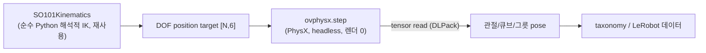
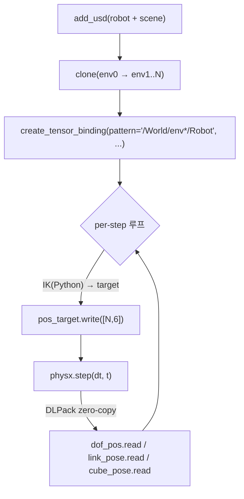
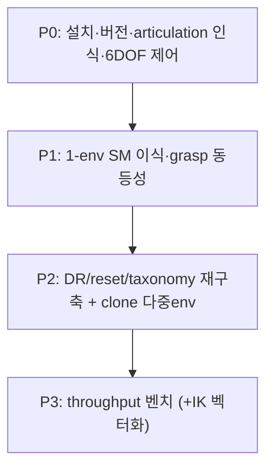

# ovphysx 물리 데이터생성 (Track B) — 프로젝트 마스터 문서

> **한 줄 요약**: NVIDIA **ovphysx**(PhysX SDK + USD physics + DLPack tensor interop Python API)로 IsaacLab `ManagerBasedRLEnv` 없이 **렌더 불필요 headless 물리-only 데이터생성 루프**를 만든다. SO-101 articulation 을 텐서 바인딩(position target)으로 제어, `clone()` 으로 다중 env 병렬. 목표는 scripted-expert 데이터 생성 throughput.
>
> **현재 상태**: 🔵 **P1 진행 — 인프라 완비, grasp 물리 동등성 미입증(P2 필요)**. P0 둘 다 PASS(설치·버전우회·6-DOF 제어). P1 에서 **co-load(합성 USD)·fixed base(FixedJoint+frame)·해석적 IK·큐브 센싱 전부 작동**. 단 1-cube grasp 큐브 z −1mm(미들림) — **물리 결함 아니라** probe 의 naive top-down grasp 탓(실제 SM 이 "slide 구조적 필수"로 입증, [`PICKCUBE_SM_PROJECT.md`] D20). 동등성 검증엔 SM side-approach planner 이식 = P2. 함정: ovphysx 0.4.13 = **USD stage 1개만**·`path_prefix` 미지원·**floating base**(fixed-base 명시 필수).
>
> **작성 기준**: 2026-06-13. probe `scripts/perf/ovphysx_probe.py`. 전용 venv `.venv-ovphysx`. 상세 플랜 `~/.claude/plans/ref-repos-ovrtx-ref-repos-physx-recursive-spark.md`.

---

## 0. 목차

1. [태그·중요도 범례](#1-태그중요도-범례)
2. [목표와 용도](#2-목표와-용도)
3. [제약](#3-제약)
4. [아키텍처: 텐서 API 물리 루프](#4-아키텍처-텐서-api-물리-루프)
5. [실행 환경](#5-실행-환경)
6. [계획 & 칸반 보드](#6-계획--칸반-보드)
7. [타임라인 & 구간별 결과](#7-타임라인--구간별-결과)
8. [주요 결정사항](#8-주요-결정사항-decision-log)
9. [핵심 API & 설정](#9-핵심-api--설정)
10. [트러블슈팅](#10-트러블슈팅)
11. [검증 방법](#11-검증-방법)
12. [재현 절차](#12-재현-절차)
13. [참고 자료](#13-참고-자료)

---

## 1. 태그·중요도 범례

| 배지 | 의미 | | 배지 | 의미 |
|---|---|---|---|---|
| 🟢 **DONE** | 완료+검증 | | 🔥 **CRITICAL** | 성패 직결 |
| 🔵 **IN-PROGRESS** | 진행 중 | | ⭐ **HIGH** | 큰 영향 |
| ⚪ **TODO** | 예정 | | | |
| 🔴 **BLOCKER** | 막힘 | | | |
| ⚫ **DROPPED** | 폐기(교훈) | | | |

---

## 2. 목표와 용도



- 🔥 **목표**: scripted-expert 물리 데이터 생성 throughput. IsaacLab `ManagerBasedRLEnv`(매니저 오버헤드 + 렌더 가능성) 대신 **물리 엔진만** 텐서 API 로.
- **장점 후보**: 렌더 오버헤드 0, Omniverse kit 의존성 회피, env 확장 여지.
- ⚠️ **현실 경계**: 현 SM 의 wall-clock 병목은 **per-env Python IK 루프**(`pick_cube_state_machine.py:1332`). ovphysx 만으론 그 루프 안 빨라짐 → 큰 throughput gain 은 **IK 벡터화 동반** 필요. ovphysx 단독 효과는 P3 실측으로 판정.

---

## 3. 제약

| # | 제약 | 상태 | 이유 |
|---|---|---|---|
| C1 | 메인 `.venv` 핀 환경 **불변** | ✅ | ovphysx 는 전용 `.venv-ovphysx` 격리(namespaced USD 라 isaacsim 공존 가능하나 분리) |
| C2 | **grasp 물리 거동이 IsaacLab(PhysX 5.6.1)과 동등**해야 데이터 validity | ⚪ | ovphysx 0.4.13=PhysX 5.9.0 → P1 에서 contact 거동 차이 검증 필수 |
| C3 | Part A 기구학(`SO101Kinematics`) 재사용 — 재구현 금지 | ✅ | 순수 Python·IsaacLab 비의존, 검증됨(FK 1.5mm) |
| C4 | 성공 판정 기준(`BOWL_SUCCESS_RADIUS` 등) SM 과 동일 | ⚪ | taxonomy 재구축 시 동일 상수 |

---

## 4. 아키텍처: 텐서 API 물리 루프

ovphysx 는 **물리 엔진만** 제공. IsaacLab 이 주던 scaffold(reset/DR/관측/termination/taxonomy)를 직접 재구축해야 한다(작업량의 핵심).



| 구성 | 역할 | 핵심 |
|---|---|---|
| **add_usd** | USD 물리 로드 | robot(`so101_follower.usd`) + scene(`cube_desk/scene.usd`). **`path_prefix` 미지원(0.4.13)** → 합성 USD 또는 개별 로드로 우회 |
| **articulation 제어** 🔥 | SO-101 6-DOF | `ARTICULATION_DOF_POSITION_TARGET` write(PD drive), `ARTICULATION_DOF_POSITION`/`ARTICULATION_LINK_POSE` read. dof_names=shoulder_pan/lift/elbow_flex/wrist_flex/wrist_roll/gripper(=action[6]) |
| **clone** | 병렬 env | `clone(src, targets, parent_transforms)` + pattern glob(`/World/env*/Robot`) → 텐서 first-dim=N. per-env 루프 불필요 |
| **IK 재사용** | target 계산 | 기존 `SO101Kinematics`(순수 Python) 그대로. 현재 per-env 루프라 **벡터화 동반 시 큰 gain** |
| **scaffold 재구축** 🔥 | reset/DR/obs/term/taxonomy | IsaacLab manager 부재 → 텐서 write 로 큐브 pose 샘플링(DR), read 로 관측·성공판정 직접 작성 |

---

## 5. 실행 환경

| 항목 | 값 |
|---|---|
| 서버 | Ubuntu 24.04.3, RTX PRO 5000 Blackwell 48GB (GPU 1장 공유) |
| ovphysx | **0.4.13** (PhysX SDK **5.9.0**), `pip install ovphysx` (PyPI, 176MB 바이너리 wheel) |
| Python | 3.10+ (전용 venv 3.11) |
| 런타임 deps | `packaging` 만(+probe 용 numpy). namespaced OpenUSD 번들 |
| 격리 | `.venv-ovphysx` (메인 `.venv` 분리) |
| device | `"cpu"`/`"gpu"`/`"auto"`. probe 는 cpu(GPU 경합 회피). 본 루프는 gpu(DLPack torch zero-copy) |
| 버전 | ovphysx PhysX 5.9.0 ≠ isaacsim 번들 5.6.1 → **`ignore_version_mismatch=True` 우회**(ovphysx 자체 PhysX 번들이라 동작) |

---

## 6. 계획 & 칸반 보드



| 단계 | 상태 | 중요도 | 내용 | 완료 기준 (게이트) |
|---|---|---|---|---|
| **P0 설치·articulation** | 🟢 DONE | 🔥 | `ovphysx_probe.py`: 버전 체크 + robot USD articulation 인식 + 6-DOF position 제어 | **게이트1 버전 우회 ✅ + 게이트2 6-DOF 제어 ✅** |
| **P1 1-env SM 이식** | 🔵 진행 | 🔥 | co-load(합성 USD)·fixed base·IK·센싱 작동. 1-cube grasp probe. (타임라인 r1~r5) | grasp 큐브 −1mm **미입증** — naive top-down 탓(물리 아님). 동등성 검증은 P2 planner 이식 필요 |
| **P2 scaffold 재구축** | ⚪ TODO | 🔥 | DR(큐브 pose 샘플링)·reset·obs·termination·taxonomy 텐서 기반 재작성 + `clone` 다중 env | 4-cube taxonomy SM 과 일치 |
| **P3 throughput 벤치** | ⚪ TODO | ⭐ | ovphysx N-env wall-clock vs IsaacLab SM. **IK 벡터화 전이면 Python 루프 병목** | 비교 표(+IK 벡터화 효과) |

---

## 7. 타임라인 & 구간별 결과

| 시점 | 작업 | 상태 | 결과 / 교훈 |
|---|---|---|---|
| 2026-06-13 | `pip install ovphysx` → 0.4.13 | 🟢 | 176MB 바이너리 wheel(PhysX 5.9.0 번들). deps=packaging |
| 2026-06-13 | `bootstrap()` + `PhysX(device=cpu, ignore_version_mismatch=True)` | 🟢 | **게이트1 PASS** — 버전 mismatch 우회 성공. robot USD `add_usd` OK |
| 2026-06-13 | articulation 인식 (pattern `/so101_new_calib/base`) | 🟢 | **게이트2 PASS** — count=1, **dof_count=6**, dof_names=[shoulder_pan, shoulder_lift, elbow_flex, wrist_flex, wrist_roll, gripper] = action[6] 정확 일치 |
| 2026-06-13 | position target 제어 (stiffness 200/damping 20) | 🟢 | shoulder_lift 0→**0.4rad 정확 도달**(잔차 0). 다른 DOF≈0. **6-DOF 제어 작동 확정** |
| 2026-06-13 | `add_usd(path_prefix="/Scene")` (보너스) | ⚫ | "Path prefix is not supported" — 0.4.13 미지원. scene 합성 우회 필요(비치명) |

**P0 결론**: ovphysx 로 SO-101 6-DOF position 제어 가능. **최우선 블로커(PhysX 버전)는 `ignore_version_mismatch=True` 로 해소.** Track B 본 통합 진행 가능.

### P1 (1-env grasp 이식) — 진행, grasp 미입증(naive 시퀀스 탓, 물리 아님)

| round | 작업 | 결과 / 교훈 |
|---|---|---|
| r1 | co-load 시도 (별도 add_usd) | ⚫ **ovphysx 0.4.13 = USD stage 1개만** ("Only one stage supported"). robot+scene 따로 add_usd 불가 |
| r2 | **cross-venv 합성 USD**(메인 venv usd-core 로 robot+scene references 1파일 → ovphysx 단일 add_usd) | ✅ co-load 우회 성공. 큐브4 인식. 단 grasp 큐브 z −1mm(미검출) |
| r3 진단 | 좌표 3버그 수정 | ① merged USD 에 robot translate 누락(원점 방치) ② world_to_base 가짜 `+π/2` ③ `root_yaw=0`(실제 180°) → 전부 수정. reach 0.1847m(robot1.84↔cube1.7 실거리 일치)·IK 해 찾음 |
| r3 DIAG | link world pose 찍어 reach 검증 | **base 가 q0 (1.84)→하강후 (1.765) 로 이동** = **floating base**(P0 `is_fixed_base=False`). jaw↔cube **206mm** — 팔이 큐브 못 닿음 |
| r4 | FixedJoint(world↔base) **frame 미설정** | ⚫ base 를 원점으로 끌어 **solver NaN** |
| r5 | FixedJoint **frame=base world pose**(localPos0/Rot0) | ✅ **base 고정**(world (1.840,-0.569,0.675) 안정). jaw↔cube 206→**101mm**(jaw 링크원점 기준; TCP=jaw−98mm≈cube z) — 팔이 큐브 근처 도달 |

**P1 결론(진단 확정)**: grasp 큐브 −1mm 는 **물리 동등성 문제 아님.** 원인 체인 = ① 좌표 3버그(수정) → ② **floating base**(FixedJoint+frame 으로 고정) → ③ 남은 미검출은 probe 가 **naive top-down grasp**(side-approach slide 없음·lift IK fallback). **실제 SM 이 이미 "top-down 은 capture 불가, slide 구조적 필수"로 입증**([`PICKCUBE_SM_PROJECT.md`] D20). 즉 grasp 물리 동등성 검증엔 **SM 전체 side-approach waypoint planner 이식 필요 = P2**. 인프라(co-load·6DOF·IK·센싱·**fixed base**)는 전부 작동.

---

## 8. 주요 결정사항 (Decision Log)

| # | 결정 | 근거 |
|---|---|---|
| B1 | ovphysx 는 **전용 venv** 격리 | namespaced USD 로 공존 가능하나 PhysX 5.9 vs isaacsim 5.6.1 혼선 회피 |
| B2 | **버전 mismatch 는 `ignore_version_mismatch=True` 우회** | ovphysx 가 자체 PhysX 5.9.0 번들 → isaacsim 5.6.1 과 독립. USD schema forward-compat 로 동작(probe 검증) |
| B3 | SO-101 은 **단일 articulation 6 DOF**(arm 5 + gripper 1) | robot USD `/so101_new_calib/base` 1개 ArticulationRoot, gripper 가 6번째 joint. 별도 binding 불필요(plan 초기 우려 빗나감) |
| B4 | **IK/waypoint 재사용**, scaffold 만 재구축 | `SO101Kinematics`·planner 는 순수 Python·IsaacLab 비의존. 재구현 금지(C3) |
| B5 | **per-env Python IK 가 진짜 병목** — ovphysx 단독 gain 제한 | 현 SM 병목은 물리 아니라 Python 루프(`:1332`). 큰 throughput 은 IK 벡터화 동반 필요 |
| B6 | grasp 물리 **동등성 검증이 P1 게이트** | ovphysx PhysX 5.9 ≠ 5.6.1. contact-rich grasp 는 delicate(`GRASP_PHYSICS.md`) — 거동 달라지면 데이터 invalid |

---

## 9. 핵심 API & 설정

### 9.1 ovphysx Python API (`ovphysx/python/ovphysx/{api,config,types}.py`)

```python
import ovphysx, numpy as np
from ovphysx.types import TensorType

ovphysx.bootstrap()
physx = ovphysx.PhysX(config=ovphysx.PhysXConfig(num_threads=8),
                      device="gpu", ignore_version_mismatch=True)
physx.add_usd("assets/robots/so101_follower.usd")     # path_prefix 미지원(0.4.13)
physx.wait_all()
physx.clone("/World/env0", [f"/World/env{i}" for i in range(1, N)])  # 병렬 env

pos_tgt = physx.create_tensor_binding(pattern="/so101_new_calib/base",  # 또는 /World/env*/Robot
                                      tensor_type=TensorType.ARTICULATION_DOF_POSITION_TARGET)
pos     = physx.create_tensor_binding(pattern="...", tensor_type=TensorType.ARTICULATION_DOF_POSITION)
# PD drive 보장(USD drive 0이면 무시) — 필요 시
physx.create_tensor_binding(pattern="...", tensor_type=TensorType.ARTICULATION_DOF_STIFFNESS).write(...)

pos_tgt.write(targets)          # [N,6] DLPack zero-copy (torch GPU native)
physx.step(1/120, t)            # stream-ordered (write→step→read 명시 sync 불필요)
pos.read(out)                   # 관측
physx.release()
```

### 9.2 텐서 타입 (SO-101 관련)

| TensorType | shape | R/W | 용도 |
|---|---|---|---|
| `ARTICULATION_DOF_POSITION_TARGET` | [N,6] | W | **joint 제어**(PD target) |
| `ARTICULATION_DOF_POSITION` | [N,6] | R | 관절 관측 |
| `ARTICULATION_LINK_POSE` | [N,L,7] | R | 링크 world pose(EE 등) |
| `ARTICULATION_DOF_STIFFNESS`/`DAMPING` | [N,6] | RW | PD gains |
| `RIGID_BODY_POSE` | [N,7] | RW | 큐브/그릇 pose(DR·관측) |
| `RIGID_BODY_SHAPE_FRICTION_AND_RESTITUTION` | [N,S,3] | RW | 물리 DR |

### 9.3 P0 검증값

| 항목 | 값 |
|---|---|
| articulation root | `/so101_new_calib/base` (defaultPrim `/so101_new_calib`) |
| dof_count | **6** (shoulder_pan, shoulder_lift, elbow_flex, wrist_flex, wrist_roll, gripper) |
| is_fixed_base | **False** (⚠ 통합 시 base 고정 확인 — 제어 자체는 정상) |
| 제어 검증 | shoulder_lift 0→0.4rad 정확 도달(stiffness 200/damping 20, 240 step @120Hz) |

---

## 10. 트러블슈팅

| 현상 | 원인 | 해결 | 상태 |
|---|---|---|---|
| **PhysX 버전 mismatch** | ovphysx 0.4.13=PhysX 5.9.0 ≠ isaacsim 5.6.1 | `PhysX(ignore_version_mismatch=True)` — ovphysx 자체 PhysX 번들이라 동작 | 🟢 |
| **`add_usd(path_prefix=...)` 실패** | "Path prefix is not supported"(0.4.13) | scene 합성 USD 또는 개별 add_usd 로 우회 | 🟢 |
| **robot+scene co-load 불가** | ovphysx 0.4.13 = **USD stage 1개만**("Only one stage supported") | 메인 venv(usd-core)로 robot+scene references 합친 **단일 wrapper USD** → ovphysx 단일 add_usd | 🟢 |
| **grasp 시 base 떠돎(arm 큐브 못 닿음)** | robot articulation **floating base**(is_fixed_base=False) — 중력·반작용에 base 이동(jaw↔cube 206mm) | 합성 USD 에 **FixedJoint(world↔base)** 추가, **frame=base 현재 world pose**(localPos0/Rot0) | 🟢 (base 1.84 안정) |
| **FixedJoint → solver NaN** | joint frame 미설정 → base 를 원점으로 끌어 폭발 | localPos0=base world pos, localRot0=base world rot 설정 | 🟢 |
| **grasp 큐브 미들림(−1mm)** | probe 가 naive top-down(slide 없음·lift IK fallback) — SM 이 이미 "top-down capture 불가" 입증(D20) | SM side-approach waypoint planner 이식(P2) | 🔵 P2 |
| **position target 무반응** | USD drive stiffness 0 | `ARTICULATION_DOF_STIFFNESS` write 로 PD gain 주입 | 🟢 |
| **`is_fixed_base=False`** | ArticulationRoot 가 base 인데 fixed 표기 안 됨 | 제어는 정상. 통합 시 base 고정 joint 확인 | ⚪ |
| numpy 없음 | 전용 venv 최소 설치 | `uv pip install --python .venv-ovphysx numpy` | 🟢 |
| `usdrt.population`·`UJITSO` 경고 다발 | 헤드리스 omni client 없음 | 비치명, 동작함 | ⚪ |

---

## 11. 검증 방법

| 지표 | 도구 | 합격선 |
|---|---|---|
| 설치·버전(P0 게이트1) | `ovphysx_probe.py` | bootstrap+add_usd OK |
| articulation 6-DOF(P0 게이트2) | `ovphysx_probe.py` | dof 6 + position target 도달 ✅ |
| grasp 동등성(P1) | 1-cube grasp vs IsaacLab | taxonomy DONE·contact 거동 유사 |
| throughput(P3) | N-env wall-clock vs IsaacLab SM | 비교 표(IK 벡터화 효과 분리) |

---

## 12. 재현 절차

```bash
# 전용 venv + 설치 (1회)
uv venv .venv-ovphysx --python 3.11
uv pip install --python .venv-ovphysx ovphysx numpy

# P0 게이트 — 버전·articulation·6DOF 제어
.venv-ovphysx/bin/python scripts/perf/ovphysx_probe.py
# → "✓✓ 게이트2 PASS — articulation 6-DOF position 제어 작동"

# P1 — 합성 USD author (메인 venv, usd-core) → grasp probe (ovphysx venv, cpu)
.venv/bin/python scripts/perf/author_combined_usd.py          # → outputs/ovphysx_combined.usda
.venv-ovphysx/bin/python scripts/perf/ovphysx_grasp_probe.py  # → DIAG: base 고정·jaw↔cube 거리·큐브 z
```

- 관련 파일: `scripts/perf/ovphysx_probe.py`(P0), `scripts/perf/author_combined_usd.py`(합성 USD+fixed base, 메인 venv), `scripts/perf/ovphysx_grasp_probe.py`(P1 grasp), `scripts/perf/so101_kin.py`(IK standalone 복사), `outputs/ovphysx_combined.usda`, `assets/robots/so101_follower.usd`, `assets/scenes/cube_desk/scene.usd`.

---

## 13. 참고 자료

| 분류 | 자료 |
|---|---|
| repo | `ref_repos/PhysX/ovphysx` — `python/ovphysx/{api,config,types}.py`, `tests/python_samples/{tensor_bindings,tensor_bindings_views,clone,hello_world}.py` |
| 호환표 | `ref_repos/PhysX/README.md` — ovphysx 0.4=PhysX 5.9.0 / isaacsim 5.1.0=107.3+5.6.1 |
| 플랜 | `~/.claude/plans/ref-repos-ovrtx-ref-repos-physx-recursive-spark.md` (Track A/B 통합) |
| 자매 트랙 | [`OVRTX_RENDER_PROJECT.md`](OVRTX_RENDER_PROJECT.md) (카메라 렌더) |
| 관련 | [`PICKCUBE_SM_PROJECT.md`](PICKCUBE_SM_PROJECT.md)(SM·IK 재사용 대상), [`GRASP_PHYSICS.md`](GRASP_PHYSICS.md)(물리 튜닝·동등성 기준), [`../AGENTS.md`](../AGENTS.md) |

---

> **다음 작업**: P2 — SM **side-approach waypoint planner**(`pick_cube_state_machine.py` 의 `_evaluate_all_grasps`·`_build_plan`·executor)를 ovphysx 루프로 이식해야 grasp 물리 동등성을 제대로 검증 가능(naive top-down 으론 SM 도 실패함이 기지). 이식 후 1-cube grasp→lift 성공 시 큐브 z 상승 확인 → contact 거동 IsaacLab 대비 비교. 인프라(co-load·fixed base·IK·센싱)는 P1 에서 완비됨.
