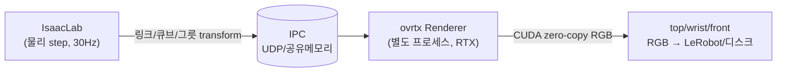
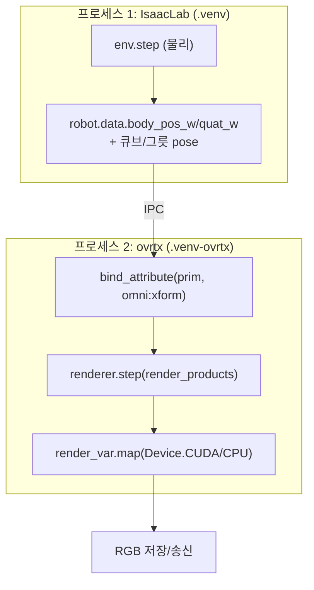
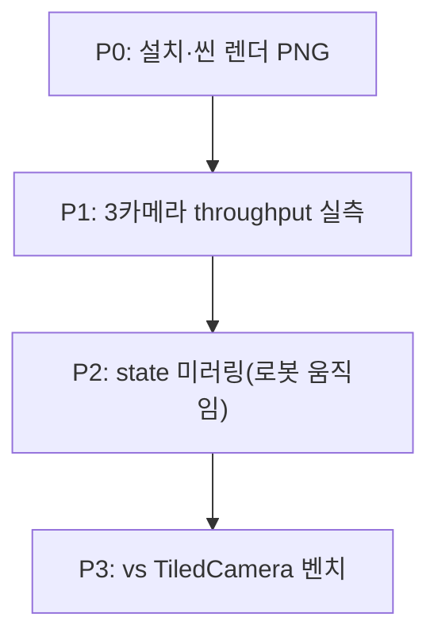

# ovrtx 분리 렌더 (Track A) — 프로젝트 마스터 문서

> **한 줄 요약**: NVIDIA **ovrtx**(Omniverse RTX 경량 C/Python 렌더러 SDK)를 **별도 프로세스**로 띄워 VLA 학습용 카메라(top/wrist/front) RGB 를 고속 생성한다. IsaacLab 이 물리를 돌리고 매 프레임 씬 state(로봇 링크·큐브·그릇·카메라 transform)를 ovrtx USD 에 써넣어 렌더만 분리. **GUI livestream FPS 문제와는 별개 목표**(데이터생성 throughput).
>
> **현재 상태**: 🔵 **P1 부분 완료** — P0(scene 렌더 PNG) + P1 에서 **3 카메라(top/wrist/front) 동시 720p 렌더 = 51 FPS**(19.6ms/frame, `docs/ovrtx_cam_{top,wrist,front}.png` 장면 확인). **게이트 미완**: IsaacLab TiledCamera 비교 FPS 미측정(Isaac Sim 부팅 오버헤드). 로봇 state 미러링(P2)은 미착수.
>
> **작성 기준**: 2026-06-13. probe 코드 `scripts/perf/ovrtx_probe.py`. 전용 venv `.venv-ovrtx`. 상세 플랜 `~/.claude/plans/ref-repos-ovrtx-ref-repos-physx-recursive-spark.md`.

---

## 0. 목차

1. [태그·중요도 범례](#1-태그중요도-범례)
2. [목표와 용도](#2-목표와-용도)
3. [제약](#3-제약)
4. [아키텍처: 물리(IsaacLab) ↔ 렌더(ovrtx) 분리](#4-아키텍처-물리isaaclab--렌더ovrtx-분리)
5. [실행 환경](#5-실행-환경)
6. [계획 & 칸반 보드](#6-계획--칸반-보드)
7. [타임라인 & 구간별 결과](#7-타임라인--구간별-결과)
8. [주요 결정사항](#8-주요-결정사항-decision-log)
9. [핵심 API & 설정](#9-핵심-api--설정)
10. [트러블슈팅](#10-트러블슈팅)
11. [검증 방법](#11-검증-방법)
12. [재현 절차](#12-재현-절차)
13. [참고 자료](#13-참고-자료)

---

## 1. 태그·중요도 범례

| 배지 | 의미 | | 배지 | 의미 |
|---|---|---|---|---|
| 🟢 **DONE** | 완료+검증 | | 🔥 **CRITICAL** | 성패 직결 |
| 🔵 **IN-PROGRESS** | 진행 중 | | ⭐ **HIGH** | 큰 영향 |
| ⚪ **TODO** | 예정 | | | |
| 🔴 **BLOCKER** | 막힘 | | | |
| ⚫ **DROPPED** | 폐기(교훈) | | | |

---

## 2. 목표와 용도



- 🔥 **목표**: VLA 학습용 멀티뷰 RGB 데이터 **렌더 throughput** 향상. IsaacLab 의 `TiledCamera` 렌더 경로를 ovrtx 분리 파이프라인이 대체/보완.
- **분리 이유**: ovrtx 는 물리·articulation 없는 **순수 렌더러**. kit 인터랙티브 뷰포트를 못 대체하므로 인터랙티브 관전용이 아니라 **오프라인/병렬 데이터 렌더**에 적합.
- **비목표**: GUI livestream FPS 개선(별 문서 `PICKCUBE_SM_PROJECT.md`·메모리 참조 — 그건 물리+render-sync 직렬 구조 문제로 ovrtx 무관).

---

## 3. 제약

| # | 제약 | 상태 | 이유 |
|---|---|---|---|
| C1 | 메인 `.venv` 핀 환경(numpy 1.26·torch 2.7+cu128·isaacsim 5.1) **불변** | ✅ | ovrtx 는 전용 `.venv-ovrtx` 격리 설치 |
| C2 | ovrtx 는 **렌더 전용** — 물리·IK·grasp 거동 일절 안 건드림 | ✅ | 물리는 IsaacLab 단독 |
| C3 | 데이터 validity — 렌더된 이미지가 실제 시뮬 state 와 일치 | ⚪ | state 미러링(P2)에서 좌표계 정합 검증 필요 |
| C4 | pre-release(0.3.0) — API 변동 가능 | ⚠️ | 버전 핀 유지 |

---

## 4. 아키텍처: 물리(IsaacLab) ↔ 렌더(ovrtx) 분리

ovrtx 는 **USD 의 transform 을 렌더만** 한다. 로봇이 움직여 보이려면 **매 프레임 모든 동적 prim 의 world-transform 을 ovrtx USD 에 write** 해야 한다(이게 본 작업량의 핵심).



| 구성 | 역할 | 핵심 |
|---|---|---|
| **render layer USDA** | scene.usd 참조 + Camera(top/wrist/front) + RenderProduct/RenderVar(LdrColor) | cube_desk 엔 카메라 없음 → 신규 author. 해상도·focal 은 `pick_cube_env_cfg.py::make_pick_cube_camera_cfgs` 와 일치 |
| **state 미러링** 🔥 | IsaacLab 의 동적 prim transform → ovrtx prim | 로봇 링크(다수)·큐브4·그릇·카메라. `bind_attribute` 영구 바인딩 후 매 프레임 `write(4x4 matrices)`. **좌표계(world) 정합이 작업량 대부분** |
| **출력** | RGB 추출 | `frame.render_vars["LdrColor"].map(device=Device.CPU/CUDA)` → `np.from_dlpack`. CUDA 면 zero-copy(정책 직결) |
| **warmup** | 텍스처 streaming·수렴 | 씬 로드/리셋 후 40 step(`skills/warmup`). 첫 실행 shader 컴파일 10–60s(이후 캐시) |

---

## 5. 실행 환경

| 항목 | 값 |
|---|---|
| 서버 | Ubuntu 24.04.3, RTX PRO 5000 Blackwell 48GB (GPU 1장 공유) |
| ovrtx | **0.3.0** (Alpha/pre-release), `pip install ovrtx==0.3.0` (PyPI) |
| Python | 3.10–3.13 (전용 venv 3.12) |
| 런타임 deps | **0개** (C 라이브러리 + namespaced OpenUSD 번들). numpy/pillow 는 probe 용만 |
| 격리 | `.venv-ovrtx` (메인 `.venv` 와 분리 — namespaced USD 라 usd-core 26.5 충돌 없음, `CHANGELOG.md:52`) |
| headless | 디스플레이 불필요(X display 경고 비치명) |
| 출력 | `docs/ovrtx_poc.png`(P0), 추후 `outputs/perf/ovrtx_*` |

---

## 6. 계획 & 칸반 보드



| 단계 | 상태 | 중요도 | 내용 | 완료 기준 (게이트) |
|---|---|---|---|---|
| **P0 설치·렌더 검증** | 🟢 DONE | 🔥 | 전용 venv 설치 + `ovrtx_probe.py` 로 cube_desk 렌더 PNG | **scene.usd(payload) 렌더 PNG** ✅ |
| **P1 멀티카메라 throughput** | 🔵 부분 | 🔥 | `ovrtx_render_layer_probe.py`: 3 카메라 동시 720p + warmup 후 FPS 실측 | ovrtx 측 **51 FPS** 측정 ✅ / **TiledCamera 비교 미측정**(게이트 미완) |
| **P2 state 미러링** | ⚪ TODO | 🔥 | IsaacLab 4-env → 로봇 링크+큐브+그릇 transform IPC → ovrtx. 로봇이 움직이는 영상 | 시뮬과 일치하는 동적 렌더 |
| **P3 throughput 벤치** | ⚪ TODO | ⭐ | TiledCamera 데이터생성 vs ovrtx 분리 파이프라인 wall-clock·화질 | 비교 표 + 육안 동등 |

---

## 7. 타임라인 & 구간별 결과

| 시점 | 작업 | 상태 | 결과 / 교훈 |
|---|---|---|---|
| 2026-06-13 | `pip install ovrtx==0.3.0` (PyPI) | 🟢 | OK, 런타임 deps 0. 176MB 아님(ovphysx 와 혼동 주의) |
| 2026-06-13 | `Renderer()` 헤드리스 부팅 | 🟢 | OK(X display 경고 비치명). 첫 실행 shader 컴파일 후 캐시 |
| 2026-06-13 | inline USDA 최소 렌더(구 sphere) | 🟢 | open_usd/step/map 전 경로 동작 확인. **USDA layer metadata 는 multiline 필수**(한 줄이면 파싱 에러) |
| 2026-06-13 | `scene.usd` 참조 + 카메라 렌더 (1차) | ⚫→🟢 | **검은 화면** — 카메라가 씬 bbox 안(벽/천장 내부)·조명 부족. bbox(center 2.2,-0.21,1.26 / size 5,4,2.5) 밖으로 빼고 DomeLight+DistantLight 추가 → **책상·매트·큐브4·그릇 깨끗이 렌더** ✅ |

**P0 결론**: cube_desk `scene.usd`(payload 큐브/그릇)가 ovrtx 로 헤드리스 RTX 렌더됨. **USD payload 호환·headless 렌더 확정.** `docs/ovrtx_poc.png` 참조.

### P1 (멀티카메라 throughput) — 부분 완료

| 시점 | 작업 | 상태 | 결과 / 교훈 |
|---|---|---|---|
| 2026-06-13 | `ovrtx_render_layer_probe.py`: 3 카메라(top/wrist/front) RenderProduct 동시 720p, 각 PNG | 🟢 | `docs/ovrtx_cam_{top,wrist,front}.png` 장면 확인(육안) |
| 2026-06-13 | warmup 40 후 100 step wall-clock | 🟢 | **51.04 FPS** (3캠 동시 1280×720 RGBA), 19.59 ms/frame |
| 2026-06-13 | IsaacLab TiledCamera 비교(`tiled_camera_throughput_bench.py`·`isaac_env_step_throughput.py`) | ⚠️ | **미측정** — Isaac Sim 부팅+환경설정 오버헤드로 단기 측정 실패. 별도 벤치 환경 필요 |

**P1 결론(부분)**: ovrtx 3캠 동시 720p = 51 FPS (static scene, 로봇 미렌더). **게이트("TiledCamera 보다 빠른가") 미완** — 비교 기준(TiledCamera FPS) 미측정. 51 FPS 단독 수치만으론 통합 가치 판정 불가. 다음 = TiledCamera 벤치 별도 완료 + P2 state 미러링(로봇 움직임).

---

## 8. 주요 결정사항 (Decision Log)

| # | 결정 | 근거 |
|---|---|---|
| A1 | ovrtx 는 **별도 프로세스**(메인 .venv 격리) | namespaced USD 라 공존 가능하나, GPU 할당·의존성 격리·안정성 위해 분리 |
| A2 | **state 미러링**(prim transform write)이 본 작업 — 카메라 pose 만 아님 | ovrtx 는 물리 없음. 로봇 움직임 보이려면 모든 동적 prim transform 매 프레임 write |
| A3 | P1 throughput 게이트가 **본 결정점** | "수만 fps" 주장 미검증. TiledCamera 보다 안 빠르면 통합 가치 없음 → 중단 |
| A4 | 카메라는 **bbox 밖 + 명시 조명** | scene.usd 단독 로드 시 IsaacLab 광원/카메라 nesting 없음 → 직접 author |

---

## 9. 핵심 API & 설정

### 9.1 ovrtx Python API (`ovrtx/python/ovrtx/_src/renderer.py`)

```python
import ovrtx, numpy as np
r = ovrtx.Renderer()                              # 헤드리스 OK
r.open_usd_from_string(usda)                      # 또는 open_usd(path) / add_usd_reference(file, prefix)
b = r.bind_attribute(prim_paths, "omni:xform",    # per-frame transform 갱신용 영구 바인딩
                     dtype="float64", shape=(4,4))
for _ in range(40):                               # warmup
    r.step(render_products={"/Render/Camera"}, delta_time=1/60)
b.write(matrices)                                 # IsaacLab pose 주입
products = r.step(render_products={"/Render/Top","/Render/Wrist","/Render/Front"}, delta_time=1/60)
for _, prod in products.items():
    for fr in prod.frames:
        rgb = np.from_dlpack(fr.render_vars["LdrColor"].map(device=ovrtx.Device.CPU))  # (H,W,4) uint8
```

### 9.2 render layer USDA 최소 구조

```usda
#usda 1.0
(
    defaultPrim = "World"     # ← metadata 는 반드시 multiline (한 줄이면 파싱 에러)
    upAxis = "Z"
    metersPerUnit = 1.0
)
def Xform "World" {
    def "Scene" ( prepend references = @<abs path>/scene.usd@ ) {}
    def Camera "Camera" {
        float focalLength = 18.0
        matrix4d xformOp:transform = <look-at 4x4>   # 카메라는 -Z 주시, row-major
        uniform token[] xformOpOrder = ["xformOp:transform"]
    }
    def DomeLight "DomeLight" { float inputs:intensity = 1000 }
    def DistantLight "KeyLight" { float inputs:intensity = 4000 }
}
def "Render" {
    def RenderProduct "Camera" {
        int2 resolution = (1280, 720)
        rel camera = </World/Camera>
        rel orderedVars = [<LdrColor>]
        def RenderVar "LdrColor" { string sourceName = "LdrColor" }
    }
}
```

### 9.3 P0 카메라 (cube_desk 검증값)

| 항목 | 값 |
|---|---|
| 씬 world bbox | min(-0.3,-2.21,0) max(4.7,1.79,2.525), center(2.2,-0.21,1.26) |
| 카메라 eye / lookat | (2.2,-4.8,2.2) / (2.0,-0.3,0.78) (책상면 z~0.75 조준) |
| 해상도 | 1280×720, RenderVar=LdrColor(RGBA uint8) |
| warmup | 40 step |

---

## 10. 트러블슈팅

| 현상 | 원인 | 해결 | 상태 |
|---|---|---|---|
| **렌더 검은 화면** | 카메라가 씬 bbox 안(벽/천장 내부) + 조명 부족 | 카메라를 bbox 밖에 배치 + DomeLight/DistantLight 추가 | 🟢 |
| **`open_usd_from_string` 파싱 에러** (`Expected )`) | USDA layer metadata 를 한 줄로(`(defaultPrim="W" upAxis="Z")`) 작성 | metadata 각 항목 줄바꿈(multiline) | 🟢 |
| **stdout 빈 로그** | pipe(`\| grep`)+백그라운드 버퍼링 | 로그파일 리다이렉트(`> log 2>&1`) 후 Read | 🟢 |
| `usdrt.population`·`omni client plugin` 경고 다발 | 헤드리스 omni client 없음 | 비치명, 동작함 | ⚪ |
| 로봇 미렌더(P0 은 scene 만) | P0 은 scene.usd 만 로드 | P2 에서 로봇 USD 참조 + 링크 transform 미러링 | ⚪ TODO |

---

## 11. 검증 방법

| 지표 | 도구 | 합격선 |
|---|---|---|
| 씬 렌더(P0) | `ovrtx_probe.py` → `docs/ovrtx_poc.png` | 책상·큐브·그릇 육안 확인 ✅ |
| 단독 렌더 FPS(P1) | warmup 후 N step wall-clock | TiledCamera 대비 빠름 |
| 동적 일치(P2) | 로봇 movement 영상 vs 시뮬 | 좌표 일치 |
| throughput(P3) | 동일 N 프레임 데이터셋 생성 wall-clock | 비교 표 |

---

## 12. 재현 절차

```bash
# 전용 venv + 설치 (1회)
uv venv .venv-ovrtx --python 3.12
uv pip install --python .venv-ovrtx ovrtx==0.3.0 numpy pillow

# P0 게이트 — cube_desk 렌더 PNG
.venv-ovrtx/bin/python scripts/perf/ovrtx_probe.py
# → docs/ovrtx_poc.png (첫 실행 shader 컴파일로 수십초~분)

# P1 — 3 카메라 동시 720p + FPS 실측
.venv-ovrtx/bin/python scripts/perf/ovrtx_render_layer_probe.py
# → docs/ovrtx_cam_{top,wrist,front}.png + FPS 로그
```

- 관련 파일: `scripts/perf/ovrtx_probe.py`(P0), `scripts/perf/ovrtx_render_layer_probe.py`(P1 3캠 FPS), `scripts/perf/{tiled_camera_throughput_bench,isaac_env_step_throughput}.py`(TiledCamera 비교, 미완), `assets/scenes/cube_desk/scene.usd`, `assets/robots/so101_follower.usd`(P2).

---

## 13. 참고 자료

| 분류 | 자료 |
|---|---|
| repo | `ref_repos/ovrtx`(0.3.0) — `examples/python/{minimal,tiled-rendering}`, `skills/{loading-usd,stepping-and-rendering,reading-render-output,cuda-interop,warmup,writing-transforms,attribute-bindings}/SKILL.md` |
| 플랜 | `~/.claude/plans/ref-repos-ovrtx-ref-repos-physx-recursive-spark.md` (Track A/B 통합) |
| 자매 트랙 | [`OVPHYSX_PHYSICS_PROJECT.md`](OVPHYSX_PHYSICS_PROJECT.md) (물리 데이터생성) |
| 관련 | [`PICKCUBE_SM_PROJECT.md`](PICKCUBE_SM_PROJECT.md)(SM 오라클·카메라 cfg), [`../AGENTS.md`](../AGENTS.md) |

---

> **다음 작업**: ① **TiledCamera 비교 FPS 측정 완료**(게이트 마무리 — ovrtx 51 FPS 대비 기준). 별도 벤치 환경 권장(Isaac Sim 부팅 오버헤드). ② 빠르면 P2 state 미러링(로봇 링크+큐브+그릇 transform IPC → 움직이는 영상).
