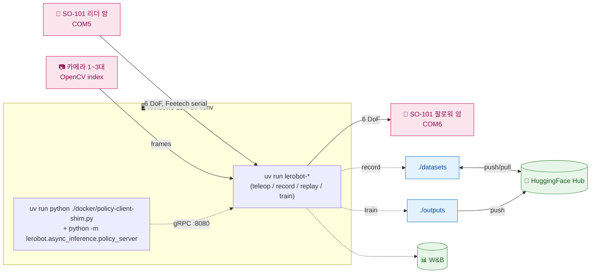

# 경로 A — Windows native + uv (실기기)

> [← README](../README.md) · 관련: [경로 B (Docker)](PATH_B_DOCKER.md) · [경로 C (Isaac Lab 시뮬)](PATH_C_ISAAC_SIM.md) · [트러블슈팅](TROUBLESHOOTING.md)

WSL2 / Docker / usbipd 를 거치지 않고 호스트 Windows 의 uv venv 에서 직접 `lerobot-*` CLI 를 호출한다. 직렬 포트는 `COMx`, 카메라는 OpenCV index. **빠른 반복·디버깅**에 유리한 경로.

> 사전 준비(인증, GPU/CUDA 설치 확인)는 [README §공통 준비](../README.md#공통-준비) 참고.

## 목차 <!-- omit in toc -->

- [1. 아키텍처](#1-아키텍처)
- [2. 한 번만 준비](#2-한-번만-준비)
- [3. 장치 확인과 세션 변수](#3-장치-확인과-세션-변수)
- [4. 모터 설정과 보정](#4-모터-설정과-보정)
- [5. Teleoperation 과 데이터셋](#5-teleoperation-과-데이터셋)
- [6. SmolVLA 모델 준비와 학습](#6-smolvla-모델-준비와-학습)
- [7. Async policy server / client](#7-async-policy-server--client)
- [8. 빠른 점검 순서](#8-빠른-점검-순서)
- [부록. Docker mode 대응표](#부록-docker-mode-대응표)

---

## 1. 아키텍처



> Isaac Sim / LeIsaac 시뮬 의존성은 별도 (`isaac` 그룹). 경로 A 에는 포함하지 않는다 — [경로 C](PATH_C_ISAAC_SIM.md) 참고.

---

## 2. 한 번만 준비

### uv 와 GPU 확인

```bash
uv --version
nvidia-smi
```

### Python 3.11 환경 동기화

실기기 + async client/server + SmolVLA 학습을 한 Windows venv 에 모두 설치:

```bash
uv python install 3.11
uv sync --python 3.11 --group teleop --group async --group policy --no-install-project
uv run lerobot-info
uv run python -c "import torch; print(torch.__version__, torch.cuda.is_available())"
```

학습을 안한다면 `policy` 그룹을 빼도 된다.

```bash
uv sync --python 3.11 --group teleop --group async --no-install-project
```

ABI 핀 보존을 위해 `uv lock --upgrade` 는 사용 금지.

---

## 3. 장치 확인과 세션 변수

### COM 포트와 카메라 찾기

```bash
uv run lerobot-find-port             # 인터랙티브: USB 분리 후 Enter
uv run lerobot-find-cameras opencv
```

`lerobot-find-cameras` 가 보여준 OpenCV index 는 재부팅·USB 재연결 뒤 바뀔 수 있다.

### 복사해서 바꿔 쓰는 Bash 변수

새 Git Bash 세션마다 먼저 실행하고 포트·카메라 index·HF 사용자명만 장비에 맞게 바꾼다.

```bash
mkdir -p ./datasets ./logs ./outputs

# ── Arm 직렬 포트 (Windows COM 포트) ──
TELEOP_PORT="COM5"
ROBOT_PORT="COM6"
TELEOP_ID="so101_teleop"
ROBOT_ID="so101_robot"
ROBOT_TYPE="so101_follower"
TELEOP_TYPE="so101_leader"

# ── 카메라 (OpenCV index) ──
TOP_CAM_PORT=0
WRIST_CAM_PORT=1
FRONT_CAM_PORT=2
CAM_WIDTH=640
CAM_HEIGHT=480
CAM_FPS=25
CAM_WARMUP_S=5
CAM_FOURCC="MJPG"

CAMERAS="{
    top: {type: opencv, index_or_path: ${TOP_CAM_PORT}, width: ${CAM_WIDTH}, height: ${CAM_HEIGHT}, fps: ${CAM_FPS}, fourcc: ${CAM_FOURCC}},
    wrist: {type: opencv, index_or_path: ${WRIST_CAM_PORT}, width: ${CAM_WIDTH}, height: ${CAM_HEIGHT}, fps: ${CAM_FPS}, fourcc: ${CAM_FOURCC}},
    front: {type: opencv, index_or_path: ${FRONT_CAM_PORT}, width: ${CAM_WIDTH}, height: ${CAM_HEIGHT}, fps: ${CAM_FPS}, fourcc: ${CAM_FOURCC}},
}"

# ── 태스크 / HuggingFace ──
SINGLE_TASK="pick the pen"
TASK="pick the pen"
HF_USER="your_hf_user"
HF_DATASET_REPO_ID="${HF_USER}/so101_pick_pen"
DATASET_ROOT="./datasets/so101_pick_pen"

# ── 정책 ──
POLICY_BASE_MODEL_PATH="lerobot/smolvla_base" # fine-tune 출발 모델
POLICY_REPO_ID="${HF_USER}/smolvla_pick_pen"  # fine-tune 결과 = 추론·배포 모델
# SmolVLA 는 LeRobot 체크포인트에서 출발 → TRAIN_POLICY_TYPE 비움 → --policy.path 사용.
# LeRobot 0.5.x parser 는 --policy.path 와 --policy.type 동시 지정을 거부한다.
TRAIN_POLICY_TYPE=
POLICY_TYPE=smolvla

# ── record ──
RECORD_FPS=30
EPISODE_TIME_S=60
RESET_TIME_S=10
NUM_EPISODES=10
PUSH_TO_HUB=true
EPISODE_INDEX=0

# ── train ──
TRAIN_STEPS=20000
BATCH_SIZE=8
JOB_NAME=smolvla_pick_pen
OUTPUT_DIR="./outputs/train/${JOB_NAME}"
NUM_WORKERS=4
WANDB_ENABLE=true
DEVICE=cuda

# ── policy server / client ──
POLICY_SERVER_HOST=127.0.0.1
POLICY_SERVER_PORT=8080
POLICY_SERVER_ADDRESS="${POLICY_SERVER_HOST}:${POLICY_SERVER_PORT}"
POLICY_FPS=30
INFERENCE_LATENCY=0.033
OBS_QUEUE_TIMEOUT=2
POLICY_DEVICE=cuda
CLIENT_DEVICE=cpu
ACTIONS_PER_CHUNK=50
CHUNK_SIZE_THRESHOLD=0.5
AGGREGATE_FN_NAME=weighted_average
POLICY_CLIENT_FPS=30

```

카메라 2개만 쓰려면 `CAMERAS` 에서 `front:` 줄을 제거하고 `FRONT_CAM_PORT` 를 주석 처리한다.

HF 캐시를 사용자 프로필 대신 저장소 아래에 모으려면:

```bash
export HF_HOME="$(pwd -W)/.cache/huggingface"
```

---

## 4. 모터 설정과 보정

각 arm 에 대해 필요한 시점에 한 번씩 실행.

```bash
# Follower
uv run lerobot-setup-motors \
    --robot.type="${ROBOT_TYPE}" \
    --robot.port="${ROBOT_PORT}"

# Leader
uv run lerobot-setup-motors \
    --teleop.type="${TELEOP_TYPE}" \
    --teleop.port="${TELEOP_PORT}"
```

캘리브레이션. `id` 는 이후 teleop / record / replay 에서 동일하게 유지.

```bash
# Follower
uv run lerobot-calibrate \
    --robot.type="${ROBOT_TYPE}" \
    --robot.port="${ROBOT_PORT}" \
    --robot.id="${ROBOT_ID}"

# Leader
uv run lerobot-calibrate \
    --teleop.type="${TELEOP_TYPE}" \
    --teleop.port="${TELEOP_PORT}" \
    --teleop.id="${TELEOP_ID}"
```

---

## 5. Teleoperation 과 데이터셋

### Teleoperation

```bash
uv run lerobot-teleoperate \
    --robot.type="${ROBOT_TYPE}" \
    --robot.port="${ROBOT_PORT}" \
    --robot.id="${ROBOT_ID}" \
    --robot.cameras="${CAMERAS}" \
    --teleop.type="${TELEOP_TYPE}" \
    --teleop.port="${TELEOP_PORT}" \
    --teleop.id="${TELEOP_ID}" \
    ${TELEOP_EXTRA_ARGS}
```

로컬 Rerun 뷰어를 띄우려면 `--display_data=true`. Docker 전용 `--display_ip=host.docker.internal` 은 native 에서 넣지 않는다.

### Record

```bash
uv run lerobot-record \
    --robot.type="${ROBOT_TYPE}" \
    --robot.port="${ROBOT_PORT}" \
    --robot.id="${ROBOT_ID}" \
    --robot.cameras="${CAMERAS}" \
    --teleop.type="${TELEOP_TYPE}" \
    --teleop.port="${TELEOP_PORT}" \
    --teleop.id="${TELEOP_ID}" \
    --dataset.repo_id="${HF_DATASET_REPO_ID}" \
    --dataset.single_task="${SINGLE_TASK}" \
    --dataset.root="${DATASET_ROOT}" \
    --dataset.fps=${RECORD_FPS} \
    --dataset.episode_time_s=${EPISODE_TIME_S} \
    --dataset.reset_time_s=${RESET_TIME_S} \
    --dataset.num_episodes=${NUM_EPISODES} \
    --dataset.push_to_hub=${PUSH_TO_HUB} \
    --play_sounds=false \
    ${RECORD_EXTRA_ARGS}
```

녹화 조작:

| 키 | 기능 |
|---|---|
| → | 현재 에피소드 조기 종료 |
| ← | 현재 에피소드 취소 후 다시 녹화 |
| ESC | 세션 종료 + 인코딩·업로드 |

이어서 수집할 때는 `--resume=true` 추가.

### Replay

```bash
uv run lerobot-replay \
    --robot.type="${ROBOT_TYPE}" \
    --robot.port="${ROBOT_PORT}" \
    --robot.id="${ROBOT_ID}" \
    --dataset.repo_id="${HF_DATASET_REPO_ID}" \
    --dataset.episode=${EPISODE_INDEX} \
    --dataset.root="${DATASET_ROOT}" \
    --dataset.fps=${RECORD_FPS} \
    --play_sounds=false
```

### Dataset viz · 편집

```bash
uv run lerobot-dataset-viz \
    --repo-id="${HF_DATASET_REPO_ID}" \
    --episode-index=${EPISODE_INDEX} \
    --root="${DATASET_ROOT}" \
    --mode=local
```

```bash
uv run lerobot-edit-dataset \
    --repo_id="${HF_DATASET_REPO_ID}" \
    --root="${DATASET_ROOT}" \
    --operation.type=delete_episodes \
    --operation.episode_indices=[${EPISODE_INDEX}]
```

### HuggingFace Hub 업로드

`lerobot-record --dataset.push_to_hub=false` 로 로컬에만 저장한 뒤 나중에 올리거나, 수동으로 재업로드할 때:

```bash
uv run hf upload "${HF_DATASET_REPO_ID}" "${DATASET_ROOT}" --repo-type=dataset
```

---

## 6. SmolVLA 모델 준비와 학습

### 모델 미리 받기

```bash
uv run hf download lerobot/smolvla_base
```

### Fine-tune

SO-101 카메라 키 (`top` / `wrist`) 가 들어간 데이터셋으로 fine-tune 한다. **`lerobot/smolvla_base` 의 config 가 입력 키로 `observation.images.camera1/2` 를 명시**하고 `--policy.path` 로 fine-tune 하면 이 키가 유지되므로(자동 rename 아님), 데이터셋 키를 camera1/2 로 매핑하는 `--rename_map` 이 **필수**다 (없으면 feature mismatch 로 학습 실패). 슬롯 순서는 SmolVLA 논문 표준(OBS_IMAGE 1=top, 2=wrist)에 맞춰 `top→camera1, wrist→camera2`. SmolVLA 는 카메라를 이름이 아닌 **입력 순서**로 구분하므로 학습 rename 순서와 추론 클라의 camera1/2 물리 매핑을 반드시 동일하게 유지한다([§7](#7-async-policy-server--client)). Windows A4000 은 작은 batch 부터:

```bash
export ACCELERATE_MIXED_PRECISION="bf16"

uv run lerobot-train \
    --dataset.repo_id="${HF_DATASET_REPO_ID}" \
    --dataset.root="${DATASET_ROOT}" \
    --policy.path="${POLICY_BASE_MODEL_PATH}" \
    --policy.repo_id="${POLICY_REPO_ID}" \
    --policy.push_to_hub=${PUSH_TO_HUB} \
    --policy.device=${DEVICE} \
    --output_dir="${OUTPUT_DIR}" \
    --steps=${TRAIN_STEPS} \
    --batch_size=${BATCH_SIZE} \
    --job_name=${JOB_NAME} \
    --num_workers=${NUM_WORKERS} \
    --wandb.enable=${WANDB_ENABLE} \
    --rename_map='{"observation.images.top":"observation.images.camera1","observation.images.wrist":"observation.images.camera2","observation.images.front":"observation.images.camera3"}'
```

> `--rename_map` 필수: `smolvla_base` 가 `camera1/2/3` 입력 키를 기대하므로 데이터셋 키(top/wrist/front)를 매핑한다(슬롯 순서=논문 표준). 추론 클라의 카메라 키 순서도 이와 동일하게 맞춘다([§7](#7-async-policy-server--client)).

W&B 미사용 시 `--wandb.enable=false`, Hub push 미사용 시 `--policy.push_to_hub=false`. Linux 학습 서버 (RTX PRO 5000 Blackwell 48 GB) 에서 멀티 GPU 가 필요하면 [경로 B](PATH_B_DOCKER.md) 의 docker 학습 또는 별도 Linux native 환경에서 `accelerate launch` 구성.

### 직접 추론 — `lerobot-record --policy.path=` (서버 없이)

학습된 정책을 **async 서버 없이** 곧바로 실기기에서 돌리는 가장 간단한 방법. 단일 프로세스가 로컬 GPU 에 모델을 로드해 팔로워를 구동하면서 에피소드를 기록한다(HuggingFace SmolVLA/GR00T 문서의 평가 방식). 리더 암은 불필요하므로 `--teleop.*` 를 생략한다.

```bash
uv run lerobot-record \
    --robot.type="${ROBOT_TYPE}" \
    --robot.port="${ROBOT_PORT}" \
    --robot.id="${ROBOT_ID}" \
    --robot.cameras="${CAMERAS}" \
    --dataset.single_task="${TASK}" \
    --dataset.repo_id="${HF_USER}/eval_pick_pen" \
    --dataset.num_episodes=10 \
    --dataset.episode_time_s=30 \
    --dataset.push_to_hub=false \
    --policy.path="${POLICY_REPO_ID}"   # fine-tune 결과 체크포인트
```

> 카메라 key 정합 주의: SmolVLA fine-tune 체크포인트는 `camera1/2/3` 입력 key 를 기대한다(§6 `rename_map`). 그 경우 `--robot.cameras` 의 key 를 `camera1/camera2/camera3` 로 바꾼다([§7](#7-async-policy-server--client) 클라 예시와 동일). GR00T 는 `top/wrist/front` 그대로.

### Eval

```bash
uv run lerobot-eval \
    --policy.path="${POLICY_REPO_ID}" \
    --env.type=pusht \
    --eval.n_episodes=20 \
    --eval.batch_size=10
```

---

## 7. Async policy server / client

### 로컬 policy server

서버를 loopback 에 bind:

```bash
uv run python -m lerobot.async_inference.policy_server \
    --host=${POLICY_SERVER_HOST} \
    --port=${POLICY_SERVER_PORT} \
    --fps=${POLICY_FPS} \
    --inference_latency=${INFERENCE_LATENCY} \
    --obs_queue_timeout=${OBS_QUEUE_TIMEOUT}
```

모델 종류와 체크포인트는 서버가 아니라 client 가 넘긴다.

### SO-101 policy client (shim 경유)

LeRobot 0.4.4 의 async `robot_client` 는 built-in SO follower config 등록 회귀가 있어 본 저장소의 shim 을 먼저 거친다.

> ⚠️ **카메라 키 정합**:
> - SmolVLA fine-tune 체크포인트는 `camera1/2/3` 키를 기대한다(위 §6 `rename_map`). 추론 클라의 `--robot.cameras` 키를 `camera1/camera2/camera3` 로 맞추고, 물리 매핑(`camera1=top, camera2=wrist, camera3=front`)에 따라 index 를 배치한다. 수집용 `CAMERAS`(top/wrist/front)를 그대로 넘기면 `KeyError: 'observation.images.camera1'` 로 추론이 실패한다.
> - GR00T N1.5 fine-tune 체크포인트는 `top/wrist/front` 키를 그대로 기대한다. `POLICY_TYPE=groot`, `POLICY_REPO_ID=taehunkim/so101_groot_n15_pick_pen`, `ACTIONS_PER_CHUNK=16` 과 함께 `--robot.cameras` 키도 `top/wrist/front` 로 둔다.
>
> 🖥️ **rerun viewer**: 명령 앞에 `DISPLAY_DATA=true` 를 붙이면 shim 이 control loop 의 관측(카메라·state)·액션을 rerun 에 로깅해 로컬 뷰어를 띄운다. 원격 송출은 `DISPLAY_IP`/`DISPLAY_PORT` 추가.

```bash
uv run python ./docker/policy-client-shim.py \
    --server_address=${POLICY_SERVER_ADDRESS} \
    --policy_type=${POLICY_TYPE} \
    --pretrained_name_or_path="${POLICY_REPO_ID}" \
    --policy_device=${POLICY_DEVICE} \
    --client_device=${CLIENT_DEVICE} \
    --task="${TASK}" \
    --actions_per_chunk=${ACTIONS_PER_CHUNK} \
    --chunk_size_threshold=${CHUNK_SIZE_THRESHOLD} \
    --aggregate_fn_name=${AGGREGATE_FN_NAME} \
    --fps=${POLICY_CLIENT_FPS} \
    --robot.type="${ROBOT_TYPE}" \
    --robot.port="${ROBOT_PORT}" \
    --robot.id="${ROBOT_ID}" \
    --robot.cameras="{
        camera1: {type: opencv, index_or_path: ${TOP_CAM_PORT}, width: ${CAM_WIDTH}, height: ${CAM_HEIGHT}, fps: ${CAM_FPS}, fourcc: ${CAM_FOURCC}},
        camera2: {type: opencv, index_or_path: ${WRIST_CAM_PORT}, width: ${CAM_WIDTH}, height: ${CAM_HEIGHT}, fps: ${CAM_FPS}, fourcc: ${CAM_FOURCC}},
        camera3: {type: opencv, index_or_path: ${FRONT_CAM_PORT}, width: ${CAM_WIDTH}, height: ${CAM_HEIGHT}, fps: ${CAM_FPS}, fourcc: ${CAM_FOURCC}},
    }"
```

원격 정책 서버는 `--server_address=<server-ip>:8080` 으로 변경. async server 는 pickle deserialization RCE 위험 (CVE-2026-25874) 이 있으니 SSH 터널·방화벽·mTLS 래퍼 등으로 신뢰 범위를 제한할 것.

GR00T N1.5 원격 서버에 붙는 최소 예:

```bash
export POLICY_SERVER_ADDRESS=<server_ip>:8080
export POLICY_TYPE=groot
export POLICY_REPO_ID=taehunkim/so101_groot_n15_pick_pen
export ACTIONS_PER_CHUNK=16

uv run python ./docker/policy-client-shim.py \
    --server_address=${POLICY_SERVER_ADDRESS} \
    --policy_type=${POLICY_TYPE} \
    --pretrained_name_or_path="${POLICY_REPO_ID}" \
    --policy_device=cuda \
    --client_device=cpu \
    --task="${TASK}" \
    --actions_per_chunk=${ACTIONS_PER_CHUNK} \
    --chunk_size_threshold=${CHUNK_SIZE_THRESHOLD} \
    --aggregate_fn_name=${AGGREGATE_FN_NAME} \
    --fps=${POLICY_CLIENT_FPS} \
    --robot.type="${ROBOT_TYPE}" \
    --robot.port="${ROBOT_PORT}" \
    --robot.id="${ROBOT_ID}" \
    --robot.cameras="{
        top: {type: opencv, index_or_path: ${TOP_CAM_PORT}, width: ${CAM_WIDTH}, height: ${CAM_HEIGHT}, fps: ${CAM_FPS}, fourcc: ${CAM_FOURCC}},
        wrist: {type: opencv, index_or_path: ${WRIST_CAM_PORT}, width: ${CAM_WIDTH}, height: ${CAM_HEIGHT}, fps: ${CAM_FPS}, fourcc: ${CAM_FOURCC}},
        front: {type: opencv, index_or_path: ${FRONT_CAM_PORT}, width: ${CAM_WIDTH}, height: ${CAM_HEIGHT}, fps: ${CAM_FPS}, fourcc: ${CAM_FOURCC}},
    }"
```

---

## 8. 빠른 점검 순서

처음 세팅한 PC 에서 실패 지점을 줄이는 권장 순서:

1. `uv run lerobot-info` + Torch CUDA 확인
2. `uv run lerobot-find-port`
3. `uv run lerobot-find-cameras opencv`
4. follower / leader `setup-motors`
5. follower / leader `calibrate`
6. `lerobot-teleoperate`
7. 1 episode `lerobot-record`
8. `lerobot-dataset-viz`
9. 필요 시 `lerobot-train` / policy server / policy client

---

## 부록. Docker mode 대응표

[경로 B](PATH_B_DOCKER.md) 의 Docker mode 와 본 경로의 native 명령 대응:

| Docker mode (경로 B) | Windows native (경로 A) |
|---|---|
| `lerobot find-port` | `uv run lerobot-find-port` |
| `lerobot find-cameras` | `uv run lerobot-find-cameras opencv` |
| `lerobot setup-motors` | `uv run lerobot-setup-motors ...` |
| `lerobot calibrate` | `uv run lerobot-calibrate ...` |
| `lerobot teleop` | `uv run lerobot-teleoperate ...` |
| `lerobot record` | `uv run lerobot-record ...` |
| `lerobot replay` | `uv run lerobot-replay ...` |
| `lerobot dataset-viz` | `uv run lerobot-dataset-viz ...` |
| `lerobot edit-dataset` | `uv run lerobot-edit-dataset ...` |
| `lerobot info` | `uv run lerobot-info` |
| `policy-server prepare-model` | `uv run hf download <repo_id>` |
| `policy-server train` | `uv run lerobot-train ...` |
| `policy-server eval` | `uv run lerobot-eval ...` |
| `policy-server policy-server` | `uv run python -m lerobot.async_inference.policy_server ...` |
| `lerobot policy-client` | `uv run python ./docker/policy-client-shim.py ...` |
