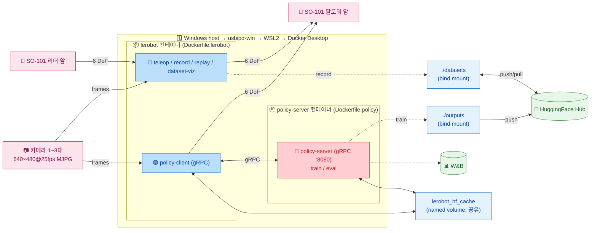

# 경로 B — Docker 컨테이너 (실기기)

> [← README](../README.md) · 관련: [경로 A (Windows native)](PATH_A_NATIVE.md) · [경로 C (Isaac Lab 시뮬)](PATH_C_ISAAC_SIM.md) · [원격 텔레옵·수집](REMOTE_TELEOP_RECORD.md) · [트러블슈팅](TROUBLESHOOTING.md)

격리된 Docker 환경에서 실기기 워크플로를 실행한다. Linux 학습 서버 배포와 async inference policy server 분리에 적합한 경로. Windows host → usbipd-win → WSL2 → Docker Desktop 경유로 USB 장치를 전달한다.

> 사전 준비(인증, `.env` 작성, Docker/usbipd 설치 확인)는 [README §공통 준비](../README.md#공통-준비) 참고. native 명령과의 대응은 [경로 A 부록](PATH_A_NATIVE.md#부록-docker-mode-대응표).

## 목차 <!-- omit in toc -->

- [1. 아키텍처](#1-아키텍처)
- [2. Docker 이미지 빌드](#2-docker-이미지-빌드)
- [3. (WSL) USB 포트 연결](#3-wsl-usb-포트-연결)
- [4. Entrypoint 모드 일람](#4-entrypoint-모드-일람)
- [5. SO-101 Motor Setup / Calibration](#5-so-101-motor-setup--calibration)
- [6. Teleoperation](#6-teleoperation)
- [7. 데이터셋 녹화 / 재실행 / 시각화](#7-데이터셋-녹화--재실행--시각화)
- [8. 모델 가중치 준비](#8-모델-가중치-준비)
- [9. Policy 학습](#9-policy-학습)
- [10. Policy 평가 및 추론](#10-policy-평가-및-추론)
- [11. Async Inference Policy Server (SmolVLA / GR00T)](#11-async-inference-policy-server-smolvla--gr00t)
- [12. Fine-tune 워크플로 (pick\_pen)](#12-fine-tune-워크플로-pick_pen)

---

## 1. 아키텍처



핵심:

- **서비스별 진입점 분리**: `lerobot-entrypoint.sh` 는 `lerobot` 서비스(로봇 직결 워크플로) 의 모드 디스패처, `policy-entrypoint.sh` 는 `policy-server` 서비스(추론 서버) 의 모드 디스패처. 각 스크립트의 첫 인자가 모드를 결정한다.
- **이미지 분리**: SmolVLA / GR00T 추론과 학습 관련 의존성은 정책 서버 이미지에 격리한다.
- **HF 캐시 공유**: 명명 볼륨 `lerobot_hf_cache` 가 두 컨테이너의 `/workspace/.cache/huggingface` (HF_HOME) 에 마운트되어 한 번 받은 모델을 양쪽이 모두 사용.

---

## 2. Docker 이미지 빌드

| 이미지 | Dockerfile | 의존성 그룹 | 사용 서비스 |
|---|---|---|---|
| `lerobot-so101:0.4.4` | `docker/Dockerfile.lerobot` | `teleop` (lerobot[feetech] + evdev) | `lerobot` (teleop / record / replay / policy-client / dataset-viz / ...) |
| `policy-server:0.5.1` | `docker/Dockerfile.policy` | lerobot 0.5.1 `[smolvla,async]` + GR00T 보조 deps (flash-attn 포함) — `uv pip install` 직접 명세, `pyproject.toml` 과 독립 | `policy-server` (async inference / train / eval) |

```bash
# teleop / record / replay 용 이미지
docker compose -f docker/docker-compose.yaml build lerobot

# Async inference policy server 용 이미지
docker compose -f docker/docker-compose.yaml build policy-server
```

---

## 3. (WSL) USB 포트 연결

SO-101 Leader Arm / Follower Arm / 카메라를 PC 에 연결한 뒤, 관리자 PowerShell 에서 usbipd 로 포트 바인딩.

```powershell
# 포트 목록 조회
usbipd list
# 최초 1회만 실행
usbipd bind --busid <leader-port>
usbipd bind --busid <follower-port>
usbipd bind --busid <wrist-cam-port>
usbipd bind --busid <front-cam-port>
# usb 재연결할 때마다 / WSL 리부트할 때마다 실행
usbipd attach --wsl --busid <leader-port>
usbipd attach --wsl --busid <follower-port>
usbipd attach --wsl --busid <wrist-cam-port>
usbipd attach --wsl --busid <front-cam-port>
# Windows로 포트를 되돌릴 경우
usbipd detach --busid <port>
```

WSL 안에서 디바이스 권한 설정:

```bash
# Leader Arm, Follower Arm USB
sudo chmod 666 /dev/ttyACM0 /dev/ttyACM1
# Wrist Cam, Front Cam
sudo chmod 666 /dev/video0 /dev/video2
sudo usermod -aG dialout $USER
```

---

## 4. Entrypoint 모드 일람

각 서비스는 별도 진입점을 사용한다.

### `lerobot` 서비스 — 로봇 직결 워크플로 (`lerobot-entrypoint.sh`)

```bash
docker compose --env-file .env -f docker/docker-compose.yaml run --rm lerobot <mode> [args...]
```

| 모드 | 설명 | 필요 하드웨어 | 핵심 env var |
|---|---|---|---|
| `teleop` | 리더→팔로워 실시간 원격 조작 | Leader + Follower + 카메라 | `TELEOP_PORT`, `ROBOT_PORT`, `*_CAM_PORT`, `CAM_*` |
| `record` | 텔레옵 기반 데이터셋 수집 | Leader + Follower + 카메라 | `HF_DATASET_REPO_ID`, `SINGLE_TASK`, `NUM_EPISODES`, `EPISODE_TIME_S`, `RESET_TIME_S`, `RECORD_FPS`, `PUSH_TO_HUB` |
| `replay` | 녹화 에피소드를 팔로워에 재실행 | Follower only | `HF_DATASET_REPO_ID`, `EPISODE_INDEX` |
| `calibrate` | 리더 또는 팔로워 영점 보정 | 한쪽만 | `CALIBRATE_TARGET` (`robot` \| `teleop`) |
| `setup-motors` | Feetech 모터 ID/Baud 초기 설정 | 한쪽만 | `CALIBRATE_TARGET` |
| `find-cameras` | 시스템 카메라 자동 검출 | - | 위치 인자: `opencv` \| `realsense` |
| `find-port` | 직렬 포트 자동 감지 (인터랙티브) | - | - |
| `dataset-viz` | Rerun 기반 데이터셋 시각화 | - | `HF_DATASET_REPO_ID`, `EPISODE_INDEX`, `VIZ_MODE`, `VIZ_WS_PORT` |
| `policy-client` | 정책 서버에 gRPC 로 붙어 follower arm 구동 | Follower + 카메라 | `POLICY_SERVER_ADDRESS`, `POLICY_TYPE`, `POLICY_REPO_ID`, `POLICY_DEVICE`, `TASK`, `ACTIONS_PER_CHUNK`, `CHUNK_SIZE_THRESHOLD`, `POLICY_CLIENT_FPS` |
| `edit-dataset` | 데이터셋 편집 (인자 완전 위임) | - | CLI 인자로 직접 전달 |
| `info` | LeRobot / Python / 시스템 정보 | - | - |
| `bash` \| `shell` | 컨테이너 인터랙티브 쉘 | - | - |
| `python <args>` | 컨테이너 내 Python 실행 | - | - |

### `policy-server` 서비스 — Async inference 서버 (`policy-entrypoint.sh`)

```bash
docker compose --env-file .env -f docker/docker-compose.yaml run --rm policy-server <mode> [args...]
# 또는 (CMD 기본값 = policy-server 로 즉시 서버 기동):
docker compose --env-file .env -f docker/docker-compose.yaml up -d policy-server
```

| 모드 | 설명 | 필요 하드웨어 | 핵심 env var |
|---|---|---|---|
| `prepare-model` | 호스트 HF 캐시에 모델 가중치 다운로드 | - | `POLICY_REPO_ID`(기본 대상), `MODEL_REVISION`, `PREPARE_MODEL_EXTRA_ARGS` |
| `policy-server` | 표준 Async inference gRPC 서버 (RTC 없음) | GPU 권장 | `POLICY_SERVER_HOST`, `POLICY_SERVER_PORT`, `POLICY_FPS`, `INFERENCE_LATENCY`, `OBS_QUEUE_TIMEOUT` |
| `policy-server-rtc` | RTC 통합 서버 (**compose 기본 CMD**). flow-matching 정책에 guidance 적용, GR00T 는 표준으로 fallback | GPU 권장 | 위 + `RTC_EXECUTION_HORIZON`, `RTC_MAX_GUIDANCE_WEIGHT`, `RTC_PREFIX_ATTENTION_SCHEDULE` |
| `train` | Policy 학습 (SmolVLA / GR00T — `.env` §1 + CLI 위임) | GPU 권장 | `.env` §1 모델 블록 + §5 학습 변수 |
| `eval` | Policy 평가/롤아웃 (인자 완전 위임) | GPU 권장 | CLI 인자로 직접 전달 |
| `info` | LeRobot / Python / 시스템 정보 | - | - |
| `bash` \| `shell` | 컨테이너 인터랙티브 쉘 | - | - |
| `python <args>` | 컨테이너 내 Python 실행 | - | - |

---

## 5. SO-101 Motor Setup / Calibration

`.env` 의 다음 값을 채우고 실행:

| 이름 | 설명 |
|---|-----|
| CALIBRATE_TARGET | `robot`: 팔로워 모터/보정, `teleop`: 리더 모터/보정 |
| TELEOP_PORT / TELEOP_ID | 리더 암 포트 + ID |
| ROBOT_PORT / ROBOT_ID | 팔로워 암 포트 + ID |

```bash
# CALIBRATE_TARGET=robot / teleop 각각 1회
docker compose --env-file .env -f docker/docker-compose.yaml run --rm lerobot setup-motors
docker compose --env-file .env -f docker/docker-compose.yaml run --rm lerobot calibrate
```

---

## 6. Teleoperation

`--display_data=true` 사용 시 호스트에서 사전 실행: `pip install rerun-sdk==0.26.2; rerun`.

| 이름 | 설명 |
|-----|------|
| ENABLED_CAMERAS | 활성 카메라 부분집합. 기본 `wrist,front`. 3개 운영 시 `wrist,front,top` |
| FRONT_CAM_PORT / WRIST_CAM_PORT / TOP_CAM_PORT | 카메라 포트 (`/dev/video*`) |
| CAM_WIDTH / CAM_HEIGHT / CAM_FPS / CAM_FOURCC | 카메라 해상도·FPS·fourcc |
| DISPLAY_DATA | 데이터 시각화 여부 |
| DISPLAY_IP / DISPLAY_PORT | Docker 송출 시 `host.docker.internal:9876` |
| TELEOP_EXTRA_ARGS | 기타 인자 |

```bash
docker compose --env-file .env -f docker/docker-compose.yaml run --rm lerobot teleop
```

---

## 7. 데이터셋 녹화 / 재실행 / 시각화

### 녹화 (`record`)

| 이름 | 설명 |
|-----|------|
| SINGLE_TASK | 에피소드 작업 설명 (snake_case) |
| HF_DATASET_REPO_ID | HF Hub 데이터셋 ID, 기본 `${HF_USER}/${SINGLE_TASK}` |
| NUM_EPISODES / EPISODE_TIME_S / RESET_TIME_S | 수집 파라미터 |
| RECORD_FPS | 데이터셋 저장 FPS |
| PUSH_TO_HUB | HF 업로드 여부 |
| DATASET_ROOT | 컨테이너 내 저장 경로 (`/workspace/datasets` 마운트) |
| RECORD_EXTRA_ARGS | 기타 인자 |

키보드 조작 (→ 조기 종료 / ← 재녹화 / ESC 세션 종료 + 인코딩·업로드).

```bash
docker compose --env-file .env -f docker/docker-compose.yaml run --rm lerobot record
```

### 재실행 (`replay`)

팔로워 직렬 포트만 있으면 동작.

```bash
docker compose --env-file .env -f docker/docker-compose.yaml run --rm lerobot replay
```

### 시각화 (`dataset-viz`)

`VIZ_MODE=local` 컨테이너 내부 뷰어 / `VIZ_MODE=distant` WebSocket 서버 (호스트에서 `rerun ws://localhost:${VIZ_WS_PORT}` 접속).

```bash
docker compose --env-file .env -f docker/docker-compose.yaml run --rm lerobot dataset-viz
```

### 진단 유틸리티

```bash
docker compose --env-file .env -f docker/docker-compose.yaml run --rm lerobot find-port
docker compose --env-file .env -f docker/docker-compose.yaml run --rm lerobot find-cameras opencv
docker compose --env-file .env -f docker/docker-compose.yaml run --rm lerobot find-joint-limits
docker compose --env-file .env -f docker/docker-compose.yaml run --rm lerobot info
docker compose --env-file .env -f docker/docker-compose.yaml run --rm lerobot bash
```

---

## 8. 모델 가중치 준비

HF 캐시는 명명 볼륨 `lerobot_hf_cache` 가 두 컨테이너의 `/workspace/.cache/huggingface` (HF_HOME) 에 마운트된다. 두 서비스가 동일 볼륨을 공유하므로 한 번 받은 모델을 양쪽이 모두 사용.

```bash
# POLICY_REPO_ID(배포·추론 모델) 로 다운로드. 베이스 등은 위치 인자로 덮어쓰기
docker compose --env-file .env -f docker/docker-compose.yaml run --rm policy-server prepare-model

# 위치 인자로 다른 모델 받기
docker compose --env-file .env -f docker/docker-compose.yaml run --rm policy-server prepare-model nvidia/GR00T-N1.5-3B
```

GR00T N1.5 fine-tune 모델은 결과 checkpoint, NVIDIA 베이스, Eagle tokenizer asset 을 모두 미리 받아두면 첫 client 접속 때 model load 지연을 줄일 수 있다.

```bash
docker compose --env-file .env -f docker/docker-compose.yaml run --rm policy-server prepare-model taehunkim/so101_groot_n15_pick_pen
docker compose --env-file .env -f docker/docker-compose.yaml run --rm policy-server prepare-model nvidia/GR00T-N1.5-3B
docker compose --env-file .env -f docker/docker-compose.yaml run --rm policy-server prepare-model lerobot/eagle2hg-processor-groot-n1p5
```

다른 머신으로 캐시를 옮기려면 (명명 볼륨 특성상 rsync 불가, tarball 경유):

```bash
# 출발지: 명명 볼륨 tarball 추출
docker run --rm -v lerobot_hf_cache:/cache -v "$(pwd)":/out alpine \
    tar czf /out/hf_cache.tar.gz -C /cache .
rsync -av --progress hf_cache.tar.gz user@target-server:/tmp/

# 도착지: 빈 볼륨에 import
docker volume create lerobot_hf_cache
docker run --rm -v lerobot_hf_cache:/cache -v /tmp:/in alpine \
    tar xzf /in/hf_cache.tar.gz -C /cache
```

---

## 9. Policy 학습

`.env` 의 학습 파라미터:

| 이름 | 설명 |
|-----|------|
| HF_DATASET_REPO_ID / DATASET_ROOT | 학습 데이터셋 위치 |
| TRAIN_POLICY_TYPE / POLICY_BASE_MODEL_PATH / POLICY_REPO_ID | 정책 타입(비우면 체크포인트 출발)·fine-tune 출발 모델(타입 비움→`--policy.path`, 설정→`--policy.base_model_path`)·결과 push 겸 추론 모델(`--policy.repo_id`) |
| JOB_NAME / BATCH_SIZE / TRAIN_STEPS / OUTPUT_DIR / DEVICE | 일반 학습 인자 |
| WANDB_ENABLE | W&B 연동 |
| DATASET_VIDEO_BACKEND / POLICY_VIDEO_BACKEND / TRAIN_EXTRA_ARGS | LeRobot 0.5.1 비디오 디코더(`torchcodec`/`pyav`/`video_reader`)와 추가 `lerobot-train` 인자 |
| **학습 속도 최적화** | |
| NUM_WORKERS | 데이터로더 워커 수 (기본 8) |
| COMPILE_MODEL / COMPILE_MODE | `torch.compile` 활성화 (10K+ steps 에서 ~20–30% 향상, 첫 스텝 컴파일 비용). GR00T(`TRAIN_POLICY_TYPE=groot`)는 compile_model config 필드가 없어 entrypoint 가 자동으로 건너뜀 |
| NUM_PROCESSES | 사용 GPU 수. 2+ 지정 시 `accelerate launch --num_processes` DDP 자동 전환 |
| MIXED_PRECISION | 혼합 정밀도 (기본 `bf16`, Ampere+ 권장. 구형 GPU `fp16`) |

**호출 컨테이너는 `policy-server`** — Dockerfile.policy 에만 transformers / accelerate / num2words / GR00T 의존성이 설치됨 (lerobot 이미지에서 정책 학습 불가).

```bash
docker compose --env-file .env -f docker/docker-compose.yaml run --rm policy-server train
```

추가 인자는 env var 빌드 값 뒤에 붙어 last-wins 로 덮어쓴다:

```bash
docker compose --env-file .env -f docker/docker-compose.yaml run --rm policy-server train --resume=true
docker compose --env-file .env -f docker/docker-compose.yaml run --rm policy-server train --steps=5000
```

> **모델 종류는 `.env` 의 `POLICY_PROFILE` 한 줄로 결정**한다 (`groot` | `smolvla` | ...). 모델별 값은 `env/<name>.env` 프로필에 있고 compose 가 자동으로 겹쳐 주입하며, train 이 이를 `--policy.*` 인자로 매핑한다 (위 표의 변수 출처). 아래 명령은 모델과 무관하게 동일하다.

먼저 100-step smoke 로 모델 생성·dataset decode·첫 checkpoint 저장까지 확인한다. 성공하면 full 학습을 시작한다.

```bash
JOB="smoke_groot_n15_pick_pen_100_$(date +%Y%m%d_%H%M%S)"
docker compose --env-file .env -f docker/docker-compose.yaml run --rm \
    -e JOB_NAME="${JOB}" \
    -e OUTPUT_DIR="outputs/train/${JOB}" \
    -e TRAIN_STEPS=100 \
    -e BATCH_SIZE=16 \
    -e WANDB_ENABLE=false \
    policy-server train \
      --save_freq=100 \
      --policy.push_to_hub=false

jq -r .type "outputs/train/${JOB}/checkpoints/000100/pretrained_model/config.json"
```

Full run:

```bash
docker compose --env-file .env -f docker/docker-compose.yaml run --rm policy-server train \
    --save_freq=1000 \
    --policy.push_to_hub=true
```

RTX PRO 5000 Blackwell 48 GB 기준 `BATCH_SIZE=16`, `MIXED_PRECISION=bf16` 로 GR00T N1.5 10K step 학습이 정상 완료됐다.

---

## 10. Policy 평가 및 추론

실기기 추론은 **두 가지 방식**이 있다. 둘 다 같은 fine-tune 체크포인트를 쓴다.

| 방식 | 명령 | 특징 | 언제 |
|---|---|---|---|
| **A. 직접 (서버 없이)** | `lerobot record --policy.path=<model>` | 단일 프로세스가 로컬 GPU 에 모델을 직접 로드해 추론+팔로워 구동+에피소드 기록 | 로컬 GPU 로 충분, 간단히 평가 (HuggingFace 공식 평가 방식) |
| **B. async 서버 경유** | `policy-server` + `policy-client` | 추론을 별도(원격) 서버에 위임, RTC guidance 가능 | 원격 GPU 추론, 저지연/RTC 필요 ([§11](#11-async-inference-policy-server-smolvla--gr00t)) |

### A. 직접 추론 — `lerobot record --policy.path=` (서버 미경유)

학습된 정책으로 팔로워를 구동하면서 에피소드를 기록한다. **별도 서버 불필요.** HuggingFace SmolVLA / GR00T 문서가 권장하는 평가 방식이다. `record` 모드는 추가 CLI 인자를 그대로 `lerobot-record` 로 forward 하므로 `--policy.path` 를 덧붙이면 된다.

```bash
docker compose --env-file .env -f docker/docker-compose.yaml run --rm lerobot record \
    --robot.type=so101_follower \
    --robot.port=${ROBOT_PORT} \
    --robot.cameras="{
        wrist: {type: opencv, index_or_path: ${WRIST_CAM_PORT}, width: ${CAM_WIDTH}, height: ${CAM_HEIGHT}, fps: ${CAM_FPS}, warmup_s: ${CAM_WARMUP_S}, fourcc: ${CAM_FOURCC}},
        front: {type: opencv, index_or_path: ${FRONT_CAM_PORT}, width: ${CAM_WIDTH}, height: ${CAM_HEIGHT}, fps: ${CAM_FPS}, warmup_s: ${CAM_WARMUP_S}, fourcc: ${CAM_FOURCC}},
        }" \
    --robot.id=${ROBOT_ID} \
    --dataset.single_task="pick up the pen and place it in the holder" \
    --dataset.repo_id=${HF_USER}/eval_pick_pen \
    --dataset.num_episodes=10 \
    --dataset.episode_time_s=30 \
    --dataset.push_to_hub=false \
    --policy.path=lerobot/smolvla_base   # ← 평가할 체크포인트 (예: HF_USER/so101_smolvla_pick_pen)
```

- **leader 불필요**: 정책이 팔로워를 구동하므로 리더 암 없이 동작한다 (위에서 `--teleop.*` 생략). 단 docker `record` 모드는 leader 포트 점검 경고를 띄울 수 있다 — 리더 미연결 평가는 native 경로([PATH_A §6](PATH_A_NATIVE.md#6-smolvla-모델-준비와-학습))가 더 깔끔하다.
- **모델 지정**: 위처럼 `--policy.path=` 를 직접 적거나, 셸에서 `--policy.path=$(grep …)` 대신 그냥 리포 ID 를 그대로 쓴다. (`.env` 의 `${POLICY_REPO_ID}` 는 컨테이너 안에서만 채워지므로 호스트 셸의 `${POLICY_REPO_ID}` 보간에 의존하지 말 것.)
- **카메라 key**: SmolVLA fine-tune 은 `camera1/2/3`, GR00T 는 `wrist/front/top` ([§12](#12-fine-tune-워크플로-pick_pen)).

**시뮬 평가** — `eval` 모드는 `lerobot-eval` 에 인자 완전 위임:

```bash
docker compose --env-file .env -f docker/docker-compose.yaml run --rm policy-server eval \
    --policy.path=${POLICY_REPO_ID} \
    --env.type=pusht \
    --eval.n_episodes=20 \
    --eval.batch_size=10
```

---

## 11. Async Inference Policy Server (SmolVLA / GR00T)

compose 기본 command 는 `policy-server-rtc` (async + RTC). `lerobot.async_inference.policy_server` 계열을 gRPC :8080 으로 띄운다. 서버는 policy-agnostic — 모델 종류·checkpoint·device 는 **클라이언트** 가 `SendPolicyInstructions` RPC 로 주입한다.

모델 종류(`POLICY_TYPE`)와 추론 모델(`POLICY_REPO_ID` / `ACTIONS_PER_CHUNK`)은 **`.env` 의 `POLICY_PROFILE`** 가 고르는 `env/<name>.env` 프로필에서 온다. 서버·클라 양쪽 `.env` 의 `POLICY_PROFILE` 을 같은 값으로 맞춘다.

| 이름 | 설명 |
|---|---|
| POLICY_SERVER_HOST | bind 주소 (기본 `0.0.0.0`) |
| POLICY_SERVER_PORT | gRPC 포트 (기본 `8080`) |
| POLICY_FPS | 컨트롤 루프 FPS (기본 `30`) |
| INFERENCE_LATENCY | 목표 추론 latency 초 (기본 `0.033`) |
| OBS_QUEUE_TIMEOUT | 관측 큐 timeout 초 (기본 `2`) |
| POLICY_SERVER_EXTRA_ARGS | 추가 인자 |

### 서버 기동

원격 학습 서버에서 실행:

```bash
cd ~/Workspaces/SO101-Sim2Real

# 모델 사전 캐시. 첫 client 접속 지연 감소.
docker compose --env-file .env -f docker/docker-compose.yaml run --rm policy-server prepare-model ${POLICY_REPO_ID}

# 표준 async inference server. GR00T 는 RTC 미지원이므로 policy-server-rtc 대신 이것을 사용.
docker compose --env-file .env -f docker/docker-compose.yaml up -d policy-server

docker compose --env-file .env -f docker/docker-compose.yaml logs -f policy-server
```

컨테이너를 이름 고정으로 직접 띄우려면:

```bash
docker rm -f so101-groot-n15-policy-server 2>/dev/null || true
docker compose --env-file .env -f docker/docker-compose.yaml run --rm \
    --name so101-groot-n15-policy-server \
    policy-server policy-server
```

확인:

```bash
docker ps --filter name=policy-server
ss -ltnp | grep ':8080'
```

> GR00T 는 현재 `policy-server-rtc` 에서 RTC guidance 가 적용되지 않는다. `GrootPolicy` 가 `init_rtc_processor` 를 지원하지 않아 표준 추론으로 fallback 된다. 불필요한 per-chunk 분기와 로그를 피하려면 `policy-server` 를 쓴다.

### 클라이언트 연결

클라이언트는 Windows/WSL 워크스테이션의 `lerobot` 서비스 `policy-client` 모드. `.env` 의 `POLICY_*` / `TASK` / `ROBOT_*` / `*_CAM_*` 변수가 robot_client CLI 인자로 자동 매핑된다.

```bash
docker compose --env-file .env -f docker/docker-compose.yaml run --rm lerobot policy-client
```

원격 학습 서버의 정책 서버에 붙으려면 `POLICY_SERVER_ADDRESS` 를 서버 주소로 덮어쓴다.

```bash
POLICY_SERVER_ADDRESS=<server_ip>:8080 \
    docker compose --env-file .env -f docker/docker-compose.yaml run --rm lerobot policy-client
```

GR00T N1.5용 `.env` 클라이언트 값:

```dotenv
POLICY_SERVER_ADDRESS=<server_ip>:8080
POLICY_TYPE=groot
POLICY_REPO_ID=taehunkim/so101_groot_n15_pick_pen
POLICY_DEVICE=cuda
CLIENT_DEVICE=cpu
TASK="pick up the pen and place it in the holder"
ACTIONS_PER_CHUNK=16
CHUNK_SIZE_THRESHOLD=0.5
AGGREGATE_FN_NAME=weighted_average
POLICY_CLIENT_FPS=30
```

GR00T fine-tune checkpoint 의 input key 는 `observation.images.wrist/front/top` 이다. 클라이언트 카메라 key 도 `wrist/front/top` 를 그대로 사용한다. SmolVLA fine-tune 은 `camera1/2/3` 를 기대하므로 정책별로 카메라 key 를 혼동하지 않는다.

보안상 직접 포트 노출을 피하려면 SSH 터널을 사용한다.

```bash
# 로컬 PC 터미널 1
ssh -N -L 8080:127.0.0.1:8080 <server>

# 로컬 PC 터미널 2
POLICY_SERVER_ADDRESS=127.0.0.1:8080 \
    docker compose --env-file .env -f docker/docker-compose.yaml run --rm lerobot policy-client
```

**주의사항**

- **SmolVLA 베이스**: `lerobot/smolvla_base` 는 SO-101 에 미학습 → 액션 품질 무작위에 가까움. 일차 목적은 **파이프라인 검증** (gRPC 송수신, 카메라/state 매핑, action chunk 적용).
- **초기 로딩**: 첫 호출 시 VLM 백본/GR00T 베이스가 자동 다운로드될 수 있다. `prepare-model ${POLICY_REPO_ID}` 와 필요한 베이스 모델을 미리 받아두면 즉시 로드.
- **보안**: pickle deserialization RCE 위험 (CVE-2026-25874). 본 구성은 같은 호스트 loopback 한정. 외부 노출 시 SSH 터널 / mTLS 래퍼 / 방화벽 추가.
- **카메라 키 매핑**: 체크포인트 `input_features` 키와 클라이언트가 보내는 카메라 키가 정확히 일치해야 함. base 모델 직결 시 `KeyError: 'observation.images.wrist'` — fine-tune 정공법으로 해결 ([§12](#12-fine-tune-워크플로-pick_pen)).

---

## 12. Fine-tune 워크플로 (pick_pen)

앞 단계(2~11)를 엮은 end-to-end 시나리오.

- **SmolVLA**: backbone canonical 입력 키가 `camera1/2/3` 이다. SO-101 데이터셋(`wrist/front/top`)으로 fine-tune 하면 lerobot 이 `rename_map`(`wrist→camera1, front→camera2, top→camera3`)을 자동 생성하고, 결과 체크포인트의 `input_features` 는 `camera1/camera2/camera3` 가 된다. 추론 클라이언트 카메라 key 도 `camera1/2/3` 로 맞춘다.
- **GR00T N1.5**: fine-tune 결과 checkpoint 의 `input_features` 는 `observation.images.wrist/front/top` 그대로다. 추론 클라이언트도 `wrist/front/top` key 를 그대로 쓴다. GR00T action horizon 은 16 이므로 `POLICY_CHUNK_SIZE=16`, `POLICY_N_ACTION_STEPS=16`, `ACTIONS_PER_CHUNK=16` 을 맞춘다.

**1) 데이터셋 수집** (Windows 워크스테이션 `lerobot` 컨테이너):

```bash
# .env: SINGLE_TASK="pick the pen", HF_DATASET_REPO_ID=${HF_USER}/so101_pick_pen,
#       NUM_EPISODES=50, EPISODE_TIME_S=30, PUSH_TO_HUB=true
docker compose --env-file .env -f docker/docker-compose.yaml run --rm lerobot record
```

- 카메라 키 `wrist`, `front`, `top` 으로 저장 (변경 불필요)
- `PUSH_TO_HUB=true` 면 학습 머신에서 HF Hub pull 가능
- 50+ 에피소드, 다양한 grasp pose / pen 위치로 시연

**2) 데이터셋 검증** (선택):

```bash
docker compose --env-file .env -f docker/docker-compose.yaml run --rm lerobot dataset-viz
```

**3) 학습 머신 선택**:

- **Linux 학습 서버** (RTX PRO 5000 Blackwell 48 GB, 권장 — 빠른 회전): 정책 서버 이미지만 빌드. 데이터셋은 HF Hub pull 또는 `rsync -av datasets/ user@<server>:/path/datasets/`
- **Windows A4000 (16 GB)** (느림, batch_size 4–8): 데이터셋 로컬

**4) Fine-tune 실행** (`policy-server` 컨테이너):

SmolVLA:

```bash
docker compose --env-file .env -f docker/docker-compose.yaml run --rm policy-server train \
    --policy.path=lerobot/smolvla_base \
    --policy.repo_id=${HF_USER}/smolvla_pick_pen \
    --policy.push_to_hub=true \
    --dataset.repo_id=${HF_DATASET_REPO_ID} \
    --dataset.root=${DATASET_ROOT} \
    --output_dir=${OUTPUT_DIR} \
    --steps=20000 \
    --batch_size=64 \
    --job_name=smolvla_pick_pen \
    --wandb.enable=true
```

GR00T N1.5:

```bash
# env/groot.env 프로필 핵심값 (POLICY_PROFILE=groot):
# TRAIN_POLICY_TYPE=groot
# POLICY_BASE_MODEL_PATH=nvidia/GR00T-N1.5-3B
# POLICY_TOKENIZER_ASSETS_REPO=lerobot/eagle2hg-processor-groot-n1p5
# POLICY_EMBODIMENT_TAG=new_embodiment
# POLICY_CHUNK_SIZE=16
# POLICY_N_ACTION_STEPS=16
# DATASET_VIDEO_BACKEND=torchcodec
# POLICY_REPO_ID=${HF_USER}/so101_groot_n15_pick_pen

# 100-step smoke
JOB="smoke_groot_n15_pick_pen_100_$(date +%Y%m%d_%H%M%S)"
docker compose --env-file .env -f docker/docker-compose.yaml run --rm \
    -e JOB_NAME="${JOB}" \
    -e OUTPUT_DIR="outputs/train/${JOB}" \
    -e TRAIN_STEPS=100 \
    -e BATCH_SIZE=16 \
    -e WANDB_ENABLE=false \
    policy-server train \
      --save_freq=100 \
      --policy.push_to_hub=false

jq -r .type "outputs/train/${JOB}/checkpoints/000100/pretrained_model/config.json"

# full run
docker compose --env-file .env -f docker/docker-compose.yaml run --rm policy-server train \
    --save_freq=1000 \
    --policy.push_to_hub=true
```

**5) 체크포인트 배포** (Windows 워크스테이션):

```bash
# .env 의 POLICY_REPO_ID=${HF_USER}/smolvla_pick_pen 또는 ${HF_USER}/so101_groot_n15_pick_pen
docker compose --env-file .env -f docker/docker-compose.yaml run --rm policy-server prepare-model ${POLICY_REPO_ID}
```

**6) 정책 서버 재기동 + 실기기 추론**:

```bash
docker compose --env-file .env -f docker/docker-compose.yaml up -d policy-server
docker compose --env-file .env -f docker/docker-compose.yaml run --rm lerobot policy-client
```

fine-tuned 체크포인트의 `input_features` 는 (SmolVLA rename 으로) `camera1/2/3` 다. 추론 클라의 카메라 키를 `camera1/camera2/camera3` 로 맞춘다 (물리 매핑 `camera1=wrist, camera2=front, camera3=top`). native 클라 예시는 [PATH_A §7](PATH_A_NATIVE.md#7-async-policy-server--client) 참고.

GR00T fine-tuned checkpoint 는 `wrist/front/top` key 를 그대로 기대한다. `POLICY_TYPE=groot`, `ACTIONS_PER_CHUNK=16`, `POLICY_REPO_ID=${HF_USER}/so101_groot_n15_pick_pen` 로 맞춘 뒤 같은 `policy-client` 모드를 사용한다.
