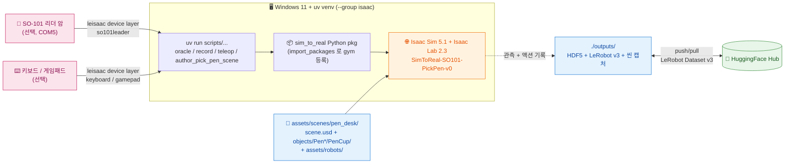

# 경로 C — Host uv (Isaac Lab 시뮬)

> [← README](../README.md) · 관련: [경로 A (Windows native)](PATH_A_NATIVE.md) · [경로 B (Docker)](PATH_B_DOCKER.md) · [OpenUSD 가이드](OpenUSD_Guide.md) · [트러블슈팅](TROUBLESHOOTING.md)

Isaac Sim 5.1 위 `SimToReal-SO101-PickPen-v0` Gym 환경에서 시뮬 teleop · 오라클 정책 · 데이터 수집을 수행한다. Docker 미연결 — RT 코어 GPU 가 있는 Windows 워크스테이션 또는 Linux 서버의 호스트 uv 환경에서 직접 실행한다.

> 사전 준비(인증)는 [README §공통 준비](../README.md#공통-준비) 참고.

## 목차 <!-- omit in toc -->

- [1. 아키텍처](#1-아키텍처)
- [2. 한 번만 준비](#2-한-번만-준비)
- [3. 디렉토리 구조 (시뮬 관련)](#3-디렉토리-구조-시뮬-관련)
- [4. 펜 씬 (Pen Scene)](#4-펜-씬-pen-scene)
- [5. 텔레오퍼레이션 및 레코드](#5-텔레오퍼레이션-및-레코드)

---

## 1. 아키텍처



핵심:

- 호스트 uv 환경에서 직접 실행. Docker 미연결 — RT 코어 GPU 가 있는 Windows 워크스테이션 또는 Linux 서버 필요.
- **H100 / A100 미지원**: RT 코어 부재로 카메라 raytracing pipeline 생성 실패 (자세히는 [`TROUBLESHOOTING.md`](TROUBLESHOOTING.md) §"카메라 sensor 가 raytracing pipeline 생성 실패").
- `import sim_to_real` 한 번에 monkey patch + Gym 환경 등록이 모두 일어남.

---

## 2. 한 번만 준비

```bash
uv sync --python 3.11 --group isaac --no-install-project
uv run python -c "import isaacsim; print('isaacsim', isaacsim.__version__)"
uv run python -c "import sim_to_real, gymnasium; print(gymnasium.spec('SimToReal-SO101-PickPen-v0'))"
```

`isaac` 그룹은 ~20 GB 다운로드 (Isaac Sim 5.1 extscache 포함). 처음 한 번만.

---

## 3. 디렉토리 구조 (시뮬 관련)

```
SO101-LeRobot-VLA/
├── assets/
│   ├── robots/                          # SO-101 follower USD + 편집용 URDF
│   ├── sample_calibrations/             # 샘플 .json 캘리브레이션
│   └── scenes/pen_desk/                 # 펜 Pick-and-Place 씬
│       ├── scene.usd / scene.usda       # 책상/매트/조명 + objects 참조 + 좌표
│       └── objects/
│           ├── PenWhite/PenWhite.usd
│           ├── PenGray/PenGray.usd
│           ├── PenBlack/PenBlack.usd
│           ├── PenBlue/PenBlue.usd
│           └── PenCup/PenCup.usd
├── scripts/                             # Isaac Lab 진입점 스크립트
│   └── environments/teleoperation/      # teleop_se3_agent / replay / so101_joint_state_server
└── src/sim_to_real/                     # 로컬 Python 패키지 (leisaac 미러 구조)
    ├── assets/scenes/pen_desk.py        # PEN_DESK_CFG (UsdFileCfg 래퍼)
    ├── tasks/                           # SimToReal-SO101-PickPen-v0 등록
    │   └── pick_pen/{pick_pen_env_cfg.py, mdp/{observations,terminations}.py}
    └── utils/                           # constant + domain_randomization (ellipse / arc)
```

| Gym ID | 정의 위치 | 진입점 |
|----|----------|--------|
| `SimToReal-SO101-PickPen-v0` | `sim_to_real.tasks.pick_pen.pick_pen_env_cfg:PickPenEnvCfg` | `isaaclab.envs.ManagerBasedRLEnv` |

---

## 4. 펜 씬 (Pen Scene)

**씬 파일:** `assets/scenes/pen_desk/scene.usd` (객체별 USD 는 `objects/` 하위 분리)

테이블탑 베이스 + 펜 4개 (rigid body) + 동적 펜 컵.

### 구성 요소

- 밝은 책상 + 어두운 데스크 매트 — `scene.usd` 직접 author
- 와이어 메시 펜 컵 — `objects/PenCup/PenCup.usd` payload 참조 (동적 rigid body)
- 펜 4개 (`PenWhite`, `PenGray`, `PenBlack`, `PenBlue`) — 각각 `objects/<Name>/<Name>.usd` payload 참조

### 구현 세부

- **객체 분리:** 펜 4개·펜컵을 self-contained USD 로 분리, `scene.usd` 에서 `prepend payload = @./objects/<Name>/<Name>.usd@` 참조. 각 객체 USD 는 자체 `Looks` Scope + 머티리얼을 포함해 다른 씬에서도 재사용 가능.
- **좌표 정합:** `scripts/author_pick_pen_scene.py` 의 `SCENE_OFFSET` 상수로 top-level translate 일괄 시프트. SO-101 follower `init_state.pos=(2.2, -0.61, 0.89)` 를 기준으로 책상 정면 모서리에 robot mount 가 클램프된 위치에 정렬.
- **펜 컵 동역학:** `PhysicsRigidBodyAPI` + `PhysicsMassAPI` (`mass=0.12 kg`, `linearDamping=0.6`, `angularDamping=4.0`, CCD on). 사용자가 밀면 움직이는 실제 펜통.
- **펜 콜라이더:** invisible Cube proxy 미사용. 각 visual primitive (Barrel Capsule / Grip · BackPlug Cylinder / Clip Cube) 에 `PhysicsCollisionAPI` + `PhysxCollisionAPI` 직접 부여 (`contactOffset=0.0015`, `restOffset=0`, torsional patch). `PenGripPhysics` 머티리얼 (`staticFriction=1.8`, `dynamicFriction=1.5`) binding. TipSleeve / Nib (Cone) 은 PhysX 의 analytic cone collision 부재로 시각 전용.
- **펜 / 펜통 영역 분리:** 펜은 그린 타원 (scene-local y ∈ [0.22, 0.26]), 펜통은 주황 호 (scene-local y ∈ [0.34, 0.40]). y 마진 ≥ 0.08 m 라 펜이 펜컵 안에 spawn 되는 케이스 원천 차단.
- **펜 초기 배치 + 랜덤화:** 펜 4개 default 는 그린 타원 4분면 분산 (yaw 차이 ≥ 35°). 매 reset 마다 `randomize_object_in_ellipse(x_radius=0.05, y_radius=0.02, yaw_range_deg=(-10,10))` jitter.
- **펜통 호 sampling:** default scene-local `(0, 0.40)` — robot scene-local y=-0.04 에서 0.44 m 정면. 매 reset 마다 `randomize_object_on_arc(radius=0.44, angle_range_deg=(-30,30))`. 양 끝 `(±0.22, 0.34)` 가 매트 안 + SO-101 reach 가장자리.
- **PenCup reset:** `parse_usd_and_create_subassets(..., specific_name_list=[*PEN_NAMES, PEN_CUP_NAME])` 로 env subasset 등록 → 매 `B`/`R` 리셋마다 author 한 초기 pose 새로 sampling.
- **데스크/매트 contact tuning:** `DeskTop`, `DeskMat` 에도 `PhysxCollisionAPI` 명시 (`contactOffset=0.0015`) — PhysX 디폴트 2 cm contact margin 으로 인한 관통·튀어오름 방지.

### 씬 재생성

```powershell
uv run scripts\author_pick_pen_scene.py
```

`.usda` 텍스트 → `pxr.Sdf.Layer.Export(args={"format":"usdc"})` 로 동일 prim layout 의 `.usd` (usdc) 생성. USD 포맷 참고: [`OpenUSD_Guide.md`](OpenUSD_Guide.md).

좌표 변경 시 같이 갱신:

- `src/sim_to_real/tasks/pick_pen/pick_pen_env_cfg.py::PEN_CUP_CENTER_XY` — `mdp.pen_in_cup` 의 컵 기준점 (world frame)
- 오라클 state machine 의 동일 상수 (`src/sim_to_real/datagen/state_machine/pick_pen.py`, 존재 시)

---

## 5. 텔레오퍼레이션 및 레코드

### 순수 Isaac Lab joint teleop + 카메라 튜닝

`scripts/environments/teleoperation/pick_pen_joint_teleop.py` 는 현재
`SimToReal-SO101-PickPen-v0`에 직접 6-dim joint-position action을 보내는
디버그용 GUI teleop이다. LeIsaac device layer를 쓰지 않으므로 카메라/씬/드라이브
튜닝에는 이 스크립트를 우선 사용한다.

Windows 워크스테이션에서는 Isaac Sim 5.1 렌더링 crash를 피하려고 experience를
명시한다.

```bash
uv run --group isaac --locked python scripts/environments/teleoperation/pick_pen_joint_teleop.py \
    --task SimToReal-SO101-PickPen-v0 \
    --device cuda:0 \
    --experience isaaclab.python.rendering.kit \
    --snapshot_on_start \
    --snapshot_dir outputs/camera_tuning
```

키보드 입력은 터미널 창에 포커스가 있을 때 동작한다. Isaac GUI는 장면 확인용이고,
조작 키는 실행 터미널에서 받는다.

SO-101 Leader Arm으로 조작할 때는 같은 스크립트에 `--control_mode leader`를 붙인다.
현재 Windows 워크스테이션의 leader 포트는 `COM5`다.

```bash
uv run --group isaac --locked python scripts/environments/teleoperation/pick_pen_joint_teleop.py \
    --task SimToReal-SO101-PickPen-v0 \
    --device cuda:0 \
    --experience isaaclab.python.rendering.kit \
    --control_mode leader \
    --leader_port COM5 \
    --leader_id so101_teleop \
    --snapshot_on_start \
    --snapshot_dir outputs/camera_tuning
```

Leader Arm 모드는 LeRobot `SO101Leader` calibration을 그대로 사용한다. arm 5축은
LeRobot degree 값을 radian으로 변환하고, gripper는 기본적으로 `0..100` 값을
`--leader_gripper_divisor 100`으로 나눠 Isaac `0..1` joint target으로 보낸다.
리더 calibration이 없거나 모터 calibration과 다르면 `--leader_calibrate`를 추가해
터미널 prompt를 따라 보정한다.

실기와 sim 방향이 반대로 보이는 축은 CLI에서 먼저 보정한다.

```bash
# 예: shoulder_lift만 반전하고, shoulder_pan에 +0.10 rad offset
uv run --group isaac --locked python scripts/environments/teleoperation/pick_pen_joint_teleop.py \
    --task SimToReal-SO101-PickPen-v0 \
    --device cuda:0 \
    --experience isaaclab.python.rendering.kit \
    --control_mode leader \
    --leader_port COM5 \
    --leader_joint_signs "1,-1,1,1,1,1" \
    --leader_joint_offsets "0.10,0,0,0,0,0" \
    --leader_smoothing 0.2
```

Leader Arm 모드에서도 터미널 키 `u`(scene reset), `c`(snapshot), `p`(metadata 출력),
`Esc`(종료)는 계속 동작한다.

| 키 | 동작 | 키 | 동작 |
|---|---|---|---|
| `q` / `a` | shoulder_pan ± | `w` / `s` | shoulder_lift ± |
| `e` / `d` | elbow_flex ± | `r` / `f` | wrist_flex ± |
| `t` / `g` | wrist_roll ± | `y` / `h` | gripper open / close |
| `[` / `]` | step 크기 축소 / 확대 | `z` | joint target 0 |
| `u` | scene reset | `c` | 3개 카메라 PNG snapshot 저장 |
| `p` | joint/camera metadata 출력 | `Esc` | 종료 |

카메라 임시 튜닝은 CLI override로 먼저 실험한다. 낮은 focal length는 넓은 FOV,
높은 focal length는 zoom-in이다.

```bash
uv run --group isaac --locked python scripts/environments/teleoperation/pick_pen_joint_teleop.py \
    --task SimToReal-SO101-PickPen-v0 \
    --device cuda:0 \
    --experience isaaclab.python.rendering.kit \
    --top_pos "2.20,-1.25,2.10" \
    --top_target "2.20,-0.17,0.92" \
    --top_focal 12.0 \
    --front_pos "2.45,-0.62,1.02" \
    --front_target "2.12,-0.12,0.95" \
    --front_focal 12.0 \
    --wrist_pos "-0.04,0.03,-0.12" \
    --wrist_focal 10.0 \
    --snapshot_on_start \
    --snapshot_dir outputs/camera_tuning_trial
```

마음에 드는 값은 `src/sim_to_real/tasks/pick_pen/pick_pen_env_cfg.py`의 아래 상수에
반영한다.

| 카메라 | 위치 | 각도 | FOV |
|---|---|---|---|
| top | `_TOP_CAMERA_POS` | `_TOP_CAMERA_TARGET`를 바라보도록 자동 계산 | `_TOP_CAMERA_FOCAL` |
| front | `_FRONT_CAMERA_POS` | `_FRONT_CAMERA_TARGET`를 바라보도록 자동 계산 | `_FRONT_CAMERA_FOCAL` |
| wrist | `_WRIST_CAM_LOCAL_POS` (gripper-local) | `_WRIST_CAM_LOCAL_ROT` (wxyz quaternion) | `_WRIST_CAMERA_FOCAL` |

top/front는 world-frame `pos + target` 방식이라 조정이 쉽다. wrist는 gripper 링크
자식 prim이라 위치/회전이 gripper-local이다. wrist 각도는 Isaac GUI에서
`/World/envs/env_0/Robot/gripper/WristCamera`를 직접 돌려 보고 local transform을
복사하거나, `--wrist_rot "w,x,y,z"`로 임시 quaternion을 넣어 비교한다.

실제 데이터셋 기준으로 맞출 때는 `observation.images.top`,
`observation.images.front`, `observation.images.wrist` 프레임을 1차 기준으로 삼는다.
`docs/pics` 사무실 사진은 물리 배치 참고용이다. top 카메라는 실제 사무실 사진보다
높게 조정된 상태이므로 사진의 물리 위치보다 데이터셋 top 영상 구도를 우선한다.

### Legacy LeIsaac teleop

`scripts/environments/teleoperation/teleop_se3_agent.py` 는 `gym.make("SimToReal-SO101-PickPen-v0")` + leisaac 디바이스 레이어.
현재 A~E 순수 Isaac Lab 트랙에서는 leisaac import를 제거했으므로, 아래 경로는 F 단계
실기기 device layer를 다시 붙일 때 참고용이다.

### 디바이스 종류

| `--teleop_device` | 클래스 | 동작 방식 |
|---|---|---|
| `keyboard` | `SO101Keyboard` | 키보드 → 8D delta (SE3 + shoulder-pan + gripper), differential IK |
| `gamepad` | `SO101Gamepad` | Xbox 게임패드 → 동일한 8D delta |
| `so101leader` | `SO101Leader` | USB 시리얼로 실제 SO-101 리더 암 연결. Feetech 모터 6개 위치 → follower joint 직접 매핑 |
| `so101leader` (remote) | `SO101LeaderRemote` | ZMQ SUB 으로 원격 SO-101 리더 상태 수신. `--remote_endpoint` 필요 |
| `bi-so101leader` | `BiSO101Leader` | 좌/우 두 대의 SO-101 리더 (양팔 태스크용) |
| `lekiwi-*` | `LeKiwi*` | 키보드 / 게임패드 / 리더 암으로 LeKiwi 모바일 매니퓰레이터 제어 |

#### 액션 구조 차이

| 디바이스 | 제어 방식 | 액션 차원 |
|---|---|---|
| `keyboard` / `gamepad` | Differential IK — gripper 프레임 기준 delta pose | 8D: `[dx, dy, dz, droll, dpitch, dyaw, Δshoulder_pan, Δgripper]` |
| `so101leader` / `so101leader`(remote) | 직접 관절 위치 제어 — 모터 값 → 관절 한계 범위 변환 | 6D: 관절 위치 (rad) |

### 실행

```bash
# 키보드
uv run scripts/environments/teleoperation/teleop_se3_agent.py \
    --task SimToReal-SO101-PickPen-v0 --teleop_device keyboard

# SO-101 leader (Windows COM)
uv run scripts/environments/teleoperation/teleop_se3_agent.py \
    --task SimToReal-SO101-PickPen-v0 --teleop_device so101leader --port COM5

# SO-101 leader (원격 ZMQ)
uv run scripts/environments/teleoperation/teleop_se3_agent.py \
    --task SimToReal-SO101-PickPen-v0 --teleop_device so101leader \
    --remote_endpoint tcp://192.168.1.10:5556

# 양팔
uv run scripts/environments/teleoperation/teleop_se3_agent.py \
    --task SimToReal-SO101-BiArm-v0 --teleop_device bi-so101leader \
    --left_arm_port COM5 --right_arm_port COM6
```

### 주요 인자

| 인자 | 기본값 | 설명 |
|---|---|---|
| `--task` | (필수) | Gym 환경 ID |
| `--teleop_device` | `keyboard` | 디바이스 종류 |
| `--port` | `/dev/ttyACM0` | `so101leader` 시리얼 포트 |
| `--remote_endpoint` | `None` | ZMQ 원격 (e.g. `tcp://host:5556`) |
| `--left_arm_port` / `--right_arm_port` | `/dev/ttyACM0` / `/dev/ttyACM1` | bi-arm 포트 |
| `--sensitivity` | `1.0` | keyboard/gamepad 민감도 |
| `--recalibrate` | `False` | 강제 캘리브레이션 |
| `--quality` | `False` | FXAA + quality 렌더링 |
| `--step_hz` | `60` | 환경 step 비율 |

### 키 바인딩 (`SO101Keyboard`)

**세션 제어** (모든 디바이스 공통):

| 키 | 동작 |
|---|---|
| `B` | 제어 시작 |
| `R` | 현재 시도를 실패로 리셋 |
| `N` | 현재 시도를 성공으로 표시 후 리셋 |

**암 제어** (keyboard 전용):

| 키 | 동작 | 키 | 동작 |
|---|---|---|---|
| `W` / `S` | 앞 / 뒤 | `A` / `D` | 왼 / 오른 |
| `Q` / `E` | 위 / 아래 | `J` / `L` | 롤 좌 / 우 |
| `I` / `K` | 피치 위 / 아래 | `U` / `O` | 그리퍼 열기 / 닫기 |

모든 이동·회전은 **gripper 프레임 기준 delta**, 내부에서 robot base 프레임으로 변환.

### Rerun 뷰어 시각화

```powershell
uv run lerobot-dataset-viz `
    --repo-id local/so101-pen-pick `
    --root outputs\lerobot\so101_pick_pen_v3 `
    --episode-index 0 `
    --mode local
```
