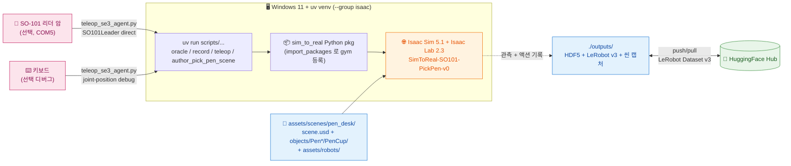

# 경로 C — Host uv (Isaac Sim 5.1 Rollback)

> [← README](../README.md) · [기본 Canonical 경로](PATH_F_CANONICAL_PARITY.md) · 관련: [경로 A (Windows native)](PATH_A_NATIVE.md) · [경로 B (Docker)](PATH_B_DOCKER.md) · [OpenUSD 가이드](OpenUSD_Guide.md) · [트러블슈팅](TROUBLESHOOTING.md)

Isaac Sim 5.1 위 `SimToReal-SO101-PickPen-v0`(펜→펜컵) · `SimToReal-SO101-PickCube-v0`(큐브→그릇) Gym 환경에서 시뮬 teleop · 오라클 정책 · 데이터 수집을 수행한다. 두 task 는 4객체+1컨테이너 구조가 동일해 씬·env cfg·MDP·카메라 리그를 공유 패턴으로 재사용한다(`pick_cube` 는 `pick_pen.mdp` 를 그대로 import). Docker 미연결 — RT 코어 GPU 가 있는 Windows 워크스테이션 또는 Linux 서버의 호스트 uv 환경에서 직접 실행한다.

> 이 경로는 parity gate 통과 전까지 유지하는 rollback 기준선이다. 새 실행 계층은 Isaac Sim
> `6.0.0.1` / Isaac Lab 3 / Pixi 기반 [경로 F](PATH_F_CANONICAL_PARITY.md)를 사용한다.

> 사전 준비(인증)는 [README §공통 준비](../README.md#공통-준비) 참고.

## 목차 <!-- omit in toc -->

- [1. 아키텍처](#1-아키텍처)
- [2. 한 번만 준비](#2-한-번만-준비)
- [3. 디렉토리 구조 (시뮬 관련)](#3-디렉토리-구조-시뮬-관련)
- [4. 펜 씬 (Pen Scene)](#4-펜-씬-pen-scene)
- [5. 텔레오퍼레이션 및 레코드](#5-텔레오퍼레이션-및-레코드)
- [6. policy-server VLA 추론 (Sim)](#6-policy-server-vla-추론-sim)

---

## 1. 아키텍처



핵심:

- 호스트 uv 환경에서 직접 실행. Docker 미연결 — RT 코어 GPU 가 있는 Windows 워크스테이션 또는 Linux 서버 필요.
- **H100 / A100 미지원**: RT 코어 부재로 카메라 raytracing pipeline 생성 실패 (자세히는 [`TROUBLESHOOTING.md`](TROUBLESHOOTING.md) §"카메라 sensor 가 raytracing pipeline 생성 실패").
- `import sim_to_real` 한 번에 monkey patch + Gym 환경 등록이 모두 일어남.

---

## 2. 한 번만 준비

```bash
uv sync --python 3.11 --group isaac --no-install-project
uv run python -c "import isaacsim; print('isaacsim', isaacsim.__version__)"
uv run python -c "import sim_to_real, gymnasium; print(gymnasium.spec('SimToReal-SO101-PickPen-v0'))"
```

`isaac` 그룹은 ~20 GB 다운로드 (Isaac Sim 5.1 extscache 포함). 처음 한 번만.

---

## 3. 디렉토리 구조 (시뮬 관련)

```
SO101-LeRobot-VLA/
├── assets/
│   ├── robots/                          # SO-101 follower USD + 편집용 URDF
│   ├── sample_calibrations/             # 샘플 .json 캘리브레이션
│   └── scenes/
│       ├── pen_desk/                     # 펜 Pick-and-Place 씬
│       │   ├── scene.usd / scene.usda    # 책상/매트/조명 + objects 참조 + 좌표
│       │   └── objects/PenWhite·PenGray·PenBlack·PenBlue·PenCup/<Name>.usd
│       └── cube_desk/                    # 큐브 Pick-and-Place 씬 (펜 씬과 동일 패턴)
│           ├── scene.usd / scene.usda
│           └── objects/Cube1·Cube2·Cube3·Cube4·Bowl/<Name>.usd
├── scripts/                             # Isaac Lab 진입점 스크립트
│   ├── environments/author_pick_pen_scene.py   # 펜 씬 USD 일괄 author
│   ├── environments/author_pick_cube_scene.py  # 큐브 씬 USD 일괄 author
│   └── environments/teleoperation/      # teleop_se3_agent / replay / so101_joint_state_server
└── src/sim_to_real/                     # 로컬 Python 패키지 (leisaac 미러 구조)
    ├── assets/scenes/{pen_desk.py, cube_desk.py}  # PEN_DESK_CFG / CUBE_DESK_CFG (UsdFileCfg 래퍼)
    ├── tasks/                           # SimToReal-SO101-PickPen/PickCube-v0 등록
    │   ├── pick_pen/{pick_pen_env_cfg.py, mdp/{observations,terminations,rewards,events}.py}
    │   └── pick_cube/{pick_cube_env_cfg.py}      # mdp 는 pick_pen.mdp 재사용
    └── utils/                           # constant + domain_randomization (ellipse / arc)
```

| Gym ID | 정의 위치 | 진입점 |
|----|----------|--------|
| `SimToReal-SO101-PickPen-v0` | `sim_to_real.tasks.pick_pen.pick_pen_env_cfg:PickPenEnvCfg` | `isaaclab.envs.ManagerBasedRLEnv` |
| `SimToReal-SO101-PickCube-v0` | `sim_to_real.tasks.pick_cube.pick_cube_env_cfg:PickCubeEnvCfg` | `isaaclab.envs.ManagerBasedRLEnv` |

---

## 4. 펜 씬 (Pen Scene)

**씬 파일:** `assets/scenes/pen_desk/scene.usd` (객체별 USD 는 `objects/` 하위 분리)

테이블탑 베이스 + 펜 4개 (rigid body) + 동적 펜 컵.

### 구성 요소

- 밝은 책상 + 어두운 데스크 매트 — `scene.usd` 직접 author
- 와이어 메시 펜 컵 — `objects/PenCup/PenCup.usd` payload 참조 (동적 rigid body)
- 펜 4개 (`PenWhite`, `PenGray`, `PenBlack`, `PenBlue`) — 각각 `objects/<Name>/<Name>.usd` payload 참조

### 구현 세부

- **객체 분리:** 펜 4개·펜컵을 self-contained USD 로 분리, `scene.usd` 에서 `prepend payload = @./objects/<Name>/<Name>.usd@` 참조. 각 객체 USD 는 자체 `Looks` Scope + 머티리얼을 포함해 다른 씬에서도 재사용 가능.
- **좌표 정합:** `scripts/author_pick_pen_scene.py` 의 `SCENE_OFFSET` 상수로 top-level translate 일괄 시프트. SO-101 follower `init_state.pos=(2.2, -0.61, 0.89)` 를 기준으로 책상 정면 모서리에 robot mount 가 클램프된 위치에 정렬.
- **펜 컵 동역학:** `PhysicsRigidBodyAPI` + `PhysicsMassAPI` (`mass=0.12 kg`, `linearDamping=0.6`, `angularDamping=4.0`, CCD on). 사용자가 밀면 움직이는 실제 펜통.
- **펜 콜라이더:** invisible Cube proxy 미사용. 각 visual primitive (Barrel Capsule / Grip · BackPlug Cylinder / Clip Cube) 에 `PhysicsCollisionAPI` + `PhysxCollisionAPI` 직접 부여 (`contactOffset=0.0015`, `restOffset=0`, torsional patch). `PenGripPhysics` 머티리얼 (`staticFriction=1.8`, `dynamicFriction=1.5`) binding. TipSleeve / Nib (Cone) 은 PhysX 의 analytic cone collision 부재로 시각 전용.
- **펜 / 펜통 영역 분리:** 펜은 그린 타원 (scene-local y ∈ [0.22, 0.26]), 펜통은 주황 호 (scene-local y ∈ [0.34, 0.40]). y 마진 ≥ 0.08 m 라 펜이 펜컵 안에 spawn 되는 케이스 원천 차단.
- **펜 초기 배치 + 랜덤화:** 펜 4개 default 는 그린 타원 4분면 분산 (yaw 차이 ≥ 35°). 매 reset 마다 `randomize_object_in_ellipse(x_radius=0.05, y_radius=0.02, yaw_range_deg=(-10,10))` jitter.
- **펜통 호 sampling:** default scene-local `(0, 0.40)` — robot scene-local y=-0.04 에서 0.44 m 정면. 매 reset 마다 `randomize_object_on_arc(radius=0.44, angle_range_deg=(-30,30))`. 양 끝 `(±0.22, 0.34)` 가 매트 안 + SO-101 reach 가장자리.
- **PenCup reset:** `parse_usd_and_create_subassets(..., specific_name_list=[*PEN_NAMES, PEN_CUP_NAME])` 로 env subasset 등록 → 매 `B`/`R` 리셋마다 author 한 초기 pose 새로 sampling.
- **데스크/매트 contact tuning:** `DeskTop`, `DeskMat` 에도 `PhysxCollisionAPI` 명시 (`contactOffset=0.0015`) — PhysX 디폴트 2 cm contact margin 으로 인한 관통·튀어오름 방지.

### 씬 재생성

```powershell
uv run scripts\author_pick_pen_scene.py
```

`.usda` 텍스트 → `pxr.Sdf.Layer.Export(args={"format":"usdc"})` 로 동일 prim layout 의 `.usd` (usdc) 생성. USD 포맷 참고: [`OpenUSD_Guide.md`](OpenUSD_Guide.md).

좌표 변경 시 같이 갱신:

- `src/sim_to_real/tasks/pick_pen/pick_pen_env_cfg.py::PEN_CUP_CENTER_XY` — `mdp.pen_in_cup` 의 컵 기준점 (world frame)
- 오라클 state machine 의 동일 상수 (`src/sim_to_real/datagen/state_machine/pick_pen.py`, 존재 시)

### 큐브 씬 (Cube Scene)

`SimToReal-SO101-PickCube-v0` 가 쓰는 `assets/scenes/cube_desk/`. 펜 씬과 동일한 책상/매트/조명 + `SCENE_OFFSET` 을 쓰고 조작 대상만 큐브 4개 + 그릇으로 바꾼다.

- **큐브 4개** (`Cube1`~`Cube4`): 한 변 2.5 cm, 무광 회색 폼(`GrayFoam`). Box 자체가 analytic collider. grasp 안정 물리 — `mass=0.035 kg`(너무 가벼우면 빠른 가속 시 contact 끊겨 떨어짐), `contactOffset=0.004`(그리퍼 빠른 접근 시 관통 방지), `maxDepenetrationVelocity=1.0`(파고든 뒤 튐 방지), `solverPositionIterationCount=32`, `CubeFriction static=1.8/dynamic=1.5`(미끄러짐 방지).
- **그릇** (`Bowl`): 동적 rigid body(`mass=0.15 kg`), 하늘색(`BowlBlue`). 바닥 disk + 반구 곡면 벽(8밴드×24 panel = 192개, 위로 갈수록 바깥 경사)으로 사진의 곡면 그릇을 근사 — 큐브가 굴러들어와 담긴다.
- **좌표·랜덤화:** 큐브는 매트 중앙 타원(`randomize_object_in_ellipse`), 그릇은 정면 호(`randomize_object_on_arc`) — 펜/펜컵과 동일. world 기준 `BOWL_CENTER_XY=(2.2,-0.17)`, `BOWL_SUCCESS_RADIUS=0.06`.

```powershell
uv run scripts\environments\author_pick_cube_scene.py
```

큐브 크기/물성·그릇 형상 변경 시 이 스크립트를 다시 실행해 USD 6쌍(scene + Cube1~4 + Bowl)을 재생성한다. world-frame 상수(`BOWL_CENTER_XY` 등)는 `src/sim_to_real/tasks/pick_cube/pick_cube_env_cfg.py` 와 함께 갱신.

---

## 5. 텔레오퍼레이션 및 레코드

`scripts/environments/teleoperation/teleop_se3_agent.py` 는 로컬 GUI teleop의 표준
진입점이며 **두 task 공용**이다(`--task` 만 바꾼다). 예전 leisaac device layer
import를 제거했고, Isaac Lab 환경에 직접 6-dim SO-101 joint-position action을 보낸다.

Windows 워크스테이션에서 `--enable_cameras`를 켜면 스크립트가 자동으로
`isaaclab.python.rendering.kit` experience를 선택해 사용자가 볼 수 있는 Isaac GUI
창으로 열린다. reset 직후 메인 Perspective viewport 는 책상 부감 구도로 자동
정렬된다(마우스로 자유 조정 가능).

- **기본(실시간 제어 모드):** 보조 viewport docking 을 끄고 메인 viewport 1개만
  렌더해 실시간 teleop 성능을 확보한다. 카메라 sensor 는 데이터 계약대로 **30 fps**
  (`render_interval`)로 유지된다(`observation.images.* fps 30`).
- **`--tune_cameras`(카메라 보정 모드):** top/front/wrist sensor 를 메인과 함께
  2×2 사분면 viewport 로 docking 하고, 실시간 카메라 튜너 위젯을 띄운다(아래
  [카메라 튜닝](#카메라-튜닝) 참고). 렌더 부하가 커지므로 보정할 때만 켠다.

```bash
# 큐브 task 실시간 제어 + 녹화 (펜 task 는 --task 만 PickPen 으로)
uv run scripts/environments/teleoperation/teleop_se3_agent.py \
    --task=SimToReal-SO101-PickCube-v0 \
    --teleop_device=so101leader \
    --port=COM5 \
    --num_envs=1 \
    --device=cuda \
    --enable_cameras \
    --record \
    --dataset_file=./datasets/dataset.hdf5
```

### 조작

| 키 | 동작 |
|---|---|
| `B` | Leader Arm/keyboard 제어 시작 |
| `R` | 현재 episode를 실패로 저장하고 reset |
| `N` | 현재 episode를 성공으로 저장하고 reset |
| `C` | top/front/wrist PNG와 카메라 metadata JSON 저장 |
| `Ctrl+C` 또는 GUI 창 닫기 | 종료 |

`--teleop_device=so101leader` 는 LeRobot `SO101Leader`를 직접 사용한다. arm 5축은
degree 값을 radian으로 변환하고, gripper는 기본적으로 `0..100` 값을
`--leader_gripper_divisor 100`으로 나눠 Isaac `0..1` joint target으로 보낸다.
calibration mismatch가 뜨면 `--recalibrate`를 추가해 LeRobot prompt를 따라 보정한다.

키보드 디버그 모드는 같은 스크립트에서 `--teleop_device=keyboard`로 실행한다.

| 키 | 동작 | 키 | 동작 |
|---|---|---|---|
| `Q` / `A` | shoulder_pan ± | `W` / `S` | shoulder_lift ± |
| `E` / `D` | elbow_flex ± | `U` / `J` | wrist_flex ± |
| `T` / `G` | wrist_roll ± | `Y` / `H` | gripper open / close |

### 카메라 캡처

GUI 창에서 `C`를 누르면 `outputs/captured_images`에 다음 파일이 생긴다.

| 파일 | 내용 |
|---|---|
| `<timestamp>_top_camera.png` | `observation.images.top` 대응 렌더 |
| `<timestamp>_wrist_camera.png` | `observation.images.wrist` 대응 렌더 |
| `<timestamp>_camera_metadata.json` | 저장 파일 경로, 각 카메라 prim path, local/world position/quaternion/euler/FOV/focal length |
| `latest_camera_metadata.json` | 가장 최근 metadata 복사본 |

검증용으로 시작 직후 한 번만 캡처하려면 `--capture_on_start`를 붙인다.

### 카메라 튜닝

GUI 카메라 튜너 위젯으로 보면서 직접 맞추는 것이 가장 정확하다. `--tune_cameras`
를 붙여 실행하면:

1. top/wrist viewport 가 메인 Perspective 와 함께 분할 docking 된다(L=Perspective, RT=Top, RB=Wrist).
2. `SO101 Camera Tuner` 패널에서 각 카메라의 **Pos X/Y/Z**, **Rot X/Y/Z(deg)**,
   **Focal(mm)** 슬라이더를 움직이면 카메라 prim 의 transform/focal 이 **실시간** 갱신된다.
3. 만족스러우면 **Print cfg values** 버튼을 눌러 콘솔에 값을 출력한다. 카메라마다
   `pos` + `rot_xyz_deg`(슬라이더값, prim frame) + `rot_quat`(wxyz, world-convention,
   cfg용) + `focal` 이 함께 찍힌다.

```bash
uv run scripts/environments/teleoperation/teleop_se3_agent.py \
    --task=SimToReal-SO101-PickCube-v0 \
    --teleop_device=so101leader --port=COM5 \
    --num_envs=1 --device=cuda --enable_cameras --tune_cameras
```

출력한 값을 task env cfg 상수에 반영한다 — 펜은
`src/sim_to_real/tasks/pick_pen/pick_pen_env_cfg.py`, 큐브는
`src/sim_to_real/tasks/pick_cube/pick_cube_env_cfg.py`.

| 카메라 | 위치 | 각도 | FOV |
|---|---|---|---|
| top | `_TOP_CAMERA_POS` (world) | `_TOP_CAMERA_ROT` (wxyz quat 직접 지정. None 이면 `_TOP_CAMERA_TARGET` look_at) | `_TOP_CAMERA_FOCAL` |
| wrist | `_WRIST_CAM_LOCAL_POS` (gripper-local) | `_WRIST_CAM_LOCAL_ROT` (wxyz quat) | `_WRIST_CAMERA_FOCAL` |

wrist 는 `.../Robot/gripper/WristCamera` 로 gripper 를 따라가고(gripper-local),
top 은 world 절대 좌표다.

CLI override(`--top_pos/--top_target/--top_focal/--wrist_pos/--wrist_rot/--wrist_focal`)
로도 임시 실험할 수 있으나, 위젯 실시간 조정이 더 빠르다.
실제 데이터셋 기준으로 맞출 때는 `observation.images.{top,front,wrist}` 프레임을 1차
기준으로 삼고, `docs/pics` 사진은 물리 배치 참고용이다.

### Rerun 뷰어 시각화

```powershell
uv run lerobot-dataset-viz `
    --repo-id local/so101-pen-pick `
    --root outputs\lerobot\so101_pick_pen_v3 `
    --episode-index 0 `
    --mode local
```

---

## 6. policy-server VLA 추론 (Sim)

학습된 VLA(SmolVLA/ACT)를 sim 에서 돌리는 경로는 **ROS 2** 로 구현돼 PATH E 문서로
이전했다 → [`docs/PATH_E_CUMOTION_ROS.md` §7 VLA 추론 (ROS)](PATH_E_CUMOTION_ROS.md).

요약: 상주 Isaac Sim bridge(`scripts/sim/run_cube_desk_ros_bridge.py`)가
`/isaac_joint_states` + `/camera/{top,wrist,front}/image_raw` 를 publish → 경량
`vla-ros` 컨테이너의 `so101_vla_policy` 노드가 policy-server(gRPC)로 추론 →
`/isaac_joint_commands` publish. Isaac 부팅 비용과 추론 클라를 분리하고, 실기기 ROS
제어와 동일 토픽 인터페이스를 쓴다.
