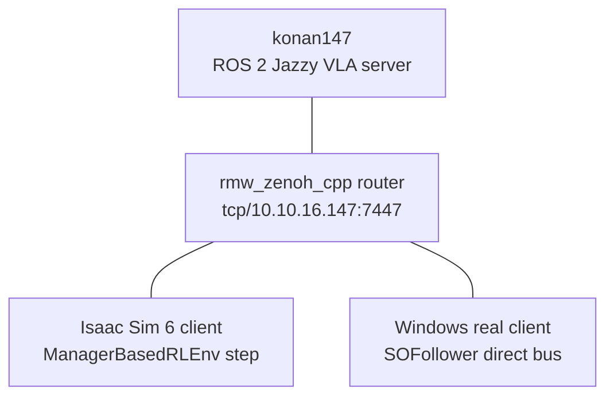

# 경로 F — SO-101 Canonical Parity

> [← README](../README.md) · [Migration report](SO101_CANONICAL_PARITY_MIGRATION_REPORT.md) · [Parity report](SO101_CANONICAL_PARITY_REPORT.md) · [Troubleshooting](TROUBLESHOOTING.md)

Isaac Sim 6과 실기기 SO-101이 동일한 canonical action을 동일 executor로 소비하는 기본 runtime이다.
학습은 이 경로의 범위가 아니다.

## 1. 계약과 구성

```text
schema: so101-canonical-v1
arm: absolute URDF radian
gripper: physical jaw aperture mm
action: absolute position target
order: pan, lift, elbow, wrist flex, wrist roll, gripper
rate: 30 Hz
camera: top/wrist/front, RGB uint8 480×640
```



공통 executor 규칙:

- inference는 한 건만 in-flight
- chunk overlap과 weighted aggregation 없음
- chunk 경계에서만 새 target 적용
- underrun은 마지막 target hold, logical policy step 정지
- timeout은 safe stop
- velocity/acceleration/jerk limiter 공통 적용
- raw output, limited target, native command, measured state를 JSONL로 기록

## 2. 고정 버전과 설치 위치

| 항목 | 고정값 |
|---|---|
| Isaac Sim | `6.0.0.1` |
| Isaac Lab | commit `28a37cecdd433c22d9eabd6a5954add9f13a8951` |
| ROS / RMW | Jazzy / `rmw_zenoh_cpp` |
| Pixi | `0.70.2` |
| Python | `3.12.13` |
| torch | `2.10.0+cu128` |
| Physics | PhysX |
| `pixi.lock` SHA256 | `9736a03f7b8b2b1d94d40285d0dc3508886cb38d2f04d9c885099ae50a31fcc5` |

```text
Windows runtime  D:\SO101\isaac6_ros
Server runtime   /DISK1/so101-sim2real/runtime/isaac6_ros
```

Windows Git repo는 다른 drive에 있어도 된다. repo의 `.pixi`는
`D:\SO101\isaac6_ros\.pixi`를 가리키는 Junction으로 생성한다. 따라서 Pixi environment와
ROS overlay는 D:에 저장되고 tracked source는 Git repo에 남는다.

## 3. 사전 요구사항

공통:

- Git
- GitHub CLI `gh`
- `jq`
- NVIDIA driver와 RT-core GPU
- 저장소 접근 권한

Windows:

- Windows 11 x64
- Git Bash
- PowerShell 5.1 이상
- Visual Studio 2022 Build Tools의 Desktop C++ workload
- WSL2와 usbipd 불필요

서버:

- Ubuntu 24.04 x64
- Docker Engine와 Compose plugin
- `ssh konan147` 접속

CUDA Toolkit과 system ROS를 별도로 설치하지 않는다. Pixi environment와 PyTorch wheel이
필요한 user-space dependency를 제공한다.

## 4. Windows 환경 구축

Git Bash에서 저장소 root로 이동한다.

```bash
cd /c/Users/taehunkim/Workspace/SO101-LeRobot-VLA
powershell.exe -NoProfile -ExecutionPolicy Bypass \
  -File scripts/parity/bootstrap_windows.ps1
export PIXI="/d/SO101/isaac6_ros/bin/pixi.exe"
```

스크립트가 수행하는 작업:

1. Pixi `0.70.2` archive checksum 검증 및 `D:\SO101\isaac6_ros\bin` 배치
2. IsaacLab checkout과 commit 검증
3. repo `.pixi` → D: runtime Junction 생성
4. `sim`, `real`, `ros-tools` locked install
5. stack check, ROS overlay build, core/dataset tests, checkpoint 검증

기존 설치만 검사:

```bash
powershell.exe -NoProfile -ExecutionPolicy Bypass \
  -File scripts/parity/bootstrap_windows.ps1 -CheckOnly
```

Isaac compatibility와 3-camera smoke까지:

```bash
powershell.exe -NoProfile -ExecutionPolicy Bypass \
  -File scripts/parity/bootstrap_windows.ps1 -CheckOnly -Smoke
```

`-Probe`는 konan147의 router와 VLA server가 실행 중일 때만 추가한다.

## 5. konan147 환경 구축

최초 clone:

```bash
ssh konan147
mkdir -p /DISK1/so101-sim2real/runtime
gh repo clone PubCyBerry/SO101-Sim2Real \
  /DISK1/so101-sim2real/runtime/isaac6_ros
cd /DISK1/so101-sim2real/runtime/isaac6_ros
bash scripts/parity/bootstrap_server.sh
export PIXI="./bin/pixi"
```

기존 설치 검사:

```bash
cd /DISK1/so101-sim2real/runtime/isaac6_ros
bash scripts/parity/bootstrap_server.sh --check-only
```

Isaac과 transport를 포함한 전체 검사:

```bash
bash scripts/parity/bootstrap_server.sh --check-only --smoke --probe
```

`--probe`는 router/server가 먼저 떠 있어야 한다. `--smoke`는 headless display 경고가 나올 수
있지만 compatibility report에서 display는 informational 항목이다.

## 6. ROS VLA server와 Zenoh router

`.env`가 없다면 template을 만든다. Canonical replay backend 자체에는 HF/W&B token이 필요 없다.

```bash
test -f .env || cp .env.example .env
```

기존 `policy-server:0.5.1` base image가 없다면 먼저 빌드한다.

```bash
docker image inspect policy-server:0.5.1 >/dev/null 2>&1 || \
  docker compose --env-file .env -f docker/docker-compose.yaml build policy-server
```

ROS server image와 service:

```bash
docker compose --env-file .env -f docker/docker-compose.yaml build vla-ros-server
docker compose --env-file .env -f docker/docker-compose.yaml up -d \
  zenoh-router vla-ros-server
```

상태 확인:

```bash
docker compose --env-file .env -f docker/docker-compose.yaml ps \
  zenoh-router vla-ros-server
docker compose --env-file .env -f docker/docker-compose.yaml logs \
  --tail 50 vla-ros-server
```

server log에는 현재 manifest와 checkpoint hash가 출력되어야 한다.

```text
VLA server ready backend=replay manifest=<hash> checkpoint=<hash>
```

중지:

```bash
docker compose --env-file .env -f docker/docker-compose.yaml stop \
  vla-ros-server zenoh-router
```

## 7. 검증과 실행

### 공통 software validation

```bash
python scripts/parity/launch.py validate
```

통과 조건:

- `pixi lock --check`
- core 17/17
- dataset converter 1/1
- replay checkpoint hash 일치

### Transport probe

Windows:

```bash
python scripts/parity/launch.py mock-probe --samples 100
```

검사 항목:

- raw RGB 3장 service 왕복
- 두 번째 motion lease 거부
- contract mismatch 거부
- 반환 chunk bitwise 동일

### Isaac Sim client

```bash
python scripts/parity/launch.py sim --steps 32
```

`mock-probe`와 `sim`은 single active lease를 공유하므로 동시에 실행하지 않는다.

### Real client dry-run

```bash
python scripts/parity/launch.py real-dry-run --port COM8
```

현재 미검증 calibration에서는 다음이 정상 결과다.

```text
status=passed
hardware_accessed=false
motion_allowed=false
```

## 8. ROS interface

| 이름 | 역할 |
|---|---|
| `/so101/vla/get_runtime_info` | contract/manifest/checkpoint와 lease 확인 |
| `/so101/vla/infer_chunk` | state, task, RGB 3장을 받아 canonical chunk 반환 |
| `/so101/vla/status` | server 상태 |

Windows client config:

```text
configs/zenoh/windows-client.json5
tcp/10.10.16.147:7447
```

서버 local client config:

```text
configs/zenoh/server-client.json5
tcp/127.0.0.1:7447
```

## 9. Manifest와 checkpoint

현재 replay manifest 검증:

```bash
"$PIXI" run -e ros-tools python scripts/parity/validate_checkpoint.py \
  --manifest configs/parity/runtime_manifest.mock.json \
  --checkpoint configs/parity/replay_checkpoint.json
```

lock, calibration, runtime config 또는 checkpoint가 변경되면 manifest를 재생성한다.

```bash
"$PIXI" run -e ros-tools python scripts/parity/build_runtime_manifest.py \
  --checkpoint configs/parity/replay_checkpoint.json \
  --checkpoint-ref replay_checkpoint.json \
  --backend replay \
  --model-frame canonical \
  --chunk-size 16 \
  --output configs/parity/runtime_manifest.mock.json
```

검증 후 `vla-ros-server`를 재시작한다.

```bash
docker compose --env-file .env -f docker/docker-compose.yaml restart vla-ros-server
```

hash가 하나라도 다르면 client/server는 실행을 거부해야 한다.

## 10. Calibration

실기기 측정 template:

```text
calibration/templates/paired_arm_poses.json
calibration/templates/real_gripper_aperture.csv
```

필요한 사용자 보조:

- arm paired pose 10~20개
- gripper caliper aperture 7~9개
- torque-off EEPROM readback

readback은 torque를 켜지 않지만 실기기에 접속하므로 사용자가 현장에 있을 때 수행한다.

```bash
"$PIXI" run -e real python scripts/parity/run_real_client.py \
  --port COM8 \
  --inspect-readback \
  --report outputs/parity/motor_readback.json
```

측정 후 bundle 생성:

```bash
"$PIXI" run -e real python scripts/parity/fit_calibration_bundle.py \
  --paired-arm-poses calibration/measurements/paired_arm_poses.json \
  --real-gripper calibration/measurements/real_gripper_aperture.csv \
  --motor-readback outputs/parity/motor_readback.json \
  --output calibration/so101_canonical.json \
  --report outputs/parity/calibration_fit_report.json
```

`validated=true`, arm round-trip `<1e-5 rad`, gripper round-trip `<0.1 mm`가 모두 필요하다.

## 11. Dataset과 dynamics

원본 dataset은 변경하지 않는다. 먼저 audit만 실행한다.

```bash
"$PIXI" run -e real python scripts/parity/convert_dataset_canonical.py \
  --source datasets/pick_cube_v2 \
  --source-frame real_lerobot_range_v1 \
  --provenance calibration/provenance/pick_cube_v2.json \
  --audit-only \
  --report outputs/parity/pick_cube_v2_audit.json
```

provenance와 calibration이 검증된 뒤에만 별도 destination으로 변환한다.

Dynamics plan:

```bash
"$PIXI" run -e real python scripts/parity/generate_dynamics_plan.py \
  --condition no_load \
  --output outputs/parity/dynamics/no_load_plan.jsonl
"$PIXI" run -e real python scripts/parity/generate_dynamics_plan.py \
  --condition cube_payload \
  --output outputs/parity/dynamics/cube_payload_plan.jsonl
```

실기기 dynamics motion은 아래 안전 gate를 모두 요구한다.

## 12. 실기기 motion 안전 gate

사용자가 비상 전원 차단 준비를 확인하기 전에는 실행하지 않는다.

```bash
python scripts/parity/launch.py real-motion \
  --port COM8 \
  --steps 64 \
  --enable-motion \
  --confirm-emergency-cutoff-ready
```

추가 fail-closed 조건:

- calibration bundle `validated=true`
- motor profile `readback_validated=true`
- real gripper PCHIP 존재
- `SOFollower.configure()` 자동 호출 금지
- motion write는 `Goal_Position` 단일 `sync_write`

Payload dynamics는 사용자가 cube 장착을 확인한 뒤
`--confirm-payload-attached`까지 명시한다.

## 13. Rollback

기존 Isaac 5.1 경로는 삭제하지 않는다.

```text
Gym ID: SimToReal-SO101-PickCube-v0
Guide: docs/PATH_C_ISAAC_SIM.md
```

새 canonical 경로:

```text
Gym ID: SimToReal-SO101-PickCube-Isaac6Parity-v0
Package: src/sim_to_real/isaac6
```

두 dependency graph를 섞지 않는다.

## 14. 정상 판정

| 항목 | 통과 기준 |
|---|---|
| stack | 두 머신 version/commit/lock 일치 |
| camera | top/wrist/front `[1,480,640,3] uint8` |
| executor | underrun/timeout/stale 0 |
| transport | p99 ≤30 ms |
| deterministic replay | chunk bitwise 동일 |
| safety | 미검증 상태에서 hardware/torque 접근 없음 |
| rollback | Isaac 5.1 smoke 통과 |

Physical trajectory parity는 calibration과 real dynamics trace가 없으면 완료로 표시하지 않는다.
