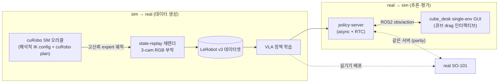
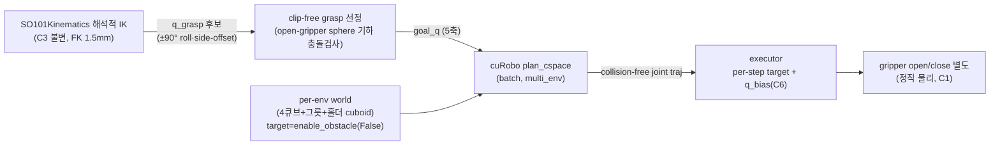

# SO-101 PickCube cuRobo — 프로젝트 마스터 문서

> **한 줄 요약**: cube_desk 에서 SO-101 팔이 큐브 4개를 그릇에 담는 **결정적 pick-and-place 오라클을
> cuRobo GPU 배치 충돌 플래닝으로 재구현**한다. 해석적 IK(검증됨, 유지)가 grasp config 를 주고,
> cuRobo `plan_cspace`(joint-goal)가 충돌-free 궤적을 만든다. 용도는 **VLA 학습 데이터 생성(sim→real)**
> 과 **학습된 VLA 의 시뮬 추론·평가(real→sim)** 양방향. 해석적 SM([`PICKCUBE_SM_PROJECT.md`])의 천장
> (descend-clip 55.8%)을 충돌 기하 인식으로 돌파하는 후속 트랙.
>
> **현재 상태(2026-06-14 착수)**: ⚪ **계획 확정·문서화 단계**. 승인된 플랜 = `~/.claude/plans/
> so-101-pick-place-vla-federated-shannon.md`. 아직 코드 미착수.
>
> **왜 cuRobo 인가**: 해석적 SM 은 grasp pose 를 "점+heuristic offset"으로 다뤄 비대칭 moving jaw
> (−y 82mm 늘어짐·열림 46mm swing)의 self-clip 을 못 본다. 4-cube 2048-env **55.8%** 천장의 93% 가
> target 큐브 self-clip([`PICKCUBE_SM_PROJECT.md`] §10), blind 튜닝 4연패. **cuRobo 는 그리퍼를 실제
> sphere 기하로 모델**해 clip-free grasp pose 를 선정하고, 이웃 큐브·그릇·카메라 홀더를 장애물로 회피한다.
>
> **작성 기준**: 2026-06-14. 단일 진입점 문서. 해석적 SM 이력 = [`PICKCUBE_SM_PROJECT.md`], RL 트랙 =
> [`PICKCUBE_RL_PROJECT.md`], cuMotion+ROS(실기기) = [`PATH_E_CUMOTION_ROS.md`].

---

## 0. 상태 대시보드

| Phase | 내용 | 상태 | Track |
|---|---|---|---|
| **P0** | cuRobo 설치 · ABI 무손상 게이트 | 🟢 DONE (nvcc 불요·핀 보존·API 검증; Isaac headless smoke 만 첫 sim 때 확인) | A |
| **P1** | so101 cuRobo config — 공식 RobotBuilder sphere fit (홀더 포함) | 🟢 DONE (54 spheres/9링크, so101.xrdf+so101_curobo.yml, IK 81%, Viser·MPC·MotionPlanner 검증) | A |
| **P1+** | SO-101 FK·IK 단독 검증 + joint-goal 인터랙티브 데모 + FK 일관성 진단 | 🟢 DONE (pose-goal 5-DOF 벽 확증·MPC차이 규명·**해석적FK↔cuRoboFK 6.9mm 발산 발견**·joint-goal 데모 작동) | A |
| **P2** | cuRobo 충돌 플래닝 ↔ pick-place 통합 (single-env) | 🟢 DONE (**IPC 사이드카**·4-큐브 side-approach·장애물 회피·DR·livestream+3cam, **~18–20초 4/4**) | A |
| **P3** | **multi-env 배치** 스케일 (BatchMotionPlanner·multi_env world) · throughput | 🟢 DONE (서버 배치+청크·클라 lock-step·grasp-retry. **N=256 chunk=64 retry=1: cube 64.6%·all-4 18.8%·VRAM 20GB·3 epi/s**). all-4 상향 = P4 min_cube_sep | A |
| **P4** | 큐브 간 최소거리 강화 (clustering 해소) | ⚪ TODO | B |
| **P5** | 렌더 env + obs/action 공유 계약 · LeRobot 기록 | ⚪ TODO | B |
| **P6** | VLA 시뮬 추론 (single-env · ROS2 + async · 인터랙티브) | ⚪ TODO | C |
| **PD** | ovrtx/ovphysx throughput 실측 (옵션) | ⚪ TODO | D |

> 🎯 **성공 기준**: 2048-env 4-큐브 **~95–99% + clean↑**(knocking 없는 자연 궤적), 에피소드 **<20초**
> (600 step @30Hz). literal 100% 는 비목표(PhysX 비결정성·reach-edge 본질 노이즈).

---

## 1. 태그·중요도 범례

### 상태 태그 (Kanban)

| 배지 | 의미 |
|---|---|
| 🟢 **DONE** | 완료 + 검증됨 (헤드리스 실행·taxonomy·프레임 PNG 확인) |
| 🔵 **IN-PROGRESS** | 현재 진행 중 |
| ⚪ **TODO** | 예정 — 아직 착수 안 함 |
| 🔴 **BLOCKER** | 막힘 — 해결돼야 다음 진행 |
| ⚫ **DROPPED** | 시도 후 폐기 — 교훈만 남김 |

### 중요도

| 배지 | 의미 |
|---|---|
| 🔥 **CRITICAL** | 성패 직결 |
| ⭐ **HIGH** | 품질·일정 큰 영향 |

---

## 2. 목표와 용도 (양방향)



- 🔥 **최종 목표**: cube_desk **4-큐브 pick-and-place**, 2048-env 배치 검증 **~95–99% + clean↑**,
  에피소드 **<20초**, retry 발동 최소.
- **용도 ①(sim→real)**: VLA 학습용 **결정적** expert 데이터. (RL 트랙[`PICKCUBE_RL_PROJECT.md`]은
  다양성 담당, cuRobo SM 은 결정적 고신뢰 담당.)
- **용도 ②(real→sim)**: 학습된 VLA 를 cube_desk 시뮬에서 **closed-loop 추론** — 실기기 배포 전 검증.
  GUI 에서 물체를 옮겨도 추종·집기 시도하는지 정성 확인.
- **공유 계약**: 두 방향이 **렌더 env + LeRobot obs/action 계약**(`lerobot_units.py` "North Star:
  observation.images.{top,wrist,front}", joint rad↔deg, gripper 0–100)을 공유한다. **parity**: 같은
  policy-server 가 real/sim 양쪽 구동. 카메라 pose/intrinsic 은 실기기 리그(손목/전면 홀더)에 정합
  (최근 커밋) → real→sim 전이 전제 충족.

---

## 3. 제약 (엄수)

| # | 제약 | 상태 | 이유 | 중요도 |
|---|---|---|---|---|
| C1 | 🚫 grasp weld/attach/인공 유지력 금지 | ✅ 유지 | 물리적 정직 grasp 만(VLA 데이터 validity). cuRobo `attach`/`enable_obstacle` 는 **플래닝 충돌모델 전용** — 실제 grasp 는 그리퍼 close+마찰(30/40mm 물리 grasp 검증됨) | 🔥 |
| C2 | `BOWL_SUCCESS_RADIUS=0.06` 불변 | ✅ 유지 | 성공판정 부풀리기 금지 | 🔥 |
| C3 | **Part A 기구학 불변** (`SO101Kinematics`·`_world_to_base`·q_bias·`--calibrate`) | ✅ 유지 | `--calibrate` 실측 FK err 1.5mm. grasp config 계산에 재사용 — **재작성 금지** | 🔥 |
| C4 | 5-DOF **position 우선·orientation best-effort** | ✅ 유지 | SO-101 5축 → 임의 6-DOF pose 불가. cuRobo 도 **joint-goal(`plan_cspace`)로만** (pose-goal 5-DOF 비가능, PATH E 확증) | 🔥 |
| C5 | **검증은 ≥256-env** | ✅ 유지 | 16-env 76% vs 2048 51.6% — 소표본 과대평가 | ⭐ |
| C6 | cuRobo trajectory 위에 **q_bias 중력보상 유지** | ✅ 신규 | cuRobo 는 kinematic traj, env 는 compliant PD(stiffness 17.8) sag → 보상 없으면 grasp z 미달 | ⭐ |

---

## 4. 아키텍처: 해석적 IK(유지) + cuRobo 충돌 플래닝(신규)



| 요소 | 역할 | 핵심 |
|---|---|---|
| **해석적 IK (유지)** | grasp config 5축 해 제공 | `SO101Kinematics.ik/ik_reach`, roll ±90°·side-offset 후보. C3 |
| **clip-free 선정 (신규)** | self-clip 회피 | 후보를 **open-gripper sphere 기하**로 충돌검사 → clip 없는 config 우선. 해석적 SM 의 `_evaluate_all_grasps`/`--mj_outer` 역할을 cuRobo 충돌엔진이 대체 |
| **cuRobo plan_cspace (신규)** | 충돌-free joint→joint 궤적 (배치) | `BatchMotionPlanner.plan_cspace(goal_states, current_state)`. `multi_env=True` → per-env world |
| **per-env world (신규)** | 이웃 큐브·그릇·**카메라 홀더** 회피 | `Cuboid` + `update_world`, target 큐브는 grasp phase 에 `enable_obstacle(name, False, env_idx)` |
| **executor (유지·수정)** | traj → per-step joint action | per-env buffer 전진 + **q_bias(C6)**. transit/approach/lift/transport 를 cuRobo traj 로 교체 |
| **gripper (유지)** | open/close (cuRobo 밖) | 6번째 관절 별도 제어, 정직 물리 grasp (C1) |

**왜 이 구조**: dominant 천장(target self-clip)은 grasp **pose 선정**이 그리퍼 실제 기하를 봐야 풀린다.
cuRobo 의 full-gripper sphere 충돌모델이 이를 원리적으로 제공(해석적 heuristic offset 의 한계 돌파).
이웃/그릇/홀더 knocking 은 per-env world 회피로 해결. 5-DOF 는 joint-goal 로 pose-goal 문제 회피.

> **확정된 cuRobo API** (`ref_repos/curobo`, 표준 pip `nvidia-curobo` 구 `MotionGen` API 와 **다른
> 신버전** — copyright 2023–2026, `_src/` 레이아웃). 구현은 `curobo/examples/getting_started/
> motion_planning.py`(`plan_grasp_and_execute`) + 아래 실제 시그니처를 따른다. **`curobo.org` 구버전
> docs 금지.**

| 기능 | 실제 API (P0 설치 실측 검증 ✅) | 위치 |
|---|---|---|
| import (shim) | `from curobo.motion_planner import MotionPlanner, MotionPlannerCfg`<br>`from curobo.batch_motion_planner import BatchMotionPlanner`<br>`from curobo.scene import Scene, Cuboid, Sphere, Mesh` (`Scene`=`SceneCfg` alias)<br>`from curobo.kinematics import Kinematics, KinematicsCfg` · `from curobo.types import JointState` | `curobo/{motion_planner,batch_motion_planner,scene,kinematics}.py` shim → `_src/` |
| ❌ 틀린 경로 | `from curobo import MotionPlanner` — `__init__.py` 는 `__version__` 만 export | — |
| 로봇 config | `KinematicsCfg.from_robot_yaml_file("franka.yml")` / `MotionPlannerCfg.create(robot=, max_batch_size=N, multi_env=True, device_cfg=)` | `_src/motion/motion_planner_cfg.py:37` |
| FK | `Kinematics(cfg).compute_kinematics(JointState.from_position(q, joint_names=))` → `KinematicsState.tool_poses`·`get_link_spheres()` | `_src/.../kinematics` |
| per-env world | `multi_env=True` → 각 batch 문제가 독자 collision world | cfg.py:103,111 |
| joint-goal 배치 | `BatchMotionPlanner.plan_cspace(goal_states: JointState, current_state, max_attempts=)` | `_src/motion/motion_planner_batch.py:223` |
| world 갱신 | `update_world(scene_cfg: SceneCfg)` | batch.py:592 |
| per-env 충돌 토글 | `attachment_manager.enable_obstacle(name, enable=False, env_idx=)` | `_src/collision/attachment_manager.py:219` |
| sphere fit | `from curobo.sphere_fit import fit_spheres_to_mesh, estimate_sphere_count, SphereFitType` | `curobo/sphere_fit.py` |

**설치 (P0 ✅)**: `uv pip install -e "ref_repos/curobo[cu12]"` (torch 핀돼 있어 `cu12-torch` 아님).
**nvcc 불요** — `USE_PYBIND=0`(기본) → pybind CUDA 확장 안 빌드, 런타임 cuda-core(NVRTC)+warp 1.14 JIT.
**핀 보존 검증**(numpy 1.26·torch 2.7+cu128·pyarrow 18). ⚠ **`uv run` 은 sync 로 curobo 삭제**(lock 미등재)
→ cuRobo SM 은 **`uv run --no-sync --group isaac`** 규약(lock 미변경=ABI 핀 안전). `gen_so101_xrdf.py` 는
**구 API**(`CudaRobotModel`/`IKSolver`)라 신 API 재작성 필요(P1). PoseCostMetric/partial-pose 없음 → 5-DOF
는 joint-goal(`plan_cspace`)만.

---

## 5. 실행 환경

| 항목 | 값 |
|---|---|
| 서버 | Ubuntu 24.04.3, Intel Core Ultra 5 245K, 128GB RAM |
| GPU | RTX PRO 5000 Blackwell **48GB** (RT 코어 — Isaac Sim 5.1 요구) |
| 스택 | Isaac Sim 5.1 / IsaacLab 2.3 / **cuRobo(ref_repos)** / `ManagerBasedRLEnv` |
| Python | `uv run --group isaac` (cuRobo in-process 설치 — P0 ABI 게이트) |
| ABI 핀 | numpy==1.26 · torch==2.7.0+cu128 · pyarrow<19 등 (**업그레이드 금지**, AGENTS.md) |
| 격리 venv | `.venv-ovrtx`(ovrtx 0.3.0) · `.venv-ovphysx`(ovphysx 0.4.13) — Track D 옵션 |
| GPU 공유 | 1장 공유(학습·MCP 경합) → 장시간 run 은 스케줄·background |
| 부팅 | `OMNI_KIT_ACCEPT_EULA=YES`, `--headless` (P6 만 GUI) |

> `$ROOT = /home/konan147/Workspaces/SO101-Sim2Real`

---

## 6. 계획 & 칸반 보드 (Phase별 작업)

### P0 — cuRobo 설치·검증 게이트 🟢 DONE (Track A)
- [x] cuRobo 설치 `uv pip install -e "ref_repos/curobo[cu12]"` (nvidia-curobo 0.8.0.post1.dev35).
      **nvcc 불요**(USE_PYBIND=0 → cuda-core/warp 런타임). 핀 보존(numpy 1.26·torch 2.7·pyarrow 18).
- [x] 게이트: 공개 API import OK(`from curobo.motion_planner import …`) + franka FK CUDA 실행 검증.
- ⚠ **`uv run --no-sync --group isaac`** 규약(lock 미등재라 sync 가 curobo 삭제). Isaac headless smoke 는
      첫 sim 실행(P2) 때 확인.

### P1 — so101 cuRobo robot config 🟢 DONE (Track A)
**최종 방식 = 공식 `build_robot_model.py`(RobotBuilder API), 커스텀 sphere 수학 0.** 스크립트
`scripts/sim/build_so101_xrdf.py`:
- [x] **P1-a**: `RobotBuilder(urdf, asset, tool_frames=[gripper_frame_link]).fit_collision_spheres
      (sphere_density=2.0, clip_links={base:z,0})` — 전 link MorphIt + self-collision ignore 자동.
      카메라 홀더(`wrist_cam_mount`·`front_cam_mount`)는 URDF fixed link 라 **자동 포함**(로봇 한몸).
- [x] **P1-b thin/clip 링크 보정**: `refit_link_spheres(sphere_density=4.0)` for front_cam(0.6→93.9%)·
      base(clip 책상위 커버). density↑ 면 MorphIt voxel 격자 finer → 얇은 plate 도 정상.
- [x] **P1-c 퇴화 구 제거**: clip 하드클램프·과할당 디커플 작은구(r<0.005) 3개 필터(사용자 피드백).
- [x] **출력 2종**: `assets/robots/so101.xrdf`(Isaac) + `so101_curobo.yml`(cuRobo native·mesh_link_names
      포함 → MPC/Viser/planner 용). 54 spheres/9링크.
- [x] **검증**: `validate_so101_curobo.py`(로드·54 적재·FK·IK 81%) + **Viser 시각 검토**
      (`build_so101_xrdf.py --visualize`) + **reactive MPC 동적 검증**(`reactive_so101_viser.py` —
      EE 드래그 추종+장애물 회피, 공식 reactive_control 적용).
- ⚠ cspace 6축(gripper 포함, 공식 그대로) → P2 에서 planner `lock_joints` 로 5-DOF 계획.
- ❌ 폐기(교훈): 커스텀 SURFACE/centerline slab fit — "sparse/덕지덕지"(사용자), 공식 MorphIt density↑가 정답.

### P2 — 핵심 통합 ⚪ 🔥 (Track A)
- [ ] **신규** `scripts/planning/so101_curobo_planner.py`: BatchMotionPlanner wrapper(config·warmup·
      `plan_to_joint_goal`·per-env world·target 토글·clip-free 선정)
- [ ] **수정** SM(또는 신규 `pick_cube_curobo_sm.py`): transit/approach/lift/transport 를 cuRobo traj
      실행으로 교체. grasp config·q_bias·snapshot·gripper·`_placed`·`_pick_next`·안전망 **유지**
- [ ] 실행층: per-env traj buffer 전진 + q_bias(C6)
- [ ] **검증**: 4-env GUI(R/N) — 큐브 안 건드림·그릇 안 밀침 영상 확인

### P3 — 배치 스케일·청크 ⚪ 🔥 (Track A) — **계획 확정(2026-06-14)**
**구조 = lock-step 벡터화 SM**(D12): 전 env 동일 phase tape(고정 순서 Cube1→4), 매 IK/plan/step 배치,
per-env active/placed/failed 마스크. cuRobo `BatchMotionPlanner`(multi_env=True)가 "N문제 N world 1 GPU
call" → lock-step 이 설계 의도. straggler 세금 미미(고정 horizon traj 일괄 반환, retry 단위만).
- [x] **서버 additive 배치 엔드포인트**(`curobo_planner_server.py`) 🟢 — `BatchMotionPlanner`(multi_env,
      max_batch_size) + 배치 `IKSolver`(collision-free) + `init_batch`/`world_batch`/`ik_batch`/`plan_batch`.
      단일-env 엔드포인트(ik/plan/set_world) **무손상**. **N=4 GPU smoke 통과**: IK pos_err 0.05mm(D9 refine),
      plan 4/4, traj trim H=61. 함정 2건: ① per-env world buffer N개는 **scene_model 이 길이 N 리스트**일 때만
      할당(cache-only/단일 scene=1env) → 임시 YAML(N개 동일 스키마 scene 리스트) 경로 전달 ② batch
      `interpolated_trajectory`=buffer 전체(Hbuf~5000, last_tstep 이후 미정의, `get_interpolated_plan`은
      batch raise) → per-env `interpolated_last_tstep` trim + goal-pad 로 Hmax 균일화
- [x] **서버 내부 청크** 🟢 — 단일배치 256 = **OOM**(peak 42.5GB, planner build ~40GB+Isaac 공유불가).
      `init_batch(chunk)` 로 planner max_batch_size=chunk 빌드, `ik_batch`/`plan_batch` 가 n_envs 를 chunk
      단위 분할(부분청크 패딩, plan 은 per-chunk world 로드 → 전역 Hmax goal-pad). 물리배치(Isaac n_envs)↔
      planner 배치(chunk) 분리. **N=256 chunk=64 성공**: peak VRAM **20GB**, **3.04 epi/s**(wall 84s), cube
      56.8%·all-4 17.2%. **chunk⊥성공률 확증**(N=16 chunk8 71.9% ≈ 비청크 65.6%) — 청크는 VRAM/throughput 전용
- [x] **신규 클라이언트** `scripts/sim/pick_cube_curobo_batch.py` 🟢 — lock-step 벡터화. 스칼라 기하 헬퍼
      (closing_axis·to_base·yaw_base·grasp 선정)는 데모서 복제 후 **per-env 루프로 요청 빌드**, GPU(ik_batch·
      plan_batch)·env.step 만 배치. per-env active 마스크(grasp 도달/IK/plan 실패 env hold). q_bias(C6)·side-
      approach·DR cube_yaw·per-env world 회피 동일. **GPU smoke**: N=4 고정 16/16(100%, 15.2s sim)·**N=16 DR
      42/64(65.6%), all-4 5/16, wall 27.4s**. 단일-env 데모 무손상. 함정: numpy float32 JSON 직렬화 불가 →
      to_base/yaw/roll float() 코어션
- [x] **grasp-retry** 🟢 — `--max_retry`(기본 1). 큐브당 미placed env 만 bounded 재시도(성공/도달불가 env hold,
      lock-step). 큐브별 attempt_mask 축소. **N=256 chunk=64 max_retry=1**: cube **56.8%→64.6%**(+7.8pp),
      all-4 17.2%→18.8%, sim 20→40s·wall 84→173s(~2×). VRAM 무관(19.6GB). **all-4 천장은 retry 아님**(클러스터
      hard layout) → P4 min_cube_sep
- [ ] 추가 lever: `plan_attempts`(현 4 vs 단일-env 8)·`ik_seeds`(현 48 vs 64)↑, **P4 min_cube_sep**(all-4 천장)
- [ ] **배치 크기 = 256 시작→실측 climb**(D13): max_batch_size 256 으로 VRAM/wall-clock 실측, OOM·여유 보고
      512→2048 단계 상향. 물리배치(Isaac N) ↔ planner 배치(≤max_batch_size, 서버 청크) 분리. IPC 2048≈수 MB
- [ ] **검증 ≥256-env**(C5) taxonomy(success/clean/steps/reason_histogram)

### P4 — DR 영역·자세 재설계 + grasp 닫힘축 🟢 (Track B) — **2048: cube 87.9%·all-4 60.0%**(256: 95.3%·82.8%)
> **방향(사용자, 2026-06-14)**: livestream 으로 실패 관전 → unreachable 있음 확인 → **큐브 스폰을 매트 위
> 도달가능 사각형으로 한정 + 볼륨 비겹침 + 6D face 랜덤화**로 재설계.
- [x] **매트 사각형 영역** 🟢 — 데스크 매트(860×400mm) 좌하단=env-local(-0.34,0.045) 기준 사용자 지정
      매트-local cm 사각형(X[16,56]·Y[11,25]) → **env-local x[-0.18,0.22]·y[0.155,0.295]**. `volume_inset`
      (=40mm face 대각 절반 0.0283)으로 **큐브 볼륨이 사각형 안**(중심 아니라 부피 기준). 옛 y[0.115,0.23]
      대비 **+y 전진**(base 근접 unreachable 완화)
- [x] **볼륨 비겹침** 🟢 — `min_cube_sep` **0.10→0.060**(40mm footprint 대각 쌍 ≈0.057+여유, **non-overlap
      최소**·과분리 아님), `min_bowl_sep=0.14`(그릇 반경0.06+큐브0.029+arc0.05). 검증 N=64: 겹침 0쌍, OOB 0
- [x] **6D face 랜덤화** 🟢 — `full_orient`: **이산 stable-face(6면) + random yaw**(uniform SO(3)+낙하는 tumble
      drift 9% OOB → 폐기). drift 0·z 띄움 불요. 큐브는 면 동일해도 felt 텍스처 seam 이 달라 **VLA 시각 다양성**.
      검증: 6면 균등(flat 33%)·볼륨 in-rect·비겹침
- [x] **256 재측정** 🟢 — 새 DR 로 **cube 64.6%→92.8%(+28pp)·all-4 18.8%→74.2%(+55pp)**. 분포 {2:8,3:58,4:190}
      — **0/1개 실패 env 전무**(옛 0개 37·1개 31). 전진 Y 도달가능 영역이 unreachable 완전 제거. sep 0.060 클러스터
      우려 무효(reachability 이득이 압도). 남은 부족 = 1-2개 놓친 66 env(tight pack/marginal grasp)
- [ ] 95%+ push lever: `plan_attempts` 4→8·`ik_seeds` 48→64↑, 잔여 66 env 진단(클러스터면 sep 소폭↑)

### P5 — 렌더 env + 공유 obs/action 계약 ⚪ (Track B)
- [ ] **정확도 검증**: 2048-env state-only(`--headless --taxonomy`, 카메라 off)
- [ ] **데이터 기록**: state-replay 재렌더(권장) — 2048 state 기록 → 소수 env replay+RGB 렌더
- [ ] 공유 계약 모듈: obs 빌더(3-cam RGB+joint)·action 매핑을 **데이터 기록·VLA 추론 공유** import
- [ ] `rollout_to_lerobot.py`+`lerobot_units.py` 확장(SM/replay·다중 env). depth 보조 옵션(생성 전용)

### P6 — VLA 시뮬 추론 (single-env · ROS2 + async) ⚪ (Track C)
- [ ] **수정** `run_cube_desk_ros_bridge.py`: GUI 모드 + 3-cam RGB ROS2 publish
- [ ] **신규** `scripts/sim/sim_vla_ros_client.py`: ROS2 카메라/joint 구독 → LeRobot obs → policy-server
      async(RTC) 추론 → `/isaac_joint_commands` publish. 실기기 `robot_client.py` 패턴(parity)
- [ ] **검증**: GUI 큐브 drag → VLA 추종·집기 시도 정성 확인

### PD — throughput probe (옵션) ⚪ (Track D)
- [ ] ovrtx vs TiledCamera 렌더 throughput (`tiled_camera_throughput_bench.py` vs `ovrtx_*_probe.py`)
- [ ] ovphysx 2048 물리 throughput (`ovphysx_probe.py`) — IsaacLab 안정화 후 후순위

### 병렬 실행 전략
```
Track A (critical):  P0 → P1 → P2 → P3        (cuRobo 의존)
Track B (A와 병렬):   P4 ‖ P5                  (env·카메라만, cuRobo 불요)
Track C (A와 병렬):   P6                       (ROS2·VLA, cuRobo 전혀 불요)
Track D (독립):       ovrtx ‖ ovphysx 실측
```
- **A·B·C·D 동시 착수 가능**. 수렴점: 데이터 생성 = A(SM)+B(recorder), VLA 학습 = 데이터 후, P6 정성
  데모는 더미/학습 VLA 로 harness 먼저.

---

## 7. 타임라인 & 구간별 결과

| 날짜 | 구간 | 결과 |
|---|---|---|
| 2026-06-14 | 계획 확정·문서화 | 승인된 플랜 작성, 본 문서 생성. cuRobo API 실검증(신버전 `_src/` 레이아웃). xrdf stale(홀더 미포함) 확인 |
| 2026-06-14 | **P0 설치 게이트 🟢** | `uv pip install -e ref_repos/curobo[cu12]` 성공(nvidia-curobo 0.8.0.post1.dev35). nvcc 불요(USE_PYBIND=0, cuda-core/warp 런타임). 핀 보존(numpy 1.26·torch 2.7·pyarrow 18). 공개 API import + franka FK CUDA 실행 검증. import 경로 정정(`from curobo.motion_planner import …`, `from curobo import` ❌). `--no-sync` 규약 확정 |
| 2026-06-14 | **P1 xrdf 🟢 (공식 RobotBuilder)** | 최종 = 공식 `build_robot_model.py` 워크플로(`scripts/sim/build_so101_xrdf.py`, RobotBuilder API, 커스텀 sphere 수학 0). so101.xrdf **54 spheres/9링크**(카메라 홀더 포함, geometry=`collision_model`, self-collision ignore 자동). `validate_so101_curobo.py`: 로드 OK·54 적재·FK OK·IK 81%·Viser(:8085) 검토. 단위=미터. gen_so101_xrdf.py(구API/PATH E) 미변경 |
| 2026-06-14 | **P1 튜닝 루프(Viser)** | ① 기본 MorphIt(density 1.0)은 thin moving_jaw(cover 0.4%)·front_cam plate(0.6%)·clip base 붕괴 ② 커스텀 centerline slab 시도→"너무 sparse"(폐기, 사용자) ③ **공식 해법 확정: `--sphere-density 2.0`→moving_jaw 정상(91.7%), 두 thin/clip 링크는 `refit_link_spheres(sphere_density=4.0)`→front_cam 93.9%·base 책상위 커버** ④ clip 하드클램프 디커플 작은구(r<0.005) 3개 필터 제거. 사용자 OK |
| 2026-06-14 | **P1 동적 검증(MPC·MotionPlanner Viser)** | 공식 `reactive_control`(MPC)·`motion_planning`(plan_pose/grasp) 예제를 SO-101 `so101_curobo.yml` 로 Viser 구동, 사용자 정성 확인("얼추 돌아감"). 함정: ① 예제 `--robot`/`--scene` 절대경로 필수(상대=curobo content 기준) ② **collision_test.yml=franka 크기 → SO-101 start 충돌→Move/Grasp 전부 무반응**, SO-101 크기 `assets/robots/so101_scene.yml`(작은 기둥) 신규로 해결 ③ 5-DOF 라 임의 orientation pose-goal 실패 정상(P2 joint-goal) |
| 2026-06-14 | **P1 마무리** | 검증 Viser 종료·문서/CONTEXT/memory 갱신. **다음 세션 = 본 문서 읽고 진행현황 파악 후 시작**(사용자). P1 후속 TODO: 공식 forward/inverse_kinematics.py 예제로 SO-101 FK·IK 단독 검증 |
| 2026-06-14 | **P1+ pose-goal 벽 확증** | 공식 `motion_planning.py --visualize` SO-101: 첫 Move 1회 후 전부 fail. 원인=`plan_pose` 가 gizmo full 6-DOF pose 를 hard goal 로 줌 → 5축이 임의 orientation 불가. headless probe(`_probe_so101_posegoal.py`) A(현재pose)✅·B(45°회전)❌·C(위치만)✅ 로 결정적 증명. C4·D2 가 예고한 벽, 버그 아님. (forward/inverse_kinematics.py 는 franka 하드코딩이라 동등 검증을 probe 로 대체) |
| 2026-06-14 | **P1+ MPC vs plan_pose 규명** | 사용자 질문 "reactive MPC 는 왜 반응?". MPC=soft-cost 연속 재최적화 + `update_goal_tool_poses(run_ik=False)` → orientation penalty 만, 5축 best-effort 자연수렴, 실패개념 없음. plan_pose=궤적opt **전에 exact 6-DOF IK 게이트** → 5축 못 맞추면 시작도 못 함. cuRobo IK 도 position-only 불가(`orientation_tolerance` 는 수렴게이트만 풀고 optimizer cost 못 끔 — reach 안 점도 실패, `_probe_so101_reach.py` posonly==6dof 동일) |
| 2026-06-14 | **P1+ joint-goal 데모** | `scripts/sim/motion_plan_so101_viser.py` 신규: gizmo position → **해석적 IK(SO101Kinematics)** → `MotionPlanner.plan_cspace` → 실행. cuRobo IK 대신 해석적 IK(`scripts/sim/so101_kinematics.py`, SM 에서 **verbatim 추출** standalone, Isaac 불요) 써서 안정. 워크스페이스 전반 plan_cspace 0.05초 성공, 도달불가 정직거절. gizmo yaw→grasp_yaw 매핑(wrist_roll 반응). pitch 범위 arg(home 등 flat pose reach). 함정: pose-goal 무반응=`is_moving` stuck 아니라 plan fail; pkill 자기명령줄 self-kill(144) |
| 2026-06-14 | **P1+ FK 일관성 발견 🔴** | 사용자 "뭔가 안 맞음" 직감 검토. `_probe_fk_consistency.py`: 해석적 fk_tcp ↔ cuRobo FK (2000 config) **mean 6.86mm·p95 14.9mm·max 15.4mm**(zero-pose 만 sub-mm 일치). 해석적 FK=평면근사라 관절각 커지면 발산 → 해석적 IK config 직접 plan_cspace 실행 시 EE 최대 15mm 빗나감(grasp miss). **P2 수정안 검증**(`_probe_p2_graspik.py`): cuRobo IK 는 feasible grasp pose 를 **0.00mm 정확** 해결 → D9 |
| 2026-06-14 | **P2 ABI 게이트 🔴→IPC** | cuRobo+Isaac **in-process 불가 확정**: isaac-first→cuRobo import 死(`wp.func(module=)` 없음), curobo-first→isaacsim core ext 死(`warp.types.array` 없음). cuRobo **warp 1.14** ↔ isaacsim **omni.warp.core 1.8.2** 상호배타. → P0 트랩이 예고한 **subprocess IPC** 채택(D10) |
| 2026-06-14 | **P2 IPC 사이드카 + 1-큐브** | `scripts/planning/curobo_planner_server.py`(cuRobo 프로세스, ZMQ REP: ik/plan/set_world) + `scripts/sim/pick_cube_curobo_demo.py`(Isaac env, ZMQ REQ). 1-큐브 end-to-end: ready→pre→descend→slide→close→lift→bowl→release. 첫 grasp whiff(top-down center, fixed jaw 윗면 찌름) → **side-approach**(SM `_closing_axis` 이식)로 placed=True |
| 2026-06-14 | **P2 4-큐브 + 장애물 회피** | 4-큐브 순차, **per-env world**(set_world: 나머지 큐브+그릇 cuboid, target 제외) → plan_cspace 회피. **clearance-aware roll 선정**(±90/0/π). 함정·수정 6건: ① IK 충돌-aware 과다기각 → **IK 충돌-free·plan_cspace 만 충돌-aware** ② grasp 미세동작 plan_cspace 과다기각 → **직접 joint 보간** ③ bowl 먼 곳 pitch -45→-10 ④ DR cube yaw(±30°) 무시 → **cube_yaw 사용**(모서리 잡기 해소) ⑤ lift→bowl 실패 → 직접 fallback ⑥ READY self-collision 경계 sag → backoff(-1.3,1.2)+cube1 exact-start |
| 2026-06-14 | **P2 완료 — crisp·timed·cameras** | crisp: plan 궤적 subsample(stride3)+seq_exec 14~16step → **headless DR 4/4·4/4·4/4, 18~20초**(목표 <20s 달성, control 30Hz). 모션: READY 시작→bowl떨군뒤 다음큐브 직행(per-cube READY 복귀 제거)→끝 READY 복귀(droop 방지). livestream(WebRTC mode1, PUBLIC_IP, **0.88Mbps**)+top/wrist/front 3-cam docking viewport. 사용자 "완벽" |
| 2026-06-14 | **카메라 focal 14mm + layout JSON** | 3-cam focal 23→**14mm**(`pick_cube_env_cfg._TOP/_WRIST/_FRONT_CAMERA_FOCAL`, teleop 튜너 기본값 정합). viewport layout 저장본 → `assets/layouts/pick_cube_3cam.json`, `pick_cube_curobo_demo.dock_camera_viewports()`가 수동 dock_in 대신 `ui.Workspace.restore_workspace(dump)` JSON 복원(window title 일치, 실패 시 dock fallback, `--layout` override) |
| 2026-06-14 | **P3 계획 확정 🔵** | multi-env 논의 → **lock-step 벡터화 SM**(D12, async 기각: env.step 글로벌+cuRobo batch 정합), **신규 `pick_cube_curobo_batch.py`**(단일-env 데모 보존), **256→실측 climb**(D13, 서버 청크로 물리/planner 배치 분리). cuRobo batch API 소스 검증: `plan_cspace(goal_states(N,dof),current_state(N,dof))` 단일 GPU pass, per-env world=동일 스키마 N슬롯+`update_obstacle_pose`/`enable_obstacle(env_idx)`, multi_env→PRM off(cspace OK). 착수=서버 additive 배치 엔드포인트 |
| 2026-06-14 | **P3 서버 배치 엔드포인트 🟢** | `curobo_planner_server.py` additive: `init_batch`(BatchMotionPlanner multi_env + 배치 IKSolver collision-free)·`world_batch`(per-env update_obstacle_pose+enable_obstacle)·`ik_batch`(per-env 해석적 seed→배치 cuRobo IK refine)·`plan_batch`(plan_cspace N + per-env trim/goal-pad). 단일-env 무손상. **N=4 GPU smoke 통과**(IK 0.05mm·plan 4/4·H=61). 함정: ① N-env world buffer = scene_model 길이 N 리스트 필수(임시 YAML) ② batch interpolated_trajectory 미trim(Hbuf~5000)→last_tstep trim. 다음=클라 `pick_cube_curobo_batch.py` |
| 2026-06-14 | **P3 배치 클라이언트 🟢** | `pick_cube_curobo_batch.py` lock-step 벡터화(스칼라 기하 per-env 루프 + GPU·step 배치). **N=4 고정 16/16(100%, 15.2s sim)·N=16 DR 42/64(65.6%, all-4 5/16, wall 27.4s)** 크래시 없음·per-env 이질성 정상. 함정: numpy float32 JSON 불가→float() 코어션 |
| 2026-06-14 | **P3 서버 청크 + 256 측정 🟢** | 단일배치 256 OOM(42.5GB)→**서버 내부 청크**(`init_batch(chunk)`, ik/plan chunk 분할+부분청크 패딩+per-chunk world 로드+전역 Hmax pad). **N=256 chunk=64**: peak VRAM **20GB**·**3.04 epi/s**(wall 84s)·cube 56.8%·all-4 17.2%·분포{0:37,1:31,2:57,3:87,4:44}. **chunk⊥성공률**(N16 chunk8 71.9%≈비청크). 사용자 VRAM 질문 정리: 주범=IK/trajopt seed 텐서(world_model 아님, depth는 늘림)·warp 통일 무의미(D10)·RL 16384는 가벼운 step이라 별개·16→256 cliff 없음(둘 다 ~65%, DR 난이도가 원인). 다음=grasp-retry(성공률 lever, 256서 검증) |
| 2026-06-14 | **P3 grasp-retry 🟢 → P3 완료** | `--max_retry`(기본1) 큐브당 미placed env bounded 재시도(lock-step, attempt_mask 축소). **N=256 chunk=64 retry=1: cube 56.8%→64.6%(+7.8pp)·all-4 17.2%→18.8%·sim 40s·wall 173s(~2×)·VRAM 19.6GB**. N=16 seed0 retry=2 79.7%·all-4 50%. **all-4 천장은 retry 무관**(클러스터 hard layout, 37/256 env=0) → P4 min_cube_sep 가 진짜 lever. **P3 DONE** |
| 2026-06-14 | **실패 관전 livestream + P4 DR 재설계 🟢** | `pick_cube_curobo_batch.py` 에 `--dump_fail`/`--load_fail`(worst-N 실패 layout 초기 pose env-origin 상대 덤프→재현, viewer/watch 무한루프) 추가. N=4 livestream 관전 → 사용자 "진짜 unreachable 있음" 확인(worst 4 중 3개 큐브간 40-43mm 클러스터, 1개 106mm reach-edge). → **DR 재설계**: ① 매트 사각형 영역(매트-local cm→env-local x[-0.18,0.22]·y[0.155,0.295], volume_inset 0.0283 으로 볼륨 in-rect) ② 볼륨 비겹침(min_cube_sep 0.10→0.060·min_bowl_sep 0.14) ③ full_orient=이산 stable-face+yaw(6면 균등·drift0, uniform SO(3)+낙하 9% OOB 폐기). N=64 검증: OOB 0·겹침 0·6면 균등. `domain_randomization._randomize_cubes_scattered_fn`(full_orient·volume_inset 추가)·`pick_cube_env_cfg`(_MAT_BL_ENV·rect 상수) |
| 2026-06-14 | **새 DR 256 재측정 🟢** | N=256 chunk=64 retry=1 seed0: **cube 64.6%→92.8%(+28pp)·all-4 18.8%→74.2%(+55pp)**·sim 32s·wall 104s. 분포 {2:8,3:58,4:190} — **0/1개 실패 env 전무**(전진 Y 도달가능 영역이 unreachable 완전 제거). sep 0.060 클러스터 우려 무효. 성공기준(~95-99%) 근접. 잔여=1-2개 놓친 66 env. 다음 lever=plan_attempts/ik_seeds↑ |
| 2026-06-14 | **천장 제거 + 회귀 디버깅 ⚠** | 사용자 livestream 피드백 3건. ① **천장 제거**(author scene.usd, 거슬림) 🟢. ② **팝콘(그릇서 큐브 충돌 폭발)**: restitution 은 원인 아님(bowl combine=min → 큐브0 과 min=0 이미 무반발). **maxDepenetrationVelocity 1.0→0.5 시도 = grasp grip 약화로 92.8→77% 회귀**(침투 분리 cap 이 jaw grip 방해) → **원복**. 팝콘=가벼운 큐브(20-35g) 그릇 다중 적재 솔버 불안정, maxDepen 으론 못 고침(grasp 비용 큼). ③ **grasp-face fix**(동적순서 isolated+free-side score+face-yaw): 토글 ON 시 89.5%/65.6% 회귀(isolated 가 reach-edge 큐브 먼저 집음) → **기본 OFF**(`--order_mode/-free_side/--face_yaw` 플래그 보존). **bowl_z 0.08 도 회귀(rim 충돌)→0.12 원복**. 물리 원복 후 **seed0 256 = 93.3%/all-4 76.2% 재확인**(baseline 안정). 팝콘·grasp-face 는 비회귀 방법 재설계 필요 |
| 2026-06-14 | **닫힘축 clearance 버그 수정 🟢🎯** | 사용자 정밀 지적: "X-나란 큐브는 Y로 닫아야 하는데 X로 닫아 실패". 원인=select_grasp 의 finger clearance 점을 닫힘축 **수직**(fx,fy=-dy,dx)으로 잡아 → 이웃 향한 closing 이 오히려 clearance 높게 나와 우대(정반대 버그). **수정: finger 점을 닫힘축 방향(dx,dy)으로** → 이웃 향한 closing penalize → 수직 closing 선택. score=1.5×clear-0.15×flip. **seed0 256 = 95.3%/all-4 82.8%**(93.3/76.2 대비 +2/+6.6pp, retry↓로 24s 더 빠름). **성공기준 ~95% 달성**. 기본 적용(order fixed·naive yaw 유지). 남음=팝콘(maxDepen 불가→대안) |
| 2026-06-14 | **2048 정확도 평가 🟢** | N=2048 chunk=64 retry=1 seed0(닫힘축 수정·물리원복): **cube 87.9%·all-4 60.0%**·sim 34s·wall 469s(7.8min). 분포 {1:5,2:165,3:649,4:1229} — **1개 놓침 32%(649)가 지배 실패**. 256(95.3%) 대비 낮음=소표본 과대평가(C5)+**팝콘(그릇서 큐브 튕겨 나가 placement 실패)**이 정확도도 깎음. **팝콘 = 미해결 핵심 문제**(아래) |
| 2026-06-14 | **팝콘 측정(속도 스파이크) + 팝콘제외 성공률 🟢** | batch client 에 **큐브 max 선속도 추적**(`--pop_speed` 2.5, act 매 step GPU 갱신) + 분류(success/grasp-fail/popcorn-fail=미placed&spike). vmax **명확 bimodal**: p50≈1.2(정상 그릇낙하), 꼬리 p99 28~34·max **126(256)~265(2048) m/s**(폭발). **팝콘제외: 256 cube 97.0%·all-4 88.9% / 2048 cube 88.5%·all-4 56.0%**. **N-의존 시사**(단정 못함, N당 1run·변동큼): popcorn-fail 256 **2.1%**→2048 **4.8%**(~2×), raw all-4 2048 run간 60%↔45.8% 큰 변동. buffer 는 16384 대비 충분(overflow 아닐 듯) → 팝콘 비결정성+적재 chaos. 팝콘제외 256↔2048 격차(97↔88.5)는 hard-layout(C5)+**팝콘 collateral**(폭발 큐브가 이웃 침→이웃은 grasp-fail 로 계상, excl 이 collateral 미제거) |

> 진행 시 여기에 Phase별 실측(taxonomy success·clean·steps·reason_histogram, throughput)을 누적 기록.

---

## 8. 주요 결정사항 (Decision Log)

| # | 결정 | 근거 |
|---|---|---|
| D1 | **cuRobo 채택**(Isaac ROS·SDG·depth-planning 기각) | ROS=비배치, SDG=박스라 자명, depth=sim ground-truth 있음. cuRobo 만 배치 충돌 플래닝 |
| D2 | **joint-goal(`plan_cspace`)만**, pose-goal 금지 | 5-DOF 는 pose-goal 비가능(PATH E 확증). 해석적 IK 가 config 제공 |
| D3 | 해석적 IK·q_bias **유지**(C3), executor 만 교체 | `--calibrate` 검증 1.5mm, 재작성 위험 |
| D4 | **scatter 축소 대신 큐브 간격↑**(사용자) | 천장은 reach 아니라 clustering. 뭉치면 grasp 못 찾음 |
| D5 | 카메라 홀더를 **충돌 모델에 포함**(사용자) | fixed joint 강체 → 모르면 transit 중 큐브/그릇 침 |
| D6 | VLA sim 추론 = **single-env ROS2+async 인터랙티브**(사용자) | GUI drag 추종 확인 목적. multi-env 정량 eval 은 후순위 |
| D7 | VLA deps **격리**(policy-server gRPC), in-process 금지 | transformers/torch ↔ isaac 핀 ABI 위험. + real/sim parity |
| D8 | literal 100% 비목표, **~95–99%+clean**(사용자) | PhysX 비결정성·reach-edge 노이즈. 데이터는 실패 episode 버림 |
| D9 | **해석적 IK config 직접 사용 금지 — cuRobo IK 로 refine** (P2 선행) | 해석적 FK 는 평면근사라 cuRobo(실제 URDF) FK 와 mean 6.9mm·max 15mm 발산(`_probe_fk_consistency`). 직접 plan_cspace 면 grasp 가 큐브 빗나감. recipe: 해석적 ik_reach → (a) 5-DOF **feasible orientation** + (b) **seed config**/branch 공급 → cuRobo IK(goal=실제 큐브pos+feasible orient, seed=해석적q) → 정확 goal config(검증: feasible pose 0.00mm) → plan_cspace. cuRobo IK 의 5-DOF 한계(임의 orientation 실패)는 orientation 을 해석적해서 가져오므로 회피 |
| D10 | **cuRobo+Isaac = subprocess IPC** (in-process 금지) | warp 1.14(cuRobo) ↔ omni.warp.core 1.8.2(isaacsim) 상호배타 — 한 프로세스 공존 물리적 불가(ABI 게이트 양방향 확증). cuRobo 플래너 = 별도 프로세스(warp 1.14, isaac 無), Isaac env = 메인, **ZMQ REQ/REP**(ik/plan/set_world). plan 은 phase 당 1회라 IPC 오버헤드 무시. P0 트랩이 예고. P3 배치도 이 구조 유지 |
| D11 | **IK 충돌-free, plan_cspace 만 충돌-aware** + **grasp 미세동작 직접 joint 실행** | set_world 는 planner 만 갱신(IK 는 더미씬 유지). IK 에도 장애물 주면 이웃 근처 grasp config 를 그리퍼 sphere 스침으로 과다 기각(수동 가능한데 실패). 이웃 회피는 env clearance roll-선택 + plan_cspace. grasp 미세동작(descend·slide·lift)은 plan_cspace 가 target 근처서 과다기각 → 직접 보간(짧고 clearance 확보됨). 긴 transit(→pre·lift→bowl)만 plan_cspace |
| D12 | **P3 = lock-step 벡터화 SM**(async per-env 기각) | env.step 은 글로벌 배치라 async 는 한 env 일시정지 불가 + cuRobo batch 모델(N문제 N world 1 GPU call)과 충돌 + bookkeeping 폭증. lock-step(전 env 동일 phase tape, 고정 순서 Cube1→4)이 batch 설계 의도와 정합·결정적. 세금=straggler 인데 고정 horizon traj 일괄 반환이라 waypoint 단위 straggler 없음(retry 단위뿐). per-env world = 동일 스키마 N슬롯 + `update_obstacle_pose`/`enable_obstacle(env_idx)`. **신규 `pick_cube_curobo_batch.py`**(단일-env 데모 100% 보존, 두 파일 중복 일부 수용 — 사용자) |
| D13 | **배치 크기 256 시작→실측 climb**(2048 직행 기각) | max_batch_size 는 config 생성 시 고정. 첫 실측서 OOM/디버그 회피 위해 256(C5 검증 하한 충족)서 시작, VRAM/wall-clock 보고 512→2048 단계 상향. 물리배치(Isaac N)↔planner 배치(≤max_batch_size)는 **서버 내부 청크로 분리** → 클라는 항상 N개 전송 |

---

## 9. 트러블슈팅 (예상 함정 — 발생 시 docs/TROUBLESHOOTING.md 이관)

| 함정 | 대응 |
|---|---|
| cuRobo in-process 설치가 ABI 핀 깸 | P0 게이트 조기검출 → subprocess IPC / 경량 sweep-check 폴백 |
| **target 충돌 끄면 open-jaw clip 재발** | grasp config 자체가 side-approach clip-free 여야. cuRobo 가치 = pose **선정**+이웃/홀더 transit 회피 |
| xrdf stale(홀더·sphere) | P1 전면 검증·재fit, 가정 금지 |
| 2048 batch VRAM/throughput | 청크 루프. plan 은 phase 당 1회(step 비용 아님) |
| cuRobo kinematic traj ↔ PD sag | q_bias 보상 유지(C6) |
| ROS2 환경(P6) | LD_LIBRARY_PATH·`FASTDDS_BUILTIN_TRANSPORTS=UDPv4`·inotify (PATH E 함정 재사용) |
| **해석적 FK↔cuRobo FK 발산(15mm)** | 해석적 IK config 직접 plan_cspace 금지. cuRobo IK refine(D9). zero-pose 만 일치한다고 전 워크스페이스 가정 금물 |
| cuRobo IK position-only 안 됨 | `orientation_tolerance` 키워도 optimizer orientation cost 살아있어 5축이 position 못 맞춤. orientation 은 해석적으로 공급(D9), cuRobo 엔 feasible pose 만 |
| pose-goal Viser 무반응 ≠ stuck flag | `plan_pose` plan 실패(5-DOF). 단, daemon-thread 예외 시 `is_moving` stuck 별도 위험 → try/finally. PYTHONUNBUFFERED=1 로 런타임 print 봐야(background pipe block-buffered) |
| pkill self-kill (exit 144) | `pkill -f "X.py"` 를 `X.py` 실행과 **한 bash 명령**에 합치면 자기 명령줄 매칭→자살. kill 과 launch 분리 |
| TaskStop 해도 Isaac 좀비 (49100 다중 LISTEN→WebRTC 검은화면) | TaskStop 은 bash 만 죽이고 Isaac python child 생존 → 좀비 누적. **python child PID 직접 kill**(`ps…|grep…|awk` 후 kill) |
| grasp 가 큐브 모서리/꼭지점 잡고 밀침 | DR `randomize_cubes` 가 **yaw ±30° 랜덤**. grasp 의 closing-axis 에 **cube 실제 yaw 사용**(snap 에서 quat→yaw). yaw=0 고정 금지 |
| set_world 후 IK 도달가능한데 plan/grasp 실패 (수동 가능) | IK 가 충돌-aware 면 이웃 근처 config 과다 기각. **IK 는 충돌-free**(D11). grasp 미세동작은 **직접 joint 보간**(plan_cspace 미사용) |
| 시작 자세서 안 움직임 (전 큐브 →pre plan 실패) | READY 가 cuRobo self-collision **경계 바로 안쪽**(-1.5,1.4)이면 q_bias sag 로 측정 config 가 경계 넘어 plan 시작 실패. **경계서 떨어진 fold(-1.3,1.2) backoff** + cube1 은 exact READY(측정값 말고) 서 plan |
| 큐브 4개 후 팔이 흘러내림 | idle 시 `act(cur_arm())`(측정값 홀딩)=droop 강화. **`act(READY)`**(목표 명령)로 유지 |
| **grasp 닫힘축이 이웃 향함(X-나란→X-close 실패)** | select_grasp clearance finger 점을 닫힘축 **수직** 잡으면 이웃 향한 closing 우대(버그). finger 점을 **닫힘축 방향(dx,dy)**으로 → 이웃 향한 closing penalize → 수직 closing 선택. 95.3%@256 |
| **🔴 팝콘(그릇서 큐브 충돌 폭발) — 미해결** | 가벼운 큐브(20-35g) 미끌 그릇 다중 적재 → 솔버 침투 해소 불안정 → 폭발(2048서 1-miss 32% 의 큰 몫). **maxDepenVel↓ = grasp 15pp 회귀(폐기). restitution 무관(combine min). friction 변경=넘침위험(금지).** 후보(미검증, 비회귀 우선): ① **damping↑**(linear/angular 1.5→4~8: 충돌 에너지 소산, free-motion만 영향, grasp 무해 기대) ② **solverPos 32→64**(velocity cap 아님) ③ **adaptive release**(그릇 채워질수록 release 높이↑, 낙하 KE↓) ④ 큐브 mass↑(grasp 재검증 필요) ⑤ compliant contact. **각 후보 256 격리검증 필수**(maxDepen 처럼 회귀 가능) |

---

## 10. 검증 방법

- **자가검증 루프(GUI 불요)**: 헤드리스 실행 → taxonomy JSON(success/clean/steps/reason_histogram) +
  `--video` → **ffmpeg 프레임 추출 → 에이전트가 PNG Read 로 직접 진단**(descend-clip/knocking). sphere
  는 오버레이 PNG 렌더 후 Read.
- **Phase 게이트**: P0 gen_so101_xrdf IK>90% / P1 collision율·오버레이 / P2 4-env 영상 / P3 2048
  taxonomy / P6 GUI drag 추종.
- **사람 체크포인트**: P1 sphere 오버레이, P2 첫 grasp 영상, P3 2048 결과, P6 정성 추종 — 그 외 자율.

---

## 11. 재현 절차

> ⚠ **cuRobo 는 `uv run --no-sync --group isaac`**(sync 가 curobo 삭제). 공식 예제 `--robot`/`--scene`
> 는 **절대경로** 필요(상대경로는 curobo content 디렉토리 기준 해석 → FileNotFound). Viser 는
> 0.0.0.0 바인딩 → tailscale `100.79.237.116:<port>` 접속.

```bash
# ── P0/P1 (DONE, 작동 확인) ──────────────────────────────────────────────
# robot config 빌드 (so101.xrdf=Isaac + so101_curobo.yml=cuRobo). --visualize 면 Viser sphere 뷰.
uv run --no-sync --group isaac python scripts/sim/build_so101_xrdf.py [--visualize --viz_port 8085]

# xrdf↔cuRobo 정합 검증 (로드·sphere·FK·IK)
uv run --no-sync --group isaac python scripts/sim/validate_so101_curobo.py

# reactive MPC Viser (EE 드래그 추종+장애물 회피, 공식 reactive_control 적용)
uv run --no-sync --group isaac python scripts/sim/reactive_so101_viser.py --port 8086

# 공식 motion_planning Viser (Move=pose계획, Grasp=3단계). ⚠ --scene 는 SO-101 크기 so101_scene.yml
#   (franka 크기 collision_test.yml 은 SO-101 start 충돌 → 전부 실패). 둘 다 절대경로.
uv run --no-sync --group isaac python \
  ref_repos/curobo/curobo/examples/getting_started/motion_planning.py --visualize \
  --robot "$(pwd)/assets/robots/so101_curobo.yml" \
  --scene "$(pwd)/assets/robots/so101_scene.yml" --port 8087
#   5-DOF 라 임의 orientation 드래그는 "Motion planning failed"(정상). position 위주로 드래그.

# ── P1 후속 TODO (다음 세션) ─────────────────────────────────────────────
# 공식 forward_kinematics.py / inverse_kinematics.py 예제로 SO-101 FK·IK 단독 검증 (사용자 지시).

# ── P2 (DONE) — IPC 사이드카 + 4-큐브 pick-place ─────────────────────────
# ① 터미널 A: cuRobo planner 사이드카 (isaac 無, warp 1.14 유지, ZMQ REP)
uv run --no-sync --group isaac python scripts/planning/curobo_planner_server.py --port 5599
# ② 터미널 B: Isaac env 클라이언트 (ZMQ REQ). headless 검증 / livestream 관전 / 카메라.
#   headless DR 검증(시간·placed):
OMNI_KIT_ACCEPT_EULA=YES uv run --no-sync --group isaac python \
  scripts/sim/pick_cube_curobo_demo.py --headless --planner_port 5599 --loop 3
#   원격 livestream 관전 + 3-cam (mode1 PUBLIC_IP):
OMNI_KIT_ACCEPT_EULA=YES uv run --no-sync --group isaac python \
  scripts/sim/pick_cube_curobo_demo.py --public_ip 100.79.237.116 --planner_port 5599 --cameras
#   주요 옵션: --no_dr(고정 spawn) --active_objects N --loop N --side_offset --grip_open/close
#   ⚠ 데모 재시작 시 python child 직접 kill(TaskStop 만으론 좀비). planner shutdown=ZMQ {"cmd":"shutdown"}.

# ── P3~ (예정) ───────────────────────────────────────────────────────────
# P3: multi-env 배치 — BatchMotionPlanner.plan_cspace(multi_env=True) per-env world. 다음 논의.
# P5: 데이터(state-replay 재렌더) / P6: ROS2+async VLA 추론
```

---

## 12. 참고 자료

- 승인 플랜: `~/.claude/plans/so-101-pick-place-vla-federated-shannon.md`
- 형제 문서: [`PICKCUBE_SM_PROJECT.md`](PICKCUBE_SM_PROJECT.md)(해석적 SM·천장 진단) ·
  [`PICKCUBE_RL_PROJECT.md`](PICKCUBE_RL_PROJECT.md)(RL) · [`PATH_E_CUMOTION_ROS.md`](PATH_E_CUMOTION_ROS.md)
  (cuMotion+ROS 실기기) · [`GRASP_PHYSICS.md`](GRASP_PHYSICS.md) · [`LULA_GUI_TUNING.md`](LULA_GUI_TUNING.md)
- cuRobo: `ref_repos/curobo/curobo/examples/getting_started/motion_planning.py`, `_src/motion/`,
  `_src/collision/attachment_manager.py`, `sphere_fit.py`
- 핵심 코드: `scripts/environments/pick_cube_state_machine.py`, `src/sim_to_real/tasks/pick_cube/
  pick_cube_env_cfg.py`, `src/sim_to_real/utils/domain_randomization.py`, `scripts/sim/{gen_so101_xrdf,
  rollout_to_lerobot,lerobot_units,run_cube_desk_ros_bridge}.py`, `assets/robots/so101.xrdf`
- 실기기 추론: `docker/policy-client-shim.py`, `docker/policy-entrypoint.sh`, `scripts/policy_server_rtc.py`
- perf probe: `scripts/perf/{tiled_camera_throughput_bench,ovrtx_probe,ovphysx_probe,isaac_env_step_throughput}.py`
