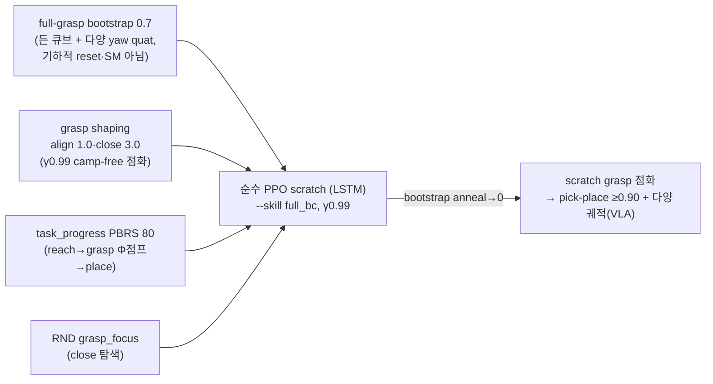
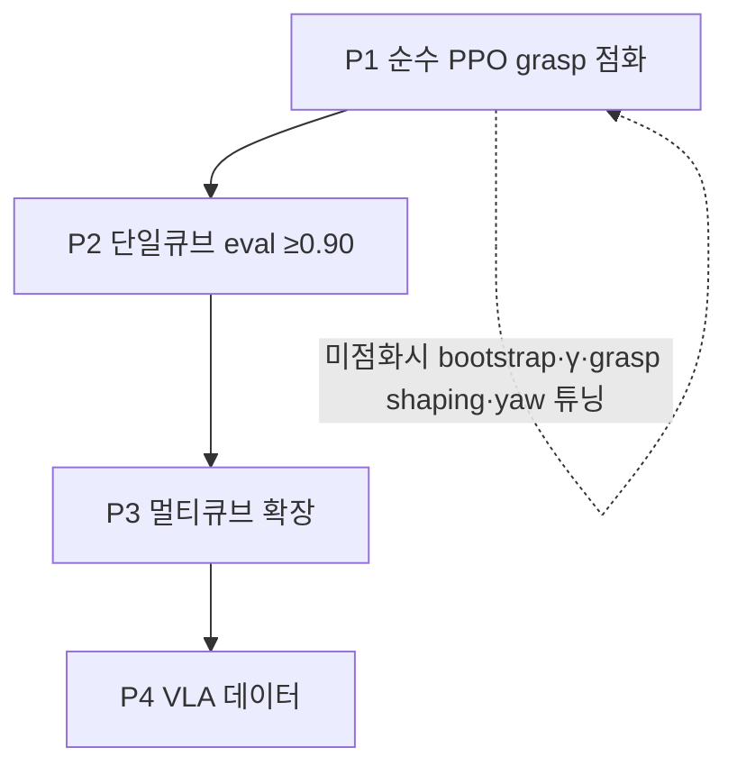
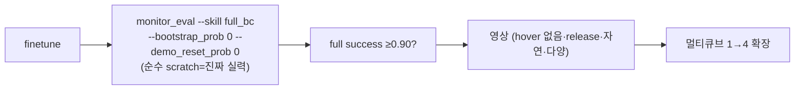
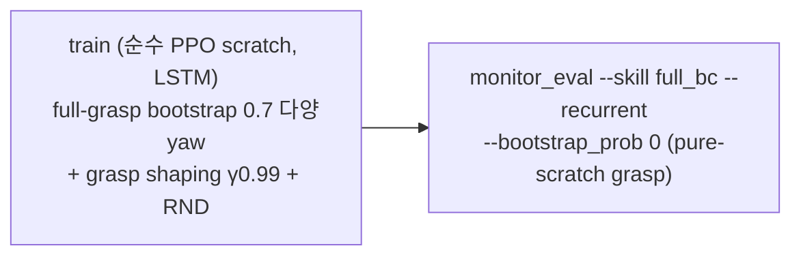

# SO-101 PickCube RL — 프로젝트 마스터 문서

> **한 줄 요약**: cube_desk 에서 SO-101 팔이 큐브를 집어 그릇에 넣는 **pick-and-place 정책을 RL 로 학습**한다. 용도는 **VLA 학습 데이터 생성**. 현 전략 = **LSTM + 순수 PPO scratch + full-grasp bootstrap(높은 비율 + 다양한 held-cube 쿼터니온)**. SM·BC·demo-reset 전부 미사용(사용자 지시 2026-06-13).
>
> **현재 상태**: 🔵 **순수 PPO scratch** 진행 중 (`lstm_ppo_gb`, `--skill full_bc --recurrent`, BC resume 없음). grasp_bootstrap **0.7**(full-grasp 든 큐브 + 다양 yaw / pregrasp_frac 0.3) anneal→0 over 1200 + grasp shaping(align 1.0·close 3.0, γ=0.99 camp-free) + task_progress PBRS + RND grasp_focus. grasp_bootstrap 은 기하적 reset(default 자세 grasp point)이라 SM 데이터 아님 → 허용. **순수 PPO라 grasp 점화에 시간 소요(감안).**
> **핵심 발견(검증)**: ① **scratch grasp 점화 = camp/dense 의 근본 trade-off + γ 가 분기점**: dense grasp_close camp value = w/(1−γ). γ0.997 → ×333 ≫ terminal = camp(8회 실패). **γ0.99 → ×100 < terminal = camp-free 점화 가능**. ② **`_grasp_offset` 프레임 버그(수정)**: grasp_bootstrap 이 큐브를 jaw-gripper 중점에 놓았으나 grasp_close 보상 기준은 jaw+JAW_GRASP_OFFSET(손가락 point) — ~7cm 어긋나 **grasp_close/align reward 가 항상 0(점화 레버 死)**. 두 점을 동일 공식으로 정합. ③ **BC(MLP/LSTM)·demo-reset·grasp-bootstrap-camp-free 모두 scratch grasp 못 점화**(메트릭+영상 확정) → 순수 PPO + grasp shaping(레버 부활) + bootstrap 으로 복귀.
> **작성 기준**: 2026-06-13. 이 문서는 프로젝트 전체를 총망라하는 단일 진입점이다. 세부 실험 이력은 [`RL_LSTM_PICKCUBE.md`](RL_LSTM_PICKCUBE.md)(T1~T39).
>
> **⚠️ 전략 변천(2026-06-12~13)**: scratch-only(C3/C4/C5) 폐지 → BC-MLP → LSTM-BC+reverse-curriculum → (BC/SM 가 scratch grasp 못 점화 확정) → **사용자 지시: SM·BC 미사용, 순수 PPO + full-grasp bootstrap(grasp_v4 가 유일하게 점화시킨 구조)으로 회귀**. §4·§6·§8·§9 가 순수-PPO 기준. 구 skill-chaining·BC 는 이력(§7).

---

## 0. 목차

1. [태그·중요도 범례](#1-태그중요도-범례)
2. [목표와 용도](#2-목표와-용도)
3. [제약 (엄수)](#3-제약-엄수)
4. [아키텍처: Skill Chaining](#4-아키텍처-skill-chaining)
5. [실행 환경](#5-실행-환경)
6. [계획 & 칸반 보드](#6-계획--칸반-보드)
7. [타임라인 & 구간별 결과](#7-타임라인--구간별-결과)
8. [주요 결정사항 (Decision Log)](#8-주요-결정사항-decision-log)
9. [주요 설정 (Configs)](#9-주요-설정-configs)
10. [트러블슈팅](#10-트러블슈팅)
11. [검증 방법](#11-검증-방법)
12. [재현 절차](#12-재현-절차)
13. [참고 자료](#13-참고-자료)

---

## 1. 태그·중요도 범례

문서 곳곳에 작업 상태(칸반)와 중요도를 배지로 단다.

### 상태 태그 (Kanban)

| 배지 | 의미 |
|---|---|
| 🟢 **DONE** | 완료 + 검증됨 (smoke/eval 로 동작 확인) |
| 🔵 **IN-PROGRESS** | 현재 진행 중 (학습/구현 중) |
| ⚪ **TODO** | 예정 — 아직 착수 안 함 |
| 🔴 **BLOCKER** | 막힘 — 해결돼야 다음으로 진행 가능 |
| ⚫ **DROPPED** | 시도했다 폐기 — 교훈만 남기고 버림 (재현 대상 아님) |

### 중요도

| 배지 | 의미 |
|---|---|
| 🔥 **CRITICAL** | 프로젝트 성패에 직결 — 틀리면 전체가 막힌다 |
| ⭐ **HIGH** | 중요 — 결과 품질·일정에 큰 영향 |
| (무표시) | 일반 |

---

## 2. 목표와 용도


- 🔥 **최종 목표**: cube_desk **4-큐브 pick-and-place**, **DR-on 성공률 ≥ 0.90** 인 RL 정책.
- **용도**: **VLA(Vision-Language-Action) 학습용 데이터 생성**. privileged 상태 기반 RL 이 SM(state machine)보다 다양하고 자연스러운 궤적을 효율적으로 만들고 → 카메라 부착 → VLA 데이터셋. **실기기 배포는 VLA 담당** → RL 정책의 sim2real DR 강투입은 저우선(물리/시각 DR 은 궤적 다양성용으로만 유지).
- **현실 경로**: 단일 큐브 ≥0.90 먼저 → 커리큘럼 1→2→3→4 (큐브당 97.4% 산술벽).

---

## 3. 제약 (엄수)

| # | 제약 | 상태 | 이유 | 중요도 |
|---|---|---|---|---|
| C1 | 🚫 grasp weld / attach / 인공 유지력 추가 금지 | ✅ **유지** | 물리적으로 정직한 grasp 만 허용 (sim2real·VLA 데이터 validity) | 🔥 |
| C2 | 🚫 `BOWL_SUCCESS_RADIUS=0.06` · `container_radius_scale=1.0` 불변 | ✅ **유지** | 성공 판정 기준을 느슨하게 해 점수 부풀리기 금지 | 🔥 |
| C3 | 각 skill = 고정 config 단일 scratch run | ⚫ **폐지(2026-06-12)** | 학습 시간 과다 → resume·mid-run 튜닝 허용으로 전환 | — |
| C4 | 실패 시 config 만 고쳐 scratch 전체 재시작 (mid-run 변경 금지) | ⚫ **폐지(2026-06-12)** | "수단·방법 안 가림"(사용자) → 빠른 iteration 우선 | — |
| C5 | policy 는 scratch, BC/resume 금지 (demo-reset 만 허용) | ⚫ **폐지(2026-06-12)** | BC warmstart 가 핵심 레버가 됨 (D11) | — |
| **C6** | 🚫 **SM 정보·BC 미사용, 순수 PPO** | ✅ **유지(2026-06-13)** | 사용자 지시 — BC/SM-demo 가 scratch grasp 못 점화 확정. grasp_bootstrap(기하적 reset)은 SM 아니라 허용 | 🔥 |

> **C1/C2/C6 엄수.** C1/C2 = 결과 validity(grasp weld=가짜 물리, 성공반경=가짜 성공률 → VLA→실기기 목적 자기파괴). **C6 = 사용자 방법론 지시**(SM·BC 가 grasp 못 풀고 inference-기반 시도 반복 실패 → 순수 PPO+bootstrap 으로). grasp_bootstrap 은 default-자세 grasp point 로 큐브를 teleport 하는 기하적 reset 이라 SM 데이터·BC 가 아님.
>
> **C3/C4/C5 폐지 맥락**: scratch-only 규율이 8회 재시작 강제 + grasp 점화 못 풂 → 사용자가 폐지·"수단방법 안 가림"으로. 이후 BC 시도했으나 scratch grasp 점화 실패(§7) → 사용자가 **BC/SM 도 폐기, 순수 PPO 로**(C6).

---

## 4. 아키텍처: 순수 PPO scratch + full-grasp bootstrap (LSTM)

BC(MLP/LSTM)·demo-reset 이 모두 scratch grasp 점화에 실패(메트릭+영상 확정) 후 사용자 지시로 **SM·BC 폐기, 순수 PPO 로 회귀**(C6). grasp_v4 가 유일하게 scratch grasp 점화(0.107)시킨 구조 = **LSTM+PPO + full-grasp bootstrap + grasp shaping + RND**. 여기에 ① **γ=0.99**(dense grasp shaping 을 camp-free 로 만드는 분기점) ② **`_grasp_offset` 프레임 수정**(점화 레버 부활) ③ **다양한 held-cube 쿼터니온**(robust·다양 궤적)을 추가.



| 요소 | 역할 | 핵심 |
|---|---|---|
| **full-grasp bootstrap** | 든 큐브 상태 시연 → 하류(lift→transport→place) 학습, anneal 로 점차 정책이 grasp 수행 | `grasp_bootstrap_prob 0.7` anneal→0 over 1200. full-grasp(`_grasp_offset`=jaw+JAW_GRASP_OFFSET=손가락 grasp point, **수정됨**)에 큐브 + **다양 yaw 쿼터니온**(wrist_roll 정합 → grip 유효) / pre-grasp(frac 0.3, 그리퍼 open→닫기 연습) |
| **grasp shaping** | scratch grasp 점화(dense) | grasp_align 1.0 + grasp_close 3.0. **γ=0.99 라 camp-free**(camp value 3.0×100=300 < terminal ~350). grasp_v4 가 유일하게 점화시킨 레버 |
| **task_progress PBRS** | reach→grasp(Φ점프)→lift→transport→inside 단조 진행 보상 | `task_progress_pbrs 80`, camp-free spine |
| **RND grasp_focus** | grasp close 탐색(scratch 탐색 보조) | `--rnd --rnd_weight 0.5 --rnd_state_group grasp_focus` |

**왜 이 구조**: scratch grasp 점화는 **dense grasp 신호 필요(camp-free Φ점프만으론 약해 점화 실패) + dense 는 γ0.997 서 camp**. **γ=0.99 가 이 모순을 해소**(dense camp value < terminal). full-grasp bootstrap 이 하류를 시연·anneal 로 grasp 압력. `_grasp_offset` 수정으로 grasp shaping reward 가 실제로 작동(이전엔 프레임 어긋나 0). **순수 PPO scratch 라 점화에 시간 소요(감안).**

> **이력 아키텍처(폐기)**: ① skill-chaining(skill1/skill2 scratch) — grasp 미점화. ② BC warmstart(MLP→LSTM)+demo-reset reverse curriculum — BC 가 precision grasp clone 못 함, finetune 이 reach 마저 passivity 로 퇴화. 교훈·코드(`apply_skill_acquire/place`, `bc_warmstart.py`, `run_skill_chain.sh`)는 §7·잔존. 현 전략은 `apply_skill_full_bc`(grasp shaping 포함) + `run_expert_policy.sh train`.

---

## 5. 실행 환경

| 항목 | 값 |
|---|---|
| 서버 | Ubuntu 24.04.3, Intel Core Ultra 5 245K, 128GB RAM |
| GPU | RTX PRO 5000 Blackwell **48GB** (RT 코어 필수 — Isaac Sim 5.1 요구) |
| 스택 | Isaac Sim 5.1 / IsaacLab 2.3 / rsl_rl PPO / `ManagerBasedRLEnv` |
| Python | worktree venv 없음 → `$ROOT/.venv/bin/python` + `PYTHONPATH=$(pwd)/src` |
| 학습 outputs | **main repo** `$ROOT/outputs/rl/rsl_rl/...` (worktree 아님! `--log_root_path $ROOT/...`) |
| 데모 | worktree `outputs/demos/` |
| 부팅 | `OMNI_KIT_ACCEPT_EULA=YES`, `--headless` |
| GPU 메모리 | 학습 ~11–14GB (4096 env). GPU 1장 공유 — eval 동시 실행 시 kit-lock 경합으로 부팅 지연(정상) |

> `$ROOT = /home/konan147/Workspaces/SO101-Sim2Real`, worktree = `$ROOT/.claude/worktrees/lstm-ppo-pickcube`

**운영 함정**: `pkill` 신뢰 불가 → `kill -9 <PID>` 직접 + `nvidia-smi --query-compute-apps` 로 점유 확인.

---

## 6. 계획 & 칸반 보드



| 단계 | 상태 | 중요도 | 내용 | 완료 기준 |
|---|---|---|---|---|
| **P1 순수 PPO grasp 점화** | 🔵 IN-PROGRESS | 🔥 | `run_expert_policy.sh train` (`lstm_ppo_gb`): LSTM 순수 PPO scratch + grasp_bootstrap 0.7(다양 yaw)+grasp shaping(align1/close3, γ0.99)+task_progress+RND. `_grasp_offset` 수정 후 | scratch grasp 점화(pure-scratch eval grasp>0 → 상승) |
| **P2 단일큐브 eval** | ⚪ TODO | 🔥 | `monitor_eval.py --skill full_bc --recurrent --bootstrap_prob 0` | success ≥0.90 + 영상 자연(hover 없음·release) |
| **P3 멀티큐브 확장** | ⚪ TODO | ⭐ | active_objects 1→4 (resume 허용) | 4큐브 ≥0.90 (DR-on) |
| **P4 VLA 데이터** | ⚪ TODO | | `rollout_to_lerobot.py` → LeRobot v3 (3-cam 부착) | 데이터셋 로드·궤적 자연·다양 |

> **현재 관문 = P1 grasp 점화.** 순수 PPO scratch 라 **시간 소요(감안)**. `_grasp_offset` 프레임 수정으로 grasp shaping reward(점화 레버) 부활 검증 중. 추적 = checkpoint pure-scratch eval grasp. **순수 PPO 는 긴 학습**이라 watch 간격 길게(수백 iter). 미점화 시 튜닝: grasp_close weight·γ·pregrasp_frac·yaw_max·bootstrap_prob·anneal.

---

## 7. 타임라인 & 구간별 결과

모두 2026-06-12 (UTC 기준 시각). skill1 reward recipe 를 scratch 테스트로 탐색하는 중.

| 시점 | 작업 | 상태 | 결과 / 교훈 |
|---|---|---|---|
| 12:1x | P0 배선 + smoke | 🟢 DONE | 양 프리셋 boot·reward weight·신규 종료/보너스 정확. monitor `get_term("success")` 버그 수정 |
| 12:19 | **skill1 v1** (place_pbrs off, forward 약) | ⚫ DROPPED | iter429 **grasp-camp**: over_bowl 0·grasp_close maxed·std 0.59 수렴. → grasp_close(3/step) hold income, 당김 없어 책상서 캠핑 |
| 13:20 | **skill1 v2** (forward 8·terminal 400·std reset 0.8, resume v1) | ⚫ DROPPED | escape 성공(lift 0.10)했으나 iter721 **std 폭주 1.6**·퇴행. → 희소 대형 terminal+std reset = 고분산 발산 |
| 13:33 | **skill1 v3** (place_pbrs 50 복원, resume v1 model_425) | ⚫ DROPPED | iter549 **std 폭주 1.54**·escape 못함. → camp 모델 resume = toxic + place_pbrs 가 운반 못하는 정책엔 progress 0 → blowup(v20 재현) |
| 14:23 | **skill1 scratch1** (v14 full dense + place_pbrs, clean scratch) | ⚫ DROPPED | iter369 **grasp-camp**: grasp_close 0.9 maxed·lift 0.05→0.016 역행·over_bowl~0·std 0.58 안정. → place_pbrs/forward 가 camp 못 깸 |
| 15:0x | **skill1 scratch2** (forward 강화 guided_lift5/carry6/transport5, dip-bridge) | ⚫ DROPPED | iter261 again camp: 초기 lift 0.2(bootstrap 발) → 0.04 역행·over_bowl~0·std 0.55 안정. → forward weight 튜닝으론 camp 못 깸 |
| 16:1x | **skill1 scratch3** (`task_progress_pbrs 40` 단독, per-step 보상 거의 0) | ⚫ DROPPED | std 안정 BUT **cube_lost 25%**(파괴)·grasp_align≈0·점화 실패. → grasp shaping 다 빼니 큐브 마구 침 |
| 16:4x | **skill1 scratch4** (scratch3 + reach0/align2/close1, episode 8s, cube_predisturb−5) | ⚫ DROPPED | **cube_lost 36%**(악화)·grasp_align/close=0·접근 실패. → 그리퍼 init 0.20(닫힘)이라 align 死+닫힌 채 ram |
| 17:1x | **skill1 scratch5** (순수 camp-free: `task_progress_pbrs 80` 단독 + **그리퍼 init 0.70 OPEN** + cube_predisturb−5 + bootstrap0.6) | ⚫ DROPPED | iter96 **확정 실패**: cube_lost 0→**56%**(scratch3/4보다 악화)·std 0.51→1.17 발산·task_progress 음수(점화 0). → pure telescoping PBRS 는 grasp **유지**(maintenance)를 0 보상 → 못 잡고 떨굼. scratch reward-shaping 한계 확정 |
| ~18:00 | **전략 전환** (사용자) — scratch-only 폐지, "수단·방법 안 가림" | — | 8회 실패 + 시간 과다 → C3/C4/C5 폐지. BC warmstart + 단일정책 + resume/mid-run 자유로 재설계(D10/D11). 리서치(IndustReal/RFCL/DAPG/residual) 반영 |
| 18:1x | **E0 SM 데모** (`--record_demos` 1-cube) | 🟢 DONE | 1751 성공 전궤적(SM 85%) → `outputs/demos/sm_c1`. obs87/action6 = RL 정합 |
| 18:2x | **E1 MLP-BC** (`bc_warmstart`, APPROACH~RELEASE_DWELL) | ⚫ 약함 | final_loss 0.018, **scratch reach 0.078·grasp 0** |
| 18:3x | **E2 MLP finetune 1차** (entropy 0.005) | ⚫ 재시작 | iter183 std 0.50→0.84 creep·success 0.47→0.37. → entropy 과함 |
| 18:5x | **E2 MLP finetune 2차** (entropy 0.001) | ⚫ DROPPED | iter303 std 0.40→**0.26 붕괴**·success 0.46→0.30. **pure-scratch eval(model_300) grasp 0** → MLP-BC+RL 이 scratch grasp 점화 못 함 확정. demo-reset 의존 |
| 22:1x | **E1 LSTM-BC** (`bc_warmstart --recurrent`, 시퀀스 clone) | 🟢 DONE | final_loss **0.0103**. **pure-scratch reach 0.078→0.32(4x)**·grasp 0. → recurrent 가 stateful SM(q_bias/phase) 훨씬 잘 clone(가설 확인). grasp 는 BC 만으론 0(precision 한계) |
| 22:5x | **E2 LSTM finetune** (demo-reset 0.4, entropy 0.003→0.001) | ⚫ DROPPED | iter125 pure-scratch eval **reach 0.32→0.03·grasp 0** — finetune 이 demo-reset 의존 학습, BC reach 마저 passivity 로 퇴화(영상: 팔 들고 정지). demo-reset/grasp-bootstrap curriculum 이 advantaged-start 의존 유발 확정 |
| 23:0x | **grasp-bootstrap 중심** (γ0.99, demo-reset 폐기, grasp_close 3.0) | ⚫ 진단 | grasp_close reward **0.0000** — bootstrap 든 큐브인데도. → `_grasp_offset`(중점) ≠ grasp_close 기준(jaw+offset) **프레임 버그** 발견 |
| 23:1x | **사용자 지시: SM·BC 폐기, 순수 PPO** + full-grasp bootstrap↑ + 다양 yaw quat | — | "LSTM+PPO+full grasp bootstrap 됐던 걸로 기억" + "물리적으로 가능한 큐브 쿼터니온 다양화". BC·SM·demo-reset 전부 제거(C6) |
| 23:2x | **`_grasp_offset` 프레임 수정** + 다양 yaw bootstrap + grip 영상 검증 | 🔵 진행 | bootstrap 든 큐브 = 손가락 grasp point(JAW_GRASP_OFFSET) 정합 → grasp shaping reward 부활. diverse yaw+wrist_roll grip 유효(cube_lost 낮음 확인) |
| 23:3x | **P1 순수 PPO** (`lstm_ppo_gb`: bootstrap 0.7 다양yaw + align1/close3 γ0.99 + RND) | 🔵 IN-PROGRESS | 순수 PPO scratch(BC 없음). grasp_close reward>0 부활 검증 → scratch grasp 점화 추적. **순수 PPO라 시간 소요(감안)** |

**핵심 진단(확정·정교화)**: skill1 은 **점화 vs camp 의 근본 trade-off**에 막혀 있다.
1. **grasp-camp** 🔥 — per-step *상태* 보상(reach/align/close/lift/carry — 어떤 상태에 있음을 보상)은 무엇이든 그 상태서 camp. **γ=0.997 → "영원히 holding" 가치 = income/(1−γ) = income×333 ≫ terminal**. 그래서 forward weight·episode 길이로는 산술적으로 못 이긴다(v1·scratch1·scratch2 검증).
2. **ram/cube_lost** 🔥 — camp 피하려 per-step 상태보상 다 빼면(scratch3/4) **gentle grasp shaping 도 사라져** 정책이 큐브를 쳐서 떨굼(cube_lost 25~36%). 추가로 그리퍼 init 0.20(닫힘)이라 닫힌 채 ram + grasp_align(open 필요) 死.
3. **std 폭주** — 희소 대형 terminal / std 강제 reset / camp 모델 resume / PBRS 단독(progress 0). scratch + sustained bootstrap 으로 회피(scratch3~5 std 안정).

> **누적 교훈**: camp-free 한 보상은 **telescoping PBRS·terminal·penalty 뿐**(per-step 상태보상은 전부 camp 유발). 따라서 spine 은 `task_progress_pbrs` 단독, gentle grasp 는 **그리퍼 open init**(열고 접근→닫기)+anti-ram penalty 로 유도. pure-telescoping 이 scratch grasp 를 점화할 수 있는지가 scratch5 의 관문. 실패 시 **BC warmstart**(SM 시연 clone→RL)로 점화 우회.

---

## 8. 주요 결정사항 (Decision Log)

| # | 결정 | 근거 | 주체 |
|---|---|---|---|
| D1 | 단일정책 포기 → **명시적 Skill Chaining** | 15차 단일정책이 place hover 로 막힘 | 사용자 |
| D2 | **두 skill 모두 scratch 학습** (resume 금지) | 재현성 + resume 불안정(3연속 blowup) 실증 | 사용자 |
| D3 | **단일 scratch run 으로 완성 skill 도달**하는 config 를 테스트로 설계 | 재현성 — 매 학습은 scratch, 반복하는 건 config 설계 | 사용자 |
| D4 | skill2 init = **skill1 롤아웃 over-bowl 상태** demo-reset | handoff 분포 정합 → 전이 자연스러움(VLA 품질) | 사용자 |
| D5 | 전 과정을 **단일 재현 파이프라인 스크립트**로 묶음 | "이 과정 전부를 하나의 학습 과정으로" | 사용자 |
| D6 | 설계 latitude 확대 — reward dense/sparse, 직관적 reward 추가, num_envs, **MLP 등 arch 교체 허용** | 과감한 탐색 허용 | 사용자 |
| D7 | (검토중) **MLP 채택** 기울임 — obs 87-dim privileged = near-MDP, LSTM 불필요·불안정만 추가 | RL policy arch 자유(VLA 가 vision 담당) | 에이전트 제안 |
| D8 | skill1 점화 = **순수 camp-free**(telescoping PBRS 단독) + **그리퍼 open init** | 8회 실패로 'per-step 상태보상=camp / 제거=ram' tension 확정. rl-expert 자문: align死=그리퍼 닫힘 init | 에이전트(rl-expert) |
| D9 | (contingency) scratch5 도 점화 실패 시 **BC warmstart**(SM 시연 clone→RL finetune) | pure-telescoping 이 scratch grasp 못 점화하면 우회. `bc_warmstart.py` 존재. 단일 절차로 묶어 재현 보존 | 에이전트 |
| **D10** | **scratch-only(C3/C4/C5) 폐지** — resume·mid-run 튜닝·BC·단일정책 모두 허용 | scratch5 = 8회째 실패 + 학습 시간 과다. "수단·방법 안 가리고 pick-place 되는 RL expert 만들라" | **사용자** |
| **D11** | **BC warmstart → reverse-curriculum RL finetune 단일 end-to-end 정책** 채택 | 13+회 실패 공통 누락 = expert ACTION 미주입. SM 1751 demo BC clone + demo-reset RFCL + camp-free `full_bc` 보상. 리서치(IndustReal sim2real 83~99%·RFCL·DAPG·residual 비교) 근거. skill-chaining 폐기(데모 시 단일정책 우세) | 에이전트(리서치) |
| **D12** | (폐기) MLP 시도 → **LSTM 으로 전환** | MLP-BC 가 stateful SM(q_bias 적분+phase) clone 못 함: pure-scratch grasp 0, finetune 점화 실패(검증) | 에이전트 |
| **D13** | **LSTM-BC + LSTM finetune** 채택 | `bc_warmstart.py` 에 `--recurrent` 시퀀스 BC 추가(per-trajectory, hidden 연속). reach 0.078→0.32(4x) — recurrent 가 stateful clone 우월. 원프로젝트 LSTM 선택과 정합. residual RL 은 SM 미벡터화(per-env Python loop)로 4096env in-loop 비현실적이라 후순위 | 에이전트 |
| **D14** | BC finetune entropy **0.003** | 0.005=std creep(0.84)·success↓ / 0.001=std collapse(0.26)·success↓. 중간값 | 에이전트 |
| **D15** | **SM·BC 폐기, 순수 PPO + full-grasp bootstrap**(C6) | BC(MLP/LSTM)·demo-reset 모두 scratch grasp 점화 실패(reach 0.32→0 퇴화, 영상 확정). grasp_v4 가 유일 점화시킨 구조(LSTM+PPO+grasp_bootstrap+shaping+RND)로 회귀. bootstrap 비율↑·다양 yaw quat 추가 | **사용자** |
| **D16** | **`_grasp_offset` 프레임 수정** (점화 레버 부활) | grasp_bootstrap 큐브 배치점(jaw-gripper 중점) ≠ grasp_close 보상 기준(jaw+JAW_GRASP_OFFSET=손가락 point), ~7cm 어긋나 grasp_close/align reward 항상 0. 동일 공식 정합 → grasp shaping 작동 | 에이전트 |
| **D17** | **γ=0.99 + full-grasp bootstrap 다양 yaw 쿼터니온** | γ0.99 가 dense grasp_close 를 camp-free 로(camp value ×100<terminal). 든 큐브 yaw 다양화(wrist_roll 정합 grip 유효)로 하류 robust + 다양 궤적(VLA). 물리 유효(cube_lost 낮음 확인) | 에이전트 |

---

## 9. 주요 설정 (Configs)

### 9.1 보상 (`apply_skill_full_bc`) — 순수 PPO grasp 점화 ⭐🔥

grasp shaping(점화 dense) + camp-free spine. **γ=0.99** 가 dense 를 camp-free 로 만듦(camp value w/(1−γ): grasp_close 3.0×100=300 < terminal ~350).

| 그룹 | 항(weight) |
|---|---|
| **grasp 점화(dense)** | **grasp_align 1.0 + grasp_close 3.0** — γ0.99 라 camp-free. grasp_v4 가 유일하게 scratch grasp 점화시킨 레버. (`_grasp_offset` 프레임 수정으로 reward 작동·D16) |
| spine | **`task_progress_pbrs` 80** — full-task 단조 Φ(reach→grasp Φ점프→lift→transport→inside) |
| release/drop | over_bowl_drop_pbrs 16 · release 20 (PBRS+1회 bonus) |
| terminal | **task_success 200 (require_open=True**) · early_finish 100 |
| 페널티 | cube_predisturb −5 · bowl_disturb −3 · action_rate −1e-2 · joint_vel −1e-2 · time −0.02 |
| off | grasp_contact(ContactSensor)·pregrasp·guided_lift·grasp·carry·lift·transport·place_pbrs·place_height·insert·over_bowl_grasped_bonus |
| 그리퍼 init | 0.70 OPEN (bootstrap env 는 자체 덮어씀) |
| 종료 | base full-place success(cube in bowl) · episode 20s |

### 9.2 순수 PPO 명령 (`run_expert_policy.sh train`) ⭐

LSTM(`RECURRENT="--recurrent --rnn_type lstm --rnn_hidden_dim 256 --rnn_num_layers 1"`, no-norm). **BC·demo-reset 없음(C6).**

```
train.py --skill full_bc $RECURRENT --num_envs 4096 --num_steps_per_env 48 --gamma 0.99
  --entropy_coef 0.005 --grasp_bootstrap_prob 0.7 --grasp_bootstrap_prob_final 0
  --grasp_bootstrap_anneal_iters 1200 --grasp_bootstrap_pregrasp_frac 0.3
  --rnd --rnd_weight 0.5 --rnd_state_group grasp_focus --max_iterations 1500 --active_objects 1
```

> **full-grasp bootstrap 0.7**: 든 큐브(`_grasp_offset`=jaw+JAW_GRASP_OFFSET 손가락 point + **다양 yaw quat**, wrist_roll 정합 grip 유효) / pre-grasp(frac 0.3). `_bootstrap_grasp`(`pick_cube_env.py`) 가 reset 시 적용. (`bc`/`demos` stage 는 이력·미사용.)

### 9.4 (이력) 구 skill-chaining — `apply_skill_acquire`(skill1)·`apply_skill_place`(skill2)

> skill1(`apply_skill_acquire`): task_progress_pbrs 80 단독 + over_bowl_grasped_bonus 250 + 그리퍼 0.70 + cube_predisturb −5, per-step 전부 0, 종료 `over_bowl_grasped`·15s. **8회 scratch 실패로 폐기**(§7). skill2(`apply_skill_place`): place_pbrs 50·over_bowl_drop 24·release 30·task_success 200(require_open), 종료 `cube_placed_open`·5s. 코드 잔존(멀티스킬 재시도 시 참조용)이나 현 전략은 §9.1 사용.

### 9.3 PPO / 정책 (공통)

| 항목 | 값 |
|---|---|
| 알고리즘 | rsl_rl PPO, **ActorCriticRecurrent(LSTM)** — D13(MLP-BC 가 stateful SM clone 실패 → LSTM 전환) |
| obs | `rl_policy` 87-dim privileged (joint+ee+cube/bowl pose·vel·orientation) |
| 정책 | **LSTM hidden 256×1, MLP head [256,128] elu, obs_normalization OFF** (train/monitor/collect/chain/bc 5 스크립트 `--recurrent` 동기화 — 어긋나면 ckpt 로드 실패) |
| 규모 | num_envs **4096** · num_steps_per_env **48** · learning_epochs 6 · minibatch 4 |
| 최적화 | lr 1e-4 adaptive(KL 0.01) · **γ 0.99**(dense grasp camp-free 핵심·D17) · λ 0.95 · **entropy_coef 0.005**(scratch 탐색) · clip 0.2 |
| init | **순수 scratch**(BC resume 없음·C6). init_noise_std 0.5 |
| 신호 | **full-grasp bootstrap 0.7→0 over 1200**(다양 yaw quat) + **RND grasp_focus 0.5** + grasp shaping(점화) + task_progress(spine). demo-reset 없음 |

> **γ=0.99 가 핵심(D17)**: dense grasp_close camp value = w/(1−γ). γ0.997=×333≫terminal=camp(8회 실패) / γ0.99=×100<terminal=camp-free 점화. task_progress PBRS 가 dense local credit → 짧은 horizon OK.
> **고정 핀**: γ 0.99 · entropy 0.005 · **arch LSTM hidden256×1 + MLP[256,128] no-norm**, obs 87-dim — train/monitor_eval `--recurrent` 동기화(어긋나면 ckpt 로드 실패 — T27). `_grasp_offset` = `_get_gripper_pos` 공식 정합(D16, 어긋나면 grasp reward 死).

---

## 10. 트러블슈팅

| 현상 | 원인 | 해결 | 상태 |
|---|---|---|---|
| place 에서 큐브 안 떨굼, 그릇 위 hover (15차) | `grasp_close 3/step` 등 **per-step hold income** 이 누적 > terminal. 12cm 위로 들면 `~placed` 유지돼 계속 지급 | skill 분리 + place 단계서 grasp_close off | 🟢 진단완료 |
| skill1 grasp-camp / ram-cube_lost (scratch) | **per-step 상태보상**=camp(γ0.997, hold가치×333≫terminal) / 다 빼면 grasp shaping 소실=ram(cube_lost 25~56%). camp-free telescoping PBRS 는 grasp **유지**를 0 보상 → 못 잡음 | **scratch reward-shaping 으로 grasp 점화 불가 확정**(8회). → BC warmstart 로 expert action 직접 주입 | ⚫ scratch 폐기 → BC |
| **MLP-BC 가 stateful SM clone 못 함** (scratch grasp 0) | SM action = `q_cmd + q_bias`(중력보상 적분기, history 의존) + phase FSM → memoryless MLP 가 q_bias/phase 재현 못 함 → 체계적 droop + distribution shift. finetune(300iter)도 grasp 0 | **LSTM-BC**(`--recurrent` 시퀀스 BC) — hidden 이 q_bias/phase 적분 → reach 0.078→**0.32(4x)** | 🟢 LSTM 전환 |
| BC 로 grasp 미점화 + finetune 이 reach 퇴화 | precision grasp 는 action-MSE clone 부정확(grasp 0). demo-reset/grasp-bootstrap finetune 은 advantaged-start 의존 학습 → BC reach 0.32→0.03 퇴화(영상: 팔 정지=passivity, penalty 회피) | **BC·demo-reset 폐기, 순수 PPO + grasp shaping + bootstrap**(C6·D15) | ⚫ BC 폐기 → 순수 PPO |
| **grasp_close/align reward = 0** (든 큐브인데도) | grasp_bootstrap `_grasp_offset`(jaw-gripper 중점) ≠ grasp_close 보상 기준 `_get_gripper_pos`(jaw+JAW_GRASP_OFFSET 손가락 point), ~7cm 어긋남 → bootstrap 큐브가 보상 tolerance(0.05) 밖 → **점화 레버 死** | `_grasp_offset` 을 `_get_gripper_pos` 와 동일 공식으로 정합(D16) → grasp_close 0→nonzero | 🟢 수정 |
| dense grasp 점화 ↔ camp 모순 | dense grasp_close 가 점화엔 필수(camp-free Φ점프만으론 약함) but γ0.997 서 camp(camp value w/(1−γ)=×333≫terminal) | **γ=0.99**(×100<terminal) → dense 가 camp-free 점화(D17) + task_progress PBRS 가 dense local credit 로 짧은 horizon 보완 | 🔵 검증중(순수 PPO) |
| resume 발산 (구) vs BC resume (현) | **camp 된 scratch** 정책 resume = critic value 불일치 발산(구). BC resume 은 `--resume_without_optimizer`(actor 만, critic/optimizer 새로) → 발산 없음 | camp 모델 resume 금지, **BC resume 은 OK**(fresh critic) | 🟢 구분됨 |
| monitor `success` 가 cube_lost 오집계 | `done & ~time_out` 이 cube_lost(time_out=False) 포함 | `termination_manager.get_term("success")` 직접 조회 | 🟢 해결 |

> 새 에러 진단·수정 성공 시 [`TROUBLESHOOTING.md`](TROUBLESHOOTING.md) 에 (현상→오류→원인→해결→확인) 5블록으로 추가.

---

## 11. 검증 방법



| 지표 | 도구 | 합격선 |
|---|---|---|
| 단일큐브 full success | `monitor_eval.py --skill full_bc --recurrent --rnn_hidden_dim 256 --bootstrap_prob 0 --demo_reset_prob 0 --active_objects 1` | success ≥ 0.90 |
| grasp 점화(E2 관문) | checkpoint pure-scratch eval (위 명령) | scratch grasp >0 → 상승 (BC 는 0) |
| 학습 건강도(중간) | finetune 로그: success 상승 + std 안정(creep/collapse 없음) + cube_lost↓ | demo_reset anneal(→0) 후에도 success 유지 |
| 정성 | 비디오 | hover 소멸·그릇에 release·튕김 없음·궤적 다양(VLA) |
| 멀티큐브 | `--active_objects 4` (DR-on) | 4큐브 ≥0.90 |

> **`--bootstrap_prob 0 --demo_reset_prob 0` = 순수 scratch-start = 진짜 실력.** 그게 판정 지표. demo_reset/bootstrap 켠 학습 중 수치는 advantaged-start 포함이라 상한(참고용). **eval 은 학습과 동일 env(`--skill full_bc`, 그리퍼 0.70)로** — `--skill full`(그리퍼 0.20)은 init 불일치로 저평가.

---

## 12. 재현 절차

현 전략 = **순수 PPO scratch 단일 run** (BC·SM·demo-reset 없음·C6):

```bash
bash scripts/reinforcement_learning/run_expert_policy.sh train   # PYTHONPATH=worktree/src 자동
# (demos/bc stage 는 이력·미사용)
```



| 산출물 | 경로 |
|---|---|
| `train` | `…/lstm_ppo_gb/model_*.pt` (LSTM 순수 PPO) |
| eval | `monitor_eval.py --skill full_bc --recurrent --rnn_hidden_dim 256 --bootstrap_prob 0 --demo_reset_prob 0 --active_objects 1` |

> **순수 PPO scratch 라 grasp 점화에 시간 소요** — watch 간격 길게(수백 iter). 핵심 코드: `pick_cube_env.py::_bootstrap_grasp`(다양 yaw·`_grasp_offset` 정합)·`apply_skill_full_bc`(grasp shaping)·`train.py --grasp_bootstrap_pregrasp_frac`.

> **resume/mid-run 튜닝 자유**(C3/C4 폐지). finetune 약하면 `--demo_reset_prob`↑·`--demo_anneal_iters`↑(grasp-phase 집중)·residual RL(SM 벡터화 필요)·**SM 데모 직접 VLA 데이터화**(SM 85%, 실목표 unblock) 로 피벗. 구 skill-chaining 절차(`run_skill_chain.sh`)는 이력으로 잔존.
>
> **운영**: `$ROOT/outputs` → `/DISK1/.../lerobot_outputs` 심링크(학습 산출물). 학습은 main repo `.venv` + `PYTHONPATH=worktree/src`(editable install 은 main repo src=구버전 가리킴 → override 필수). ad-hoc `monitor_eval` 직접 실행 시 `PYTHONPATH`·`OMNI_KIT_ACCEPT_EULA` 누락 주의.

- 각 stage = 앞 산출물 자동 연결(demos→bc→train). resume·mid-run 튜닝 허용(C3/C4 폐지).
- 관련 파일: `run_expert_policy.sh`, `bc_warmstart.py`, `train.py`(`--skill full_bc`), `monitor_eval.py`(`--skill full_bc`), `pick_cube_env_cfg.py`(`apply_skill_full_bc`), `pick_cube/mdp/{rewards,terminations}.py`, `pick_cube_env.py`(`_bootstrap_demo`).

---

## 13. 참고 자료

| 분류 | 자료 |
|---|---|
| 내부 — 전체 이력 | [`RL_LSTM_PICKCUBE.md`](RL_LSTM_PICKCUBE.md) (T1~T39: grasp 점화·hover 진단·재설계) |
| 내부 — 환경/구조 | [`../AGENTS.md`](../AGENTS.md), [`GRASP_PHYSICS.md`](GRASP_PHYSICS.md), [`TROUBLESHOOTING.md`](TROUBLESHOOTING.md) |
| 내부 — 현 전략 스크립트 | **`run_expert_policy.sh train`**(순수 PPO)·`train.py`(`--skill full_bc`·`--grasp_bootstrap_*`)·`monitor_eval.py`·**`pick_cube_env.py`**(`_bootstrap_grasp`: 다양 yaw·`_grasp_offset` 정합)·`pick_cube_env_cfg.py`(`apply_skill_full_bc`: grasp shaping) |
| 내부 — 이력 스크립트 | `bc_warmstart.py`·`run_skill_chain.sh`·`collect_skill1_states.py`·`eval_chain.py` (BC·skill-chaining, 미사용) |
| 외부 — grasp 점화 참조 | **grasp_v4**(자체 이력, LSTM+PPO+grasp_bootstrap+grasp shaping+RND 가 유일하게 scratch grasp 0.107 점화) |
| 외부 — Isaac Lab manipulation | **Lift-Cube**(gating: grasp 후에만 lift 보상) · **Factory/Forge**(γ0.99~0.998·contact-rich) |
| 외부 — camp/γ | camp value = w/(1−γ): per-step 보상의 hold 가치. γ↓ → camp 약화(dense 점화 가능). horizon vs camp trade-off |

---

> **다음 갱신 시점**: P1 순수 PPO grasp 점화 판정 후(pure-scratch grasp >0 상승 → success≥0.90, 또는 튜닝/피벗), P2~P4 진행마다 §6 칸반·§7 타임라인·§9 config 갱신.
