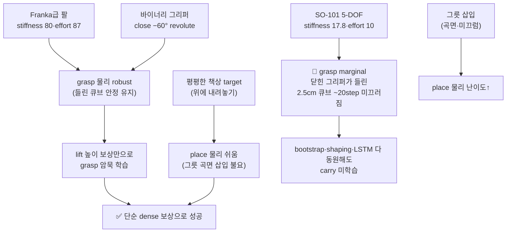

# PickCube RL — 성공 레퍼런스(`ref_repos/pick_and_place`) 대비 차이 분석

> **한 줄 결론**: 레퍼런스는 **Franka급 6-DOF 팔 + 바이너리 그리퍼**로 **평평한 책상 위 target_region 에 큐브를 내려놓는** 표준 IsaacLab Lift-Cube 레시피다. 우리 프로젝트의 블로커(SO-101 약한 그리퍼가 들린 큐브 못 잡음 + 그릇 삽입)를 **로봇·태스크 선택 단계에서 회피**했기에 성공했다. 즉 "RL 레시피가 더 좋아서"가 아니라 **물리·태스크 난이도가 본질적으로 낮아서** 성공한 것. 레퍼런스의 RL 기법(bootstrap·grasp shaping·LSTM·success bonus 전부 없음)은 우리보다 **훨씬 단순**하다.
>
> **작성 기준**: 2026-06-18. 대상: `ref_repos/pick_and_place` (success 확인됨) vs `docs/PICKCUBE_RL_PROJECT.md`.

---

## 1. 레퍼런스 레포 정체

표준 IsaacLab `manipulation/lift` 태스크를 그대로 가져와 **place 보상 4종만 추가**한 것. 파일도 `lift_place_env_cfg.py`·`custom_arm/joint_pos_place_env_cfg.py`로 IsaacLab Lift-Cube 템플릿 구조 그대로.

| 항목 | 값 |
|---|---|
| Gym ID | `Isaac-Lift-Cube-Place-Custom-Arm-v0` |
| 진입점 | `isaaclab.envs:ManagerBasedRLEnv` (우리와 동일 베이스) |
| 학습 | `IsaacLab/scripts/.../rsl_rl/train.py --num_envs 4096 --max_iterations 4000` |
| 로봇 | **cumotion_arm** — 6-DOF 팔 + 1 hand joint (총 7축). Franka급 |
| 태스크 | 큐브를 들어서 **책상 위 빨간 평면 마커(target_region)** 로 운반 후 내려놓기 |

**핵심: 이건 SO-101 도 아니고 그릇도 아니다.** 다른 로봇·다른 태스크.

---

## 2. 핵심 차이 표 (성공 ↔ 막힘)

| 차원 | 레퍼런스 (✅ 성공) | 우리 (🔴 grasp 물리 막힘) | 영향 |
|---|---|---|---|
| **로봇** | cumotion_arm 6-DOF + hand joint | SO-101 5-DOF + 그리퍼 | 🔥 |
| **팔 액추에이터** | effort 87 / **stiffness 80** / damping 4 | effort 10 / **stiffness 17.8** / damping 0.6 | 🔥 |
| **그리퍼** | **BinaryJointPositionAction** (open 0° / close −60° 단일 revolute hand joint) | 연속 평행 그리퍼, 물리 marginal | 🔥 |
| **place 타겟** | **평평한 책상 위 kinematic 빨간 cuboid** (위에 내려놓기) | **그릇**(곡면 벽, 안에 떨구기) | 🔥 |
| **성공 판정** | obj xy<0.025 & z<0.03 (책상에 안착) | 큐브 in bowl, radius 0.06 | 🔥 |
| **정책 arch** | **MLP [128,64,32]** + obs_normalization ON | **LSTM 256×1** no-norm | ⭐ |
| **gamma** | **0.98** | 0.99 (일부 항 0.997) | ⭐ |
| **obs** | **27-dim** (joint pos/vel·obj pos·target pos·last action) | **87-dim** privileged (+orientation·vel) | ⭐ |
| **bootstrap** | **없음** (순수 scratch) | full-grasp bootstrap 0.7 anneal | 🔥 |
| **grasp shaping** | **없음** (lift 높이 보상이 암묵적 grasp 신호) | grasp_align/close tolerance 명시 | 🔥 |
| **RND** | 없음 | RND grasp_focus 0.5 | — |
| **success bonus / 종료** | **없음** (5s 풀 에피소드, terminal 보상 0) | task_success 200 + early_finish | ⭐ |
| **에피소드 길이** | **5s** | 20~30s | ⭐ |
| **큐브 수** | 1개 | 1→4 커리큘럼 | — |
| **제어 주파수** | dt 0.01 (100Hz), decimation 2 → 50Hz | (유사) | — |

---

## 3. 보상 설계 비교

### 레퍼런스 — 전부 dense per-step, 6항. camp 없음.

```
reaching_object              w=1.0    1 - tanh(|obj-ee|/0.1)
lifting_object               w=30.0   (dist_to_target≥0.05 & h>0.04) * clamp((h-0.04)/0.05, 0,1)
object_target_region_tracking w=16.0  1 - tanh(|obj-target|/0.3)
object_lowering              w=7.0    1000 * (dist<0.05) * clamp(prev_h-cur_h, 0) * (1-tanh(dist/0.1))
action_rate                  w=-1e-4
joint_vel                    w=-1e-4
```

**왜 dense per-step 인데 camp 안 걸리나** (우리 프로젝트의 핵심 고민을 레퍼런스는 우회):

| 보상 | camp 방지 메커니즘 |
|---|---|
| `lifting_object` | ① **dist_to_target ≥ 0.05 게이트** — 타겟 근처서 들고 캠핑 불가 ② height `clamp(…/0.05)` **상한 캡** — 더 들어도 안 늘어 ③ 들려면 **잡아야** 함 = 암묵적 grasp 신호(별도 grasp shaping 불필요) |
| `object_lowering` | **delta 보상**(prev_h − cur_h) — 내려가는 **동안만** 일시 지급, 멈추면 0 → camp 불가 |
| `object_target_region_tracking` | 큐브를 타겟으로 가져갈수록 ↑ — 캠핑보다 진행이 이득 |
| **gamma 0.98** | camp value = w/(1−γ) 가 우리(0.997=×333)보다 훨씬 작음(×50) |

### 우리 — grasp 점화용 dense shaping + PBRS spine + bootstrap + RND + terminal. 훨씬 복잡.

camp 문제와 10+ run 싸운 끝에 "진짜 블로커는 grasp 물리"로 정정. 레퍼런스는 **grasp 가 쉬워서** camp/grasp 고민 자체가 작다.

---

## 4. 왜 레퍼런스는 성공하고 우리는 막혔나 (인과)



레퍼런스가 성공한 진짜 이유 3가지 (RL 기법 순위가 아님):

1. **그리퍼 그립력이 강하다** — stiffness 80 / effort 87 (Franka급). 우리 SO-101 은 17.8/10. **약 4.5× 약함.** 우리 프로젝트가 영상+diag 로 확정한 블로커("닫힌 그리퍼가 들린 큐브 못 버팀")가 레퍼런스 로봇에선 발생 안 함.
2. **바이너리 그리퍼** — open/close 2값만. 미세 그립각 학습 불요 → grasp shaping 없이도 lift 보상만으로 grasp 점화.
3. **place 타겟이 평면** — 책상 위 빨간 마커에 내려놓기. 우리는 곡면 그릇에 삽입(미끄럼·튕김). place 물리 난이도가 근본적으로 낮음.

> 결론: 레퍼런스의 단순 dense 보상은 **로봇·태스크가 쉬워서** 통한다. 같은 보상을 SO-101+그릇에 그대로 써도 우리 블로커(grasp 물리)는 안 풀린다.

---

## 5. 그래도 레퍼런스에서 가져올 수 있는 것 (적용 가능 레버)

우리 제약(C1 grasp weld 금지·C6 SM/BC 금지)을 지키면서 시도 가능한 항목:

| # | 레퍼런스 기법 | 우리 적용 가치 | 비고 |
|---|---|---|---|
| **A** | **`lifting_object` 의 dist-게이트 + height-cap** | ⭐⭐ camp-free lift 보상의 깔끔한 형태. 우리 task_progress 대비 단순·검증됨 | dist_to_target≥δ 게이트로 "타겟 근처 캠핑" 원천 차단 |
| **B** | **`object_lowering` delta 보상** | ⭐⭐ place 단계 camp-free 신호. **그릇 삽입에도 그대로 적용 가능** | prev_h−cur_h 는 그릇이든 책상이든 동일 |
| **C** | **gamma 0.98** | ⭐ 우리 0.99 보다 camp value 절반. dense 보상 쓸 거면 더 안전 | 단 horizon 짧아짐 — 20s 에피소드면 주의 |
| **D** | **bootstrap·RND·LSTM 다 제거하고 순수 dense MLP** | ⭐ 우리가 동원한 복잡 기법이 정말 필요한지 ablation. **단 grasp 물리부터 풀려야 의미** | grasp 물리 미해결 상태선 이것도 막힘 |
| **E** | **그리퍼 stiffness/effort 상향 실험** | ⭐⭐⭐ **블로커 직격**. 레퍼런스 80/87 ↔ 우리 17.8/10. SO-101 실기기 한계 내에서 최대화 | `GRASP_PHYSICS.md` 과제와 직결. 단 sim2real·VLA validity 고려(실기기 STS3215 한계) |
| **F** | **평면 place 타겟으로 태스크 단순화 후 그릇 복귀** | ⭐ 커리큘럼: 먼저 책상 평면 안착으로 carry 학습 → 그릇 전환 | C2(그릇 성공반경 불변)와 별개, 학습용 중간 단계 |

> **단, A~D 는 grasp 물리(E)가 풀린 뒤에야 효과 있음.** 레퍼런스 성공의 8할은 RL 보상이 아니라 **로봇 그립력 + 평면 place**다. 우리 블로커는 RL 영역이 아니라 물리 영역이라는 기존 진단(D25)을 레퍼런스 비교가 **재확인**한다.

---

## 5.5. 레퍼런스 정합 구현 (2026-06-18 적용)

사용자 요청으로 **reward·policy arch·gamma 를 레퍼런스와 동일하게** 맞춘 `ref` 스킬을 추가했다.
로봇/그리퍼/태스크(그릇)는 우리 것 유지 — 정합 대상은 RL 레시피 3종.

### leisaac stiffness/effort 확인 결과

`ref_repos/leisaac/source/leisaac/leisaac/assets/robots/lerobot.py` SO101_FOLLOWER_CFG:

| 액추에이터 | effort_limit_sim | stiffness | damping |
|---|---|---|---|
| sts3215-arm (5축) | 10 | **17.8** | 0.60 |
| sts3215-gripper | 10 | **17.8** | 0.60 |

→ **우리 프로젝트 값과 동일**(우리가 leisaac 기본을 그대로 copy). 레퍼런스 cumotion_arm(80/87)과는
4.5× 차이. leisaac 17.8 = STS3215 실기기 정합값이라 sim2real/VLA validity 위해 함부로 못 올림.
(LeKiwi 모바일베이스만 12.8/1.2 — SO-101 과 무관.)

### 무엇을 바꿨나

| 정합 항목 | 구현 |
|---|---|
| **reward** | `pick_cube/mdp/rewards.py` 에 레퍼런스 4함수 이식(`reaching_object_ref`·`lifting_object_dist_limit_ref`·`object_target_region_distance_ref`·`object_lowering_ref`), target_region→그릇 매핑·높이 DESK_TOP_Z 기준. `PickCubeRewardsCfg` 에 `ref_*` 4항(기본 weight 0) 등록. `apply_skill_ref` 프리셋이 reaching 1·lifting 30·tracking 16·lowering 7 + action_rate/joint_vel −1e-4 만 켜고 나머지(grasp shaping·PBRS·bootstrap·terminal) 전부 0. **success 종료 제거**(레퍼런스는 success 종료 없음 → 5s 풀 에피소드, tracking/lowering 누적). cube_lost(≈object_dropping) 유지. |
| **policy arch** | `train.py` `--policy_hidden_dims` CLI 신설(기본 [256,128]). ref 스테이지가 **[128,64,32]** + `--obs_normalization` + feedforward(NO `--recurrent`) + `init_noise_std 1.0`. |
| **gamma** | `--gamma 0.98`. + 레퍼런스 LiftCubePlacePPORunnerCfg 정합: entropy 0.006·lr 8e-5 adaptive·epochs 5·minibatch 4·num_steps_per_env 24·`--max_grad_norm 0.4`(CLI 신설)·lam 0.95. |

### 실행

```bash
bash scripts/reinforcement_learning/run_expert_policy.sh ref
# = train.py --skill ref --policy_hidden_dims 128 64 32 --obs_normalization \
#   --init_noise_std 1.0 --gamma 0.98 --entropy_coef 0.006 --learning_rate 8e-5 \
#   --max_grad_norm 0.4 --num_steps_per_env 24 --num_learning_epochs 5 ... --active_objects 1
```

> **주의 1**: `apply_skill_ref` 가 `terminations.success = None` 으로 만들어 학습 중 성공 조기종료가
> 없다(레퍼런스 MDP 충실 재현). 따라서 **eval/monitor_eval 은 `--skill ref` 로 돌리면 success term 부재** —
> 성공률 측정은 `--skill full`(success 종료 보존) 또는 별도 task_done 집계로.
>
> **주의 2**: 그리퍼·로봇·그릇은 우리 것 그대로다. §4 결론대로 **블로커(grasp 물리)는 이 정합으로 안 풀린다** —
> 레퍼런스 성공의 8할이 강한 그리퍼+평면 place 였으므로. 이 `ref` 런은 "단순 dense 레시피가
> SO-101+그릇에서 어디까지 가나"의 깨끗한 baseline/ablation 으로 의미가 있다.

---

## 6. 한 장 요약

| 질문 | 답 |
|---|---|
| 레퍼런스가 우리보다 RL 레시피가 우월? | ❌ 오히려 훨씬 단순(bootstrap·shaping·LSTM·success 다 없음) |
| 그럼 왜 성공? | ✅ **Franka급 강한 그리퍼 + 바이너리 close + 평면 place** = grasp/place 물리가 쉬움 |
| 우리 블로커(grasp 물리)를 레퍼런스가 풀었나? | ❌ 풀 필요가 없었음 — 로봇·태스크가 그 문제를 안 만듦 |
| 보상을 그대로 베끼면 우리도 성공? | ❌ SO-101+그릇 물리 그대로면 carry 여전히 막힘 |
| 가져올 가치 있는 것 | dist-게이트 lift·delta lowering 보상·gamma 0.98(camp-free 깔끔), **무엇보다 그리퍼 그립력 상향(E)** |
| 핵심 교훈 | 레퍼런스 비교가 기존 진단 **재확인**: 우리 문제는 RL 아니라 **grasp 물리**(`GRASP_PHYSICS.md`) |
