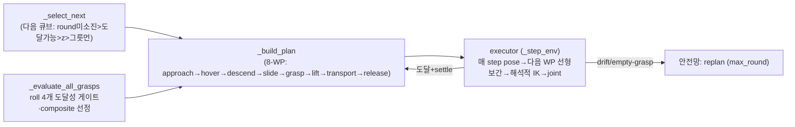
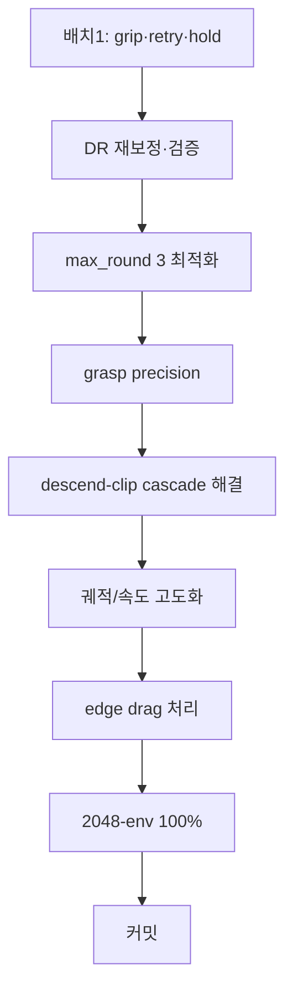
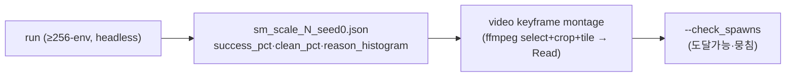

# SO-101 PickCube SM (Oracle) — 프로젝트 마스터 문서

> **한 줄 요약**: cube_desk 에서 SO-101 팔이 큐브 4개를 그릇에 넣는 **결정적(rule-based) pick-and-place 오라클**. **해석적(closed-form) IK + Cartesian waypoint follower** 만 사용(Lula/DiffIK·RL 없음). 용도는 **VLA 학습용 expert 데이터 생성**(RL 정책과 병행 — RL 은 다양성, SM 은 결정적 고신뢰).
>
> **현재 상태**: 🔵 **4-cube 256-env 57.6% · clean 34% · ~30초** · **1-cube 2048-env 93%·clean 77%·~16초**([1-cube_2048.md](1-cube_2048.md)·[4-cube_2048.md](4-cube_2048.md)). 직전 커밋 `aa3f196`.
> **최신(③ 클러스터 grasp-face, 사용자 지시)**: `--mj_outer`(기본 0.6) — 클러스터에서 **fixed finger 안쪽·moving jaw 바깥**(움직이는 jaw 가 이웃 안 쓸고 빈 공간으로 닫힘) roll 선호. 128-env clip −37%·clean +8.6pt, 256-env **clean 24.6→34%·success 54.9→57.6%**. moving jaw ⊥측 = sign(sin q5), 이웃 centroid 반대 향할수록 가산(clearance 1차·mj_outer 2차).
> **천장 = offset-descend self-clip**(여전히 182). jaw-aware top-down(`--jaw_grasp`, slide 제거)은 실패(run8 25.9%·jaw_offset ±도 19–26%) → **slide 구조적 필수**. 엣지 영상 `outputs/so101_edge_*.mp4`.
> **세션 2026-06-13 (① grasp-face 선정 재설계 + ② up-over-down 이동 재설계)**:
> ① `_grasp_setup`+`_grasp_pose`(roll 1개 commit, fallback 없음) → **`_evaluate_all_grasps`(roll 4개 end-to-end 도달성 게이트 + composite)**. build_plan None 636→314(−51%)·clean↑.
> ② 사용자 영상 피드백("yaw 회전이 큐브 쓸고·그릇 침·home→전방 forklift") → `_build_plan` 을 **up-over-down**(횡이동은 항상 travel_height 고정고도, 수직만 오르내림 — 대각선 sweep 제거) + executor **flythrough**(이동 WP 코너서 안 멈춰 등속 부드럽게)로 재작성. **결과: clean 17.6→25.8%·descend-clip 265→223·slide-stuck 177→82·40→30초**. success 는 55% (offset-descend self-clip 223 이 여전히 천장). 세부 §7·§9.
> **천장 = descend-clip (진단 확정, §10)**: **93% self-clip**(target 큐브 자체, 이웃 아님)·**pitch −90°=14% vs 조금이라도 tilt=42–80%**·수직 clip 시점 **TCP 가 큐브 위(z 0.761>top 0.74)·옆 34mm** → TCP 아래로 늘어진 jaw 손가락이 하강 중 큐브 침. 영상 `outputs/so101_descend_clip_env208.mp4`. **반증: open-jaw overhang 가설(descend 닫고 내려가기) → 14% 로 악화(run4)**. blind 튜닝 **4연패**(safe-gate·edge-nudge·side-offset↑·descend-closed) → 다음은 GUI 관찰 기반.
>
> **작성 기준**: 2026-06-13. 단일 진입점 문서. 코드는 `scripts/environments/pick_cube_state_machine.py`(~1450줄). 함정 이력은 [`TROUBLESHOOTING.md`](TROUBLESHOOTING.md) §SO-101 SM.
>
> **참고 자료(설계 검증)**: ECE4560 SO-101 과제(maegantucker.com A6~A9)가 우리 설계(해석적 geometric IK·θ5=θ1·grasp-from-above·linear interpolation·블록 stacking z) 를 **textbook-correct** 로 확인. §13.

---

## 0. 목차

1. [태그·중요도 범례](#1-태그중요도-범례)
2. [목표와 용도](#2-목표와-용도)
3. [제약 (엄수)](#3-제약-엄수)
4. [아키텍처: 해석적 IK + Waypoint Follower](#4-아키텍처-해석적-ik--waypoint-follower)
5. [실행 환경](#5-실행-환경)
6. [계획 & 칸반 보드](#6-계획--칸반-보드)
7. [타임라인 & 구간별 결과](#7-타임라인--구간별-결과)
8. [주요 결정사항 (Decision Log)](#8-주요-결정사항-decision-log)
9. [주요 설정 (Configs)](#9-주요-설정-configs)
10. [트러블슈팅](#10-트러블슈팅)
11. [검증 방법](#11-검증-방법)
12. [재현 절차](#12-재현-절차)
13. [참고 자료](#13-참고-자료)

---

## 1. 태그·중요도 범례

| 배지 | 의미 |
|---|---|
| 🟢 **DONE** | 완료 + 검증됨 |
| 🔵 **IN-PROGRESS** | 진행 중 |
| ⚪ **TODO** | 예정 |
| 🔴 **BLOCKER** | 막힘 |
| ⚫ **DROPPED** | 시도 후 폐기(교훈만) |

| 배지 | 의미 |
|---|---|
| 🔥 **CRITICAL** | 성패 직결 |
| ⭐ **HIGH** | 품질·일정 큰 영향 |

---

## 2. 목표와 용도


- 🔥 **최종 목표**: cube_desk **4-큐브 pick-and-place**, **2048-env 병렬에서 placement 100% + retry 발동 ~0%(zero-retry)**, **에피소드 <20초**.
- **용도**: VLA 학습용 결정적 expert 데이터. (병행하는 RL 정책[`PICKCUBE_RL_PROJECT.md`]은 다양성 담당, SM 은 결정적 고신뢰 담당.)
- **단계적 타깃(사용자 확정 2026-06-12)**: ① **flat 큐브(z-stack OFF)·calibrated reach 범위·dense(cube_sep 0.04) 먼저 100%** → ② z-stacking(scatter_z) → ③ 먼-쪽 아슬아슬(scatter_far) → ④ 2048-env scale → ⑤ commit.

---

## 3. 제약 (엄수)

| # | 제약 | 상태 | 이유 |
|---|---|---|---|
| C1 | 🚫 grasp weld/attach/인공 유지력 금지 | ✅ 유지 | 물리적으로 정직한 grasp 만(VLA 데이터 validity) |
| C2 | `BOWL_SUCCESS_RADIUS=0.06` 불변 | ✅ 유지 | 성공판정 부풀리기 금지 |
| C3 | **Part A 기구학(SO101Kinematics)·`_world_to_base`·q_bias·`--calibrate` 불변** | ✅ 유지 | `--calibrate` 실측 검증(FK err 1.5mm). ECE4560 A7 과 동일 설계. **재작성 금지** |
| C4 | 5-DOF **position 우선·orientation best-effort** | ✅ 유지 | SO-101 은 5축이라 임의 6-DOF pose 불가(AGENTS.md). top-down(-90°)은 **기본일 뿐 강제 아님**(D9) |
| C5 | **검증은 ≥256-env** (16-env 금지) | ✅ 신규 | 16-env 가 76% 인데 2048 은 51.6% — 소표본 과대평가(D2) |

---

## 4. 아키텍처: 해석적 IK + Waypoint Follower

14-phase FSM 을 **2조각**(검증된 기구학 + 범용 waypoint executor)으로 재작성(2026-06-12 이전 세션). 자세 불연속이 없어 "슬램덩크"가 구조적으로 불가.



| 조각 | 역할 | 핵심 |
|---|---|---|
| **Part A `SO101Kinematics`** 🔥 | URDF origin 체인 → pan평면 2-link 해석적 FK/IK | q1=방위, q2/q3=lift/elbow law-of-cosines, q4=tool pitch, **q5=fold_45(yaw+q1)+roll**. `ik_reach`=top-down 우선 pitch 스캔(-90→-30°). **검증됨(C3)** |
| **Part B 좌표정합** | USD root ↔ URDF base_link frame | 캘리 8자세 fit(잔차<0.3mm). `_world_to_base`, `GRASP_OFF`(gripper→TCP) |
| **Part C `--calibrate`** | FK 예측 vs 시뮬 실측(1회 진단) | max err 1.5mm |
| **Part D `SO101PickPlace`** | per-env waypoint 추종 컨트롤러 | `_snapshot()` 1회 배치 cpu numpy(per-env .item() sync 제거) → 매 step `_step_env` per-env 실행 → `_act_all` 배치 step([N,6]) |
| **grasp = side-approach** | 비대칭/처진 jaw 가 큐브 윗면 침 회피 | 닫힘축 방향 `side_offset` 비켜 **수직 하강** → **수평 slide** 로 중심 진입 → close. roll ±90° 우선(그릇/이웃 회피) |
| **`_evaluate_all_grasps`** 🔥 | roll 4개({±90,0,π}) end-to-end 평가 | 각 roll: offset+center 가 **동일 pitch**(가파른 쪽부터) 로 닿는 (pitch,깊이) 탐색 = 도달성 게이트. 통과 roll 중 `composite = clear_norm + pitch_norm + ±90 bias + 직전roll continuity` 최대. 깊이 ladder = `min_grip_depth`→`grip_height`. 1-roll commit(구 `_grasp_setup`/`_grasp_pose`) 폐기 → build_plan None −39% |

**이동 = up-over-down (충돌 회피, 2026-06-13)**: `_build_plan` 8-WP = rise→over→descend→slide→grasp→lift→over_bowl→release. **횡이동(rise/over/lift/over_bowl)은 항상 `travel_height`(0.15m, desk 기준=구 safe_z) 고정고도, 수직만 오르내림** → 대각선 sweep 제거(yaw 회전이 큐브 쓸기·home→전방 forklift·그릇 rim 침 차단). 고정고도점은 `_ik_reach`(pitch 스캔)로 도달 확인 — 높은 점은 top-down 불가, 완화 pitch 라야 닿음(descend 가 하강하며 top-down 재배향). executor **flythrough**: 이동 WP 는 코너서 감속·정지 안 함(등속 부드럽게), stop WP(descend/slide/grasp/release)만 0 으로 감속.

### SO-101 그리퍼 기하 (URDF `so_arm101.urdf`, descend-clip 분석 근거)

| 요소 | 값(gripper_link frame) | 의미 |
|---|---|---|
| **TCP**(`gripper_frame_link`) | `(-0.0079, -0.0002, -0.0981)`, rpy `(0,π,0)` | 캘리된 grasp 중심. gripper_link 원점서 **z −98mm**(아래). FK 검증 1.5mm |
| **moving jaw** pivot(`gripper` joint) | `(0.0202, 0.0188, -0.0234)`, axis z, limit `[-0.175, 1.745]` | TCP 기준 **+x 28mm·+y 19mm 치우침**. 열리면 이쪽으로 더 swing |
| **fixed finger** | = gripper_link 본체(servo + wrist_roll_follower mesh) | 안 움직임. moving jaw 와 비대칭 |
| `ROLL_RHO` | 0.0079 | wrist_roll(q5) 회전 시 TCP 가 도는 lateral 반경(IK 보정 적용) |

> **jaw 운동학(STL+URDF 전개)**: moving jaw finger **82mm·아래로 늘어짐**(tip TCP보다 ~7mm 아래), gripper_link −Y 축 둘레 회전. **열림(0.65rad) 시 fingertip 이 ~46mm 횡swing**(gap ~46mm > 큐브 30mm). **fixed finger 는 TCP/center 근처에 고정**.
> **함의(descend-clip)**: side-approach 가 TCP 를 offset 점에 둬도, 늘어진 비대칭 jaw 가 하강 중 큐브 침(clip 시 TCP 큐브 위 z 0.761·옆 34mm 인데도 변위). **top-down(center) 하강이 실패하는 이유(run8 25.9%)**: center 에 TCP 두면 **fixed finger 가 큐브 바로 위**(moving jaw 만 46mm 밖)→ fixed finger 가 큐브 top 침. **재설계 방향**: jaw_offset 으로 큐브를 **gap 중심(fixed finger ↔ swung moving jaw 사이)** 으로 ~half-gap(~20mm) 시프트 = fixed finger 가 큐브 옆을 비켜 내려감. 부호/크기는 close-up + sweep 으로 확정. (단순 offset↑·descend-closed run4 는 실패.)

> **참고 정합**: ECE4560 A7(IK θ5=θ1·grasp-from-above), A8(0.03m 위 접근·stacking z), A9(linear vs cubic spline 평활) — 우리 설계와 일치. A9 의 등속·평활 레버는 **flythrough 로 반영**(이동 WP 코너 무정지 등속).

---

## 5. 실행 환경

| 항목 | 값 |
|---|---|
| 서버 | Ubuntu 24.04.3, Intel Core Ultra 5 245K, 128GB RAM |
| GPU | RTX PRO 5000 Blackwell **48GB** (RT 코어 — Isaac Sim 5.1 요구). GPU 1장 공유(RL 학습 경합) |
| 스택 | Isaac Sim 5.1 / IsaacLab 2.3 / leisaac 0.4.0 / `ManagerBasedRLEnv` |
| 실행 | 호스트 uv: `OMNI_KIT_ACCEPT_EULA=YES uv run --group isaac python scripts/environments/pick_cube_state_machine.py ...` (`--headless`) |
| IK | 순수 Python(CPU) 해석적 — GPU 무관 |
| **성능 한계** ⭐ | **per-env Python 루프**(`_step_env` 미벡터화) → 2048-env wall-clock ~6–12분. snapshot 만 배치. 대량 데이터 생성은 **시드 샤딩**(프로세스 분할) 권장 |
| outputs | `outputs/sm_scale_<N>_seed<S>.json`(taxonomy) · `outputs/so101_sm_progress.txt`(로그, `num_envs>64` 면 fsync 생략) · `docs/*.mp4`(영상) |

**운영 함정**: 백그라운드 종료는 **python PID 직접 kill**(셸 wrapper kill 은 orphan 잔존). `grep` 이 dotfiles wrapper 로 긴 줄 truncate → **awk 직접 파싱**.

---

## 6. 계획 & 칸반 보드



| 단계 | 상태 | 중요도 | 내용 | 완료 기준 |
|---|---|---|---|---|
| 배치1: grip ladder+floor·retry defer·hold-until-placed | 🟢 DONE | 🔥 | #3/#4/#5/#6 (§7). 커밋 831349d | false-drop 제거 ✅ |
| DR 재보정·검증(`--check_spawns`) | 🟢 DONE | 🔥 | scatter_far/z→0 | 96% 도달·뭉침 아님 ✅ |
| max_round 3 최적화 | 🟢 DONE | ⭐ | 6→3 cap 컷오프 제거 | steps 4000→2011 2×↑ ✅ |
| **M1 사다리꼴 속도 프로파일(A9변형)** | 🟢 DONE | ⭐ | 등속→가·감속(--accel/--min_speed) | 자연 모션·텔레포트 제거 ✅ |
| **D-c 그릇 arc**(사용자③) | 🟢 DONE | 🔥 | --bowl_clear_height, rim 위로 arc | env41 1/4→3/4, bowl-tip↓ ✅ (단 ②잔존: 2번째 큐브 아직 침 → 강화 필요) |
| **edge drag(nudge)**(사용자①) | 🟢 opt-in | ⭐ | --nudge paddle-push, 기본 off | far-pull 기구학 한계, net-neutral |
| **dead-wait fail-fast**(사용자⑥) | 🟢 DONE | 🔥 | stuck_patience(TCP 무진전 조기종료)+settle 6 | 시작 대기 제거 ✅ |
| selection isolation(loner-first) | 🟢 DONE | ⭐ | `_select_next` 고립도 우선 + `_reach_ok` 반경 proxy | net-neutral(57.2→56.7) — 선정은 천장 아님 |
| **grasp-face 선정 재설계**(사용자⑤) | 🟢 DONE | 🔥 | `_evaluate_all_grasps`: roll 4개 end-to-end 도달성 게이트 + composite | build_plan None 636→314·clean↑ ✅ / success net-neutral |
| **up-over-down 이동 재설계**(사용자: sweep/forklift/bowl-clip) | 🟢 DONE | 🔥 | 횡이동 고정고도(travel_height)·수직만·flythrough 등속. `_build_plan` 단순화 | clean 17.6→25.8%·slide-stuck↓·40→30초 ✅ |
| **descend-clip**(사용자②④, 천장) | 🔴 BLOCKER | 🔥 | offset-descend self-clip 잔존(223): 비대칭 moving jaw(TCP서 28mm·98mm 늘어짐)가 수직 하강 중 침 | descend-clip→~0 (jaw 기하 고려 grasp 재설계) |
| z-stack/far 복원 | ⚪ TODO | | flat 100% 후 scatter_z·scatter_far 재투입 | 확장 분포 ≥90% |
| 2048-env 100% | ⚪ TODO | 🔥 | scale 검증 | placement 100%·zero-retry |

> **현재 BLOCKER = offset-descend self-clip(223).** 55% 천장. 선정(①)+이동(②) 재설계로 **품질·속도는 대폭 개선**(clean 25.8%·30초·sweep/forklift/bowl-clip 제거)됐으나 success 불변 — 천장은 **grasp 실행**: 비대칭 moving jaw(§4 그리퍼 기하: TCP서 +28mm·−98mm 늘어짐)가 수직 하강 중 큐브 침. **반증**: open-jaw overhang(descend-closed run4 14%)·blind side-offset↑(tilt 강제 60%). 다음 = jaw 손가락 mesh 기하 고려한 접근/하강 재설계. 영상 `outputs/so101_descend_clip_env208.mp4`·`outputs/so101_updown_env8.mp4`.

---

## 7. 타임라인 & 구간별 결과

2026-06-12 SM 고도화 세션. 검증 분포 표기: `cube_sep`/scatter 상태/`num_envs`.

| 시점 | 작업 | 상태 | 결과 / 교훈 |
|---|---|---|---|
| — | HEAD(미커밋) baseline 재현 | — | 16-env DR-확장(far0.025·z0.05·sep0.04) **56%**(stale json 67%은 다른 config). descend-clip 지배 |
| Step1 | **neighbor-aware descend hardening**(safe 방향 hard-gate) | ⚫ DROPPED | **no-op 판명** — sep 0.04 밀집엔 clip-free 방향이 없어 safe 항상 False → 동작 무변. build_plan None 17→77 churn 만 부풀어 56%. **revert** |
| 배치1 | **#3 grip ladder + #6 min_depth floor 0.016 + #4 retry defer(max_round 6) + #5 hold-until-placed** | 🟢 DONE | 16-env flat 0.04 56%→**76.6%**, false-drop 제거 |
| 진단 | **2048-env cube_sep 0.05** | 🔴 | **51.6%**(전 env 자연종료=진짜 모집단값). clean 13.6%. build_plan None 14246. **소규모 과대평가 확정** |
| DR재보정 | scatter_far 0.025→**0**, scatter_z 0.05→**0**(flat), cube_sep 0.04 유지 | 🟢 DONE | 도달불가 spawn(far-extension) 제거. 사용자 "아슬아슬=도달가능" |
| 검증 | **`--check_spawns`** 256-env (0.04·0.05) | 🟢 DONE | **도달불가 4.0%/3.5%**(가장자리만) · **뭉침 0%**(spread 24cm). **DR 정상** — "안 됨"은 DR 탓 아님 |
| 진단 | close-up replay 영상(Cube2 miss) | 🟢 | **grasp-precision miss**: slide 가 큐브를 jaw 중앙에 못 넣고(관절 tol 0.025 로 8mm 못미쳐) close → 빈손 운반 |
| Step A | grasp precision(slide Cartesian 게이트·slide_stop 0.005) | 🔵 | 256/0.05 **49.6% but steps=4000(cap 도달)** — 게이트 대기+max_round6 가 episode 늘려 컷오프 |
| 최적화 | **max_round 6→3**, 게이트 slide-only·12mm 완화 | 🟢 DONE | 256/0.04 **52.7%, steps 4000→2011**(컷오프 제거), build_plan None 1956→805, 2× 빠름 |
| 진단 | edge 2클립(far env151·near env41) | 🟢 | **far**(외측 reach, x2.04): 팔이 못 뻗어 제외, 나머지 3/4. **near**(내측 base발치, x1.68): 팔 cramp·못 들어올림·env 망침 1/4 |
| M1 | **사다리꼴 속도 프로파일**(등속→가·감속, A9변형) | 🟢 DONE | 256/0.04 52.7→54.2%, 자연 모션. 텔레포트·급출발 제거 |
| D-c | **그릇 arc**(bowl_clear_height 0.18) | 🟢 DONE | env41 1/4→**3/4 clean**, 256 54.2→**57.2%**, build_plan None 781→624 |
| nudge | paddle-push(--nudge opt-in) | 🟢 opt-in | far-pull 기구학 한계(접촉점도 도달불가), 256 net-neutral(57.2→56.2) → 기본 off |
| 실험 | side-offset margin↑(0.018→0.028) | ⚫ REVERT | 256 53.5%·descend-clip 240↑ — CONTEXT 경고대로 blind side_offset↑ 역효과 |
| 커밋 | **`831349d` (main)** SM 전체+doc | 🟢 | docker-compose·camera 제외(별도 작업) |
| 진단 | 사용자 GUI 영상(env5 사선뷰) | 🟢 | 5피드백(§0). [TIMEOUT] = Cube4 hover **TCP 249mm off** = home→첫 WP IK-fail stall(8초 대기 정체) |
| 실험 | max_wp 240→90(대기 단축) | ⚫ REVERT | env5 3/4→0/4·256 53.5% — 정상-느린 WP 도 잘림. → **stuck_patience**(무진전 조기종료)로 교체 |
| dead-wait | **stuck_patience 24**(TCP 무진전 abort)+settle 6 | 🔵 | IK-fail frozen 대기만 잘라냄, 정상 WP 무영향. 검증중 |

**세션 2026-06-13 (grasp-face 선정 재설계, seed0 256-env)**:

| run | 변경 | success | clean | build_plan None | descend-clip | 교훈 |
|---|---|---|---|---|---|---|
| baseline | `831349d` stuck+isolation | 56.7% | 17.6% | 636 | 152 | — |
| run1 | `_evaluate_all_grasps`(roll 4개) + **radial pre-filter** | 42.3% | 1.2% | **1555** | 231 | ⚫ pre-filter [0.17,0.32] 가 pitch-완화 reach·offset점 거짓기각 → 폐기 |
| run2 | pre-filter 제거 | **57.4%** | 21.9% | **397** | 273 | ✅ reachability 회수(None −38%)·clean↑ / clip↑(회수큐브가 clip) |
| run3 | 수직 hard-gate(vert=10) | 56.7% | 21.1% | 335 | 268 | ⚫ 가장자리 큐브 무리한 수직 → slide-stuck/빈grasp↑. soft 로 복귀 |
| run4 | **descend-closed + preopen**(open-jaw 가설) | **14.1%** | 0% | 502 | 461 | ⚫ **가설 반증**(clip↑·빈grasp 1431). 전면 revert |
| run5 | revert(soft pitch, grasp-face 최종) | 54.3% | 14.8% | 385 | 265 | seed0 변동폭 내. **천장=descend-clip 확정** |

**이어서 (② up-over-down 이동 재설계, 사용자 영상 피드백 반영)**:

| run | 변경 | success | clean | None | clip | steps(s) | 교훈 |
|---|---|---|---|---|---|---|---|
| run6 | up-over-down + 고정고도 게이트(`_ik`, top-down) | **0%** | 0% | **3072** | — | — | ⚫ `_ik`(고정 top-down)로 고정고도 게이트 → 높은 점 top-down 불가 100% reject. `_ik_reach` 로 수정 |
| run7 | `_ik_reach` 게이트(완화 pitch) + flythrough 등속 | 55.2% | **25.8%** | 314 | 223 | **896(30s)** | ✅ clean +8(vs base)·slide-stuck 177→82·40→30초·descend-clip↓. success 55%(self-clip 잔존) |

> **결론**: 선정(①)+이동(②) 재설계로 **품질·속도 대폭 개선**(clean 17.6→25.8%, 40→30초, sweep/forklift/bowl-clip 제거) — 사용자 영상 피드백 충족. 하지만 **success 55% 천장은 여전히 offset-descend self-clip(223)**: 비대칭 moving jaw(TCP서 28mm 치우침·98mm 늘어짐, §4 그리퍼 기하)가 수직 하강 중 큐브 침. 영상 `outputs/so101_descend_clip_env208.mp4`(구)·`outputs/so101_updown-step-0.mp4`(신, 이동 부드러움). 다음 = jaw 기하 고려한 grasp 접근 재설계.

**이어서 (③ jaw-aware grasp 실험 + 곡선 blend + scale 검증)**:

| run | 변경 | success | clean | 교훈 |
|---|---|---|---|---|
| run8 | `--jaw_grasp` top-down(slide 제거, jaw_offset 0) | **25.9%** | 0.4% | ⚫ center 하강 시 fixed finger 가 큐브 침(descend-clip 1611). **slide 구조적 필수** 확정. opt-in 보존 |
| run9 | 기본 slide + 곡선 blend(0.03) | 55.2% | 24.6% | ✅ 코너 둥근 호(부드러운 곡선 동선) success 불변 → blend 기본 on |
| 256 재확인 | slide+up-over-down+blend (커밋 `ccf64bf`) | 54.9% | 24.6% | 현 config 안정 |
| 1-cube 2048 | --active_objects 1 | **93.0%** | 76.8% | ✅ <16초. 단일 큐브 견고 = SM 상한. 4-cube 격차=클러스터링 ([1-cube_2048.md](1-cube_2048.md)) |
| 4-cube 2048 | scale 검증 | 55.8% | 23.0% | ✅ 256(54.9)와 동일 = scale 안정 ([4-cube_2048.md](4-cube_2048.md)) |

> **grasp 순서별 clip율**: 1번째 22%→4번째 12% (밀집할수록↑, 후순위는 declutter 로↓). 사용자 "3·4번째 face 틀림"은 anecdotal — 체계적으로는 1번째(최밀집)가 최악. **천장 = 밀도 상관 self-clip** = jaw 기하 문제(§4).

**이어서 (④ jaw-aware top-down 폐기 + 클러스터 grasp-face, 사용자 지시)**:

| run | 변경 | success | clean | clip | 교훈 |
|---|---|---|---|---|---|
| jaw ±0.022 | `--jaw_grasp --jaw_offset ±0.022` (128) | 1–20% | — | — | ⚫ top-down 은 jaw_offset 부호 맞춰도 capture 불가(빈grasp↑). slide 필수 확정(D20) |
| mj_outer +0.6 | 클러스터 grasp-face(jaw 바깥) (128) | 59.4% | **38.3%** | **50** | ✅ 사용자 영상 진단: 움직이는 jaw 가 큐브 윗면 쓸어 굴림 → jaw 를 클러스터 바깥으로 |
| **mj_outer 0.6** | **256 확정(기본 on)** | **57.6%** | **34.0%** | 182 | ✅ baseline 대비 **clean +9.4pt·success +2.7**. moving-jaw-outer = 세션 최고 grasp-face |

> **사용자 영상 진단(④)**: ① 움직이는 jaw 가 큐브 윗면 밀어 90° 굴림(slide 중) ② 나란히 붙은 2큐브 = grasp face 오선택 → 둘 다 한번에 집으려다 빈손. **해법(사용자 지시)**: 클러스터는 fixed finger 안쪽·moving jaw 바깥(`--mj_outer`), 틈 없으면 clearance 가 빈 face 로.

**핵심 진단(확정)**:
1. 🔥 **소규모 과대평가** — 16-env(76%)는 쉬운 spawn 우연. **2048=51.6% 가 진짜.** 검증은 ≥256-env(C5).
2. 🔥 **descend-clip cascade** = success ceiling. clip(2048서 1658)이 큐브를 reach 밖으로 쳐 → build_plan None 14246 → 도미노. grip 얇게(ladder)로도 clip 안 줄음 → **clip 은 깊이 아닌 접근 기하 문제**.
3. **max_round 6 = cap 컷오프 함정** — 실패 큐브 6×200tick 재시도 → 가장 느린 env 가 max_total_steps(4000) 도달 → 대량 env 미완. **3 이 균형.**
4. **DR 정상** — 96% 도달가능·잘 펼쳐짐. 4% 는 외측/내측 reach 가장자리(기구학 한계).

---

## 8. 주요 결정사항 (Decision Log)

| # | 결정 | 근거 | 주체 |
|---|---|---|---|
| D1 | 14-phase FSM → **해석적 IK + waypoint follower 2조각 재작성** | "simple·compact·intuitive" + 슬램덩크 구조적 제거 | 사용자(이전 세션) |
| D2 | **검증은 ≥256-env** (16-env 폐기) | 16-env 76% vs 2048 51.6% — 소표본 과대평가 | 에이전트 진단 |
| D3 | **DR 재보정**(scatter_far/z→0) — "아슬아슬=도달가능" | far-extension 이 calibrated reach 넘겨 도달불가 spawn(None churn) | 사용자 |
| D4 | **flat-dense 먼저 100%** → z-stack/far 나중 | 단계적 — 가장 단순 분포부터 완벽히 | 사용자 |
| D5 | **max_round 3**(6 폐기) | 6 = 실패 큐브 과다 재시도 → step-cap 컷오프 → scale 성공률 추락 | 에이전트 진단 |
| D6 | **집으면 release 까지 그리퍼 안 엶** | drop 가드 false-positive 가 쥔 큐브를 떨굼("살짝 들다 놓고") | 사용자 |
| D7 | **grip 깊이 ladder + min floor 0.016** | 정확 깊이 고집 말고 최소 이상이면 grip(reach robust) + 너무 얇으면 윗면 긁음 | 사용자 |
| D8 | **edge 케이스 = SM drag**(far 끌어오기·near 밀어내기) | 4% 외측/내측 reach 가장자리. range 조이기보다 SM 이 처리 | 사용자 |
| D9 | **top-down(-90°) 비강제** | 멀거나 가깝지 않아도 pitch 완화 자유 — 도달성·궤적 개선 | 사용자 |
| D10 | **그릇 근처 운반은 곡선/FK 로**(직선 금지) | 직선 운반이 그릇을 쳐서 엎음(near 클립) | 사용자 |
| D11 | neighbor-aware descend hardening **폐기** | sep 0.04 밀집엔 clip-free 방향 부재 → no-op, churn 만 유발 | 에이전트 진단 |
| D12 | dead-wait = **stuck_patience(무진전 조기종료)**, max_wp blunt-cut 폐기 | 8초 대기 = WP IK-fail frozen(계산 아님). max_wp 90 은 정상-느린 WP 도 잘라 grasp 실패↑ → 무진전만 abort | 사용자+에이전트 |
| D13 | selection = **isolation 우선 + 싼 reach proxy** | 고립(loner) 먼저 = 클러스터 바깥부터 벗겨 헤집음↓. _graspable(52 IK/큐브) 선택 부하 → 반경 proxy 로(2048 루프↑). 8초 대기는 계산 아님 | 사용자 질문 |
| D14 | grasp = **큐브 옆면 정렬**(fixed finger ram 회피) | 사용자 영상: "집으려던 면 말고 옆면 노렸어야". fixed finger 가 진입축 앞서면 ram(②) | 사용자 |
| D15 | grasp-face 선정 = **roll 4개 end-to-end 평가**(`_evaluate_all_grasps`), 1-roll commit 폐기 | 종전 `_grasp_setup` 가 clearance 로 1개 고른 뒤 도달 불가면 fallback 없이 plan None. 4개 다 평가(offset+center 동일 pitch 도달성 게이트)로 build_plan None −39% | 에이전트(사용자 위임) |
| D16 | **selection·reachability 는 success 천장 아님** — descend-clip 이 천장 | run1–5: build_plan None 636→385 인데 success 54–57% 불변. 회수한 reach-edge 큐브가 곧장 clip → 선정 개선이 success 로 전환 안 됨 | 에이전트 진단 |
| D17 | descend-clip **open-jaw overhang 가설 반증** | descend 닫고 내려가기(run4) → 14%·빈grasp 1431 로 악화. clip 은 단순 open-jaw 가 아님(TCP 큐브 위서 손가락 침). 다음 수정은 **반드시 영상 관찰 기반** | 에이전트 진단 |
| D18 | 이동 = **up-over-down 고정고도**(횡이동 항상 travel_height, 수직만) + executor **flythrough** | 사용자 영상: yaw 회전이 큐브 쓸고·home→전방 forklift·그릇 침 = **이동 중 sweep**(taxonomy 미포착). 대각선 sweep 제거 + 코너 무정지 등속. clean 17.6→25.8%·40→30초 | 사용자 영상 |
| D19 | 고정고도 게이트는 **`_ik_reach`(pitch 스캔)** 필수, `_ik`(고정 top-down) 금지 | run6: `_ik` top-down 게이트 → 높은 점 도달 불가 100% reject(0%). 높은 운반점은 완화 pitch 라야 닿음 | 에이전트 진단 |
| D20 | jaw-aware top-down(slide 제거) **폐기**, slide 구조적 필수 | run8 jaw_offset 0/±0.022: 19–26% (fixed finger 가 center 침·top-down 은 capture 불가). slide 의 수평 진입이 신뢰 capture | 에이전트 진단 |
| D21 | 클러스터 grasp-face = **fixed finger 안쪽·moving jaw 바깥**(`--mj_outer` 0.6) | 사용자 영상 지시. 움직이는 jaw 가 이웃 안 쓸고 빈 공간으로 닫힘 → clip −37%·clean +9pt. 틈 없으면 clearance 가 빈 face 로(1차) | 사용자 |

---

## 9. 주요 설정 (Configs)

### 9.1 핵심 CLI 파라미터 (현재값) ⭐

| 파라미터 | 현재 | 의미 |
|---|---|---|
| `--cube_sep` | 0.04 | 큐브 간 최소 중심거리(flat-dense 타깃). DR override |
| `--scatter_far` | **0.0** | 0=calibrated reach 범위(아슬아슬). >0 은 도달불가 spawn |
| `--scatter_z` | **0.0** | 0=flat(땅바닥). >0 z-stacking(나중 단계) |
| `--grip_height` | 0.012 | grasp z ladder **깊은 끝**(큐브 바닥 기준) |
| `--min_grip_depth` | 0.016 | grasp z ladder **얇은 floor**(top 아래 최소 침투, 윗면 긁기 방지) |
| `--side_offset` | 0.035 | side-approach 비킴 하한(`_side_offset`가 크기로 키움) |
| `--slide_stop` | 0.005 | slide 종점 큐브중심 잔여거리(작을수록 jaw 중앙 깊이) |
| `--blend_radius` | **0.03** | 이동 WP 코너 곡선 blend 반경. >0=둥근 호(부드러운 동선). 0=직각 |
| `--jaw_grasp` (실험) | off | top-down 직하강(slide 제거). run8 실패(25.9%, fixed finger 침) → 기본 off |
| `--jaw_offset` (실험) | 0.0 | `--jaw_grasp` 시 ⊥ 보정(큐브를 gap 중심으로). 비대칭 jaw 상쇄 |
| `--mj_outer` | **0.6** | 클러스터 grasp-face: moving jaw 를 클러스터 **바깥**(fixed finger 안쪽) 향하는 roll 선호. clip −37%·clean +9pt. 0=off |
| `--reach_tol` | 0.012 | slide WP Cartesian 도달 판정(close miss 방지) |
| `--max_round` | **3** | 큐브당 replan 상한(6 은 cap 컷오프) |
| `--gripper_speed` | 5.0 | 그리퍼 slew(물리상한). close 시간↓ |
| `--travel_height` | **0.15** | up-over-down 단일 운반 고도(desk 기준). 횡이동 항상 이 높이=충돌 회피. =구 safe_z(도달 검증됨) |
| `--travel_speed` | **0.60** | 이동(rise/over/lift/over_bowl) 등속 순항. flythrough(코너 무정지)라 episode 대부분 이 속도 |
| `--descend_speed` | **0.40** | 하강·그릇 내림(구 0.32 → 단축) |
| `--accel`/`--min_speed` | 6.0 / 0.04 | 사다리꼴 가·감속도/하한. **stop WP(descend/slide/grasp/release)만 적용**, flythrough 는 등속 |
| `--lift_speed`/`--transport_speed`/`--bowl_clear_height`/`--pregrasp_height` | (legacy) | up-over-down 재작성으로 `_build_plan` 미사용. travel_height/speed 가 대체 |
| `--max_wp_steps`/`--stuck_patience` | 240 / 24 | WP 시간 hard cap / TCP 무진전 조기종료(멍한 대기 제거) |
| `--close_dwell`/`--settle_steps`/`--pregrasp_dwell` | 8 / 6 / 5 | 정착 step (settle 6=시작 대기 단축) |
| `--nudge` (opt-in) | off | paddle-push 재배치(--nudge_dist 0.06·max_nudge 2). far-pull 기구학 한계 |

### 9.2 DR (`utils/domain_randomization.py::randomize_cubes_scattered`)

| 항목 | 값 |
|---|---|
| scatter range | `_CUBE_SCATTER_X_RANGE (1.66,2.04)` · `_Y_RANGE (-0.46,-0.345)` (calibrated reach) |
| min_cube_sep / min_bowl_sep / min_base_sep | 0.10(SM 이 0.04 override) / 0.18 / 0.135 |
| z_range | (0,0) flat (SM `--scatter_z` override) |
| 물리 DR | 큐브 마찰(static 1.4–2.0 / dynamic 1.2–1.7)·질량 ±10% (startup) |

> **좌표 동기화**: scatter range·`BOWL_SUCCESS_RADIUS`·`DESK_TOP_Z(0.705)`·`CUBE_SIZES(30/40mm)` 변경 시 SM 과 `pick_cube_env_cfg.py` 동시 갱신.

---

## 10. 트러블슈팅

| 현상 | 원인 | 해결 | 상태 |
|---|---|---|---|
| **소규모 검증 과대평가** | 16-env 쉬운 spawn 우연(76%) | ≥256-env 검증(2048=51.6%가 진짜) | 🟢 |
| **descend-clip** (진단 확정 2026-06-13) | **93% self-clip**(target 큐브, 이웃 아님). 수직(−90°) 14% vs tilt 42–80%. clip 시점 **TCP 가 큐브 위(z 0.761>top 0.74)·옆 34mm** → TCP 아래로 늘어진 open-jaw 손가락이 하강 중 큐브 침. 영상 `outputs/so101_descend_clip_env208.mp4` | 미해결(BLOCKER). **반증된 시도**: ⓐ descend-closed+preopen → 14% 악화(open-jaw 단순 overhang 아님) ⓑ blind side-offset↑ → 하강점을 reach 가장자리로 밀어 tilt 강제(60% clip) 역효과 ⓒ 수직 hard-gate → 가장자리 큐브 slide-stuck↑. 다음 = jaw 손가락 mesh 기하/접근 재설계, GUI 관찰 기반 | 🔴 |
| **build_plan None cascade** | clip 이 큐브를 reach 밖으로 침 → 도달불가 → defer churn(max_round 6 이 6× 부풀림) | max_round 3 + clip 해결(근본) | 🔵 |
| **max_round 6 cap 컷오프** | 실패 큐브 6×200tick → 가장 느린 env 가 max_total_steps 도달 → 미완 | max_round 3 (steps 4000→2011) | 🟢 |
| **grasp-precision miss** | slide 가 관절 tol 0.025 로 8mm 못미쳐 close → 큐브 jaw 가장자리 | slide Cartesian 게이트(reach_tol)·slide_stop 0.005 | 🔵 검증중 |
| **false-drop**("살짝 들다 놓고") | lift/transport drop 가드가 쥔 큐브를 열어 떨굼 | 집으면 release 까지 안 엶(drop 가드 log만, lift 검증은 빈grasp만 abort) | 🟢 |
| **윗면 긁기** | grip 너무 얇아 손가락이 top 못 넘음 | min_grip_depth floor 0.016 | 🟢 |
| **neighbor-aware safe-gate no-op** | sep 0.04 밀집엔 clip-free 방향 부재 → safe 항상 False | 폐기(D11). churn 만 유발 | ⚫ |
| **2048 로그 I/O 병목** | per-env 로그 5만줄 매줄 fsync | `num_envs>64` 면 fsync 생략(flush 만) | 🟢 |
| **edge spawn 4%** | 외측(x~2.04 reach 한계)·내측(x~1.68 base발치 inner-reach) | SM drag(D8, nudge opt-in)/range 조이기 | ⚪ |
| **시작 ~8초 멍한 대기** | home→첫 WP 접근이 IK-fail 경로로 stall(팔 frozen) → max_wp(240=8s)까지 대기. **계산 아님** | stuck_patience(TCP 무진전 24step abort). max_wp blunt-cut(90)은 정상 WP 도 잘라 역효과 | 🔵 검증중 |
| **2번째 큐브 그릇 침**(잔존) | D-c arc(0.18) 부족 — 그릇 가까운 grasp→over-bowl 직선이 아직 rim 스침 | arc 강화/접근방향 — TODO | 🔴 |
| **descend ram**(포크레인) | side-offset 하강이 큐브 ram, fixed finger 앞서 추정 | GUI 관찰 기반 grasp face(D14) — TODO | 🔴 |

> 새 에러 진단·수정 성공 시 [`TROUBLESHOOTING.md`](TROUBLESHOOTING.md) 에 (현상→오류→원인→해결→확인) 5블록 추가.

---

## 11. 검증 방법



| 지표 | 도구 | 합격선 |
|---|---|---|
| 성공률 | `sm_scale_<N>_seed0.json` `success_pct` (≥256-env) | flat-dense 100% (목표) |
| zero-retry | `clean_pct` (events=0 env 비율) | ~100% |
| 실패 분해 | `reason_histogram`(하강중밀림/build_plan None/빈grasp/drop) | descend-clip→0 |
| 도달가능·뭉침 | `--check_spawns` | 도달불가 ~0%·뭉침 0% |
| 정성 | `--video` keyframe (close-up `--view_eye` 큐브 근처) | 그릇 안 엎음·자연·<20초 |
| 속도 | 로그 `steps=... (~Ns)` | <20초(슬로우모션 아님) |

> **PhysX 비결정성 ±2ep** — ≥3 차이만 판정. **영상 카메라는 close-up**(기본 광각은 crop 해도 큐브 안 보임 — `--view_eye 2.2,-0.52,0.90 --view_lookat 1.85,-0.40,0.72` 류).

---

## 12. 재현 절차

```bash
# flat-dense 256-env (현재 타깃)
OMNI_KIT_ACCEPT_EULA=YES uv run --group isaac python \
  scripts/environments/pick_cube_state_machine.py \
  --num_envs 256 --active_objects 4 --seed 0 --headless
# → outputs/sm_scale_256_seed0.json, outputs/so101_sm_progress.txt

# DR 검증 (도달가능·뭉침, 컨트롤러 미실행)
... --num_envs 256 --cube_sep 0.04 --check_spawns --headless   # → outputs/unreachable_spawns.json

# 특정 env close-up 영상 (도달불가/실패 env 재현)
... --num_envs 1 --replay_spawn outputs/unreachable_spawns.json --replay_env_idx N \
    --video --video_name so101_clip --view_eye 2.5,-0.62,1.0 --view_lookat 1.9,-0.4,0.72 --headless

# 2048-env scale (wall-clock ~6–12분, GPU VRAM 확인)
... --num_envs 2048 --headless

# 기구학 캘리브레이션 (1회 진단)
... --calibrate --headless

# GUI 관전 (R=동일 셋업 / N=새 시드)
... --num_envs 4    # (--headless 제거)
```

- 관련 파일: `scripts/environments/pick_cube_state_machine.py`(전부), `src/sim_to_real/tasks/pick_cube/pick_cube_env_cfg.py`(상수·DR), `src/sim_to_real/utils/{constant,domain_randomization}.py`.
- **커밋 `831349d` (main)** — SM 전체+`domain_randomization.py`+CONTEXT+이 문서. 이후 stuck_patience·selection 등 미커밋.

---

## 13. 참고 자료

| 분류 | 자료 |
|---|---|
| 내부 — 병행 RL | [`PICKCUBE_RL_PROJECT.md`](PICKCUBE_RL_PROJECT.md) (BC→RL finetune) |
| 내부 — 환경/구조 | [`../AGENTS.md`](../AGENTS.md), [`GRASP_PHYSICS.md`](GRASP_PHYSICS.md), [`TROUBLESHOOTING.md`](TROUBLESHOOTING.md), [`LULA_GUI_TUNING.md`](LULA_GUI_TUNING.md) |
| 외부 — **설계 검증** ⭐ | **ECE4560 SO-101**(maegantucker.com): [A6 FK](https://maegantucker.com/ECE4560/assignment6-so101/)(product-of-transforms, base 변위 0.0388353,0,0.0624=PAN_X 일치) · [A7 IK](https://maegantucker.com/ECE4560/assignment7-so101/)(**해석적 geometric, grasp-from-above, θ5=θ1** — 우리와 동일) · [A8 IK2](https://maegantucker.com/ECE4560/assignment8-so101/)(블록 stacking, 0.03m 위 접근, stacking z 0.014/0.043/0.071/0.100) · [A9 궤적](https://maegantucker.com/ECE4560/assignment9-so101/)(**cubic spline > linear interpolation 평활** — #2 미적용 레버) |

---

> **다음 작업**: **descend-clip 이 유일 천장**(grasp-face 선정·reachability 는 해결됨). 영상 `outputs/so101_descend_clip_env208.mp4`(self-clip 관찰) 기반으로 jaw 손가락 mesh 기하/접근 재설계. blind 튜닝 4연패(safe-gate·edge-nudge·side-offset↑·descend-closed) — **반드시 관찰 기반**. 해결 시 success 가 build_plan None 회수분(−39%)만큼 상승 기대 → 그 후 2048-env·z-stack/far.
> **다음 갱신 시점**: descend-clip 해결 후 §6·§7·§10 갱신. flat-dense 100% 달성 시 z-stack/far 단계로.
