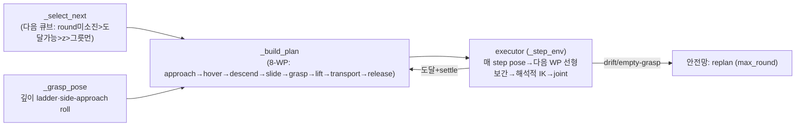
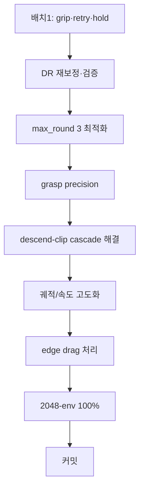
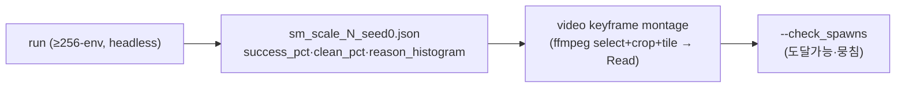

# SO-101 PickCube SM (Oracle) — 프로젝트 마스터 문서

> **한 줄 요약**: cube_desk 에서 SO-101 팔이 큐브 4개를 그릇에 넣는 **결정적(rule-based) pick-and-place 오라클**. **해석적(closed-form) IK + Cartesian waypoint follower** 만 사용(Lula/DiffIK·RL 없음). 용도는 **VLA 학습용 expert 데이터 생성**(RL 정책과 병행 — RL 은 다양성, SM 은 결정적 고신뢰).
>
> **현재 상태**: 🔵 **flat-dense 256-env 57.2% (default, --nudge off)**. 세션 누적 개선: batch1(grip/retry/hold)·max_round3(cap 컷오프 제거, 2× 빠름)·M1(사다리꼴 속도=자연 모션)·D-c(그릇 arc=bowl-tip 해소). 사용자 5지시: 속도/feel ✅·그릇arc ✅·drag(opt-in, far-pull 기구학 한계)·top-down완화(ik_reach)·home-shove(env별). DR 정상(96% 도달·뭉침 아님). **천장 = descend-clip**(side-offset 수직 하강이 reachable 큐브 자체를 침 — self-clip, cube 들림; +dense neighbor-clip). **blind 튜닝 3연패**(neighbor-aware safe-gate=no-op·edge-nudge=net-neg·side-offset↑=worse) → CONTEXT 경고대로 **GUI 관찰 필수**(서버 광각 montage 는 arm framing 실패). **전부 미커밋.**
>
> **작성 기준**: 2026-06-12. 단일 진입점 문서. 코드는 `scripts/environments/pick_cube_state_machine.py`(약 1380줄). 함정 이력은 [`TROUBLESHOOTING.md`](TROUBLESHOOTING.md) §SO-101 SM.
>
> **참고 자료(설계 검증)**: ECE4560 SO-101 과제(maegantucker.com A6~A9)가 우리 설계(해석적 geometric IK·θ5=θ1·grasp-from-above·linear interpolation·블록 stacking z) 를 **textbook-correct** 로 확인. §13.

---

## 0. 목차

1. [태그·중요도 범례](#1-태그중요도-범례)
2. [목표와 용도](#2-목표와-용도)
3. [제약 (엄수)](#3-제약-엄수)
4. [아키텍처: 해석적 IK + Waypoint Follower](#4-아키텍처-해석적-ik--waypoint-follower)
5. [실행 환경](#5-실행-환경)
6. [계획 & 칸반 보드](#6-계획--칸반-보드)
7. [타임라인 & 구간별 결과](#7-타임라인--구간별-결과)
8. [주요 결정사항 (Decision Log)](#8-주요-결정사항-decision-log)
9. [주요 설정 (Configs)](#9-주요-설정-configs)
10. [트러블슈팅](#10-트러블슈팅)
11. [검증 방법](#11-검증-방법)
12. [재현 절차](#12-재현-절차)
13. [참고 자료](#13-참고-자료)

---

## 1. 태그·중요도 범례

| 배지 | 의미 |
|---|---|
| 🟢 **DONE** | 완료 + 검증됨 |
| 🔵 **IN-PROGRESS** | 진행 중 |
| ⚪ **TODO** | 예정 |
| 🔴 **BLOCKER** | 막힘 |
| ⚫ **DROPPED** | 시도 후 폐기(교훈만) |

| 배지 | 의미 |
|---|---|
| 🔥 **CRITICAL** | 성패 직결 |
| ⭐ **HIGH** | 품질·일정 큰 영향 |

---

## 2. 목표와 용도


- 🔥 **최종 목표**: cube_desk **4-큐브 pick-and-place**, **2048-env 병렬에서 placement 100% + retry 발동 ~0%(zero-retry)**, **에피소드 <20초**.
- **용도**: VLA 학습용 결정적 expert 데이터. (병행하는 RL 정책[`PICKCUBE_RL_PROJECT.md`]은 다양성 담당, SM 은 결정적 고신뢰 담당.)
- **단계적 타깃(사용자 확정 2026-06-12)**: ① **flat 큐브(z-stack OFF)·calibrated reach 범위·dense(cube_sep 0.04) 먼저 100%** → ② z-stacking(scatter_z) → ③ 먼-쪽 아슬아슬(scatter_far) → ④ 2048-env scale → ⑤ commit.

---

## 3. 제약 (엄수)

| # | 제약 | 상태 | 이유 |
|---|---|---|---|
| C1 | 🚫 grasp weld/attach/인공 유지력 금지 | ✅ 유지 | 물리적으로 정직한 grasp 만(VLA 데이터 validity) |
| C2 | `BOWL_SUCCESS_RADIUS=0.06` 불변 | ✅ 유지 | 성공판정 부풀리기 금지 |
| C3 | **Part A 기구학(SO101Kinematics)·`_world_to_base`·q_bias·`--calibrate` 불변** | ✅ 유지 | `--calibrate` 실측 검증(FK err 1.5mm). ECE4560 A7 과 동일 설계. **재작성 금지** |
| C4 | 5-DOF **position 우선·orientation best-effort** | ✅ 유지 | SO-101 은 5축이라 임의 6-DOF pose 불가(AGENTS.md). top-down(-90°)은 **기본일 뿐 강제 아님**(D9) |
| C5 | **검증은 ≥256-env** (16-env 금지) | ✅ 신규 | 16-env 가 76% 인데 2048 은 51.6% — 소표본 과대평가(D2) |

---

## 4. 아키텍처: 해석적 IK + Waypoint Follower

14-phase FSM 을 **2조각**(검증된 기구학 + 범용 waypoint executor)으로 재작성(2026-06-12 이전 세션). 자세 불연속이 없어 "슬램덩크"가 구조적으로 불가.



| 조각 | 역할 | 핵심 |
|---|---|---|
| **Part A `SO101Kinematics`** 🔥 | URDF origin 체인 → pan평면 2-link 해석적 FK/IK | q1=방위, q2/q3=lift/elbow law-of-cosines, q4=tool pitch, **q5=fold_45(yaw+q1)+roll**. `ik_reach`=top-down 우선 pitch 스캔(-90→-30°). **검증됨(C3)** |
| **Part B 좌표정합** | USD root ↔ URDF base_link frame | 캘리 8자세 fit(잔차<0.3mm). `_world_to_base`, `GRASP_OFF`(gripper→TCP) |
| **Part C `--calibrate`** | FK 예측 vs 시뮬 실측(1회 진단) | max err 1.5mm |
| **Part D `SO101PickPlace`** | per-env waypoint 추종 컨트롤러 | `_snapshot()` 1회 배치 cpu numpy(per-env .item() sync 제거) → 매 step `_step_env` per-env 실행 → `_act_all` 배치 step([N,6]) |
| **grasp = side-approach** | 비대칭/처진 jaw 가 큐브 윗면 침 회피 | 닫힘축 방향 `side_offset` 비켜 **수직 하강** → **수평 slide** 로 중심 진입 → close. roll ±90° 우선(그릇/이웃 회피) |
| **`_grasp_pose` 깊이 ladder** | 정확 깊이 고집 안 함 | top 아래 `min_grip_depth`(얇게)→`grip_height`(깊게) 첫 IK 도달 해 채택 |

**진단 도구**: `--check_spawns`(초기 spawn 도달가능·뭉침 점검 후 종료) · `[CLIP]` 로그(descend drift 시 self vs neighbor 분리) · per-env taxonomy JSON(`outputs/sm_scale_<N>_seed<S>.json`) · `--replay_spawn`+`--replay_env_idx`(특정 env 1:1 재현) · `--video`(사이드뷰 mp4) · `GuiKeyboard` R/N(GUI 관전).

> **참고 정합**: ECE4560 A7(IK θ5=θ1·grasp-from-above), A8(0.03m 위 접근·50%open/5%close·stacking z 0.014/0.043/0.071/0.100), A9(linear vs cubic spline 평활) — 우리 설계와 일치. A9 의 cubic velocity profile 이 유일한 미적용 개선 레버(#2, TODO).

---

## 5. 실행 환경

| 항목 | 값 |
|---|---|
| 서버 | Ubuntu 24.04.3, Intel Core Ultra 5 245K, 128GB RAM |
| GPU | RTX PRO 5000 Blackwell **48GB** (RT 코어 — Isaac Sim 5.1 요구). GPU 1장 공유(RL 학습 경합) |
| 스택 | Isaac Sim 5.1 / IsaacLab 2.3 / leisaac 0.4.0 / `ManagerBasedRLEnv` |
| 실행 | 호스트 uv: `OMNI_KIT_ACCEPT_EULA=YES uv run --group isaac python scripts/environments/pick_cube_state_machine.py ...` (`--headless`) |
| IK | 순수 Python(CPU) 해석적 — GPU 무관 |
| **성능 한계** ⭐ | **per-env Python 루프**(`_step_env` 미벡터화) → 2048-env wall-clock ~6–12분. snapshot 만 배치. 대량 데이터 생성은 **시드 샤딩**(프로세스 분할) 권장 |
| outputs | `outputs/sm_scale_<N>_seed<S>.json`(taxonomy) · `outputs/so101_sm_progress.txt`(로그, `num_envs>64` 면 fsync 생략) · `docs/*.mp4`(영상) |

**운영 함정**: 백그라운드 종료는 **python PID 직접 kill**(셸 wrapper kill 은 orphan 잔존). `grep` 이 dotfiles wrapper 로 긴 줄 truncate → **awk 직접 파싱**.

---

## 6. 계획 & 칸반 보드



| 단계 | 상태 | 중요도 | 내용 | 완료 기준 |
|---|---|---|---|---|
| 배치1: grip 깊이 ladder+floor·retry defer·hold-until-placed | 🟢 DONE | 🔥 | #3/#4/#5/#6 (§7) | false-drop 제거 ✅ |
| DR 재보정·검증 | 🟢 DONE | 🔥 | scatter_far/z→0, `--check_spawns` | 96% 도달가능·뭉침 아님 확인 ✅ |
| max_round 3 최적화 | 🟢 DONE | ⭐ | 6→3 (cap 컷오프 제거) | steps 4000→2011, 2× 빠름 ✅ |
| **grasp precision** | 🔵 IN-PROGRESS | ⭐ | slide Cartesian 도달 게이트(close miss 방지) | 빈grasp↓ 확인중 |
| **descend-clip cascade 해결** | 🔴 BLOCKER | 🔥 | clip→변위→도달불가 연쇄(success ceiling) | descend-clip→~0, success↑ |
| **궤적/속도 고도화**(사용자) | ⚪ TODO | 🔥 | ① 이동 너무 빠름→늦춤 ② slide 정밀 너무 느림·대기→빠르게(평균↑) ③ 그릇 근처 직선→**곡선/FK 로 그릇 안 침** ④ home-start 펼치며 큐브 밀침 제거 ⑤ top-down 비강제 | <20초·자연·그릇 안 엎음 |
| **edge drag**(사용자) | ⚪ TODO | ⭐ | far=끌어오기·near=밀어내기로 reach 안 이동 후 grasp | 4% edge 도 처리 |
| #2 velocity profile (A9) | ⚪ TODO | | linear→cubic ease-in-out | 궤적 부드러움 |
| z-stack/far 복원 | ⚪ TODO | | flat 100% 후 scatter_z·scatter_far 재투입 | 확장 분포 ≥90% |
| 2048-env 100% + 커밋 | ⚪ TODO | 🔥 | scale 검증 → 브랜치 후 커밋(전부 미커밋, main) | — |

> **현재 BLOCKER = descend-clip cascade.** flat-dense 256-env 52.7% 의 상한을 만드는 root. grip ladder(얇은 grip)로 안 줄었음(~0.8 clip/env 유지). 해결 후보: ① **궤적 고도화**(그릇/이웃 안 치게 곡선화) ② **edge drag** ③ neighbor-aware(과거 no-op 판명, §10) ④ A9 velocity profile(모멘텀 완화).

---

## 7. 타임라인 & 구간별 결과

2026-06-12 SM 고도화 세션. 검증 분포 표기: `cube_sep`/scatter 상태/`num_envs`.

| 시점 | 작업 | 상태 | 결과 / 교훈 |
|---|---|---|---|
| — | HEAD(미커밋) baseline 재현 | — | 16-env DR-확장(far0.025·z0.05·sep0.04) **56%**(stale json 67%은 다른 config). descend-clip 지배 |
| Step1 | **neighbor-aware descend hardening**(safe 방향 hard-gate) | ⚫ DROPPED | **no-op 판명** — sep 0.04 밀집엔 clip-free 방향이 없어 safe 항상 False → 동작 무변. build_plan None 17→77 churn 만 부풀어 56%. **revert** |
| 배치1 | **#3 grip ladder + #6 min_depth floor 0.016 + #4 retry defer(max_round 6) + #5 hold-until-placed** | 🟢 DONE | 16-env flat 0.04 56%→**76.6%**, false-drop 제거 |
| 진단 | **2048-env cube_sep 0.05** | 🔴 | **51.6%**(전 env 자연종료=진짜 모집단값). clean 13.6%. build_plan None 14246. **소규모 과대평가 확정** |
| DR재보정 | scatter_far 0.025→**0**, scatter_z 0.05→**0**(flat), cube_sep 0.04 유지 | 🟢 DONE | 도달불가 spawn(far-extension) 제거. 사용자 "아슬아슬=도달가능" |
| 검증 | **`--check_spawns`** 256-env (0.04·0.05) | 🟢 DONE | **도달불가 4.0%/3.5%**(가장자리만) · **뭉침 0%**(spread 24cm). **DR 정상** — "안 됨"은 DR 탓 아님 |
| 진단 | close-up replay 영상(Cube2 miss) | 🟢 | **grasp-precision miss**: slide 가 큐브를 jaw 중앙에 못 넣고(관절 tol 0.025 로 8mm 못미쳐) close → 빈손 운반 |
| Step A | grasp precision(slide Cartesian 게이트·slide_stop 0.005) | 🔵 | 256/0.05 **49.6% but steps=4000(cap 도달)** — 게이트 대기+max_round6 가 episode 늘려 컷오프 |
| 최적화 | **max_round 6→3**, 게이트 slide-only·12mm 완화 | 🟢 DONE | 256/0.04 **52.7%, steps 4000→2011**(컷오프 제거), build_plan None 1956→805, 2× 빠름 |
| 진단 | edge 2클립(far env151·near env41) | 🟢 | **far**(외측 reach, x2.04): 팔이 못 뻗어 제외, 나머지 3/4. **near**(내측 base발치, x1.68): 팔 cramp·못 들어올림·env 망침 1/4 |

**핵심 진단(확정)**:
1. 🔥 **소규모 과대평가** — 16-env(76%)는 쉬운 spawn 우연. **2048=51.6% 가 진짜.** 검증은 ≥256-env(C5).
2. 🔥 **descend-clip cascade** = success ceiling. clip(2048서 1658)이 큐브를 reach 밖으로 쳐 → build_plan None 14246 → 도미노. grip 얇게(ladder)로도 clip 안 줄음 → **clip 은 깊이 아닌 접근 기하 문제**.
3. **max_round 6 = cap 컷오프 함정** — 실패 큐브 6×200tick 재시도 → 가장 느린 env 가 max_total_steps(4000) 도달 → 대량 env 미완. **3 이 균형.**
4. **DR 정상** — 96% 도달가능·잘 펼쳐짐. 4% 는 외측/내측 reach 가장자리(기구학 한계).

---

## 8. 주요 결정사항 (Decision Log)

| # | 결정 | 근거 | 주체 |
|---|---|---|---|
| D1 | 14-phase FSM → **해석적 IK + waypoint follower 2조각 재작성** | "simple·compact·intuitive" + 슬램덩크 구조적 제거 | 사용자(이전 세션) |
| D2 | **검증은 ≥256-env** (16-env 폐기) | 16-env 76% vs 2048 51.6% — 소표본 과대평가 | 에이전트 진단 |
| D3 | **DR 재보정**(scatter_far/z→0) — "아슬아슬=도달가능" | far-extension 이 calibrated reach 넘겨 도달불가 spawn(None churn) | 사용자 |
| D4 | **flat-dense 먼저 100%** → z-stack/far 나중 | 단계적 — 가장 단순 분포부터 완벽히 | 사용자 |
| D5 | **max_round 3**(6 폐기) | 6 = 실패 큐브 과다 재시도 → step-cap 컷오프 → scale 성공률 추락 | 에이전트 진단 |
| D6 | **집으면 release 까지 그리퍼 안 엶** | drop 가드 false-positive 가 쥔 큐브를 떨굼("살짝 들다 놓고") | 사용자 |
| D7 | **grip 깊이 ladder + min floor 0.016** | 정확 깊이 고집 말고 최소 이상이면 grip(reach robust) + 너무 얇으면 윗면 긁음 | 사용자 |
| D8 | **edge 케이스 = SM drag**(far 끌어오기·near 밀어내기) | 4% 외측/내측 reach 가장자리. range 조이기보다 SM 이 처리 | 사용자 |
| D9 | **top-down(-90°) 비강제** | 멀거나 가깝지 않아도 pitch 완화 자유 — 도달성·궤적 개선 | 사용자 |
| D10 | **그릇 근처 운반은 곡선/FK 로**(직선 금지) | 직선 운반이 그릇을 쳐서 엎음(near 클립) | 사용자 |
| D11 | neighbor-aware descend hardening **폐기** | sep 0.04 밀집엔 clip-free 방향 부재 → no-op, churn 만 유발 | 에이전트 진단 |

---

## 9. 주요 설정 (Configs)

### 9.1 핵심 CLI 파라미터 (현재값) ⭐

| 파라미터 | 현재 | 의미 |
|---|---|---|
| `--cube_sep` | 0.04 | 큐브 간 최소 중심거리(flat-dense 타깃). DR override |
| `--scatter_far` | **0.0** | 0=calibrated reach 범위(아슬아슬). >0 은 도달불가 spawn |
| `--scatter_z` | **0.0** | 0=flat(땅바닥). >0 z-stacking(나중 단계) |
| `--grip_height` | 0.012 | grasp z ladder **깊은 끝**(큐브 바닥 기준) |
| `--min_grip_depth` | 0.016 | grasp z ladder **얇은 floor**(top 아래 최소 침투, 윗면 긁기 방지) |
| `--side_offset` | 0.035 | side-approach 비킴 하한(`_side_offset`가 크기로 키움) |
| `--slide_stop` | 0.005 | slide 종점 큐브중심 잔여거리(작을수록 jaw 중앙 깊이) |
| `--reach_tol` | 0.012 | slide WP Cartesian 도달 판정(close miss 방지) |
| `--max_round` | **3** | 큐브당 replan 상한(6 은 cap 컷오프) |
| `--gripper_speed` | 5.0 | 그리퍼 slew(물리상한). close 시간↓ |
| `--descend_speed`/`--lift_speed`/`--transport_speed` | 0.32 / 0.55 / 0.70 m/s | Cartesian 이동 속도 (⚠ **사용자: 이동 너무 빠름→늦추고, slide 정밀 너무 느림→빠르게, 평균↑, <20초**) |
| `--close_dwell`/`--settle_steps`/`--pregrasp_dwell` | 8 / 10 / 5 | 정착 step |

### 9.2 DR (`utils/domain_randomization.py::randomize_cubes_scattered`)

| 항목 | 값 |
|---|---|
| scatter range | `_CUBE_SCATTER_X_RANGE (1.66,2.04)` · `_Y_RANGE (-0.46,-0.345)` (calibrated reach) |
| min_cube_sep / min_bowl_sep / min_base_sep | 0.10(SM 이 0.04 override) / 0.18 / 0.135 |
| z_range | (0,0) flat (SM `--scatter_z` override) |
| 물리 DR | 큐브 마찰(static 1.4–2.0 / dynamic 1.2–1.7)·질량 ±10% (startup) |

> **좌표 동기화**: scatter range·`BOWL_SUCCESS_RADIUS`·`DESK_TOP_Z(0.705)`·`CUBE_SIZES(30/40mm)` 변경 시 SM 과 `pick_cube_env_cfg.py` 동시 갱신.

---

## 10. 트러블슈팅

| 현상 | 원인 | 해결 | 상태 |
|---|---|---|---|
| **소규모 검증 과대평가** | 16-env 쉬운 spawn 우연(76%) | ≥256-env 검증(2048=51.6%가 진짜) | 🟢 |
| **descend-clip** (self+neighbor) | side-approach 비킨 하강/slide 가 목표/이웃 큐브 침 → 변위 | 미해결(BLOCKER). grip 얇게로 안 줄음 → 접근 기하 문제 | 🔴 |
| **build_plan None cascade** | clip 이 큐브를 reach 밖으로 침 → 도달불가 → defer churn(max_round 6 이 6× 부풀림) | max_round 3 + clip 해결(근본) | 🔵 |
| **max_round 6 cap 컷오프** | 실패 큐브 6×200tick → 가장 느린 env 가 max_total_steps 도달 → 미완 | max_round 3 (steps 4000→2011) | 🟢 |
| **grasp-precision miss** | slide 가 관절 tol 0.025 로 8mm 못미쳐 close → 큐브 jaw 가장자리 | slide Cartesian 게이트(reach_tol)·slide_stop 0.005 | 🔵 검증중 |
| **false-drop**("살짝 들다 놓고") | lift/transport drop 가드가 쥔 큐브를 열어 떨굼 | 집으면 release 까지 안 엶(drop 가드 log만, lift 검증은 빈grasp만 abort) | 🟢 |
| **윗면 긁기** | grip 너무 얇아 손가락이 top 못 넘음 | min_grip_depth floor 0.016 | 🟢 |
| **neighbor-aware safe-gate no-op** | sep 0.04 밀집엔 clip-free 방향 부재 → safe 항상 False | 폐기(D11). churn 만 유발 | ⚫ |
| **2048 로그 I/O 병목** | per-env 로그 5만줄 매줄 fsync | `num_envs>64` 면 fsync 생략(flush 만) | 🟢 |
| **edge spawn 4%** | 외측(x~2.04 reach 한계)·내측(x~1.68 base발치 inner-reach) | SM drag(D8) 또는 range 조이기 | ⚪ |

> 새 에러 진단·수정 성공 시 [`TROUBLESHOOTING.md`](TROUBLESHOOTING.md) 에 (현상→오류→원인→해결→확인) 5블록 추가.

---

## 11. 검증 방법



| 지표 | 도구 | 합격선 |
|---|---|---|
| 성공률 | `sm_scale_<N>_seed0.json` `success_pct` (≥256-env) | flat-dense 100% (목표) |
| zero-retry | `clean_pct` (events=0 env 비율) | ~100% |
| 실패 분해 | `reason_histogram`(하강중밀림/build_plan None/빈grasp/drop) | descend-clip→0 |
| 도달가능·뭉침 | `--check_spawns` | 도달불가 ~0%·뭉침 0% |
| 정성 | `--video` keyframe (close-up `--view_eye` 큐브 근처) | 그릇 안 엎음·자연·<20초 |
| 속도 | 로그 `steps=... (~Ns)` | <20초(슬로우모션 아님) |

> **PhysX 비결정성 ±2ep** — ≥3 차이만 판정. **영상 카메라는 close-up**(기본 광각은 crop 해도 큐브 안 보임 — `--view_eye 2.2,-0.52,0.90 --view_lookat 1.85,-0.40,0.72` 류).

---

## 12. 재현 절차

```bash
# flat-dense 256-env (현재 타깃)
OMNI_KIT_ACCEPT_EULA=YES uv run --group isaac python \
  scripts/environments/pick_cube_state_machine.py \
  --num_envs 256 --active_objects 4 --seed 0 --headless
# → outputs/sm_scale_256_seed0.json, outputs/so101_sm_progress.txt

# DR 검증 (도달가능·뭉침, 컨트롤러 미실행)
... --num_envs 256 --cube_sep 0.04 --check_spawns --headless   # → outputs/unreachable_spawns.json

# 특정 env close-up 영상 (도달불가/실패 env 재현)
... --num_envs 1 --replay_spawn outputs/unreachable_spawns.json --replay_env_idx N \
    --video --video_name so101_clip --view_eye 2.5,-0.62,1.0 --view_lookat 1.9,-0.4,0.72 --headless

# 2048-env scale (wall-clock ~6–12분, GPU VRAM 확인)
... --num_envs 2048 --headless

# 기구학 캘리브레이션 (1회 진단)
... --calibrate --headless

# GUI 관전 (R=동일 셋업 / N=새 시드)
... --num_envs 4    # (--headless 제거)
```

- 관련 파일: `scripts/environments/pick_cube_state_machine.py`(전부), `src/sim_to_real/tasks/pick_cube/pick_cube_env_cfg.py`(상수·DR), `src/sim_to_real/utils/{constant,domain_randomization}.py`.
- **전부 미커밋**(main 브랜치) — flat-dense 100% 후 브랜치 생성→커밋.

---

## 13. 참고 자료

| 분류 | 자료 |
|---|---|
| 내부 — 병행 RL | [`PICKCUBE_RL_PROJECT.md`](PICKCUBE_RL_PROJECT.md) (BC→RL finetune) |
| 내부 — 환경/구조 | [`../AGENTS.md`](../AGENTS.md), [`GRASP_PHYSICS.md`](GRASP_PHYSICS.md), [`TROUBLESHOOTING.md`](TROUBLESHOOTING.md), [`LULA_GUI_TUNING.md`](LULA_GUI_TUNING.md) |
| 외부 — **설계 검증** ⭐ | **ECE4560 SO-101**(maegantucker.com): [A6 FK](https://maegantucker.com/ECE4560/assignment6-so101/)(product-of-transforms, base 변위 0.0388353,0,0.0624=PAN_X 일치) · [A7 IK](https://maegantucker.com/ECE4560/assignment7-so101/)(**해석적 geometric, grasp-from-above, θ5=θ1** — 우리와 동일) · [A8 IK2](https://maegantucker.com/ECE4560/assignment8-so101/)(블록 stacking, 0.03m 위 접근, stacking z 0.014/0.043/0.071/0.100) · [A9 궤적](https://maegantucker.com/ECE4560/assignment9-so101/)(**cubic spline > linear interpolation 평활** — #2 미적용 레버) |

---

> **다음 갱신 시점**: descend-clip cascade 해결 또는 궤적/속도 고도화(사용자 5지시) 반영 후 §6 칸반·§7 타임라인·§9 config 갱신. flat-dense 100% 달성 시 z-stack/far 단계로.
