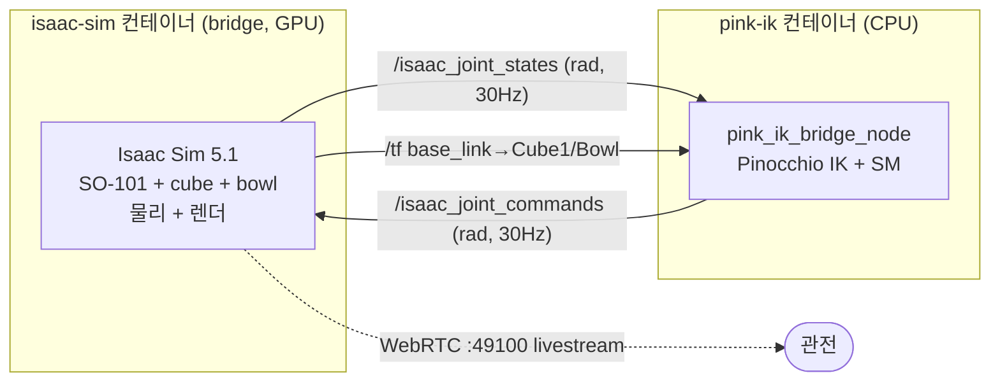
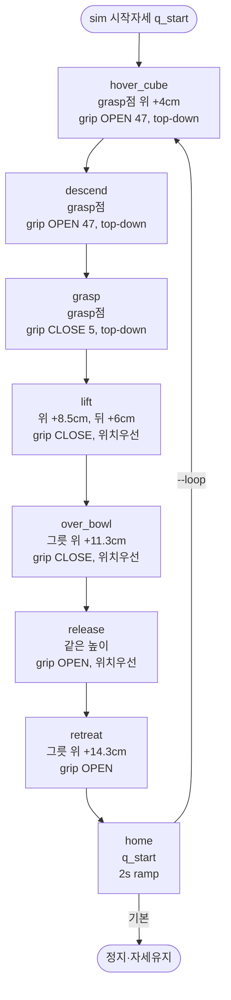

# pink IK 기반 SO-101 Pick-Place State Machine

pink(Pinocchio) 미분 역기구학(IK)을 백엔드로 SO-101 팔의 **pick-and-place 를 결정적으로**
수행하는 시스템 문서. VLA 정책 없이(추론 비경유) Isaac Sim bridge 를 직접 구동한다.

- **엔트리포인트**: `scripts/inference/pink_ik_bridge_node.py`
- **컨테이너**: `pink-ik` (`docker/Dockerfile.pink`, compose 서비스)
- **한 줄 실행**: `docker compose -f docker/docker-compose.yaml run --rm pink-ik`

---

## 1. 개요 — 무엇을·왜

| | 내용 |
|---|---|
| **목표** | 책상 위 큐브를 집어 그릇에 넣기. 위치는 `/tf` 로 실시간 파악 |
| **방식** | EE(그리퍼) 목표 waypoint 를 pink IK 로 풀어 관절각 생성 → joint-space 보간 → sim 에 publish |
| **VLA 대비** | 학습 불요·결정적·CPU 만. 궤적이 명시적이라 디버깅·튜닝 쉬움 |
| **핵심 난관 2가지** | ① URDF↔USD **base 프레임 90° 어긋남**(§3) ② SO-101 **비대칭 그리퍼 grasp 기하**(§6) |

> **왜 결정적 SM 인가**: VLA closed-loop 는 covariate shift 로 sim 에서 grasp 완결 못 하는 벽이
> 있었다(memory `onecube-eval-drift-wall`). pink IK SM 은 그 벽을 우회해 **재현 가능한 grasp**
> 를 먼저 확보 — 데이터 생성·검증 기판으로도 쓸 수 있다.

---

## 2. 아키텍처 — 2 컨테이너 토폴로지



**ROS 2 배선** (DDS: `rmw_fastrtps_cpp` + `UDPv4`, `network_mode: host`, domain 0):

| 방향 | 토픽 | 타입 | 내용 |
|---|---|---|---|
| bridge → node | `/isaac_joint_states` | `sensor_msgs/JointState` | 6 관절 위치(radian). 첫 프레임 = HOME(q_start) |
| bridge → node | `/tf` (`base_link`→`Cube1`,`Bowl`) | tf2 | 큐브·그릇 위치(base_link frame) |
| node → bridge | `/isaac_joint_commands` | `sensor_msgs/JointState` | 목표 관절 위치(radian). bridge ArticulationController(PD)가 추종 |

- **관절 순서**(양방향): `shoulder_pan, shoulder_lift, elbow_flex, wrist_flex, wrist_roll, gripper`
  (`so101_contract.feature_codec.SO101_JOINT_ORDER`). bridge 는 **이름으로 매칭** → 순서 무관.
- **단위**: 팔·그리퍼 모두 radian. gripper 범위 `[-10°, 100°]`.
- **EE 프레임**: `gripper_frame_link` (그리퍼 TCP).

---

## 3. 좌표계 & 프레임 보정 (★핵심)

세 프레임이 얽혀 있고, **URDF↔USD 90° 어긋남**이 이 프로젝트 최대 함정이었다.

```
 world (Isaac Sim 전역)                base_link (로봇 밑동)          URDF base (pinocchio)
 ─────────────────────                ──────────────────           ────────────────────
 robot @ (0, 0, 0.6749)               = world 를 z 180° 회전         = base_link 를 z 90° 더 회전!
 cube  @ (-0.015, 0.2552, 0.7246)     로봇 정면 = base -Y           pan=0 → 팔이 +X (딴 방향)
 bowl  @ (-0.22, 0.265, 0.70)         (world +Y = 정면)

   world +Y (정면, 큐브)                                  pan=0 일 때 팔 방향
        ▲                              base_link            URDF(pinocchio)
        │  cube ●                       +Y ▲                    │ pan=0
        │                                  │                    │  →  +X
   ─────┼─────▶ world +X          +X ◀─────┼   (= world -X)     ●────▶
        │ robot ●                          ● robot              base
```

**정합 관계** (검증됨):

1. **base_link = world 를 z축 180° 회전** + 이동 `(0,0,0.6749)`.
   확인: world 큐브 `(-0.015, 0.255, 0.05)` − robot → z180° 회전 = `(0.015, -0.255, 0.05)` = tf 실측값 ✓.
   → bridge `/tf` 값은 **정상**. (world 로그 변환은 `base_to_world`.)

2. **URDF base_link ≠ USD base_link**: URDF 를 pinocchio 로 로드하면 `pan=0 → 팔이 base +X`.
   그런데 sim(USD) 은 `pan=0 → 팔이 정면(큐브 방향)`. 둘이 **z축 ~90° 어긋남**.
   → cube tf 를 그대로 IK 목표로 쓰면 `shoulder_pan 이 정면 0° 대신 97°` 로 풀려 **90° 빗나감**.

### 해결 — 목표를 Rz(90°) 회전 후 IK

순수 base 회전은 **관절각을 바꾸지 않으므로**(회전은 kinematic chain 바깥), 목표만 회전해 풀고
결과 관절각을 그대로 publish 하면 된다.

```python
def rotz(p, deg):                       # z축 회전
    a = math.radians(deg); c, s = math.cos(a), math.sin(a)
    return np.array([c*p[0] - s*p[1], s*p[0] + c*p[1], p[2]])

q, err = ik.solve(rotz(cube_xyz, base_yaw), ...)   # base_yaw = 90
#  → q 의 shoulder_pan ≈ -1.9° (sim 정면 정렬). q 그대로 sim publish → 큐브 도달.
```

| base_yaw | cube IK shoulder_pan | 결과 |
|---|---|---|
| 0° | **96.9°** | 90° 빗나감 (틀림) |
| **90°** | **−1.9°** ✓ | sim 정면 정렬 (맞음) |

`--base-yaw-deg` 로 튠. SO-101 = 90°. (진단: "sim 에서 큐브 집으려면 pan≈0 이어야" → 역산.)

---

## 4. pink IK 백엔드

pink 는 **미분 IK**(differential IK)를 QP 로 푼다. 관절 속도를 반복 적분해 목표에 수렴.

```
목표 EE pose (SE3)
      │
      ▼
 FrameTask(gripper_frame_link, position_cost=1.0, orientation_cost=oc)   ← EE 를 목표로
 PostureTask(cost=1e-2, target=neutral+wrist_roll=-99°)                  ← null-space 정규화
      │
      ▼
 solve_ik(config, tasks, dt=1/30, solver="quadprog", damping=1e-6, safety_break=False)
      │  → 관절 속도 v
      ▼
 q ← pin.integrate(q, v·dt)     반복(≤4000, err<0.3mm 수렴)
```

**설계 요점**:

- **모델만 로드**(`pin.buildModelFromUrdf`, geom·mesh 불요) → IK 에 충분, 빠름.
- **`orientation_cost`**:
  - `0` (position-only): 위치만 맞춤. 팔 형상(방향)은 자유 → grasp 엔 부적합(§6).
  - `0.5` (grasp waypoint): 위치 + **top-down 방향** 타겟. 5-DOF 라 best-effort 지만 실 grasp 방향 0° 재현.
- **`PostureTask` wrist_roll = −99°**: null-space 를 실 grasp 손목각으로 유도.
- **seed 연쇄**: 각 waypoint IK 는 직전 waypoint 해를 seed → 부드러운 궤적, 국소최소 회피.
- **`safety_break=False`** + **seed clamp**: sim 관절한계(±π)가 URDF 한계보다 넓어, 측정 seed 를
  URDF limit 으로 clamp 하고 예외를 끈다(한계 밖 값에 안 죽음).
- **5-DOF 원칙**: SO-101 팔은 5축(+그리퍼)이라 임의 6-DOF pose 불가 → position 우선, orientation best-effort.

---

## 5. State Machine — waypoint 시퀀스

7 waypoint + home. 각 waypoint 를 **1회 IK** 로 관절각화하고, 순차적으로 **smoothstep joint-space
보간**(폐루프 IK 아님)으로 이동한다.



**waypoint 정의** (좌표 = sim base_link, 큐브/그릇 tf 기준 상대):

| # | tag | 위치 | gripper | top-down | 역할 |
|---|---|---|---|---|---|
| 1 | `hover_cube` | grasp점 + (0,0,**+hover** 0.04) | OPEN 47 | ✓ | 큐브 위 접근 |
| 2 | `descend` | **grasp점** | OPEN 47 | ✓ | grasp 위치로 하강 |
| 3 | `grasp` | grasp점 | **CLOSE 5** | ✓ | 그리퍼 닫아 집기 |
| 4 | `lift` | grasp점 + (0,**+0.06**,**+0.085**) | CLOSE 5 | ✗ | 위+**뒤**로 들어올림 |
| 5 | `over_bowl` | 그릇 + (0,0,**+0.113**) | CLOSE 5 | ✗ | 그릇 위(**높이유지**) |
| 6 | `release` | 그릇 + (0,0,+0.113) | **OPEN 47** | ✗ | 그 높이서 떨궈 넣기 |
| 7 | `retreat` | 그릇 + (0,0,+0.143) | OPEN 47 | ✗ | 위로 이탈 |
| 8 | `home` | q_start | (유지) | ✗ | 시작자세 복귀(2s) |

여기서 **grasp점 = cube + (grasp_dx 0, grasp_dy −0.016, grasp_z −0.043)** — §6 참조.

**두 가지 미묘한 궤적 설계** (실 trajectory 에서 배움):

- **lift 는 위+뒤로**(`lift_back` +0.06): 팔을 로봇쪽으로 당겨 올려야, 그릇으로 이동할 때
  보간 경로의 최저 z 가 ≈0.09 로 유지돼 **그릇을 낮게 쓸고 지나가지 않는다**. (똑바로만 올리면
  z 0.057 로 낮아 그릇 침.)
- **그릇은 안 내려감**: over_bowl·release 모두 그릇 위 +0.113m(z≈0.138). 그릇 속으로 하강하면
  그릇을 쳐 엎는다 → **높은 데서 큐브를 떨궈 넣는다**(실 trajectory 도 동일).

---

## 6. Grasp 유도 — 실 작업공간 trajectory 역산 (★핵심)

**SO-101 그리퍼는 비대칭**(한쪽 jaw 고정, 한쪽 moving jaw). TCP 를 큐브 중앙에 두면 잡는 게
아니라 **찌른다**. 또 position-only IK 는 같은 TCP 위치라도 **팔 형상(그리퍼 방향)이 달라** grasp 실패.

→ **실제로 이 위치의 큐브를 집었던 성공 trajectory**
(`scripts/ece_4560/real/sequences/pick_place_demo.json`, 실 follower 관절 degree + gripper[0,100])
를 `follower_calibration` 으로 sim 변환하고 FK 해서 grasp 파라미터를 **역산**했다.

```
실 trajectory (real follower deg, [0,100])
        │  real_follower_to_sim_radians()  (follower_calibration affine)
        ▼
실 grasp 자세 (sim rad)  ──FK──▶  grasp EE pose (위치 + 회전)
        │                               │
        ▼                               ▼
  gripper 값 47/5              GRASP_ORIENT(회전) + grasp 오프셋
```

**① grasp 위치 오프셋** (실 grasp EE vs 큐브 중심):

| | x | y | z |
|---|---|---|---|
| 실 grasp EE (sim base) | 0.020 | −0.271 | 0.007 |
| 큐브 중심 | 0.015 | −0.255 | 0.050 |
| **오프셋 = grasp점 − 큐브** | +0.005 | **−0.016** | **−0.043** |

→ `grasp_z = −0.043` (TCP 가 큐브 중심 **4.3cm 아래**, jaw 가 큐브 몸통을 감싸도록), `grasp_dy = −0.016`.
(초기엔 grasp_z=0 이라 그리퍼가 4.3cm 떠서 **못 잡던** 원인.)

**② gripper 값** (실 [0,100] → follower affine → sim feature):

| 단계 | 실 [0,100] | sim feature | 용도 |
|---|---|---|---|
| hover/approach | 50 | **47** | 절반 열림 (100 아님!) |
| grasp | 11 | **5** | 집기(꽉) |
| release | 44 | 40 | 놓기 |

→ `grip_open=47, grip_close=5`. (초기 100 은 "너무 크게 벌림".)

**③ grasp 방향 (top-down)** — position-only 로는 재현 불가, 방향 타겟 필요:

실 grasp EE 회전행렬(URDF frame)을 `GRASP_ORIENT` 상수로 박아, cube-side waypoint 에 `ori_cost=0.5`
로 타겟한다. TCP z축 ≈ `[−0.08, 0, −0.997]` = **거의 수직 아래**(top-down).

| | shoulder_pan | shoulder_lift | elbow | wrist_flex | wrist_roll |
|---|---|---|---|---|---|
| 실 grasp (sim) | −3.0 | 31.5 | −15.4 | **78.5** | −99.0 |
| pink IK (ori_cost 0.5) | −1.9 | 30.4 | −13.4 | **77.5** | −98.0 |
| position-only (ori_cost 0) | −1.9 | 0.4 | 35.7 | **31.4** | −97.4 |

→ 방향 타겟을 주면 **실 grasp 자세를 0° 오차로 재현**(wrist_flex 78 = 그리퍼 아래). position-only 는
같은 TCP 라도 wrist_flex 31(옆approach)로 풀려 못 잡음.

> **일반화 한계**: `GRASP_ORIENT` 는 이 큐브 azimuth(pan≈0) 기준 고정값. 큐브가 크게 이동하면
> 방향을 azimuth 만큼 회전해야 한다(현재는 고정 큐브용). ponytail.

---

## 7. 실행 흐름 — timed joint-space 보간

폐루프 IK(매틱 재계획)가 아니라, **미리 푼 관절각 사이를 시간 기반 보간**한다. sim PD 의 droop 나
watchdog 없이 **결정적**으로 같은 궤적을 재생.

```
_build() (첫 상태 수신 후 1회)
  ├ /tf 로 cube·bowl 위치 조회
  ├ 각 waypoint → ik.solve(rotz(xyz, base_yaw), orient, ...) → 관절각 q_i
  ├ q_i[gripper] = feat_to_rad(open/close)   ← 그리퍼는 IK 무시, 직접 설정
  └ seq = [(tag, q_i, leg_sec)...] + (home, q_start, home_sec)

_tick() @ 30Hz
  frac = smoothstep(t / leg)                 ← 0→1 부드러운 가감속
  q_cmd = q_from + frac · (q_to − q_from)     ← joint-space 선형보간
  publish(q_cmd)
  t += dt;  t ≥ leg 면 → 다음 waypoint (q_from = q_to)
  마지막(home) 후: --loop 면 재빌드, 아니면 정지·유지
```

- **보간 시간**: waypoint 당 `leg_sec`(기본 2s), home 복귀 `home_sec`(기본 2s, teleport 방지 ramp).
- **그리퍼**: IK 가 EE(gripper_frame_link)를 못 움직이므로 관절각에 직접 open/close 값을 덮고 함께 보간.
- **home 항상 추가**: `--loop` 여도 retreat→home 을 보간해 재시작 시 점프(teleport) 없음.
- **smoothstep** `3x²−2x³`: 시작·끝 속도 0 → 부드러운 이동.

---

## 8. 파라미터 (튜닝 노브)

기본값은 실 trajectory 역산값. `PINK_ARGS="..."` 로 주입.

| 인자 | 기본 | 의미 |
|---|---|---|
| `--base-yaw-deg` | 90 | URDF↔sim base z 보정(§3). pan 이 sim 정면 0° 되게 |
| `--wrist-roll-deg` | −99 | grasp 손목각(posture) |
| `--ori-cost` | 0.5 | top-down 방향 타겟 가중치(5-DOF best-effort) |
| `--grasp-z` | −0.043 | 큐브중심 대비 grasp 깊이(TCP 가 아래) |
| `--grasp-dy` / `--grasp-dx` | −0.016 / 0 | grasp 측면 오프셋 |
| `--grip-open` / `--grip-close` | 47 / 5 | 그리퍼 [0,100] (열림/집기) |
| `--hover` | 0.04 | grasp점 위 hover 높이 |
| `--lift` / `--lift-back` | 0.085 / 0.06 | 들어올림 높이 / 로봇쪽 당김(그릇 안 쓸게) |
| `--bowl-z` | 0.113 | 그릇 위 release 높이(안 내려감) |
| `--leg-sec` / `--home-sec` | 2 / 2 | waypoint 이동 / home 복귀 시간 |
| `--loop` | off | 완료 후 재집기 반복 |
| `--no-tf` / `--target-*` | — | tf 대신 고정 좌표 |

---

## 9. 실행법

```bash
# 빌드 (1회)
docker compose -f docker/docker-compose.yaml build pink-ik

# 오프라인 IK 검증 (ROS·sim 불요) — 7/7 waypoint 도달 확인
docker compose -f docker/docker-compose.yaml run --rm --no-deps pink-ik \
  python3 /workspace/scripts/inference/pink_ik_bridge_node.py --self-check

# 라이브 pick-place (bridge 가 떠 있어야 함) — 1회 후 home 정지
docker compose -f docker/docker-compose.yaml run --rm pink-ik

# bridge 먼저:
docker compose --env-file .env -f docker/docker-compose.yaml run --rm isaac-sim bridge

# 파라미터 예:
PINK_ARGS="--grip-close 3 --bowl-z 0.13" docker compose ... run --rm pink-ik
```

livestream: `http://localhost:49100` (원격은 `PUBLIC_IP` env).

---

## 10. 디버깅에서 얻은 교훈 (요약)

| 증상 | 진범 | 수정 |
|---|---|---|
| 팔이 90° 옆(오른쪽)으로 감 | **URDF↔USD base z 90° 어긋남** | 목표 Rz(90) 회전 후 IK (§3) |
| 큐브 위에 떠서 못 잡음 | grasp_z=0 (TCP 4.3cm 높음) | grasp_z=−0.043 (§6①) |
| 큐브 찌름/헛잡음 | position-only → 방향 틀림 | GRASP_ORIENT top-down + ori_cost (§6③) |
| 그리퍼 너무 크게 벌림 | grip_open=100 | 47 (실값, §6②) |
| 그릇 치며 이동 | lift 낮음(z0.057) | lift 위+뒤로(z0.091) (§5) |
| 그릇 엎음 | 그릇 속으로 하강 | 높은 데서 떨굼(bowl_z 0.113) (§5) |
| 복귀 시 teleport | loop 재시작 q_from 점프 | home waypoint 항상 추가·2s ramp (§7) |

각 항목 상세: `docs/TROUBLESHOOTING.md` (프레임 불일치) · memory `pink-ik-pickplace-container`.
```
