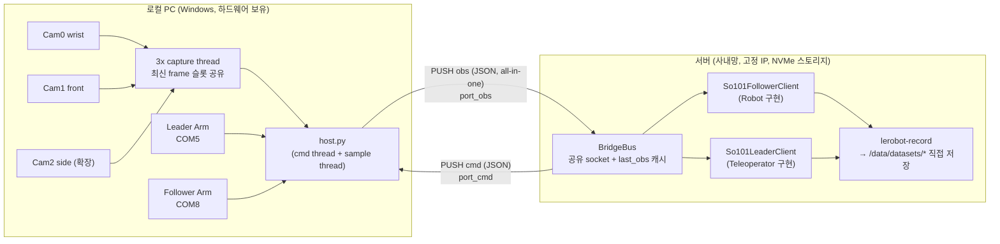
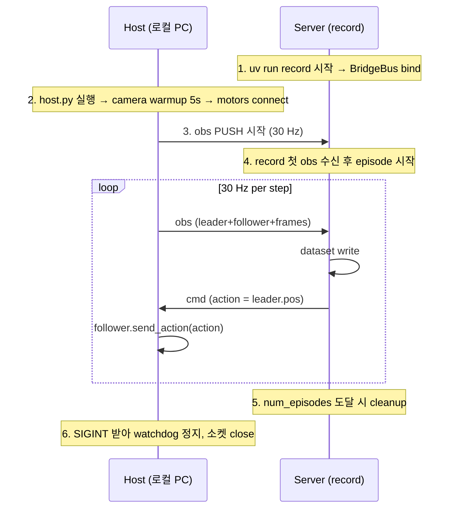

# 원격 텔레옵 데이터 수집 파이프라인 (서버 ↔ 로컬 PC)

## 1. 배경과 목표

### 1.1 현재 로컬 단일 머신 동작 방식

`./.venv/Lib/site-packages/lerobot/scripts/lerobot_record.py`(이하 `lerobot-record`)를 로컬 PC에서 실행해서 SO-101 Leader Arm으로 Follower Arm을 원격 조작하고 데이터셋을 기록한다. 검증된 실행 명령은 다음과 같다.

```bash
LEADER_PORT="COM5"
FOLLOWER_PORT="COM8"
LEADER_ID="so101_teleop"
FOLLOWER_ID="so101_robot"

WRIST_CAMERA=0
FRONT_CAMERA=1
CAMERA_WIDTH=640
CAMERA_HEIGHT=480
CAMERA_FPS=25
CAMERA_WARMUP_S=5
CAMERA_FOURCC="MJPG"

TASK="pick the pen"
DATASET_NAME="so101_pick_pen"
HF_USER="${HF_USER}"
DATASET_REPO="${HF_USER}/${DATASET_NAME}"
DATASET_ROOT="./datasets/${DATASET_NAME}"

CAMERAS="{wrist: {type: opencv, index_or_path: ${WRIST_CAMERA}, width: ${CAMERA_WIDTH}, height: ${CAMERA_HEIGHT}, fps: ${CAMERA_FPS}, warmup_s: ${CAMERA_WARMUP_S}, fourcc: ${CAMERA_FOURCC}}, front: {type: opencv, index_or_path: ${FRONT_CAMERA}, width: ${CAMERA_WIDTH}, height: ${CAMERA_HEIGHT}, fps: ${CAMERA_FPS}, warmup_s: ${CAMERA_WARMUP_S}, fourcc: ${CAMERA_FOURCC}}}"

uv run lerobot-record \
    --robot.type=so101_follower \
    --robot.port="${FOLLOWER_PORT}" \
    --robot.id="${FOLLOWER_ID}" \
    --robot.cameras="${CAMERAS}" \
    --teleop.type=so101_leader \
    --teleop.port="${LEADER_PORT:-COM8}" \
    --teleop.id="${LEADER_ID:-konan_teleop}" \
    --dataset.repo_id="${DATASET_REPO}" \
    --dataset.single_task="${TASK}" \
    --dataset.root="${DATASET_ROOT}" \
    --dataset.fps=30 \
    --dataset.episode_time_s=30 \
    --dataset.reset_time_s=10 \
    --dataset.num_episodes=10 \
    --dataset.push_to_hub=false \
    --play_sounds=false
```

### 1.2 변경 요구사항

| 항목 | 내용 |
|---|---|
| 하드웨어 위치 | 로컬 PC (Windows). Leader/Follower 직렬 포트(COM5, COM8), USB 카메라 |
| 실행 위치 | **서버**. 사내망에 있고 IP만 알면 접근 가능 |
| 카메라 수 | 최대 **3개**까지 확장 (`wrist`, `front`, `side` 등) |
| 데이터셋 저장 | **서버 디스크**에 직접 저장. 별도 동기화 없이 학습 파이프라인이 바로 사용 |
| 데이터셋 용도 | 서버에서 SmolVLA 등 학습 |

### 1.3 핵심 결론

- `lerobot-record`는 실행 호스트의 `--dataset.root` 경로에 저장하므로, **record를 서버에서 실행하기만 하면 데이터셋이 서버에 직접 쌓인다**. 추가 동기화·전송 단계 없음.
- 하드웨어 I/O(직렬 포트, USB 카메라)는 운영체제 레벨로 서버에서 접근 불가 → **로컬 PC에 host 프로세스**를 띄워 하드웨어를 대리 조작하고, 서버는 ZMQ로 원격 접근.
- lerobot에 이미 검증된 ZMQ host/client 패턴(`robots/lekiwi/lekiwi_host.py`, `lekiwi_client.py`)이 있어 그 구조를 SO-101용으로 포팅하는 것이 가장 짧은 경로.

---

## 2. 시스템 아키텍처

### 2.1 토폴로지



### 2.2 ZMQ 연결 방향 결정

LeKiwi는 host(이동 로봇)가 bind, client(PC)가 connect 형태였다. 본 시나리오에서는 반대로 가져간다.

| 항목 | 본 시나리오 채택값 | 이유 |
|---|---|---|
| `bind` 측 | **서버** | 고정 IP, 사내망에서 잘 알려져 있음 |
| `connect` 측 | **로컬 PC (host)** | DHCP여도 무관, 서버 IP만 알면 됨 |

→ host 프로세스는 시작 시 `tcp://<server_ip>:<port>` 에 `connect`. 서버 측은 `tcp://0.0.0.0:<port>` 에 `bind`.

### 2.3 채널 구성 (한 쌍의 PUSH/PULL)

| 채널 | 방향 | 소켓 옵션 | 페이로드 |
|---|---|---|---|
| `port_obs` | host → server | host PUSH / server PULL, `CONFLATE=1` | leader pos + follower pos + N개 JPEG 프레임 + timestamp 묶음 |
| `port_cmd` | server → host | server PUSH / host PULL, `CONFLATE=1` | follower 목표 위치(6 DOF) |

`CONFLATE=1`은 최신 메시지만 큐에 유지. 네트워크 흔들려도 지연 누적 방지.

### 2.4 페이로드 스키마

#### obs (host → server)

```json
{
  "t_ns": 1234567890,
  "follower": {
    "shoulder_pan.pos": 0.12,
    "shoulder_lift.pos": -0.34,
    "elbow_flex.pos":   1.05,
    "wrist_flex.pos":   0.00,
    "wrist_roll.pos":   0.22,
    "gripper.pos":      0.50
  },
  "leader": {
    "shoulder_pan.pos": 0.13,
    "shoulder_lift.pos": -0.33,
    "elbow_flex.pos":   1.06,
    "wrist_flex.pos":   0.01,
    "wrist_roll.pos":   0.22,
    "gripper.pos":      0.51
  },
  "cameras": {
    "wrist": "<jpeg_base64>",
    "front": "<jpeg_base64>",
    "side":  "<jpeg_base64>"
  }
}
```

- 모터 키 이름은 lerobot의 `so101_follower` / `so101_leader` 키 네이밍을 그대로 따른다.
- 카메라 키 집합은 host config에서 동적으로 결정 (1~3개).
- timestamp `t_ns`는 host 단조 시계(`time.monotonic_ns()`). 서버 측 데이터셋의 `timestamp` 컬럼 보정용.

#### cmd (server → host)

```json
{
  "shoulder_pan.pos": 0.14,
  "shoulder_lift.pos": -0.30,
  "elbow_flex.pos":   1.04,
  "wrist_flex.pos":   0.02,
  "wrist_roll.pos":   0.21,
  "gripper.pos":      0.49
}
```

motor space 그대로. 서버 측에서 변환 없이 `follower.send_action(action)`을 통해 호스트로 전달되고, host가 그대로 모터에 적용.

### 2.5 대역폭과 처리량 추정

| 항목 | 값 |
|---|---|
| 해상도 | 640×480 BGR |
| 인코딩 | JPEG q=90 → 한 프레임 ~40 KB |
| 카메라 수 | 3 |
| fps | 30 |
| 영상 대역폭 | 3 × 40 KB × 30 ≈ **28 Mbps** |
| 메타데이터 | JSON 수 KB/s 수준, 무시 가능 |
| 사내 1G LAN | 충분히 여유 |

q=85로 낮추면 절반. 향후 1280×720으로 키울 경우 H.264 RTP 또는 GStreamer 도입 검토.

---

## 3. 구성 요소 상세

### 3.1 로컬 PC: host 프로세스

#### 파일 위치 (제안)

```
src/sim_to_real/teleop_remote/
├── host.py
├── camera_worker.py
├── bridge_bus.py        # 서버에도 동일 모듈 사용
├── follower_client.py   # 서버 측에서 import
├── leader_client.py     # 서버 측에서 import
└── config.py
```

`bridge_bus.py`는 서버 측에서만 의미가 있고 host는 직접 ZMQ socket을 다루지만, 같은 패키지로 두어 양쪽이 같은 의존성 트리에서 관리되도록 한다. 실행은 `uv run python -m sim_to_real.teleop_remote.host ...`.

#### 스레드 구조

| 스레드 | 역할 | 주기 |
|---|---|---|
| `cam_thread` × N | `cv2.VideoCapture` 무한 read, 캠별 슬롯에 최신 BGR atomic write | 카메라 자체 fps (25~30) |
| `cmd_thread` | `port_cmd` PULL → 즉시 `follower.send_action(action)` | 메시지 도착 시 |
| `sample_thread` (main) | leader.read_pos + follower.read_pos + 캠 슬롯 snapshot + JPEG 인코딩 + PUSH | **30 Hz tick** |
| `watchdog` | cmd 미수신이 N ms 초과 시 follower 안전 정지 | 100 ms |

GIL는 `cv2.imencode`, motor bus 직렬 I/O, ZMQ send/recv 모두에서 풀리므로 멀티스레드로 충분. 멀티프로세스는 불필요.

#### 의사 코드 (sample loop)

```python
while running:
    tick_start = time.perf_counter()

    leader_pos   = leader.read_positions()      # ~5 ms
    follower_pos = follower.read_positions()    # ~5 ms

    frames_jpg = {}
    for name, slot in cam_slots.items():
        frame = slot.read_latest()              # numpy BGR
        ok, buf = cv2.imencode(".jpg", frame, [cv2.IMWRITE_JPEG_QUALITY, 90])
        frames_jpg[name] = base64.b64encode(buf).decode("ascii") if ok else ""

    payload = {
        "t_ns": time.monotonic_ns(),
        "follower": follower_pos,
        "leader":   leader_pos,
        "cameras":  frames_jpg,
    }
    obs_socket.send_string(json.dumps(payload), flags=zmq.NOBLOCK)

    elapsed = time.perf_counter() - tick_start
    time.sleep(max(1/30 - elapsed, 0))
```

#### 의사 코드 (cmd loop)

```python
while running:
    try:
        msg = cmd_socket.recv_string(flags=zmq.NOBLOCK)
        action = json.loads(msg)
        follower.send_action(action)
        last_cmd_ts = time.monotonic()
    except zmq.Again:
        time.sleep(0.001)
```

#### Watchdog

```python
if time.monotonic() - last_cmd_ts > WATCHDOG_S:
    follower.hold_current_position()   # 또는 torque off
```

#### 호스트 CLI 옵션

| 옵션 | 예시 | 비고 |
|---|---|---|
| `--server-ip` | `10.0.0.42` | 서버 IP |
| `--port-obs` | `5555` | server bind 포트 |
| `--port-cmd` | `5556` | server bind 포트 |
| `--leader.port` | `COM5` | Windows 직렬 포트 |
| `--follower.port` | `COM8` | |
| `--leader.id` | `so101_teleop` | |
| `--follower.id` | `so101_robot` | |
| `--cameras` | `wrist:0,front:1,side:2` | 1~3개 동적 |
| `--cam.width` `--cam.height` `--cam.fps` `--cam.warmup_s` `--cam.fourcc` | 기존 값 그대로 | |
| `--fps` | `30` | sample tick |
| `--jpeg-q` | `90` | 영상 품질 |
| `--watchdog-ms` | `500` | follower 안전정지 임계 |

### 3.2 서버: lerobot Robot/Teleoperator 어댑터

`lerobot-record`는 다음 두 인터페이스에만 의존:

- `Robot` 서브클래스: `connect` / `get_observation` / `send_action` / `disconnect` 등
- `Teleoperator` 서브클래스: `connect` / `get_action` / `disconnect` 등

이 둘을 ZMQ를 통해 host와 통신하는 형태로 구현한다.

#### `BridgeBus` (싱글톤)

- `port_obs`에 PULL bind, `port_cmd`에 PUSH bind.
- `pull_latest()`: 폴러로 최신 obs 메시지만 가져와 `self.last`에 캐시. 새 메시지가 없으면 직전 값 유지.
- `send_cmd(action_dict)`: cmd 채널로 PUSH.
- 한 프로세스 안에서 `FollowerClient`와 `LeaderClient`가 같은 인스턴스를 공유.

```python
class BridgeBus:
    _instance: "BridgeBus | None" = None

    @classmethod
    def get(cls, bind_ip, port_obs, port_cmd):
        if cls._instance is None:
            cls._instance = cls(bind_ip, port_obs, port_cmd)
        return cls._instance

    def __init__(self, bind_ip, port_obs, port_cmd):
        ctx = zmq.Context.instance()
        self.obs = ctx.socket(zmq.PULL); self.obs.setsockopt(zmq.CONFLATE, 1)
        self.obs.bind(f"tcp://{bind_ip}:{port_obs}")
        self.cmd = ctx.socket(zmq.PUSH); self.cmd.setsockopt(zmq.CONFLATE, 1)
        self.cmd.bind(f"tcp://{bind_ip}:{port_cmd}")
        self.last = None
        self._poller = zmq.Poller(); self._poller.register(self.obs, zmq.POLLIN)

    def pull_latest(self, timeout_ms=50):
        socks = dict(self._poller.poll(timeout_ms))
        if self.obs in socks:
            try:
                while True:
                    self.last = json.loads(self.obs.recv_string(zmq.NOBLOCK))
            except zmq.Again:
                pass
        return self.last

    def send_cmd(self, action):
        self.cmd.send_string(json.dumps(action))
```

#### `So101FollowerClient(Robot)`

- `observation_features` = follower 6 모터 키 + 카메라 N개 (`(H, W, 3)`)
- `action_features` = follower 6 모터 키
- `get_observation()`:
  1. `BridgeBus.pull_latest()` 호출
  2. follower 키들 + `OBS_STATE` 벡터 채움
  3. `cameras[*]` JPEG → base64 decode → `cv2.imdecode` → numpy BGR으로 변환해 obs dict에 삽입
- `send_action(action)`:
  1. `BridgeBus.send_cmd(action)` 호출
  2. 데이터셋 기록용으로 `ACTION` 벡터 반환

기존 `lekiwi_client.py`의 구조를 거의 그대로 따르되, SO-101 6 DOF에 맞춰 `_state_ft`와 카메라 키 집합을 수정한다.

#### `So101LeaderClient(Teleoperator)`

- `action_features` = follower와 동일한 6 모터 키 (leader pos가 action이 됨)
- `get_action()`:
  1. `BridgeBus.last`를 읽음 (record loop가 직전에 `FollowerClient.get_observation()`에서 `pull_latest()` 호출했으므로 캐시가 채워져 있음)
  2. `leader` 딕셔너리만 추출해 반환

> ⚠️ 호출 순서 가정: `lerobot-record`는 한 스텝 안에서 `robot.get_observation()` → `teleop.get_action()` → `robot.send_action()` 순으로 호출한다. `LeaderClient.get_action()`은 `pull_latest()`를 다시 부르지 않고 캐시만 읽도록 해서, 두 객체가 **같은 obs 메시지 = 같은 시각 데이터**를 보도록 한다.

#### lerobot registry 등록

`Robot` / `Teleoperator` 서브클래스를 lerobot이 인식하려면 패키지의 `robots/__init__.py`, `teleoperators/__init__.py`에 entry point를 추가하거나, 본 레포 측에서 `lerobot.robots.utils.make_robot_from_config` 등을 사용하는 진입점에 명시적 import를 거는 방식이 필요. **lerobot 본체를 직접 패치하지 않는 방법**으로는 다음 두 가지가 후보다.

1. 본 레포의 `pyproject.toml`에 `[project.entry-points."lerobot.robots"]` 그룹이 있는지 확인하고, 없으면 lerobot의 `make_robot` 호출 시점 직전에 SOAR(SO-101 Remote) 클래스를 수동 등록하는 thin wrapper 스크립트를 둔다.
2. `lerobot-record`를 직접 호출하지 않고 본 레포의 `scripts/record_remote.py`에서 lerobot 내부 record 함수를 호출하면서 `robot=So101FollowerClient(...)`, `teleop=So101LeaderClient(...)`를 인스턴스로 직접 주입한다.

후자가 마찰이 더 적다 (lerobot 내부 코드 수정 0). 1차 구현은 2번 방식으로 진행 권장.

### 3.3 서버 측 record 실행 예

```bash
SERVER_BIND="0.0.0.0"
PORT_OBS=5555
PORT_CMD=5556

TASK="pick the pen"
DATASET_NAME="so101_pick_pen"
DATASET_ROOT="/data/datasets/${DATASET_NAME}"   # 서버 NVMe 경로

CAMERAS_REMOTE="{wrist: {type: remote, shape: [480, 640, 3]}, front: {type: remote, shape: [480, 640, 3]}, side: {type: remote, shape: [480, 640, 3]}}"

uv run python -m sim_to_real.teleop_remote.record \
    --robot.type=so101_follower_remote \
    --robot.bind_ip="${SERVER_BIND}" \
    --robot.port_obs="${PORT_OBS}" \
    --robot.port_cmd="${PORT_CMD}" \
    --robot.cameras="${CAMERAS_REMOTE}" \
    --robot.id=so101_robot \
    --teleop.type=so101_leader_remote \
    --teleop.id=so101_teleop \
    --dataset.repo_id="${HF_USER}/${DATASET_NAME}" \
    --dataset.single_task="${TASK}" \
    --dataset.root="${DATASET_ROOT}" \
    --dataset.fps=30 \
    --dataset.episode_time_s=30 \
    --dataset.reset_time_s=10 \
    --dataset.num_episodes=10 \
    --dataset.push_to_hub=false \
    --play_sounds=false
```

- `--robot.cameras`는 remote 모드용 더미 카메라 config (shape만 필요). 실제 캡처는 host가 담당.
- `--dataset.root`가 서버 디스크 경로이므로 record는 mp4 + parquet을 서버에 직접 작성.

### 3.4 호스트 실행 예

```powershell
# 로컬 PC (Windows PowerShell)
uv run python -m sim_to_real.teleop_remote.host `
    --server-ip 10.0.0.42 `
    --port-obs 5555 `
    --port-cmd 5556 `
    --leader.port COM5 --leader.id so101_teleop `
    --follower.port COM8 --follower.id so101_robot `
    --cameras "wrist:0,front:1,side:2" `
    --cam.width 640 --cam.height 480 --cam.fps 30 --cam.warmup_s 5 --cam.fourcc MJPG `
    --fps 30 --jpeg-q 90 --watchdog-ms 500
```

### 3.5 기동 순서



> 서버를 먼저 띄워 bind를 잡고, host는 나중에 connect하는 순서가 안전. 반대 순서도 ZMQ가 재시도하지만 첫 sample 손실 가능.

---

## 4. 데이터셋 저장 정책

| 항목 | 값 |
|---|---|
| 저장 위치 | **서버 NVMe**, 예: `/data/datasets/so101_pick_pen` |
| 형식 | LeRobot 데이터셋 표준 (parquet + mp4 per camera) |
| push_to_hub | `false` (학습은 서버 로컬에서 수행) |
| repo_id | hub에 안 올려도 메타데이터 키로 필요. `${HF_USER}/${DATASET_NAME}` 형태 유지 |
| 백업 | 별도 정책 없음. 필요 시 rsync 또는 사내 NAS로 주기적 복사 |

- 추가 동기화 단계 없음. record가 직접 디스크에 쓴다.
- 학습 스크립트(`scripts/`)는 같은 경로를 `--dataset.root`로 가리키면 됨.

---

## 5. 운영 시 주의점

### 5.1 동기화

- 한 obs 메시지에 leader/follower/camera를 모두 묶어서 보내므로 **샘플 내부 시각 정렬은 보장된다** (호스트 sample tick 기준).
- 단, motor 직렬 read 5 ms + 카메라 capture는 실제로는 각 카메라의 비동기 read 결과(가장 최신 프레임). 카메라 간 미세 jitter(<30 ms)는 30 Hz 데이터셋 수준에서 허용.
- timestamp `t_ns` 컬럼을 별도 보존해 두면 후처리에서 리샘플/정렬 가능.

### 5.2 지연

| 구간 | 예상 지연 |
|---|---|
| Leader read → host JSON 인코딩 | < 10 ms |
| host → server LAN | < 1 ms |
| server JSON 디코딩 + record write | 수 ms |
| server cmd send → host recv | < 1 ms |
| host follower 모터 적용 | 5 ms |
| **action RTT 총합** | 약 **20~30 ms** (사내 LAN 기준) |

30 Hz(33 ms)에 맞으므로 leader 조작감은 직결과 거의 동일. 향후 카메라 해상도/수를 늘려 JPEG 인코딩 부담이 커지면 별도 측정 필요.

### 5.3 안전

- **Watchdog 필수**: cmd 미수신 N ms 초과 시 follower 정지. 네트워크 절단/서버 크래시 시 로봇이 위험한 자세로 hold되거나 폭주하는 것을 방지.
- 호스트 종료 시: SIGINT 받아 follower torque off + camera release + ZMQ close 순서. `finally` 블록에서 보장.
- 서버 종료 시: record가 멈춰도 host는 obs를 계속 PUSH (PUSH/PULL은 buffer 채워지면 block 또는 drop). `CONFLATE=1`이므로 drop. 호스트는 정상.

### 5.4 카메라 확장 시 체크 리스트

- USB 대역폭: 같은 USB 컨트롤러에 3개 물리면 MJPG여도 대역폭 부족 가능. **다른 USB 컨트롤러 분산** 권장 (장치 관리자에서 확인).
- `cv2.VideoCapture` 백엔드: Windows는 `cv2.CAP_DSHOW` 또는 `cv2.CAP_MSMF`. MJPG fourcc 명시 + warmup 5s는 기존 그대로.
- 카메라 인덱스 안정성: USB 포트 바꾸면 인덱스가 흔들림. 가능하면 `index_or_path`에 device path 사용.

### 5.5 방화벽

| 위치 | 규칙 |
|---|---|
| 서버 | inbound TCP `port_obs`, `port_cmd` 허용 |
| 로컬 PC | outbound TCP 허용 (보통 기본 허용) |

사내망이라 NAT/터널은 필요 없지만, 서버 OS 방화벽에 포트 inbound 허용은 명시적으로 열어야 함.

### 5.6 lerobot 본체 의존성

- 본 레포는 lerobot을 `.venv`에 설치된 패키지로 사용. 호스트와 서버 양쪽 모두 같은 lerobot 버전 사용 권장 (모터 키 네이밍/내부 helper 변경 흡수용).
- ABI 핀(`numpy==1.26.0`, `pyarrow<19`, `h5py<3.16`, `torch==2.7.0+cu128`)은 `pyproject.toml`에 의도적으로 걸려 있다. 임의 업그레이드 금지. (`AGENTS.md` §의존성 호환성 규칙 참조)

---

## 6. 구현 로드맵

### 단계 1: 골격

- [ ] `src/sim_to_real/teleop_remote/` 디렉터리 생성
- [ ] `bridge_bus.py` — 싱글톤 BridgeBus 클래스, ZMQ bind/connect 모두 지원
- [ ] `config.py` — host config, follower client config, leader client config dataclass
- [ ] `follower_client.py` — `So101FollowerClient(Robot)` 골격, observation_features / action_features 정의
- [ ] `leader_client.py` — `So101LeaderClient(Teleoperator)` 골격
- [ ] `host.py` — 단일 카메라 + 단일 motor 페어로 sample/cmd 루프만 동작 확인
- [ ] `scripts/record_remote.py` — lerobot record loop를 직접 호출하는 thin wrapper, robot/teleop 인스턴스 주입

### 단계 2: 멀티 카메라

- [ ] `camera_worker.py` — 캠별 capture thread, 슬롯형 최신 frame 공유
- [ ] host config의 `--cameras` 파싱 (1~3개)
- [ ] follower client `_cameras_ft` 동적 구성

### 단계 3: 안정화

- [ ] Watchdog 구현 + 통합 테스트
- [ ] timestamp 보존 컬럼 추가, 데이터셋 metadata에 host 시계 정보 명시
- [ ] 30 Hz 유지 측정 (잠깐 100 회 sample 후 평균 tick 출력)
- [ ] 에피소드 종료/시작 시 cleanup 시나리오 점검

### 단계 4: 운영 편의

- [ ] 호스트 자동 재시작 (Windows Task Scheduler 또는 NSSM)
- [ ] 서버 record 스크립트의 환경변수 템플릿 정리
- [ ] `docs/TROUBLESHOOTING.md`에 케이스 추가:
  - 카메라 인덱스 흔들림
  - watchdog 작동 후 복구
  - 사내 방화벽 차단으로 connect 실패
- [ ] 사내 학습 파이프라인 측에서 데이터셋 경로 합의

---

## 7. 빠른 인계 체크리스트

이 문서를 처음 받는 다음 작업자가 5분 안에 상황을 파악할 수 있도록.

1. **목표**: 하드웨어는 로컬 PC, 실행과 데이터셋 저장은 서버. lerobot의 LeKiwi ZMQ host/client 패턴을 SO-101용으로 포팅.
2. **네트워크**: 사내망 같은 서브넷, IP 직결. SSH 터널/Tailscale 불필요. 서버 OS 방화벽에 `port_obs`(예 5555), `port_cmd`(예 5556) TCP inbound 허용만 추가.
3. **카메라**: 최대 3개. host config에서 동적 결정. JPEG q=90, 28 Mbps 추정.
4. **데이터셋**: 서버에서 record가 도므로 `--dataset.root=/data/datasets/...`에 자동 저장. 별도 동기화 없음.
5. **참고 코드**: `.venv/Lib/site-packages/lerobot/robots/lekiwi/lekiwi_host.py`, `lekiwi_client.py`, `cameras/zmq/`. 이 세 파일이 패턴 원형.
6. **새 파일 위치**: `src/sim_to_real/teleop_remote/` (host.py, bridge_bus.py, follower_client.py, leader_client.py, camera_worker.py, config.py), `scripts/record_remote.py`.
7. **lerobot 본체 패치 금지**: `scripts/record_remote.py`에서 robot/teleop 인스턴스를 직접 주입하는 방식으로 우회.
8. **안전**: watchdog 구현 전에는 follower 작동 금지. 시연 시 비상정지 절차 사전 합의.
