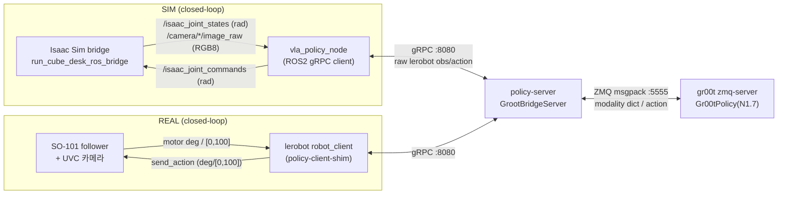

# SO-101 추론 파이프라인 데이터 변환 — Sim ↔ Real Parity 감사

> **목적**: 카메라·로봇 데이터가 정책(SmolVLA / **GR00T-N1.7**)에 입력되어 SO-101 제어 신호로 나오기까지
> 거치는 **모든 변환(단위·오프셋·스케일·정규화·좌표·순서·전처리)** 을 sim·real 양쪽에서 추적하고,
> **같은 모델이 sim 과 real 에서 로봇을 다르게 움직이게 만들 수 있는 인자**를 전부 정리한다.
>
> **작성**: 2026-06-15. 대상 코드 = GR00T-N1.7 bridge 경로 기준(SmolVLA 차이는 별도 표기).
> 관련 문서: [`PATH_GROOT_N17.md`](PATH_GROOT_N17.md) · [`PICKCUBE_CUROBO_PROJECT.md`](PICKCUBE_CUROBO_PROJECT.md) §13 ·
> [`REALDEVICE_GRASP_PIPELINE.md`](REALDEVICE_GRASP_PIPELINE.md).

---

## 0. 두 추론 경로



| | SIM | REAL |
|---|---|---|
| 클라이언트 | `vla_policy_node`(ROS2) | `robot_client`(lerobot async, `policy-client-shim.py`) |
| obs 소스 | Isaac bridge (joint rad + 렌더 RGB) | feetech 모터 + UVC 카메라 |
| 단위 변환 위치 | `vla_policy_node`(`to/from_lerobot_units`) | `SO101Follower` 캘리브레이션(내장) |
| action 적용 | ArticulationController PD | feetech 모터 step write |
| **gRPC 서버·모델은 동일** | GrootBridgeServer → ZMQ → Gr00tPolicy (체크포인트·정규화 stats 동일) | 〃 |

**parity 의 핵심**: gRPC 서버·GR00T 모델·정규화 통계는 sim/real 공유. 분기는 **클라이언트 양 끝(obs 생성·action 적용)** 에서만 일어난다.

---

## 1. 단위 변환 (sim·real 공통 계약)

`scripts/sim/lerobot_units.py` · `ros2_ws/.../so101_vla_policy/units.py` (동일 수식).

| 방향 | arm 5축 | gripper | 상수 |
|---|---|---|---|
| `to_lerobot_units` (rad→LeRobot) | `× 180/π` → deg | `× 31.75` → [0,100] | `_RAD_TO_DEG=57.29578`, `GRIPPER_LEROBOT_SCALE=31.75` |
| `from_lerobot_units` (LeRobot→rad) | `× π/180` → rad | `÷ 31.75` → rad | `_DEG_TO_RAD=0.0174533` |

- **joint 순서**(불변): `shoulder_pan, shoulder_lift, elbow_flex, wrist_flex, wrist_roll, gripper` (`SO101_JOINT_ORDER`). 노드는 JointState `name` 으로 재정렬해 이 순서 보장.
- **데이터셋 계약**(North Star): LeRobot v3.0 · `so_follower` · state/action 6-dim(arm deg + gripper [0,100]) · `observation.images.{top,wrist,front}` 480×640×3 RGB.

---

## 2. SIM 경로 변환 체인

### 2.1 Observation (Isaac → 서버)

| # | 단계 | 입력 | 연산 | 출력 | 파일:line |
|---|---|---|---|---|---|
| 1 | bridge publish | joint (rad), articulation 순서 | — | `/isaac_joint_states` (rad), 30 Hz | `run_cube_desk_ros_bridge.py:164,501,428` |
| 2 | bridge 카메라 | TopCamera/WristCamera/FrontCamera (focal **18mm**) | ROS2CameraHelper `type=rgb` | `/camera/{top,wrist,front}/image_raw` **RGB8** 480×640, 30 Hz | `:174-182,406` |
| 3 | 노드 수신·재정렬 | JointState(rad) | name→`SO101_JOINT_ORDER` | `_joint_rad` | `vla_policy_node.py:255-261` |
| 4 | 단위 변환 | rad | `to_lerobot_units` | arm deg + gripper [0,100] | `:278` |
| 5 | obs 구성 | + 이미지(bare key `top/wrist/front`) + task | dict | raw_obs → gRPC | `:279-283,128` |

### 2.2 Action (서버 → Isaac)

| # | 단계 | 입력 | 연산 | 출력 | 파일:line |
|---|---|---|---|---|---|
| 1 | 수신·역변환 | action chunk (deg, [0,100]) | `from_lerobot_units` | rad | `:304,306` |
| 2 | **그리퍼 오프셋** | `raw_rad[gripper]` | **`+= GRIPPER_CMD_OFFSET (0.20)`** | rad | `:307-308` |
| 3 | clamp | rad | `clamp_joint_rad` (arm ±π, gripper [-0.175,1.745]) | rad | `:309` |
| 4 | publish | rad | JointState | `/isaac_joint_commands`, 30 Hz | `:310-315` |
| 5 | chunk blending | timestep queue | weighted_average, refill `ceil(apc×0.5)` | — | `:240,289-300` |
| 6 | 물리 적용 | rad target | PD: **Kp 17.8 / Kd 0.6**, arm effort 10 / **gripper 0.5 Nm**, vel arm 5 / grip 2.5 | 관절 운동 | `run_cube_desk_ros_bridge.py:190-202,491-518` |

> SIM 물리 parity 는 cuRobo 데이터 생성 env 와 동일하게 맞춰져 있음(soft PD·gentle gripper·TGS). 학습 데이터와 동일 물리.

---

## 3. Bridge + GR00T 내부 변환

### 3.1 Bridge (`policy_server_groot_bridge.py`) — **정규화/스케일 없음**

| 방향 | 변환 | 비고 | 파일:line |
|---|---|---|---|
| obs→GR00T | state→`single_arm`(1,1,5)+`gripper`(1,1,1) f32, video bare key→`video.{front,wrist,top}`(1,1,H,W,3) u8, task→`language` | **raw 통과**(정규화는 GR00T 내부) | `:241-263` |
| GR00T→chunk | `single_arm`(1,16,5)+`gripper`(1,16,1) → squeeze+concat (16,6) | **스케일/오프셋 없음** | `:266-276` |

### 3.2 Gr00tPolicy 내부 (`ref_repos/Isaac-GR00T`)

| 단계 | 처리 | 파일:line |
|---|---|---|
| state 정규화 | **min-max** → [-1,1], `clip_outliers=True` | `state_action_processor.py:240-248,396` |
| 추론 | 정규화 state + 토큰화 이미지 → 정규화 action | `gr00t_policy.py:408` |
| action 역정규화 | min-max 역변환 | `state_action_processor.py:431-453` |
| **relative→absolute** | `single_arm`=**RELATIVE** → `절대 = reference_state(=관측 state[-1]) + delta`; `gripper`=**ABSOLUTE**(그대로) | `so101_config.py:48-62`, `state_action_processor.py:455-507` |

- **정규화 stats 는 체크포인트에 baked**(`experiment_cfg/dataset_statistics.json` + `processor/statistics.json`) → sim/real 동일 적용.
- **min-max 모드**(`mean_std_embedding_keys` 미지정, `use_percentiles=False`). 실제 baked 범위(`..._baseline` 체크포인트):
  - state `single_arm` min `[-48.8,-96.1,-69.9,-52.9,-141.7]` / max `[63.4,60.3,90.0,95.0,137.2]` (deg)
  - state `gripper` min `[-1.59]` / max `[29.19]`
  - action `single_arm`/`gripper` 별도(relative_action 은 timestep별 stats)

> ⚠ **개념 정정**: 기존 문서·메모의 "GR00T action = 절대" 는 **`get_action` 의 반환값**(unapply 후) 기준으로는 맞다.
> 그러나 모델이 내부적으로 예측하는 것은 `single_arm` **상대 delta** 이고, `reference_state` 로 **관측 state** 를 더해 절대화한다.
> → **관측 state 정확도가 그대로 action 정확도가 된다**(아래 §5 #2).

---

## 4. REAL 경로 변환 체인

| # | 단계 | 입력 | 연산 | 출력 | 파일 |
|---|---|---|---|---|---|
| 1 | 모터 읽기 | feetech step | `SO101Follower` 캘리브 | deg + gripper [0,100] | lerobot `so_follower.py` |
| 2 | 카메라 | UVC | (RENAME_MAP) | GR00T=bare `top/wrist/front`, SmolVLA=`camera1/2/3` | `env/groot_n17.env:54`(빈값) / `env/smolvla.env:42` |
| 3 | obs 전송 | deg+[0,100]+img+task | gRPC | 서버(동일 GrootBridgeServer) | `policy-client-shim.py`, `lerobot-entrypoint.sh:689-723` |
| 4 | action 적용 | chunk (deg, [0,100]) | `SO101Follower.send_action` → 캘리브 → motor step | feetech write | lerobot `so_follower.py` |

- **robot_client 는 `GRIPPER_CMD_OFFSET` 을 읽지 않는다**(코드상 `os.getenv("GRIPPER_CMD_OFFSET")` 는 `vla_policy_node` 에만 존재). → real 경로 오프셋 = **0**.
- action chunk 소비·blending 은 lerobot async client 의 ActionQueue(서버측 RTC 는 비권장, §13).

---

## 5. 🎯 Sim ↔ Real 제어 분기 인자 (핵심)

| # | 인자 | SIM | REAL | 결과 | 심각도 |
|---|---|---|---|---|---|
| **1** | **GRIPPER_CMD_OFFSET** | `+0.20 rad` 재적용 | `0` (미적용) | **§5.1 참조 — sim 학습 모델엔 함정** | 🔴 |
| **2** | `single_arm` **RELATIVE** action | 관측 state 정확 → delta 정확 | 센서 오차·지연 → delta 기준점 흔들림 → **누적 drift** | 같은 모델이 real 에서 더 부정확 | 🟠 |
| **3** | **min-max 정규화 범위**(sim stats) | 학습 분포 안 | real joint/gripper 가 sim min/max 벗어나면 `clip` → 입력 왜곡 | 정규화 mismatch | 🟠 |
| **4** | **카메라 intrinsic/FOV** | focal **18mm** + DR 16–20mm, 렌더 정합 | 실측 미상(렌즈·왜곡·색감 다름) | 시각 도메인 갭 (BC 시각 입력 분포 shift) | 🟠 |
| **5** | **제어 지연** | ~33 ms(30 Hz, 단 렌더 병목) | ~100–200 ms(USB/ROS/직렬) | chunk 소비 타이밍·페루프 위상 차 | 🟡 |
| **6** | **동역학** | PhysX soft PD(Kp17.8·effort0.5) | 실제 모터 토크·마찰·관성 | 같은 target → 다른 궤적 | 🟡 |
| **7** | **카메라 키(RENAME_MAP)** | GR00T=bare(정합), SmolVLA=camera1/2/3 | 동일 규칙 | GR00T 는 sim=real 동일, 분기 아님 | 🟢(GR00T) |
| **8** | 단위(rad↔deg)·joint 순서·해상도·RGB | 변환 자동 일치 | 동일 | 분기 아님(검증됨) | 🟢 |

### 5.1 🔴 GRIPPER_CMD_OFFSET — sim 학습 모델 real 배포 함정

오프셋의 출처는 **하드웨어가 아니라 sim 데이터 규약**이다:

```
Isaac PickCube env: gripper action term use_default_offset=True, init=0.20 rad
  → 실제 관절 target = action×1.0 + 0.20
recorder 기록 action = grip_target − 0.20   (pre-offset)
  → 모델은 "(grip_target − 0.20)" 분포를 학습
```

| 배포 | 필요한 처리 | 현재 코드 | 결과 |
|---|---|---|---|
| **SIM** (bridge 직결, env action term 우회) | `+0.20` 재적용해 true target 복원 | `vla_policy_node` 가 `+0.20` ✓ | 정상 |
| **REAL** (sim 학습 모델 배포) | 모델 출력이 sim 규약(pre-offset)이므로 **동일하게 보정 필요** | robot_client `0` ✗ | **그리퍼가 ~0.20 rad(≈[0,100]에서 6.35·≈11.5°) 덜 열림 → grasp 실패 위험** |

> `env/*.env` 주석의 "실기기=0" 은 **실기기 데이터로 학습한(절대각) 모델** 전제다. **이번처럼 sim cuRobo 데이터로 학습한 GR00T 를 real 에 올리면 0 이 아니라 보정이 필요**할 수 있다(real gripper "0" 캘리브 정의와 대조 검증 필요). **현재 real 배포 미진행이라 잠재 함정으로 기록.**

---

## 6. 발견된 이상·확인 필요 항목

| 항목 | 내용 | 조치 |
|---|---|---|
| 🔴 gripper offset 의미 | sim 학습 모델 → real 시 offset=0 가정이 깨질 수 있음(§5.1) | real 배포 전 gripper 캘리브 0점 vs sim pre-offset 대조 |
| 🟠 RELATIVE single_arm | 기존 문서 "절대 action" 표기와 내부 RELATIVE 표현의 괴리(반환은 절대 맞음) | 본 문서로 정정. real 에서 state 추정 정확도·지연 관리 필요 |
| 🟠 min-max 범위 sim 전용 | real proprioception 이 sim min/max 벗어나면 clip 왜곡 | real 데이터로 stats 재산출 또는 범위 확인 |
| 🟠 카메라 intrinsic 미측정 | sim focal 18mm/DR 16–20 vs real 미상 | real 카메라 intrinsic 측정 후 정합(또는 시각 DR↑·real fine-tune) |
| 🟡 해상도 H×W | sim (480,640,3) HWC, real `CAM_WIDTH=640/HEIGHT=480` → (480,640,3) | 일치(전치 없음) 확인됨, 배포 시 재검증 |
| 🟢 RGB/BGR | sim `type=rgb`, real `desired_encoding="rgb8"` | 둘 다 RGB, 일치 |

---

## 7. Sim → Real 배포 체크리스트

```
□ GRIPPER_CMD_OFFSET — sim 학습 모델이면 real 에도 보정 필요성 검증(§5.1). 기본 "0" 맹신 금지
□ RENAME_MAP — GR00T=빈값(bare top/wrist/front), SmolVLA=camera1/2/3
□ ACTIONS_PER_CHUNK — GR00T 16 / SmolVLA 24, 서버·클라 일치
□ 카메라 해상도 640×480, 순서 top/wrist/front = 학습 순서
□ robot.type=so101_follower, 캘리브 파일(robot_id) 존재
□ POLICY_FPS=30, non-RTC(서버측 RTC 비권장)
□ task = "pick up the cube and place it in the bowl"
□ real 카메라 intrinsic ≈ sim(focal 18mm) 또는 시각 DR/실기기 데이터로 보강
□ state 추정 정확도·지연 점검(single_arm RELATIVE 라 critical)
```

---

## 8. 결론

- **단위·순서·해상도·RGB·정규화 stats** 는 sim/real **자동 일치**(변환 함수·baked stats 공유). 여기서 분기 없음.
- **분기는 클라이언트 양 끝 + 도메인 갭**에서 발생: ① 🔴 그리퍼 오프셋(sim 데이터 규약), ② 🟠 RELATIVE action 의 state 의존성, ③ 🟠 sim-stats min-max clip, ④ 🟠 카메라 intrinsic 갭, ⑤🟡 지연·동역학.
- **현재(sim eval) 관점**: sim 은 state 정확·offset 정상·물리 parity 라 위 인자 대부분 무해. **real 전이 시점에 #1·#4 가 1순위 리스크**.
