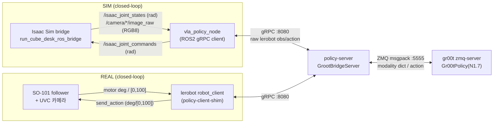

# SO-101 추론 파이프라인 데이터 변환 — Sim ↔ Real Parity 감사

> **목적**: 카메라·로봇 데이터가 정책(SmolVLA / **GR00T-N1.7**)에 입력되어 SO-101 제어 신호로 나오기까지
> 거치는 **모든 변환(단위·오프셋·스케일·정규화·좌표·순서·전처리)** 을 sim·real 양쪽에서 추적하고,
> **같은 모델이 sim 과 real 에서 로봇을 다르게 움직이게 만들 수 있는 인자**를 전부 정리한다.
>
> **작성**: 2026-06-15. 대상 코드 = GR00T-N1.7 bridge 경로 기준(SmolVLA 차이는 별도 표기).
> 관련 문서: [`PATH_GROOT_N17.md`](PATH_GROOT_N17.md) · [`PICKCUBE_CUROBO_PROJECT.md`](PICKCUBE_CUROBO_PROJECT.md) §13 ·
> [`REALDEVICE_GRASP_PIPELINE.md`](REALDEVICE_GRASP_PIPELINE.md).

---

## 0. 두 추론 경로



| | SIM | REAL |
|---|---|---|
| 클라이언트 | `vla_policy_node`(ROS2) | `robot_client`(lerobot async, `policy-client-shim.py`) |
| obs 소스 | Isaac bridge (joint rad + 렌더 RGB) | feetech 모터 + UVC 카메라 |
| 단위 변환 위치 | `vla_policy_node`(`to/from_lerobot_units`) | `SO101Follower` 캘리브레이션(내장) |
| action 적용 | ArticulationController PD | feetech 모터 step write |
| **gRPC 서버·모델은 동일** | GrootBridgeServer → ZMQ → Gr00tPolicy (체크포인트·정규화 stats 동일) | 〃 |

**parity 의 핵심**: gRPC 서버·GR00T 모델·정규화 통계는 sim/real 공유. 분기는 **클라이언트 양 끝(obs 생성·action 적용)** 에서만 일어난다.

---

## 1. 단위 변환 (sim·real 공통 계약)

`scripts/sim/lerobot_units.py` · `ros2_ws/.../so101_vla_policy/units.py` (동일 수식).

| 방향 | arm 5축 | gripper | 상수 |
|---|---|---|---|
| `to_lerobot_units` (rad→LeRobot) | `× 180/π` → deg | `× 31.75` → [0,100] | `_RAD_TO_DEG=57.29578`, `GRIPPER_LEROBOT_SCALE=31.75` |
| `from_lerobot_units` (LeRobot→rad) | `× π/180` → rad | `÷ 31.75` → rad | `_DEG_TO_RAD=0.0174533` |

- **joint 순서**(불변): `shoulder_pan, shoulder_lift, elbow_flex, wrist_flex, wrist_roll, gripper` (`SO101_JOINT_ORDER`). 노드는 JointState `name` 으로 재정렬해 이 순서 보장.
- **데이터셋 계약**(North Star): LeRobot v3.0 · `so_follower` · state/action 6-dim(arm deg + gripper [0,100]) · `observation.images.{top,wrist,front}` 480×640×3 RGB.

---

## 2. SIM 경로 변환 체인

### 2.1 Observation (Isaac → 서버)

| # | 단계 | 입력 | 연산 | 출력 | 파일:line |
|---|---|---|---|---|---|
| 1 | bridge publish | joint (rad), articulation 순서 | — | `/isaac_joint_states` (rad), 30 Hz | `run_cube_desk_ros_bridge.py:164,501,428` |
| 2 | bridge 카메라 | TopCamera/WristCamera/FrontCamera (focal **18mm**) | ROS2CameraHelper `type=rgb` | `/camera/{top,wrist,front}/image_raw` **RGB8** 480×640, 30 Hz | `:174-182,406` |
| 3 | 노드 수신·재정렬 | JointState(rad) | name→`SO101_JOINT_ORDER` | `_joint_rad` | `vla_policy_node.py:255-261` |
| 4 | 단위 변환 | rad | `to_lerobot_units` | arm deg + gripper [0,100] | `:278` |
| 5 | obs 구성 | + 이미지(bare key `top/wrist/front`) + task | dict | raw_obs → gRPC | `:279-283,128` |

### 2.2 Action (서버 → Isaac)

| # | 단계 | 입력 | 연산 | 출력 | 파일:line |
|---|---|---|---|---|---|
| 1 | 수신·역변환 | action chunk (deg, [0,100]) | `from_lerobot_units` | rad | `:304,306` |
| 2 | **그리퍼 오프셋** | `raw_rad[gripper]` | **`+= GRIPPER_CMD_OFFSET (0, Option A 절대 데이터)`** | rad | `:307-308` |
| 3 | clamp | rad | `clamp_joint_rad` (arm ±π, gripper [-0.175,1.745]) | rad | `:309` |
| 4 | publish | rad | JointState | `/isaac_joint_commands`, 30 Hz | `:310-315` |
| 5 | chunk blending | timestep queue | weighted_average, refill `ceil(apc×0.5)` | — | `:240,289-300` |
| 6 | 물리 적용 | rad target | PD: **Kp 17.8 / Kd 0.6**, arm effort 10 / **gripper 0.5 Nm**, vel arm 5 / grip 2.5 | 관절 운동 | `run_cube_desk_ros_bridge.py:190-202,491-518` |

> SIM 물리 parity 는 cuRobo 데이터 생성 env 와 동일하게 맞춰져 있음(soft PD·gentle gripper·TGS). 학습 데이터와 동일 물리.

---

## 3. Bridge + GR00T 내부 변환

### 3.1 Bridge (`policy_server_groot_bridge.py`) — **정규화/스케일 없음**

| 방향 | 변환 | 비고 | 파일:line |
|---|---|---|---|
| obs→GR00T | state→`single_arm`(1,1,5)+`gripper`(1,1,1) f32, video bare key→`video.{front,wrist,top}`(1,1,H,W,3) u8, task→`language` | **raw 통과**(정규화는 GR00T 내부) | `:241-263` |
| GR00T→chunk | `single_arm`(1,16,5)+`gripper`(1,16,1) → squeeze+concat (16,6) | **스케일/오프셋 없음** | `:266-276` |

### 3.2 Gr00tPolicy 내부 (`ref_repos/Isaac-GR00T`)

| 단계 | 처리 | 파일:line |
|---|---|---|
| state 정규화 | **min-max** → [-1,1], `clip_outliers=True` | `state_action_processor.py:240-248,396` |
| 추론 | 정규화 state + 토큰화 이미지 → 정규화 action | `gr00t_policy.py:408` |
| action 역정규화 | min-max 역변환 | `state_action_processor.py:431-453` |
| **relative→absolute** | `single_arm`=**RELATIVE** → `절대 = reference_state(=관측 state[-1]) + delta`; `gripper`=**ABSOLUTE**(그대로) | `so101_config.py:48-62`, `state_action_processor.py:455-507` |

- **정규화 stats 는 체크포인트에 baked**(`experiment_cfg/dataset_statistics.json` + `processor/statistics.json`) → sim/real 동일 적용.
- **min-max 모드**(`mean_std_embedding_keys` 미지정, `use_percentiles=False`). 실제 baked 범위(`..._baseline` 체크포인트):
  - state `single_arm` min `[-48.8,-96.1,-69.9,-52.9,-141.7]` / max `[63.4,60.3,90.0,95.0,137.2]` (deg)
  - state `gripper` min `[-1.59]` / max `[29.19]`
  - action `single_arm`/`gripper` 별도(relative_action 은 timestep별 stats)

> ⚠ **개념 정정**: 기존 문서·메모의 "GR00T action = 절대" 는 **`get_action` 의 반환값**(unapply 후) 기준으로는 맞다.
> 그러나 모델이 내부적으로 예측하는 것은 `single_arm` **상대 delta** 이고, `reference_state` 로 **관측 state** 를 더해 절대화한다.
> → **관측 state 정확도가 그대로 action 정확도가 된다**(아래 §5 #2).

---

## 4. REAL 경로 변환 체인

| # | 단계 | 입력 | 연산 | 출력 | 파일 |
|---|---|---|---|---|---|
| 1 | 모터 읽기 | feetech step | `SO101Follower` 캘리브 | deg + gripper [0,100] | lerobot `so_follower.py` |
| 2 | 카메라 | UVC | (RENAME_MAP) | GR00T=bare `top/wrist/front`, SmolVLA=`camera1/2/3` | `env/groot_n17.env:54`(빈값) / `env/smolvla.env:42` |
| 3 | obs 전송 | deg+[0,100]+img+task | gRPC | 서버(동일 GrootBridgeServer) | `policy-client-shim.py`, `lerobot-entrypoint.sh:689-723` |
| 4 | action 적용 | chunk (deg, [0,100]) | `SO101Follower.send_action` → 캘리브 → motor step | feetech write | lerobot `so_follower.py` |

- **robot_client 는 `GRIPPER_CMD_OFFSET` 을 읽지 않는다**(코드상 `os.getenv("GRIPPER_CMD_OFFSET")` 는 `vla_policy_node` 에만 존재). → real 경로 오프셋 = **0**.
- action chunk 소비·blending 은 lerobot async client 의 ActionQueue(서버측 RTC 는 비권장, §13).

---

## 5. 🎯 Sim ↔ Real 제어 분기 인자 (핵심)

| # | 인자 | SIM | REAL | 결과 | 심각도 |
|---|---|---|---|---|---|
| **1** | **GRIPPER_CMD_OFFSET** | `0` (절대 데이터) | `0` | **§5.1 — Option A(절대 기록)로 해소·발산 0** | 🟢 |
| **2** | `single_arm` **RELATIVE** action | 관측 state 정확 → delta 정확 | 센서 오차·지연 → delta 기준점 흔들림 → **누적 drift** | 같은 모델이 real 에서 더 부정확 | 🟠 |
| **3** | **min-max 정규화 범위**(sim stats) | 학습 분포 안 | real joint/gripper 가 sim min/max 벗어나면 `clip` → 입력 왜곡 | 정규화 mismatch | 🟠 |
| **4** | **카메라 intrinsic/FOV** | focal **18mm** + DR 16–20mm, 렌더 정합 | 실측 미상(렌즈·왜곡·색감 다름) | 시각 도메인 갭 (BC 시각 입력 분포 shift) | 🟠 |
| **5** | **제어 지연** | ~33 ms(30 Hz, 단 렌더 병목) | ~100–200 ms(USB/ROS/직렬) | chunk 소비 타이밍·페루프 위상 차 | 🟡 |
| **6** | **동역학** | PhysX soft PD(Kp17.8·effort0.5) | 실제 모터 토크·마찰·관성 | 같은 target → 다른 궤적 | 🟡 |
| **7** | **카메라 키(RENAME_MAP)** | GR00T=bare(정합), SmolVLA=camera1/2/3 | 동일 규칙 | GR00T 는 sim=real 동일, 분기 아님 | 🟢(GR00T) |
| **8** | 단위(rad↔deg)·joint 순서·해상도·RGB | 변환 자동 일치 | 동일 | 분기 아님(검증됨) | 🟢 |
| **9** | **gripper scale** (`×31.75` vs `RANGE_0_100`) | `rad×31.75`→`÷31.75` 왕복 정확 | `[0,100]`=캘리브 full-travel % 로 해석 | **§5.2 — sim 37° → real ~20°, 약 절반만 열림(확정 2026-06-19)** | 🔴 |

### 5.1 ✅ GRIPPER_CMD_OFFSET — Option A(절대 기록 규약)로 해소 (2026-06-18)

오프셋의 출처는 **하드웨어가 아니라 sim 데이터 규약**이었다(옛 규약):

```
Isaac PickCube env: gripper action term use_default_offset=True, init=0.20 rad
  → 실제 관절 target = action×1.0 + 0.20
[옛] recorder 기록 action = grip_target − 0.20   (pre-offset)  ← sim 전용 프레임
  → 모델이 (grip_target − 0.20) 학습 → sim 노드만 +0.20 복원, real 미복원
  → real 그리퍼가 0.20 rad(=[0,100]에서 6.35·≈11.5°) 덜 열림 = sim↔real 발산
```

**Option A 적용**: recorder 가 그리퍼를 **절대 joint target**(post-offset, real 하드웨어 native)으로
기록하도록 변경. 데이터가 offset-free → sim·real 추론 양쪽이 동일 단위 소비 → **발산 0(구조적 제거)**.

```
[신] recorder 기록 action = grip_target   (절대, post-offset)
  · curobo demo/batch: ACTION_OFFSET_NP gripper 0.20→0 (processed_actions 그대로)
  · rollout_to_lerobot: raw 정책출력 + 0.20 (절대 환원)
  · 제어 입력 경로(act() 의 grip − 0.20)는 env term 정합 위해 불변
sim 추론(vla_policy_node): GRIPPER_CMD_OFFSET = 0  (env/*.env)
real 추론(robot_client):   0  (변경 없음)
```

| 배포 | 처리 | 결과 |
|---|---|---|
| **SIM** (bridge 직결) | `+0` (절대 데이터라 재적용 불요) | 정상 |
| **REAL** (sim 학습 모델 배포) | `+0` (데이터가 이미 real native) | **정상 — 발산 0** |

> ⚠ **절대 규약으로 재생성·재학습한 모델 전용.** 옛 pre-offset 데이터로 학습한 구 모델을 sim 추론하면
> 여전히 `GRIPPER_CMD_OFFSET=0.2` 필요(구 모델은 큐브 크기/SDF 변경으로 폐기·재학습 예정).
> 남은 그리퍼 sim2real 항목 = **scale/0점 캘리브**(`GRIPPER_LEROBOT_SCALE=31.75` vs real [0,100]→물리 개도, §5.2).

### 5.2 🔴 gripper scale mismatch — 확정·정량 (2026-06-19, SmolVLA `4cube_1024`)

§5.1 의 offset(Option A) 와 **별개**인 척도 불일치. **이게 "real 그리퍼가 Isaac 보다 덜 열린다" 의 근본원인**이다.

```
sim 데이터: gripper = rad × 31.75 (GRIPPER_LEROBOT_SCALE, scripts/sim/lerobot_units.py)
  · sim 안에서는 from_lerobot_units(÷31.75)로 왕복 → 완벽 정확(sim eval 무증상)
real SOFollower: gripper 는 use_degrees 무관 항상 MotorNormMode.RANGE_0_100
  (so_follower.py:60) → [0,100] = 캘리브 full-travel(0=완전닫힘,100=완전열림) 백분율
  · 두 척도가 캘리브된 적 없음 → 같은 모델 출력값의 물리 의미가 sim≠real
arm 5축: 둘 다 degree (real use_degrees 설치본 기본값 True, config_so_follower.py:43) → 정합
```

**서버 없이(Isaac 불요) 확정**: 모델 HF 캐시의 baked norm stats 직접 추출
(`policy_preprocessor_step_5_normalizer_processor.safetensors`, norm_map STATE/ACTION=MEAN_STD,
min/max/q01/q99 포함). `4cube_1024` 모델 결과:

| | action q01 (close) | action q99 (open) | 비고 |
|---|---|---|---|
| gripper ([0,100]계) | **-7.94** | **20.64** (=0.65 rad) | 모델 'open' 명령 = 20.6 |
| → 물리 개도 | ~0° (닫힘) | **0.65 rad = 37°** | 모델 grasp-open ≈ 37° |
| → real 무보정 적용 | ~0 | 20.6 을 real [0,100] 로 직접 → **~20°** | sim 37° → real ~20°, **약 절반만 열림** |
| arm `wrist_roll` | — | **max 156°** (>100) | DEGREE 확정(RANGE_M100_100 불가) |

**real teleop 데이터로 교차검증(확정)**: `datasets/pick_cube_v2`(실기기 teleop 100ep, so_follower).
real gripper [0,100] 네이티브 분포 = action q99 **50.9** / max **73.3** / min ~0.4(닫힘). **teleop 은 grasp 에
~45-60° 만 사용**(완전 기계개방 안 함 — max 73 도 full 아님) → **grasp-open ≈ q99 51** 이 기준. sim grasp-open
0.85 rad=**48.7°** 과 같은 물리 동작이므로 **sim 27 ↔ real 51** 페어링. 무보정 시 모델 20.6 → real ~20° vs sim 37°
= 절반(증상). arm 은 real·sim 분포 거의 겹침(shoulder_lift real[-103,60] vs sim[-94,57] 등) → **단위+영점+부호 모두 정합**(무보정).

**진단 도구**: `scripts/sim/inspect_dataset_distribution.py` — LeRobot v3 데이터셋
(`--root`/`--repo_id`)의 6축 분포 + degree 판정 + affine 권장 env 출력(pyarrow 직접, Isaac 무의존).

**해결**:

| | 방법 | 상태 |
|---|---|---|
| **Option A (정석)** | real 그리퍼 [0,100] 개도 실측(또는 pick_cube_v2 류 real 데이터로) → sim 데이터 재기록·재학습 또는 real 데이터 학습 → 양쪽 동일 단위(구조적 제거) | real bring-up 시 |
| **Option B (빠른 우회)** | **추론 경계 양방향 affine**(`docker/policy-client-shim.py`, `GRIPPER_AFFINE=1`). closed-loop(이전 action→다음 state)라 출력·입력 둘 다 변환: `send_action`=sim→real `A·g+B`(clamp), `get_observation`=real→sim `(g−B)/A`. gripper.pos 만, arm 불변. 입력 미변환 시 real gripper(0~73)가 모델 state 분포(~0~31) 밖→OOD | **구현됨** |

```bash
# Option B 추론 (실기기, sim-모델). 기본 앵커=물리(sim[-1.59,27]↔real[1,51]) → GRIPPER_AFFINE=1 만으로 동작
GRIPPER_AFFINE=1 \
  uv run python ./docker/policy-client-shim.py ...
# real 닫힘/grasp-열림 실측하면 정밀화:  GRIPPER_REAL_OPEN=<측정> GRIPPER_REAL_CLOSE=<측정>
```

- **앵커는 '실제 쓰는' 물리 자세 기준**(데이터 percentile·기계 full-travel 아님). sim=데이터 규약
  (grip_close −0.05 rad→−1.59, grip_open 0.85 rad=48.7°→27), real=teleop 실측(닫힘 1·**grasp-열림 51**, ~48°).
  `A=1.749 B=3.78`. → 모델 20.64(37°) → real 39.9(≈38°) = **sim 의도와 일치**(과개방 아님).
- ⚠ **affine 은 단위만 고침**: `4cube_1024` 모델은 action gripper 를 자체적으로 max 20.64(=37°)까지만 명령
  (sim grasp-intent 48.7°보다 under-command). affine 후엔 real 도 sim 과 **같은 37°** 만 열림 — sim 에서 그 개도로
  집혔으면 real 도 동일. 더 벌리려면 `GRIPPER_REAL_OPEN` 상향 또는 Option A(real 데이터 재학습).
- ⚠ **sim-모델→real 일 때만 켠다.** real 학습 모델은 [0,100] 네이티브 출력이라 affine 켜면 이중보정→오작동.
  GRIPPER_AFFINE 미설정(기본) = real 모델·sim 추론 무영향.

### 5.3 🟠 arm per-joint frame 정합 (영점·부호) — Option B 확장 (2026-06-19)

정규화 감사(2026-06-19): SmolVLA preprocessor/postprocessor 의 normalize↔unnormalize 는 **동일 stats blob 공유
→ 수학적으로 상쇄**, 모델 I/O 는 **sim(데이터셋) 프레임 그대로**(추가 스케일 없음). 즉 SmolVLA 는 프레임 내부
매퍼이고, **sim·real 각자 좌표계 ↔ 모델 프레임 변환을 경계에서** 해야 정합(= 사용자 설계 원칙). gripper(§5.2)
외에 **arm 도 프레임 차이**가 남는다:

- arm = `MotorNormMode.DEGREES` → **절대 기계각, 스케일 1:1**(real range_min/max 무관, homing_offset 만 영점 결정).
- **real 0°** = calibration home(`set_half_turn_homings`, 수동 "가동범위 중앙"). **sim 0°** = URDF zero(`init_state {j:0.0}`).
- 두 영점이 다른 물리 포즈 → **per-joint 상수 offset** (+ URDF 축 vs 모터 방향 불일치 시 **부호** ±1). scale 차이는 없음.
- gain 도 값 차이에 기여(별개): real `P_Coefficient=16`(떨림 억제로 낮춤)+중력 → **steady-state droop**(명령은 맞아도
  뻗은 자세서 처짐). 이건 동특성이라 affine 으로 못 고침 — 필요 시 P 상향(떨림 trade-off).

**해결(shim 확장)**: `docker/policy-client-shim.py` 의 affine 을 **6축 per-joint** 로 확장.
`model_deg = SIGN_j·real_deg + OFFSET_j`(arm, SIGN=±1), gripper=§5.2 anchor. 양방향(get_observation/send_action).
env `AFFINE_<JOINT>_SIGN`/`AFFINE_<JOINT>_OFFSET`, **기본 identity(1,0)** → 측정 전엔 arm 무변경(안전).

**측정 절차** (`scripts/test/measure_joint_affine.py` + `read_position.py`, real 은 추론과 동일 프레임 DEGREES):

| 방법 | 절차 | 정밀도 |
|---|---|---|
| **paired-pose (권장, sim 필요)** | 같은 물리 포즈를 sim·real 양쪽 단위로 읽어 ≥2개(권장 3: zero / READY[0,−74.5,68.8,−20,−90] / distinct, **gripper 도 닫힘/열림/중간**). SIM=`scripts/sim/read_sim_pose.py`(포즈 구동+achieved deg 출력, recorder 와 동일 `to_lerobot_units`), REAL=손 매칭 후 `read_position.py`. `measure_joint_affine.py` 가 joint 별 `SIGN`(slope 부호)·`OFFSET`·gripper `A/B` 자동 피팅→env 출력 | 높음(부호 자동) |
| **hard-stop (빠른 추정, sim 불요)** | joint 별 양쪽 기계 stop 까지 손으로 → real 읽고 sim=URDF 한계(pan±110·lift±100·elbow±97·wrist_flex±95) 입력. wrist_roll 은 연속회전(stop 없음)→포즈법 | 중(부호는 +1 가정·검증 필요) |

피팅 후 출력된 `AFFINE_*` env 를 GRIPPER_AFFINE=1 과 함께 export. 검증 = sim 데이터 1ep `lerobot-replay`
또는 단일 joint nudge 로 방향 확인(반대면 SIGN 뒤집기).

---

## 6. 발견된 이상·확인 필요 항목

| 항목 | 내용 | 조치 |
|---|---|---|
| 🟢 gripper offset | **해소(Option A, 2026-06-18)**: recorder 절대 기록 → sim·real 둘 다 offset 0, 발산 0(§5.1) | 절대 규약 재생성·재학습 후 적용. 구 모델은 0.2 유지 |
| 🔴 gripper scale (§5.2) | **확정(2026-06-19)**: sim `×31.75` vs real `RANGE_0_100` → 모델 grasp-open 37° 인데 무보정 real 은 ~20°, **약 절반만 열림** | Option A(재학습) 또는 Option B(`GRIPPER_AFFINE` shim, 양방향). 진단=`inspect_dataset_distribution.py`. real 닫힘/grasp-열림 실측 |
| 🟠 RELATIVE single_arm | 기존 문서 "절대 action" 표기와 내부 RELATIVE 표현의 괴리(반환은 절대 맞음) | 본 문서로 정정. real 에서 state 추정 정확도·지연 관리 필요 |
| 🟠 min-max 범위 sim 전용 | real proprioception 이 sim min/max 벗어나면 clip 왜곡 | real 데이터로 stats 재산출 또는 범위 확인 |
| 🟠 카메라 intrinsic 미측정 | sim focal 18mm/DR 16–20 vs real 미상 | real 카메라 intrinsic 측정 후 정합(또는 시각 DR↑·real fine-tune) |
| 🟡 해상도 H×W | sim (480,640,3) HWC, real `CAM_WIDTH=640/HEIGHT=480` → (480,640,3) | 일치(전치 없음) 확인됨, 배포 시 재검증 |
| 🟢 RGB/BGR | sim `type=rgb`, real `desired_encoding="rgb8"` | 둘 다 RGB, 일치 |

---

## 7. Sim → Real 배포 체크리스트

```
□ GRIPPER_CMD_OFFSET=0 (Option A 절대 기록 데이터 전용). 구 pre-offset 모델이면 sim 0.2 유지(§5.1)
□ gripper scale(§5.2) — **sim-모델→real** 추론만 GRIPPER_AFFINE=1(양방향, 기본 물리 앵커). real 학습 모델은 끔(이중보정 금지). 미적용 시 그리퍼 약 절반만 열림(37°→~20°)
□ RENAME_MAP — GR00T=빈값(bare top/wrist/front), SmolVLA=camera1/2/3
□ ACTIONS_PER_CHUNK — GR00T 16 / SmolVLA 24, 서버·클라 일치
□ 카메라 해상도 640×480, 순서 top/wrist/front = 학습 순서
□ robot.type=so101_follower, 캘리브 파일(robot_id) 존재
□ POLICY_FPS=30, non-RTC(서버측 RTC 비권장)
□ task = "pick up the cube and place it in the bowl"
□ real 카메라 intrinsic ≈ sim(focal 18mm) 또는 시각 DR/실기기 데이터로 보강
□ state 추정 정확도·지연 점검(single_arm RELATIVE 라 critical)
```

---

## 8. 결론

- **arm 단위(deg)·joint 순서·해상도·RGB·정규화 stats** 는 sim/real **자동 일치**(변환 함수·baked stats 공유, arm degree 확정). 여기서 분기 없음.
- **분기는 클라이언트 양 끝 + 도메인 갭**에서 발생: ① 🟢 그리퍼 오프셋 — **Option A(절대 기록)로 해소(2026-06-18)**, ② 🔴 **그리퍼 scale(`×31.75` vs `RANGE_0_100`) — 확정(§5.2), real 그리퍼 약 절반만 열림(37°→~20°)**, ③ 🟠 RELATIVE action 의 state 의존성, ④ 🟠 sim-stats min-max clip, ⑤ 🟠 카메라 intrinsic 갭, ⑥ 🟡 지연·동역학.
- **현재(sim eval) 관점**: sim 은 척도 왕복·offset 0·물리 parity 라 무증상. **real 전이의 1순위 블로커 = 🔴 그리퍼 scale(§5.2)** — Option B(`GRIPPER_AFFINE` shim)로 즉시 우회, Option A(재학습)로 정식 해결. 그 다음 #4 카메라 intrinsic. arm 은 단위 OK 지만 영점·부호 정합 1회 확인 권장.
