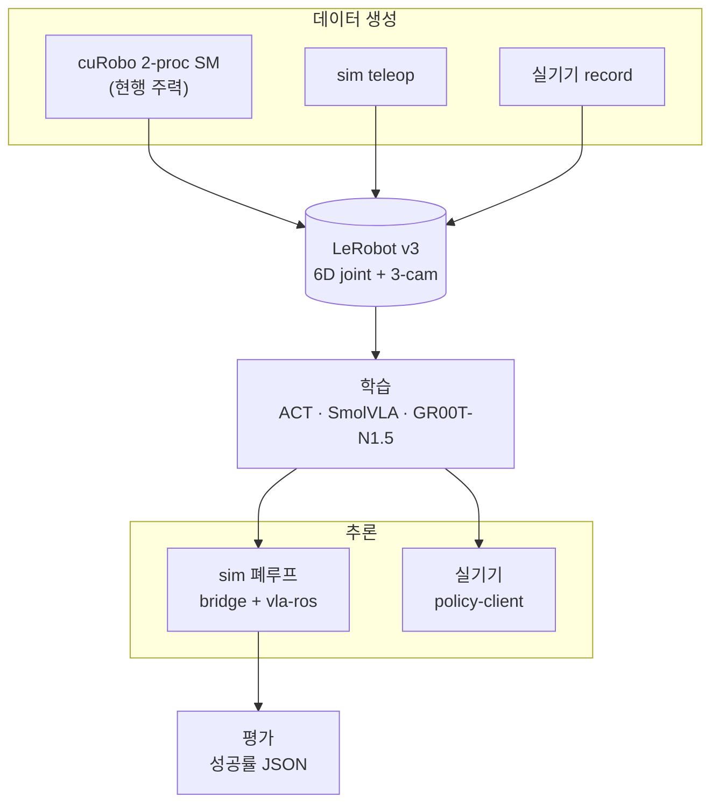

# SO-ARM101 Sim2Real — 시스템 명세서

> **as-built 정본.** 커밋된 소스 코드에서 역추출한 명세다. 계획·설계 문서가 아니라
> "지금 코드가 무엇을 하고 무엇을 보장하는가" 를 기술한다.

---

## 1. 이 명세서의 성격

| 항목 | 내용 |
|---|---|
| 성격 | **as-built** — 값의 단일 소스는 언제나 코드다. 이 문서는 코드의 사본이다 |
| 앵커 표기 | **`경로::심볼`** — 라인 번호는 쓰지 않는다(커밋마다 밀린다) |
| 언어 | 한국어 본문 + 영어 식별자 |
| 대상 독자 | 신규 개발자 · 에이전트 · 코드를 읽기 전에 계약을 확인하려는 사람 |

**as-built 가 아닌 것은 싣지 않는다.** 예를 들어 EEF-relative action 파이프라인은 설계만
있고 커밋된 구현이 없으므로 `spec/04 §10` 에 "미구현" 으로만 적는다.

---

## 2. 시스템 한 장 요약

SO-ARM101 6축 팔의 Sim-to-Real 파이프라인. Isaac Sim 에서 VLA 학습 데이터를 만들고,
정책을 학습·평가한 뒤 실기기 SO-101 에 배포한다.



핵심 계약 3가지:

| 계약 | 값 |
|---|---|
| 관절 순서 | `shoulder_pan, shoulder_lift, elbow_flex, wrist_flex, wrist_roll, gripper` |
| 단위 | arm degree · gripper `[0, 100]` (policy-feature) ↔ radian (sim) |
| 제어 주파수 | 30 Hz (`sim.dt 1/120` × `decimation 4`) |

---

## 3. 문서 지도

| 문서 | 답하는 질문 | 주 출처 |
|---|---|---|
| [`spec/01_OVERVIEW.md`](spec/01_OVERVIEW.md) | 이 시스템은 무엇이고 어떤 프레임·용어를 쓰는가 | `README.md` · `AGENTS.md` |
| [`spec/02_REQUIREMENTS.md`](spec/02_REQUIREMENTS.md) | 코드가 강제하는 요구사항·제약·수용 기준은 무엇인가 | 03~09 |
| [`spec/03_ENV_SPEC.md`](spec/03_ENV_SPEC.md) | 시뮬 환경의 관측·액션·씬·DR 은 어떤 값인가 | `src/sim_to_real/tasks/` · `assets/robots/` |
| [`spec/04_IO_CONTRACT.md`](spec/04_IO_CONTRACT.md) | 단위·프레임을 어떻게 변환하는가 | `src/so101_contract/` |
| [`spec/05_DATA_SPEC.md`](spec/05_DATA_SPEC.md) | 데이터셋 스키마와 변환기는 어떤 계약인가 | `src/sim_to_real/data/` · `scripts/convert/` |
| [`spec/06_RUNTIME_SPEC.md`](spec/06_RUNTIME_SPEC.md) | 어떤 서비스·모드·환경 변수로 실행되는가 | `docker/` · `.env.example` · `env/` |
| [`spec/07_INTERFACES.md`](spec/07_INTERFACES.md) | 프로세스 간 무엇을 주고받는가 | ROS 노드 · ZMQ · gRPC |
| [`spec/08_PIPELINES.md`](spec/08_PIPELINES.md) | 실제로 어떻게 데이터를 만들고 학습·평가하는가 | `scripts/` |
| [`spec/09_TACIT_KNOWLEDGE.md`](spec/09_TACIT_KNOWLEDGE.md) | **왜 이 값이고 바꾸면 무엇이 깨지는가** | 코드 주석 · 측정 기록 |

---

## 4. 정본 규칙 — 무엇이 어디의 단일 소스인가

| 대상 | 단일 소스 |
|---|---|
| 관절 순서·단위·codec | `src/so101_contract/feature_codec.py` |
| USD joint limit · leader 정규화 테이블 | `src/so101_contract/leader_calibration.py` |
| follower 실측 affine | `src/so101_contract/follower_calibration.py` |
| 큐브 크기·질량 | `src/sim_to_real/utils/cube_specs.py` |
| 큐브 스폰 영역 기하 | `src/sim_to_real/tasks/pick_cube/spawn_area.py` |
| 로봇 actuator 튜닝 | `src/sim_to_real/assets/robots/lerobot.py` |
| 데이터셋 스키마 | `src/sim_to_real/data/lerobot_recorder.py` |
| cuRobo robot config (54 sphere · `tcp_grasp`) | `assets/robots/so101.yml` |
| 씬 물리 상수 | `scripts/environments/author_pick_cube_scene.py` |

이 명세서의 수치는 위 파일들의 **사본**이다. 갈라지면 코드가 옳다.

### 드리프트 감지

```bash
python3 scripts/contract/validate_spec_constants.py             # 대조
python3 scripts/contract/validate_spec_constants.py --self-test # 검증기 자체 점검
```

두 가지를 본다.

| 검사 | 내용 |
|---|---|
| **상수 값** | `03_ENV_SPEC.md §12` 상수 대장의 각 행을 **AST 로 읽은** 코드 값과 대조 |
| **앵커 경로** | 명세 전체의 `경로::심볼` 이 실재 파일을 가리키는지(rename·삭제·모호 검출) |

코드를 import 하지 않고 AST 로만 파싱하므로 **의존성 0** — Isaac Sim·GPU·numpy 없이,
`isaaclab` 을 import 하는 모듈도 검사할 수 있다. 설계·한계 = 그 스크립트의 docstring.

---

## 5. 읽는 순서

| 역할 | 진입점 |
|---|---|
| 신규 개발자 | `01_OVERVIEW` → `04_IO_CONTRACT` → `03_ENV_SPEC` → `08_PIPELINES` |
| 데이터 담당 | `05_DATA_SPEC` → `08_PIPELINES §5~§7` → `04_IO_CONTRACT` |
| 운영·배포 | `06_RUNTIME_SPEC` → `07_INTERFACES` → `08_PIPELINES §8~§9` |
| 디버깅 중 | **`09_TACIT_KNOWLEDGE`** → `docs/TROUBLESHOOTING.md` |
| 리뷰·감사 | `02_REQUIREMENTS` → `09_TACIT_KNOWLEDGE §9` 불일치 대장 |

---

## 6. 관련 문서

| 문서 | 성격 | 관계 |
|---|---|---|
| [`AGENTS.md`](../AGENTS.md) | 에이전트 작업 규칙 | **규칙**은 거기, **사실**은 여기 |
| [`README.md`](../README.md) | 설치·경로별 quickstart | 실행 방법은 거기, 계약은 여기 |
| [`TROUBLESHOOTING.md`](TROUBLESHOOTING.md) | 에러 사례집 92항목 | 증상→해결. 별 도메인 |
| [`PINK_IK_PICKPLACE.md`](PINK_IK_PICKPLACE.md) | pink IK SM 설계·회고 | ⚠ §5·§8 스테일 — `spec/08 §6`, `spec/09 §9 INC-05/06` |
| [`SIM_REAL_REPLAY_CALIBRATION.md`](SIM_REAL_REPLAY_CALIBRATION.md) | follower calibration 진단 서사 | 계약은 `spec/04 §4` |
| [`cuRobo_v2_0.8.0_INDEX.md`](cuRobo_v2_0.8.0_INDEX.md) | 외부 라이브러리 API 색인(영어) | 별 계열 |
| [`scripts/cuRobo/README.md`](../scripts/cuRobo/README.md) | cuRobo SM 사용법 | 계약은 `spec/07 §6`, `spec/08 §5` |

---

## 7. 알려진 결함

> ⚠ **INC-10 — 성공 종료가 발화하지 않는 구조.** `task_done`·`cube_lost`·
> `object_in_container` 가 레거시 상수 `_geometry.DESK_TOP_Z = 0.76` 을 쓰는데 실제 책상
> 상판은 `0.705` 다. 그릇 안 큐브 중심(0.743)이 성공 창 하한(0.765)에 못 미친다.
> **평가 수치를 해석하기 전에 반드시 확인할 것.**
> 상세·수정 후보 = [`spec/09_TACIT_KNOWLEDGE.md §9`](spec/09_TACIT_KNOWLEDGE.md).

전체 불일치 16건(문서↔코드 · 코드↔코드 · 끊어진 참조) = `spec/09_TACIT_KNOWLEDGE.md §9`.
