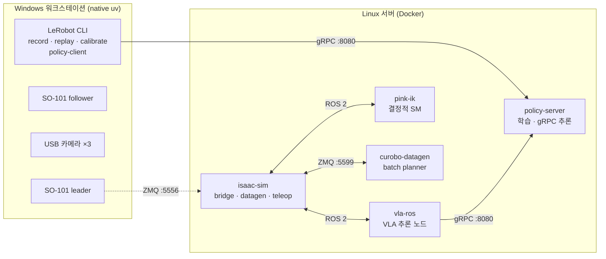
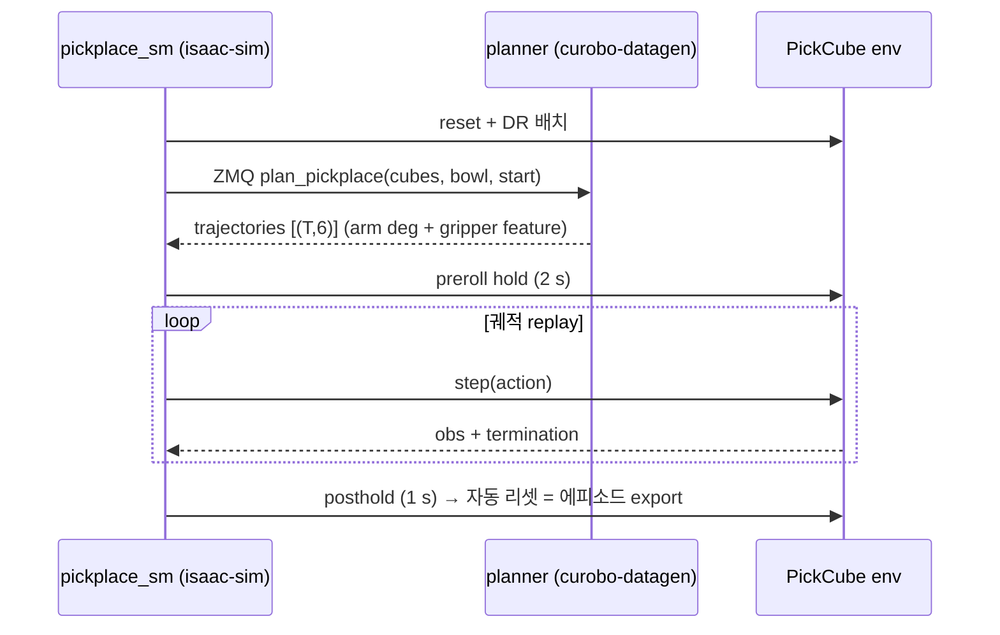
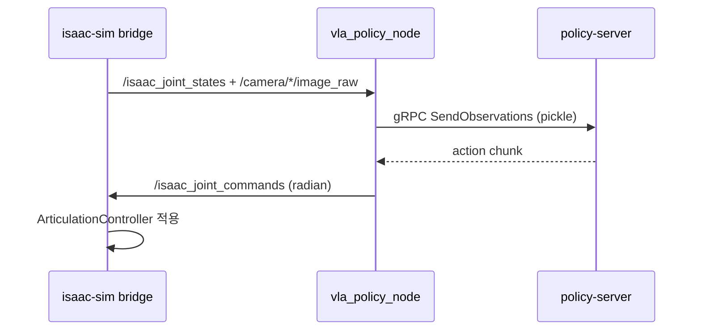
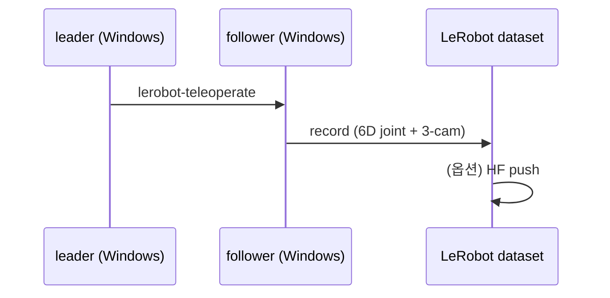

# 01. 개요 — 목적 · 범위 · 프레임 · 용어

---

## 1. 목적과 범위

SO-ARM101 6축 로봇 팔의 **Sim-to-Real 파이프라인**이다. Isaac Sim 시뮬레이션에서 VLA 정책
학습용 데이터를 생성하고, 정책을 학습·평가한 뒤 실기기 SO-101 에 배포한다.

시스템이 산출하는 것:

| 산출물 | 형식 | 명세 |
|---|---|---|
| 학습 데이터셋 | LeRobot Dataset v3 (6D joint + 3-cam video) | `05_DATA_SPEC.md` |
| 학습된 정책 | ACT · SmolVLA · GR00T-N1.5 체크포인트 | `08_PIPELINES.md §8` |
| 폐루프 평가 수치 | 성공률 JSON | `08_PIPELINES.md §9.2` |

### 범위에 포함

`src/`(2 패키지) · `scripts/`(9 범주) · `docker/`(5 서비스) · `ros2_ws/`(VLA 노드) ·
`assets/`(USD·URDF·cuRobo config) · `env/`·`.env.example`.

### 범위 밖

| 대상 | 이유 |
|---|---|
| `scripts/ece_4560/` | 격리된 과정 프로젝트. 파이프라인 코드를 import 하지 않는다(단, `follower_calibration` 측정에 `read_position.py` 를 사용한 이력만 있음) |
| `ref_repos/` | `.gitignore` 대상. 외부 참조 저장소 |
| EEF-relative action 파이프라인 | **미구현**. absolute EEF 파생까지만 커밋돼 있다 (`04_IO_CONTRACT.md §10`) |
| 에러 사례집 | `docs/TROUBLESHOOTING.md`(92개 항목)가 별 도메인으로 관리 |

> 이 명세서는 **as-built** 다 — 커밋된 코드가 실제로 하는 일만 기술한다.

---

## 2. 2-머신 토폴로지



| | Windows 워크스테이션 | Linux 서버 |
|---|---|---|
| 실행 방식 | native uv + `pyproject.toml` (WSL·Docker 없음) | Docker compose |
| 작업 | teleop · record · replay · calibrate · setup-motors · **실기기 policy-client** | sim 폐루프 · VLA 학습 · 추론 서버 · datagen |
| 스택 | LeRobot 0.4.4 (`teleop` + `async` 그룹) | Isaac Sim 5.1 / IsaacLab 2.3.2 / LeRobot 0.5.1 |
| GPU | RTX A4000 16 GB (추론은 서버 위임) | RTX PRO 5000 Blackwell 48 GB |

상세 = `06_RUNTIME_SPEC.md §1, §8, §10`.

---

## 3. 컴포넌트 지도

| 계층 | 경로 | 책임 |
|---|---|---|
| **계약** | `src/so101_contract/` | 단위·프레임 변환의 단일 소스. 순수 Python + NumPy (Isaac·ROS·torch 무의존) |
| **환경** | `src/sim_to_real/` | Gym 환경·씬·DR·데이터 recorder·teleop device·SM scaffold |
| **진입점** | `scripts/` | 실행 가능한 스크립트. 폴더 = 동사/단계 1개 |
| **런타임** | `docker/` | 5 서비스 이미지·compose·entrypoint |
| **ROS 노드** | `ros2_ws/src/so101_vla_policy/` | sim 폐루프 VLA 추론 노드 + vendored mini-lerobot |
| **에셋** | `assets/` | SO-101 USD·URDF, cube_desk 씬 USD, cuRobo robot config, 뷰포트 레이아웃 |

`scripts/` 배치 규약(폴더 = 하는 일 1개):

| 폴더 | 배치 규칙 |
|---|---|
| `assets/` | 기존 로봇 USD 물리 편집 (collision · joint limit) |
| `environments/` | sim 환경 구성·상호작용: 씬 author, env 조회, teleop, 머티리얼 |
| `datagen/` | **새 데이터 생성**: SM·실기기·pink 궤적 record + SM replay |
| `cuRobo/` | cuRobo 2-proc pick-place SM (planner + executor + sweep 시각화) |
| `convert/` | 기존 데이터셋 **포맷·프레임 변환** |
| `data/` | 데이터셋 **사후 ops**(변환 아님): 병합·업로드 |
| `inference/` | **VLA 폐루프**(정책 경유) |
| `contract/` | I/O 계약·스키마 검증 |
| `real/` | Windows 실기기 native uv CLI |
| `ece_4560/` | 보관용 과정 프로젝트(격리) |

> 3중 모호 해소: **새 에피소드 만든다 → `datagen`/`cuRobo` · 포맷/좌표 바꾼다 → `convert` ·
> 병합/업로드 → `data`.**

---

## 4. 제어·데이터 3경로

### 4.1 데이터 생성 (cuRobo SM — 현행 주력)



### 4.2 sim VLA 폐루프



### 4.3 실기기 teleop record



---

## 5. 좌표계와 프레임

**이 프로젝트의 가장 흔한 버그 원인이다.** 다섯 프레임이 있고 셋이 서로 회전돼 있다.

| 프레임 | 정의 | 쓰는 곳 |
|---|---|---|
| **world** | Isaac Sim 전역 원점. 책상 상판 z = `0.705` | 씬 author, 카메라 `top`, bridge |
| **env-local** | env 원점 기준(= `root_pos_w − env_origins`). 로봇 마운트 원점이 `(0, 0)` | DR 스폰 영역, 종료 판정, sweep |
| **USD `base`** | 로봇 articulation 루트 prim | `ee_frame` FrameTransformer, contact 센서 |
| **URDF `base_link`** | URDF 체인 루트 | pink IK, cuRobo, `eef_kinematics` FK |
| **`tcp_grasp`** | 손가락 사이 pinch 지점. `gripper_link` 자식 | grasp 타깃, EEF 데이터셋 |

### 5.1 ★ URDF ↔ USD 는 z 축 90° 어긋나 있다

```
T(urdf ← usd) = Rz(90°) + (0.01576, −0.02079, −0.03248) m
```

이 보정을 빼면 pan 이 약 97° 빗나간다. 적용 지점:

| 소비자 | 방법 |
|---|---|
| cuRobo planner | `curobo_batch_planner.py::BASE_YAW = 90.0`, `::BASE_T` |
| pink IK | `pink_ik_bridge_node.py --base-yaw-deg 90` |

상세 = `09_TACIT_KNOWLEDGE.md §3.2`.

### 5.2 pan 축은 마운트 원점이 아니다

URDF `shoulder_pan` origin 이 `base_link` 기준 `(0.0388, 0, 0.0624)` m 다. env-local 로 옮기면
팔의 실제 회전 중심이 마운트 원점에서 `(-0.021, +0.023)` 만큼 어긋난다. 도달 반경 판정은
**pan 축 기준**이어야 한다. 상세 = `09_TACIT_KNOWLEDGE.md §3.1`.

### 5.3 TCP 는 2.79° 피치를 흡수한다

USD 체인에 URDF `wrist_roll` origin 의 `Ry(0.0487)` 항이 없어 이중 FK 가 2.79° 어긋난다.
`tcp_grasp` quaternion `Ry(π − 0.0486795)` 가 이를 상수 보정한다.
상세 = `09_TACIT_KNOWLEDGE.md §3.3`.

### 5.4 로봇 배치

| 항목 | 값 |
|---|---|
| `_ROBOT_POS` (world) | `(0.0, 0.0, 0.6749)` — z = 책상 상판 `0.705` − base_min_z `0.0301` |
| `_ROBOT_ROT` (wxyz) | `(0.0, 0.0, 0.0, 1.0)` identity |

씬 USD 는 `+y 0.01` 시프트로 배치된다(정적 지오메트리를 로봇 기준 1 cm 뒤로).

---

## 6. 용어집

전 문서가 이 어휘를 쓴다.

| 용어 | 뜻 |
|---|---|
| **policy-feature** | 정책 입출력·데이터셋에 저장되는 값. arm degree + gripper `[0, 100]` |
| **sim joint** | Isaac Sim articulation joint 값. radian |
| **real leader** | 실 leader 모터 정규화값. arm `[-100, 100]`, gripper `[0, 100]` |
| **real follower** | 실 follower 관절 읽기값. arm degree(device 영점), gripper `[0, 100]` |
| **codec** | policy-feature ↔ sim joint 변환. `feature_codec` |
| **calibration** | real ↔ sim 변환. leader 용·follower 용이 **따로** 있다 |
| **applied target** | slew 를 통과해 실제로 적용된 joint target (기록 대상) |
| **캐노니컬 키** | 변환기·recorder 가 공유하는 고정 키 이름(`obs_x/joint_pos` 등) |
| **substrate** | 태스크 오브젝트·성공 판정이 없는 base 환경(`Teleop-v0`) |
| **leaf** | substrate 를 상속해 태스크를 얹은 환경(`PickCube-*`) |
| **DR** | domain randomization. 배치·물리·시각 랜덤화 |
| **bell** | 큐브 스폰 영역의 좌우대칭 종모양 프로파일 |
| **sweep** | 스폰 영역을 격자·경계로 훑어 성공률을 재는 정량 평가 |
| **SM** | state machine. 정책 없이 결정적으로 pick-place 하는 궤적 생성기 |
| **bridge** | Isaac Sim ↔ ROS 2 연결 프로세스(`run_cube_desk_ros_bridge.py`) |
| **parity** | sim 학습 물리와 배포 물리를 맞추는 것 |
| **E-grade** | 요구사항 근거 등급 E1~E4 (`02_REQUIREMENTS.md §1`) |
| **INC-nn** | 불일치 대장 항목 번호 (`09_TACIT_KNOWLEDGE.md §9`) |

---

## 7. 버전 기준선

| 구성요소 | 버전 | 앵커 |
|---|---|---|
| Isaac Sim | 5.1.0 | `pyproject.toml` `isaac` 그룹 |
| Isaac Lab | 2.3.2 | 동상 · `docker/Dockerfile.isaac_sim` (`nvcr.io/nvidia/isaac-lab:2.3.2`) |
| ROS 2 | Jazzy | `docker/Dockerfile.pink`, `Dockerfile.vla_ros` (`ros:jazzy-ros-base`) |
| LeRobot (Windows 실기기) | 0.4.4 | `pyproject.toml` `lerobot[feetech]>=0.4.4` |
| LeRobot (서버) | **0.5.1** | `docker/Dockerfile.policy` (`lerobot[smolvla,async]==0.5.1`) |
| CUDA base | 12.8.0 | `docker/Dockerfile.policy` |
| Python | `>=3.11,<3.13` (호스트) / 3.12 (policy 이미지) | `pyproject.toml` · `Dockerfile.policy` |
| torch | 2.7.0+cu128 | `pyproject.toml` override · `uv.lock` |
| numpy | 1.26.0 (override) | `pyproject.toml` |
| cuRobo | v2 (0.8.0) | `docker/Dockerfile.cuRobo` |
| codec | `so101_joint_position_v1` | `src/so101_contract/feature_codec.py::CODEC_VERSION` |
| EEF FK | `so101_base_tcp_grasp_fk_v2` | `src/so101_contract/eef_kinematics.py::EEF_KINEMATICS_VERSION` |
| 데이터셋 | LeRobot v3 (`codebase_version = "v3.0"`) | `src/sim_to_real/data/lerobot_recorder.py` |
| 스냅샷 | `so101_policy_io_snapshot_v1` | `src/so101_contract/policy_snapshot.py::SNAPSHOT_VERSION` |

ABI 핀과 "어기면" 은 `06_RUNTIME_SPEC.md §7.2`.

---

## 8. 저장소 레이아웃

```
SO101-Sim2Real/
├── src/
│   ├── so101_contract/       단위·프레임 계약 (순수 python)
│   └── sim_to_real/          Gym env · 씬 · DR · recorder · devices · datagen
├── scripts/                  진입점 (10 범주 — §3)
├── docker/                   5 서비스 이미지 · compose · entrypoint
├── ros2_ws/src/so101_vla_policy/   VLA 추론 ROS 노드 + vendored lerobot shim
├── assets/                   robots(USD·URDF·cuRobo yml) · scenes · layouts
├── env/                      모델 프로필 (act · groot_n15 · smolvla)
├── docs/                     본 명세서 + 설계·트러블슈팅 문서
├── datasets/ → /DISK1/...    (심링크)
├── outputs/  → /DISK1/...    (심링크)
├── scratch/                  임시물 (.gitignore, README 만 추적)
├── .env.example              9섹션 69변수 템플릿
└── pyproject.toml            의존성 그룹 + ABI override
```

---

## 참조

- 문서 인덱스 → `../SPEC.md`
- 요구사항 → `02_REQUIREMENTS.md`
- 환경 상세 → `03_ENV_SPEC.md`
- 계약 상세 → `04_IO_CONTRACT.md`
