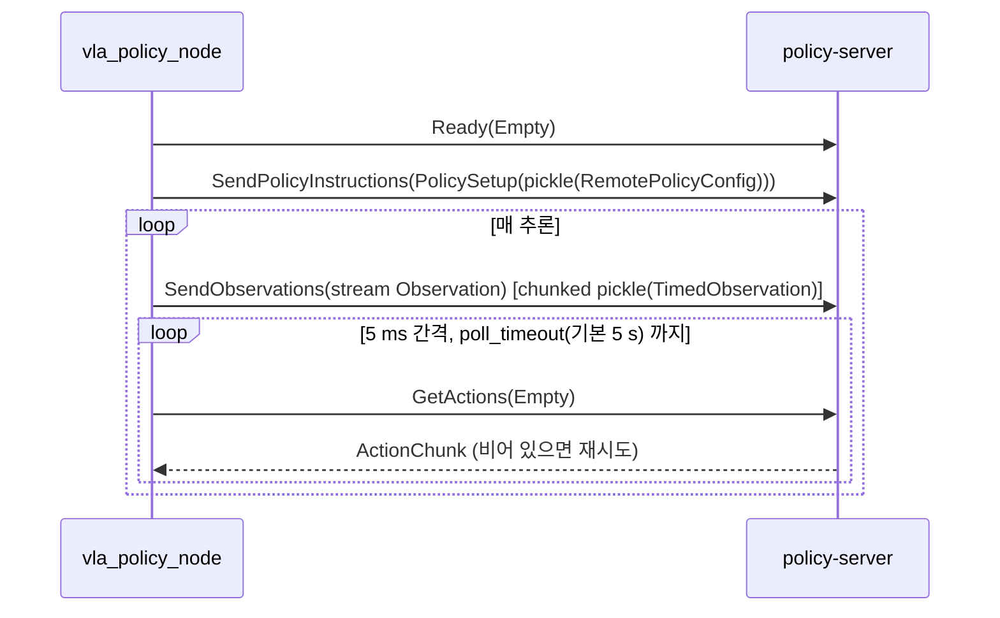

# 07. 인터페이스 명세 — ROS 2 · ZMQ · gRPC

> **정본**: `scripts/inference/run_cube_desk_ros_bridge.py`,
> `ros2_ws/src/so101_vla_policy/`, `scripts/datagen/pink_ik_bridge_node.py`,
> `scripts/cuRobo/`, `scripts/environments/teleoperation/so101_joint_state_server.py`.
> 페이로드 단위는 `04_IO_CONTRACT.md` 를 전제한다.

---

## 1. 인터페이스 지도

| 종류 | 엔드포인트 | 연결 |
|---|---|---|
| ROS 2 | `/isaac_joint_states` · `/isaac_joint_commands` · `/camera/{top,wrist,front}/image_raw` · `/clock` · `/tf` | isaac-sim bridge ↔ vla-ros / pink-ik |
| ZMQ REQ/REP | `tcp://127.0.0.1:5599` (JSON) | cuRobo planner ↔ pick-place SM |
| ZMQ PUB/SUB | `tcp://0.0.0.0:5556` (binary) | Windows leader → Linux sim teleop |
| gRPC | `<host>:8080` (pickle) | policy-server ↔ vla_policy_node(sim) / `scripts/inference/eef_robot_client.py`(실기기) |
| WebRTC | `:49100` | isaac-sim livestream → 원격 관전 |
| 파일 | `logs/demo_vla_reset.token` | bridge → vla_policy_node (에피소드 리셋 신호) |

전 서비스가 `network_mode: host` 라 컨테이너 간 통신이 전부 localhost 다(`06_RUNTIME_SPEC.md §2`).

---

## 2. ROS 2 토픽 계약

앵커: `scripts/inference/run_cube_desk_ros_bridge.py`

| 방향 | 토픽 | 타입 | 내용 | 주기 |
|---|---|---|---|---|
| pub | `/isaac_joint_states` | `sensor_msgs/JointState` | 6관절 position, **radian** | 매 playback tick |
| sub | `/isaac_joint_commands` | `sensor_msgs/JointState` | 6관절 target position, radian | 매 tick |
| pub | `/clock` | `rosgraph_msgs/Clock` | sim time | 매 tick |
| pub | `/tf` | `tf2_msgs/TFMessage` | parent `/World/Robot/base/base_link` → `Cube1..N`, `Bowl` | 매 tick |
| pub | `/camera/top/image_raw` | `sensor_msgs/Image` | `rgb8` 640×480 | render product |
| pub | `/camera/wrist/image_raw` | `sensor_msgs/Image` | 동일 | 동일 |
| pub | `/camera/front/image_raw` | `sensor_msgs/Image` | 동일 | 동일 |

camera frame_id: `top_camera_optical_frame` · `wrist_camera_optical_frame` ·
`front_camera_optical_frame`. `--no_cameras` 로 카메라 publish 를 끌 수 있다.

**서비스·ROS 파라미터는 없다.**

### 2.1 bridge 는 rclpy 노드가 아니다

`isaacsim.ros2_bridge` 의 **OmniGraph(C++) 노드**로 구성된다. 그래프 경로 `/ROSBridge`,
evaluator `execution`, tick 소스 `omni.graph.action.OnPlaybackTick`.

| OmniGraph 노드 | 역할 |
|---|---|
| `ROS2PublishJointState` | targetPrim `/World/Robot` |
| `ROS2SubscribeJointState` → `IsaacArticulationController` | 수신 target 을 직접 적용 |
| `ROS2PublishClock` + `IsaacReadSimulationTime` | |
| `ROS2PublishTransformTree` | 큐브·그릇 pose |
| `ROS2CameraHelper` ×3 | `type="rgb"` |

World 설정: `physics_dt = 1/120`, `rendering_dt = 1/30`, `backend = "numpy"`(CPU),
`stage_units_in_meters = 1.0`.

`--grasp_sweep` 모드에서는 ROS 그래프를 **생성하지 않는다**(물리 replay 전용).

### 2.2 actuator parity

bridge 는 학습 env 와 물리를 맞춘다. per-joint 값은 `--task` 로 로드한
`env_cfg.scene.robot.actuators` 에서 가져오고(단일 소스 = `assets/robots/lerobot.py`),
아래 상수는 **해당 joint 가 cfg 에 없을 때의 fallback** 이다.

| 상수 | 값 | 비고 |
|---|---:|---|
| `DRIVE_STIFFNESS` | 17.8 | fallback (cfg 값이 0일 때) |
| `DRIVE_DAMPING` | 0.6 | fallback |
| `ARM_EFFORT_LIMIT` | 10.0 | fallback |
| `GRIPPER_EFFORT_LIMIT` | **0.5** | gripper 는 항상 이 값으로 override |
| `ARM_MAX_JOINT_VEL` | 5.0 | |
| `GRIPPER_MAX_JOINT_VEL` | 2.5 | |

gripper 0.5 의 근거: 학습 env 의 런타임 clamp `clamp(mass/0.15, 0.5, 10)` 가 우리 큐브
(35·55 g)에서 항상 하한 0.5 로 클램프되므로 static 0.5 가 동치다(`03_ENV_SPEC.md §6.2`).

joint 최대속도를 5.0 / 2.5 로 두는 이유: bridge 는 OmniGraph 로 raw position 을 주입해
Python slew 를 걸 수 없다. 학습 데이터의 모션 envelope(빠른 close = 큐브 튕김 방지)를
**물리 joint 속도 상한**으로 강제한다.

> ⚠ 상수 주석의 "PickCubeEnvCfg actuator stiffness = 17.8" 은 **스테일**이다. 현 env 는
> per-joint 55/30/25/12/7/4 를 쓴다(`03_ENV_SPEC.md §6`). 코드 동작은 fallback 이라 무해.

---

## 3. `vla_policy_node` — VLA 추론 노드

앵커: `ros2_ws/src/so101_vla_policy/so101_vla_policy/vla_policy_node.py`

노드명 `vla_policy_node`. launch = `ros2 launch so101_vla_policy vla_policy.launch.py`.
콘솔 스크립트 진입점 = `so101_vla_policy.vla_policy_node:main`.

| 방향 | 토픽 | 타입 | QoS depth |
|---|---|---|---|
| sub | `${joint_states_topic}` (기본 `/isaac_joint_states`) | `sensor_msgs/JointState` | 10 |
| sub | `/camera/{top,wrist,front}/image_raw` | `sensor_msgs/Image` (`rgb8` 로 디코드) | 10 |
| pub | `${joint_commands_topic}` (기본 `/isaac_joint_commands`) | `sensor_msgs/JointState` (`name = SO101_JOINT_ORDER`, `position` = radian) | 10 |

제어 타이머 주기 = `1 / max(fps, 1)` (기본 **30 Hz**). 서비스 없음.

### 3.1 ROS 파라미터

우선순위 = **ROS param > env var > 코드 기본값**. 빈 문자열/0 이면 env 로 폴백한다.
설정 파일 = `ros2_ws/src/so101_vla_policy/config/vla_policy.yaml`.

| param | yaml | 코드 기본 | env 폴백 |
|---|---|---|---|
| `use_sim_time` | `true` | — | — |
| `env_file` | `/workspace/.env` | 동일 | — |
| `env_dir` | `/workspace/env` | 동일 | — |
| `server_address` | `""` | `127.0.0.1:8080` | `POLICY_SERVER_ADDRESS` |
| `policy_type` | `""` | `smolvla` | `POLICY_TYPE` |
| `pretrained_name_or_path` | `""` | `lerobot/smolvla_base` | `POLICY_REPO_ID` → `POLICY_BASE_MODEL_PATH` |
| `actions_per_chunk` | `0` | `8` | `ACTIONS_PER_CHUNK` |
| `task_instruction` | `""` | `pick up the cube and place it in the bowl` | `TASK` |
| `rename_map` | `""` | `{}` | `RENAME_MAP` (JSON) |
| `policy_device` | `""` | `cuda` | `POLICY_DEVICE` |
| `chunk_size_threshold` | `0.0` | `0.5` | `CHUNK_SIZE_THRESHOLD` |
| `vla_reset_file` | `""` | `""` | `VLA_RESET_FILE` |
| `command_slew_limit` | `false` | `False` | — |
| `arm_target_max_velocity` | `5.0` | `5.0` | — |
| `gripper_target_max_velocity` | `2.5` | `2.5` | — |
| `poll_timeout` | `5.0` | `5.0` | — |
| `fps` | `30` | `30` | — |
| `joint_states_topic` | `/isaac_joint_states` | 동일 | — |
| `joint_commands_topic` | `/isaac_joint_commands` | 동일 | — |

env 로드 순서: `.env` → `env/<POLICY_PROFILE>.env`(override). `.env` 를 먼저 읽어야 프로필의
`${HF_USER}` 보간이 풀린다. `pretrained` 에 미해결 `${...}` 가 남으면 경고를 낸다.

추가 env: `VLA_TRAJ_LOG` — 설정 시 매 tick `(timestep, state, action)` 을 **LeRobot 단위**로
JSONL append(open-loop overlay 와 직접 비교 가능).

### 3.2 제어 루프

```
_control_tick (30 Hz)
 ├─ _check_external_reset()      reset token 변경 시 큐·timestep·obs 캐시 폐기 후 즉시 return
 ├─ _ready()                     joint + 3-cam 전부 도착했나
 ├─ _merge_finished_inference()  완료된 future 를 큐에 병합 (generation 불일치 시 폐기)
 ├─ len(queue) <= refill_floor && inflight 없음  →  _start_inference()
 └─ queue.popleft() → 단위 변환 → clamp → (옵션 slew) → publish
```

- `refill_floor = max(1, int(actions_per_chunk × chunk_size_threshold))`
- 추론은 `ThreadPoolExecutor(max_workers=1)` 백그라운드. 제어 루프를 막지 않는다
- 병합 시 `timestep < 현재 timestep` 인 action 은 버린다
- `_inference_generation` 카운터로 리셋 전 추론 결과를 폐기한다

**`command_slew_limit`**(기본 off): 학습 env 의 `SlewLimitedJointPositionAction` 을 배포
경로에서도 재현한다. 데이터 action 자체는 slew-limited 지만 정책의 OOD 예측 점프까지
보장되지는 않으므로 **안전·정합 실험에서만** 켠다. per-step 상한 =
`arm_target_max_velocity / fps`, gripper 는 `gripper_target_max_velocity / fps`.

관절 재정렬: 수신 `JointState` 를 **이름 기준**으로 `SO101_JOINT_ORDER` 에 맞춘다
(bridge = articulation 순, 실기기 = 알파벳순 둘 다 처리). 이름 불일치는 5초 throttle 경고.

---

## 4. `pink_ik_bridge` — 결정적 pick-place SM 노드

앵커: `scripts/datagen/pink_ik_bridge_node.py`. 노드명 `pink_ik_bridge`.

| 방향 | 대상 | 타입 |
|---|---|---|
| sub | `/isaac_joint_states` | `sensor_msgs/JointState` (depth 10) |
| pub | `/isaac_joint_commands` | `sensor_msgs/JointState` (depth 10) |
| sub | `/camera/{top,wrist,front}/image_raw` (`--record` 시) | `sensor_msgs/Image` |
| tf | `lookup_transform("base_link", child)` — child ∈ `Cube1`, `Bowl` | tf2 |

타이머 = `1 / --hz` (기본 30 Hz). **ROS 파라미터를 선언하지 않는다** — 전부 argparse.
`--no-tf` 로 TF 조회를 끈다.

프레임 상수: `EE_FRAME = "gripper_frame_link"`, `TCP_FRAME = "tcp_grasp"`,
`BASE_FRAME = "base_link"`, `CUBE_FRAME = "Cube1"`, `BOWL_FRAME = "Bowl"`.

> ⚠ 이 경로는 cuRobo SM 으로 대체된 이전 세대다. 상세·현행 = `08_PIPELINES.md §5`.

---

## 5. DDS 설정

**모든 실행 경로가 동일하게 강제**한다:

```
RMW_IMPLEMENTATION=rmw_fastrtps_cpp
FASTDDS_BUILTIN_TRANSPORTS=UDPv4
```

이유: cross-UID `/dev/shm` 충돌 회피. 설정 지점 = compose(`vla-ros`·`pink-ik`) ·
`isaac-sim-entrypoint.sh` · `pink-ik-entrypoint.sh` · `vla-ros-entrypoint.sh` ·
bridge 파이썬(`os.environ.setdefault`) · `run_cube_desk_ros_bridge.sh`.

---

## 6. ZMQ — cuRobo planner ↔ pick-place SM

```
curobo-datagen 컨테이너                        isaac-sim 컨테이너
curobo_batch_planner.py                        pickplace_sm.py
  zmq.REP  bind("tcp://*:5599")   ◀── JSON ──   zmq.REQ  connect("tcp://127.0.0.1:5599")
```

in-process 공존이 불가능해 2-프로세스로 나뉘었다(warp ABI 충돌). 근거 =
`09_TACIT_KNOWLEDGE.md §7`.

### 6.1 메시지 스키마 (JSON)

| 요청 | 응답 |
|---|---|
| `{"cmd": "ping"}` | `{"ok": true}` |
| `{"cmd": "plan_pickplace", "cubes": [[x,y,z(,qw,qx,qy,qz)]×N], "bowl": [x,y] \| [[x,y]×N], "start": [[6 joint rad]×N](선택), "knobs": {...}(선택)}` | `{"ok": true, "trajectories": [[[6]×T] \| null ×N], "diagnostics": [...]}` |
| `{"cmd": "shutdown"}` | `{"ok": true}` + 종료 |
| 그 외 | `{"ok": false, "err": "unknown <cmd>"}` |

- `cubes` / `bowl` 좌표계 = **`base_link` frame**. quaternion 에서 face normal 을 직접 추출한다.
- `trajectories` 의 각 row = `[arm degree ×5, gripper feature[0,100]]` — SM 이
  `policy_feature_to_sim_joint_radians` 로 radian 변환한다(`04_IO_CONTRACT.md §2`).
- plan 실패 env 는 `null`.
- `knobs` 키: `grasp_z_off` · `grip_open` · `grip_close` · `bowl_pull` · `tau_max_deg` ·
  `rho_cap_deg` · `seed` · `transit_z`. SM 은 `--planner_knobs_json` 을 파싱해 전달하고
  `seed` 를 setdefault 한다.

### 6.2 수신 측 pump

SM 은 blocking recv 대신 `zmq.Poller`(2 ms timeout) 루프를 돌며 `simulation_app.update()` 를
호출한다 — 그러지 않으면 plan 대기 중 Isaac Sim GUI 가 얼어붙는다.

planner 진단 로그: `/workspace/outputs/planner_diag.log`.

---

## 7. ZMQ — leader teleop (cross-machine)

앵커: `scripts/environments/teleoperation/so101_joint_state_server.py` (Windows 측 PUB) ·
`src/sim_to_real/devices/lerobot/so101_leader_remote.py` (Linux 측 SUB)

| 항목 | 값 |
|---|---|
| 소켓 | `zmq.PUB`, `setsockopt(zmq.CONFLATE, 1)`, `bind` 기본 `tcp://0.0.0.0:5556` |
| 페이로드 | **`struct.pack("<6f", *values)`** = 24 byte, little-endian float32 ×6 |
| 순서 | `shoulder_pan, shoulder_lift, elbow_flex, wrist_flex, wrist_roll, gripper` |
| 값 단위 | arm `RANGE_M100_100`, gripper `RANGE_0_100` (= real leader 정규화) |
| 주기 | `--rate` 기본 50 Hz, `zmq.NOBLOCK` |
| 수신 | `--leader_endpoint` / env `LEADER_ENDPOINT`, device `so101leader_remote` |
| 캘리브레이션 캐시 | `scripts/environments/teleoperation/.cache/<arm_id>.json` (`--id` 기본 `leader_arm`) |

`CONFLATE=1` 이라 최신 1개만 유지된다 — 느린 소비자가 큐를 쌓지 않는다.
수신 측은 백그라운드 daemon 스레드 + lock 캐시를 쓴다. `SO101LeaderRemote.calibrate()` 는
`RuntimeError`(원격은 캘리브레이션 불가).

수신값 → sim radian 변환 = `04_IO_CONTRACT.md §3`.

---

## 8. gRPC — policy-server

| 항목 | 값 |
|---|---|
| 서버 bind | `${POLICY_SERVER_HOST:-0.0.0.0}:${POLICY_SERVER_PORT:-8080}` |
| 서버 구현 | stock `lerobot.async_inference.policy_server` 또는 `AffineAdapterServer`(`04_IO_CONTRACT.md §8`) |
| 스레드 | `grpc.server(ThreadPoolExecutor(max_workers=4))` |
| 클라 stub | `services_pb2_grpc.AsyncInferenceStub` |
| 채널 옵션 | `grpc_channel_options(initial_backoff="0.0333s")` |
| 페이로드 | **pickle** |

### 8.1 RPC 시퀀스



`RemotePolicyConfig = (policy_type, pretrained, lerobot_features, actions_per_chunk, policy_device, {})`.

### 8.2 ⚠ rename 은 **클라이언트가** 적용한다

`RemotePolicyConfig` 의 server `rename_map` 은 **항상 빈 dict** 다.

이유: LeRobot(0.5.1 이후 0.6.0 도 동일) 서버는 `raw_observation_to_observation` 의 resize 단계에서
`policy.config.image_features[key]` 를 `lerobot_features` 키로 조회하는데, 이 단계가
preprocessor rename **이전**이다. 따라서 `lerobot_features` 의 이미지 키가 모델 config 키
(SmolVLA = `camera1/2/3`)와 이미 일치해야 `KeyError` 가 나지 않는다.

⇒ 노드가 `RENAME_MAP` 을 읽어 **features 키와 obs 키를 모두** 정책 키로 바꿔 보낸다.

`lerobot_features` 구성:

| key | 값 |
|---|---|
| `observation.state` | `LEROBOT_FEATURES["observation.state"]` |
| `<rename 적용된 이미지 키>` | `{"dtype": "image", "shape": (480, 640, 3), "names": ["height","width","channels"]}` |

obs dict 에는 joint feature 6개(`*.pos` 스칼라) + 카메라 3개(bare 키) + `task` 문자열이 들어간다.

### 8.3 진단

10 콜마다 왕복 시간을 분해 출력한다: `total` = `obs_send` + `recv_wait`
(`recv_wait` = 서버 추론 + chunk 다운로드 + 5 ms poll granularity), 각각 min/mean/max.

### 8.4 보안

> ⚠ **payload 가 pickle 이다.** 신뢰할 수 없는 네트워크에 policy-server 를 노출하면
> 역직렬화 RCE 위험이 있다(`.env.example`·compose 주석에 CVE 경고). 전 서비스가
> `network_mode: host` 이므로 방화벽·바인드 주소를 반드시 확인할 것.

### 8.5 vendored 클라이언트

`vla-ros` 컨테이너에는 lerobot 을 설치하지 않는다 — import 체인이 transformers·datasets 까지
끌어와 컨테이너에 부적합하다. 대신 pickle 호환 shim 만 vendor 한다:

```
ros2_ws/src/so101_vla_policy/vendor/lerobot/
├── async_inference/helpers.py      (RemotePolicyConfig, TimedObservation)
└── transport/{services_pb2.py, services_pb2_grpc.py, utils.py}
```

경로는 entrypoint 가 `PYTHONPATH` 에 넣고, 미설정 환경 대비 노드가 `__file__` 기준으로도 보강한다.

---

## 9. WebRTC livestream

| 항목 | 값 |
|---|---|
| 포트 | `49100` |
| bridge 모드 | `--livestream 2` (native WebRTC) 하드코딩 |
| 원격 relay | `PUBLIC_IP` env → bridge 는 export, teleop 은 `--public_ip` 인자 |

> teleop 은 `--public_ip` 지정 시 livestream **mode 1** 로 강제 승격된다.
> `--livestream 2` 만 쓰면 LAN IP 만 광고돼 relay client 가 검은 화면을 본다.

---

## 10. 파일 IPC — VLA reset token

호스트 `logs/demo_vla_reset.token` ↔ 컨테이너 `/workspace/logs/demo_vla_reset.token`.

| 역할 | 동작 |
|---|---|
| writer (bridge) | reset 마다 `reset_generation += 1` → 파일에 `f"{n}\n"` |
| reader (`vla_policy_node`) | 문자열 변경 감지 → action 큐 clear · `_timestep = 0` · `_inference_generation += 1` · joint/이미지 캐시 및 `_last_target_rad` 폐기 |

캐시를 버리는 이유: 리셋 직전의 관측이 다음 에피소드 첫 추론에 섞이지 않게 하려는 것
(다음 ROS frame 의 home state·새 이미지만 쓴다).

---

## 참조

- 페이로드 단위·프레임 변환 → `04_IO_CONTRACT.md`
- 관측·액션의 출처 → `03_ENV_SPEC.md` §3, §4
- 포트·env var 를 어디서 설정하는가 → `06_RUNTIME_SPEC.md` §4, §5
- 인터페이스를 쓰는 워크플로 → `08_PIPELINES.md`
- 프로토콜 관련 함정 → `09_TACIT_KNOWLEDGE.md` §6, §8
