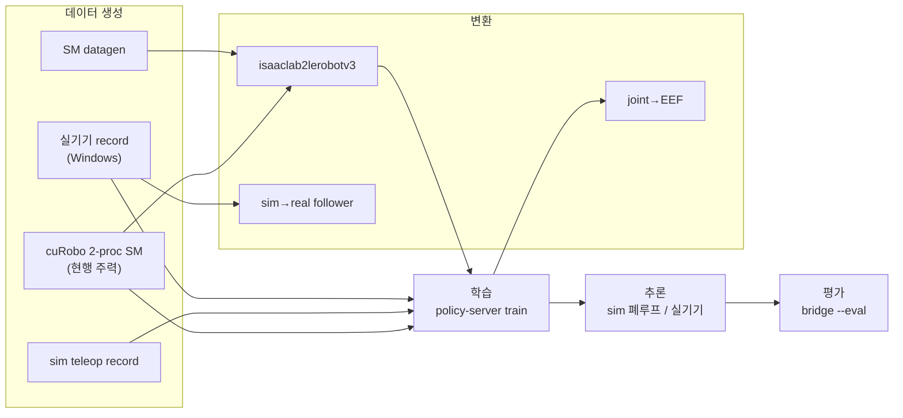

# 08. 파이프라인 명세 — 데이터 생성 · 학습 · 평가

> **정본**: `scripts/`, `docker/*-entrypoint.sh`.
> 각 절은 **입력 → 명령 → 출력 → 검증 → 알려진 함정** 5블록으로 서술한다.

---

## 1. 파이프라인 지도



### 무엇을 만들 때 어느 경로인가

| 목표 | 경로 |
|---|---|
| 대량 VLA 학습 데이터(sim, 결정적) | §5 cuRobo SM |
| 사람 시연 데이터(sim) | §4 sim teleop |
| 실기기 시연 데이터 | §2 실기기 record |
| 실기기 데이터를 sim 에서 replay | §7.2 + `04_IO_CONTRACT.md §4` |
| EEF-space 학습 데이터 | §7.3 |
| 정책 성능 수치 | §9 eval |

---

## 2. 실기기 record (Windows native uv)

**입력**: SO-101 leader + follower 직결, USB 카메라 3대
**명령**: `scripts/real/lerobot.sh <mode>` — `.env` + `env/<POLICY_PROFILE>.env` 를
`set -a` 로 로드한 뒤 변수를 CLI 인자로 매핑한다.

| 모드 | 실행 |
|---|---|
| `find-port` | `lerobot-find-port` |
| `setup-motors` | `lerobot-setup-motors <TARGET_ARGS>` |
| `calibrate` | `lerobot-calibrate <TARGET_ARGS>` |
| `teleop` | `lerobot-teleoperate <ROBOT> <TELEOP> <CAMERAS> $TELEOP_EXTRA_ARGS` |
| `record` | `lerobot-record … --dataset.repo_id/single_task/num_episodes/fps/episode_time_s/reset_time_s/push_to_hub $RECORD_EXTRA_ARGS` |
| `replay` | `lerobot-replay <ROBOT> --dataset.repo_id --dataset.episode $REPLAY_EXTRA_ARGS` |
| `policy-client` | **preflight → `python scripts/inference/eef_robot_client.py`** (stock `robot_client` 아님). 아래 §2.1 |
| `env` | 로드된 주요 변수 덤프(디버그) |
| `raw` | `uv run --active "$@"` |
| `help` / 빈 인자 | 헤더 주석 출력 |

`TARGET_ARGS` 는 `CALIBRATE_TARGET=teleop` 이면 teleop 3인자, 아니면 robot 인자다.
`CAMERAS` 인자는 `LEROBOT_NO_CAMERAS` 가 비어 있고 `ENABLED_CAMERAS`·`CAMERAS` 가 둘 다
있을 때만 붙는다. `LEROBOT_DRY=1` 이면 실행 대신 echo 한다.

실행 환경은 **전용 uv project** `scripts/real/pyproject.toml`
(`requires-python >=3.12,<3.13`, `lerobot[async,core_scripts,feetech]==0.6.0`)이다. 루트
Isaac 환경을 재사용하지 않는다 — 최초 1회 `uv sync --project scripts/real`, 이후 wrapper 가
항상 `uv run --project scripts/real` 로 실행한다.

### 2.1 `policy-client` — manifest 가 dispatch 를 결정한다

stock `python -m lerobot.async_inference.robot_client` 를 쓰지 않는다. 순서:

1. **preflight**: `scripts/inference/assert_checkpoint_representation.py --checkpoint
   "$POLICY_REPO_ID" --from-env --skip-kinematics --emit client_kind`.
   실패하면 client 를 띄우지 않는다(legacy checkpoint 는 migration 이 먼저다).
   `ACTION_REPRESENTATION_*` 환경 변수는 **override 가 아니라 assertion** 이며,
   client 종류는 **checkpoint manifest** 가 결정한다.
2. **dispatch**: 4 mode 모두 `scripts/inference/eef_robot_client.py` 를 거친다.
   - `eef_absolute` / `eef_relative` → FK/IK platform adapter + router (**IK 정확히 1회**)
   - `joint_absolute` / `joint_relative` → canonical joint feature 경계 (**IK 0회**)
3. **overlap 병합**: `--aggregate_fn_name=latest_only` 고정. EEF/Rot6D vector 를 elementwise
   평균하지 않고 **IK 이후 joint queue 에서** 병합한다. 다른 값을 주면 client 가 거부한다.
4. **안전 gate**: `--real_hardware_ik_validated="${EEF_IK_REAL_VALIDATED:-false}"`.
   `false` 면 FK/IK 와 target/metric 만 기록하는 **motor-off dry-run** 이다
   (`--eef_metrics_log="${EEF_REAL_METRICS_LOG:-}"`). 이 gate 는 **EEF IK 로 산출한**
   실기기 joint command 에만 적용되며, joint-space fallback 은 IK 를 거치지 않아 대상이
   아니다 — 대신 일반 하드웨어 안전 절차(작업자 입회·e-stop·감속·workspace 확인)로 통제한다.

계약 상세 = `docs/EEF_RELATIVE_ACTION_PIPELINE_SPEC.md`.

**출력**: LeRobot 데이터셋(v3), 옵션으로 HF push
**검증**: `python scripts/contract/validate_lerobot_schema.py <root>` (`05_DATA_SPEC.md §7`)

**함정**: `.env` 는 자동 로드되지 않는다 · `evdev` 는 Windows 미설치 ·
`--robot.type` 거부 시 robot config 선 import 또는 lerobot 0.4.5+ 필요.

---

## 3. sim teleop record

**입력**: 키보드 / 실 leader(직결 또는 ZMQ 원격)
**명령**:

```bash
uv run scripts/environments/teleoperation/teleop_se3_agent.py \
  --task SimToReal-SO101-PickCube-v0 --teleop_device keyboard \
  --record --record_format lerobot_v3 --dataset_dir datasets/so101_teleop_sim --enable_cameras
```

컨테이너 경로 = `isaac-sim-entrypoint.sh teleop` (`06_RUNTIME_SPEC.md §4.2`).

| 인자 | 기본 | 비고 |
|---|---|---|
| `--num_envs` | `1` | **1만 허용** |
| `--teleop_device` | `keyboard` | 실제 지원 = `keyboard` · `so101leader` · `so101leader_remote`. 그 외 `NotImplementedError` |
| `--leader_endpoint` | `tcp://localhost:5556` | cross-machine (`07_INTERFACES.md §7`) |
| `--record_format` | `lerobot_v3` | `hdf5` = 경량 action/state(카메라 없음) |
| `--dataset_dir` | `./datasets/so101_teleop_sim` | |
| `--step_hz` | `30` | |
| `--num_demos` / `--max_steps` | `0` / `0` | 0 = 무제한 |
| `--tune_cameras` | off | 3-cam docking viewport GUI 튜너 |
| `--layout` | `assets/layouts/pick_cube_3cam.json` | |
| `--public_ip` | `None` | 지정 시 livestream **mode 1** 로 강제 승격 |
| 카메라 override 9종 | `None` | `--top_pos/target/focal` · `--wrist_pos/rot/focal` · `--front_local_pos/rot/focal` |

**제약**: `--record` + `lerobot_v3` 인데 `--enable_cameras` 가 없으면 `ValueError`.
`--enable_cameras` 미지정 시 `remove_pick_cube_cameras(env_cfg)` 로 카메라·images 관측을
제거한다(`03_ENV_SPEC.md §2`).

**키 조작**: `B` = 제어 시작 · `N` = 성공 저장 후 리셋 · `R` = 폐기 후 리셋 · `Ctrl+C` = 종료.

**출력**: LeRobot v3 (직기록) 또는 HDF5
**함정**: focal 은 USD `focalLength` attr 를 만져도 `TiledCamera` 렌더에 반영되지 않는다 —
cfg 로 지정해야 한다.

---

## 4. State Machine datagen (leisaac 방식)

**입력**: env DR 배치
**명령**:

```bash
python scripts/datagen/record_state_machine.py \
  --task SimToReal-SO101-PickCube-v0 --num_demos 10 --dataset_dir datasets/so101_pick_cube_demos
```

컨테이너 = `isaac-sim-entrypoint.sh datagen`.

| 인자 | 기본 |
|---|---|
| `--num_envs` | `1` |
| `--task` | `SimToReal-SO101-PickCube-v0` |
| `--seed` | `None` |
| `--step_hz` | `60` |
| `--dataset_dir` | `./datasets/so101_pick_cube_demos` |
| `--num_demos` | `1` (0 = 무한) |
| `--headless` | off |

**동작**: SM 이 8D IK pose 를 생성 → IsaacLab DLS IK 가 풀이 → solved joint target 을
LeRobot v3 로 기록(joint-space, VLA·실기기 호환). action cfg 는
`src/sim_to_real/datagen/sm_actions.py::StateMachineActionsCfg` 로 교체된다(`03_ENV_SPEC.md §4.2`).

**재생**: `python scripts/datagen/replay_state_machine.py --replay_mode {action,state}
--select_episodes N …`

**함정**: `PickCubeStateMachine` 의 기본 `num_cubes=4` 인데 활성 큐브는 1개다
(`CUBE_NAMES = ['Cube1']`) — `num_cubes > 1` 은 IndexError 경로다.
`09_TACIT_KNOWLEDGE.md §9` 참조.

---

## 5. cuRobo 2-proc pick-place SM (현행 주력)

### 5.1 토폴로지

```
curobo-datagen 컨테이너                       isaac-sim 컨테이너
curobo_batch_planner.py                       pickplace_sm.py
  cuRobo v0.8 batch motion planner              IsaacLab pick_cube env
  ZMQ REP  tcp://*:5599        ◀── JSON ──▶     ZMQ REQ  tcp://127.0.0.1:5599
```

in-process 공존이 불가능해 2-프로세스로 나뉘었다(`09_TACIT_KNOWLEDGE.md §7`).
프로토콜 = `07_INTERFACES.md §6`.

### 5.2 planner 설정

| 항목 | 값 |
|---|---|
| robot cfg | `/workspace/assets/robots/so101.yml` — **54 sphere / 9 link** |
| tool frame | `tcp_grasp` (`04_IO_CONTRACT.md §5.2`) |
| `--port` | `5599` |
| `--max_batch_size` | `64` — batch index = collision env index |
| `max_goalset` | `max(K=40, len(ALPHA_SCAN_DEG)=21)` = 40 |
| solver | `num_ik_seeds=64`, `num_trajopt_seeds=8`, `multi_env=True`, `use_cuda_graph=False` |
| warmup | `enable_graph=False`, `num_warmup_iterations=2` |
| 진단 로그 | `/workspace/outputs/planner_diag.log` |

요청 env 수가 `max_batch_size` 와 다르면 planner 를 destroy 후 재생성한다.

world obstacle: 그릇 hollow ring 8× cuboid + `"cube"`(per-request pose 주입).
**책상은 obstacle 이 아니다** — base sphere 가 상판 안에 있어 전 plan 이 start-collision 이 된다.

주요 상수:

| 상수 | 값 | 의미 |
|---|---|---|
| `BASE_YAW` / `BASE_T` | `90.0°` / `(0.01576, -0.02079, -0.03248)` | USD → URDF 프레임 보정 |
| `PAN_AXIS_XY` | `(0.0388353, 0.0)` | URDF 기준 pan 축 |
| `ARM_LIMITS` (rad) | `(-1.91986, 1.91986)` `(-1.74533, 1.74533)` `(-1.69, 1.69)` `(-1.65806, 1.65806)` `(-2.74385, 2.84121)` | |
| `TCP_TWIST_RY` | `-0.0486795` | 2.79° cone 보정 |
| `ALPHA_SCAN_DEG` | `0, ±5, ±10, … ±50` (21개, ± interleave) | grasp 후보 스캔 |
| `TAU_MAX_DEG` / `RHO_CAP_DEG` | `10.0` / `12.0` | knobs 로 override 가능 |
| `CHORD_CENTER_RATIO` | `0.5` | 대각 yaw chord miss 반 보정 |
| `GRASP_Z_OFF` / `TABLE_MARGIN` | `-0.008` / `0.004` | |
| `LIFT_BACK` / `TRANSIT_Z` / `BOWL_PULL` | `0.10` / **`0.21`** / `0.03` | |
| `PRE_BACK_MIN/MAX` · `R0/R1` | `0.06` / `0.12` · `0.13` / `0.24` | r 적응 선형보간 |
| `GRIP_OPEN` / `GRIP_CLOSE` / `GRIP_INIT` | `75.0` / `5.0` / `0.0` | feature `[0,100]` |
| `CLOSE_STEPS` / `GRASP_HOLD_STEPS` / `OPEN_STEPS` / `SETTLE_STEPS` | `5` / `5` / `10` / `5` | |
| `BOWL_RING_N` / `RC` / `H` | `8` / `0.080` / `0.075` | 그릇 keep-out ring |
| `CUBE_HALF` / `CUBE_DIMS` | `0.02` / `0.05` | ⚠ 40 mm 하드코딩 |

`GRIP_OPEN=75` 인 이유: 60 은 tangential 3 mm 오차에서 큐브가 튀어나간다(straddle 마진).

### 5.3 6-phase 궤적 조립

```
① approach   gripper GRIP_INIT → GRIP_OPEN linspace
② grasp      descend @OPEN → close_hold(5, OPEN→CLOSE linspace) → grasp_hold(5) @CLOSE
③ lift       @CLOSE
④ transit    @CLOSE → settle_hold(5)
⑤ release    open_hold(10, CLOSE→OPEN linspace)
⑥ retreat    gripper GRIP_OPEN → GRIP_INIT linspace
```

출력 = `(T, 6)` float32 = arm degree ×5 + gripper feature.
**place-descent 는 제거됐다**(release-above-bowl) — 깊은 linear 하강은 pad 가 동적 그릇을
밀어냈다. `TRANSIT_Z` 로 그릇 위에 옮긴 뒤 `SETTLE_STEPS` hold 후 개방한다.
드롭 XY 는 그릇 중심에서 base 쪽으로 `BOWL_PULL` 만큼 당긴다.

collision 구성(cuRobo 정석): target 큐브 = world obstacle → grasp 후 attach 로 큐브 blob 을
`attached_object`(= `tcp_grasp` 동일 프레임)에 부착 + `"cube"` disable → transit 은 잡은 큐브
부피를 포함해 계획 → release 직전 detach.

### 5.4 SM 실행

`pickplace_sm.py` 는 **서브커맨드 필수**다: `random` · `fail` · `sweep`.

공통 인자:

| 인자 | 기본 |
|---|---|
| `--task` | `SimToReal-SO101-PickCube-DR-v0` |
| `--planner` | `tcp://127.0.0.1:5599` |
| `--num_envs` | `1` |
| `--grasp_z` | `0.06` (robot-base frame, m) |
| `--settle` | `5` (reset 후 물리 step) |
| `--bowl_tol` | `0.06` (성공 xy 반경, m) |
| `--seed` | `0` |
| `--planner_knobs_json` | `None` |
| `--log_every` | `1` (0 = 끔) |
| `--cam_eye` / `--cam_target` | `[0.2, 0.8, 1.2]` / `[0.0, 0.1, 0.7]` |

AppLauncher 화이트리스트: `headless, livestream, enable_cameras, device, kit_args, experience, rendering_mode`
(`09_TACIT_KNOWLEDGE.md §6`).

**초기 자세** — `env_cfg.scene.robot.init_state.joint_pos` 를 override 하고
`reset_robot_joints` jitter 를 0으로 만들어 **frame 0 부터** 이 자세로 스폰한다
(중립→init 이동 transient 제거, settle 도 이 자세를 hold):

| joint | degree |
|---|---:|
| `shoulder_pan` | 0 |
| `shoulder_lift` | −100 |
| `elbow_flex` | 90 |
| `wrist_flex` | 50 |
| `wrist_roll` | **−90** |
| `gripper` | −10 |

> `03_ENV_SPEC.md §6.1` 의 env 기본 init(`wrist_flex 70`, `wrist_roll -100`)과 다르다.
> SM 이 실행 시 override 한다.

**인터랙티브 키**(livestream 필요): `N` = 새 DR 레이아웃 · `R` = 같은 레이아웃 재현 ·
`B` = plan 요청 + 실행. 동작 중 `R`/`N` 은 남은 동작을 취소하고 재배치한다.

**non-record env 구성**: 카메라 제거 · 시각 DR 제거 + `replicate_physics=True` 복원 ·
`success`/`cube_lost` termination `None`(transit 중 그릇 상공 통과 시 오발화 방지).

### 5.5 서브커맨드

| 서브커맨드 | 인자 | 용도 |
|---|---|---|
| `random` | `--auto_trials`(0=인터랙티브) · `--record_viewport_dir` · `--summary_dir` · `--record_fps`(30) · `--record_every`(1) · `--record_hdf5` · `--record_lerobot` · `--task_description` · `--preroll_s`(2.0) · `--posthold_s`(1.0) | 랜덤 DR 시행 · 데이터 녹화 |
| `fail` | `--results`(**필수**) · `--auto` | sweep 실패 셀 재현 |
| `sweep` | `--nx`(15) · `--ny`(8) · `--boundary_n`(20) · `--trials`(1) · `--yaw`(`"0"` 또는 `random`) · `--out` | 스폰 영역 정량 평가 |

`sweep` 은 `spawn_area.sweep_targets` 로 타깃을 만들고(`03_ENV_SPEC.md §11.4`) `num_envs`
단위 chunk 로 돈다. 셀 레코드 = `{x, y, kind, n, n_planned, n_placed, fails[]}`.
결과 JSON 은 증분 저장(중단 안전)된다. 시각화 = `python scripts/cuRobo/plot_sweep.py --results …`.

`fail --auto` 는 sweep JSON 에서 `n_placed < n` 인 셀을 `(y, x)` 정렬해 케이스별로 재현한다.

### 5.6 녹화 2종

**상호배타** — 동시 지정 시 SystemExit.

| | `--record_hdf5` | `--record_lerobot` |
|---|---|---|
| 포맷 | IsaacLab HDF5 → 사후 변환 | LeRobot v3 즉시 |
| recorder | `SO101DatagenRecorderManagerCfg`, `EXPORT_ALL`, `export_in_close=False` | `SO101LeRobotRecorderManager` |
| multi-env | ✓ env 당 1 demo | ✗ **`--num_envs 1` 전용** |
| 저장 범위 | 실패 포함(`success` attr) | **성공만** |
| 기존 디렉터리 | append 계열 | **덮어씀**(`overwrite=True`) |
| 메모리 | 에피소드 동안 **VRAM** 누적 (~1 GiB/env/에피소드) — 16 env 34.9 GB 피크 | step 마다 CPU 스트리밍 |
| 압축 | `lzf` + frame-chunk (`hdf5_compression.hdf5_handler`) | LeRobot v3 비디오 인코딩 |

**HDF5 키** = `obs_x/joint_pos` · `obs_x/images/{top,wrist,front}` · `applied_target`
(변환기가 소비) + `actions` · `initial_state`. stock `states`·`obs`·`processed_actions` 는
읽는 코드가 없어 꺼져 있다(`SO101DatagenRecorderManagerCfg`). `actions` 는 demo attrs
`num_samples` 산출에 필요해 남긴다.

**압축**: IsaacLab 기본 gzip(4) 대신 `lzf` + 프레임 단위 청크. export 가 env 순차 blocking
이라 `--num_envs` 에 비례해 심 루프를 세우는 구간이다 — 실측 10.8 → 3.7 s/demo, 디스크는 2배.
프리셋 표와 선택 근거 = `09_TACIT_KNOWLEDGE.md` §13.2.

**권장 `--num_envs 16`** — 구성마다 64 에피소드를 생성하고 v3 변환까지 마친 실측
(48.9 GB GPU 유휴, 전 구성 64/64 성공):

| num_envs | 1 | 2 | 4 | 8 | **16** |
|---|---|---|---|---|---|
| s/에피소드 | 31.6 | 27.3 | 24.2 | 16.8 | **13.8** |
| VRAM 피크 | 9.7 GB | 11.4 GB | 14.7 GB | 22.1 GB | 34.9 GB |

1000 에피소드 = 16-env 기준 **3.8 h**(1-env 8.8 h). 변환 196 s/64 ep 는 `num_envs` 와
무관한 상수라 총시간의 22%를 차지한다 — 생성과 겹치면 3.0 h. 상세·32-env 미측정 사유 =
`09_TACIT_KNOWLEDGE.md` §13.6.

**공통 요구**: `--auto_trials N > 0` · `--enable_cameras` (없으면 SystemExit).

**에피소드 규격**: 정지 `preroll_s`(2 s) → pick-place → init 복귀 → 정지 `posthold_s`(1 s).
종료는 termination 이 자동 판정한다(`returned_home_after_motion` +
`placed_and_returned`). **플래닝 대기 구간은 기록되지 않는다** — plan ZMQ 블록 중엔
`env.step` 을 돌리지 않는다.

트라이얼 루프: plan → `rm.reset()`(settle·꼬리·cold-start 프레임 폐기) → `initial_state` 기록 →
preroll hold → 궤적 replay → posthold 대기(guard 1200 step) → plan-fail env 강제 리셋.
종료 시 `summary.json`(`task`·`num_envs`·`base_seed`·record 경로·`preroll_s`·`posthold_s`·`trials[]`)을
`--summary_dir` 또는 `/workspace/scratch/curobo-auto-trials` 에 남긴다.

> 트라이얼 단위 seed 재현이 없다 — run 전체 `--seed` 1회 후 RNG 가 연속된다
> (비-record `random` 경로는 trial 별 `seed + i - 1` 사용).

### 5.7 정량 성능 사다리

| phase | 성공 |
|---|---|
| baseline yaw0 (구 spawn 187셀) | 165/187 = **88%** (base_arc 68% · bell 68%) |
| +R1 R2 R3 yaw0 | 178/187 = **95%** (bell 68→100%) |
| +pan축 spawn 가드 +R2′ yaw0 (183셀) | **183/183 = 100%**, 회귀 0 (base_arc 68→100%) |
| +rho-cap yaw-random ×3 | 1300/1305 = **99.62%** |
| 54-sphere 재평가, chord 보정 전 yaw0 / random×3 | 182/183 = 99.45% / 1298/1305 = 99.46% |
| **+chord-center 0.5× + grasp hold, yaw0 / random×3** | **183/183 = 100%** / **1305/1305 = 100%** |
| **+책상 높이·grasp 조준 z 정합(2026-07-29), yaw0 / random×3** | **124/124 = 100%** / **372/372 = 100%** |

pan축 spawn 좌표 수정(마운트 원점 → pan축)이 `base_arc` 를 68→100% 로 견인했다 —
도달 불가한 −x corner 가 스폰 영역에서 배제돼 셀이 187→183 으로 줄었다
(`09_TACIT_KNOWLEDGE.md §3`).

`RHO_CAP` 을 18°로 키우면 실패 8건 중 8건이 풀리지만 64-env 첫 planning 이 약 17분으로
느려진다. 12° 유지 + chord 0.5× 보정으로 같은 결과를 얻었다.

마지막 행은 셀 수가 다르다(183 → 124) — spawn_area 가 pan축 기준으로 바뀐 뒤의 기본
`sweep` 파라미터(`nx=15 ny=8 boundary_n=20`) 기준이다. 옛 183셀 baseline 은 재현 불가라
**같은 파라미터끼리만** 비교한다. 정합 근거 = `09_TACIT_KNOWLEDGE.md` §14.

최종 산출물: `scratch/2026-07-22-curobo-sm-model54-final/`.

---

### 5.8 대량 생성 — 생성·변환 파이프라이닝

**`scripts/cuRobo/generate_dataset.sh [TOTAL_EP] [NUM_ENVS] [BATCH_EP] [OUT_ROOT]`**
(기본 `1000 16 64 datasets/so101_pickplace_pipelined`)

생성은 GPU(isaac-sim), 변환은 CPU(호스트 `.venv` + ffmpeg)라 자원이 겹치지 않는다.
`--record_hdf5` 를 배치로 쪼개고 **배치 N 생성 중에 배치 N-1 변환을 백그라운드로** 돌린다.

```
생성 b0 ──▶ 생성 b1 ──▶ 생성 b2 ──▶ …
            변환 b0 ──▶ 변환 b1 ──▶ …
```

| | 직렬 | 파이프라인 |
|---|---|---|
| 1000 ep wall-clock | 3.83 h | **2.98 h** |
| HDF5 디스크 피크 | 375 GB(전 배치) | **~48 GB**(in-flight 2배치) |

변환이 배치당 196 s 인데 생성이 686 s 라 마지막 배치분만 남고 전부 숨는다(§13.6).
planner 는 전 배치 공용으로 **1회만** 기동한다(배치마다 재기동 = init 6 s 낭비).

**e2e 실측** (2026-07-29, 64 ep × 3 배치 × 16-env, 192/192 성공):

| | 값 |
|---|---|
| 생성 | 689 + 700 + 739 = 2128 s |
| **총 wall-clock** | **2325 s** |
| 직렬이었다면 | 2128 + 3×202 = 2734 s |
| **숨은 시간** | **409 s ≈ 변환 2회분** — 설계대로 마지막 1회만 노출 |
| **HDF5 디스크 피크** | **48.4 GB** (in-flight 2배치) · 종료 시 잔여 0 |
| 산출 | 192 ep · 71,228 frame · v3 3개, `validate_lerobot_schema.py` 전부 PASS(오류 0·경고 0) |

겹침 중 변환은 207 s 로 단독(196 s) 대비 **+5.6%** 다 — 생성이 GPU, 변환이 CPU(14 코어 중
load 4.5)라 경합이 사실상 없다.

**HDF5 수명**: 변환 성공(`meta/info.json` 의 `total_episodes > 0`)을 확인한 배치만 삭제한다.
변환·생성이 실패하면 해당 HDF5 를 **보존하고 크게 알린다** — 조용한 삭제 금지.
종료 시 보존 목록을 출력한다.

**산출**: `OUT_ROOT/v3/batch_NNN/` — 배치당 v3 데이터셋 1개. `LeRobotV3DatasetWriter` 가
append 를 지원하지 않아(기존 디렉터리면 `FileExistsError`, `overwrite=True` 면 `rmtree`)
하나로 못 모은다.

#### 하나의 데이터셋이 필요하면

**권장 = 변환기에 전 배치를 한 번에 먹인다.** 변환기는 쉼표 구분 복수 HDF5 를 받아
단일 v3 를 만든다 — 인덱스·비디오·통계가 전부 정합한다.

```bash
python scripts/convert/isaaclab2lerobotv3.py     --hdf5_files "$(ls -1 OUT_ROOT/hdf5/*.hdf5 | paste -sd,)"     --output_dir OUT_ROOT/v3_merged --overwrite
```

단 이 경로는 **HDF5 를 전부 남겨야** 한다(1000 ep = 375 GB). 파이프라인의 디스크 이점과
상충하므로, 디스크가 넉넉할 때만 쓴다. 배치 삭제를 끄려면 스크립트의 `rm -f "$CONV_H5"` 를
막으면 된다.

**사후 병합은 자동 도구가 없다**(`scripts/data/` 에 배치 병합기 없음). 수동으로 하려면
v3 레이아웃상 아래를 전부 맞춰야 한다 — 단순 파일 복사로는 깨진다:

| 대상 | 해야 할 일 |
|---|---|
| `videos/observation.images.{cam}/chunk-000/file-000.mp4` | 카메라마다 mp4 **1개에 전 에피소드가 연결**돼 있다. ffmpeg concat(동일 코덱이라 stream copy 가능) |
| `data/chunk-000/file-000.parquet` | `episode_index`·`index` 를 앞 배치 누적분만큼 offset |
| `meta/episodes/chunk-000/file-000.parquet` | `episode_index`·`dataset_from_index`·`dataset_to_index` offset |
| `meta/info.json` | `total_episodes`·`total_frames` 합산 |
| `meta/stats.json` | 전체 프레임 기준 재계산(배치 평균을 그대로 평균내면 틀린다) |
| `meta/tasks.parquet` | 단일 task 라 그대로 복사 |

**검증**: `python scripts/contract/validate_lerobot_schema.py <v3_dir>` (오류 0 · 경고 0).

---

## 6. pink IK pick-place SM (이전 세대)

`scripts/datagen/pink_ik_bridge_node.py` — pink(Pinocchio) 미분 IK 로 결정적 pick-place 궤적을
만들어 bridge 를 직접 구동한다. VLA 를 경유하지 않는다.

3 실행 모드: `--self-check`(오프라인 기하 검증) → `--sweep`(kinematic 도달 map + CSV) →
ROS 노드(기본). `--gen-traj OUT.json` 으로 dense 궤적을 뽑아 bridge `--grasp_sweep` 으로
물리 검증할 수 있다. `--record` 로 폐루프 궤적 1 에피소드를 LeRobot v3 로 남긴다.

SM 시퀀스(코드 기준): `pan_align → pre_grasp → descend → approach → grasp → lift → transit
→ release → home`. **retreat 단계는 제거됐다.**

> ⚠ `docs/PINK_IK_PICKPLACE.md` §5·§8 은 스테일이다(7 waypoint + retreat 기술).
> 현행은 위 시퀀스이며 `--ori-cost` 기본값도 문서 0.5 ≠ 코드 1.0 이다.
> `09_TACIT_KNOWLEDGE.md §9 INC-05, INC-06`.

주요 인자(전부 argparse, ROS param 없음): `--hz`(30) · `--base-yaw-deg`(**90**) ·
`--wrist-roll-deg`(−99) · `--ori-cost`(1.0) · `--tcp-dx/dy/dz`(−0.003 / −0.019 / −0.042) ·
`--tau-max-deg`(10) · `--alpha-max-deg`(45) · `--alpha-step-deg`(5) · `--grip-open/close`(47 / 5) ·
`--bowl-pull`(0.03) · `--lift`(0.085) · `--bowl-z`(0.113) · `--table-z`(0.030) ·
`--jaw-floor-clear`(0.010) · `--jaw-tip-drop`(0.02).

`--base-yaw-deg 90` 이 핵심이다 — URDF base 가 USD base 보다 z 축으로 90° 어긋나 있다
(`09_TACIT_KNOWLEDGE.md §3`).

---

## 7. 변환

### 7.1 HDF5 → LeRobot v3

```bash
python scripts/convert/isaaclab2lerobotv3.py \
  --hdf5_files datasets/pick_cube_sm.hdf5 --output_dir datasets/pick_cube_sm_v3
```

env-free(Isaac·lerobot 불요). 상세 = `05_DATA_SPEC.md §6.1`.
검증 = `python scripts/contract/validate_lerobot_schema.py <output_dir>`.

### 7.2 sim frame → real follower frame (**in-place**)

```bash
python scripts/convert/sim_dataset_to_real_follower.py --self-check
python scripts/convert/sim_dataset_to_real_follower.py --dataset_dir <dir> --convert both
```

> ⚠ 실기기 replay 는 잘못된 관절 타깃 = 충돌 위험이다. **e-stop 준비 후 실행**.

### 7.3 joint → absolute EEF

```bash
uv run python scripts/convert/joint_dataset_to_eef.py \
  --input-dir datasets/pick_cube_joint_v3 --output-dir datasets/pick_cube_eef_v3 \
  --source-domain sim [--rotation-representation rot6d|rpy|wxyz] [--keep-joints]
```

`--source-domain` 은 **자동 판별하지 않으므로 반드시 명시**한다. 상세 = `05_DATA_SPEC.md §6.3`.

### 7.4 사후 ops

`scripts/data/append_sim_episode.py`(에피소드 append) ·
`scripts/data/upload_to_huggingface.py`(HF 업로드 + `codebase_version` 태그).

---

## 8. 학습

**입력**: LeRobot v3 데이터셋(로컬 `DATASET_ROOT` 또는 `HF_DATASET_REPO_ID`)
**명령**:

```bash
# .env 의 POLICY_PROFILE 로 모델 선택 (smolvla | act | groot_n17)
docker compose --env-file .env -f docker/docker-compose.yaml run --rm policy-server train
```

출발 모델 라우팅과 env var 전체 = `06_RUNTIME_SPEC.md §4.1, §6`.

**출력**: `outputs/train/${JOB_NAME}/checkpoints/last/pretrained_model`
**함정**: `--policy.path` 와 `--policy.type` 동시 지정 금지 · `COMPILE_MODEL=true` +
`groot` 조합은 자동 skip · 세 정책 모두 `lerobot_v060_eef_relative_patch.py` 가 적용된
`policy-server:0.6.0` 이미지에서만 schema v2 manifest 를 만든다.

---

## 9. 추론·평가

### 9.1 sim 폐루프

```bash
docker compose --env-file .env -f docker/docker-compose.yaml up policy-server isaac-sim vla-ros
# 또는
scripts/inference/demo_vla.sh start groot --cubes 1 --gui
```

배선·옵션 = `06_RUNTIME_SPEC.md §9`, 프로토콜 = `07_INTERFACES.md`.

### 9.2 closed-loop 평가

`run_cube_desk_ros_bridge.py --eval N` — N 에피소드 성공률을 측정해 JSON 으로 남긴다.

| 인자 | 기본 |
|---|---|
| `--eval` | `0` (>0 이면 eval 모드) |
| `--eval_seconds` | `30.0` |
| `--eval_settle` | `1.5` |
| `--eval_warmup` | `25.0` |
| `--eval_out` | `outputs/vla_eval.json` |
| `--eval_bowl_kinematic` | off |
| `--eval_bowl_friction` `(STATIC, DYNAMIC)` | `None` |
| `--eval_bowl_mass` | `0.0` (0 = USD 기본) |
| `--dump_obs` | `""` (ep0 3-cam + joint 덤프) |
| `--vla_action_parity` | off |
| `--vla_reset_file` | `""` |

재현성이 가장 높은 조합은 `--task SimToReal-SO101-PickCube-Eval-v0`(DR-off + 디바운스
성공)이다. DR 하 성공률은 `-DR-Eval-v0`.

bridge 기타 인자: `--num_cubes {1,2,3,4}`(기본 4) · `--cube_name` · `--dr`(`-DR` task 면 자동 on) ·
`--seed`(0) · `--no_cameras` · `--view_eye`/`--view_lookat` · `--layout` ·
`--grasp_sweep TRAJ.json`(+`--grasp_sweep_out`, `--grasp_settle`).
인터랙티브 키: `R` = 동일 seed 리셋 · `N` = 무작위 seed 리셋.

> ⚠ **성공 판정 z 기준에 잠복 결함이 있다** — `03_ENV_SPEC.md §10.3`,
> `09_TACIT_KNOWLEDGE.md §9 INC-10`. eval 수치를 해석하기 전에 반드시 확인할 것.

### 9.3 replay 기반 진단

`scripts/inference/replay_dataset_to_bridge.py` — 데이터셋·npz·시퀀스 JSON 1 에피소드를
`/isaac_joint_commands` 로 재생한다.

| 인자 | 기본 | 비고 |
|---|---|---|
| `--dataset` / `--episode` | `None` / `1` | HF repo id 또는 로컬 |
| `--source` | `action` | `action` \| `state` |
| `--arm_mapping` | `codec` | `codec`(1:1 degree) · `calibration`(leader) · **`follower`**(실기기 녹화 replay 권장) |
| `--ramp_in` | `1.5` | 현재 자세 → 첫 frame 보간(teleport 방지) |
| `--probe_tracking` | off | 추종 오차 측정 |
| `--record_dir` / `--record_task` | `None` / 기본 task | achieved 궤적 기록 |
| `--fps` / `--loop` / `--wait_for_subscriber` / `--start_delay` | `0`(dataset fps) / off / off / `0.0` | |

---

## 10. 검증 진입점 전수

테스트 스위트·lint config 가 없다. 대신 **스크립트 내장 self-check** 가 검증 수단이다.

| 진입점 | 명령 | 보증 | 런타임 |
|---|---|---|---|
| `scripts/contract/validate_so101_io_contract.py` | 인자 없음 | codec·ROS 어댑터·action queue·snapshot 4-validator (`04_IO_CONTRACT.md §9`) | CPU |
| `scripts/contract/validate_lerobot_schema.py` | `<root>` 또는 `--self-test` | 데이터셋 v3 스키마 (`05_DATA_SPEC.md §7`) | CPU(pyarrow) |
| `scripts/contract/replay_so101_policy_snapshot.py` | `<snapshot.npz>` | 스냅샷 재현 대조 | CPU(+gRPC) |
| `src/so101_contract/follower_calibration.py` | `python3 <파일>` | affine round-trip·fit 복원 4종 | CPU |
| `src/sim_to_real/tasks/pick_cube/spawn_area.py` | `python3 <파일>` | 스폰 마스크·타깃 불변식 | CPU |
| `src/sim_to_real/tasks/pick_cube/mdp/observations.py` | `python3 <파일>` | grasp hysteresis 6케이스 | CPU(torch) |
| `scripts/convert/sim_dataset_to_real_follower.py` | `--self-check` | arm offset 부호·배치 정합 | CPU |
| `scripts/convert/joint_dataset_to_eef.py` | `--self-check` | 합성 sim/real 전체 변환·회전 3표현 round-trip | CPU |
| `scripts/datagen/pink_ik_bridge_node.py` | `--self-check` | yaw-comp 기하 + plan 7케이스 | CPU |
| `scripts/cuRobo/curobo_batch_planner.py` | `--self-check-geom` | 후보 생성 기하(GPU 불요) | CPU |
| `scripts/cuRobo/curobo_batch_planner.py` | `--self-test` | 고정 4-env plan | **GPU** |
| `scripts/cuRobo/plot_sweep.py` | `--demo` | 합성 데이터 렌더 파이프라인 | CPU |
| `docker/lerobot_v060_eef_relative_patch.py` | 빌드 시 자동 | LeRobot 0.6.0 source 멱등 패치 + 버전 트립와이어 | 빌드 |

추가로 `python scripts/environments/list_envs.py` 로 등록 env 를 확인할 수 있다(headless).

---

## 참조

- 환경 구성·DR → `03_ENV_SPEC.md`
- 데이터 스키마 → `05_DATA_SPEC.md`
- 서비스·env var → `06_RUNTIME_SPEC.md`
- 프로토콜 → `07_INTERFACES.md`
- 각 파이프라인의 함정 → `09_TACIT_KNOWLEDGE.md`
- cuRobo SM 사용법 상세 → `scripts/cuRobo/README.md`
